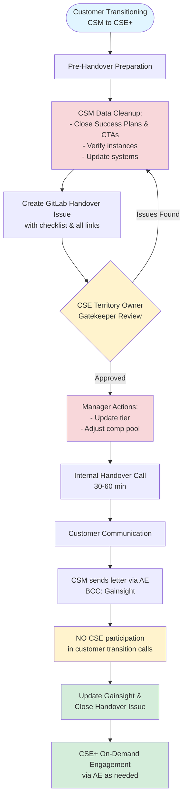

**Overview**

This process transitions customer accounts from dedicated CSM engagement to the CSE+ pooled support model.

**Key Principles:**

- CSE+ is an **on-demand, pooled resource** (not dedicated)
- Customer engagement is **AE-led**
- **CSEs do NOT join customer transition calls**
- Timeline: **3-4 weeks**

## Process Flow

## Step-by-Step Process

### 1. Pre-Handover (Week 1-2) - CSM

**Data Cleanup:**

- Close all Success Plans and CTAs
- Verify instance classification (production vs non-production)
- Flag instances not pinging for 6+ months
- Update: Gainsight, Salesforce, GDocs, Gong

**Create Handover Issue:**

- Use [the issue template](https://gitlab.com/gitlab-com/customer-success/csm-to-cse-handover/-/issues/new?issuable_template=CSM_to_CSE_handover) in [CSM-to-CSE-Handover project](https://gitlab.com/gitlab-com/customer-success/csm-to-cse-handover/-/issues)
- Fill in all required info
- Add links: Collaboration Project, Customer Notes GDoc, Gong recordings
- Tag CSE Territory Owner with `@mention`
- Link issue in Gainsight Timeline

### 2. Review & Approval (Week 2)

**CSE Territory Owner Review** (within 3 business days):

- Check all Success Plans/CTAs closed
- Verify instance classification accurate
- Confirm systems up to date

**Manager Actions** (after CSE approval):

- Update account to TAM Scale tier
- Adjust compensation pool
- Check "Manager actions complete" in issue

### 3. Internal Handover (Week 2-3)

**Handover Call** (30-60 min | CSM + CSE Territory Owner):

- Review handover issue together
- Discuss Top 3 things to know
- Cover relationship dynamics and watch-outs
- Address questions
- Update issue and check "Handover call completed"

### 4. Customer Communication (Week 3) - CSM

**Process:**

1. Draft transition letter using [approved template](https://gitlab.com/-/project/42504524/uploads/36d5cb3fc13f971e0af65ad321fea3fb/__NEW___CSM_Email_to_Customers_Moving_into_Scale_.docx)
2. Align timing with AE
3. Send letter (BCC: Gainsight email)
4. Update issue with send date
5. Address customer questions

**Letter emphasizes:**

- AE = primary contact
- CSE = on-demand via AE (pooled model, not dedicated)
- Self-service resources available
- **❗ CSEs do NOT join customer calls**

### 5. Completion (Week 3-4) - CSM

- Update Gainsight Timeline (completion date, handover link, feedback)
- Remove customer from active book
- Get CSE+ sign-off in issue
- Close handover issue

## RACI

| Activity | CSM | CSE Territory Owner | CSM Manager | AE |
|----------|-----|---------------------|-------------|----|
| Data cleanup & create issue | R/A | I | I | I |
| Review/approve handover | C | R/A | I | - |
| Update tier & comp pool | I | I | R/A | I |
| Handover call | R/A | R/A | I | - |
| Draft/send customer letter | R/A | I | C | C |
| Align on timing | C | - | - | R/A |
| Update Gainsight & close | R/A | C | R/A | I |
| Validate success | C | R/A | I | R/A |

**R** = Responsible | **A** = Accountable | **C** = Consulted | **I** = Informed

## Recommended CSE responsibilities during a CSM → CSE+ handover

This section describes **recommended** steps for how CSEs can support the CSM → CSE+ handover process. It complements (but does not change) the core principles defined above, including that **CSEs do not join customer transition calls**. These steps should be followed where practical and adapted when specific situations require flexibility.

Throughout this section, **"responsible CSE"** refers to the **CSE supporting the handover for a given account**.

---

### 1. Review the handover issue

Once the CSM has created the handover issue using [the standard template](https://gitlab.com/gitlab-com/customer-success/csm-to-cse-handover/-/blob/master/.gitlab/issue_templates/CSM_to_CSE_handover.md) and the **CSE Territory Owner** has approved it, the **responsible CSE** is encouraged to:

- Review:
  - **Account overview** and **Top 3 things to know**
  - **Technical setup** (deployment, tier, seats, last ping)
  - **Strategic context** (primary use cases, goals, blockers)
  - Links to the **Collaboration project**, **Customer notes GDoc**, and any **Gong** recordings
- Post clarifying questions or assumptions as comments on the handover issue (for example, calling out partial churn, re‑org context, or single‑contact situations).

> **Outcome:** CSEs have enough context to respond effectively when the AE, SA, or RM requests CSE engagement for this account.

### 2. Schedule a short CSM ↔ CSE internal handover call

Although not required for every account, it is recommended that CSEs arrange a **15–30 minute internal sync** with the outgoing CSM when:

- The account is complex (multiple instances, mixed SaaS/self‑managed, regulated environment), or
- There are open **risks**, sensitive relationship dynamics, or large upcoming milestones, or
- The written handover appears to have **gaps** or open questions.

Either the **CSM** or the **responsible CSE** can initiate this call; what matters is that the notes are captured in the handover issue.

**Suggested agenda:**

- **Align on scope:**
  - Which teams / instances are in scope for CSE+ support
  - Any areas that will continue to be handled primarily by other teams (Support, PS, SA, etc.)
- **Clarify key context:**
  - Key **personas, champions, and detractors**
  - Known **risks / watch‑outs**
  - Upcoming **projects, renewals, or expansions**
- **Identify follow‑up artifacts** (architecture diagrams, decks, prior enablement) that should be linked in the handover issue.

Capture the key points directly in the **handover issue** (for example under "Top 3 things to know" or in a short comment) so they are visible to other CSEs and the wider account team.

> **Note:** This is an **internal** CSM ↔ CSE call. It does not change the principle that CSEs do **not** join the customer transition call.

### 3. Provide a CSE role blurb for the CSM's customer email

The CSM leads customer communication, but the CSE can make this easier by providing a short, reusable description of the CSE role that the CSM can paste into their transition email. CSMs are encouraged to adapt this text to fit the specific customer relationship.

**Example paragraph a CSE can share with the CSM:**

> Going forward, our **Customer Success Engineering (also referred to as CSE)** team will support you for any GitLab adoption questions. The team is here to help with **training and enablement on a number of topics to help you get the most out of GitLab**.
>
> In addition to this case‑by‑case support, the CSE team also runs regular **webinars and hands‑on labs** for our customers on a variety of topics. You can always find more about upcoming webinars and sign up here: https://university.gitlab.com/pages/gitlab-user-webinars
>
> You can also review our **CSE engagement handbook page** for more detail about how the team works with customers, and feel free to share this internally with your colleagues: https://handbook.gitlab.com/handbook/customer-success/csm/segment/cse/
>
> If you have any questions about how to engage with the CSE team, please let **[AE name]** know and we can schedule a quick introductory call with one of our CSEs to walk you through it.

CSEs should keep this text updated as needed (for example, replacing any specific webinar dates with a generic reference to "upcoming" webinars). **Verify that all linked URLs remain active before each handbook update.**

### 4. Enrich the handover issue with CSE‑specific context

After your initial review (step 1) and/or internal sync with the CSM (step 2), add **CSE‑focused notes** to the handover issue. Where step 1 is about *understanding* the account, this step is about *enriching* the handover with context that will help future CSE engagements:

- Any key **architecture constraints** or "must‑knows" (for example, non‑standard deployment patterns, connectivity or compliance constraints).
- **CSE‑relevant history**: prior labs, webinars, workshops, or high‑impact enablement the customer has already consumed.
- Pointers to **CSE content** likely to be relevant for future engagements (webinars, hands‑on labs, or playbooks).
- Notes on **engagement level and context** (for example, "no active engagement; single main contact remaining after re‑org; partial churn already realized").
- Any internal **alignment with AE/SA/RM** on when and how to involve CSE for this account.

> **Outcome:** The handover issue serves as a practical **single source of truth** for future CSEs and the broader account team, with CSE‑specific context clearly layered in.

### 5. (Optional) Align with the AE on post‑handover CSE engagement

While not required, it is encouraged for the **responsible CSE** to align directly with the **AE** (and SA/RM where applicable) on:

- When it is appropriate to bring CSE into customer conversations (for example, enablement around specific use cases or features).
- Examples of **good use cases** for requesting CSE support:
  - Adoption and usage questions for specific GitLab capabilities
  - Use case‑focused enablement and "how to" guidance
  - Preparation for enablement sessions, labs, or webinars
- How the AE can **request CSE engagement** on behalf of the customer (for example, via the CSE help request process described in the [CSE Operating Rhythm page](/handbook/customer-success/csm/segment/cse/cse-operating-rhythm.md).

This alignment can be done asynchronously (Slack, comments on the handover issue) or via a short internal call and helps ensure AEs understand when and how to bring CSE in once the CSM → CSE+ handover is complete.

> **Outcome:** The AE has a clear understanding of when and how to involve CSE, reducing friction in post‑handover customer engagements.
