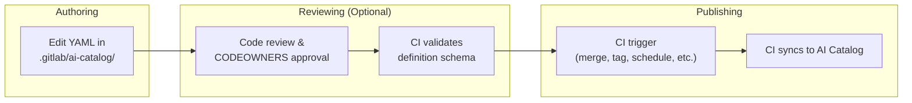
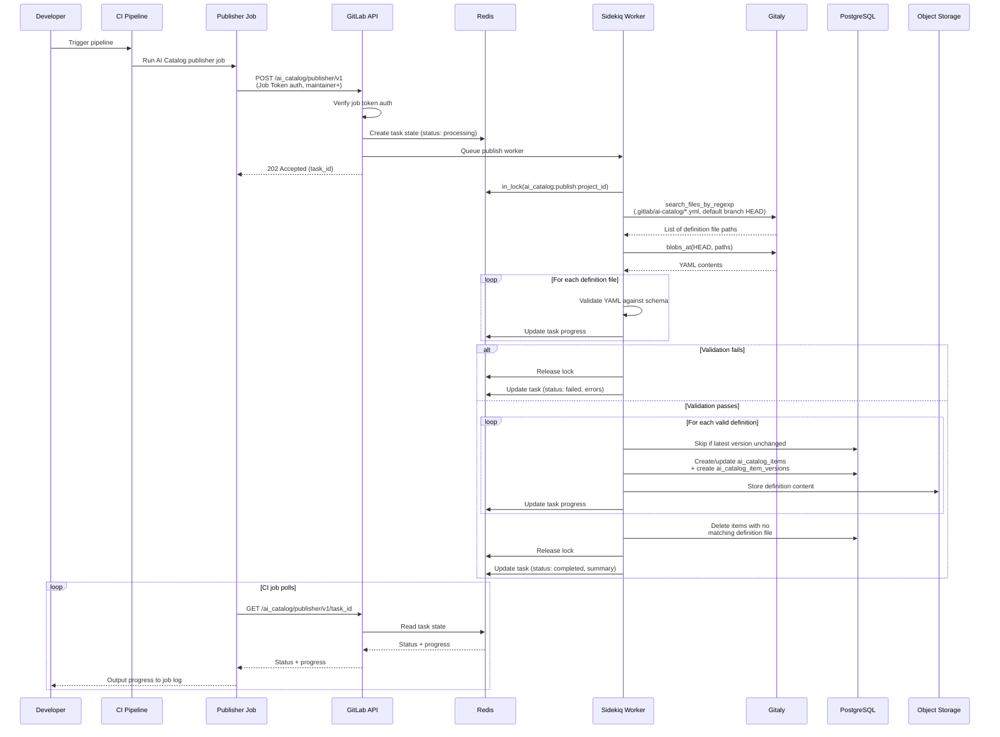



## Introduction

This document evaluates moving the authoring of AI Catalog item definitions from the current database-backed approach to a repository-backed approach, where definitions are authored as YAML files in git repositories and published through CI pipelines.

The evaluation was prompted by [issue #587714](https://gitlab.com/gitlab-org/gitlab/-/issues/587714) and follows product direction to assess a complete replacement of DB-backed definition authoring, rather than supporting both repo-backed and DB-backed authoring as permanent alternatives.

This evaluation assesses whether adopting the repo-backed pattern would benefit the AI Catalog, what the migration path looks like, and what trade-offs are involved.

### Motivation

The CI/CD Catalog successfully uses repository authoring where component definitions live in git repositories and are published to the CI/CD Catalog. This pattern provides:

- **Governance and auditability**: Repository-backed definitions unlock CODEOWNERS rules, merge approval policies, protected branches, and version history through existing GitLab features
- **Collaboration through merge requests**: Definition changes can go through the standard MR workflow, enabling code review, discussion, and approval before publication.

### Scope

This document covers:

- The proposed repo-backed authoring and publishing workflow for AI Catalog definitions
- Similarities and differences with the CI/CD Catalog
- A phased migration path for custom (user-created) items
- Technical and product risks, limitations, and open questions

## Current Architecture

The current AI Catalog architecture is documented in the [AI Catalog Architecture Design Document](../ai_catalog/_index.md).

Key points from that document relevant to this proposal:

- There are three item types: agents, flows, and external agents
- Item definitions are authored through the UI and GraphQL API, and stored as JSONB in `ai_catalog_item_versions.definition`. Note, storage is changing in [issue #591638](https://gitlab.com/gitlab-org/gitlab/-/work_items/591638) to Object Storage.
- Foundational items are shipped with GitLab.

## Proposed Architecture

### Principle

Item definitions would be authored as YAML files in git repositories, replacing the current UI and GraphQL-based authoring surface. At publish time, definitions would be extracted from the repository and stored in Object Storage for runtime access (see [issue #591638](https://gitlab.com/gitlab-org/gitlab/-/work_items/591638)). The git repository would be the source of truth for definitions.

PostgreSQL would remain as the queryable store for catalog metadata, versions, and enablement. The enablement subsystem (item consumers and triggers) would remain entirely in PostgreSQL.

Foundational item definitions would not be moved to git repositories, and instead would remain as "fixtures" (as they currently are, either in the monolith or Duo Workflow Service).

This means four systems serve distinct roles:

- **Git repository** — the authoring surface and source of truth for definitions
- **Object Storage** — the runtime read source for definition content
- **PostgreSQL** — the queryable store for catalog metadata, version records, enablement, and search
- **In-Memory Fixtures** — Foundational item definitions

This follows a similar architectural pattern as the CI/CD Catalog, where component definitions live in repositories with metadata extracted into PostgreSQL at publish time to assist querying.

The AI Catalog would share patterns and concerns with the CI/CD Catalog, but not direct models and services. The domains diverge too much (organization-scoped vs project-scoped, three item types vs one, enablement subsystem with no CI/CD Catalog equivalent).

The following table summarizes how each item type is authored, queried, and read at runtime:

| Item type | Definition source | Queryable metadata | Definition read from |
| --- | --- | --- | --- |
| **Custom items** (user-created, owned by projects) | YAML files in a git repository | PostgreSQL (unchanged) | Object Storage (unchanged) |
| **Foundational items** (GitLab-maintained, owned by organizations) | Fixtures (unchanged) | PostgreSQL (unchanged) | In-memory Fixtures (partly unchanged) |

### What Moves to Repositories

The git repository becomes the source of truth for definitions and the means of authoring. Note, at publish time definitions are extracted from the repository and stored in Object Storage for runtime access. This follows the approach being developed in [#591638](https://gitlab.com/gitlab-org/gitlab/-/work_items/591638).

### What Stays in PostgreSQL

1. **Catalog metadata**: `ai_catalog_items` (name, description, visibility, verification level).
1. **Version records**: `ai_catalog_item_versions` would continue to track released versions. Note, intermediate changes between releases would be tracked only in git, making the git version history the only complete source of truth of all changes made.
1. **Enablement**: `ai_catalog_item_consumers`, `ai_flow_triggers`, service accounts, foundational item enablement (`enabled_foundational_flows`, `*_foundational_agent_statuses`).
1. **Search and discovery**: Full-text search, filtering, sorting, pagination.

### High-level Overview of New Authoring and Publishing Flow

Below is a high-level overview of the proposed changes to authoring and publishing flow.

1. Authoring: A developer edits YAML files in a repository's `.gitlab/ai-catalog/` directory to define items
2. Reviewing: An optional step, code review and CODEOWNERS approval rules govern the merging of items to default branch
3. Publishing: A CI pipeline job publishes definitions to the AI Catalog. The publish endpoint always reads from the default branch HEAD, so users are free to configure their CI rules to trigger publishing however they choose.



### Proposed Similarities with CI/CD Catalog

- **Repository-backed definitions**: Allows governance features.
- **Published through CI job**: Provides visibility into publishing progress and errors through pipeline UI and job logs
- **PostgreSQL as queryable store**: Both use PG for catalog metadata, version records, search indexes, and discovery.

### Proposed Differences with CI/CD Catalog

- **Multiple items per project**: CI/CD Catalog enforces a 1:1 project-to-component mapping. AI Catalog would allow a project to maintain multiple AI Catalog items as part of its regular repository.
- **Coexist in regular project repository**: AI Catalog definitions would more easily coexist alongside normal project files, managed in the same way a project manages other GitLab definitions like issue and merge request templates. Publishing to the catalog would happen without interfering with the project's tagging or release process. CI/CD Catalog publishing appears to necessitate creating a project especially for publishing the component.
- **Publishing via CI job on default branch, not tags**: CI Catalog publishes via git tag releases. AI Catalog would publish via a CI job, with data read from the default branch but with the exact trigger configurable through standard CI rules.
- **Version specified in YAML, not derived from tag**: Each item specifies its own version in its YAML definition file. A single project can contain multiple AI Catalog items with independent version numbers, so a single git tag cannot represent them all.
- **Different project registration mechanism**: Both catalogs require project-level opt-in before publishing. CI/CD Catalog uses a dedicated `catalog_resources` record per project, which also serves as the browsable catalog entry that groups the project's components. AI Catalog has no equivalent project-level wrapper — each item is independently browsable — so opt-in is just a project setting (`ai_catalog_publishing_enabled`).

### Project Requirements

To publish repo-backed AI Catalog items, projects would require three things:

1. AI Catalog publishing enabled in project settings. This is an explicit opt-in at the project level, preventing accidental publishing (see [Why a project setting?](#why-a-project-setting)).
1. Item definition files in the repository under `.gitlab/ai-catalog/`.
1. `.gitlab-ci.yml` configuration. A CI component could abstract this for GitLab.com customers. Self-Managed and Dedicated would need to have a more verbose config that can be copied from docs.

#### Why a project setting?

A project setting acts as an explicit opt-in that doesn't carry across forks of the repository, preventing forks from accidentally publishing to the catalog.

The setting would be configurable by maintainers or higher through the project settings UI or API.

### Definition Files

#### Naming structure

AI Catalog definitions would live under the `.gitlab/ai-catalog/` directory, following the established convention of using `.gitlab/` for GitLab project-level feature configuration (used today for issue templates and merge request templates).

Each YAML file under `.gitlab/ai-catalog/` would represent a separate catalog item, allowing a single project to manage and publish multiple items.

Subdirectories of any depth would be supported, enabling teams to organize definitions and apply CODEOWNERS rules at the directory level. For example:

```plaintext
.gitlab/ai-catalog/
  team-alpha/
    agents/
      code-assistant.yml
    flows/
      review-flow.yml
  team-beta/
    agents/
      security-scanner.yml
```

Allowing CODEOWNERS rules like:

```plaintext
.gitlab/ai-catalog/team-alpha/ @team-alpha-leads
.gitlab/ai-catalog/team-beta/ @team-beta-leads
```

The item type (agent, flow, or external agent) would be specified as a property within the YAML file, not inferred from the directory structure.

Gitaly's `SearchFilesByName` RPC supports file matching at any depth, so all definition files can be retrieved in a single call, with pagination support for large result sets.

#### YAML metadata

YAML definitions for all item types would contain the same metadata separated from the config by the `catalog_metadata` key.

```yaml
catalog_metadata:
  id: code-assistant
  name: Code Assistant
  description: Helps developers write, review, and refactor code
  type: agent # agent | flow | external_agent
  lifecycle: released # draft | released | deleted
  visibility: public # public | private
  version: 1.2.0
# ... agent, flow, or external agent definition follows
```

##### `id`

- Type: String
- Required

The stable identifier for the item, must be unique per project.

The `id` is used to match definition files to existing `ai_catalog_items` records during publishing, regardless of the file's path or name.
File renames and moves are safe as an item's `id` survives file reorganization.

The [validation](#api-endpoints) would error if two files in the same project share the same `id`.

Once an item is published with an `id`, changing it would be treated as creating a new item, and delete the old item.

##### `name`, `description`

- Type: String
- Required

Would map directly to the same properties in `Ai::Catalog::Item`.

##### `type`

- Type: Enum (`agent, flow, external_agent`)
- Required

Type of AI Catalog item.

##### `lifecycle`

- Type: Enum (`draft, released, deleted`)
- Optional. Default: `released`

Would control the item's draft to released state in the catalog (supported in the AI Catalog currently by the backend only).

A `lifecycle: deleted` state would allow an alternative deletion to removing the item definition, expressed as a property change within the YAML file, keeping the file in the repository as an audit trail.

Is extendable, so could support additional states such as `archived` or `deprecated` in future.

##### `visibility`

- Type: Enum (`public, private`)
- Optional. Default: `private`.

Would control our existing `Ai::Catalog::Item#public` boolean, but allows extensibility to support options like `internal` in future.

##### `version`

- Type: String in SemVer format
- Optional

Would follow our existing rules for `Ai::Catalog::ItemVersion#version`.

If not given, publishing would increment releases in minor versions, so customers can let the AI Catalog handle versioning on their behalf.

### Validation and publishing

Validation and publishing operations are exposed through API endpoints and triggered via CI jobs.

#### Publishing Guardrails

The publish endpoint enforces several guardrails to ensure governance controls are respected:

1. **Project setting enabled**: The project must have AI Catalog publishing enabled in its settings.
1. **Default branch only**: The publish endpoint always reads definition files from the HEAD of the project's default branch, regardless of which branch triggered the pipeline. This ensures only content that has gone through the project's review and approval process can be published (also see the open question about a [Configurable Publishing Branch](#configurable-publishing-branch))
1. **Job token authentication only**: The publish endpoint requires a CI job token. It cannot be triggered through a PAT, OAuth, or other authentication methods. This ensures publishing always happens through a CI pipeline.
1. **Maintainer+ authorization**: The job token user must have maintainer or higher role on the project.
1. **Validation before publish**: All definitions are validated against schemas and references are resolved before any records are created. A single validation failure halts the publish.
1. **Exclusive lease lock**: Only one publish can run per project at a time, preventing race conditions.

These guardrails mean that users are free to configure their CI rules to trigger publishing however they choose (on merge, on tag, on schedule, manually). The endpoint enforces *what* gets published, not *when*.

The validate endpoint is intentionally less restrictive: it reads from the pipeline branch (not the default branch), requires only developer+ access, and can be called from any pipeline. This allows MR pipelines to validate proposed changes before merge.

#### CI Configuration

Validating and publishing AI Catalog items would happen through CI jobs.

Publish events would be configurable through standard CI rules. Merging to the default branch could be the recommended default trigger.

Validation could be run independently of publish, allowing feedback on MR pipelines if item schema is valid.

##### CI Component (GitLab.com only)

We could create a CI component for GitLab.com customers to abstract the CI configuration and allow configurable inputs. For example:

```yaml
include:
  - component: gitlab.com/gitlab-org/ai-catalog-publisher@1.0.0
  - component: gitlab.com/gitlab-org/ai-catalog-validator@1.0.0
```

Example customized usage:

```yaml
include:
  - component: gitlab.com/gitlab-org/ai-catalog-publisher@1.0.0
    inputs:
      publish_on: tag # publish on tag instead of default branch
```

##### Full CI configuration

This option would be the only one available to Self-Managed and Dedicated customers.

An example of a CI configuration for:

- Validating on any MR pipeline, allowing validation feedback before merge.
- Publishing after a merge to the default branch.

```yaml
stages:
  - test
  - deploy
.ai_catalog_polling_script: &ai_catalog_polling_script
  - |
    RESPONSE=$(curl --fail --silent --request POST \
      --header "JOB-TOKEN: $CI_JOB_TOKEN" \
      "${CI_API_V4_URL}/projects/${CI_PROJECT_ID}/ai_catalog/${ENDPOINT}")
    TASK_ID=$(echo "$RESPONSE" | jq -r '.task_id')
    echo "${ENDPOINT} initiated. Task ID: $TASK_ID"
    TIMEOUT=${TIMEOUT:-300}
    INTERVAL=${INTERVAL:-5}
    ELAPSED=0
    while [ $ELAPSED -lt $TIMEOUT ]; do
      STATUS_RESPONSE=$(curl --fail --silent --request GET \
        --header "JOB-TOKEN: $CI_JOB_TOKEN" \
        "${CI_API_V4_URL}/projects/${CI_PROJECT_ID}/ai_catalog/${ENDPOINT}/${TASK_ID}")
      STATUS=$(echo "$STATUS_RESPONSE" | jq -r '.status')
      PROGRESS=$(echo "$STATUS_RESPONSE" | jq -r '.progress // empty')
      if [ -n "$PROGRESS" ]; then
        echo "$PROGRESS"
      fi
      if [ "$STATUS" = "completed" ]; then
        echo "$(echo "$STATUS_RESPONSE" | jq -r '.summary')"
        exit 0
      elif [ "$STATUS" = "failed" ]; then
        echo "$(echo "$STATUS_RESPONSE" | jq -r '.errors')"
        exit 1
      fi
      sleep $INTERVAL
      ELAPSED=$((ELAPSED + INTERVAL))
    done
    echo "${ENDPOINT} timed out after ${TIMEOUT}s"
    exit 1
ai-catalog-validate:
  stage: test
  variables:
    ENDPOINT: validator/v1
    INTERVAL: 3
  rules:
    - if: $CI_PIPELINE_SOURCE == "merge_request_event"
      changes:
        - .gitlab/ai-catalog/**/*
  script: *ai_catalog_polling_script
ai-catalog-publish:
  stage: deploy
  variables:
    ENDPOINT: publisher/v1
    INTERVAL: 5
  rules:
    - if: $CI_COMMIT_BRANCH == $CI_DEFAULT_BRANCH
      changes:
        - .gitlab/ai-catalog/**/*
  script: *ai_catalog_polling_script
```

Using a CI job means:

- **Failure visibility**: Sync errors would appear as a failed pipeline job, with logs the user can inspect
- **User control**: Standard CI rules can control when publishing runs

An open question [Validation Error and Syncing Progress UI](#validation-error-and-syncing-progress-ui) describes an alternative bespoke part of the app to manage publishing and sync progress, which would replace the need for a CI job at the cost of a much higher engineering investment.

#### API Endpoints

Validation and publishing logic would be encapsulated in API endpoints.

1. The CI component (for GitLab.com) would be just a thin wrapper that calls the endpoint
2. Self-Managed and Dedicated customers can call the same endpoint from an inline CI job definition
3. The core logic (file discovery, schema validation, PG record creation) would be in a Rails service, not in the CI configuration itself. This would allow Self-Managed and Dedicated a minimum CI config setup

Both validation and publishing are processed asynchronously to handle projects with many items without risking API timeouts, and to provide progressive feedback in CI job logs.

Endpoints would be versioned (example: `v1`) for backwards compatibility, allowing us to evolve endpoint behavior or responses over time while not breaking older integrations:

- `POST /api/v4/projects/:id/ai_catalog/validator/v1` — initiate async validation
- `GET /api/v4/projects/:id/ai_catalog/validator/v1/:task_id` — poll validation status
- `POST /api/v4/projects/:id/ai_catalog/publisher/v1` — initiate async publish
- `GET /api/v4/projects/:id/ai_catalog/publisher/v1/:task_id` — poll publish status

##### Async Processing Model

Both endpoints follow the same async pattern:

1. **Initiate**: A `POST` request validates the request parameters, queues a background job, creates a task state record in `Redis::SharedState` with a TTL, and returns a `task_id` immediately.
2. **Process**: A Sidekiq worker performs the work, updating the Redis task state with progress as it goes. Sidekiq workers would be idempotent, allow retries after failure.
3. **Poll**: The CI job polls the corresponding `GET` endpoint at intervals. Each response includes the current status (`processing`, `completed`, `failed`) and a progress message that the CI job outputs to its log.
4. **Complete**: On `completed` or `failed`, the CI job exits with the appropriate status code.

This approach means:

- **No timeout risk** — the initial API request returns immediately; the heavy work happens in a background worker
- **Rich progress output** — the CI job log shows items being validated and published as they're processed, rather than a single summary after a long wait
- **Offloads work from API nodes** — processing happens in Sidekiq workers, not in the API request lifecycle

##### Validate

Reads definition files from the pipeline branch inferred from the job token, validates schemas and reference resolution, and reports errors.
Safe to call from any MR pipeline, allowing feedback on proposed changes before merge.

**Authorization**: Project must have AI Catalog publishing enabled in settings. Any developer+ of the project. Authorization would not need to be job token, and could be called through regular API interaction.

##### Publish

Validates AND creates/updates PG records and stores definitions in Object Storage.

Publishing always reads definition files from the HEAD of the project's default branch, regardless of which branch triggered the pipeline (see [Publishing Guardrails](#publishing-guardrails)). Users are free to configure their CI rules to trigger publishing however they choose (on merge, on tag, on schedule, manually), however it should take into account that publishing happens from the default branch only.

**Authorization**: Project must have AI Catalog publishing enabled in settings. Authentication must be a Job Token (from a CI job), and the job token user must be maintainer+. The `task_id` param must match state previously owned by the same project.

##### Optional arguments

These could be added later to both endpoints:

- Whether updates to items should be treated as atomic. When `atomic: true` updates would happen in a transaction and all updates would either succeed or fail. When `atomic: false`, some updates could succeed and some could fail. Default: `atomic: false`.
- Lease configuration: `lease_wait` and `lease_retry`.

##### Validation rules

The validation phase (shared by both endpoints) would fail if:

1. Two files in the same project declare the same `id`.
1. Item schemas were invalid, or if ActiveRecord models were invalid.

If validation fails, the task status becomes `failed`. The job would fail and errors would be visible in the job log.

##### Publish steps

When the background worker processes a publish:

1. The validation would run first, failing the job if there were failures.
1. An exclusive lease lock is taken so that we cannot have multiple publishes happen simultaneously for the project. We would give a reasonably generous lease wait time and retry, as eventually failing would fail the CI job. Lease lock duration and retries could be configurable by customers through supplying arguments to the endpoint.
1. Definition files would always be loaded from the HEAD of the project's default branch, regardless of which branch triggered the pipeline (see [Publishing Guardrails](#publishing-guardrails)).
1. Definition files would be loaded using `Repository#search_files_by_regexp`, a single Gitaly RPC that scans the git tree at a given ref and returns all paths matching a regex. This is the same mechanism the CI/CD Catalog uses to discover component files under `templates/`.
1. YAML definitions would be validated against schemas.
1. `ai_catalog_items` records would be created or updated, and `ai_catalog_item_versions` records would be created for new versions. The publisher matches to an existing `ai_catalog_items` record by the `id` in its YAML definition mapping to the `internal_id` property, scoped to the project. If no match exists, a new item is created. If the definition is unchanged from the latest version, the item is skipped.
1. Records are deleted. Existing project AI Catalog items with no corresponding definition file in the repository would be deleted. As this is destructive, care needs to be taken that we have loaded all definition files successfully from the repository first. When an item is soft-deleted (as opposed to hard-deleted), we may want to unset its `internal_id` to allow the project to reuse the same identifier for a new item.

#### Publishing Flow



#### Data Mapping

When publishing, data for the PostgreSQL records would be mapped.

| `ai_catalog_items` column | Source |
| --- | --- |
| `name` | YAML definition file |
| `description` | YAML definition file |
| `item_type` | YAML definition file (`type` property) |
| `public` | YAML definition file (`visibility` property) |
| `project_id` | The repository's project |
| `organization_id` | The project's organization |
| `internal_id` | YAML definition file (`id` property). Stable identifier used to map the definition YAML to the record, uniquely scoped to item and project. |
| `verification_level` | The project's namespace verified status |

| `ai_catalog_item_versions` column | Source |
| --- | --- |
| `version` | YAML definition file (optional, must be valid semver greater than current version). Defaults to a minor bump from the latest version if absent. |
| `release_date` | Timestamp of the publish event when lifecycle becomes `released` |
| `commit_sha` | The SHA of the commit read from during the publish (stored for auditability, but not used) |
| `created_by_id` | The job token user |

### Foundational Items

Foundational items are GitLab-maintained catalog items that are not user-authored. Unlike custom items, they belong to an organization and not a project, and so cannot be repo-backed. They are not versioned, and must ship with GitLab.

Foundational items will continue to have their definitions maintained as fixtures shipped in the monolith. This is consistent with the current pattern, where definitions already originate from the codebase.

Foundational item architecture is under active discussion in [#590241](https://gitlab.com/gitlab-org/gitlab/-/work_items/590241), but for the purposes of this design document we can consider their data source to be fixtures.

## Custom Agent Definition YAML

Unlike flows and external agents, custom agents are not currently defined as YAML and need a proposed YAML syntax.

Agent definitions currently reference built-in tools and MCP servers by internal identifiers:

- **Built-in tools** — referenced by integer ID (e.g., `"tools": [1, 3, 10, 39]`), mapped to `Ai::Catalog::BuiltInTool` fixtures
- **MCP tools** — referenced by string name (e.g., `"mcp_tool_names": ["search"]`), mapped to in-memory `Ai::Catalog::McpTool` records
- **MCP servers** — referenced by integer database ID (e.g., `"mcp_servers": [42, 57]`), mapped to `ai_catalog_mcp_servers` rows

Integer database IDs are not viable in YAML definition files. They have no semantic meaning in code review (undermining the collaboration and governance goals of this proposal). References in YAML should be human-readable and self-documenting.

All three types should be referenced by human-readable names in YAML definitions.

```yaml
tools:
  - gitlab_blob_search/1.0.0
  - gitlab_create_merge_request/1.0.0
mcp_tool_names:
  - search/1.0.0
mcp_servers:
  - jira_cloud/1.0.0
  - slack/1.0.0
```

None of the above are currently versioned. The version suffix (`/1.0.0`) is included for future compatibility, so that versioning of these associations can be introduced without requiring changes to the YAML format.

For **built-in tools**, this is straightforward. `BuiltInTool` already has a `name` field (e.g., `"gitlab_blob_search"`) that is unique and stable.

For **MCP tools**, this is already the current behavior. They are referenced by string name today.

For **MCP servers**, this requires a resolution mechanism. MCP servers are organization-scoped database records (`ai_catalog_mcp_servers`). Currently they have a `name` field, but this is for human readability.

We will add a new `internal_id` column with a uniqueness constraint, keeping `name` as a display-only field. This separates the human-readable label from the machine reference.

The `internal_id` will need to be immutable once chosen as changing it would break associations.

During the publishing phase, name-based references in the YAML are resolved to internal identifiers against `ai_catalog_mcp_servers` within the item's organization.

Example agent YAML:

```yaml
catalog_metadata:
  id: code-assistant
  name: Code Assistant
  description: Helps developers write, review, and refactor code
  type: agent
  lifecycle: released
  visibility: public
  version: 1.2.0
system_prompt: |
  You are a senior software engineer assistant. You help developers
  write clean, well-tested code following the project's conventions.
  Always explain your reasoning and suggest tests for any changes.
tools:
  - gitlab_blob_search/1.0.0
  - gitlab_create_merge_request/1.0.0
mcp_tool_names:
  - search/1.0.0
mcp_servers:
  - jira_cloud/1.0.0
  - slack/1.0.0
```

## Migration Phases

Custom items are user-created catalog items owned by a project. The migration to repo-backed definitions would move the authoring surface from GraphQL mutations and UI forms to YAML files in the project's repository.

All three custom item types (agents, flows, and external agents) are in scope for this migration.

There are two required phases:

1. **Phase 1: Add new architecture**
2. **Phase 2: Switch to Repo-backed creation for new items**

There are two optional phases:

1. **Phase 3: Provide a migration pathway**: Existing DB-backed items can be converted to repo-backed
2. **Phase 4: Full Deprecation and Removal of Database-backed method**

### Phase 1: Add New Architecture

By the end of this phase, projects could begin publishing to the AI Catalog through their repositories. Existing DB-backed items (`source: database`) would continue to work through the current GraphQL mutations. Both types would appear in the
catalog and be queryable through the same finders and GraphQL API.

#### Work Streams

**1. Schema migrations**

Add new columns to support repo-backed items:

| Change | Detail |
| --- | --- |
| New column: `project_settings.ai_catalog_publishing_enabled` | Boolean, default `false`. [Project-level opt-in](#why-a-project-setting) for publishing to the AI Catalog. |
| New column: `ai_catalog_items.source` | Enum: `database`, `repository`, `fixture`. Identifies where the item's definition originates from and how it is authored. |
| New column: `ai_catalog_items.internal_id` | Stable identifier from YAML `id` field, unique within project |
| New column: `ai_catalog_items.foundational_item_ref` | Stable identifier mapping to fixture (generalizes `foundational_flow_reference`) |
| New column: `ai_catalog_item_versions.commit_sha` | Repository SHA of item version at publish (stored for auditability, but not used) |
| New column: `ai_catalog_mcp_servers.internal_id` | Immutable identifier for YAML references |

**2. Agent YAML definition schema**

Design and implement the YAML schema for custom agents. Flows and external agents already have YAML definitions; agents currently have only a structured JSON format authored through UI forms. This includes establishing the human-readable
reference format for built-in tools, MCP tools, and MCP servers.

See [Custom Agent Definition YAML](#custom-agent-definition-yaml) for more details.

**3. Publishing API and service layer**

Build the core publishing infrastructure (see [API Endpoints](#api-endpoints)):

- Versioned REST endpoints (`POST .../validator/v1`, `GET .../validator/v1/:task_id`, `POST .../publisher/v1`, `GET .../publisher/v1/:task_id`)
- Sidekiq workers for async processing of validate and publish tasks
- Task state tracking via `Gitlab::Redis::SharedState` with a TTL. A Ruby class (e.g., `Ai::Catalog::PublishTaskState`) would read and write task progress, status, and errors to Redis. No database table is required as task state is ephemeral and auto-expires.
- Rails service for file discovery via Gitaly (`search_files_by_regexp`), YAML parsing, schema validation, and agent tool and MCP name [reference resolution](#custom-agent-definition-yaml)
- Record creation/update logic: creating or updating `ai_catalog_items` and `ai_catalog_item_versions` records

**4. Publisher CI component**

Build and publish a CI/CD Catalog component that wraps the REST endpoints and polling logic for GitLab.com customers. Document inline CI job configuration for Self-Managed and Dedicated customers.

**5. Item duplication**

Currently, duplicating an item is a frontend-only action: the form is pre-populated with the source item's data and the user submits it as a new item. With repo-backed authoring, duplication requires writing to a project repository.

The proposed flow:

1. User initiates duplication from an existing item, choosing the target project. The target can be the source project itself or any other project within the same organization.
1. The system creates a new branch in the target project's repository.
1. The duplicated YAML definition is written to the branch. We would ensure all `id` values are unique within the target project's repository. This is performant: a single Gitaly call loads all definition files for the target project, the same mechanism used by publishing. Any duplicates could have a unique `id` generated (example, appending `-copy` to the source `id` and incrementing if needed).
1. A merge request is automatically opened, allowing the user to review before merging.
1. On merge, the project's existing publishing CI configuration handles the rest.

The work would be done asynchronously, to take load away from the web nodes.
We would need to notify the user when the duplication has finished, for example:

1. A toast pop-up within the AI Catalog when the duplication has finished.
1. A todo would be generated when the MR is opened.

A simpler initial iteration could provide a "download YAML" action that gives the user the duplicated definition as a file, leaving the user to commit it to their project repository manually. This loses the auto-MR convenience but is less engineering work and could ship first.

### Phase 2: Switch to Repo-Backed Creation for New Items

Enforce that all new items are created as repo-backed items only.

- Remove creation UI for DB-backed items
- GraphQL creation mutations blocked
- Continue to allow update UI and GraphQL mutations for existing database-based items only

### Phase 3 (Optional): Provide a Migration Pathway

We could provide a UI-based migration that moves items from PostgreSQL-backed to repository-backed.

- Initiated by the user, we would open a MR in the owner project's repository containing their items as YAML files. Duo could assist with modifying their `.gitlab-ci.yml`.
- On merge, the sync would pick up the files and the item's `source` would be flipped from `database` to `repository`.

Once an item is repo-backed, the existing UI and GraphQL mutations for updating definitions would be locked out.

### Phase 4 (Optional): Full Deprecation and Removal of Database-backed method

As migration requires writing to customer's repositories, we cannot easily force upgrading.
See [Ongoing Legacy Support](#ongoing-legacy-support) in risks.

We could eventually lock out the ability to update legacy DB-backed items through the UI and GraphQL mutations, after an announced deprecation period, to force users into migration. This would be a breaking change to the current authoring workflows for these customers.

## Migration: Foundational Items

Foundational items are already fixture-based. Their definitions originate from the codebase, not from user input. The migration path is simpler than for custom items, as there is no user-authored data to migrate from a database to a repository.

The key changes are:

1. **Remove definition caching in PostgreSQL** — currently, external agents have their definitions seeded into `ai_catalog_item_versions.definition` as JSONB. In the proposed architecture, definitions are read directly from the fixtures at runtime, so this column is no longer populated for foundational items.

2. **Retain catalog metadata in PostgreSQL** — `ai_catalog_items` records continue to be seeded (name, description, item type, verification level) so foundational items remain queryable and discoverable in the catalog.

3. **Record a fixture reference** — a `foundational_item_ref` column on `ai_catalog_items` provides the stable identifier that maps each database record back to its fixture definition. This generalizes the existing `foundational_flow_reference` column (currently used only for foundational flows) to cover all foundational item types.

Further architectural changes to foundational items (such as unifying enablement patterns) are out of scope and tracked in [#590241](https://gitlab.com/gitlab-org/gitlab/-/work_items/590241).

## Risks

### Significantly Slower Iteration Feedback Loop

**Risk type**: Product.

The current UI allows rapid iteration on definitions: edit, save, test, and refine in a tight loop. The repo-backed model introduces a much longer feedback cycle: edit YAML, commit, push, merge to default branch (or other configured trigger), wait for the publisher job, then test.

If the definition doesn't work as expected (e.g., a prompt needs tuning or a tool is missing), a new commit and merge is required.

Authors will lack a testing sandbox to experiment with ideas rapidly, which could make developing items a frustrating and slow experience.
This is especially impactful during initial development of a new item, where multiple rapid iterations are typical.

### YAML Validation UX Regression

**Risk type**: Product.

Currently the user is given immediate per-field validation errors when creating or updating item config. This is particularly useful for flows, which have a complex definition that is easy to get wrong.

In the repo-backed model, validation would happen later: during the sync after a push or merge, making feedback asynchronous.

This is a meaningful UX regression, particularly for users unfamiliar with the definition schema.

Mitation:

- Editor tooling with schema-aware validation (see [AI Catalog Definition Editor](#ai-catalog-definition-editor)).

### Agent Editing UX Regression

**Risk type**: Product.

Moving from a guided UI to raw YAML editing would be a significant experience regression for defining custom agents.

Users will need to input the correct names for:

- Built-in tools
- MCP tools
- MCP servers

Otherwise, reference resolution would fail during sync.

Agents are currently the most UI-driven item type, with structured form fields for prompts and autocomplete-driven tool selection. Flows and external agents are already YAML-authored, making this transition less disruptive for those types.

Mitigation:

- Editor tooling with schema-aware validation (see [AI Catalog Definition Editor](#ai-catalog-definition-editor)).

### Item Duplication UX Regression

**Risk type**: Product.

The current AI Catalog allows quick duplication of items through a frontend-only action — the form is pre-populated with the source item's data, and the user submits it as a new item with a single click.

In the repo-backed model, duplication requires committing files to a target repository. Even with tooling that automates branch creation, file writing, and MR creation, the user must still review and merge an MR, then wait for the publish job before the duplicated item appears in the catalog.

Additionally, duplication into a project that has not yet enabled AI Catalog publishing (no `.gitlab-ci.yml` configuration, no project setting enabled) will succeed as a merge but the item will not be published to the catalog until those prerequisites are configured. The duplication tooling will not include `.gitlab-ci.yml` modifications in the MR, as adding CI configuration introduces significant complexity and risks conflicting with the user's existing CI setup.

### Workflow Breaking Changes

**Risk type**: Product.

[Phase 2](#phase-2-switch-to-repo-backed-creation-for-new-items) means that customers could not create new items through the UI.
Every new custom item must be repo-backed. This would be an intentional breaking product change (see [issue 587714](https://gitlab.com/gitlab-org/gitlab/-/work_items/587714#note_3064035412)).

Mitigation:

- Make Phase 2 optional.

### Sync Visibility for Non-Merge Triggers

**Risk type**: Product.

When publishing is configured to happen on a trigger other than "merge to default branch" (for example, on tag, on schedule, or manually), there is a window in which a definition change has landed on the default branch but has not yet been published to the catalog.

During this window:

- An author may merge a change and not realize publishing requires a further action (such as creating a tag).
- Other project members viewing the repository see the new or updated item on default, but cannot easily confirm whether it has been synced to the catalog, is pending sync, or has failed to sync.
- Resolving the confusion requires asking the author, or manually inspecting pipeline history.

This risk is specific to trigger configurations that decouple publishing from merging. Projects that trigger publishing on merge to the default branch do not experience this window — the MR surfaces the sync status directly through the post-merge pipeline.

Partial mitigation:

- Default CI configurations we recommend (including the GitLab.com CI component default) would trigger publishing on merge to default branch. Projects that choose a different trigger accept this trade-off.

### Ongoing Legacy Support

**Risk type**: Engineering.

We can [offer a migration pathway](#phase-3-optional-provide-a-migration-pathway) for existing DB-backed items. But we cannot force this migration, as it involves writing to customers' repositories.

Engineering will need to continue to support legacy items that are not repo-backed, likely indefinitely.

This adds complexity to the architecture indefinitely in:

- Maintaining the UI and GraphQL mutations for item updates and deletion
- Increased surface area for bugs and maintenance, as all definition-related features must work across both code paths

Mitigation:

- See [Phase 4 (Optional): Full Deprecation and Removal](#phase-4-optional-full-deprecation-and-removal-of-database-backed-method).

### Atomicity

**Risk type**: Engineering.

Currently, definition and metadata updates happen in a single PostgreSQL transaction. In the repo-backed model, a publish would involve a git commit followed by later PostgreSQL updates. If the PG update fails after the commit has landed, the system would be in an inconsistent state where the repo has the new definition but PG still points to the old version.

Partial mitigation:

- The CI-based publish would help mitigate the impact: a failed PG update would surface as a failed pipeline job that can be inspected and retried. The sync would be idempotent, so re-running the job would correct the state.

### Semi-Feature Freeze During Migration Period

**Risk type**: Product, Engineering.

During the transition it would be preferable to avoid adding significant new features that affect item definition, focusing instead on completing the migration.

Features that only touch enablement, search, or catalog metadata would be unaffected.

### Feature Outages From Reliance on New Service: Gitaly

**Risk type**: Engineering.

The repo-backed architecture introduces a new dependency on healthy Gitaly services for publishing.

Gitaly errors and downtime will cause publishing outages for the AI Catalog.

### CI Compute Minutes Consumption

**Risk type**: Product.

Currently, items are free to create and release. Publishing through a CI job will consume CI compute minutes. The impact is expected to be minimal — the publisher job is a lightweight API call that would take seconds on a small runner — but it is a change from zero cost.

## Recommendations

### AI Catalog Definition Editor

The migration to repo-backed definitions shifts authoring from a guided UI to YAML files. This is a significant UX regression, particularly for agents (see [Agent Definition UX Regression](#agent-editing-ux-regression)).

We could invest in an AI Catalog definition editor, analogous to the [CI/CD Pipeline Editor](https://docs.gitlab.com/ci/pipeline_editor/). This editor would provide:

- Form-based editing for agents (prompt fields, tool and MCP server selection with autocomplete), generating valid YAML behind the scenes
- Schema-aware YAML editing for flows and external agents, with real-time validation and error highlighting
- A built-in commit workflow that writes changes to the repository and creates merge requests

## Open Questions

### Validation error and syncing progress UI

CI jobs are convenient because they can surface validation errors in its job log and signal the progress of publishing of items. We could invest in a custom app to manage the publishing progress, validation, and errors instead. It would add significant engineering effort, but would allow us to remove the need for any CI job setup.

### Configurable Publishing Branch

The publish endpoint proposal currently enforces reading from the default branch HEAD only. Should we allow projects to define their own branch that the publish endpoint can read from instead?

This would allow teams to publish from a feature branches for experimentation and testing purposes, while teams that prioritize governance could restrict publishing to the default branch only.

### Default when `version` is absent

The proposed versioning default when the `version` field is absent from the YAML is a minor bump on release.

Should users be able to specify a default bump level (major, minor, patch) themselves?

### Abuse protections

What limits, or rate limits, should be applied to protect against abuse?
