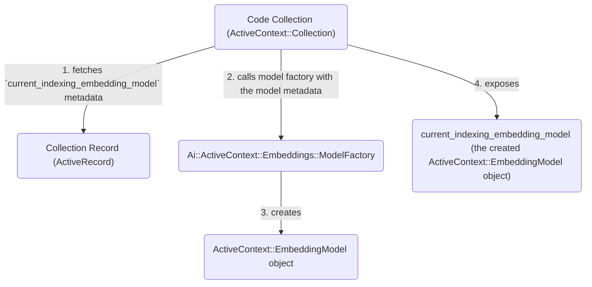

## Overview

For Semantic Search use cases, Embedding Models need to be defined for Active Context Collections to generate the embeddings used for indexing and search.

[Switching an embedding model](#embedding-model-switching) requires a backfill to re-generate embeddings using the new model,
so Active Context's Embedding Model Selection mechanism is separate from
[the Model Configuration functionality used by other GitLab Duo features](https://docs.gitlab.com/administration/gitlab_duo/model_selection/). However, it is backed by the same [Model Switching framework on AI Gateway and synced with AI Feature Settings](#ai-gateway-aifeaturesetting-and-gitlabllmembeddings).

## Embedding Model Metadata

The embedding models are stored in the `Ai::ActiveContext::Collection` record `metadata` as:

- `current_indexing_embedding_model`: The model currently used for indexing content
- `next_indexing_embedding_model`: The model queued to replace the current model (used when switching to a new model)
- `search_embedding_model`: The model used for query embeddings during search. This matches the `current_indexing_embedding_model`

Each embedding model metadata holds the following information:

- `model_type`: Either `gitlab_managed` or `self_hosted`
- `model_ref`: The model identifier (for example, `text_embedding_005_vertex` or the `Ai::SelfHostedModel` ID)
- `field`: The vector store field where embeddings are stored
- `dimensions`: The embedding vector dimensions, used when creating the vector store field and for generating embeddings

For further details on GitLab-managed vs Self-hosted models and their corresponding model identifiers, please refer to the [GitLab-managed vs Self-hosted models section below](#gitlab-managed-vs-self-hosted-models).

## Referencing embedding models from Collection classes

A Collection class (for example, `Ai::ActiveContext::Collections::Code`) does not directly refer to the model metadata hash that's persisted in the collection record.
Instead, it exposes `ActiveContext::EmbeddingModel` objects for `current_indexing_embedding_model`, `next_indexing_embedding_model`, `search_embedding_model`.

**Illustration diagram for the `current_indexing_embedding_model`**



### `ActiveContext::EmbeddingModel`

An `ActiveContext::EmbeddingModel` holds the following information:

- the model metadata (`model_type`, `model_ref`, `field`, `dimensions`)
- `llm_class`: the `Gitlab::Llm` class invoked to generate embeddings, for example, `Gitlab::Llm::Embeddings::CodeEmbeddings`
- `llm_params`, a hash containing:
  - `model_definition`: the `Gitlab::Llm::Embeddings::ModelDefinition` object which contains all relevant information for invoking embeddings generation
  - `batch_size` (optional): the number of contents for each batched embeddings generation invocation

Embeddings generation is invoked on the `ActiveContext::EmbeddingModel` object through its `generate_embeddings` method, that is:

```ruby
ac_embedding_model.generate_embeddings([array, of, contents], user: optional_user_param)
```

### Model factory

The `Ai::ActiveContext::Embeddings::ModelFactory` class creates an `ActiveContext::EmbeddingModel` object given the following information:

- the model metadata
- the current instance type (for example, SaaS or Self-Managed)
- whether the instance is connected to its own [Self-hosted AI Gateway](https://docs.gitlab.com/administration/gitlab_duo_self_hosted/)
- whether the embeddings generation is for a search or indexing operation

Example creating an `ActiveContext::EmbeddingModel` through the `ModelFactory`:

```ruby
ac_embedding_model = Ai::ActiveContext::Embeddings::ModelFactory.for(model_metadata, search: false)
```

### Putting everything together in the Collection class

All Collection classes must define the `Ai::ActiveContext::Embeddings::ModelFactory` as `embedding_model_factory`, for example:

```ruby
# the Ai::ActiveContext::Collections::Code overrides the `embedding_model_factory` to return `Ai::ActiveContext::Embeddings::ModelFactory`
class Ai::ActiveContext::Collections::Code
  def self.embedding_model_factory
    Ai::ActiveContext::Embeddings::ModelFactory
  end
end

# the ::ActiveContext::Concerns::Collection defines `current_indexing_embedding_model` as:
module ActiveContext::Concerns::Collection
  class_methods do
    def current_indexing_embedding_model
      # collection_record.current_indexing_embedding_model is what holds the stored model metadata
      embedding_model_factory.for(collection_record.current_indexing_embedding_model)
    end
  end
end

# when generating embeddings using the Code collection's current indexing model, we simply call:
Ai::ActiveContext::Collections::Code
  .current_indexing_embedding_model
  .generate_embeddings([array, of, contents], user: optional_user_param)
```

## AI Gateway, `Ai::FeatureSetting`, and `GitLab::Llm::Embeddings`

In order to generate embeddings for an Active Context Collection, it must be implemented as an Embeddings AI Feature
with its own key, supported in AI Gateway, synced with `Ai::FeatureSetting`, and invoked with
a `GitLab::Llm::Embeddings::*` class.

**Embeddings AI Feature key**

Each Collection should have its corresponding Embeddings AI Feature key.

For the Code Collection (Semantic Code Search), the corresponding AI Feature key is `embeddings_code`.

**AI Gateway**

- Each Embeddings feature has its own endpoint or pair of endpoints defined under `/v1/embeddings`.

  The `embeddings_code` feature uses 2 endpoints to differentiate between indexing and search operations:

  - `/v1/embeddings/code_embeddings/index`
  - `/v1/embeddings/code_embeddings/search`

- Each Embeddings feature has its own entry in the [Prompt Registry](https://gitlab.com/gitlab-org/modelops/applied-ml/code-suggestions/ai-assist/-/blob/main/docs/aigw_prompt_registry.md). This is defined under `ai_gateway/prompts/definitions/<feature_setting_key>`. It is a [passthrough prompt](https://gitlab.com/gitlab-org/modelops/applied-ml/code-suggestions/ai-assist/-/blob/main/ai_gateway/prompts/embedding.py), which means the input parameters from the request are passed to the LiteLLM class without additional prompts. See [example definition for `embeddings_code`](https://gitlab.com/gitlab-org/modelops/applied-ml/code-suggestions/ai-assist/-/blob/main/ai_gateway/prompts/definitions/embeddings_code/base/1.0.0.yml).

- Each Embeddings feature has its own entry `ai_gateway/model_selection/unit_primitives.yml`, with the accepted `unit_primitives` and `selectable_models`.

  The `selectable_models` are defined in `ai_gateway/model_selection/models.yml`, with `family=embedding`.

- The actual embeddings generation is implemented in [`EmbeddingLiteLLM`](https://gitlab.com/gitlab-org/modelops/applied-ml/code-suggestions/ai-assist/-/blob/main/ai_gateway/models/v2/embedding_litellm.py), which is a `Runnable` wrapper for embeddings endpoints through LiteLLM

**`Ai::FeatureSetting`**

For Self-hosted models, each Embeddings feature is added to the following:

- `Ai::FeatureSetting::STABLE_FEATURES` or `Ai::FeatureSetting::FLAGGED_FEATURES`
- `Ai::ModelSelection::FeaturesConfigurable::FEATURES`
- `ee/lib/gitlab/ai/feature_settings/feature_metadata.yml`

The `current_indexing_embedding_model` is synced with `Ai::FeatureSetting` as part of the [Embedding Model Switching process](#embedding-model-switching).

**Rails `GitLab::Llm::Embeddings::*`** class

To invoke the AI Gateway embeddings endpoint, each feature implements `GitLab::Llm::Embeddings::*` class.
Semantic Code Search uses the `GitLab::Llm::Embeddings::CodeEmbeddings` class, which accepts an array of contents to be embedded,
a `GitLab::Llm::Embeddings::ModelDefinition` object, and an optional user parameter.

The `GitLab::Llm::Embeddings::ModelDefinition` class contains all relevant information for invoking embeddings generation. This includes the `unit_primitive`, AI Feature key, which AI Gateway deployment to invoke (i.e., Cloud AIGW or Self-hosted AIGW), and so on.

## GitLab-managed vs Self-hosted models

Similar to other AI features, Active Context embedding models may be GitLab-managed or Self-hosted.

**GitLab-managed models**

Offered on the [GitLab-operated AI Gateway](https://docs.gitlab.com/administration/gitlab_duo/gateway/). These are models defined on the `ai_gateway/model_selection/models.yml` with `family=embedding`.

The model identifier should be the `gitlab_identifier` field in each entry.

**Self-hosted models**

Models defined by Admin users on [Self-Managed instances](https://docs.gitlab.com/administration/gitlab_duo/configure/) connected to their own [Self-hosted AI Gateway](https://docs.gitlab.com/administration/gitlab_duo_self_hosted/). Users must [add their own Self-hosted models](https://docs.gitlab.com/administration/gitlab_duo_self_hosted/configure_duo_features/#add-a-self-hosted-model) with the `embedding` model family.

The model identifier should be the ID of the `Ai::SelfHostedModel` record.

## Embedding Model Switching

When switching embedding models, an asynchronous backfill process is kicked off to regenerate embeddings for indexed content using the new embedding model. This backfill process leverages the [Active Context Tasks framework](./active_context_tasks.md) by creating a chain of tasks through the `Ai::ActiveContext::EmbeddingModelActivationService`.

### `Ai::ActiveContext::EmbeddingModelActivationService`

#### Parameters

- `collection_class`: for example, `Ai::ActiveContext::Collections::Code`
- `model_ref`: the model identifier
- `dimensions`: the embedding dimensions
- `model_type`: `gitlab_managed` or `self_hosted`
- `skip_embeddings_request_test`: boolean value indicating whether to skip a test embeddings generation invocation, `false` by default
- `chunk_strategy`: [chunking algorithm](../codebase_as_chat_context/chunking.md#chunk-strategy-and-chunk-size) for the collection (for example, `code_bytes` or `code_pre_bert`), only applied on first model setup
- `chunk_strategy_size`: [maximum chunk size](../codebase_as_chat_context/chunking.md#chunk-strategy-and-chunk-size) of each content, only applied on first model setup
- `user`: the user that invoked the embedding model switching, only required in Self-Managed instances with Self-hosted AI Gateway

#### Execution flow

1. Validates the given parameters
2. Runs an actual embeddings generation request with the given model metadata, and raises an error if the request fails
3. Sets the collection's `next_indexing_embedding_model`
4. Creates a chain of [Active Context Tasks](./active_context_tasks.md) for the asynchronous backfill process

### Backfill tasks chain

These are the chain of tasks created by the `EmbeddingModelActivationService`.
These are classes namespaced under `Ai::ActiveContext::Tasks`, and inheriting from the `::ActiveContext::Task[1.0]` base class.

1. `AddEmbeddingsField`
   - adds a new embeddings field to the vector store index
1. `BackfillEmbeddings`
   - reads documents from the vector store
   - generates embeddings from the content
   - populates the new embeddings field
1. `UpdateCollectionMetadata`
   - copies the `next_indexing_embedding_model` to `current_indexing_embedding_model` and `search_embedding_model`
   - sets the `next_indexing_embedding_model` to `nil`
1. `SyncFeatureSettings`
   - syncs the `current_indexing_embedding_model` with the AI Feature Settings records
1. `NullifyField`
   - nullifies the previous embeddings field in the vector store
