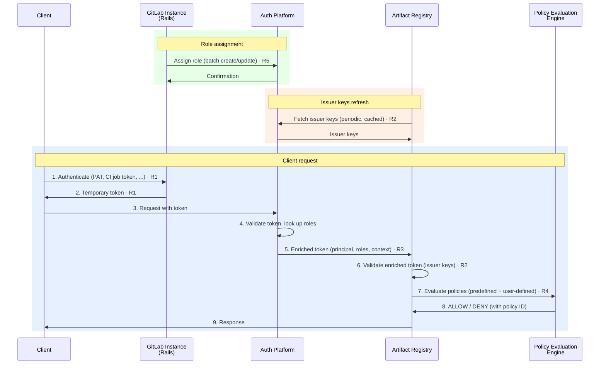
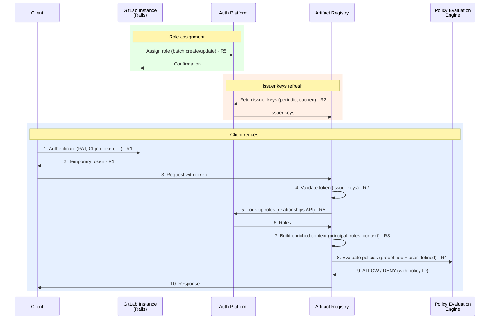

<!-- vale gitlab.FutureTense = NO -->

## Summary

The Artifact Registry is the first stateful modular GitLab service. Authentication and authorization for Artifact Registry cross a potential network boundary (Self-Managed Rails → SaaS Artifact Registry) and rely on platform-owned components (token exchange, token validation, policy evaluation, role storage). An interface agreement is needed so both teams can align on what Artifact Registry requires, what Artifact Registry provides, and where the boundaries are.

This document defines the interface agreement between Artifact Registry and the auth platform. The auth platform team decides the "how"; this document defines the "what". Discussions happen across time and mediums that are not easily trackable by everyone involved. A related decision made elsewhere is neither known nor accepted until persisted and approved in this document.

## Context

Per the [2026-03-27 CTO review](https://docs.google.com/document/d/1qkcOZYSHM_h9k9pYjHze2KHG5qZYMDeZ1UE4GZgD1jw/edit) and the [auth working session](https://gitlab.com/groups/gitlab-org/-/work_items/21373#note_3190382284) (2026-03-25), the auth direction for modular services was agreed upon. The [auth direction work item](https://gitlab.com/gitlab-org/gitlab/-/work_items/595148) is the source for the current design. The [Module Design Principles](https://docs.google.com/document/d/15yZ9wLCIYvHtg5tcWDPrFKIY-H6v7WfFDXf1RnsQVQk/edit) provides additional context but is not required reading to act on this document.

## Timeline

Artifact Registry is targeting .com go-live before the end of Q2 FY27 (July 31, 2026). The MUST requirements in this document need to be met before Artifact Registry can begin customer onboarding.

### Interim state

The auth platform's token enrichment layer may not be available by go-live. Until it is, Artifact Registry assumes that role: Artifact Registry validates the incoming token itself and resolves roles via the [Relationships API](#r5--relationships-api). The interim validation may be more involved than the target state; the specific mechanism is an Artifact Registry implementation concern. All other auth platform capabilities (credential issuance, relationships API, policy evaluation engine) are available from day one.

Requirements affected by the interim state ([R2](#r2--token-validation), [R3](#r3--token-payload)) include an **Interim** subsection describing what changes.

## Requirement levels

This document uses [RFC 2119](https://www.rfc-editor.org/rfc/rfc2119) keywords: **MUST**, **MUST NOT**, **SHOULD**, **SHOULD NOT**, and **MAY** indicate requirement levels.

## Architectural constraints

The following two constraints apply to every requirement below. They are not individual requirements; they shape how all requirements are realized.

### No callbacks during request processing

Artifact Registry never calls back to the GitLab instance, Rails, or any remote service during request processing. Self-Managed instances may be unreachable due to network conditions (firewalls, air-gapped environments). All information Artifact Registry needs to authorize a request MUST be in the token or available locally.

This constraint targets services that may be unreachable — co-located platform services on the SaaS side (e.g., the relationships API) are not subject to this constraint.

### GitLab role vocabulary

Role assignments use the existing set of GitLab roles: `guest`, `reporter`, `developer`, `maintainer`, and `owner`. These are a global platform concept — Artifact Registry does not define its own roles. Custom roles are out of scope for the initial Artifact Registry release.

## Authentication requirements

### R1 — Token exchange service

The auth platform MUST expose an endpoint on the GitLab instance that accepts client credentials and returns a temporary token usable against Artifact Registry.

The endpoint can be called by scripts (e.g., `curl`), the `glab ar` CLI subcommand, or programmatically by CI jobs. CI jobs automatically perform the token exchange in advance if Artifact Registry is available. Client credential management details are tracked in the [client credential management work item](https://gitlab.com/gitlab-org/gitlab/-/work_items/595150).

Artifact Registry is not involved in token issuance. Artifact Registry never sees client credentials.

| Requirement | Level | Owner | Detail |
| ----------------------------- | ------- | ----------------------------- | -------------------------------------------------------------- |
| Token exchange endpoint | MUST | Auth Platform | The GitLab instance MUST expose an endpoint that accepts client credentials and returns a temporary token usable against Artifact Registry. |
| Supported credential types | MUST | Auth Platform | The endpoint MUST support PATs, OAuth tokens, CI job tokens, deploy tokens, and project/group access tokens. |
| Token duration | MUST | Auth Platform | Tokens MUST use a default duration or accept a requested duration with an upper limit. See the [client credential management work item](https://gitlab.com/gitlab-org/gitlab/-/work_items/595150). |
| Enablement enforcement | SHOULD | Auth Platform | Token exchange SHOULD fail for organizations that have not enabled Artifact Registry. Access does not rely on Unit Primitives or add-ons; there is no Artifact Registry add-on under the credit-based billing model. |
| Cross-boundary support | MUST | Auth Platform | The endpoint MUST work whether Artifact Registry and Rails are co-located or remote (Self-Managed Rails → SaaS Artifact Registry). |

### R2 — Token validation

The auth platform MUST expose an endpoint serving the issuer's public keys. Artifact Registry validates every incoming token against these keys.

Even when multiple Self-Managed instances connect to the same SaaS Artifact Registry, all tokens MUST be validatable against single issuer keys.

During key rotation, the issuer MAY advertise additional keys in its JWKS for a short overlap window, with no effect on the single-issuer requirement.

| Requirement | Level | Owner | Detail |
| ---------------------------- | ------- | ----------------- | -------------------------------------------------------------- |
| JWKS public key endpoint | MUST | Auth Platform | The auth platform MUST expose an endpoint serving the issuer's public keys. Artifact Registry uses these keys to validate incoming tokens. |
| Single-issuer keys | MUST | Auth Platform | All tokens, regardless of which GitLab instance performed the token exchange, MUST be validatable against single issuer keys. |
| Caching | SHOULD | Artifact Registry | Artifact Registry SHOULD cache the issuer's public keys and refresh periodically. Artifact Registry SHOULD NOT fetch them on every request. |

#### Interim

The R2 requirements are unchanged at the contract level. The issuer differs from the target state, and the interim validation performed by Artifact Registry may involve additional steps.

### R3 — Token payload

The token received by Artifact Registry MUST carry enough information to authorize the request without callbacks. Artifact Registry does not prescribe the token format or how it is produced.

| Requirement | Level | Owner | Detail |
| ---------------------- | ------- | ----------------- | -------------------------------------------------------------- |
| Principal identity | MUST | Auth Platform | The token MUST contain the principal's GitLab ID. |
| Assigned roles | SHOULD | Auth Platform | The token SHOULD contain the principal's assigned roles for the accessed resource. |
| Context | SHOULD | Auth Platform | The token SHOULD contain context information such as the organization ID. |

#### Interim

The payload requirements are the same — the enriched token carries principal identity, assigned roles, and context regardless of who produces it. In the target state, the auth platform's enrichment layer produces the enriched token before it reaches Artifact Registry. In the interim, Artifact Registry produces it itself by validating the incoming token and resolving roles via the [Relationships API](#r5--relationships-api).

## Authorization requirements

### R4 — Policy evaluation engine

Artifact Registry requires a policy evaluation engine available as a library. The engine evaluates authorization decisions based on predefined policies and user-defined policies.

| Requirement | Level | Owner | Detail |
| ------------------------ | ------- | ----------------- | -------------------------------------------------------------- |
| Go library | MUST | Auth Platform | The policy evaluation engine MUST be available as a Go library that Artifact Registry can embed. |
| Predefined policies | MUST | Auth Platform | The engine MUST support predefined policies. These define the default role-to-permission mappings. |
| User-defined policies | MUST | Auth Platform | The engine MUST support user-defined policies passed at evaluation time. User-defined policies can only tighten the predefined policies, never expand. |
| Decision traceability | MUST | Auth Platform | The engine MUST return the policy ID that determined the decision, for audit logging and debugging. |

### R5 — Relationships API

The auth platform MUST expose an API to manage role assignments (relationships) for Artifact Registry resources. Each relationship binds a principal to a resource with a role.

Administrators manage relationships through the GitLab UI on their local instance. Rails provides the frontend and API for creating, updating, and deleting relationships.

| Requirement | Level | Owner | Detail |
| ------------------------ | ------- | ----------------- | -------------------------------------------------------------- |
| CRUD operations | MUST | Auth Platform | The API MUST support: batch create/update, batch delete, get (with inheritance resolution), list by resource, list by principal. |
| Cross-boundary support | MUST | Auth Platform | The API MUST work across network boundaries (Self-Managed → SaaS), where corporate proxies and firewalls may restrict protocols. |
| Authentication | MUST | Auth Platform | Authentication to this API MUST use the same [token exchange endpoint](#r1--token-exchange-service). |

### R6 — Bootstrapping

Organization owners MUST have all permissions on all Artifact Registry resources. This ensures that when Artifact Registry is enabled for an organization and no explicit role assignments exist, organization owners can create repositories and assign roles to other users.

| Requirement | Level | Owner | Detail |
| --------------------------- | ------- | --------------------- | -------------------------------------------------------------- |
| Organization owner access | MUST | Auth Platform + Artifact Registry | Organization owners MUST have all permissions on all Artifact Registry resources. |

The mechanism is unspecified — this could be achieved through auto-provisioned relationships, token payload, or other means.

## Interaction diagrams

The following sequence diagrams show how the requirements work together for a Self-Managed GitLab instance connected to a SaaS Artifact Registry. Three flows are shown: role assignment, issuer keys refresh, and client requests.

### Target state

The auth platform's token enrichment layer produces the enriched token before it reaches Artifact Registry.

### Interim state

Artifact Registry self-enriches the token by validating it against the issuer's keys and resolving roles via the [Relationships API](#r5--relationships-api). The validation may involve additional steps.

## References

1. [ADR-020: Authentication Flow](../decisions/020_authentication_flow.md)
1. [ADR-022: Namespace Decoupling](../decisions/022_namespace_decoupling.md)
1. Organizations interface agreement (pending, see [Organizations interface agreement MR](https://gitlab.com/gitlab-com/content-sites/handbook/-/merge_requests/19216))
1. [Infrastructure interface agreement](infrastructure.md)
1. [Auth direction work item](https://gitlab.com/gitlab-org/gitlab/-/work_items/595148)
1. [Interim solution storage and API proposal](https://gitlab.com/gitlab-org/gitlab/-/work_items/595148#note_3212799359)
1. [Client credential management](https://gitlab.com/gitlab-org/gitlab/-/work_items/595150)
1. [Module Design Principles](https://docs.google.com/document/d/15yZ9wLCIYvHtg5tcWDPrFKIY-H6v7WfFDXf1RnsQVQk/edit)
1. [CTO review (2026-03-27)](https://docs.google.com/document/d/1qkcOZYSHM_h9k9pYjHze2KHG5qZYMDeZ1UE4GZgD1jw/edit)
1. [Auth working session (2026-03-25)](https://gitlab.com/groups/gitlab-org/-/work_items/21373#note_3190382284)
