<!-- Design Documents often contain forward-looking statements -->
<!-- vale gitlab.FutureTense = NO -->

## Context

The Artifact Registry needs a database organization that takes into account:

- **Different access patterns**: Artifact management clients will use their own protocol which is highly different from one format to another.
- **Scalability**: Artifacts storage can quickly go into millions of rows stored.
- **Performance**: Given the two previous points, we still want to maintain fast execution times on read queries which will be the vast majority of the operations.
- **Previous pitfalls**: The current container and package registry data organization is showing some cracks ([example](https://gitlab.com/groups/gitlab-org/-/work_items/16000), [example](https://gitlab.com/groups/gitlab-org/-/epics/9415)) that we will avoid here.

Before diving into the decisions, a few notes on the following schemas. These are mainly for improving the readability given the amount of tables to present.

- This document describes the core tables of the feature. Additional tables will be required for sub-features and are not described here. For example, see [Cleanup tasks](#cleanup-tasks) for background on auxiliary tables needed for blob storage cleanup.
- Table names have been shortened for readability. They will share a common prefix that is not shown here (for example, `artifacts_registry_container_repositories`).
- The Artifact Registry is scoped to namespaces. See [ADR-001](001_organizations_as_anchor_point.md) for rationale.
- Several common columns, such as primary keys or timestamps, are omitted for clarity.
- All tables include a `namespace_id` column. The [Cells sharding key requirement](https://docs.gitlab.com/ee/development/database/multiple_databases/#guidelines-on-choosing-a-sharding-key) does not apply to satellite service databases; rows are attributed to organizations indirectly through the namespace's anchor tuple (`platform`, `entity_type`, `entity_id`). This column is shown explicitly in all table definitions below.
- All `jsonb` columns must be validated against a strict JSON schema before persistence to prevent unbounded payloads and enforce expected structure. This applies to every `jsonb` column in this document (for example, `rule_configuration` and `package_json`).
- When a table has multiple encrypted credential columns (for example, `encrypted_username` and `encrypted_password` in remote repository tables), a CHECK constraint must enforce that either all credential columns are set or none are — partial credentials (for example, username without password) are not accepted.
- Encrypted credential columns on remote repository tables (`encrypted_username`, `encrypted_password`, `encrypted_auth_token`) cap the plaintext input at 2048 characters, enforced at the Go validation layer before encryption. The cap is on plaintext, which only exists at the application layer; the database sees only `bytea` ciphertext, so any DB-side CHECK (e.g., `octet_length(...) <= N`) could only bound plaintext indirectly via the encryption scheme's fixed overhead (IV, auth tag, key-id header), making it an approximation of the cap and redundant with the mandatory Go check. Omitting the CHECK also keeps the schema decoupled from the crypto framing: changes to the cipher, key-id layout, or envelope structure do not require a schema migration.
- All `id` columns must be unique within the scope of an Artifact Registry instance. `namespaces.id` uses UUIDv7 ([RFC 9562](https://datatracker.ietf.org/doc/rfc9562/)) to guarantee global uniqueness across every Artifact Registry deployment — see [Namespace ID type](#namespace-id-type) for the full rationale, including the available generation paths across PostgreSQL versions. All other `id` columns are `bigint DEFAULT nextval('<table>_id_seq')` so that logical replication compatibility is preserved ([source](https://gitlab.com/gitlab-com/gl-infra/data-access/dbo/dbo-issue-tracker/-/work_items/691#note_3309931104)). Their uniqueness is enforced locally within a single Artifact Registry database, which is sufficient because they are always scoped below a namespace.

## Decisions

We have six areas of data:

- [Namespace table](#namespaces). Decouples the Artifact Registry from external identifiers by introducing an internal namespace entity with an immutable slug and a virtual anchor tuple. See [ADR-022](022_namespace_decoupling.md) for full rationale.
- [Repository collections table](#repository-collections). A logical grouping of repositories within a namespace. Present in the schema from day one but not yet surfaced to users — every namespace gets a "default" repository collection and all repositories are assigned to it automatically.
- Namespace-level tables. These handle [lifecycle policies settings and rules](#lifecycle-policies) and [namespace-level storage statistics](#storage-usage-calculation) scoped directly to the namespace.
- [Repositories parent table](#repositories). A unified registry of all repositories (hosted, virtual, remote) across all formats, powering the landing page hybrid list and cross-format queries.
- Artifact format level tables. Here we have the dedicated tables for each format: hosted repositories ([Container](#container-repositories), [Maven](#maven-repositories), [NPM](#npm-repositories)), remote repositories ([Container](#container-remote-repositories), [Maven](#maven-remote-repositories), [NPM](#npm-remote-repositories)), and virtual repositories ([Container](#virtual-container-repositories), [Maven](#maven-virtual-repositories), [NPM](#npm-virtual-repositories)). Each references the parent `repositories` table via `repository_id`.
- [Blob storage level tables](#blob-storage). Handles the actual storage metadata and [in-progress upload session tracking](#upload-sessions).

### Namespaces

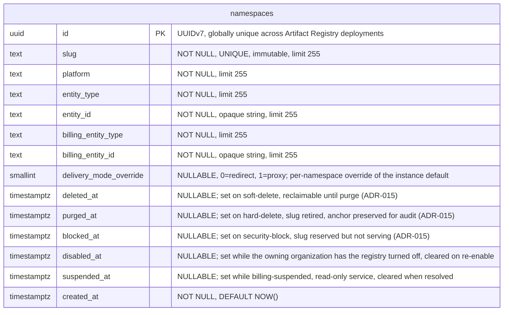
```mermaid
erDiagram
    namespaces {
        uuid id PK "UUIDv7, globally unique across Artifact Registry deployments"
        text slug "NOT NULL, UNIQUE, immutable, limit 255"
        text platform "NOT NULL, limit 255"
        text entity_type "NOT NULL, limit 255"
        text entity_id "NOT NULL, opaque string, limit 255"
        text billing_entity_type "NOT NULL, limit 255"
        text billing_entity_id "NOT NULL, opaque string, limit 255"
        smallint delivery_mode_override "NULLABLE, 0=redirect, 1=proxy; per-namespace override of the instance default"
        timestamptz deleted_at "NULLABLE; set on soft-delete, reclaimable until purge (ADR-015)"
        timestamptz purged_at "NULLABLE; set on hard-delete, slug retired, anchor preserved for audit (ADR-015)"
        timestamptz blocked_at "NULLABLE; set on security-block, slug reserved but not serving (ADR-015)"
        timestamptz disabled_at "NULLABLE; set while the owning organization has the registry turned off, cleared on re-enable"
        timestamptz suspended_at "NULLABLE; set while billing-suspended, read-only service, cleared when resolved"
        timestamptz created_at "NOT NULL, DEFAULT NOW()"
    }
```

- **namespaces**: The root entity that all other tables reference via `namespace_id`. Each namespace has an immutable, globally unique `slug` used in URLs and client configurations (see [ADR-022](022_namespace_decoupling.md) for slug design and global uniqueness enforcement). The `(platform, entity_type, entity_id)` tuple links the namespace to an external entity (Organizations by default) without interpreting its semantics. `entity_id` is stored as `TEXT` even when the underlying value is numeric, keeping the schema uniform across anchor types. For Organizations v1, every row has `('gitlab', 'organization', '<rails_org_id>')`. `billing_entity_type` and `billing_entity_id` identify the billing anchor for usage events. None of the externally-provided columns (`platform`, `entity_type`, `entity_id`, `billing_entity_type`, `billing_entity_id`) carry schema-level defaults; see [ADR-022](022_namespace_decoupling.md) for the rationale. The `delivery_mode_override` column carries the per-namespace artifact delivery override defined by [ADR-005](005_artifact_delivery_mode.md): `NULL` inherits the instance default (`StorageConfig.delivery_mode`), `0` (`redirect`) forces redirect for this namespace, `1` (`proxy`) forces proxy. The effective delivery pattern for a download request is `namespace.delivery_mode_override ?? instance.delivery_mode`; the column is read as part of the existing namespace lookup performed by request handlers for authorization and routing, so no separate query or index is required. The column type is `SMALLINT` with the integer-to-label mapping defined in the Go application (`0 = redirect`, `1 = proxy`), following the [Artifact Registry database conventions](https://gitlab.com/gitlab-org/ops/artifact-registry/-/blob/main/docs/dev/database.md#enums) for enum-style columns (PostgreSQL `ENUM` types are avoided because they are difficult to modify safely). Any future column that stores an artifact-delivery selection (for example, a per-repository override would S17 ever introduce one) reuses the same integer mapping.
- **Lifecycle events** (`deleted_at`, `purged_at`): implement the slug lifecycle defined in [ADR-015 (internal)](https://internal.gitlab.com/handbook/engineering/architecture/design-documents/artifact_registry/decisions/015_slug_policy/#slug-lifecycle). `deleted_at` marks a soft-deleted namespace, reclaimable within the [ADR-010](010_data_retention.md#subscription-expiration) soft-delete window. `purged_at` marks a hard-deleted namespace; the slug is permanently retired and the anchor and billing columns are preserved for audit and forensics. These two are one-way event records: once set, they stay set. A purged row has both populated.
- **Service conditions** (`blocked_at`, `disabled_at`, `suspended_at`): reversible restrictions on an otherwise-live namespace. The timestamp records when the condition was imposed; `NULL` means not in effect; repeat-cycle history lives in the audit event stream, not the row. `blocked_at` marks a security block (slug reserved, no requests served; the namespace remains subscribed). `disabled_at` marks that the owning organization turned the registry off; no requests are served and the data is retained; it is set and cleared through the internal API, driven by the organization-level setting on the Rails side. `suspended_at` marks a billing suspension imposed through the internal API. Service degrades to read-only: downloads are served, writes are rejected. A payment lapse therefore does not break production consumers. The columns are independent so conditions can coexist; lifting one never lifts another.
- **Serviceability predicates**: write-serving lookups (pushes, mutations) require all five columns `NULL`. Read-serving lookups (routing, auth, downloads) require `deleted_at`, `purged_at`, `blocked_at`, and `disabled_at` to be `NULL`; a suspended namespace still serves reads. Subscription-lifecycle queries (billing, retention, scheduled jobs) exclude only `deleted_at` and `purged_at`, because blocked, disabled, and suspended namespaces remain subscribed. The API exposes the derived status (precedence: purged, deleted, blocked, disabled, suspended, active), which Rails caches for display ([ADR-022](022_namespace_decoupling.md#slug-discovery)).

#### Slug immutability

PostgreSQL has no native immutable-column support. Slug immutability ([ADR-022](022_namespace_decoupling.md)) is enforced at the database level with a `BEFORE UPDATE OF slug` trigger that raises an exception if the value changes. This catches any code path that bypasses the application layer (direct database access, admin tooling, migrations). The trigger can be disabled for emergency operations that require a slug change (e.g. `ALTER TABLE namespaces DISABLE TRIGGER trg_namespaces_immutable_slug`).

#### Indexes

- **`namespaces`**: unique index on `(slug)` — look up a namespace by slug. Partial unique index on `(platform, entity_type, entity_id) WHERE purged_at IS NULL` to prevent duplicate anchors among non-purged rows. Active and soft-deleted rows participate; purged rows do not, so a previously-purged organization can re-onboard with a new namespace row while the purged row keeps its anchor data for audit. No index on `delivery_mode_override`, `deleted_at`, `purged_at`, `blocked_at`, `disabled_at`, or `suspended_at`: these columns are read as part of the existing namespace lookup keyed by `id` or `slug`, and the serviceability predicates filter on a single fetched row.

The reserved slug lists defined in [ADR-015 (internal)](https://internal.gitlab.com/handbook/engineering/architecture/design-documents/artifact_registry/decisions/015_slug_policy/#reservation-taxonomy) are not stored in the database.

### Repository collections

A repository collection is a logical grouping of repositories within a namespace, organizing artifacts by team, security domain, or product line. Surfacing repository collections in the UI and API is out of scope for the MVP — the entity exists from day one purely for forward-compatibility. During the MVP, every namespace gets a single "default" repository collection on creation and all repositories are assigned to it. Once the repository collection concept is surfaced post-MVP, users can create additional repository collections and reassign repositories to them.

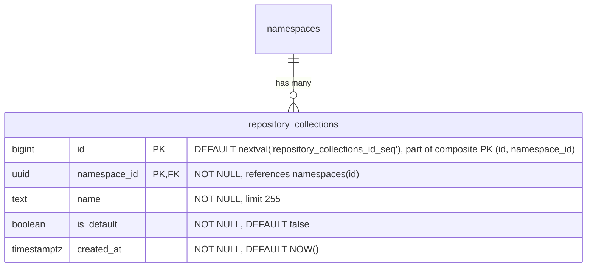
```mermaid
erDiagram
    namespaces ||--o{ repository_collections : "has many"

    repository_collections {
        bigint id PK "DEFAULT nextval('repository_collections_id_seq'), part of composite PK (id, namespace_id)"
        uuid namespace_id PK,FK "NOT NULL, references namespaces(id)"
        text name "NOT NULL, limit 255"
        boolean is_default "NOT NULL, DEFAULT false"
        timestamptz created_at "NOT NULL, DEFAULT NOW()"
    }
```

- **repository_collections**: A logical grouping of repositories within a namespace. `name` is a human-readable label unique within the namespace. `is_default` marks the repository collection that is automatically created with every namespace and to which all repositories are assigned during the MVP. Partitioned by `HASH(namespace_id)` with 64 partitions.

Every namespace creation must atomically insert a default repository collection row:

```sql
INSERT INTO repository_collections (namespace_id, name, is_default)
VALUES (<new_namespace_id>, 'default', true)
ON CONFLICT (namespace_id, name) DO NOTHING;
```

#### Indexes

- **`repository_collections`**: Primary key on `(id, namespace_id)` — composite PK required by `HASH(namespace_id)` partitioning; also serves as the target for the composite foreign key from `repositories`. Unique index on `(namespace_id, name)` — look up a repository collection by name within a namespace. Partial unique index on `(namespace_id) WHERE is_default IS TRUE` — enforce at most one default repository collection per namespace.

#### Query examples

- Get the default repository collection for a namespace:

  ```sql
  SELECT *
  FROM repository_collections
  WHERE namespace_id = '018f4d6f-0e10-7e3a-9bfd-23a4c5d6e7f8' AND is_default = true;
  ```

- List all repository collections for a namespace:

  ```sql
  SELECT id, name, is_default, created_at
  FROM repository_collections
  WHERE namespace_id = '018f4d6f-0e10-7e3a-9bfd-23a4c5d6e7f8'
  ORDER BY created_at;
  ```

- Create a new (non-default) repository collection:

  ```sql
  INSERT INTO repository_collections (namespace_id, name)
  VALUES ('018f4d6f-0e10-7e3a-9bfd-23a4c5d6e7f8', 'team-backend');
  ```

### Repositories

The `repositories` table is a unified parent table that registers every repository in the system regardless of format or kind. It powers the landing page hybrid list — a single sortable, filterable, paginated view showing Hosted, Virtual, and Remote repositories across all formats. Each format-specific repository table (hosted, virtual, remote) references a single row here via `repository_id`.

This model (Hosted, Remote, Virtual as peer-level standalone types, composed by reference) is what JFrog Artifactory, Sonatype Nexus, and Google Cloud AR all use, though each names the types differently.

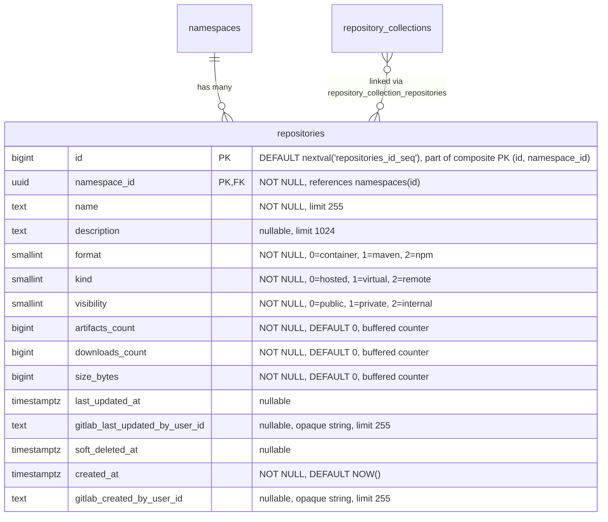
```mermaid
erDiagram
    namespaces ||--o{ repositories : "has many"
    repository_collections }o--o{ repositories : "linked via repository_collection_repositories"

    repositories {
        bigint id PK "DEFAULT nextval('repositories_id_seq'), part of composite PK (id, namespace_id)"
        uuid namespace_id PK,FK "NOT NULL, references namespaces(id)"
        text name "NOT NULL, limit 255"
        text description "nullable, limit 1024"
        smallint format "NOT NULL, 0=container, 1=maven, 2=npm"
        smallint kind "NOT NULL, 0=hosted, 1=virtual, 2=remote"
        smallint visibility "NOT NULL, 0=public, 1=private, 2=internal"
        bigint artifacts_count "NOT NULL, DEFAULT 0, buffered counter"
        bigint downloads_count "NOT NULL, DEFAULT 0, buffered counter"
        bigint size_bytes "NOT NULL, DEFAULT 0, buffered counter"
        timestamptz last_updated_at "nullable"
        text gitlab_last_updated_by_user_id "nullable, opaque string, limit 255"
        timestamptz soft_deleted_at "nullable"
        timestamptz created_at "NOT NULL, DEFAULT NOW()"
        text gitlab_created_by_user_id "nullable, opaque string, limit 255"
    }
```

- **repositories**: The parent entity for all repositories. `format` identifies the artifact format (container, Maven, npm). `kind` identifies the repository type (hosted, virtual, remote). Repositories are linked to repository collections via the [`repository_collection_repositories`](#repository-collection-repositories) join table, allowing a repository to belong to one or more repository collections within its namespace. During the MVP, every repository is linked to the namespace's default repository collection. The `name` must be unique within a namespace, matching all competitors. Counter columns (`artifacts_count`, `downloads_count`, `size_bytes`) are maintained via [buffered/async writes](#buffered-and-asynchronous-writes) to avoid hot-row contention. `last_updated_at` tracks content changes (artifact publish/modify/delete, cache events), not downloads. `gitlab_created_by_user_id` and `gitlab_last_updated_by_user_id` record which GitLab user created and last modified the repository; both are nullable opaque references with no foreign key and no application-side validation, because the user record lives in the monolith — rendering the user handle and avatar is the consumer's responsibility, the AR schema only stores the ID. They are stored as `TEXT` for the same reason as `namespaces.entity_id`: a future change in the upstream user-ID format (for example to UUID) does not require a schema migration. `description` is on the parent because the UI shows descriptions for all repo types, not just virtual ones. The `soft_deleted_at` timestamp records when the repository was soft deleted, enabling restoration if needed. Soft deletion is on the parent table so that all repository types (hosted, virtual, remote) share the same deletion semantics without format-specific handling. Partitioned by `HASH(namespace_id)` with 64 partitions.

Hard-deleting a repository cascades to its structural children. The foreign keys involved carry these referential actions:

- The format child tables (`container_repositories`, `npm_repositories`, `maven_repositories`, and their virtual and remote variants), FK `(repository_id, namespace_id)` referencing `repositories`: `ON DELETE CASCADE`.
- `repository_collection_repositories` (the collection join table), FK `(repository_id, namespace_id)` referencing `repositories`: `ON DELETE CASCADE`.
- The artifact tables (`container_images`, `npm_packages`, `maven_packages`), FK `(<format>_repository_id, namespace_id)` referencing their format child table: `NO ACTION`.

A single `DELETE FROM repositories` therefore removes the format child row and every collection link, but a repository that still holds artifacts cannot be deleted: the artifact-to-child `NO ACTION` foreign key rejects the cascade and the whole statement aborts. The rule is to cascade where the children are pure structure (child row, collection link) and reject where they are user data (artifacts), the declarative counterpart to the soft-delete path above and the application-managed `blob_storage_attachments` cleanup.

#### Indexes

- **`repositories`**: unique index on `(namespace_id, name)` — enforce name uniqueness across both active and soft-deleted repositories, ensuring restoration never fails due to a name conflict. Name reuse requires hard-deletion first. Index on `(namespace_id, name) WHERE soft_deleted_at IS NULL` — optimized scan path for active-repository lookups and name-ordered listings. Index on `(namespace_id, format) WHERE soft_deleted_at IS NULL` — filter active repositories by format. Index on `(namespace_id, kind) WHERE soft_deleted_at IS NULL` — filter active repositories by kind. Index on `(namespace_id, visibility) WHERE soft_deleted_at IS NULL` for filtering repositories by visibility level (powers the visibility-audit query: "which repositories in this namespace are public right now?"). One index per sortable column for the landing page, all with `WHERE soft_deleted_at IS NULL` and a trailing `id DESC` keyset tiebreaker: `(namespace_id, artifacts_count DESC, id DESC)`, `(namespace_id, downloads_count DESC, id DESC)`, `(namespace_id, size_bytes DESC, id DESC)`, and the expression index `(namespace_id, COALESCE(last_updated_at, created_at) DESC, id DESC)`. The `id` half of a `ROW(<col>, id)` keyset bound must be index-resident. The counter columns (`artifacts_count`, `downloads_count`, `size_bytes`) default to `0` and are low-cardinality, so without the tiebreaker in the index the planner applies it as a post-scan sort/filter, degrading deep pages to O(offset) over the namespace. The expression index also carries `id DESC`, not for cardinality (`COALESCE(last_updated_at, created_at)` is high-cardinality, since `created_at` is unique per row) but to give the keyset a deterministic cursor. The recency sort orders by `COALESCE(last_updated_at, created_at)`, not raw `last_updated_at`: a never-updated repository (NULL `last_updated_at`, the common case for a fresh repo) then ranks by its creation time and sorts to the top of "recently updated" instead of sinking under `NULLS LAST`, and because the coalesced key is never NULL the keyset bound is a plain `ROW(<col>, id)` comparison that folds into the index range with no NULL-region special case. The serialized `last_updated_at` field stays nullable; only the sort key coalesces. The `name` sort needs no tiebreaker — its `(namespace_id, name)` unique index is already a deterministic keyset. Index on `(namespace_id, format, name) WHERE soft_deleted_at IS NULL` for the format-filtered name listing (the primary browse view: filter by format, sort by name): it seeks the `(format, name)` range directly and stays index-only, instead of driving off the `(namespace_id, name)` unique index with `format` as a post-index filter that scans past wrong-format rows. Only the format+name combination is indexed; the rarer counter/timestamp sorts keep `format`/`kind` as a post-index filter rather than fan out a composite index per sort-by-filter pair. Index on `(namespace_id, soft_deleted_at DESC) WHERE soft_deleted_at IS NOT NULL` — list soft-deleted repositories in this namespace ordered by deletion time (powers the trash-listing query: "what's in the trash and when was it deleted?"). The inverse partial predicate mirrors the active-row partials above: every other partial on this table excludes the trash, and the full `(namespace_id, name)` unique index does not key `soft_deleted_at`, so a trash listing would otherwise have to visit every row in the namespace to filter and sort. GC eligibility is derived from `soft_deleted_at + retention_window` per [ADR-010](010_data_retention.md); no separate column is needed.

During the MVP, all repositories are linked to a single default repository collection, so the `(namespace_id, ...)` sort indexes serve both namespace-wide and collection-filtered queries. Post-MVP, when namespaces have multiple repository collections, collection-filtered queries join through `repository_collection_repositories`; additional supporting indexes will be evaluated when repository collections are surfaced.

#### Query examples

- List all repositories for a namespace (all repository collections), ordered by last update:

  ```sql
  SELECT id, name, description, format, kind, artifacts_count,
         downloads_count, size_bytes, last_updated_at
  FROM repositories
  WHERE namespace_id = '018f4d6f-0e10-7e3a-9bfd-23a4c5d6e7f8' AND soft_deleted_at IS NULL
  ORDER BY COALESCE(last_updated_at, created_at) DESC
  LIMIT 20;
  ```

- List repositories for a namespace filtered by repository collection, ordered by last update:

  ```sql
  SELECT r.id, r.name, r.description, r.format, r.kind, r.artifacts_count,
         r.downloads_count, r.size_bytes, r.last_updated_at
  FROM repositories r
  JOIN repository_collection_repositories rcr
    ON rcr.namespace_id = r.namespace_id AND rcr.repository_id = r.id
  WHERE r.namespace_id = '018f4d6f-0e10-7e3a-9bfd-23a4c5d6e7f8' AND rcr.repository_collection_id = 456 AND r.soft_deleted_at IS NULL
  ORDER BY COALESCE(r.last_updated_at, r.created_at) DESC
  LIMIT 20;
  ```

- List repositories filtered by repository collection and format:

  ```sql
  SELECT r.id, r.name, r.description, r.format, r.kind, r.artifacts_count,
         r.downloads_count, r.size_bytes, r.last_updated_at
  FROM repositories r
  JOIN repository_collection_repositories rcr
    ON rcr.namespace_id = r.namespace_id AND rcr.repository_id = r.id
  WHERE r.namespace_id = '018f4d6f-0e10-7e3a-9bfd-23a4c5d6e7f8' AND rcr.repository_collection_id = 456 AND r.format = 0
    AND r.soft_deleted_at IS NULL
  ORDER BY r.name
  LIMIT 20;
  ```

- Look up a single repository by name:

  ```sql
  SELECT *
  FROM repositories
  WHERE namespace_id = '018f4d6f-0e10-7e3a-9bfd-23a4c5d6e7f8' AND name = 'my-repo' AND soft_deleted_at IS NULL;
  ```

- Visibility audit: list every public repository in a namespace (uses the partial index on `(namespace_id, visibility) WHERE soft_deleted_at IS NULL`):

  ```sql
  SELECT id, name, format, kind
  FROM repositories
  WHERE namespace_id = '018f4d6f-0e10-7e3a-9bfd-23a4c5d6e7f8' AND visibility = 0 AND soft_deleted_at IS NULL
  ORDER BY name;
  ```

- Trash listing: list every soft-deleted repository in a namespace, most-recently-deleted first (uses the partial index on `(namespace_id, soft_deleted_at DESC) WHERE soft_deleted_at IS NOT NULL`). The scope is namespace-wide so administrators can answer "what is recoverable right now?" in one query; per-parent trash views are a separate UI concern and can be served by adding a parent-keyed index later if needed.

  ```sql
  SELECT id, name, format, kind, soft_deleted_at
  FROM repositories
  WHERE namespace_id = '018f4d6f-0e10-7e3a-9bfd-23a4c5d6e7f8' AND soft_deleted_at IS NOT NULL
  ORDER BY soft_deleted_at DESC
  LIMIT 50;
  ```

### Repository collection repositories

The `repository_collection_repositories` join table maps repositories to the repository collections they belong to. A repository can be a member of one or more repository collections within its namespace, enabling shared-access scenarios such as a common util repository surfaced through several teams' repository collections.

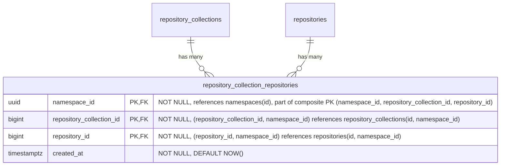
```mermaid
erDiagram
    repository_collections ||--o{ repository_collection_repositories : "has many"
    repositories ||--o{ repository_collection_repositories : "has many"

    repository_collection_repositories {
        uuid namespace_id PK,FK "NOT NULL, references namespaces(id), part of composite PK (namespace_id, repository_collection_id, repository_id)"
        bigint repository_collection_id PK,FK "NOT NULL, (repository_collection_id, namespace_id) references repository_collections(id, namespace_id)"
        bigint repository_id PK,FK "NOT NULL, (repository_id, namespace_id) references repositories(id, namespace_id)"
        timestamptz created_at "NOT NULL, DEFAULT NOW()"
    }
```

- **repository_collection_repositories**: Links repositories to repository collections. During the MVP, every repository is linked to exactly one repository collection (the namespace's default), but the schema permits multiple links so a repository can be shared across repository collections post-MVP. The application enforces the invariant that every repository has at least one repository collection link — Postgres cannot express this declaratively. The composite FKs ensure a repository collection and repository can only be linked within the same namespace. Partitioned by `HASH(namespace_id)` with 64 partitions.

#### Indexes

- **`repository_collection_repositories`**: Primary key on `(namespace_id, repository_collection_id, repository_id)` — enforces uniqueness of a link and serves lookups by repository collection. Index on `(namespace_id, repository_id)` — look up every repository collection a given repository belongs to.

#### Query examples

- List every repository collection a repository belongs to:

  ```sql
  SELECT repository_collection_id
  FROM repository_collection_repositories
  WHERE namespace_id = '018f4d6f-0e10-7e3a-9bfd-23a4c5d6e7f8' AND repository_id = 789;
  ```

- Link a repository to a repository collection:

  ```sql
  INSERT INTO repository_collection_repositories (namespace_id, repository_collection_id, repository_id)
  VALUES ('018f4d6f-0e10-7e3a-9bfd-23a4c5d6e7f8', 456, 789)
  ON CONFLICT (namespace_id, repository_collection_id, repository_id) DO NOTHING;
  ```

### Lifecycle Policies

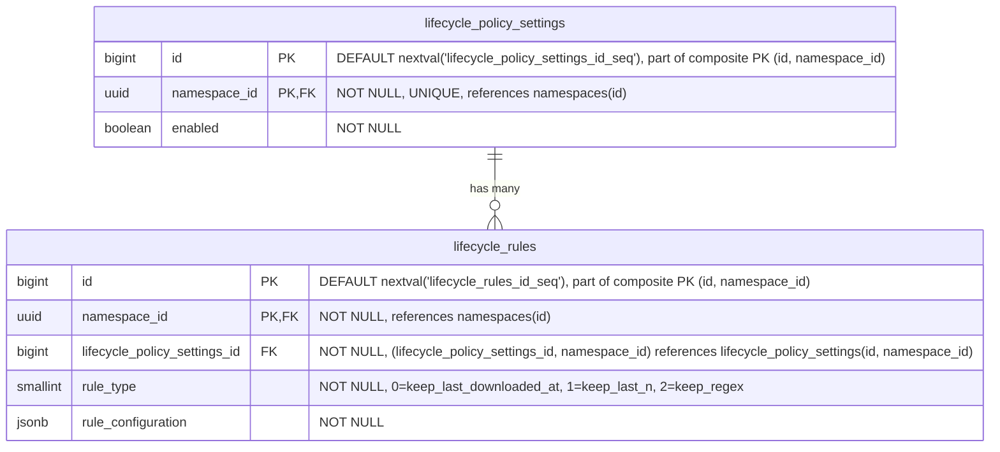
```mermaid
erDiagram
    lifecycle_policy_settings ||--o{ lifecycle_rules : "has many"

    lifecycle_policy_settings {
        bigint id PK "DEFAULT nextval('lifecycle_policy_settings_id_seq'), part of composite PK (id, namespace_id)"
        uuid namespace_id PK,FK "NOT NULL, UNIQUE, references namespaces(id)"
        boolean enabled "NOT NULL"
    }

    lifecycle_rules {
        bigint id PK "DEFAULT nextval('lifecycle_rules_id_seq'), part of composite PK (id, namespace_id)"
        uuid namespace_id PK,FK "NOT NULL, references namespaces(id)"
        bigint lifecycle_policy_settings_id FK "NOT NULL, (lifecycle_policy_settings_id, namespace_id) references lifecycle_policy_settings(id, namespace_id)"
        smallint rule_type "NOT NULL, 0=keep_last_downloaded_at, 1=keep_last_n, 2=keep_regex"
        jsonb rule_configuration "NOT NULL"
    }
```

- **lifecycle_policy_settings**: Defines lifecycle management configuration at the namespace level, serving as the default policy for all repositories. When enabled, associated lifecycle rules are applied namespace-wide. These policies can be [overridden](#repository-level-overrides) by repository-level policies. Partitioned by `HASH(namespace_id)` with 64 partitions.
- **lifecycle_rules**: Specifies individual retention and cleanup rules that govern specific artifacts lifecycle behavior at the namespace level. These rules apply to all repositories unless [overridden](#repository-level-overrides) at the repository level. The number of lifecycle rules per policy record will be limited to prevent performance degradation during rule evaluation. This is used for users to specify, for example, how long certain artifacts are kept around (for example, Maven snapshots files could be kept for 1 month only). Partitioned by `HASH(namespace_id)` with 64 partitions.

#### Indexes

- **`lifecycle_policy_settings`**: unique index on `(namespace_id)` — one policy settings record per namespace.
- **`lifecycle_rules`**: index on `(namespace_id, lifecycle_policy_settings_id)` — fetch all rules for a given policy.

Repository-level override tables follow the same pattern: unique index on `(namespace_id, repository_id)` for the settings table and index on `(namespace_id, <format>_repository_lifecycle_policy_settings_id)` for the rules table.

#### Query examples

- Getting the policy for a given namespace

  ```sql
  SELECT lp.*
  FROM lifecycle_policy_settings lp
  WHERE lp.namespace_id = '018f4d6f-0e10-7e3a-9bfd-23a4c5d6e7f8';
  ```

- Getting the policy of a given artifact repository

  ```sql
  SELECT *
  FROM container_repository_lifecycle_policy_settings
  WHERE container_repository_lifecycle_policy_settings.namespace_id = '018f4d6f-0e10-7e3a-9bfd-23a4c5d6e7f8'
    AND container_repository_lifecycle_policy_settings.repository_id = 123;
  ```

- Creating a new lifecycle rule

  ```sql
  INSERT INTO lifecycle_rules (namespace_id, lifecycle_policy_settings_id, rule_type, rule_configuration)
  VALUES ('018f4d6f-0e10-7e3a-9bfd-23a4c5d6e7f8', 123, 1, '{"count": 10}'::jsonb);
  ```

- Updating a lifecycle rule

  ```sql
  UPDATE lifecycle_rules
  SET rule_configuration = '{"count": 20}'::jsonb
  WHERE namespace_id = '018f4d6f-0e10-7e3a-9bfd-23a4c5d6e7f8'
    AND id = 123;
  ```

- Destroying a lifecycle rule

  ```sql
  DELETE FROM lifecycle_rules
  WHERE namespace_id = '018f4d6f-0e10-7e3a-9bfd-23a4c5d6e7f8'
    AND id = 123;
  ```

#### Repository level overrides

Each repository type ([container](#container-repositories), [maven](#maven-repositories) and [npm](#npm-repositories)) will have similarly named tables to provide overrides to the namespace-level values. This creates a priority system: namespace (lowest) -> Repository (highest). Overrides reference the parent `repositories` table via `repository_id`.

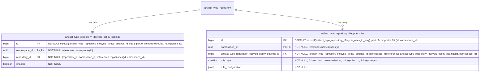
```mermaid
erDiagram
    artifact_type_repository ||--|| artifact_type_repository_lifecycle_policy_settings : "has one"
    artifact_type_repository ||--o{ artifact_type_repository_lifecycle_rules : "has many"

    artifact_type_repository_lifecycle_policy_settings {
        bigint id PK "DEFAULT nextval('artifact_type_repository_lifecycle_policy_settings_id_seq'), part of composite PK (id, namespace_id)"
        uuid namespace_id PK,FK "NOT NULL, references namespaces(id)"
        bigint repository_id FK "NOT NULL, (repository_id, namespace_id) references repositories(id, namespace_id)"
        boolean enabled "NOT NULL"
    }

    artifact_type_repository_lifecycle_rules {
        bigint id PK "DEFAULT nextval('artifact_type_repository_lifecycle_rules_id_seq'), part of composite PK (id, namespace_id)"
        uuid namespace_id PK,FK "NOT NULL, references namespaces(id)"
        bigint artifact_type_repository_lifecycle_policy_settings_id FK "NOT NULL, (artifact_type_repository_lifecycle_policy_settings_id, namespace_id) references artifact_type_repository_lifecycle_policy_settings(id, namespace_id)"
        smallint rule_type "NOT NULL, 0=keep_last_downloaded_at, 1=keep_last_n, 2=keep_regex"
        jsonb rule_configuration "NOT NULL"
    }
```

(`artifact_type` needs to be replaced by `container`, `maven` and `npm` since we have overrides table in each artifact format. These overrides apply to hosted, virtual, and remote repositories alike — the `repository_id` FK references the parent `repositories` table, and the format-specific table is determined by the repository's `format` column.)

These tables act in a way as [cascading settings](https://docs.gitlab.com/development/cascading_settings/). Their descriptions are exactly the same as the similarly named tables on the [namespace level](#lifecycle-policies), including partitioning: every override table is partitioned by `HASH(namespace_id)` with 64 partitions. The current two-tier priority system (namespace → repository) can be extended to three tiers (namespace → repository collection → repository) when repository collections are surfaced post-MVP. This requires adding repository-collection-level override tables following the same pattern; no changes to existing namespace-level or repository-level tables are needed.

### Container Repositories

The challenge in this part is to adhere to the [OCI Distribution Spec v1.1](https://github.com/opencontainers/distribution-spec/blob/main/spec.md).

<!--TODO This link will not live for long since it's an artifact output-->
The approach was heavily inspired by the [GitLab Container Registry schema](https://gitlab.com/gitlab-org/container-registry/-/jobs/12449560500/artifacts/file/db-DAG.png).

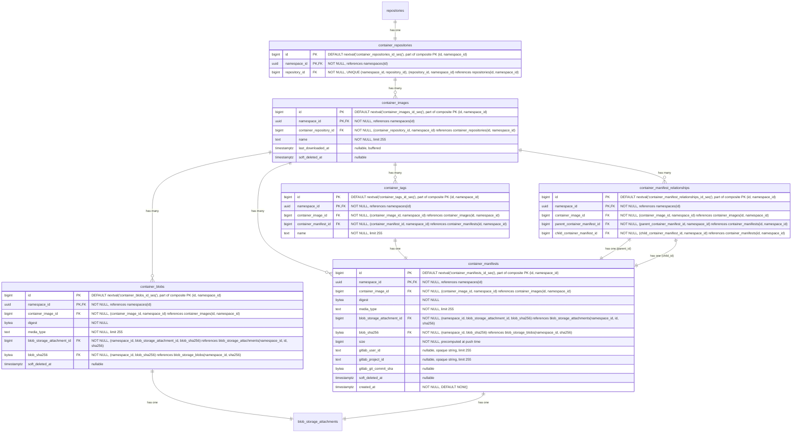
```mermaid
erDiagram
    repositories ||--|| container_repositories : "has one"
    container_repositories ||--o{ container_images : "has many"
    container_images ||--o{ container_blobs : "has many"
    container_images ||--o{ container_manifests : "has many"
    container_images ||--o{ container_manifest_relationships : "has many"
    container_images ||--o{ container_tags : "has many"
    container_tags ||--|| container_manifests : "has one"
    container_blobs ||--|| blob_storage_attachments : "has one"
    container_manifests ||--|| blob_storage_attachments : "has one"
    container_manifest_relationships ||--|| container_manifests : "has one (parent_id)"
    container_manifest_relationships ||--|| container_manifests : "has one (child_id)"

    container_repositories {
        bigint id PK "DEFAULT nextval('container_repositories_id_seq'), part of composite PK (id, namespace_id)"
        uuid namespace_id PK,FK "NOT NULL, references namespaces(id)"
        bigint repository_id FK "NOT NULL, UNIQUE (namespace_id, repository_id), (repository_id, namespace_id) references repositories(id, namespace_id)"
    }

    container_images {
        bigint id PK "DEFAULT nextval('container_images_id_seq'), part of composite PK (id, namespace_id)"
        uuid namespace_id PK,FK "NOT NULL, references namespaces(id)"
        bigint container_repository_id FK "NOT NULL, (container_repository_id, namespace_id) references container_repositories(id, namespace_id)"
        text name "NOT NULL, limit 255"
        timestamptz last_downloaded_at "nullable, buffered"
        timestamptz soft_deleted_at "nullable"
    }

    container_blobs {
        bigint id PK "DEFAULT nextval('container_blobs_id_seq'), part of composite PK (id, namespace_id)"
        uuid namespace_id PK,FK "NOT NULL, references namespaces(id)"
        bigint container_image_id FK "NOT NULL, (container_image_id, namespace_id) references container_images(id, namespace_id)"
        bytea digest "NOT NULL"
        text media_type "NOT NULL, limit 255"
        bigint blob_storage_attachment_id FK "NOT NULL, (namespace_id, blob_storage_attachment_id, blob_sha256) references blob_storage_attachments(namespace_id, id, sha256)"
        bytea blob_sha256 FK "NOT NULL, (namespace_id, blob_sha256) references blob_storage_blobs(namespace_id, sha256)"
        timestamptz soft_deleted_at "nullable"
    }

    container_manifests {
        bigint id PK "DEFAULT nextval('container_manifests_id_seq'), part of composite PK (id, namespace_id)"
        uuid namespace_id PK,FK "NOT NULL, references namespaces(id)"
        bigint container_image_id FK "NOT NULL, (container_image_id, namespace_id) references container_images(id, namespace_id)"
        bytea digest "NOT NULL"
        text media_type "NOT NULL, limit 255"
        bigint blob_storage_attachment_id FK "NOT NULL, (namespace_id, blob_storage_attachment_id, blob_sha256) references blob_storage_attachments(namespace_id, id, sha256)"
        bytea blob_sha256 FK "NOT NULL, (namespace_id, blob_sha256) references blob_storage_blobs(namespace_id, sha256)"
        bigint size "NOT NULL, precomputed at push time"
        text gitlab_user_id "nullable, opaque string, limit 255"
        text gitlab_project_id "nullable, opaque string, limit 255"
        bytea gitlab_git_commit_sha "nullable"
        timestamptz soft_deleted_at "nullable"
        timestamptz created_at "NOT NULL, DEFAULT NOW()"
    }

    container_manifest_relationships {
        bigint id PK "DEFAULT nextval('container_manifest_relationships_id_seq'), part of composite PK (id, namespace_id)"
        uuid namespace_id PK,FK "NOT NULL, references namespaces(id)"
        bigint container_image_id FK "NOT NULL, (container_image_id, namespace_id) references container_images(id, namespace_id)"
        bigint parent_container_manifest_id FK "NOT NULL, (parent_container_manifest_id, namespace_id) references container_manifests(id, namespace_id)"
        bigint child_container_manifest_id FK "NOT NULL, (child_container_manifest_id, namespace_id) references container_manifests(id, namespace_id)"
    }

    container_tags {
        bigint id PK "DEFAULT nextval('container_tags_id_seq'), part of composite PK (id, namespace_id)"
        uuid namespace_id PK,FK "NOT NULL, references namespaces(id)"
        bigint container_image_id FK "NOT NULL, (container_image_id, namespace_id) references container_images(id, namespace_id)"
        bigint container_manifest_id FK "NOT NULL, (container_manifest_id, namespace_id) references container_manifests(id, namespace_id)"
        text name "NOT NULL, limit 255"
    }
```

- **container_repositories**: The container of multiple images. Each repository can host multiple images with independent versioning. References the parent `repositories` table via `repository_id` for name, visibility, and cross-format queries. Partitioned by `HASH(namespace_id)` with 64 partitions.
- **container_images**: Represents a named container image within a repository (for example, `myapp`, `backend`). `last_downloaded_at` records when the image was last pulled; maintained via [buffered/async writes](#buffered-and-asynchronous-writes). Used by `keep_last_downloaded_at` lifecycle rules to evaluate download-based retention ([ADR-010](010_data_retention.md)). The `soft_deleted_at` timestamp records when the image was soft deleted, enabling restoration if needed. Partitioned by `HASH(namespace_id)` with 64 partitions.
- **container_blobs**: Stores individual content-addressable layers and configuration objects that comprise container images. The relationship between a manifest and its constituent layers (blobs) is implicit — determined by parsing the manifest content at runtime — and is not modeled as a database foreign key. The `soft_deleted_at` timestamp records when the blob was soft deleted, enabling restoration if needed. Partitioned by `HASH(namespace_id)` with 64 partitions.
- **container_manifests**: Represents the image manifest that describes the configuration and layers for a specific image version. The `size` column holds the total byte size of the manifest tree rooted here: this manifest's own payload plus every blob reachable from it, transitively through any child manifests for manifest lists and OCI indexes. `gitlab_user_id` records which GitLab user pushed this manifest; nullable opaque text reference with no foreign key, same rationale as the equivalent column on [repositories](#repositories) — the user record lives in the monolith, rendering the user handle and avatar is the consumer's responsibility, the AR schema stores only the ID, and `TEXT` insulates the schema from any future change to the upstream user-ID format. `gitlab_project_id` and `gitlab_git_commit_sha` extend that attribution with the rest of the publish context: `gitlab_project_id` is the GitLab project the push originated from (for example, `CI_PROJECT_ID`), stored as nullable opaque text for the same monolith-reference reasons as `gitlab_user_id`. `gitlab_git_commit_sha` is the publish-time Git commit (for example, `CI_COMMIT_SHA`), stored as nullable `bytea` per the schema convention for hash columns — variable-length, fits both SHA-1 (20 bytes) and SHA-256 (32 bytes); it is a publish-time fact rather than a monolith reference, so no foreign key is needed. Both are NULL when the push arrives without CI context (for example, a manual push from a developer workstation). The `soft_deleted_at` timestamp records when the manifest was soft deleted, enabling restoration if needed. `created_at` records when the manifest was first pushed; combined with the per-namespace time-ordered index it powers publication-history and time-range artifact-provenance queries (for example, "what was pushed to this namespace between 2am and 8am?"). Soft-deleted rows continue to appear in publication history because the publish event itself is not erased by deletion. Partitioned by `HASH(namespace_id)` with 64 partitions.
- **container_manifest_relationships**: Handles Docker manifest lists and OCI indexes (such as for multi-architecture images) where a parent manifest can reference multiple other manifests. Partitioned by `HASH(namespace_id)` with 64 partitions.
- **container_tags**: Provides human-readable names (for example, `latest`, `v1.2.3`) that point to specific manifests. Partitioned by `HASH(namespace_id)` with 64 partitions.
- **blob_storage_attachments**: See [Blob storage](#blob-storage) section for details.

The `container_blobs` table does not directly store the container registry physical blobs as other container registry architectures might do. The difference here is that the blob storage is handled in the [blob storage](#blob-storage) tables (along with deduplication and garbage collection). Thus, at the `container_*` level, we simply need to store a reference to a `blob_storage_attachments` record and that's it.

#### Indexes

- **`container_repositories`**: unique index on `(namespace_id, repository_id)` — look up a container repository by its parent repository reference.
- **`container_images`**: unique index on `(namespace_id, container_repository_id, name) WHERE soft_deleted_at IS NULL` — an image name identifies a unique image within a repository; duplicates would break OCI name-based lookups. The partial condition allows recreating an image with the same name after soft deletion; index on `(namespace_id, container_repository_id, last_downloaded_at NULLS FIRST) WHERE soft_deleted_at IS NULL` — support `keep_last_downloaded_at` lifecycle rule evaluation; returns only aged-out images via a bounded range scan rather than scanning every image in the repository and filtering row-by-row. `NULLS FIRST` groups never-downloaded images with the oldest rows so both are returned by the same range scan.
- **`container_blobs`**: unique index on `(namespace_id, container_image_id, digest) WHERE soft_deleted_at IS NULL` — a blob digest is content-addressed; the same digest within the same image is the same blob by definition. The partial condition allows re-pushing the same digest after soft deletion; index on `(namespace_id, blob_storage_attachment_id)` — look up a blob by its storage attachment; index on `(namespace_id, blob_sha256)` — reverse lookup from a stored blob sha256 to every container blob referencing it, powering cross-format checksum search and the vulnerability-impact query "given this compromised digest, which images reference it?". The existing `(namespace_id, container_image_id, digest)` index is image-keyed and can only scan within one image, so without this index the query falls back to a per-namespace partition scan. The same shape applies to every other reverse-lookup index in this MR: unconditional (no `soft_deleted_at` predicate) so a digest that was once referenced still appears in the audit trail. Vulnerability impact, which only wants currently-affected artifacts, adds `soft_deleted_at IS NULL` to the join against the parent table (image/version/package) at query time — a cheap post-filter on a small intermediate set.
- **`container_manifests`**: unique index on `(namespace_id, container_image_id, digest) WHERE soft_deleted_at IS NULL` — a manifest digest is content-addressed; the same digest within the same image is the same manifest by definition. The partial condition allows re-pushing the same digest after soft deletion; index on `(namespace_id, blob_storage_attachment_id)` — look up a manifest by its storage attachment; index on `(namespace_id, blob_sha256)` — reverse lookup from the stored blob sha256 of the manifest payload to every manifest referencing it, powering cross-format checksum search. Mirrors the [`container_blobs`](#container-repositories) index so a single sha256 lookup returns both layer and manifest references in one walk; index on `(namespace_id, soft_deleted_at DESC) WHERE soft_deleted_at IS NOT NULL` — list soft-deleted manifests ordered by deletion time, powering the artifact-granularity trash-listing query for container images; index on `(namespace_id, created_at DESC)` — chronological scans across the namespace, powering publication-history pagination and time-range artifact-provenance queries. Unconditional (no `soft_deleted_at` predicate) so a publish event that was later soft-deleted still appears in the audit trail.
- **`container_manifest_relationships`**: unique index on `(namespace_id, parent_container_manifest_id, child_container_manifest_id)` — prevent duplicate parent-child relationships and find all children of a given parent manifest; index on `(namespace_id, child_container_manifest_id)` — find all parents of a given child manifest; index on `(namespace_id, container_image_id)` — find all manifest relationships for a given image.
- **`container_tags`**: unique index on `(namespace_id, container_image_id, name)` — look up a tag by name within an image; index on `(namespace_id, container_manifest_id)` — find all tags pointing to a given manifest.

#### Query examples

- Get image by name

  ```sql
  SELECT *
  FROM container_images
  WHERE namespace_id = '018f4d6f-0e10-7e3a-9bfd-23a4c5d6e7f8' AND container_repository_id = 123 AND name = 'myapp/backend'
    AND soft_deleted_at IS NULL;
  ```

- Get blob by digest for a repository id

  ```sql
  SELECT cb.*
  FROM container_blobs cb
  JOIN container_images ci
    ON cb.container_image_id = ci.id AND cb.namespace_id = ci.namespace_id
  WHERE ci.namespace_id = '018f4d6f-0e10-7e3a-9bfd-23a4c5d6e7f8' AND ci.container_repository_id = 123
    AND cb.digest = 'sha256:abcd1234...'::bytea
    AND ci.soft_deleted_at IS NULL AND cb.soft_deleted_at IS NULL;
  ```

- Get manifest by digest for a repository id

  ```sql
  SELECT cm.*
  FROM container_manifests cm
  JOIN container_images ci
    ON cm.container_image_id = ci.id AND cm.namespace_id = ci.namespace_id
  WHERE ci.namespace_id = '018f4d6f-0e10-7e3a-9bfd-23a4c5d6e7f8' AND ci.container_repository_id = 123
    AND cm.digest = 'sha256:efgh5678...'::bytea
    AND ci.soft_deleted_at IS NULL AND cm.soft_deleted_at IS NULL;
  ```

- Checksum search and vulnerability impact: given a stored blob `sha256`, find every artifact in the namespace that references it (uses the `(namespace_id, blob_sha256)` index on each format table). The `namespace_id` equality prunes to a single partition per table, and the index then returns the matching rows directly instead of scanning the partition. Checksum search returns all references; vulnerability impact ("which artifacts are currently affected by this compromised digest?") adds `soft_deleted_at IS NULL` to restrict the result to active artifacts.

  ```sql
  -- Single format: container layer/config blobs referencing the digest
  SELECT cb.id, cb.container_image_id, cb.digest
  FROM container_blobs cb
  WHERE cb.namespace_id = '018f4d6f-0e10-7e3a-9bfd-23a4c5d6e7f8'
    AND cb.blob_sha256 = 'sha256:abcd1234...'::bytea;

  -- Cross-format: every artifact referencing the digest, active rows only (vulnerability impact)
  SELECT 'container_blob' AS artifact_kind, cb.id AS artifact_id, cb.container_image_id AS parent_id
  FROM container_blobs cb
  WHERE cb.namespace_id = '018f4d6f-0e10-7e3a-9bfd-23a4c5d6e7f8'
    AND cb.blob_sha256 = 'sha256:abcd1234...'::bytea AND cb.soft_deleted_at IS NULL
  UNION ALL
  SELECT 'container_manifest', cm.id, cm.container_image_id
  FROM container_manifests cm
  WHERE cm.namespace_id = '018f4d6f-0e10-7e3a-9bfd-23a4c5d6e7f8'
    AND cm.blob_sha256 = 'sha256:abcd1234...'::bytea AND cm.soft_deleted_at IS NULL
  UNION ALL
  SELECT 'maven_file', mf.id, mf.maven_version_id
  FROM maven_files mf
  WHERE mf.namespace_id = '018f4d6f-0e10-7e3a-9bfd-23a4c5d6e7f8'
    AND mf.blob_sha256 = 'sha256:abcd1234...'::bytea AND mf.soft_deleted_at IS NULL
  UNION ALL
  SELECT 'npm_file', nf.id, nf.npm_version_id
  FROM npm_files nf
  WHERE nf.namespace_id = '018f4d6f-0e10-7e3a-9bfd-23a4c5d6e7f8'
    AND nf.blob_sha256 = 'sha256:abcd1234...'::bytea AND nf.soft_deleted_at IS NULL;
  ```

  The same `(namespace_id, blob_sha256)` access path applies to the cache-side tables (`container_remote_blobs`, `container_remote_manifests`, `maven_remote_files`, `npm_remote_files`) and to `npm_metadata_files` / `npm_remote_metadata_files`; extend the `UNION ALL` to those tables to also cover cached references.

### Container Remote Repositories

Remote repositories represent external container registries that can be proxied and cached. They are standalone entities with their own lifecycle, shareable across multiple virtual repositories. They are referenced by virtual repository upstreams via the parent `repositories` table.

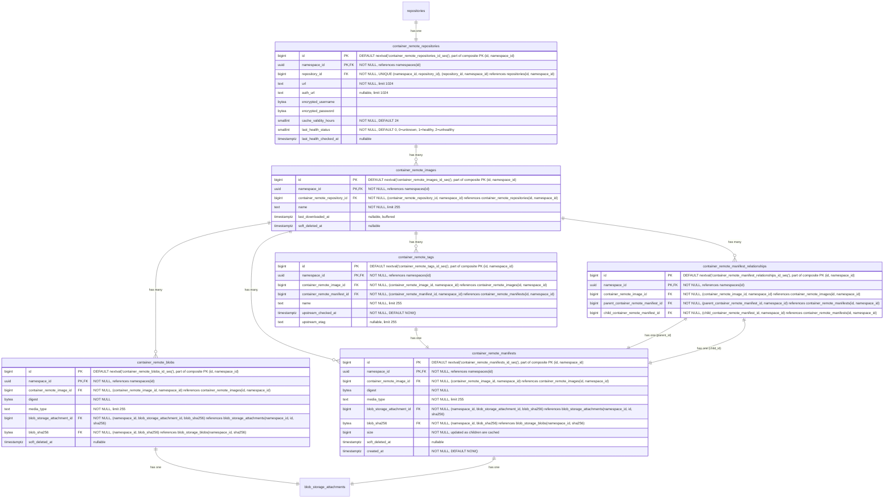
```mermaid
erDiagram
    repositories ||--|| container_remote_repositories : "has one"
    container_remote_repositories ||--o{ container_remote_images : "has many"
    container_remote_images ||--o{ container_remote_blobs : "has many"
    container_remote_images ||--o{ container_remote_manifests : "has many"
    container_remote_images ||--o{ container_remote_manifest_relationships : "has many"
    container_remote_images ||--o{ container_remote_tags : "has many"
    container_remote_tags ||--|| container_remote_manifests : "has one"
    container_remote_blobs ||--|| blob_storage_attachments : "has one"
    container_remote_manifests ||--|| blob_storage_attachments : "has one"
    container_remote_manifest_relationships ||--|| container_remote_manifests : "has one (parent_id)"
    container_remote_manifest_relationships ||--|| container_remote_manifests : "has one (child_id)"

    container_remote_repositories {
        bigint id PK "DEFAULT nextval('container_remote_repositories_id_seq'), part of composite PK (id, namespace_id)"
        uuid namespace_id PK,FK "NOT NULL, references namespaces(id)"
        bigint repository_id FK "NOT NULL, UNIQUE (namespace_id, repository_id), (repository_id, namespace_id) references repositories(id, namespace_id)"
        text url "NOT NULL, limit 1024"
        text auth_url "nullable, limit 1024"
        bytea encrypted_username
        bytea encrypted_password
        smallint cache_validity_hours "NOT NULL, DEFAULT 24"
        smallint last_health_status "NOT NULL, DEFAULT 0, 0=unknown, 1=healthy, 2=unhealthy"
        timestamptz last_health_checked_at "nullable"
    }

    container_remote_images {
        bigint id PK "DEFAULT nextval('container_remote_images_id_seq'), part of composite PK (id, namespace_id)"
        uuid namespace_id PK,FK "NOT NULL, references namespaces(id)"
        bigint container_remote_repository_id FK "NOT NULL, (container_remote_repository_id, namespace_id) references container_remote_repositories(id, namespace_id)"
        text name "NOT NULL, limit 255"
        timestamptz last_downloaded_at "nullable, buffered"
        timestamptz soft_deleted_at "nullable"
    }

    container_remote_blobs {
        bigint id PK "DEFAULT nextval('container_remote_blobs_id_seq'), part of composite PK (id, namespace_id)"
        uuid namespace_id PK,FK "NOT NULL, references namespaces(id)"
        bigint container_remote_image_id FK "NOT NULL, (container_remote_image_id, namespace_id) references container_remote_images(id, namespace_id)"
        bytea digest "NOT NULL"
        text media_type "NOT NULL, limit 255"
        bigint blob_storage_attachment_id FK "NOT NULL, (namespace_id, blob_storage_attachment_id, blob_sha256) references blob_storage_attachments(namespace_id, id, sha256)"
        bytea blob_sha256 FK "NOT NULL, (namespace_id, blob_sha256) references blob_storage_blobs(namespace_id, sha256)"
        timestamptz soft_deleted_at "nullable"
    }

    container_remote_manifests {
        bigint id PK "DEFAULT nextval('container_remote_manifests_id_seq'), part of composite PK (id, namespace_id)"
        uuid namespace_id PK,FK "NOT NULL, references namespaces(id)"
        bigint container_remote_image_id FK "NOT NULL, (container_remote_image_id, namespace_id) references container_remote_images(id, namespace_id)"
        bytea digest "NOT NULL"
        text media_type "NOT NULL, limit 255"
        bigint blob_storage_attachment_id FK "NOT NULL, (namespace_id, blob_storage_attachment_id, blob_sha256) references blob_storage_attachments(namespace_id, id, sha256)"
        bytea blob_sha256 FK "NOT NULL, (namespace_id, blob_sha256) references blob_storage_blobs(namespace_id, sha256)"
        bigint size "NOT NULL, updated as children are cached"
        timestamptz soft_deleted_at "nullable"
        timestamptz created_at "NOT NULL, DEFAULT NOW()"
    }

    container_remote_manifest_relationships {
        bigint id PK "DEFAULT nextval('container_remote_manifest_relationships_id_seq'), part of composite PK (id, namespace_id)"
        uuid namespace_id PK,FK "NOT NULL, references namespaces(id)"
        bigint container_remote_image_id FK "NOT NULL, (container_remote_image_id, namespace_id) references container_remote_images(id, namespace_id)"
        bigint parent_container_remote_manifest_id FK "NOT NULL, (parent_container_remote_manifest_id, namespace_id) references container_remote_manifests(id, namespace_id)"
        bigint child_container_remote_manifest_id FK "NOT NULL, (child_container_remote_manifest_id, namespace_id) references container_remote_manifests(id, namespace_id)"
    }

    container_remote_tags {
        bigint id PK "DEFAULT nextval('container_remote_tags_id_seq'), part of composite PK (id, namespace_id)"
        uuid namespace_id PK,FK "NOT NULL, references namespaces(id)"
        bigint container_remote_image_id FK "NOT NULL, (container_remote_image_id, namespace_id) references container_remote_images(id, namespace_id)"
        bigint container_remote_manifest_id FK "NOT NULL, (container_remote_manifest_id, namespace_id) references container_remote_manifests(id, namespace_id)"
        text name "NOT NULL, limit 255"
        timestamptz upstream_checked_at "NOT NULL, DEFAULT NOW()"
        text upstream_etag "nullable, limit 255"
    }
```

- **container_remote_repositories**: Represents an external container registry. Includes URL, optional authentication URL (`auth_url`), credentials, and cache TTL (`cache_validity_hours`). Health check status is tracked for monitoring. References the parent `repositories` table via `repository_id`. Because remote repos are standalone, two virtual repositories using the same remote share one cache. Partitioned by `HASH(namespace_id)` with 64 partitions.
- **container_remote_images**: A cached container image within a remote repository. Mirrors `container_images`. `last_downloaded_at` records when the cached image was last pulled; maintained via buffered/async writes (same pattern as `repositories.downloads_count`) to avoid hot-row contention. Used by `keep_last_downloaded_at` lifecycle rules and cache retention evaluation ([ADR-010](010_data_retention.md)). Partitioned by `HASH(namespace_id)` with 64 partitions.
- **container_remote_blobs**: A cached layer or config blob. Partitioned by `HASH(namespace_id)` with 64 partitions.
- **container_remote_manifests**: A cached image manifest. The `size` column holds the byte footprint of the subtree this cache knows about: the manifest's own payload at cache time plus each child's `size` as children arrive. For image manifests the value is complete at cache time; for manifest lists and OCI indexes it converges to the full tree footprint progressively as children are fetched and may stay partial if some children are never pulled. This progressive semantic reflects lazy remote caching — eagerly fetching children purely to keep `size` complete would undermine the lazy design. `created_at` records when the manifest was first cached and powers the same publication-history and time-range provenance scans as the hosted equivalent ([`container_manifests`](#container-repositories)). Partitioned by `HASH(namespace_id)` with 64 partitions.
- **container_remote_manifest_relationships**: Cached multi-architecture manifest list relationships. Same structure as the hosted equivalent. Partitioned by `HASH(namespace_id)` with 64 partitions.
- **container_remote_tags**: Cached tag-to-manifest mappings. Tags are mutable pointers — on cache revalidation, a tag may be re-pointed to a new manifest. `upstream_checked_at` records when the tag was last validated against the upstream registry; compared with `cache_validity_hours` to decide if revalidation is needed. `upstream_etag` stores the ETag returned by the upstream, enabling conditional requests (`If-None-Match`) to avoid full manifest resolution when the tag still points to the same manifest. Manifests and blobs do not need freshness tracking because they are content-addressed by cryptographic hash — if the stored bytes match the digest, the content is guaranteed correct. Partitioned by `HASH(namespace_id)` with 64 partitions.
- **blob_storage_attachments**: See [Blob storage](#blob-storage) section for details.

#### Indexes

- **`container_remote_repositories`**: unique index on `(namespace_id, repository_id)` — look up a remote repository by its parent reference.
- **`container_remote_images`**: unique index on `(namespace_id, container_remote_repository_id, name) WHERE soft_deleted_at IS NULL` — look up a cached image by name; the partial condition allows recreating an image with the same name after soft deletion.
- **`container_remote_blobs`**: unique index on `(namespace_id, container_remote_image_id, digest) WHERE soft_deleted_at IS NULL` — look up a cached blob by digest within an image; the partial condition allows re-caching the same digest after soft deletion; index on `(namespace_id, blob_storage_attachment_id)` — look up a blob by its storage attachment; index on `(namespace_id, blob_sha256)` — reverse lookup from a stored blob sha256 to every cached blob referencing it, mirroring the hosted [`container_blobs`](#container-repositories) index so checksum search and vulnerability impact cover cache-side references too.
- **`container_remote_manifests`**: unique index on `(namespace_id, container_remote_image_id, digest) WHERE soft_deleted_at IS NULL` — look up a cached manifest by digest within an image; the partial condition allows re-caching the same digest after soft deletion; index on `(namespace_id, blob_storage_attachment_id)` — look up a manifest by its storage attachment; index on `(namespace_id, blob_sha256)` — reverse lookup from the stored blob sha256 of the manifest payload to every cached manifest referencing it, mirroring the hosted [`container_manifests`](#container-repositories) index; index on `(namespace_id, soft_deleted_at DESC) WHERE soft_deleted_at IS NOT NULL` — list soft-deleted cached manifests ordered by deletion time, powering the artifact-granularity trash-listing query for cached container images; index on `(namespace_id, created_at DESC)` — chronological scans across the namespace, mirroring the hosted [`container_manifests`](#container-repositories) index to cover cache-side publication history and provenance. Unconditional (no `soft_deleted_at` predicate) for the same audit-trail reason as the hosted index.
- **`container_remote_manifest_relationships`**: unique index on `(namespace_id, parent_container_remote_manifest_id, child_container_remote_manifest_id)` — prevent duplicate parent-child relationships; index on `(namespace_id, child_container_remote_manifest_id)` — find all parents of a given child manifest; index on `(namespace_id, container_remote_image_id)` — find all manifest relationships for a given image.
- **`container_remote_tags`**: unique index on `(namespace_id, container_remote_image_id, name)` — look up a tag by name within an image; index on `(namespace_id, container_remote_manifest_id)` — find all tags pointing to a given manifest.

#### Query examples

- Create a remote repository

  ```sql
  -- Resolve the default repository collection for the namespace
  SELECT id FROM repository_collections WHERE namespace_id = '018f4d6f-0e10-7e3a-9bfd-23a4c5d6e7f8' AND is_default = true;
  -- Create the parent repository
  INSERT INTO repositories (namespace_id, name, format, kind, visibility)
  VALUES ('018f4d6f-0e10-7e3a-9bfd-23a4c5d6e7f8', 'docker-hub', 0, 2, 1)
  RETURNING id;
  -- Link the repository to the repository collection
  INSERT INTO repository_collection_repositories (namespace_id, repository_collection_id, repository_id)
  VALUES ('018f4d6f-0e10-7e3a-9bfd-23a4c5d6e7f8', <repository_collection_id>, <returned_id>);
  -- Then create the format-specific record
  INSERT INTO container_remote_repositories (namespace_id, repository_id, url, encrypted_username, encrypted_password)
  VALUES ('018f4d6f-0e10-7e3a-9bfd-23a4c5d6e7f8', <returned_id>, 'https://registry.hub.docker.com', $1, $2);
  ```

- Check if a cached manifest is fresh

  ```sql
  SELECT crm.digest
  FROM container_remote_manifests crm
  JOIN container_remote_tags crt
    ON crt.container_remote_manifest_id = crm.id AND crt.namespace_id = crm.namespace_id
  JOIN container_remote_images cri
    ON crt.container_remote_image_id = cri.id AND crt.namespace_id = cri.namespace_id
  WHERE cri.namespace_id = '018f4d6f-0e10-7e3a-9bfd-23a4c5d6e7f8'
    AND cri.container_remote_repository_id = 789
    AND cri.name = 'library/nginx'
    AND crt.name = 'latest'
    AND cri.soft_deleted_at IS NULL AND crm.soft_deleted_at IS NULL;
  ```

- Pull a cached blob by digest (read-path shortcut to blob storage)

  ```sql
  SELECT bsb.object_storage_key, bsb.size
  FROM container_remote_blobs crb
  JOIN blob_storage_blobs bsb
    ON bsb.namespace_id = crb.namespace_id AND bsb.sha256 = crb.blob_sha256
  WHERE crb.namespace_id = '018f4d6f-0e10-7e3a-9bfd-23a4c5d6e7f8'
    AND crb.container_remote_image_id = 456
    AND crb.digest = 'sha256:abcd1234...'::bytea
    AND crb.soft_deleted_at IS NULL;
  ```

### Virtual Container Repositories

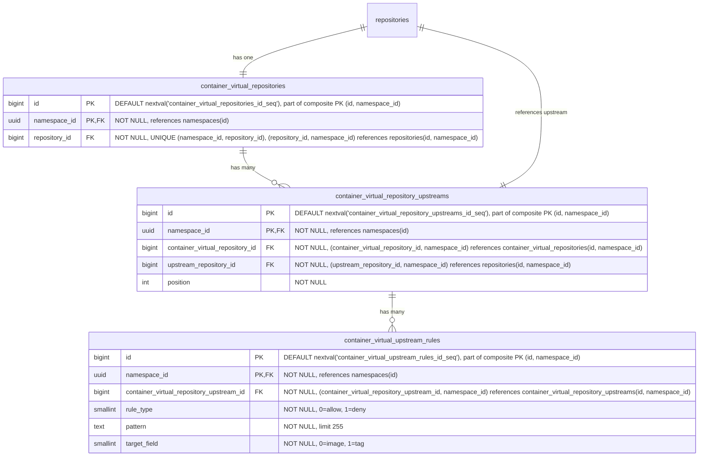
```mermaid
erDiagram
    repositories ||--|| container_virtual_repositories : "has one"
    container_virtual_repositories ||--o{ container_virtual_repository_upstreams : "has many"
    container_virtual_repository_upstreams ||--|| repositories : "references upstream"
    container_virtual_repository_upstreams ||--o{ container_virtual_upstream_rules : "has many"

    container_virtual_repositories {
        bigint id PK "DEFAULT nextval('container_virtual_repositories_id_seq'), part of composite PK (id, namespace_id)"
        uuid namespace_id PK,FK "NOT NULL, references namespaces(id)"
        bigint repository_id FK "NOT NULL, UNIQUE (namespace_id, repository_id), (repository_id, namespace_id) references repositories(id, namespace_id)"
    }

    container_virtual_repository_upstreams {
        bigint id PK "DEFAULT nextval('container_virtual_repository_upstreams_id_seq'), part of composite PK (id, namespace_id)"
        uuid namespace_id PK,FK "NOT NULL, references namespaces(id)"
        bigint container_virtual_repository_id FK "NOT NULL, (container_virtual_repository_id, namespace_id) references container_virtual_repositories(id, namespace_id)"
        bigint upstream_repository_id FK "NOT NULL, (upstream_repository_id, namespace_id) references repositories(id, namespace_id)"
        int position "NOT NULL"
    }

    container_virtual_upstream_rules {
        bigint id PK "DEFAULT nextval('container_virtual_upstream_rules_id_seq'), part of composite PK (id, namespace_id)"
        uuid namespace_id PK,FK "NOT NULL, references namespaces(id)"
        bigint container_virtual_repository_upstream_id FK "NOT NULL, (container_virtual_repository_upstream_id, namespace_id) references container_virtual_repository_upstreams(id, namespace_id)"
        smallint rule_type "NOT NULL, 0=allow, 1=deny"
        text pattern "NOT NULL, limit 255"
        smallint target_field "NOT NULL, 0=image, 1=tag"
    }
```

- **container_virtual_repositories**: The virtual repository for container images. References the parent `repositories` table via `repository_id` for name, visibility, and cross-format queries. Partitioned by `HASH(namespace_id)` with 64 partitions.
- **container_virtual_repository_upstreams**: The table that joins virtual repositories and their upstreams. Each virtual repository has an ordered list of upstreams. Each entry references an upstream repository via `upstream_repository_id`, which points to `repositories(namespace_id, id)`. The composite FK `(namespace_id, upstream_repository_id)` enforces that upstreams are within the same namespace — consistent with the registry being scoped to namespaces ([ADR-001](001_organizations_as_anchor_point.md)). Partitioned by `HASH(namespace_id)` with 64 partitions.
- **container_virtual_upstream_rules**: Defines allow/deny filter rules for an upstream. Each rule specifies a wildcard pattern and target field to control which artifacts are included or excluded when resolving through this upstream. Patterns are wildcards only for the MVP; regex support is deferred until customer feedback justifies it ([discussion](https://gitlab.com/gitlab-org/gitlab/-/work_items/597754#note_3291871207)). Rules stay per-upstream-reference (not per-remote-repo), matching the JFrog model where include/exclude patterns are set per virtual-upstream association. Partitioned by `HASH(namespace_id)` with 64 partitions.

#### Indexes

- **`container_virtual_repositories`**: unique index on `(namespace_id, repository_id)` — look up a virtual repository by its parent reference.
- **`container_virtual_repository_upstreams`**: unique index on `(namespace_id, container_virtual_repository_id, position) DEFERRABLE INITIALLY DEFERRED` — retrieve ordered upstreams for a virtual repository; deferrable to allow reordering within a transaction. Unique index on `(namespace_id, container_virtual_repository_id, upstream_repository_id)` — prevent the same upstream from being added to a virtual repository twice.
- **`container_virtual_upstream_rules`**: index on `(namespace_id, container_virtual_repository_upstream_id)` — fetch all rules for a given upstream.

#### Query examples

- Create a virtual repository

  ```sql
  -- First create the parent repository
  INSERT INTO repositories (namespace_id, name, format, kind, visibility)
  VALUES ('018f4d6f-0e10-7e3a-9bfd-23a4c5d6e7f8', 'my-virtual-repo', 0, 1, 1)
  RETURNING id;
  -- Link the repository to a repository collection
  INSERT INTO repository_collection_repositories (namespace_id, repository_collection_id, repository_id)
  VALUES ('018f4d6f-0e10-7e3a-9bfd-23a4c5d6e7f8', 456, <returned_id>);
  -- Then create the format-specific record
  INSERT INTO container_virtual_repositories (namespace_id, repository_id)
  VALUES ('018f4d6f-0e10-7e3a-9bfd-23a4c5d6e7f8', <returned_id>);
  ```

- Associate a virtual repository with an upstream

  ```sql
  INSERT INTO container_virtual_repository_upstreams (namespace_id, container_virtual_repository_id, upstream_repository_id, position)
  VALUES ('018f4d6f-0e10-7e3a-9bfd-23a4c5d6e7f8', 123, 789, 1);
  ```

### Maven Repositories

Maven packages represent a collection of files (`.jar`, `.pom`, `maven-metadata.xml`). Downloading a single Maven package can thus represent between 4 and 15 API requests.

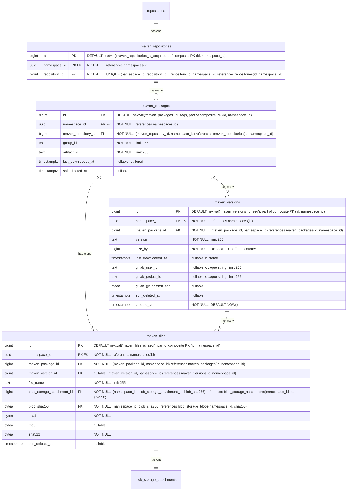
```mermaid
erDiagram
    repositories ||--|| maven_repositories : "has one"
    maven_repositories ||--o{ maven_packages : "has many"
    maven_packages ||--o{ maven_versions : "has many"
    maven_packages ||--o{ maven_files : "has many"
    maven_versions ||--o{ maven_files : "has many"
    maven_files ||--|| blob_storage_attachments : "has one"

    maven_repositories {
        bigint id PK "DEFAULT nextval('maven_repositories_id_seq'), part of composite PK (id, namespace_id)"
        uuid namespace_id PK,FK "NOT NULL, references namespaces(id)"
        bigint repository_id FK "NOT NULL, UNIQUE (namespace_id, repository_id), (repository_id, namespace_id) references repositories(id, namespace_id)"
    }

    maven_packages {
        bigint id PK "DEFAULT nextval('maven_packages_id_seq'), part of composite PK (id, namespace_id)"
        uuid namespace_id PK,FK "NOT NULL, references namespaces(id)"
        bigint maven_repository_id FK "NOT NULL, (maven_repository_id, namespace_id) references maven_repositories(id, namespace_id)"
        text group_id "NOT NULL, limit 255"
        text artifact_id "NOT NULL, limit 255"
        timestamptz last_downloaded_at "nullable, buffered"
        timestamptz soft_deleted_at "nullable"
    }

    maven_versions {
        bigint id PK "DEFAULT nextval('maven_versions_id_seq'), part of composite PK (id, namespace_id)"
        uuid namespace_id PK,FK "NOT NULL, references namespaces(id)"
        bigint maven_package_id FK "NOT NULL, (maven_package_id, namespace_id) references maven_packages(id, namespace_id)"
        text version "NOT NULL, limit 255"
        bigint size_bytes "NOT NULL, DEFAULT 0, buffered counter"
        timestamptz last_downloaded_at "nullable, buffered"
        text gitlab_user_id "nullable, opaque string, limit 255"
        text gitlab_project_id "nullable, opaque string, limit 255"
        bytea gitlab_git_commit_sha "nullable"
        timestamptz soft_deleted_at "nullable"
        timestamptz created_at "NOT NULL, DEFAULT NOW()"
    }

    maven_files {
        bigint id PK "DEFAULT nextval('maven_files_id_seq'), part of composite PK (id, namespace_id)"
        uuid namespace_id PK,FK "NOT NULL, references namespaces(id)"
        bigint maven_package_id FK "NOT NULL, (maven_package_id, namespace_id) references maven_packages(id, namespace_id)"
        bigint maven_version_id FK "nullable, (maven_version_id, namespace_id) references maven_versions(id, namespace_id)"
        text file_name "NOT NULL, limit 255"
        bigint blob_storage_attachment_id FK "NOT NULL, (namespace_id, blob_storage_attachment_id, blob_sha256) references blob_storage_attachments(namespace_id, id, sha256)"
        bytea blob_sha256 FK "NOT NULL, (namespace_id, blob_sha256) references blob_storage_blobs(namespace_id, sha256)"
        bytea sha1 "NOT NULL"
        bytea md5 "nullable"
        bytea sha512 "NOT NULL"
        timestamptz soft_deleted_at "nullable"
    }
```

- **maven_repositories**: The container of multiple packages. Each repository can host multiple packages identified by group ID and artifact ID. References the parent `repositories` table via `repository_id` for name, visibility, and cross-format queries. Partitioned by `HASH(namespace_id)` with 64 partitions.
- **maven_packages**: Represents a Maven package identified by [its group ID and artifact ID](https://maven.apache.org/pom.html#Maven_Coordinates) (for example, `com.example:myapp`). `last_downloaded_at` records when any file of the package was last downloaded; maintained via [buffered/async writes](#buffered-and-asynchronous-writes). `NULL` means the package has never been downloaded and is treated as the oldest possible download time for `keep_last_downloaded_at` lifecycle rule evaluation (i.e., eligible for deletion under download-based retention). Used by `keep_last_downloaded_at` lifecycle rules to evaluate download-based retention ([ADR-010](010_data_retention.md)). Partitioned by `HASH(namespace_id)` with 64 partitions.
- **maven_versions**: Stores individual [versions](https://maven.apache.org/pom.html#Maven_Coordinates) of a Maven package (for example, `1.0.0`, `2.1.3-SNAPSHOT`). `last_downloaded_at` records when any file of the version was last downloaded; maintained via [buffered/async writes](#buffered-and-asynchronous-writes). Used by `keep_last_downloaded_at` lifecycle rules. `gitlab_user_id`, `gitlab_project_id`, and `gitlab_git_commit_sha` record which GitLab user published this version and the CI context (project, commit) behind the publish, with the same shapes and rationale as the equivalent columns on [`container_manifests`](#container-repositories). `created_at` records when the version was first published and powers the same publication-history and time-range provenance scans as [`container_manifests`](#container-repositories). Partitioned by `HASH(namespace_id)` with 64 partitions.
- **maven_files**: Represents individual files associated with a Maven package. Files can be either version-specific (JAR, POM, sources, Javadoc, checksums) with `maven_version_id` set, or package-level (such as `maven-metadata.xml` and its checksums) with `maven_version_id` as NULL. The `maven_package_id` is always set, providing a direct path from package to all its files. It can also be auxiliary files used by the registry to improve performance bottlenecks. The `sha1` and `md5` columns store the [checksums required by the Maven protocol](https://maven.apache.org/resolver/about-checksums.html) for integrity verification. Maven clients expect `.sha1` and `.md5` sidecar files alongside every artifact. These columns are on `maven_files` rather than `blob_storage_blobs` because they are a Maven protocol concern, not a universal blob property — other formats (OCI containers) use SHA256 exclusively. Keeping them here preserves `blob_storage_blobs` as a format-agnostic table with no format-specific columns or indexes. `sha1` is `NOT NULL` because the Maven protocol requires it. `md5` is nullable because Maven 3.9+ [deprecated MD5 checksums](https://maven.apache.org/resolver/about-checksums.html). `sha512` is `NOT NULL` because the Maven protocol exposes a `.sha512` sidecar that the registry must be able to serve, and the value is always computable during upload as the bytes flow through the handler before being persisted. Partitioned by `HASH(namespace_id)` with 64 partitions.
- **blob_storage_attachments**: See [Blob storage](#blob-storage) section for details.

We are not storing the package name, in this case, the group ID and artifact ID, and the version in the same table. The reason is that the UI will access this data by package name. Imagine a tree-like UI where the package name is a folder and opening that one, you have one subfolder for each version. This first request will need to list the folders, package names. Opening a folder will trigger a request to list all subfolders, package versions. Thus, we have two dedicated tables (`maven_packages` and `maven_versions`) to ease this access pattern.

#### Indexes

- **`maven_repositories`**: unique index on `(namespace_id, repository_id)` — look up a Maven repository by its parent repository reference.
- **`maven_packages`**: unique index on `(namespace_id, maven_repository_id, group_id, artifact_id) WHERE soft_deleted_at IS NULL` — look up a package by its Maven coordinates within a repository. The partial condition allows recreating a package with the same coordinates after soft deletion; index on `(namespace_id, maven_repository_id, last_downloaded_at NULLS FIRST) WHERE soft_deleted_at IS NULL` — support `keep_last_downloaded_at` lifecycle rule evaluation; returns only aged-out packages via a bounded range scan rather than scanning every package in the repository and filtering row-by-row. `NULLS FIRST` groups never-downloaded packages with the oldest rows so both are returned by the same range scan.
- **`maven_versions`**: unique index on `(namespace_id, maven_package_id, version) WHERE soft_deleted_at IS NULL` — look up a specific version within a package. The partial condition allows recreating a version with the same identifier after soft deletion; index on `(namespace_id, maven_package_id, last_downloaded_at NULLS FIRST) WHERE soft_deleted_at IS NULL` — support `keep_last_downloaded_at` lifecycle rule evaluation scoped to a package's versions, using the same range-scan strategy as `maven_packages`; index on `(namespace_id, maven_package_id, size_bytes DESC) WHERE soft_deleted_at IS NULL` — sort a package's versions by size for the version-list display, mirroring the landing-page repository sort; index on `(namespace_id, soft_deleted_at DESC) WHERE soft_deleted_at IS NOT NULL` — list soft-deleted versions ordered by deletion time, powering the artifact-granularity trash-listing query for Maven artifacts; index on `(namespace_id, created_at DESC)` — chronological scans across the namespace, powering publication-history pagination and time-range artifact-provenance queries. Unconditional so soft-deleted publish events still appear in the audit trail.
- **`maven_files`**: unique index on `(namespace_id, maven_version_id, file_name) WHERE soft_deleted_at IS NULL AND maven_version_id IS NOT NULL` — a version-specific file name must be unique within a version. The partial conditions exclude soft-deleted rows and package-level files; unique index on `(namespace_id, maven_package_id, file_name) WHERE soft_deleted_at IS NULL AND maven_version_id IS NULL` — a package-level file name (such as `maven-metadata.xml`) must be unique within a package; index on `(namespace_id, blob_storage_attachment_id)` — look up a file by its storage attachment; index on `(namespace_id, blob_sha256)` — reverse lookup from a stored blob sha256 to every Maven file referencing it, powering cross-format checksum search. The existing parent-keyed indexes are version- or package-keyed and cannot satisfy a digest-keyed scan directly.

#### Query examples

- Get package version for a given repository id and package name.

  ```sql
  SELECT mv.*
  FROM maven_versions mv
  JOIN maven_packages mp
    ON mv.maven_package_id = mp.id AND mv.namespace_id = mp.namespace_id
  WHERE mp.namespace_id = '018f4d6f-0e10-7e3a-9bfd-23a4c5d6e7f8' AND mp.maven_repository_id = 123 AND mp.group_id = 'com.example' AND mp.artifact_id = 'myapp'
    AND mv.version = '1.0.0'
    AND mp.soft_deleted_at IS NULL AND mv.soft_deleted_at IS NULL;
  ```

- Get a file given a version id and filename.

  ```sql
  SELECT mf.*
  FROM maven_files mf
  WHERE mf.namespace_id = '018f4d6f-0e10-7e3a-9bfd-23a4c5d6e7f8' AND mf.maven_version_id = 456 AND mf.file_name = 'myapp-1.0.0.jar'
    AND mf.soft_deleted_at IS NULL;
  ```

- Get package-level files (for example, `maven-metadata.xml`) for a given package.

  ```sql
  SELECT mf.*
  FROM maven_files mf
  WHERE mf.namespace_id = '018f4d6f-0e10-7e3a-9bfd-23a4c5d6e7f8' AND mf.maven_package_id = 123 AND mf.maven_version_id IS NULL
    AND mf.soft_deleted_at IS NULL;
  ```

- Trash listing: list every soft-deleted Maven version in a namespace, most-recently-deleted first (uses the partial index on `(namespace_id, soft_deleted_at DESC) WHERE soft_deleted_at IS NOT NULL`). The compliance use case is namespace-wide ("what is in the trash right now?"); a parent-scoped view ("trashed versions of this package") would benefit from a separate `(namespace_id, maven_package_id, soft_deleted_at DESC) WHERE soft_deleted_at IS NOT NULL` index, which can be added later if that UI is built. The same pattern applies to [`npm_versions`](#npm-repositories), [`container_manifests`](#container-repositories), and their remote equivalents.

  ```sql
  SELECT mv.id, mv.maven_package_id, mv.version, mv.soft_deleted_at
  FROM maven_versions mv
  WHERE mv.namespace_id = '018f4d6f-0e10-7e3a-9bfd-23a4c5d6e7f8' AND mv.soft_deleted_at IS NOT NULL
  ORDER BY mv.soft_deleted_at DESC
  LIMIT 50;
  ```

### Maven Remote Repositories

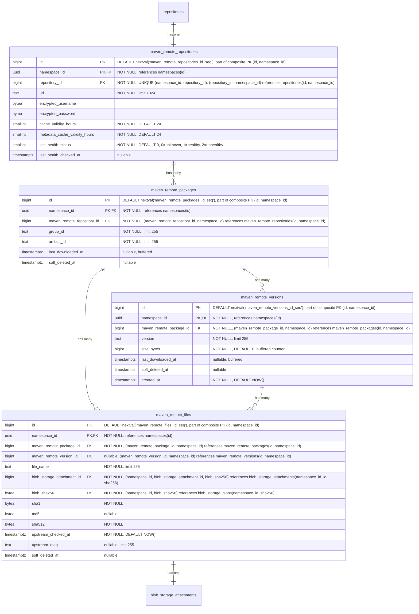
```mermaid
erDiagram
    repositories ||--|| maven_remote_repositories : "has one"
    maven_remote_repositories ||--o{ maven_remote_packages : "has many"
    maven_remote_packages ||--o{ maven_remote_versions : "has many"
    maven_remote_packages ||--o{ maven_remote_files : "has many"
    maven_remote_versions ||--o{ maven_remote_files : "has many"
    maven_remote_files ||--|| blob_storage_attachments : "has one"

    maven_remote_repositories {
        bigint id PK "DEFAULT nextval('maven_remote_repositories_id_seq'), part of composite PK (id, namespace_id)"
        uuid namespace_id PK,FK "NOT NULL, references namespaces(id)"
        bigint repository_id FK "NOT NULL, UNIQUE (namespace_id, repository_id), (repository_id, namespace_id) references repositories(id, namespace_id)"
        text url "NOT NULL, limit 1024"
        bytea encrypted_username
        bytea encrypted_password
        smallint cache_validity_hours "NOT NULL, DEFAULT 24"
        smallint metadata_cache_validity_hours "NOT NULL, DEFAULT 24"
        smallint last_health_status "NOT NULL, DEFAULT 0, 0=unknown, 1=healthy, 2=unhealthy"
        timestamptz last_health_checked_at "nullable"
    }

    maven_remote_packages {
        bigint id PK "DEFAULT nextval('maven_remote_packages_id_seq'), part of composite PK (id, namespace_id)"
        uuid namespace_id PK,FK "NOT NULL, references namespaces(id)"
        bigint maven_remote_repository_id FK "NOT NULL, (maven_remote_repository_id, namespace_id) references maven_remote_repositories(id, namespace_id)"
        text group_id "NOT NULL, limit 255"
        text artifact_id "NOT NULL, limit 255"
        timestamptz last_downloaded_at "nullable, buffered"
        timestamptz soft_deleted_at "nullable"
    }

    maven_remote_versions {
        bigint id PK "DEFAULT nextval('maven_remote_versions_id_seq'), part of composite PK (id, namespace_id)"
        uuid namespace_id PK,FK "NOT NULL, references namespaces(id)"
        bigint maven_remote_package_id FK "NOT NULL, (maven_remote_package_id, namespace_id) references maven_remote_packages(id, namespace_id)"
        text version "NOT NULL, limit 255"
        bigint size_bytes "NOT NULL, DEFAULT 0, buffered counter"
        timestamptz last_downloaded_at "nullable, buffered"
        timestamptz soft_deleted_at "nullable"
        timestamptz created_at "NOT NULL, DEFAULT NOW()"
    }

    maven_remote_files {
        bigint id PK "DEFAULT nextval('maven_remote_files_id_seq'), part of composite PK (id, namespace_id)"
        uuid namespace_id PK,FK "NOT NULL, references namespaces(id)"
        bigint maven_remote_package_id FK "NOT NULL, (maven_remote_package_id, namespace_id) references maven_remote_packages(id, namespace_id)"
        bigint maven_remote_version_id FK "nullable, (maven_remote_version_id, namespace_id) references maven_remote_versions(id, namespace_id)"
        text file_name "NOT NULL, limit 255"
        bigint blob_storage_attachment_id FK "NOT NULL, (namespace_id, blob_storage_attachment_id, blob_sha256) references blob_storage_attachments(namespace_id, id, sha256)"
        bytea blob_sha256 FK "NOT NULL, (namespace_id, blob_sha256) references blob_storage_blobs(namespace_id, sha256)"
        bytea sha1 "NOT NULL"
        bytea md5 "nullable"
        bytea sha512 "NOT NULL"
        timestamptz upstream_checked_at "NOT NULL, DEFAULT NOW()"
        text upstream_etag "nullable, limit 255"
        timestamptz soft_deleted_at "nullable"
    }
```

- **maven_remote_repositories**: Represents an external Maven repository. Includes URL, credentials, artifact cache TTL (`cache_validity_hours`), and a separate TTL for metadata responses such as `maven-metadata.xml` (`metadata_cache_validity_hours`). Health check status is tracked for monitoring. References the parent `repositories` table via `repository_id`. Partitioned by `HASH(namespace_id)` with 64 partitions.
- **maven_remote_packages**: A cached Maven package identified by group ID and artifact ID. Mirrors `maven_packages`. `last_downloaded_at` records when any cached file of the package was last downloaded; maintained via buffered/async writes to avoid hot-row contention. Used by `keep_last_downloaded_at` lifecycle rules and cache retention evaluation. Partitioned by `HASH(namespace_id)` with 64 partitions.
- **maven_remote_versions**: A cached version of a Maven package. Mirrors `maven_versions`. `last_downloaded_at` records when any cached file of the version was last downloaded; maintained via buffered/async writes to avoid hot-row contention. Used by `keep_last_downloaded_at` lifecycle rules and cache retention evaluation. `created_at` records when the version was first cached and powers cache-side publication-history and provenance scans, mirroring [`maven_versions`](#maven-repositories). Partitioned by `HASH(namespace_id)` with 64 partitions.
- **maven_remote_files**: A cached file (JAR, POM, checksums, `maven-metadata.xml`). The nullable `maven_remote_version_id` preserves the same pattern as hosted: version-specific files vs. package-level files (like `maven-metadata.xml`). `sha1` and `md5` are retained because the Maven protocol requires serving these checksums regardless of whether the content is hosted or cached. `sha512` is added on parity grounds so it mirrors the hosted `maven_files` column shape, letting the Maven Virtual spec (S14) serve `.sha512` sidecars from either backend with one query path. The value is computed from the cached bytes during the proxy-write step alongside the other checksums, so `NOT NULL` is achievable from day one. `upstream_checked_at` records when the file was last validated against the upstream repository; compared with `cache_validity_hours` for artifact files or `metadata_cache_validity_hours` for metadata files (e.g. `maven-metadata.xml`) to decide if revalidation is needed. `upstream_etag` stores the ETag returned by the upstream, enabling conditional requests (`If-None-Match`) to avoid re-downloading unchanged files. Partitioned by `HASH(namespace_id)` with 64 partitions.
- **blob_storage_attachments**: See [Blob storage](#blob-storage) section for details.

#### Indexes

- **`maven_remote_repositories`**: unique index on `(namespace_id, repository_id)` — look up a remote repository by its parent reference.
- **`maven_remote_packages`**: unique index on `(namespace_id, maven_remote_repository_id, group_id, artifact_id) WHERE soft_deleted_at IS NULL` — look up a cached package by its Maven coordinates. The partial condition allows recreating a package with the same coordinates after soft deletion.
- **`maven_remote_versions`**: unique index on `(namespace_id, maven_remote_package_id, version) WHERE soft_deleted_at IS NULL` — look up a cached version within a package. The partial condition allows recreating a version with the same identifier after soft deletion; index on `(namespace_id, maven_remote_package_id, size_bytes DESC) WHERE soft_deleted_at IS NULL` — sort a cached package's versions by size for the version-list display; index on `(namespace_id, soft_deleted_at DESC) WHERE soft_deleted_at IS NOT NULL` — list soft-deleted cached versions ordered by deletion time, powering the artifact-granularity trash-listing query for cached Maven artifacts; index on `(namespace_id, created_at DESC)` — chronological scans across the namespace, mirroring the local [`maven_versions`](#maven-repositories) index to cover cache-side publication history and provenance. Unconditional (no `soft_deleted_at` predicate) for the same audit-trail reason as the local index.
- **`maven_remote_files`**: unique index on `(namespace_id, maven_remote_version_id, file_name) WHERE soft_deleted_at IS NULL AND maven_remote_version_id IS NOT NULL` — a version-specific file name must be unique within a version; unique index on `(namespace_id, maven_remote_package_id, file_name) WHERE soft_deleted_at IS NULL AND maven_remote_version_id IS NULL` — a package-level file name must be unique within a package; index on `(namespace_id, blob_storage_attachment_id)` — look up a file by its storage attachment; index on `(namespace_id, blob_sha256)` — reverse lookup from a stored blob sha256 to every cached Maven file referencing it, mirroring the local [`maven_files`](#maven-repositories) index so checksum search covers cache-side references too.

#### Query examples

- Create a remote repository

  ```sql
  -- First create the parent repository
  INSERT INTO repositories (namespace_id, name, format, kind, visibility)
  VALUES ('018f4d6f-0e10-7e3a-9bfd-23a4c5d6e7f8', 'central', 1, 2, 0)
  RETURNING id;
  -- Link the repository to a repository collection
  INSERT INTO repository_collection_repositories (namespace_id, repository_collection_id, repository_id)
  VALUES ('018f4d6f-0e10-7e3a-9bfd-23a4c5d6e7f8', 456, <returned_id>);
  -- Then create the format-specific record
  INSERT INTO maven_remote_repositories (namespace_id, repository_id, url, encrypted_username, encrypted_password)
  VALUES ('018f4d6f-0e10-7e3a-9bfd-23a4c5d6e7f8', <returned_id>, 'https://repo.maven.apache.org/maven2', $1, $2);
  ```

- Look up a cached Maven file by coordinates

  ```sql
  SELECT mrf.*, bsb.object_storage_key
  FROM maven_remote_files mrf
  JOIN maven_remote_versions mrv
    ON mrf.maven_remote_version_id = mrv.id AND mrf.namespace_id = mrv.namespace_id
  JOIN maven_remote_packages mrp
    ON mrv.maven_remote_package_id = mrp.id AND mrv.namespace_id = mrp.namespace_id
  JOIN blob_storage_blobs bsb
    ON bsb.namespace_id = mrf.namespace_id AND bsb.sha256 = mrf.blob_sha256
  WHERE mrp.namespace_id = '018f4d6f-0e10-7e3a-9bfd-23a4c5d6e7f8'
    AND mrp.maven_remote_repository_id = 789
    AND mrp.group_id = 'com.example'
    AND mrp.artifact_id = 'myapp'
    AND mrv.version = '1.0.0'
    AND mrf.file_name = 'myapp-1.0.0.jar'
    AND mrp.soft_deleted_at IS NULL AND mrv.soft_deleted_at IS NULL AND mrf.soft_deleted_at IS NULL;
  ```

- Look up cached `maven-metadata.xml` for a package

  ```sql
  SELECT mrf.*
  FROM maven_remote_files mrf
  JOIN maven_remote_packages mrp
    ON mrf.maven_remote_package_id = mrp.id AND mrf.namespace_id = mrp.namespace_id
  WHERE mrp.namespace_id = '018f4d6f-0e10-7e3a-9bfd-23a4c5d6e7f8'
    AND mrp.maven_remote_repository_id = 789
    AND mrp.group_id = 'com.example'
    AND mrp.artifact_id = 'myapp'
    AND mrf.maven_remote_version_id IS NULL
    AND mrf.file_name = 'maven-metadata.xml'
    AND mrp.soft_deleted_at IS NULL AND mrf.soft_deleted_at IS NULL;
  ```

### Maven Virtual Repositories

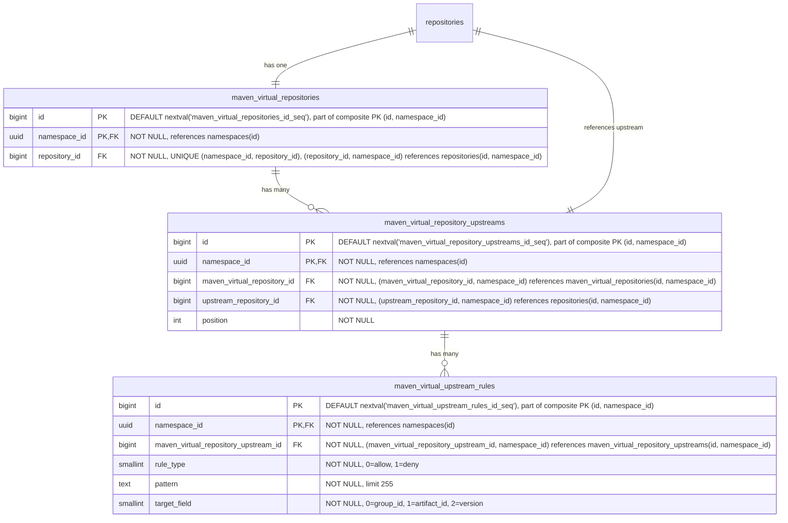
```mermaid
erDiagram
    repositories ||--|| maven_virtual_repositories : "has one"
    maven_virtual_repositories ||--o{ maven_virtual_repository_upstreams : "has many"
    maven_virtual_repository_upstreams ||--|| repositories : "references upstream"
    maven_virtual_repository_upstreams ||--o{ maven_virtual_upstream_rules : "has many"

    maven_virtual_repositories {
        bigint id PK "DEFAULT nextval('maven_virtual_repositories_id_seq'), part of composite PK (id, namespace_id)"
        uuid namespace_id PK,FK "NOT NULL, references namespaces(id)"
        bigint repository_id FK "NOT NULL, UNIQUE (namespace_id, repository_id), (repository_id, namespace_id) references repositories(id, namespace_id)"
    }

    maven_virtual_repository_upstreams {
        bigint id PK "DEFAULT nextval('maven_virtual_repository_upstreams_id_seq'), part of composite PK (id, namespace_id)"
        uuid namespace_id PK,FK "NOT NULL, references namespaces(id)"
        bigint maven_virtual_repository_id FK "NOT NULL, (maven_virtual_repository_id, namespace_id) references maven_virtual_repositories(id, namespace_id)"
        bigint upstream_repository_id FK "NOT NULL, (upstream_repository_id, namespace_id) references repositories(id, namespace_id)"
        int position "NOT NULL"
    }

    maven_virtual_upstream_rules {
        bigint id PK "DEFAULT nextval('maven_virtual_upstream_rules_id_seq'), part of composite PK (id, namespace_id)"
        uuid namespace_id PK,FK "NOT NULL, references namespaces(id)"
        bigint maven_virtual_repository_upstream_id FK "NOT NULL, (maven_virtual_repository_upstream_id, namespace_id) references maven_virtual_repository_upstreams(id, namespace_id)"
        smallint rule_type "NOT NULL, 0=allow, 1=deny"
        text pattern "NOT NULL, limit 255"
        smallint target_field "NOT NULL, 0=group_id, 1=artifact_id, 2=version"
    }
```

- **maven_virtual_repositories**: The virtual repository for Maven packages. References the parent `repositories` table via `repository_id` for name, visibility, and cross-format queries. Partitioned by `HASH(namespace_id)` with 64 partitions.
- **maven_virtual_repository_upstreams**: The table that joins virtual repositories and their upstreams. Each virtual repository has an ordered list of upstreams. Each entry references an upstream repository via `upstream_repository_id`, which points to `repositories(namespace_id, id)`. The composite FK `(namespace_id, upstream_repository_id)` enforces that upstreams are within the same namespace — consistent with the registry being scoped to namespaces ([ADR-001](001_organizations_as_anchor_point.md)). Partitioned by `HASH(namespace_id)` with 64 partitions.
- **maven_virtual_upstream_rules**: Defines allow/deny filter rules for an upstream. Each rule specifies a wildcard pattern and target field to control which artifacts are included or excluded when resolving through this upstream. Patterns are wildcards only for the MVP; regex support is deferred until customer feedback justifies it ([discussion](https://gitlab.com/gitlab-org/gitlab/-/work_items/597754#note_3291871207)). Partitioned by `HASH(namespace_id)` with 64 partitions.

#### Indexes

- **`maven_virtual_repositories`**: unique index on `(namespace_id, repository_id)` — look up a virtual repository by its parent reference.
- **`maven_virtual_repository_upstreams`**: unique index on `(namespace_id, maven_virtual_repository_id, position) DEFERRABLE INITIALLY DEFERRED` — retrieve ordered upstreams for a virtual repository; deferrable to allow reordering within a transaction. Unique index on `(namespace_id, maven_virtual_repository_id, upstream_repository_id)` — prevent the same upstream from being added to a virtual repository twice.
- **`maven_virtual_upstream_rules`**: index on `(namespace_id, maven_virtual_repository_upstream_id)` — fetch all rules for a given upstream.

#### Query examples

- Create a virtual repository

  ```sql
  -- First create the parent repository
  INSERT INTO repositories (namespace_id, name, format, kind, visibility)
  VALUES ('018f4d6f-0e10-7e3a-9bfd-23a4c5d6e7f8', 'my-virtual-repo', 1, 1, 1)
  RETURNING id;
  -- Link the repository to a repository collection
  INSERT INTO repository_collection_repositories (namespace_id, repository_collection_id, repository_id)
  VALUES ('018f4d6f-0e10-7e3a-9bfd-23a4c5d6e7f8', 456, <returned_id>);
  -- Then create the format-specific record
  INSERT INTO maven_virtual_repositories (namespace_id, repository_id)
  VALUES ('018f4d6f-0e10-7e3a-9bfd-23a4c5d6e7f8', <returned_id>);
  ```

- Associate a virtual repository with an upstream

  ```sql
  INSERT INTO maven_virtual_repository_upstreams (namespace_id, maven_virtual_repository_id, upstream_repository_id, position)
  VALUES ('018f4d6f-0e10-7e3a-9bfd-23a4c5d6e7f8', 123, 789, 1);
  ```

### NPM Repositories

Node packages are basically `.tar.gz` files where each version is a single archive. However, node clients have a richer feature set, for example, the use of distribution tags that we need to handle.

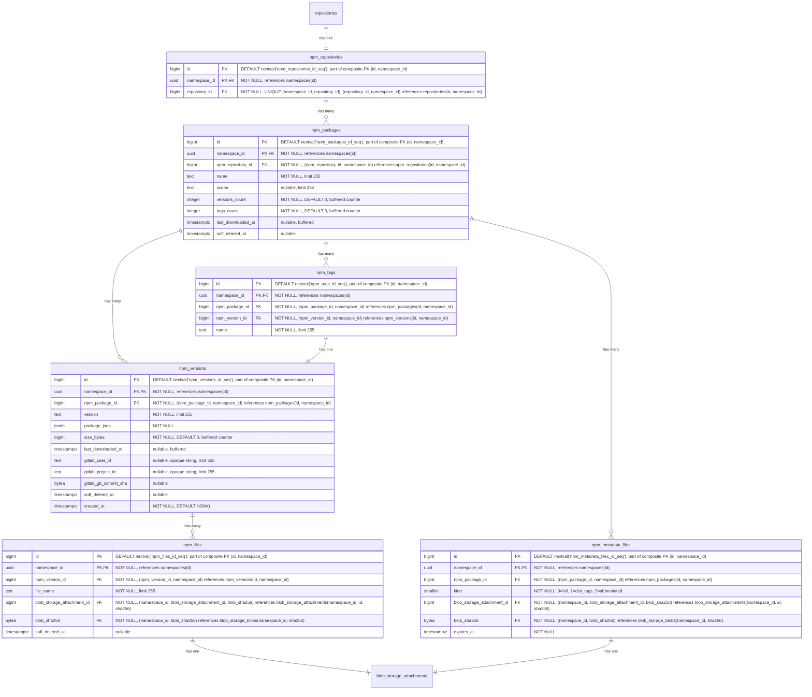
```mermaid
erDiagram
    repositories ||--|| npm_repositories : "has one"
    npm_repositories ||--o{ npm_packages : "has many"
    npm_packages ||--o{ npm_versions : "has many"
    npm_packages ||--o{ npm_tags : "has many"
    npm_versions ||--o{ npm_files : "has many"
    npm_tags ||--|| npm_versions : "has one"
    npm_packages ||--o{ npm_metadata_files : "has many"
    npm_files ||--|| blob_storage_attachments : "has one"
    npm_metadata_files ||--|| blob_storage_attachments : "has one"

    npm_repositories {
        bigint id PK "DEFAULT nextval('npm_repositories_id_seq'), part of composite PK (id, namespace_id)"
        uuid namespace_id PK,FK "NOT NULL, references namespaces(id)"
        bigint repository_id FK "NOT NULL, UNIQUE (namespace_id, repository_id), (repository_id, namespace_id) references repositories(id, namespace_id)"
    }

    npm_packages {
        bigint id PK "DEFAULT nextval('npm_packages_id_seq'), part of composite PK (id, namespace_id)"
        uuid namespace_id PK,FK "NOT NULL, references namespaces(id)"
        bigint npm_repository_id FK "NOT NULL, (npm_repository_id, namespace_id) references npm_repositories(id, namespace_id)"
        text name "NOT NULL, limit 255"
        text scope "nullable, limit 255"
        integer versions_count "NOT NULL, DEFAULT 0, buffered counter"
        integer tags_count "NOT NULL, DEFAULT 0, buffered counter"
        timestamptz last_downloaded_at "nullable, buffered"
        timestamptz soft_deleted_at "nullable"
    }

    npm_versions {
        bigint id PK "DEFAULT nextval('npm_versions_id_seq'), part of composite PK (id, namespace_id)"
        uuid namespace_id PK,FK "NOT NULL, references namespaces(id)"
        bigint npm_package_id FK "NOT NULL, (npm_package_id, namespace_id) references npm_packages(id, namespace_id)"
        text version "NOT NULL, limit 255"
        jsonb package_json "NOT NULL"
        bigint size_bytes "NOT NULL, DEFAULT 0, buffered counter"
        timestamptz last_downloaded_at "nullable, buffered"
        text gitlab_user_id "nullable, opaque string, limit 255"
        text gitlab_project_id "nullable, opaque string, limit 255"
        bytea gitlab_git_commit_sha "nullable"
        timestamptz soft_deleted_at "nullable"
        timestamptz created_at "NOT NULL, DEFAULT NOW()"
    }

    npm_tags {
        bigint id PK "DEFAULT nextval('npm_tags_id_seq'), part of composite PK (id, namespace_id)"
        uuid namespace_id PK,FK "NOT NULL, references namespaces(id)"
        bigint npm_package_id FK "NOT NULL, (npm_package_id, namespace_id) references npm_packages(id, namespace_id)"
        bigint npm_version_id FK "NOT NULL, (npm_version_id, namespace_id) references npm_versions(id, namespace_id)"
        text name "NOT NULL, limit 255"
    }

    npm_files {
        bigint id PK "DEFAULT nextval('npm_files_id_seq'), part of composite PK (id, namespace_id)"
        uuid namespace_id PK,FK "NOT NULL, references namespaces(id)"
        bigint npm_version_id FK "NOT NULL, (npm_version_id, namespace_id) references npm_versions(id, namespace_id)"
        text file_name "NOT NULL, limit 255"
        bigint blob_storage_attachment_id FK "NOT NULL, (namespace_id, blob_storage_attachment_id, blob_sha256) references blob_storage_attachments(namespace_id, id, sha256)"
        bytea blob_sha256 FK "NOT NULL, (namespace_id, blob_sha256) references blob_storage_blobs(namespace_id, sha256)"
        timestamptz soft_deleted_at "nullable"
    }

    npm_metadata_files {
        bigint id PK "DEFAULT nextval('npm_metadata_files_id_seq'), part of composite PK (id, namespace_id)"
        uuid namespace_id PK,FK "NOT NULL, references namespaces(id)"
        bigint npm_package_id FK "NOT NULL, (npm_package_id, namespace_id) references npm_packages(id, namespace_id)"
        smallint kind "NOT NULL, 0=full, 1=dist_tags, 2=abbreviated"
        bigint blob_storage_attachment_id FK "NOT NULL, (namespace_id, blob_storage_attachment_id, blob_sha256) references blob_storage_attachments(namespace_id, id, sha256)"
        bytea blob_sha256 FK "NOT NULL, (namespace_id, blob_sha256) references blob_storage_blobs(namespace_id, sha256)"
        timestamptz expires_at "NOT NULL"
    }
```

- **npm_repositories**: The container of multiple packages. Each repository can host multiple packages with optional scopes. References the parent `repositories` table via `repository_id` for name, visibility, and cross-format queries. Partitioned by `HASH(namespace_id)` with 64 partitions.
- **npm_packages**: Represents an npm package. The `name` column stores the full package name including scope (for example, `@myorg/mypackage` or `lodash`). `versions_count` counts the package's `npm_versions` rows including soft-deleted ones, decrementing only when garbage collection hard-deletes a row; `tags_count` counts its `npm_tags` rows (`npm_tags` has no soft-delete column, so the question does not arise). Both are buffered counters that enforce the per-package entity-count limits from [ADR-004](004_data_and_application_limits.md#entity-count-limits) (25,000 versions, 1,000 tags) and are maintained via [buffered/async writes](#buffered-and-asynchronous-writes). Including soft-deleted versions mirrors the treatment of `namespace_statistics.deduplicated_size_bytes` and closes a gaming vector: a customer who could exclude soft-deleted rows from the cap could repeatedly soft-delete and republish to stay under the 25,000-version limit indefinitely, even though every soft-deleted row still occupies storage and remains restorable. Typed `integer` (not `bigint`) because both caps sit well below the 32-bit ceiling; the unbounded counters elsewhere (`downloads_count`, `size_bytes`) need `bigint` because they grow without limit. `last_downloaded_at` records when any file of the package was last downloaded; maintained via [buffered/async writes](#buffered-and-asynchronous-writes). Used by `keep_last_downloaded_at` lifecycle rules. Partitioned by `HASH(namespace_id)` with 64 partitions.
- **npm_versions**: Stores individual versions of an npm package with embedded package.json metadata. `last_downloaded_at` records when any file of the version was last downloaded; maintained via [buffered/async writes](#buffered-and-asynchronous-writes). Used by `keep_last_downloaded_at` lifecycle rules. `gitlab_user_id`, `gitlab_project_id`, and `gitlab_git_commit_sha` record which GitLab user published this version and the CI context (project, commit) behind the publish, with the same shapes and rationale as the equivalent columns on [`container_manifests`](#container-repositories). `created_at` records when the version was first published and powers the same publication-history and time-range provenance scans as [`container_manifests`](#container-repositories). Partitioned by `HASH(namespace_id)` with 64 partitions.
- **npm_tags**: Provides [NPM distribution tags](https://docs.npmjs.com/cli/v11/commands/npm-dist-tag) (for example, `latest`, `next`, `beta`) that point to specific package versions. Partitioned by `HASH(namespace_id)` with 64 partitions.
- **npm_files**: Represents the files for an npm package version. These are mainly tarball archives. It can also be auxiliary files used by the registry to improve performance bottlenecks. Partitioned by `HASH(namespace_id)` with 64 partitions.
- **npm_metadata_files**: Stores pre-computed metadata files for an npm package, one per `kind`. The `kind` column distinguishes the metadata variant: `full` (0) contains the complete packument with all versions, `dist_tags` (1) contains only the distribution tags mapping, and `abbreviated` (2) is the install-only projection served when the request carries `Accept: application/vnd.npm.install-v1+json`. The appropriate file is served on the npm metadata endpoint based on the client request. Linked to `npm_packages` (not `npm_versions`) because the metadata spans all versions of a package. Metadata files are generated asynchronously after a version is published or unpublished. The `expires_at` column drives cache freshness: writers (publish, deprecate, unpublish, dist-tag mutations) force-expire the cache by setting `expires_at = NOW()` on every row for the affected package in the same transaction as the data write; the rebuild job sets `expires_at = NOW() + npm.packument_cache_ttl` when it upserts a row with the freshly generated blob. Readers filter on `expires_at > NOW()` and fall through to an inline-build path on a miss, so expired rows are never served to clients; the column is the cache's freshness signal rather than a hard delete deadline. Force-expiring leaves the blob and attachment in place so any response already resolving against them completes normally until the rebuild job swaps the attachment. Partitioned by `HASH(namespace_id)` with 64 partitions.
- **blob_storage_attachments**: See [Blob storage](#blob-storage) section for details.

Similar to [Maven](#maven-repositories), package names and versions are stored in two different tables for the exact same reason.

#### Indexes

- **`npm_repositories`**: unique index on `(namespace_id, repository_id)` — look up an NPM repository by its parent repository reference.
- **`npm_packages`**: unique index on `(namespace_id, npm_repository_id, name) WHERE soft_deleted_at IS NULL` — look up a package by name within a repository. The partial condition allows recreating a package with the same name after soft deletion; index on `(namespace_id, npm_repository_id, last_downloaded_at NULLS FIRST) WHERE soft_deleted_at IS NULL` — support `keep_last_downloaded_at` lifecycle rule evaluation; returns only aged-out packages via a bounded range scan rather than scanning every package in the repository and filtering row-by-row. `NULLS FIRST` groups never-downloaded packages with the oldest rows so both are returned by the same range scan.
- **`npm_versions`**: unique index on `(namespace_id, npm_package_id, version) WHERE soft_deleted_at IS NULL` — look up a specific version within a package. The partial condition allows recreating a version with the same identifier after soft deletion; index on `(namespace_id, npm_package_id, last_downloaded_at NULLS FIRST) WHERE soft_deleted_at IS NULL` — support `keep_last_downloaded_at` lifecycle rule evaluation scoped to a package's versions, using the same range-scan strategy as `npm_packages`; index on `(namespace_id, npm_package_id, size_bytes DESC) WHERE soft_deleted_at IS NULL` — sort a package's versions by size for the version-list display, mirroring the landing-page repository sort; index on `(namespace_id, soft_deleted_at DESC) WHERE soft_deleted_at IS NOT NULL` — list soft-deleted versions ordered by deletion time, powering the artifact-granularity trash-listing query for npm artifacts; index on `(namespace_id, created_at DESC)` — chronological scans across the namespace, powering publication-history pagination and time-range artifact-provenance queries. Unconditional so soft-deleted publish events still appear in the audit trail.
- **`npm_tags`**: unique index on `(namespace_id, npm_package_id, name)` — look up a distribution tag by name within a package; index on `(namespace_id, npm_version_id)` — find all tags pointing to a given version.
- **`npm_files`**: unique index on `(namespace_id, npm_version_id, file_name) WHERE soft_deleted_at IS NULL` — a file name must be unique within a version. The partial condition allows recreating a file with the same name after soft deletion; index on `(namespace_id, blob_storage_attachment_id)` — look up a file by its storage attachment; index on `(namespace_id, blob_sha256)` — reverse lookup from a stored blob sha256 to every npm file referencing it, powering cross-format checksum search. The existing version-keyed index cannot satisfy a digest-keyed scan directly.
- **`npm_metadata_files`**: unique index on `(namespace_id, npm_package_id, kind)` — one metadata file per package per kind; index on `(namespace_id, blob_storage_attachment_id)` — look up a metadata file by its storage attachment; index on `(namespace_id, blob_sha256)` — reverse lookup from a stored blob sha256 to every metadata file referencing it, mirroring [`npm_files`](#npm-repositories) so a single sha256 lookup covers both the tarball and the packument-style metadata.

#### Query examples

- Get all versions given a repository id and package name

  ```sql
  SELECT nv.*
  FROM npm_versions nv
  JOIN npm_packages np
    ON nv.npm_package_id = np.id AND nv.namespace_id = np.namespace_id
  WHERE np.namespace_id = '018f4d6f-0e10-7e3a-9bfd-23a4c5d6e7f8' AND np.npm_repository_id = 123 AND np.name = '@myorg/mypackage'
    AND np.soft_deleted_at IS NULL AND nv.soft_deleted_at IS NULL;
  ```

- Read per-package entity-count counters for the publish-path limit pre-check (advisory; the partial unique indexes on `npm_versions` and `npm_tags` are the authoritative race-free guards):

  ```sql
  SELECT versions_count, tags_count
  FROM npm_packages
  WHERE namespace_id = '018f4d6f-0e10-7e3a-9bfd-23a4c5d6e7f8' AND id = 456 AND soft_deleted_at IS NULL;
  ```

- Get a file given a version id and a filename

  ```sql
  SELECT nf.*
  FROM npm_files nf
  WHERE nf.namespace_id = '018f4d6f-0e10-7e3a-9bfd-23a4c5d6e7f8' AND nf.npm_version_id = 456 AND nf.file_name = 'mypackage-1.0.0.tgz'
    AND nf.soft_deleted_at IS NULL;
  ```

- Get the pre-computed full metadata file for a package (served on the npm metadata endpoint)

  ```sql
  SELECT bsb.object_storage_key, bsb.size
  FROM npm_metadata_files nmf
  JOIN blob_storage_blobs bsb ON bsb.namespace_id = nmf.namespace_id AND bsb.sha256 = nmf.blob_sha256
  WHERE nmf.namespace_id = '018f4d6f-0e10-7e3a-9bfd-23a4c5d6e7f8' AND nmf.npm_package_id = 456 AND nmf.kind = 0
    AND nmf.expires_at > NOW();
  ```

  Reads filter on `expires_at > NOW()`. A miss (no row, or `expires_at <= NOW()` because a writer
  force-expired it or the TTL elapsed) falls through to the inline-build path; the cache rebuild
  job below restores a fresh row.

- Force-expire the packument cache on a write

  Publish, deprecate, unpublish, and dist-tag mutations invalidate the cache by flipping
  `expires_at` to `NOW()` on every kind for the affected package in the same transaction as the
  data write. The blob and attachment are left untouched so any response already in flight keeps
  resolving against the existing blob until the rebuild job swaps the attachment.

  ```sql
  UPDATE npm_metadata_files
  SET expires_at = NOW()
  WHERE namespace_id = '018f4d6f-0e10-7e3a-9bfd-23a4c5d6e7f8' AND npm_package_id = 456;
  ```

  For first-time publications no rows exist yet, so the `UPDATE` affects zero rows; the rebuild
  job inserts the cache rows on its first run.

- Upsert a metadata file after a version publish or unpublish

  The cache rebuild job runs this once per kind for the package. The old attachment must be
  deleted in the same transaction to prevent orphaned attachments from blocking blob garbage
  collection (see [Cleanup tasks](#cleanup-tasks)).

  ```sql
  -- The new blob and attachment (id=789) are created earlier in the same transaction.
  -- The interval below mirrors the configured `npm.packument_cache_ttl` (default 7 days).
  WITH old AS (
    SELECT blob_storage_attachment_id, blob_sha256
    FROM npm_metadata_files
    WHERE namespace_id = '018f4d6f-0e10-7e3a-9bfd-23a4c5d6e7f8' AND npm_package_id = 456 AND kind = 0
  ),
  upsert AS (
    INSERT INTO npm_metadata_files (namespace_id, npm_package_id, kind, blob_storage_attachment_id, blob_sha256, expires_at)
    VALUES ('018f4d6f-0e10-7e3a-9bfd-23a4c5d6e7f8', 456, 0, 789, 'abcd1234...'::bytea, NOW() + interval '7 days')
    ON CONFLICT (namespace_id, npm_package_id, kind)
    DO UPDATE SET blob_storage_attachment_id = EXCLUDED.blob_storage_attachment_id,
                  blob_sha256 = EXCLUDED.blob_sha256,
                  expires_at = EXCLUDED.expires_at
  )
  DELETE FROM blob_storage_attachments bsa
  USING old
  WHERE bsa.namespace_id = '018f4d6f-0e10-7e3a-9bfd-23a4c5d6e7f8'
    AND bsa.id = old.blob_storage_attachment_id
    AND bsa.sha256 = old.blob_sha256;
  ```

  On first insert the `old` CTE returns no rows, so no attachment is deleted.
  On conflict (update), the previous attachment is deleted. The old blob will be
  garbage-collected if no other attachments reference it (deduplication-safe:
  each client holds its own attachment, so removing one does not affect others
  sharing the same blob).

### NPM Remote Repositories

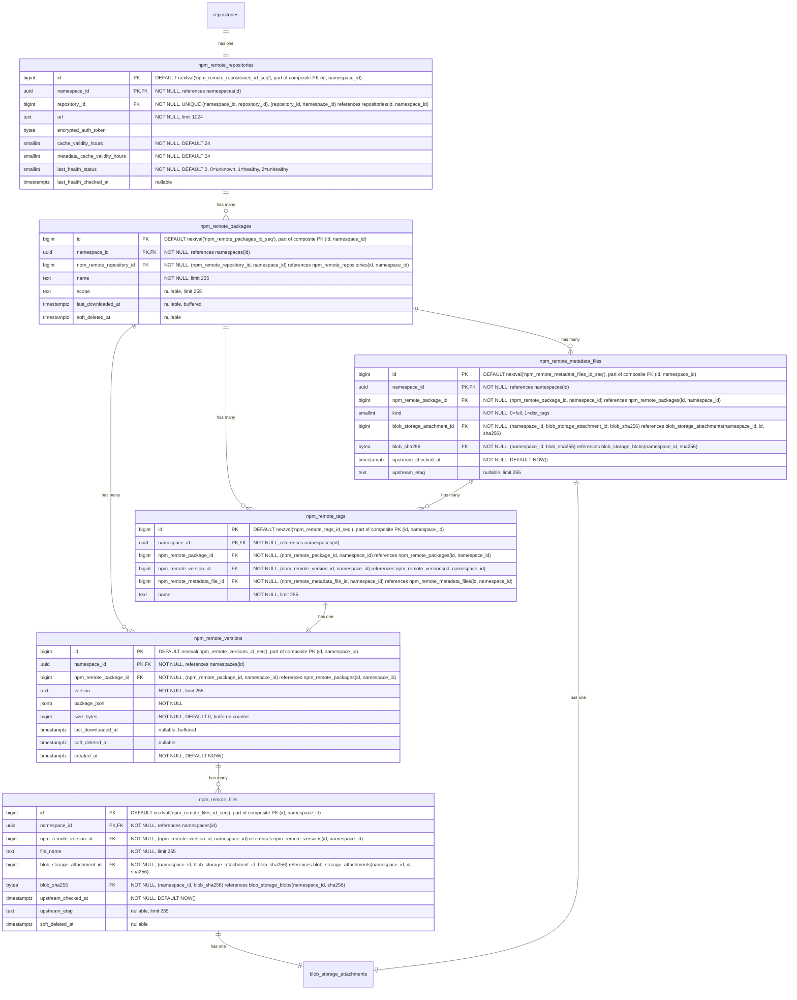
```mermaid
erDiagram
    repositories ||--|| npm_remote_repositories : "has one"
    npm_remote_repositories ||--o{ npm_remote_packages : "has many"
    npm_remote_packages ||--o{ npm_remote_versions : "has many"
    npm_remote_packages ||--o{ npm_remote_tags : "has many"
    npm_remote_packages ||--o{ npm_remote_metadata_files : "has many"
    npm_remote_metadata_files ||--o{ npm_remote_tags : "has many"
    npm_remote_versions ||--o{ npm_remote_files : "has many"
    npm_remote_tags ||--|| npm_remote_versions : "has one"
    npm_remote_metadata_files ||--|| blob_storage_attachments : "has one"
    npm_remote_files ||--|| blob_storage_attachments : "has one"

    npm_remote_repositories {
        bigint id PK "DEFAULT nextval('npm_remote_repositories_id_seq'), part of composite PK (id, namespace_id)"
        uuid namespace_id PK,FK "NOT NULL, references namespaces(id)"
        bigint repository_id FK "NOT NULL, UNIQUE (namespace_id, repository_id), (repository_id, namespace_id) references repositories(id, namespace_id)"
        text url "NOT NULL, limit 1024"
        bytea encrypted_auth_token
        smallint cache_validity_hours "NOT NULL, DEFAULT 24"
        smallint metadata_cache_validity_hours "NOT NULL, DEFAULT 24"
        smallint last_health_status "NOT NULL, DEFAULT 0, 0=unknown, 1=healthy, 2=unhealthy"
        timestamptz last_health_checked_at "nullable"
    }

    npm_remote_packages {
        bigint id PK "DEFAULT nextval('npm_remote_packages_id_seq'), part of composite PK (id, namespace_id)"
        uuid namespace_id PK,FK "NOT NULL, references namespaces(id)"
        bigint npm_remote_repository_id FK "NOT NULL, (npm_remote_repository_id, namespace_id) references npm_remote_repositories(id, namespace_id)"
        text name "NOT NULL, limit 255"
        text scope "nullable, limit 255"
        timestamptz last_downloaded_at "nullable, buffered"
        timestamptz soft_deleted_at "nullable"
    }

    npm_remote_versions {
        bigint id PK "DEFAULT nextval('npm_remote_versions_id_seq'), part of composite PK (id, namespace_id)"
        uuid namespace_id PK,FK "NOT NULL, references namespaces(id)"
        bigint npm_remote_package_id FK "NOT NULL, (npm_remote_package_id, namespace_id) references npm_remote_packages(id, namespace_id)"
        text version "NOT NULL, limit 255"
        jsonb package_json "NOT NULL"
        bigint size_bytes "NOT NULL, DEFAULT 0, buffered counter"
        timestamptz last_downloaded_at "nullable, buffered"
        timestamptz soft_deleted_at "nullable"
        timestamptz created_at "NOT NULL, DEFAULT NOW()"
    }

    npm_remote_tags {
        bigint id PK "DEFAULT nextval('npm_remote_tags_id_seq'), part of composite PK (id, namespace_id)"
        uuid namespace_id PK,FK "NOT NULL, references namespaces(id)"
        bigint npm_remote_package_id FK "NOT NULL, (npm_remote_package_id, namespace_id) references npm_remote_packages(id, namespace_id)"
        bigint npm_remote_version_id FK "NOT NULL, (npm_remote_version_id, namespace_id) references npm_remote_versions(id, namespace_id)"
        bigint npm_remote_metadata_file_id FK "NOT NULL, (npm_remote_metadata_file_id, namespace_id) references npm_remote_metadata_files(id, namespace_id)"
        text name "NOT NULL, limit 255"
    }

    npm_remote_metadata_files {
        bigint id PK "DEFAULT nextval('npm_remote_metadata_files_id_seq'), part of composite PK (id, namespace_id)"
        uuid namespace_id PK,FK "NOT NULL, references namespaces(id)"
        bigint npm_remote_package_id FK "NOT NULL, (npm_remote_package_id, namespace_id) references npm_remote_packages(id, namespace_id)"
        smallint kind "NOT NULL, 0=full, 1=dist_tags"
        bigint blob_storage_attachment_id FK "NOT NULL, (namespace_id, blob_storage_attachment_id, blob_sha256) references blob_storage_attachments(namespace_id, id, sha256)"
        bytea blob_sha256 FK "NOT NULL, (namespace_id, blob_sha256) references blob_storage_blobs(namespace_id, sha256)"
        timestamptz upstream_checked_at "NOT NULL, DEFAULT NOW()"
        text upstream_etag "nullable, limit 255"
    }

    npm_remote_files {
        bigint id PK "DEFAULT nextval('npm_remote_files_id_seq'), part of composite PK (id, namespace_id)"
        uuid namespace_id PK,FK "NOT NULL, references namespaces(id)"
        bigint npm_remote_version_id FK "NOT NULL, (npm_remote_version_id, namespace_id) references npm_remote_versions(id, namespace_id)"
        text file_name "NOT NULL, limit 255"
        bigint blob_storage_attachment_id FK "NOT NULL, (namespace_id, blob_storage_attachment_id, blob_sha256) references blob_storage_attachments(namespace_id, id, sha256)"
        bytea blob_sha256 FK "NOT NULL, (namespace_id, blob_sha256) references blob_storage_blobs(namespace_id, sha256)"
        timestamptz upstream_checked_at "NOT NULL, DEFAULT NOW()"
        text upstream_etag "nullable, limit 255"
        timestamptz soft_deleted_at "nullable"
    }
```

- **npm_remote_repositories**: Represents an external npm registry. Includes URL, credentials, artifact cache TTL (`cache_validity_hours`), and a separate TTL for package metadata responses (`metadata_cache_validity_hours`). Health check status is tracked for monitoring. References the parent `repositories` table via `repository_id`. Partitioned by `HASH(namespace_id)` with 64 partitions.
- **npm_remote_packages**: A cached npm package. `last_downloaded_at` records when any cached file of the package was last downloaded; maintained via buffered/async writes to avoid hot-row contention. Used by `keep_last_downloaded_at` lifecycle rules and cache retention evaluation. Partitioned by `HASH(namespace_id)` with 64 partitions.
- **npm_remote_versions**: A cached version with its `package_json` metadata. Populated when the packument is fetched (it contains all version metadata). `last_downloaded_at` records when any cached file of the version was last downloaded; maintained via buffered/async writes to avoid hot-row contention. Used by `keep_last_downloaded_at` lifecycle rules and cache retention evaluation. `created_at` records when the version was first cached and powers cache-side publication-history and provenance scans, mirroring [`npm_versions`](#npm-repositories). Partitioned by `HASH(namespace_id)` with 64 partitions.
- **npm_remote_tags**: Cached dist-tag-to-version mappings (e.g., `latest`, `next`). Populated from the packument. Partitioned by `HASH(namespace_id)` with 64 partitions.
- **npm_remote_metadata_files**: Stores pre-computed metadata files cached from the upstream registry, one per kind per package. `kind` distinguishes between the full packument (`0`) containing all versions and the dist-tags-only mapping (`1`). `upstream_checked_at` records when the metadata was last validated against the upstream registry; compared with `metadata_cache_validity_hours` to decide if revalidation is needed. `upstream_etag` stores the ETag returned by the upstream, enabling conditional requests (`If-None-Match`) to avoid re-downloading unchanged metadata. Partitioned by `HASH(namespace_id)` with 64 partitions.
- **npm_remote_files**: A cached tarball. `upstream_checked_at` records when the file was last validated against the upstream registry; compared with `cache_validity_hours` to decide if revalidation is needed. `upstream_etag` stores the ETag returned by the upstream, enabling conditional requests (`If-None-Match`) to avoid re-downloading unchanged tarballs. Partitioned by `HASH(namespace_id)` with 64 partitions.
- **blob_storage_attachments**: See [Blob storage](#blob-storage) section for details.

#### Indexes

- **`npm_remote_repositories`**: unique index on `(namespace_id, repository_id)` — look up a remote repository by its parent reference.
- **`npm_remote_packages`**: unique index on `(namespace_id, npm_remote_repository_id, name) WHERE soft_deleted_at IS NULL` — look up a cached package by name. The partial condition allows recreating a package with the same name after soft deletion.
- **`npm_remote_versions`**: unique index on `(namespace_id, npm_remote_package_id, version) WHERE soft_deleted_at IS NULL` — look up a cached version within a package. The partial condition allows recreating a version with the same identifier after soft deletion; index on `(namespace_id, npm_remote_package_id, size_bytes DESC) WHERE soft_deleted_at IS NULL` — sort a cached package's versions by size for the version-list display; index on `(namespace_id, soft_deleted_at DESC) WHERE soft_deleted_at IS NOT NULL` — list soft-deleted cached versions ordered by deletion time, powering the artifact-granularity trash-listing query for cached npm artifacts; index on `(namespace_id, created_at DESC)` — chronological scans across the namespace, mirroring the local [`npm_versions`](#npm-repositories) index to cover cache-side publication history and provenance. Unconditional (no `soft_deleted_at` predicate) for the same audit-trail reason as the local index.
- **`npm_remote_tags`**: unique index on `(namespace_id, npm_remote_package_id, name)` — look up a distribution tag by name; index on `(namespace_id, npm_remote_version_id)` — find all tags pointing to a given version.
- **`npm_remote_metadata_files`**: unique index on `(namespace_id, npm_remote_package_id, kind)` — enforces one metadata file per package per kind; index on `(namespace_id, blob_storage_attachment_id)` — look up a metadata file by its storage attachment; index on `(namespace_id, blob_sha256)` — reverse lookup from a stored blob sha256 to every cached metadata file referencing it, mirroring the hosted [`npm_metadata_files`](#npm-repositories) index.
- **`npm_remote_files`**: unique index on `(namespace_id, npm_remote_version_id, file_name) WHERE soft_deleted_at IS NULL` — a file name must be unique within a version. The partial condition allows recreating a file with the same name after soft deletion; index on `(namespace_id, blob_storage_attachment_id)` — look up a file by its storage attachment; index on `(namespace_id, blob_sha256)` — reverse lookup from a stored blob sha256 to every cached npm file referencing it, mirroring the hosted [`npm_files`](#npm-repositories) index so checksum search covers cache-side references too.

#### Query examples

- Create a remote repository

  ```sql
  -- First create the parent repository
  INSERT INTO repositories (namespace_id, name, format, kind, visibility)
  VALUES ('018f4d6f-0e10-7e3a-9bfd-23a4c5d6e7f8', 'npm-registry', 2, 2, 0)
  RETURNING id;
  -- Link the repository to a repository collection
  INSERT INTO repository_collection_repositories (namespace_id, repository_collection_id, repository_id)
  VALUES ('018f4d6f-0e10-7e3a-9bfd-23a4c5d6e7f8', 456, <returned_id>);
  -- Then create the format-specific record
  INSERT INTO npm_remote_repositories (namespace_id, repository_id, url, encrypted_auth_token)
  VALUES ('018f4d6f-0e10-7e3a-9bfd-23a4c5d6e7f8', <returned_id>, 'https://registry.npmjs.org', $1);
  ```

- Get all cached versions for a package (serving a packument response)

  ```sql
  SELECT nrv.version, nrv.package_json
  FROM npm_remote_versions nrv
  JOIN npm_remote_packages nrp
    ON nrv.npm_remote_package_id = nrp.id AND nrv.namespace_id = nrp.namespace_id
  WHERE nrp.namespace_id = '018f4d6f-0e10-7e3a-9bfd-23a4c5d6e7f8'
    AND nrp.npm_remote_repository_id = 789
    AND nrp.name = '@myorg/mypackage'
    AND nrp.soft_deleted_at IS NULL AND nrv.soft_deleted_at IS NULL;
  ```

- Pull a cached tarball (read-path shortcut)

  ```sql
  SELECT bsb.object_storage_key, bsb.size
  FROM npm_remote_files nrf
  JOIN blob_storage_blobs bsb
    ON bsb.namespace_id = nrf.namespace_id AND bsb.sha256 = nrf.blob_sha256
  WHERE nrf.namespace_id = '018f4d6f-0e10-7e3a-9bfd-23a4c5d6e7f8'
    AND nrf.npm_remote_version_id = 456
    AND nrf.file_name = 'mypackage-1.0.0.tgz'
    AND nrf.soft_deleted_at IS NULL;
  ```

### NPM Virtual Repositories

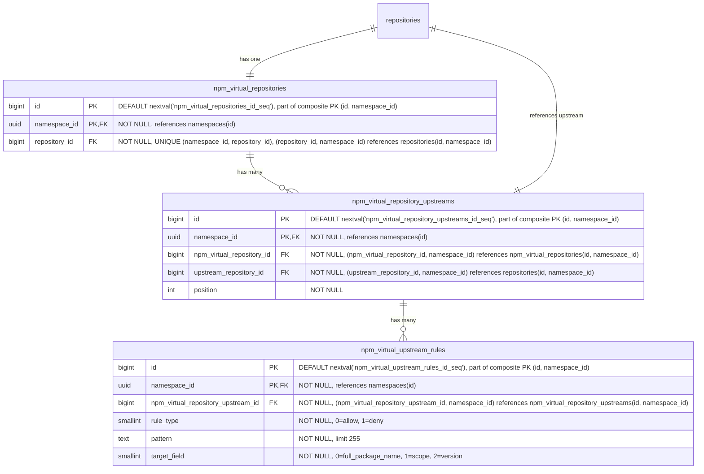
```mermaid
erDiagram
    repositories ||--|| npm_virtual_repositories : "has one"
    npm_virtual_repositories ||--o{ npm_virtual_repository_upstreams : "has many"
    npm_virtual_repository_upstreams ||--|| repositories : "references upstream"
    npm_virtual_repository_upstreams ||--o{ npm_virtual_upstream_rules : "has many"

    npm_virtual_repositories {
        bigint id PK "DEFAULT nextval('npm_virtual_repositories_id_seq'), part of composite PK (id, namespace_id)"
        uuid namespace_id PK,FK "NOT NULL, references namespaces(id)"
        bigint repository_id FK "NOT NULL, UNIQUE (namespace_id, repository_id), (repository_id, namespace_id) references repositories(id, namespace_id)"
    }

    npm_virtual_repository_upstreams {
        bigint id PK "DEFAULT nextval('npm_virtual_repository_upstreams_id_seq'), part of composite PK (id, namespace_id)"
        uuid namespace_id PK,FK "NOT NULL, references namespaces(id)"
        bigint npm_virtual_repository_id FK "NOT NULL, (npm_virtual_repository_id, namespace_id) references npm_virtual_repositories(id, namespace_id)"
        bigint upstream_repository_id FK "NOT NULL, (upstream_repository_id, namespace_id) references repositories(id, namespace_id)"
        int position "NOT NULL"
    }

    npm_virtual_upstream_rules {
        bigint id PK "DEFAULT nextval('npm_virtual_upstream_rules_id_seq'), part of composite PK (id, namespace_id)"
        uuid namespace_id PK,FK "NOT NULL, references namespaces(id)"
        bigint npm_virtual_repository_upstream_id FK "NOT NULL, (npm_virtual_repository_upstream_id, namespace_id) references npm_virtual_repository_upstreams(id, namespace_id)"
        smallint rule_type "NOT NULL, 0=allow, 1=deny"
        text pattern "NOT NULL, limit 255"
        smallint target_field "NOT NULL, 0=full_package_name, 1=scope, 2=version"
    }
```

- **npm_virtual_repositories**: The virtual repository for npm packages. References the parent `repositories` table via `repository_id` for name, visibility, and cross-format queries. Partitioned by `HASH(namespace_id)` with 64 partitions.
- **npm_virtual_repository_upstreams**: The table that joins virtual repositories and their upstreams. Each virtual repository has an ordered list of upstreams. Each entry references an upstream repository via `upstream_repository_id`, which points to `repositories(namespace_id, id)`. The composite FK `(namespace_id, upstream_repository_id)` enforces that upstreams are within the same namespace — consistent with the registry being scoped to namespaces ([ADR-001](001_organizations_as_anchor_point.md)). Partitioned by `HASH(namespace_id)` with 64 partitions.
- **npm_virtual_upstream_rules**: Defines allow/deny filter rules for an upstream. Each rule specifies a wildcard pattern and target field to control which artifacts are included or excluded when resolving through this upstream. Patterns are wildcards only for the MVP; regex support is deferred until customer feedback justifies it ([discussion](https://gitlab.com/gitlab-org/gitlab/-/work_items/597754#note_3291871207)). Partitioned by `HASH(namespace_id)` with 64 partitions.

#### Indexes

- **`npm_virtual_repositories`**: unique index on `(namespace_id, repository_id)` — look up a virtual repository by its parent reference.
- **`npm_virtual_repository_upstreams`**: unique index on `(namespace_id, npm_virtual_repository_id, position) DEFERRABLE INITIALLY DEFERRED` — retrieve ordered upstreams for a virtual repository; deferrable to allow reordering within a transaction. Unique index on `(namespace_id, npm_virtual_repository_id, upstream_repository_id)` — prevent the same upstream from being added to a virtual repository twice.
- **`npm_virtual_upstream_rules`**: index on `(namespace_id, npm_virtual_repository_upstream_id)` — fetch all rules for a given upstream.

#### Query examples

- Create a virtual repository

  ```sql
  -- First create the parent repository
  INSERT INTO repositories (namespace_id, name, format, kind, visibility)
  VALUES ('018f4d6f-0e10-7e3a-9bfd-23a4c5d6e7f8', 'my-virtual-repo', 2, 1, 1)
  RETURNING id;
  -- Link the repository to a repository collection
  INSERT INTO repository_collection_repositories (namespace_id, repository_collection_id, repository_id)
  VALUES ('018f4d6f-0e10-7e3a-9bfd-23a4c5d6e7f8', 456, <returned_id>);
  -- Then create the format-specific record
  INSERT INTO npm_virtual_repositories (namespace_id, repository_id)
  VALUES ('018f4d6f-0e10-7e3a-9bfd-23a4c5d6e7f8', <returned_id>);
  ```

- Associate a virtual repository with an upstream

  ```sql
  INSERT INTO npm_virtual_repository_upstreams (namespace_id, npm_virtual_repository_id, upstream_repository_id, position)
  VALUES ('018f4d6f-0e10-7e3a-9bfd-23a4c5d6e7f8', 123, 789, 1);
  ```

### Blob storage

The blob storage data organization has been done under the following assumptions:

- We don't need to handle one-to-many associations to blobs. This is handled by the blob storage clients area. Thus, we only need one-to-one association.
- We need to track how many blob storage clients use a single blob (deduplication) for proper [cleanup handling](#cleanup-tasks).
- Additionally, we might want to track the different origins of each usage for a single blob.

The schema we're presenting here only takes into account the storage side of the data. There might be auxiliary tables required for additional aspects such as metrics or [cleanup](#cleanup-tasks) that are not described here as these parts are still under evaluation. Upload session tracking is described in [Upload sessions](#upload-sessions).

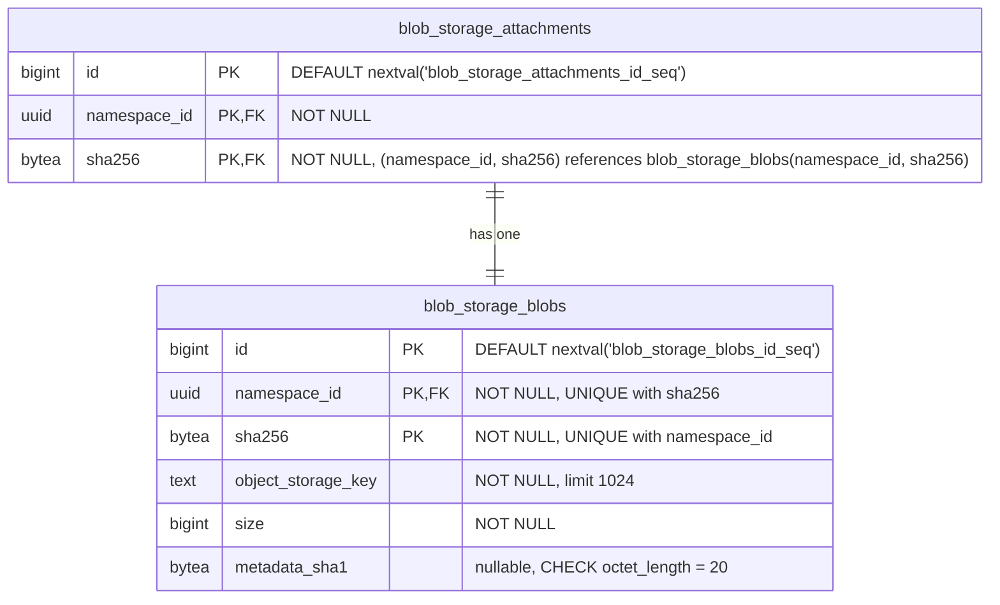
```mermaid
erDiagram
    blob_storage_attachments ||--|| blob_storage_blobs : "has one"

    blob_storage_attachments {
        bigint id PK "DEFAULT nextval('blob_storage_attachments_id_seq')"
        uuid namespace_id PK,FK "NOT NULL"
        bytea sha256 PK,FK "NOT NULL, (namespace_id, sha256) references blob_storage_blobs(namespace_id, sha256)"
    }

    blob_storage_blobs {
        bigint id PK "DEFAULT nextval('blob_storage_blobs_id_seq')"
        uuid namespace_id PK,FK "NOT NULL, UNIQUE with sha256"
        bytea sha256 PK "NOT NULL, UNIQUE with namespace_id"
        text object_storage_key "NOT NULL, limit 1024"
        bigint size "NOT NULL"
        bytea metadata_sha1 "nullable, CHECK octet_length = 20"
    }
```

- **blob_storage_attachments**: Tracks the usage of a given blob. Each client (Container, NPM or Maven repositories tables) needs to create a record here every time they want to use (create or re-use) a blob record. Each usage _needs_ to have a single record here. Clients are responsible for deleting the attachment record when they delete the referencing artifact record (file, blob, cache entry). Both deletions must happen in the same transaction to prevent orphaned attachments from blocking blob cleanup. The foreign key from client tables to `blob_storage_attachments` enforces referential integrity (prevents dangling references) but does not use `ON DELETE CASCADE` — cleanup is application-managed. For example, two Maven packages having the exact same file should each reference a different attachment record which in turn references the same blob record. The `namespace_id` column is required for Cells sharding. The `sha256` column is propagated from the referenced `blob_storage_blobs` record to enable partition-pruned joins (see [partitioning strategy](#blob-storage-partitioning-strategy)). The primary key is `(id, namespace_id, sha256)` rather than the conventional `(id)`: `sha256` is required because PostgreSQL forces the partition key to be part of every unique constraint on a hash-partitioned table, and `namespace_id` is required to keep the PK globally unique across deployments. The local `bigint id` is unique only within a single Artifact Registry database (see [Namespace ID type](#namespace-id-type)), so on cross-deployment namespace migration ([ADR-022](022_namespace_decoupling.md)) the same `(id, sha256)` pair could already exist in the target database. Adding the UUIDv7 `namespace_id` to the PK rules out that collision by construction. Client tables reference this composite PK via `(namespace_id, blob_storage_attachment_id, blob_sha256)`.
- **blob_storage_blobs**: This table lists all file contents (as blobs) that are present on object storage. The object storage key is entirely stored on a dedicated column and not computed every time a blob is used. `sha256` is the fundamental content-addressable identifier and is always present (`NOT NULL`). The `namespace_id` column scopes deduplication to an Organization. Format-specific checksums (for example, Maven's SHA1 and MD5) are stored on the format-specific file tables rather than here, keeping this table format-agnostic. Content type is excluded for the same reason: it is a property of how a format interprets a blob, not of the blob itself, and belongs in format-specific tables. The `metadata_sha1` column is a deliberate, scoped exception to that format-agnostic rule: it mirrors the SHA-1 from the MVP user-metadata allowlist attached to a blob at commit time, and is `NULL` when no SHA-1 was supplied. It is present on `blob_storage_blobs` (rather than on format-specific tables) because the storage layer's blob-info lookup is contractually a single DB round-trip on the push and pull hot paths; surfacing user metadata without a DB mirror would force a per-digest object-storage HEAD fan-out or partial-API surfacing. The same value is attached to the storage object as a backend-native `x-amz-meta-checksum-sha1` / `x-goog-meta-checksum-sha1` header at commit time, and rows are immutable, so the DB and storage-object copies cannot drift. Future allowlist additions add their own nullable columns by amendment. See the [Artifact Registry S06 storage-layer spec](https://gitlab.com/gitlab-org/ops/artifact-registry/-/blob/main/docs/specs/S06-storage-layer.md) for the full rationale. The primary key is `(id, namespace_id, sha256)` for the same reasons as `blob_storage_attachments` above: `sha256` satisfies PostgreSQL's partition-key inclusion rule, the UUIDv7 `namespace_id` keeps the PK globally unique across deployments, and the surrogate `bigint id` keeps the row-identifier shape consistent with every other table in the schema. Per-Organization deduplication is enforced by a separate `UNIQUE (namespace_id, sha256)` constraint, which also serves as the lookup-by-content-hash index and is the target of every foreign key into this table. No FK references the PK directly: `(namespace_id, sha256)` already uniquely identifies a row and is globally unique on its own via the UUIDv7 `namespace_id`, so callers join via the natural key without carrying the surrogate `id`.

The blob storage tables are designed to be reusable outside the Artifact Registry. This allows other features to leverage the same deduplication and storage infrastructure.

All hash columns (`digest` and `sha256`; `sha1`, `md5` and `sha512` — Maven specific) are stored as `bytea`. The exact encoding strategy (for example, an inline algorithm prefix as used by the [Container Registry](https://gitlab.com/gitlab-org/container-registry), or a separate `digest_algorithm` column) is still to be determined.

### Upload sessions

Upload sessions track in-progress blob uploads through the two-phase upload lifecycle described in [ADR-008](008_content_addressable_storage.md#two-phase-upload-strategy). Each session maps to a temporary storage object at `uploads/{upload_id}` within the namespace's storage partition. Sessions are database-tracked from the initial schema to support the upload API (resumable uploads, concurrent upload resolution) and to enable [upload purging](#cleanup-tasks) without object storage enumeration ([ADR-011](011_data_reconciliation.md)).

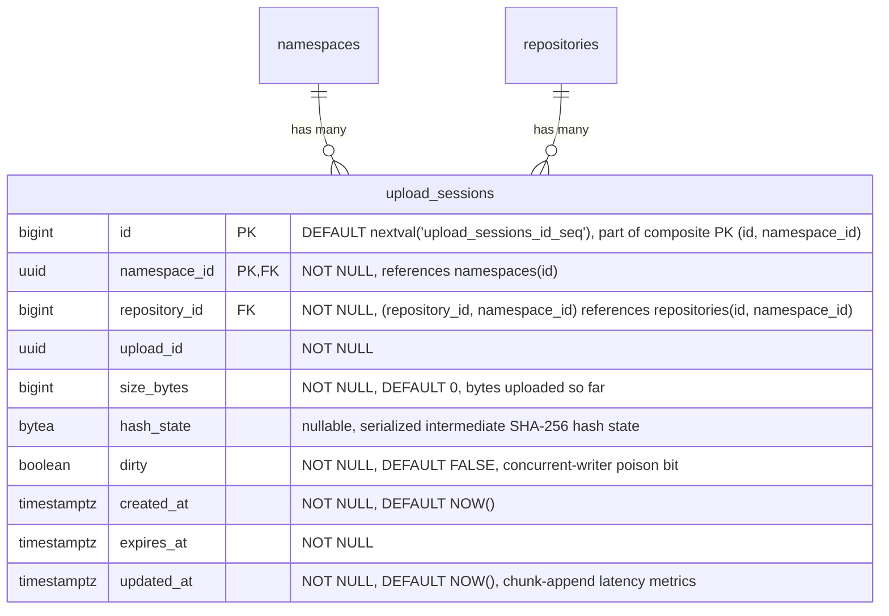
```mermaid
erDiagram
    namespaces ||--o{ upload_sessions : "has many"
    repositories ||--o{ upload_sessions : "has many"

    upload_sessions {
        bigint id PK "DEFAULT nextval('upload_sessions_id_seq'), part of composite PK (id, namespace_id)"
        uuid namespace_id PK,FK "NOT NULL, references namespaces(id)"
        bigint repository_id FK "NOT NULL, (repository_id, namespace_id) references repositories(id, namespace_id)"
        uuid upload_id "NOT NULL"
        bigint size_bytes "NOT NULL, DEFAULT 0, bytes uploaded so far"
        bytea hash_state "nullable, serialized intermediate SHA-256 hash state"
        boolean dirty "NOT NULL, DEFAULT FALSE, concurrent-writer poison bit"
        timestamptz created_at "NOT NULL, DEFAULT NOW()"
        timestamptz expires_at "NOT NULL"
        timestamptz updated_at "NOT NULL, DEFAULT NOW(), chunk-append latency metrics"
    }
```

- **upload_sessions**: Tracks each blob upload while it is in progress. The table follows a binary existence model, mirroring the [container registry pattern](https://gitlab.com/gitlab-org/container-registry/-/blob/master/registry/storage/blobwriter.go): if the row exists, the upload is in progress or requires cleanup; if it does not, the upload completed or was purged. On completion, the storage layer moves the blob to the content-addressable store, then deletes the session row in the same transaction that creates the `blob_storage_blobs` record. Format-specific rows (`blob_storage_attachments` and format tables) are created by the calling format subsystem in a separate transaction afterward — this keeps the storage layer format-agnostic. The `upload_id` (UUID) is the storage-level identifier used in the temporary object path (`uploads/{upload_id}`). The `repository_id` records the repository that initiated the upload. On follow-up requests, the server verifies that the repository in the URL matches session.repository_id, preventing cross-repo reuse of an upload_id if one leaks. Authorization for each request is performed by the request middleware against the URL's repository and does not depend on this column. The composite FK `(namespace_id, repository_id)` enforces that uploads are within the same namespace as the target repository. `size_bytes` tracks the number of bytes written to temporary storage. For resumable uploads, it is updated as each chunk arrives and is used to produce the `Range` response header that tells clients where to resume ([OCI Distribution Spec](https://github.com/opencontainers/distribution-spec/blob/main/spec.md)); for monolithic uploads, it is set after the blob data is written. `created_at` records when the upload started; it enables upload duration metrics (correlating duration with blob size) and retroactive expiry if the application's TTL configuration is lowered (`WHERE created_at < NOW() - :new_ttl`), which `expires_at` alone cannot support since existing sessions retain their original expiry. `expires_at` is the session expiry timestamp, computed at creation as `NOW() + :configured_ttl` based on upload type (shorter for non-resumable, longer for resumable uploads). Expired sessions are candidates for upload purging: the purger deletes the temporary storage object and removes the row ([ADR-008](008_content_addressable_storage.md#temporary-object-cleanup)). Hash state for resumable uploads is stored in the `hash_state` column as serialized intermediate SHA-256 state; a single-row `UPDATE` is simpler than per-PATCH object-storage round-trips (see [ADR-008](008_content_addressable_storage.md#resumable-uploads-and-hash-state)). That `UPDATE` takes no row lock: concurrent writers for one `upload_id` are reconciled by a compare-and-swap on `size_bytes` plus the `dirty` poison bit rather than by `SELECT ... FOR UPDATE` locking (terminate-on-divergence). `dirty` is that poison bit, set by a CAS loser and cleared only by row deletion. The per-failure flow is defined in the [Artifact Registry S06 storage-layer spec](https://gitlab.com/gitlab-org/ops/artifact-registry/-/blob/main/docs/specs/S06-storage-layer.md) "Consistency & Crash-Recovery Model". `updated_at` records the last modification time of the session, supporting chunk-append latency metrics and last-activity observability. It is a stored column rather than derived from access logs because it backs synchronous resume-path decisions at request time; the write cost is negligible since it rides the existing `size_bytes`/`hash_state` `UPDATE`. Partitioned by `HASH(namespace_id)` with 64 partitions, consistent with every other `namespace_id`-scoped table in the schema; although sessions are short-lived, the upload purger is deferred ([ADR-011](011_data_reconciliation.md)) so expired rows accumulate until it ships, and partitioning from day one avoids a later migration, preserves partition-wise join eligibility with `repositories`, and costs nothing on empty partitions. The primary key is `(id, namespace_id)` rather than the conventional `(id)` — PostgreSQL requires the partition key in every unique constraint on a hash-partitioned table, and this PK's partition key is the UUIDv7 `namespace_id`, so it is already globally unique across deployments — unlike `blob_storage_attachments` and `blob_storage_blobs`, which partition by `sha256` and add `namespace_id` for the same guarantee.

#### Indexes

- **`upload_sessions`**: unique index on `(namespace_id, upload_id)` — look up a session by its upload UUID within a namespace. Index on `expires_at` — find expired sessions for upload purging. Index on `(namespace_id, repository_id)` — find all sessions for a given repository, used for authorization checks and cleanup on repository deletion.

#### Query examples

- Create an upload session

  ```sql
  INSERT INTO upload_sessions (namespace_id, repository_id, upload_id, expires_at)
  VALUES ('018f4d6f-0e10-7e3a-9bfd-23a4c5d6e7f8', 456, 'a0eebc99-9c0b-4ef8-bb6d-6bb9bd380a11', NOW() + INTERVAL '1 hour')
  RETURNING id, upload_id;
  ```

- Look up a session during a chunked upload

  ```sql
  SELECT *
  FROM upload_sessions
  WHERE namespace_id = '018f4d6f-0e10-7e3a-9bfd-23a4c5d6e7f8' AND upload_id = 'a0eebc99-9c0b-4ef8-bb6d-6bb9bd380a11';
  ```

- Update session state after a chunk append (`hash_state` + `updated_at`, compare-and-swap on `size_bytes`)

  ```sql
  UPDATE upload_sessions
  SET size_bytes = 1048576, hash_state = 'a1b2c3...'::bytea, updated_at = NOW()
  WHERE namespace_id = '018f4d6f-0e10-7e3a-9bfd-23a4c5d6e7f8' AND upload_id = 'a0eebc99-9c0b-4ef8-bb6d-6bb9bd380a11'
    AND size_bytes = 524288;  -- CAS: only persist if no concurrent writer advanced the row; a zero-rowcount result is a conflict
  ```

- Find expired sessions for upload purging

  ```sql
  SELECT id, namespace_id, upload_id
  FROM upload_sessions
  WHERE expires_at < NOW()
  ORDER BY expires_at
  LIMIT 100;
  ```

  This query is not partition-pruned — the predicate does not include `namespace_id`, so it scans all 64 partitions. That is acceptable here: the purger is a bounded background job (`LIMIT 100`, backed by the index on `expires_at`), not a hot-path query, so the fan-out is not performance-critical.

- Delete a session after cleanup

  ```sql
  DELETE FROM upload_sessions
  WHERE namespace_id = '018f4d6f-0e10-7e3a-9bfd-23a4c5d6e7f8' AND id = 789;
  ```

### Partitioning invariant

**Every table that includes `namespace_id` is partitioned.** The default partition key is `HASH(namespace_id)` with 64 partitions; specific tables may use a different key when there is a documented reason (see [Blob storage partitioning strategy](#blob-storage-partitioning-strategy) for the `HASH(sha256)` exception). Tables that do not include `namespace_id` are not partitioned.

The rule is stated as a property of the row, not a per-table judgement: if `namespace_id` is part of the schema, the table is partitioned. There is no carve-out for "this table is small," "this table is 1:1 with its parent," or "we can add partitioning later." Small tables are partitioned the same as large ones; uniformity is the point. The cost of partitioning a low-volume table is negligible — sixty-four nearly-empty children, no measurable runtime overhead — while the cost of _adding_ partitioning later is dominated by table rewrite, primary-key reshape, and cascading foreign-key changes once production data is in place.

#### Mechanical consequences

PostgreSQL requires the partition key to be part of every unique constraint on a partitioned table. This shapes primary keys and foreign keys throughout the schema:

- **Primary keys.** Every partitioned table's primary key absorbs `namespace_id`: `(id)` becomes `(id, namespace_id)`. Unique indexes on partitioned tables include `namespace_id` as a leading column.
- **Foreign keys between partitioned tables.** Composite on `namespace_id`. A child references its parent via `(<parent>_id, namespace_id)` referencing the parent's `(id, namespace_id)`. This pattern is uniform across `repositories`, `workspaces`, format-specific repository tables, mid-tier tables, file tables, and remote cache tables.
- **Foreign keys to `namespaces`.** Single-column. `namespace_id` references `namespaces(id)`. `namespaces` is the only table whose primary key stays `(id)` — it is unpartitioned and has no `namespace_id` of its own (it _defines_ one), so child tables reference it without composite-PK gymnastics.

The composite foreign-key shape encodes the namespace boundary at the schema level: a row in any partitioned table cannot reference a row in another partitioned table that belongs to a different namespace, because the foreign key forbids it. This is the same boundary the Cells sharding key (`namespace_id`) draws at the application level, made redundant in the database itself.

#### Exceptions

A table is unpartitioned only when it lacks `namespace_id`. The principal example today is `namespaces` itself: the routing root resolved from `slug` before `namespace_id` is known, with no `namespace_id` column because it defines one. Future tables without `namespace_id` — for example, instance-wide configuration, global cron state, or deployment-scoped lifecycle metadata — inherit this default automatically and are not partitioned.

The exception predicate is structural: presence or absence of `namespace_id` in the row. It does not depend on row count, write frequency, or current access patterns, all of which can change as the system evolves.

Single-tenant deployments (Dedicated, Self-Managed, single-Organization Cells) are not an exception either: they keep all 64 partitions, with one populated and 63 empty. Empty partitions are negligible at this scale (a few KB of catalog and index overhead each), partition pruning is unaffected, and schema uniformity across deployments is more valuable than carving out a single-tenant variant. The pathological "one partition holds everything" case applies only to `blob_storage_blobs` / `blob_storage_attachments` at full multi-tenant scale, which is why those two tables use `HASH(sha256)` instead — see [Blob storage partitioning strategy](#blob-storage-partitioning-strategy).

### Blob storage partitioning strategy

As noted in [Consequences](#negative), `blob_storage_blobs` and `blob_storage_attachments` will accumulate very high row counts as they serve all artifact formats across all Organizations. Without a deliberate partitioning strategy, this leads to:

- Index bloat and degrading query performance as the tables grow into billions of rows.
- Table-wide locks (for example, during index creation or schema migrations) that block all artifact types simultaneously.
- Autovacuum contention at high write rates.

A key constraint to keep in mind: PostgreSQL requires the partition key to be part of every unique constraint on a partitioned table. For `blob_storage_blobs`, the deduplication constraint is `UNIQUE (namespace_id, sha256)`. Any strategy whose partition key is not a subset of those columns would force additional columns into that constraint — which would no longer prevent the same blob from being stored twice within the same Organization across different partitions, undermining the deduplication model entirely.

Below are the candidate strategies.

#### Option A: Hash partitioning by `sha256`

Partition both tables using `PARTITION BY HASH (sha256)` with 64 partitions.

Since `sha256` is a content-addressable digest, its values are uniformly distributed by nature — no additional effort is needed for even data distribution. This solves the single-tenant problem: single-tenant deployments (Dedicated, Self-Managed, single-Organization Cells) would concentrate all rows in a single partition when using `namespace_id` alone. With `sha256` as the partition key, rows spread evenly across all 64 partitions regardless of how many Organizations exist.

The existing unique constraint on `[namespace_id, sha256]` already includes `sha256`, so it is compatible with this scheme — PostgreSQL can enforce uniqueness across hash partitions because the partition key is part of the constraint.

This approach requires `sha256` to be propagated to `blob_storage_attachments` and to format-specific tables (`*_files`, `container_blobs`, `container_manifests`, cache entries) so that joins to `blob_storage_blobs` can target a single partition. This means blob identifiers (`namespace_id` + `sha256`) are stored in both `*_files` and `blob_storage_attachments` rows, using more physical storage than a simple `bigint` foreign key (`sha256` is 32 bytes as `bytea` vs 8 bytes for a `bigint`). However, the trade-off is justified: the read path (artifact pull) — the hottest query in the system — can join directly from `*_files` to `blob_storage_blobs` via `(namespace_id, sha256)`, skipping `blob_storage_attachments` entirely and eliminating one join. Attachments remain necessary for the lifecycle path — answering "is this blob still used by anyone?" during [cleanup](#cleanup-tasks).

The five critical access patterns behave as follows:

| # | Operation | Frequency | Partitions hit |
| --- | --- | --- | --- |
| AP1 | Pull artifact (`*_files` → `blob_storage_blobs` via `namespace_id` + `sha256`) | Highest | 1 |
| AP2 | Orphan check (`WHERE namespace_id = ? AND sha256 = ?`) | High | 1 |
| AP3 | Dedup upsert (`ON CONFLICT (namespace_id, sha256) DO NOTHING`) | Medium-high | 1 |
| AP4 | Attachment CRUD (`namespace_id` + `sha256` propagated from blob) | Medium | 1 |
| AP5 | Storage accounting by Organization (`WHERE namespace_id = ?`, no `sha256`) | Low | All 64 (mitigated) |

**Positive**:

- Uniform distribution regardless of tenant concentration: single-tenant deployments spread data across all 64 partitions instead of concentrating in one.
- All high-frequency access patterns (pull, orphan check, dedup upsert, attachment CRUD) hit exactly one partition.
- The unique constraint `(namespace_id, sha256)` includes the partition key — dedup upserts target a single partition and resolve concurrent uploads via `ON CONFLICT DO NOTHING` without external locking.
- The read path (artifact pull) skips the `blob_storage_attachments` join entirely, going directly from `*_files` to `blob_storage_blobs` via `(namespace_id, sha256)`.

**Negative**:

- `sha256` must be propagated to more tables: `blob_storage_attachments` and format-specific tables (`*_files`, `container_blobs`, `container_manifests`, cache entries) carry `(namespace_id, sha256)` in addition to the `blob_storage_attachment_id` foreign key. This duplicates blob identifiers across rows, increasing per-row storage.
- Queries with only `namespace_id` (no `sha256`) cannot prune partitions and scan all 64. The main case is storage accounting (summing blob sizes per Organization). This is mitigated by dedicated rollup tables updated via delayed increments on blob insert/delete — a pattern already established at GitLab (for example, project statistics). Even without rollup tables, a parallel aggregate across 64 partitions completes in seconds.

#### Option B: Hash partitioning by `namespace_id`

Partition both tables using `PARTITION BY HASH (namespace_id)` with a fixed number of partitions.

All common access patterns already include `namespace_id` in their `WHERE` clause, so the query planner can target a single partition for every operation. The Cells sharding key (`namespace_id`) doubles as the partition key, which is consistent with the broader architecture.

The unique constraint on `[namespace_id, sha256]` already includes `namespace_id`, so it is compatible with this scheme without any modification — PostgreSQL enforces uniqueness globally across all hash partitions.

**Positive**:

- All Organization-scoped queries hit a single partition; the query planner prunes all others automatically.
- Partition pruning applies directly to the cleanup path: the orphan check on `blob_storage_attachments` (`WHERE namespace_id = ? AND sha256 = ?`) is guaranteed to target a single partition, keeping lookup cost bounded by partition size rather than total table volume.
- Schema changes and locks are scoped to a single partition, reducing the impact on other Organizations.
- Aligns with the Cells sharding key; no cross-partition work for common access patterns.
- Existing constraint on `[namespace_id, sha256]` works correctly without modification.

**Negative**:

- Organizations with very high blob counts can dominate their hash partition if Organization sizes vary significantly. In single-tenant deployments (Dedicated, Self-Managed, single-Organization Cells), all rows concentrate in a single partition — VACUUM takes hours and indexes reach hundreds of GB.
- Any query that omits `namespace_id` from the `WHERE` clause scans all partitions.

#### Option C: Range partitioning by `id` (primary key)

Partition both tables by ranges of the auto-incrementing primary key. This is the approach used by GitLab's existing [table partitioning framework](https://docs.gitlab.com/ee/development/database/table_partitioning.html) and is well supported by existing tooling.

**Positive**:

- Partition sizes grow predictably; new partitions are easy to add as data accumulates.
- Compatible with GitLab's existing partition management infrastructure.

**Negative**:

- Breaks deduplication uniqueness: PostgreSQL requires `id` to be part of every unique constraint on the partitioned table. Adding `id` to `[namespace_id, sha256]` means the same sha256 for the same Organization could appear in multiple partitions — the deduplication model breaks entirely.
- Queries are Organization-scoped but partitions are id-range-based, so every Organization-scoped query spans multiple partitions.
- Lock scope reduction does not align with Organization boundaries.

#### Option D: Range partitioning by `created_at`

Partition both tables by time ranges (for example, monthly or quarterly windows).

**Positive**:

- Easy to archive or drop old partitions once their blobs have been cleaned up.
- Partitions correspond to known time windows, which is a clear operational model.

**Negative**:

- Hot partition problem: all writes target the most recent partition, concentrating write contention.
- Blobs expire when they lose all attachments, not by age. Time-based partitioning does not align with the actual blob lifecycle.
- Same unique constraint issue as Option C: `created_at` would need to be added to the unique constraints, breaking cross-partition deduplication.
- Access patterns are Organization-scoped, not time-scoped, so queries span all partitions.

#### Option E: No partitioning

Rely on Cells-level sharding (`namespace_id`) and standard indexing as the primary scalability mechanism. Partitioning is deferred until metrics show it is needed.

**Positive**:

- Simple schema and operations: no partition management overhead; migrations and schema changes are straightforward.
- Sufficient at early scale: works well while row counts remain manageable within a single Cell.

**Negative**:

- Unbounded growth within a Cell: table-level locks affect all Organizations simultaneously as the tables grow.
- Even well-designed indexes face performance pressure at very high row counts.

#### Decision

**Hash partitioning by `sha256` (Option A) is chosen** for both `blob_storage_blobs` and `blob_storage_attachments`.

It is the only option that:

1. Keeps all high-frequency access patterns (artifact pull, orphan check, dedup upsert, attachment CRUD) within a single partition.
2. Distributes rows uniformly regardless of tenant concentration — critical for single-tenant deployments (Dedicated, Self-Managed, single-Organization Cells) where `namespace_id`-based partitioning would concentrate all rows in one partition.
3. Is compatible with the existing unique constraint on `[namespace_id, sha256]` without modification, and enables race-free dedup upserts via `ON CONFLICT (namespace_id, sha256) DO NOTHING`.

An initial value of 64 partitions is chosen for both tables. This provides sufficient distribution and lock isolation while keeping operational overhead manageable.

The trade-off is that `sha256` must be propagated to `blob_storage_attachments` and format-specific tables (`*_files`, `container_blobs`, `container_manifests`, cache entries). This duplicates blob identifiers (`namespace_id` + `sha256`) across rows, using more physical storage than a `bigint` foreign key alone. The benefit is that the read path — the hottest query in the system — joins directly from `*_files` to `blob_storage_blobs` via `(namespace_id, sha256)`, skipping `blob_storage_attachments` entirely and eliminating one join. Attachments remain for the [cleanup lifecycle path](#cleanup-tasks) only.

Queries with only `namespace_id` (no `sha256`), such as Organization-level storage accounting, cannot prune partitions and scan all 64. This is mitigated by dedicated rollup tables updated via delayed increments — a pattern already established at GitLab (for example, project statistics).

### Format-specific table partitioning strategy

Format-specific tables — hosted content tables and their remote counterparts — follow the `HASH(namespace_id)` default established by the [Partitioning invariant](#partitioning-invariant); each table's bullet records that explicitly. Hosted and remote share one strategy because they share the same access shape: every primary access pattern is `namespace_id`-scoped. Per-table differences (cache TTL, upstream metadata) are orthogonal to partitioning and live in the per-table descriptions.

Rationale specific to this group:

- All primary access patterns are `namespace_id`-scoped — lookup by repository and artifact coordinates, listing files for a package or image, listing cached entries for an upstream — so `HASH(namespace_id)` gives single-partition pruning for every operation. The read-path shortcut (`*_files` → `blob_storage_blobs` via `(namespace_id, sha256)`, skipping `blob_storage_attachments`) — the hottest query in the system — benefits directly from this partitioning.
- The single-tenant concentration concern that drives `blob_storage_blobs` to `HASH(sha256)` does not apply: each format-specific table is scoped to one format (and, for remotes, to one upstream), so its per-namespace footprint is structurally a fraction of the cross-format aggregate that `blob_storage_blobs` holds.
- Joins to `blob_storage_blobs` via `(namespace_id, blob_sha256)` do not cross-partition scan: the planner prunes the format-table partition via `namespace_id` and the blob partition via `sha256` independently.

### Partition count rationale

All `HASH(namespace_id)` tables use 64 partitions, matching the 64 partitions chosen for `blob_storage_blobs` and `blob_storage_attachments` (`HASH(sha256)`). This count is informed by production data from the existing Container Registry and Package Registry databases.

The partition count is driven by the largest expected table (`container_blobs`), whose production analog already uses 64 partitions at comparable scale. Other format-specific tables are significantly smaller, making 64 partitions comfortable for all of them.

Key factors in this decision:

- **Skew tolerance**: `HASH(namespace_id)` does not guarantee uniform distribution. Namespace sizes are heavily skewed — a small number of large namespaces hold a disproportionate share of rows. With fewer partitions, large namespaces that hash to the same partition amplify the imbalance. At 64 partitions, even worst-case skew keeps partition sizes manageable.
- **Under-partitioning is expensive to fix**: Changing partition counts later requires a full table rebuild. Over-partitioning a small table has negligible overhead, while under-partitioning a large table creates real operational risk.
- **Partition-wise joins**: PostgreSQL can optimize JOINs between tables that share the same partition scheme (same key, same method, same count) by joining matching partitions directly. Since all `HASH(namespace_id)` tables use 64 partitions, this optimization is available. In practice, queries already include `namespace_id = ?` so the planner prunes to one partition per side, but partition-wise joins remain a free optimization.
- **Operational consistency**: A single partition count across all `namespace_id`-partitioned tables means all tables for a given `namespace_id` hash to the same partition number, simplifying maintenance scripts, monitoring, and bulk operations.

Which tables are partitioned is settled by the [Partitioning invariant](#partitioning-invariant), not enumerated here.

### Buffered and asynchronous writes

Several columns are updated on every download or upload request: the counter columns on `repositories` (`artifacts_count`, `downloads_count`, `size_bytes`), the per-package counters on `npm_packages` (`versions_count`, `tags_count`) used for entity-count limit checks, the `size_bytes` counter on the Maven and npm version tables (`maven_versions`, `maven_remote_versions`, `npm_versions`, `npm_remote_versions`), and the `last_downloaded_at` timestamps on `container_images`, `maven_packages`, `maven_versions`, `npm_packages`, and `npm_versions`. Writing these directly on the request path would serialize concurrent requests on the same row (hot-row contention on popular packages) and couple request latency to database write throughput.

To avoid this, these columns are maintained via buffered/async writes: request handlers record the update in a fast intermediate store (for example, Redis), and a background process periodically merges the buffered entries back into the row. This reuses the same pattern as GitLab's `ProjectStatistics`.

Columns maintained this way are flagged `buffered` in the schema diagrams.

#### Merge semantics

The merge strategy depends on the column type:

- **Counters** (`artifacts_count`, `downloads_count`, `size_bytes`, `versions_count`, `tags_count`): sum the buffered deltas into the existing value. Every increment must be preserved — losing an increment causes permanent under-counting. For the entity-count limit checks (`versions_count`, `tags_count`), a small over-cap at the boundary is acceptable: the limit is a product cap (not a data-integrity rule), drift is bounded by the buffer window, and the next flush re-syncs. Duplicate version names are blocked separately by the unique indexes on `npm_versions` and `npm_tags`, regardless of the counter.
- **Timestamps** (`last_downloaded_at`): take the maximum of the buffered values and the existing value (latest wins). Only the most recent download time matters; intermediate values can be discarded.

Both strategies share the same buffering infrastructure and differ only in how buffered entries are reduced before the write.

#### Trade-offs

- **Staleness**: buffered columns lag reality by up to one flush interval. This is acceptable for the current consumers — lifecycle rule evaluation (`keep_last_downloaded_at`) runs on schedules well above the flush interval, and landing page counters tolerate brief divergence. It is _not_ suitable for reads that must observe their own write synchronously, or for decisions that require exact ordering of download events.
- **Buffer loss**: if the buffer is lost before a flush, recent updates are dropped. For counters this is permanent under-counting; for timestamps the next download restores a correct (though slightly delayed) value.

### Namespace ID type

The type of the `namespaces.id` column cascades across the entire schema: every partitioned table carries `namespace_id` as its sharding key, and essentially every composite primary key, foreign key, and composite index on those tables includes this column as a leading element. Changing the type later would require a multi-phase migration across every partitioned table and every physical child relation — an irreversible decision in practice once the schema carries production data.

Three properties drive the choice:

1. **Global uniqueness across deployment models.** The Artifact Registry is designed to run as multiple independent deployments — GitLab.com, Dedicated, Self-Managed, per-Cell, and potentially as a standalone product independent of GitLab Rails (see [ADR-022](022_namespace_decoupling.md#consequences)). Sequential integer IDs drawn from a local sequence collide across deployments, foreclosing any scenario where namespace rows move between Artifact Registry instances (post-MVP migration tooling, Cell consolidation, cross-deployment references).
2. **Operational debuggability.** `namespace_id = 42` is ambiguous across deployments: the same integer can refer to unrelated namespaces on different Cells or installations. Support tickets, incident runbooks, and cross-deployment log correlation all benefit when the identifier is unique on sight.
3. **No coordination dependency for ID generation.** Allocating non-overlapping bigint ranges across deployments requires a central authority (the Topology service or equivalent). UUIDv7 generates locally on the database with no coordination.

#### Options

##### Option A: UUIDv7

`namespaces.id` is a `uuid` populated with a UUIDv7 value ([RFC 9562](https://datatracker.ietf.org/doc/rfc9562/)). Every `namespace_id` column throughout the schema is `uuid`. Generation can happen on the database side (PG18 native `uuidv7()`, or the [`pg_uuidv7`](https://pgxn.org/dist/pg_uuidv7/) extension on PG13–17) or on the application side with an RFC 9562–compliant library; the column type is the same in all cases and the path can change later without rewriting data — see the Decision section below for the full matrix.

**Positive**:

- Globally unique by construction across every Artifact Registry deployment — no coordination, no central allocator, no range management. Collisions are cryptographically improbable even across thousands of deployments generating simultaneously.
- Time-ordered: new IDs append to the right end of the B-tree within each partition. On a [PG18, 1M-row comparison by credativ](https://www.credativ.de/en/blog/postgresql-en/a-deeper-look-at-old-uuidv4-vs-new-uuidv7-in-postgresql-18/), UUIDv7 primary key indexes achieved ~90% leaf density (the default `fillfactor` that bigint sequences also achieve) with ~0% fragmentation, versus ~71% leaf density and ~50% fragmentation for UUIDv4 on the same workload.
- WAL volume is much closer to bigint than UUIDv4 is: UUIDv7's sequential-insert locality avoids the full-page-write amplification that random UUIDs suffer. Insert throughput matches bigint within a few percent on realistic multi-column schemas ([kkm-mako, PG18, 1M-row 13-column e-commerce table: bigint 76.5s vs UUIDv7 77.0s](https://kkm-mako.com/en/blog/articles/uuid-v4-v7-bigint-primary-key-design/); [Ardent Performance, PG17-dev, 20M-row table with 10 concurrent clients: bigint 3,480 tps vs UUIDv7 3,420 tps](https://ardentperf.com/2024/02/03/uuid-benchmark-war/)). On bare 2-column toy schemas the gap is more visible — [kkm-mako's minimal schema](https://kkm-mako.com/en/blog/articles/uuid-v4-v7-bigint-primary-key-design/) measured bigint 1.63s vs UUIDv7 2.16s (~32% slower) at the same row count, because the wider ID column is a larger fraction of the row. Absolute figures are workload-dependent.
- The embedded millisecond timestamp makes IDs BRIN-friendly and trivially extractable for diagnostics.
- Available on every PostgreSQL version the Artifact Registry might run against. PG18 ships `uuidv7()` natively (September 2025); on PG13–17 the [`pg_uuidv7` extension](https://pgxn.org/dist/pg_uuidv7/BENCHMARKS.html) provides `uuid_generate_v7()` with <2% overhead versus native per its published benchmarks; and any version supports application-side generation with an RFC 9562–compliant library.
- Structurally enables cross-deployment namespace portability. Post-MVP migration tools ([ADR-011](011_data_reconciliation.md)), Cell consolidation, and the standalone-product path from [ADR-022](022_namespace_decoupling.md) move a namespace row between Artifact Registry instances without rewriting `namespace_id` on every related row.

**Negative**:

- Storage: 16 bytes per value vs 8 bytes for bigint. `namespace_id` is the leading column of nearly every composite index on the partitioned tables, so the widening compounds across every physical child relation. [Jamauriceholt's 20M-row foreign-key index benchmark on PG 15.4](https://medium.com/@jamauriceholt.com/uuid-v7-vs-bigserial-i-ran-the-benchmarks-so-you-dont-have-to-44d97be6268c) measured 847 MB for UUIDv7 vs 423 MB for BIGSERIAL (~2×), and 1,847 buffer-write pages vs 847 (~2.2×) on a 10k-row bulk insert. The per-entry widening is ~8 bytes out of ~20 in the index tuple (~40%); observed total index size ranges from that per-entry floor to ~2× depending on how much of the index is the key vs. fixed overhead. At the Artifact Registry's multi-TB metadata scale this is a real but bounded cost, concentrated on `namespace_id`-leading indexes rather than on entire tables.
- Read latency on queries that materially depend on the key width can be measurably slower than with bigint. On a [synthetic 5M-user / 20M-order / 50M-audit_log schema (Jamauriceholt)](https://medium.com/@jamauriceholt.com/uuid-v7-vs-bigserial-i-ran-the-benchmarks-so-you-dont-have-to-44d97be6268c), 1-to-many JOINs ran ≈26× slower, single-row lookups ≈15× slower, and range/pagination ≈16× slower with UUIDv7 than with BIGSERIAL. Those numbers reflect worst-case synthetic queries and should not be extrapolated to this schema: every hot path is a single-partition `namespace_id = ?` indexed lookup on a composite key. Under those conditions the overhead is bounded by the per-page byte cost noted above and does not amplify into query-shape cost. If reviewers want a stronger empirical floor, a partition-local indexed-lookup benchmark on a representative row width on PG18 is the right thing to commission before merge.
- Time-ordering does not enable partition pruning on `HASH(namespace_id)` tables — hashing scatters values across partitions regardless of their timestamp component. Within-partition B-tree locality is preserved, which bigint sequences also provide at lower storage cost. UUIDv7's partition-pruning advantage only applies to `RANGE(uuid)` schemes, which are not used here.
- Client libraries, admin tooling, and API responses render 36-character strings instead of integers. Minor but pervasive; JSON response sizes grow for any endpoint carrying `namespace_id`.

##### Option B: Bigint with coordinated range allocation

`namespaces.id` stays `bigint DEFAULT nextval('namespaces_id_seq')`. Each Artifact Registry deployment is provisioned with a non-overlapping bigint range (for example, deployment X: 1 to 10^12, deployment Y: 10^12+1 to 2×10^12) by the Topology service, which the Artifact Registry already depends on for slug claiming (see [ADR-022](022_namespace_decoupling.md#cells-routing)).

**Positive**:

- Zero storage delta versus the current draft. No index, WAL, or JOIN cost to reason about.
- Reuses an existing dependency: the Topology service is already required for slug claiming.
- ID generation remains a sequence `nextval` — trivially fast, no extension required.
- Matches GitLab Rails' established pattern of coordinated bigint sequences across Cells ([Cells development guidelines](https://docs.gitlab.com/development/cells/)).

**Negative**:

- Cross-deployment namespace portability is not structurally supported. Moving a namespace from deployment X to deployment Y still requires rewriting every row's `namespace_id` if Y's allocated range does not contain the source ID.
- Range allocation adds a bootstrap step for every new Artifact Registry deployment and a governance model for range sizes and reclamation. A misallocation that lets ranges overlap is a global-uniqueness violation that is hard to detect early.
- A later decision to support cross-deployment portability would require the full bigint-to-UUID migration this ADR is trying to avoid.

##### Option C: Snowflake-packed bigint

Bit-pack 64 bits application-side: deployment ID (14 bits, 16K deployments) + timestamp (41 bits, 69 years from epoch) + per-backend sequence (9 bits, 512 IDs/ms/backend). Generated in the Go service with a small library.

**Positive**:

- Zero storage delta versus bigint. Same index, WAL, and JOIN profile.
- Self-identifying: deployment origin is extractable from any `namespace_id`.
- Time-ordered like UUIDv7, giving the same within-partition B-tree locality benefits.
- No extension dependency; ID generation is a handful of bit operations.

**Negative**:

- Custom generator maintained in the Go service instead of a PostgreSQL primitive. All writers must use the same library version and clock source.
- Clock-skew sensitive: per-deployment counters must survive clock rewinds and burst traffic. Requires monotonic-clock discipline and careful handling of the within-millisecond sequence counter.
- Widely used in industry (Twitter, Discord, Instagram 41+13+10 variant) but is not a PostgreSQL-native pattern — tooling, auditability, and cross-team familiarity are weaker than for UUIDs.
- The bit-field split is a one-time design decision. Too few deployment bits or too narrow a timestamp range would be hard to change later.
- Does not solve deployment-to-deployment migration: an ID generated on deployment X carries X's 14-bit prefix forever, so relocating a namespace to deployment Y still means either a rewrite or an ID that lies about its origin.

#### Decision

**Option A (UUIDv7) is chosen** for `namespaces.id` and, by consequence, for every `namespace_id` column across the schema. All other `id` columns (`repositories.id`, `container_images.id`, `maven_packages.id`, and so on) are `bigint DEFAULT nextval('<table>_id_seq')`: their uniqueness only needs to hold within a single Artifact Registry database, their storage footprint is significant across billions of rows, and they never appear as cross-deployment identifiers — but cross-deployment namespace migration ([ADR-022](022_namespace_decoupling.md)) still needs to re-insert rows with their source-deployment `id` values, which is straightforward with an explicit sequence default and would otherwise require `OVERRIDING SYSTEM VALUE` on every insert under `GENERATED ALWAYS AS IDENTITY`.

The decisive factors:

1. **The namespace is the unit of portability.** If any Artifact Registry identifier must survive movement between deployments, it is `namespace_id`. Everything below a namespace moves with it; everything above a namespace is expressed through the immutable slug and anchor tuple ([ADR-022](022_namespace_decoupling.md)).
2. **The cost is concentrated and bounded.** Widening `namespace_id` from 8 to 16 bytes hits the leading column of many indexes but does not double total storage — row widths on the large partitioned tables are dominated by other columns (repository/image/manifest IDs, timestamps, counters, and 32-byte `bytea` digests). Preliminary sizing puts the hit at tens of percent of total metadata storage, within the Artifact Registry's capacity envelope.
3. **The benefit is structural, not incremental.** Every post-MVP feature that touches cross-deployment movement (migration tooling in [ADR-011](011_data_reconciliation.md), Cell consolidation, standalone-product packaging per [ADR-022](022_namespace_decoupling.md)) becomes meaningfully simpler when `namespace_id` is globally unique by construction, and the absence of an allocator removes a coordination dependency.
4. **The storage cost is paid once, at insert time, on a schema that is still empty.** Option B would require an irreversible migration across every partitioned table if the deployment model later demands global uniqueness. We accept a known, bounded cost today to avoid an unbounded migration risk later.
5. **UUIDv7 preserves the hot-path performance profile.** Single-partition `namespace_id = ?` lookups remain single-partition. Within-partition B-tree locality that bigint provides is also provided by UUIDv7's time-ordered prefix. The only properties lost (partition pruning by UUID range, 8-byte index leading column) are either non-applicable to `HASH` partitioning or bounded in cost.

**Implementation notes**:

- Three viable generation paths exist; the choice depends on the PostgreSQL version available at deployment time and is independent of the column type:
  - **PG18+ native**: column default `DEFAULT uuidv7()`. No extension required.
  - **PG13–17 with the [`pg_uuidv7`](https://pgxn.org/dist/pg_uuidv7/) extension**: column default `DEFAULT uuid_generate_v7()`. Note the function-name difference from the native path; migrations and schema dumps must reference the right name for the target environment.
  - **Application-side generation**: any PostgreSQL version, no extension required. The Go service generates the value with an [RFC 9562](https://datatracker.ietf.org/doc/rfc9562/)–compliant library and supplies it on `INSERT`.
- Switching between these paths later is metadata-only (`ALTER COLUMN SET DEFAULT`) and does not rewrite data, provided every generator emits RFC 9562–compliant UUIDv7 values. This makes the initial path a runtime/operational choice rather than a schema commitment.
- **Open question (resolve closer to GA)**: which initial path to take depends on the PostgreSQL version available across `.com`, Dedicated, and Self-Managed at GA. If PG18 cannot be guaranteed across all install types, application-side generation is the safest interim choice; the column default can move to native `uuidv7()` once PG18 is the floor everywhere.
- All mermaid diagrams in this ADR show `namespaces.id` and `namespace_id` columns as `uuid`. Format-specific `id` columns remain `bigint`.
- Monotonicity of UUIDv7 is strict within a single backend (database side) or process (application side) within the same millisecond, not across backends or processes. This is sufficient for index locality and debuggability; no hot-path logic assumes strict global ordering across connections.
- The slug-to-`namespace_id` lookup cache (see [ADR-022](022_namespace_decoupling.md#request-flow)) is unaffected: it keys on the immutable slug.
- The composite primary key pattern used on partitioned tables (for example, `(id, namespace_id)` on `upload_sessions`, required by PostgreSQL's partitioned-table constraint rules) still holds. The `namespace_id` component of the PK becomes `uuid`; the `id` component stays `bigint`.

### Partition schema organization

With 64 HASH partitions per partitioned table and a partition set that grows as mid-tier tables are partitioned later, child relations outnumber logical tables by a wide margin. Where these children live — alongside their parents in `public`, or in a dedicated namespace — shapes schema legibility, tooling alignment, and the migration tooling we build around partitioned tables.

#### Option A: Dedicated schema for partition children

Parent tables live in `public` and all partition children live in a dedicated `partitions` schema. Partition DDL explicitly targets the partition schema on every `CREATE TABLE ... PARTITION OF` — PostgreSQL otherwise places the child in the parent's schema.

**Positive**:

- Catalog legibility: `\dt public.*`, `information_schema`, ER diagrams, and IDE schema views show only the logical tables instead of every partition child. Schema reviews, onboarding, and DB console work operate at the abstraction engineers actually reason about.
- Application layer is unaffected: applications query through parent tables in `public` and never reference the `partitions` schema. Only migration tooling targets child partitions, using explicit `partitions.<name>` qualification.
- Clean scoping for partition-lifecycle operations: permissions, `pg_dump -n`, logical replication publications, and monitoring exporters target a single namespace instead of table-name patterns.
- Discourages accidental partition-level queries: reaching a specific child requires `partitions.<name>`, making it harder to bypass the partition abstraction.

**Negative**:

- Postgres defaults work against the convention: `CREATE TABLE ... PARTITION OF parent` places the child in the parent's schema unless explicitly overridden, so enforcement lives in migration tooling, linters, or CI — not in the database itself.
- Partitioning helpers must route child creation to the partition schema, and service bootstrap must provision the schema and its grants before migrations run ([ADR-006](006_technology_stack.md)).
- No runtime benefit. Pruning, locking, VACUUM, and query performance are unchanged; the case is entirely organizational.

#### Option B: All tables in `public`

Parents and their child partitions live together in the default schema — PostgreSQL's out-of-the-box behavior with no extra configuration.

**Positive**:

- Simplest bootstrap: no extra schema, no grants split, no partition-routing helper in migration tooling. Local dev, CI, and migrations work with no setup.
- Matches Postgres defaults and third-party tool assumptions (introspection, ORMs, query analyzers), avoiding per-tool configuration.

**Negative**:

- Catalog clutter: every partition child shares the namespace with the logical tables and quickly dominates any `\dt`, `information_schema` query, or ER diagram. The problem compounds as new tables are partitioned.
- No schema-level scoping for partition-lifecycle tooling: `pg_dump`, logical replication, and monitoring must be expressed as table-name patterns (`blob_storage_blobs_*`, `*_files_*`, and so on).
- Partition-level queries (for example, `SELECT FROM blob_storage_blobs_37`) are indistinguishable from normal table references, making it easier to bypass the partition abstraction.

#### Decision

**Option A (dedicated `partitions` schema) is chosen.**

The decisive factor is the distinction between application-facing tables and partitioning internals. Logical tables are the surface area applications read and write through; partition children are internal to the partitioning mechanism and should only be touched by partition-lifecycle tooling. Keeping both in a single schema blurs that boundary — schema introspection, grants, and operational tooling all have to filter by name to tell them apart. A dedicated `partitions` schema makes the distinction structural in the database itself: partition-lifecycle operations scope to one namespace, and anything reading `public` sees only the surface area applications are meant to touch.

The legibility argument reinforces the choice: partition children outnumber logical tables by a wide margin from the first deployment and the gap widens as more tables are partitioned, so the single-schema layout would be awkward from the first deployment and worse over time. The bootstrap cost (partition-routing helper in migration tooling, schema creation at startup) is one-time and amortizes across all satellite services adopting the same migration abstraction ([ADR-006](006_technology_stack.md)).

The pattern is validated at scale: GitLab Rails organizes its partition children in dedicated [`gitlab_partitions_static` and `gitlab_partitions_dynamic`](https://gitlab.com/gitlab-org/gitlab/-/blob/master/lib/gitlab/database.rb) schemas.

Only partition children move to the dedicated schema; parent tables and tables without explicit partitioning remain in `public`.

### Cleanup tasks

To understand the above approach, it is important to understand the challenges of the blob storage part when it comes to cleanup.

On one side, we can have one or many attachments that are deleted as part of parent objects being destroyed (a package being destroyed or a cleanup policy being executed and removing hundreds of files).

On the other side, we can't simply remove records from the blobs table as they reference a file on object storage. As such, we need a cleanup task that will take the blob record, remove it, and also remove the file on object storage. This can't be done by the database. We need a callback that will be implemented as a background process.

Before handling a blob for destruction, the backend needs to make sure that it's not used anymore by any part (due to deduplication). That's where the attachments table fills a crucial role: it records the usage of a given blob. The cleanup task can simply ask if a `(namespace_id, sha256)` pair is still present in the attachments table (see [orphan check query](#blob-storage-query-examples)). If that's a no, then the blob is clear to be removed.

This approach keeps the cleanup contract simple for engineers working on each blob storage client. When deleting artifact records (single file, bulk destruction, or cleanup policy execution), the application must also delete the corresponding `blob_storage_attachments` record(s) in the same transaction. This is the only cleanup responsibility at the client level — no object storage interaction is needed. From that point, the blob storage background process takes over: it identifies `blob_storage_blobs` rows with no remaining attachments (orphan check) and removes both the database record and the object storage file.

Upload session cleanup follows a similar pattern. The `upload_sessions` table uses a binary existence model — if the row exists, the upload is in progress or requires cleanup — so expired sessions (where `expires_at < NOW()`) are candidates for purging. The purger deletes the temporary storage object and removes the row. The table provides all information needed to identify candidates and derive the storage path (`uploads/{upload_id}` under the namespace partition), without enumerating objects in storage. See [ADR-011](011_data_reconciliation.md) for the shipping timeline of upload purging.

This blueprint establishes the high-level database primitives (attachment tracking, blob storage organization, upload session tracking) that can enable cleanup processes, but the specific implementation details (triggers, background job logic, performance analysis) are left for later detailed specification work.

### Storage usage calculation

Storage usage is tracked at three scopes: namespace, repository, and artifact. Each scope has a pre-computed counter that serves the display path with sub-millisecond reads, and a reconciliation path that computes the exact value from source data when drift is suspected or on-demand verification is needed. The blob storage schema is designed to make these calculations and attribution both accurate and efficient:

- Blobs and attachments are scoped to an Organization, and deduplication happens **within** an Organization only (see [ADR-002](002_storage_deduplication_scope.md)).
- `blob_storage_blobs` has **one row per unique stored blob per Organization**: each physical object in object storage is represented once per Organization.
- Physical blobs and `blob_storage_blobs` records are cleaned up asynchronously when they lose all attachments (through the [cleanup process](#cleanup-tasks)), so `blob_storage_blobs` only references blobs that are still in use (or pending async deletion). As a result, storage usage queries do not need to filter by attachment counts.

Thus, calculating storage usage for a given Organization is a matter of summing the size of its blobs listed in `blob_storage_blobs`. This is distinct from the per-manifest `container_manifests.size` (see [Container Repositories](#container-repositories)): the latter answers "how big is this manifest tree" and may double-count blobs shared across manifests or across children of a manifest list, so it is not a substitute for Organization-level usage.

A separate ADR will describe storage usage calculation and attribution in more detail. This ADR defines the database primitives that facilitate those calculations.

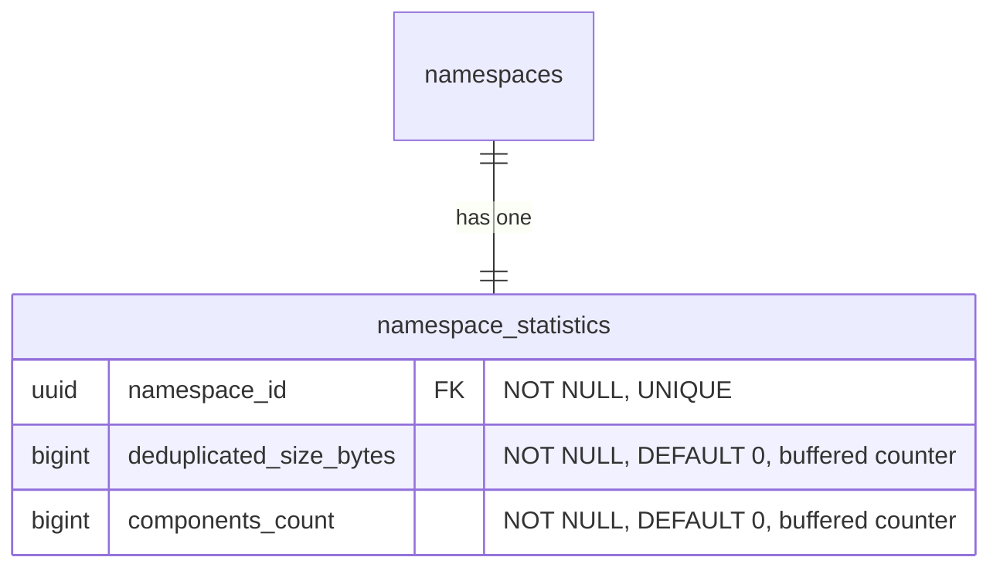
```mermaid
erDiagram
    namespaces ||--|| namespace_statistics : "has one"

    namespace_statistics {
        uuid namespace_id FK "NOT NULL, UNIQUE"
        bigint deduplicated_size_bytes "NOT NULL, DEFAULT 0, buffered counter"
        bigint components_count "NOT NULL, DEFAULT 0, buffered counter"
    }
```

- **namespace_statistics**: Stores pre-computed namespace-level counters, maintained via buffered counters (async flusher). This is the table that the display path and billing system read from, delivering sub-millisecond responses (see [benchmark table](#namespace-level-storage-accounting-reconciliation)). The [reconciliation mechanisms](#namespace-level-storage-accounting-reconciliation) exist to verify and correct these counters when drift is suspected.
  - `deduplicated_size_bytes`: total storage used by the namespace, with blob deduplication already applied (see [ADR-002](002_storage_deduplication_scope.md)). The column is named this way (rather than `size_bytes`) to be forward-compatible, distinguishing it from any future raw or logical size metrics.
  - `components_count`: total number of artifact versions stored in the namespace's hosted and remote repositories:
    - Container: `container_manifests` + `container_remote_manifests`.
    - Maven: `maven_versions` + `maven_remote_versions`.
    - npm: `npm_versions` + `npm_remote_versions`.

    Soft-deleted rows continue to count until garbage collection hard-deletes them after the [soft-delete window](010_data_retention.md#soft-delete) expires. This matches `deduplicated_size_bytes`, which keeps the bytes of soft-deleted artifacts until garbage collection reclaims the underlying blobs. Virtual repositories are not counted separately because they have no version tables of their own. A virtual repository resolves requests through an ordered list of upstreams (see [`container_virtual_repository_upstreams`](#virtual-container-repositories) and its Maven and npm equivalents), and each upstream is itself a hosted or remote repository whose versions are already included via the tables above. Counting the virtual repository on top would double-count its upstreams. This is the namespace-level dimension for consumption-based pricing and metering, complementing `deduplicated_size_bytes`. Surfaced on the namespace overview alongside storage usage.

#### Namespace-level storage accounting reconciliation

The `namespace_statistics.deduplicated_size_bytes` counter and repository-level `repositories.size_bytes` counter serve the display path with sub-millisecond reads. However, two reconciliation scenarios require computing exact storage from source data rather than the cached counter:

1. **On-demand verification**: A customer asks "is my billing accurate?" and we need to compute the exact namespace storage from source data. This means `SUM(size) FROM blob_storage_blobs WHERE namespace_id = ?` across all 64 `sha256`-partitions.
2. **Drift correction**: A failed GC run, partial flush, or other event desynchronizes the cached counters, and we need to recompute the exact value to correct it.

Because `blob_storage_blobs` is partitioned by `HASH(sha256)`, any `namespace_id`-only query fans out to all 64 partitions. [Benchmarks](https://gitlab.com/gitlab-com/content-sites/handbook/-/merge_requests/18456#note_3166018048) on a CloudSQL PostgreSQL 18 instance ([seeded](https://gitlab.com/jdrpereira/artifact-registry-poc/-/tree/main/cmd/seed) dataset: ~1.6M blobs across 64 `sha256`-partitions, 500K namespaces with Zipf-distributed blob ownership, blob-heaviest namespace at 353K blobs) show the baseline at 78 ms and ~3K+ buffer hits for the heaviest namespace. Two additive insurance policies can improve this:

**Option A — Covering index on `blob_storage_blobs`**: Add `INCLUDE (size)` to the existing `namespace_id` index on each partition. This turns the 64-partition fan-out into 64 index-only scans with minimal or no heap fetches. Space overhead is negligible (only the `size` column is added to the existing index leaf pages).

**Option B — Namespace-partitioned shadow table**: A dedicated `blob_storage_blobs_by_namespace` table partitioned by `HASH(namespace_id)` with 64 partitions, maintained via `AFTER INSERT`/`DELETE` triggers on `blob_storage_blobs`. This collapses the reconciliation query to a single-partition index-only scan. Space overhead is moderate (duplicates a minimal subset of blob data — `namespace_id`, `sha256`, `size` — across 64 new partitions plus indexes, growing linearly with blob count). The tradeoff is write amplification on every blob `INSERT`/`DELETE`, but it keeps the reconciliation load away from the main `blob_storage_blobs` table (hot path).

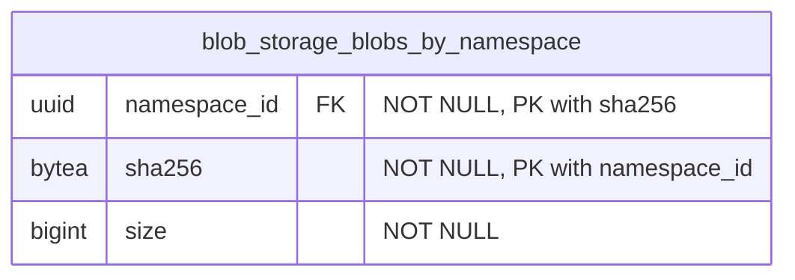
```mermaid
erDiagram
    blob_storage_blobs_by_namespace {
        uuid namespace_id FK "NOT NULL, PK with sha256"
        bytea sha256 "NOT NULL, PK with namespace_id"
        bigint size "NOT NULL"
    }
```

Triggers on `blob_storage_blobs` maintain this table: `AFTER INSERT` copies `(namespace_id, sha256, size)` into the shadow table; `AFTER DELETE` removes the matching row. No `AFTER UPDATE` trigger is needed because `blob_storage_blobs` rows are immutable — content-addressable storage means any change to the content produces a new `sha256` and thus a new row (see [ADR-008](008_content_addressable_storage.md)). The primary key `(namespace_id, sha256)` must include the partition key (`namespace_id`) and mirrors the unique key on `blob_storage_blobs`. The table uses the same 64-partition count as other `HASH(namespace_id)` tables. Covering index on `(namespace_id) INCLUDE (size)` enables index-only scans.

| Approach | Timing | Buffers | Partitions scanned | Write overhead |
| --- | --- | --- | --- | --- |
| `namespace_statistics` counter (display path) | 0.013 ms | 1 | 0 | Async flusher |
| Shadow table + covering index (Option B) | 29 ms | 1,361 | 1 | Triggers |
| Covering index on blobs (Option A) | 43 ms | 1,599 | 64 | None |
| Baseline (no changes) | 78 ms | ~3K+ | 64 | None |

Both options are purely additive — no changes to `blob_storage_blobs` itself — and can be added or removed independently. They are not mutually exclusive; both are included in the initial schema. It is easier to start with more coverage and drop indexes or auxiliary tables later once production metrics confirm they are not needed.

#### Namespace-level component count reconciliation

The `namespace_statistics.components_count` counter serves the display path and metering pipeline. As with the storage counter, two scenarios call for recomputing the exact value from source data:

1. **On-demand verification**: A customer (or billing) asks whether the component count is accurate, and we need to derive it from source rows.
2. **Drift correction**: A failed flush, partial buffer loss, or background-job bug desynchronizes the counter and we need to recompute it.

Reconciliation sums six independent counts scoped to a namespace's rows: three hosted (`container_manifests`, `maven_versions`, `npm_versions`) and three remote (`container_remote_manifests`, `maven_remote_versions`, `npm_remote_versions`). Soft-deleted rows are included so the recomputed value matches what `components_count` tracks (insert increments, garbage-collection hard-delete decrements; soft-delete and restore are no-ops).

```sql
SELECT
  (SELECT COUNT(*) FROM container_manifests        WHERE namespace_id = $1)
+ (SELECT COUNT(*) FROM container_remote_manifests WHERE namespace_id = $1)
+ (SELECT COUNT(*) FROM maven_versions             WHERE namespace_id = $1)
+ (SELECT COUNT(*) FROM maven_remote_versions      WHERE namespace_id = $1)
+ (SELECT COUNT(*) FROM npm_versions               WHERE namespace_id = $1)
+ (SELECT COUNT(*) FROM npm_remote_versions        WHERE namespace_id = $1)
  AS components_count;
```

Each subquery is a count by `namespace_id` on a single source table, with no `soft_deleted_at` predicate so the rows still in the table (live plus soft-deleted within the [soft-delete window](010_data_retention.md#soft-delete)) match what `components_count` tracks. The four partitioned source tables (`container_manifests`, `container_remote_manifests`, `maven_remote_versions`, `npm_remote_versions`) prune to a single `HASH(namespace_id)` partition; the two non-partitioned mid-tier tables (`maven_versions`, `npm_versions`) scan the full table for the namespace's rows. The existing partial unique indexes (`WHERE soft_deleted_at IS NULL`) cover only live rows, so they cannot satisfy the count directly. Per-namespace cardinality is bounded by the data model (one row per version, not per file or blob reference) and reconciliation is infrequent (on-demand or drift correction, not a hot path), so the bounded scan is acceptable. No additional insurance policies (covering indexes or shadow tables) are introduced. If production metrics ever show this is too slow, a non-partial `(namespace_id)` index on each source table is the cheapest next step before considering a shadow table.

#### Repository-level storage accounting reconciliation

The `repositories.size_bytes` counter is maintained via [buffered/async writes](#buffered-and-asynchronous-writes) and serves the landing page hybrid list with sub-millisecond reads. As with the namespace-level counter, two scenarios call for recomputing the exact value from source data:

1. **On-demand verification**: A user asks "how much storage does this repository really use?" and we need to derive the exact value from source rows.
2. **Drift correction**: A failed flush, partial buffer loss, or background-job bug desynchronizes the counter and we need to recompute it.

Reconciliation branches on `(repositories.format, repositories.kind)` because each combination reaches blob storage through a different chain of tables. For each format, the query collects every blob `sha256` referenced from artifacts in the repository, applies `DISTINCT` for intra-repository deduplication, and joins to `blob_storage_blobs` for the size. The query filters the mid-tier tables by their `*_repository_id` columns, which reference the format-specific stub table's own `id`, not `repositories.id`. The example queries below resolve the stub `id` from `repositories.id` via a small CTE, so they can be invoked with the parent identifier.

- **Container**: `container_images` (filtered by `container_repository_id`) → `container_blobs` and `container_manifests`. Both tables carry `blob_sha256`; the union covers layer blobs and manifest payloads.
- **Maven**: `maven_packages` (filtered by `maven_repository_id`) → `maven_files`. The single file table covers a package's version-specific and package-level files.
- **npm**: `npm_packages` (filtered by `npm_repository_id`) → `npm_versions` → `npm_files`, with a union against `npm_metadata_files` (which is keyed at the package, not the version, level).
- **Remote variants** (`kind = remote`) follow the same shape against the cache tables (`*_remote_*`). The cache is part of the repository's footprint.

`SUM(DISTINCT bsb.size)` would be incorrect: different blobs can share a `size` value (small files of identical length collapse). Reconciliation must `SELECT DISTINCT blob_sha256` first and only then join to `blob_storage_blobs` for the sum.

Soft-deleted rows are included so the recomputed value matches what `repositories.size_bytes` tracks. The counter is deduplicated within the repository (matching the `DISTINCT blob_sha256` in reconciliation): it increments only when a `sha256` first becomes attached in the repository and decrements when garbage collection hard-deletes the last attachment of that `sha256`. Soft-delete and restore are no-ops, matching the namespace-level behavior described above.

Reconciliation cost scales with the repository's artifact count, not the namespace's. The format-specific file, blob, and manifest tables (`container_blobs` and `container_manifests` for container, `maven_files` for Maven, `npm_files` and `npm_metadata_files` for npm, plus their `*_remote_*` cache variants) are partitioned by `HASH(namespace_id)`, so each side of the walk prunes to a single partition. The existing format-specific indexes on those tables (`(namespace_id, container_image_id, digest)`, `(namespace_id, maven_package_id, file_name)`, `(namespace_id, npm_version_id, file_name)`, and their remote equivalents) are partial (`WHERE soft_deleted_at IS NULL`) and cannot satisfy the soft-delete-inclusive walk directly. Per-repository cardinality is bounded by the data model (one row per file or blob reference per artifact, with manifests as a small additional factor for container), and reconciliation is infrequent (on-demand or drift correction, not a hot path), so the bounded partition scan is acceptable. The final `blob_storage_blobs_by_namespace` lookup from [namespace-level reconciliation](#namespace-level-storage-accounting-reconciliation) is a single-partition index-only scan.

No additional insurance structures (covering indexes, shadow tables) are introduced for repository-level reconciliation. If production metrics ever show this is too slow for very large repositories, the cheapest next step is a non-partial `(namespace_id, parent_id)` index on each of those tables. Beyond that, a repository-partitioned shadow table mapping `(namespace_id, repository_id, sha256, size)`, maintained from the format-specific tables at attach/detach time, would mirror the [Option B](#namespace-level-storage-accounting-reconciliation) shape at a finer scope.

#### Artifact-level storage accounting

Artifact-level storage usage is the byte footprint of a single artifact version (a container manifest, a Maven version, an npm version). It powers per-artifact UI displays (for example, "this image is 142 MB", "this package version is 4 MB") and is consumed by [lifecycle rules](010_data_retention.md) and reporting queries that filter or sort by size.

The accounting model differs by format because the underlying artifact shape differs:

- **Container manifests**: `container_manifests.size` is pre-computed at push time and is immutable. A manifest is content-addressed ([ADR-008](008_content_addressable_storage.md)), so any change to its bytes produces a new manifest with a new digest and a new `size`. The column is the source of truth, so no reconciliation is needed. The remote cache mirrors this with `container_remote_manifests.size`, which has [progressive semantics](#container-remote-repositories) for manifest lists whose children are cached lazily.
- **Maven and npm versions**: each version row carries a pre-computed `size_bytes` column (on `maven_versions`, `maven_remote_versions`, `npm_versions`, and `npm_remote_versions`) that is the source of truth for the version's footprint. Unlike `container_manifests.size`, it cannot be set immutably at push time: Maven and npm versions are not content-addressed at the version level, and files can be added or removed over a version's lifetime. It is therefore maintained as a buffered counter via [buffered/async writes](#buffered-and-asynchronous-writes), like `repositories.size_bytes`: it increments when a `blob_sha256` first becomes attached to the version and decrements when garbage collection hard-deletes the last attachment of that `sha256` within the version (deduplicated within the version, matching the `DISTINCT blob_sha256` used in reconciliation). The display path and the version list read the indexed column directly, including when sorting or filtering by size.

Soft-deleted files continue to contribute to the per-version `size_bytes` until garbage collection hard-deletes them; soft-delete and restore are no-ops for the counter, matching the namespace and repository semantics.

Precomputing the column, rather than deriving it at read time, is what lets the version list sort and filter by size. Deriving a single version's size is cheap either way (a bounded few-file join), but once size becomes a sortable or filterable column on the version list, deriving it for every row no longer scales. Validated on a Cloud SQL PostgreSQL 17 instance (`large` profile, ~26K Maven and ~26K npm versions in the deepest namespace):

| Top 50 versions by size | Maven | npm |
| --- | --- | --- |
| derive at read (sum each version's blobs) | 58 ms | 29 ms |
| pre-computed `size_bytes` column + index | 0.06 ms | 0.08 ms |

That is three to four orders of magnitude, the deduplicated derive-at-read variant is slower still (~190 ms for Maven), and the gap widens with version count. Since the landing page already sorts repositories by `size_bytes`, the same expectation applies to the version list, so the column is precomputed for parity across scopes.

#### Artifact-level storage accounting reconciliation

`container_manifests.size` is immutable and content-addressed, so it needs no reconciliation. The Maven and npm `size_bytes` counters, like the repository- and namespace-level counters, can drift from a failed flush, partial buffer loss, or background-job bug, so the exact value is recomputed from source data for on-demand verification or drift correction.

Reconciliation for one version selects the version's distinct `blob_sha256` values from the format-specific file table and joins `blob_storage_blobs` for the per-blob size, the same walk as [repository-level](#repository-level-storage-accounting-reconciliation) reconciliation scoped to a single `maven_version_id` or `npm_version_id`. Soft-deleted files are included so the recomputed value matches what the counter tracks. Per-version cardinality is bounded by the format protocol (typically 4-15 files for Maven, 1-3 for npm), so the recompute is a sub-millisecond single-partition scan (~0.6 ms in validation); the example queries are in [Blob storage query examples](#blob-storage-query-examples).

Backfilling the column when it is introduced is a set-based recompute grouped by version. It is cheap at current volumes (~26K versions in the deepest namespace backfill in roughly 284 ms, so the whole table is seconds at this scale) and far cheaper than deferring precomputation and backfilling against production volumes later. Doing it now also keeps the data model and API consistent across all three formats.

### Indexes

- **`blob_storage_blobs`**: unique index on `(namespace_id, sha256)` — enforce deduplication and check for blob existence by sha256 within an Organization. This constraint includes the partition key (`sha256`), so PostgreSQL enforces it correctly across all hash partitions. Covering index on `(namespace_id) INCLUDE (size)` — enables index-only scans for [namespace-level storage accounting reconciliation](#namespace-level-storage-accounting-reconciliation) without heap fetches.
- **`blob_storage_attachments`**: index on `(namespace_id, sha256)` — check for attachment existence given a blob's content hash (used by the [cleanup process](#cleanup-tasks) for orphan checks).
- **`blob_storage_blobs_by_namespace`**: primary key on `(namespace_id, sha256)` — enforces 1:1 correspondence with `blob_storage_blobs` rows. Covering index on `(namespace_id) INCLUDE (size)` — enables single-partition index-only scans for [namespace-level storage accounting reconciliation](#namespace-level-storage-accounting-reconciliation).
- **`namespace_statistics`**: unique index on `(namespace_id)` — one statistics record per namespace.

For hash-partitioned tables, indexes are local per partition — index operations are scoped to a single partition and do not lock the entire table.

### Blob storage query examples

- Pulling an artifact (read-path shortcut: `*_files` → `blob_storage_blobs`, skips attachments — 1 partition)

  ```sql
  SELECT bsb.object_storage_key, bsb.size
  FROM maven_files mf
  JOIN blob_storage_blobs bsb ON bsb.namespace_id = mf.namespace_id AND bsb.sha256 = mf.blob_sha256
  WHERE mf.namespace_id = '018f4d6f-0e10-7e3a-9bfd-23a4c5d6e7f8' AND mf.maven_version_id = 456 AND mf.file_name = 'myapp-1.0.0.jar'
    AND mf.soft_deleted_at IS NULL;
  ```

- Dedup upsert on blob upload (1 partition, race-free)

  ```sql
  INSERT INTO blob_storage_blobs (namespace_id, sha256, size, object_storage_key, metadata_sha1)
  VALUES ('018f4d6f-0e10-7e3a-9bfd-23a4c5d6e7f8', 'abcd1234efgh5678...'::bytea, 1048576, 'artifact_registry/.../objects/ab/cd/abcd1234efgh5678...', NULL)
  ON CONFLICT (namespace_id, sha256) DO NOTHING
  RETURNING id, sha256;
  ```

- Checking for a blob existence by sha256 within an Organization (1 partition)

  ```sql
  SELECT 1 AS one
  FROM blob_storage_blobs
  WHERE namespace_id = '018f4d6f-0e10-7e3a-9bfd-23a4c5d6e7f8' AND sha256 = 'abcd1234efgh5678...'::bytea
  LIMIT 1;
  ```

- Orphan check: is this blob still referenced by any attachment? (1 partition)

  ```sql
  SELECT 1 AS one
  FROM blob_storage_attachments
  WHERE namespace_id = '018f4d6f-0e10-7e3a-9bfd-23a4c5d6e7f8' AND sha256 = 'abcd1234efgh5678...'::bytea
  LIMIT 1;
  ```

- Storage accounting reconciliation via covering index on blobs (Option A): compute exact namespace storage from source data (64 partitions, index-only scan)

  ```sql
  SELECT SUM(size) AS total_size_bytes
  FROM blob_storage_blobs
  WHERE namespace_id = 123;
  ```

- Storage accounting reconciliation via shadow table (Option B): compute exact namespace storage (1 partition, index-only scan)

  ```sql
  SELECT SUM(size) AS total_size_bytes
  FROM blob_storage_blobs_by_namespace
  WHERE namespace_id = 123;
  ```

- Display path: read pre-computed namespace counters (single row lookup)

  ```sql
  SELECT deduplicated_size_bytes, components_count
  FROM namespace_statistics
  WHERE namespace_id = 123;
  ```

- Display path: read the pre-computed repository counter (single row lookup, used by the landing page hybrid list)

  ```sql
  SELECT size_bytes
  FROM repositories
  WHERE namespace_id = '018f4d6f-0e10-7e3a-9bfd-23a4c5d6e7f8' AND id = 456;
  ```

- [Repository-level reconciliation](#repository-level-storage-accounting-reconciliation): exact storage for a single repository, by format. Each leading CTE resolves the format-specific stub `id` (`container_repositories`, `maven_repositories`, or `npm_repositories`) from `repositories.id`; the mid-tier `*_repository_id` columns reference the stub table's own `id`, not `repositories.id`.

  - **Container**: walks images, unions blob refs from `container_blobs` and `container_manifests`, deduplicates by `blob_sha256`, sums via the namespace shadow table:

    ```sql
    WITH cr AS (
      SELECT id
      FROM container_repositories
      WHERE namespace_id = '018f4d6f-0e10-7e3a-9bfd-23a4c5d6e7f8' AND repository_id = 456
    ),
    uniq_blobs AS (
      SELECT cb.blob_sha256
      FROM container_blobs cb
      JOIN container_images ci
        ON ci.namespace_id = cb.namespace_id AND ci.id = cb.container_image_id
      WHERE ci.namespace_id = '018f4d6f-0e10-7e3a-9bfd-23a4c5d6e7f8'
        AND ci.container_repository_id = (SELECT id FROM cr)
      UNION
      SELECT cm.blob_sha256
      FROM container_manifests cm
      JOIN container_images ci
        ON ci.namespace_id = cm.namespace_id AND ci.id = cm.container_image_id
      WHERE ci.namespace_id = '018f4d6f-0e10-7e3a-9bfd-23a4c5d6e7f8'
        AND ci.container_repository_id = (SELECT id FROM cr)
    )
    SELECT COALESCE(SUM(bsb.size), 0) AS total_size_bytes
    FROM uniq_blobs u
    JOIN blob_storage_blobs_by_namespace bsb
      ON bsb.namespace_id = '018f4d6f-0e10-7e3a-9bfd-23a4c5d6e7f8' AND bsb.sha256 = u.blob_sha256;
    ```

  - **Maven**: a single file table covers version-specific and package-level files:

    ```sql
    WITH mr AS (
      SELECT id
      FROM maven_repositories
      WHERE namespace_id = '018f4d6f-0e10-7e3a-9bfd-23a4c5d6e7f8' AND repository_id = 456
    ),
    uniq_blobs AS (
      SELECT DISTINCT mf.blob_sha256
      FROM maven_files mf
      JOIN maven_packages mp
        ON mp.namespace_id = mf.namespace_id AND mp.id = mf.maven_package_id
      WHERE mp.namespace_id = '018f4d6f-0e10-7e3a-9bfd-23a4c5d6e7f8'
        AND mp.maven_repository_id = (SELECT id FROM mr)
    )
    SELECT COALESCE(SUM(bsb.size), 0) AS total_size_bytes
    FROM uniq_blobs u
    JOIN blob_storage_blobs_by_namespace bsb
      ON bsb.namespace_id = '018f4d6f-0e10-7e3a-9bfd-23a4c5d6e7f8' AND bsb.sha256 = u.blob_sha256;
    ```

  - **npm**: walks packages → versions → files, unions package-level metadata files, deduplicates by `blob_sha256`:

    ```sql
    WITH nr AS (
      SELECT id
      FROM npm_repositories
      WHERE namespace_id = '018f4d6f-0e10-7e3a-9bfd-23a4c5d6e7f8' AND repository_id = 456
    ),
    uniq_blobs AS (
      SELECT nf.blob_sha256
      FROM npm_files nf
      JOIN npm_versions nv
        ON nv.namespace_id = nf.namespace_id AND nv.id = nf.npm_version_id
      JOIN npm_packages np
        ON np.namespace_id = nv.namespace_id AND np.id = nv.npm_package_id
      WHERE np.namespace_id = '018f4d6f-0e10-7e3a-9bfd-23a4c5d6e7f8'
        AND np.npm_repository_id = (SELECT id FROM nr)
      UNION
      SELECT nmf.blob_sha256
      FROM npm_metadata_files nmf
      JOIN npm_packages np
        ON np.namespace_id = nmf.namespace_id AND np.id = nmf.npm_package_id
      WHERE np.namespace_id = '018f4d6f-0e10-7e3a-9bfd-23a4c5d6e7f8'
        AND np.npm_repository_id = (SELECT id FROM nr)
    )
    SELECT COALESCE(SUM(bsb.size), 0) AS total_size_bytes
    FROM uniq_blobs u
    JOIN blob_storage_blobs_by_namespace bsb
      ON bsb.namespace_id = '018f4d6f-0e10-7e3a-9bfd-23a4c5d6e7f8' AND bsb.sha256 = u.blob_sha256;
    ```

- [Artifact-level](#artifact-level-storage-accounting): read the pre-computed container manifest size (immutable, single row lookup)

  ```sql
  SELECT size
  FROM container_manifests
  WHERE namespace_id = '018f4d6f-0e10-7e3a-9bfd-23a4c5d6e7f8' AND id = 789;
  ```

- [Artifact-level](#artifact-level-storage-accounting): read the pre-computed Maven version size (source of truth, single row lookup)

  ```sql
  SELECT size_bytes
  FROM maven_versions
  WHERE namespace_id = '018f4d6f-0e10-7e3a-9bfd-23a4c5d6e7f8' AND id = 456;
  ```

- [Artifact-level](#artifact-level-storage-accounting): list a Maven package's versions sorted by size for the version-list display (uses the `(namespace_id, maven_package_id, size_bytes DESC)` index; npm is analogous)

  ```sql
  SELECT id, version, size_bytes
  FROM maven_versions
  WHERE namespace_id = '018f4d6f-0e10-7e3a-9bfd-23a4c5d6e7f8' AND maven_package_id = 123
    AND soft_deleted_at IS NULL
  ORDER BY size_bytes DESC
  LIMIT 50;
  ```

- [Artifact-level reconciliation](#artifact-level-storage-accounting-reconciliation): recompute a Maven version's exact size from source data to verify or correct the counter (typically 4-15 files; bounded cardinality)

  ```sql
  WITH uniq_blobs AS (
    SELECT DISTINCT mf.blob_sha256
    FROM maven_files mf
    WHERE mf.namespace_id = '018f4d6f-0e10-7e3a-9bfd-23a4c5d6e7f8' AND mf.maven_version_id = 456
  )
  SELECT COALESCE(SUM(bsb.size), 0) AS bytes
  FROM uniq_blobs u
  JOIN blob_storage_blobs_by_namespace bsb
    ON bsb.namespace_id = '018f4d6f-0e10-7e3a-9bfd-23a4c5d6e7f8' AND bsb.sha256 = u.blob_sha256;
  ```

- [Artifact-level](#artifact-level-storage-accounting): read the pre-computed npm version size (source of truth, single row lookup)

  ```sql
  SELECT size_bytes
  FROM npm_versions
  WHERE namespace_id = '018f4d6f-0e10-7e3a-9bfd-23a4c5d6e7f8' AND id = 456;
  ```

- [Artifact-level reconciliation](#artifact-level-storage-accounting-reconciliation): recompute an npm version's exact size from source data (typically 1-3 files per version; `npm_metadata_files` is keyed at the package level and is not part of a single version's footprint)

  ```sql
  WITH uniq_blobs AS (
    SELECT DISTINCT nf.blob_sha256
    FROM npm_files nf
    WHERE nf.namespace_id = '018f4d6f-0e10-7e3a-9bfd-23a4c5d6e7f8' AND nf.npm_version_id = 456
  )
  SELECT COALESCE(SUM(bsb.size), 0) AS bytes
  FROM uniq_blobs u
  JOIN blob_storage_blobs_by_namespace bsb
    ON bsb.namespace_id = '018f4d6f-0e10-7e3a-9bfd-23a4c5d6e7f8' AND bsb.sha256 = u.blob_sha256;
  ```

## Consequences

### Positive

1. **Data organization tailored to each artifact format**: Using dedicated tables for each artifact format allows us maximum flexibility on the tables organization. We can have any number of additional columns that the format protocol requires. Additional auxiliary tables are not required since we're already using dedicated tables.

2. **Each format data tables will have the related usage pattern**: Each format dedicated tables will receive the usage pattern from the Rest and GraphQL APIs and the related artifact management clients. This provides isolation from the usage patterns of the other formats.

3. **Format-related data performance isolation**: A performance bottleneck on a specific artifact format table will not have an immediate impact on other formats.

4. **Transparent object storage cleanup**: Since the [object storage cleanup tasks](#cleanup-tasks) is centralized into the [blob storage](#blob-storage) domain, the parent domain (in this case, each format specific domain) doesn't need to handle this part. Additionally, this cleanup is not impacted by how the delete operation happened (single element destruction, bulk destruction, background cleanup policy executing a destruction on a selected set of elements).

5. **Blob storage isolation provides re-usability**: Blob storage tables are not tied to the Artifact Registry feature that we describe here. As such, this part can be re-used for file uploads needs in other areas.

6. **Efficient storage accounting**: Organization-scoped deduplication and deduplicated blob records per Organization make storage usage queries simple and efficient. Note: with `sha256`-based partitioning, Organization-level aggregates scan all 64 partitions. This is mitigated by dedicated rollup tables updated via delayed increments (see [partitioning strategy](#blob-storage-partitioning-strategy)).

7. **Unified cross-format listing**: The parent `repositories` table provides a single source for listing all repositories across all formats and kinds (hosted, virtual, remote) within a namespace, powering the landing page hybrid list without `UNION ALL` across multiple tables.

8. **Standalone remote repositories enable sharing**: Remote repositories as standalone entities with their own lifecycle can be shared across multiple virtual repositories, reducing duplication of configuration and cache entries.

### Negative

1. **Cross-format detail queries still require joins**: While the parent `repositories` table solves the landing page listing use case, accessing format-specific details (for example, container images, Maven packages) still requires joining to the format-specific tables.

2. **Centralized tables for blob storage**: This brings two downsides. First, we will have a very large amount of rows in these tables. Careful table design is required to handle this situation. Second, an issue with these tables (like a table wide lock) will potentially impact all artifact types.

3. **Per-repository storage attribution requires joins**: Accurate storage usage attribution at the repository level is derived through joins from format-specific tables through `blob_storage_attachments` to `blob_storage_blobs`. This keeps blob storage generic and deduplicated, but adds some complexity compared to denormalized per-repository counters.

4. **Two-step repository creation**: Creating a repository requires inserting into both the parent `repositories` table and the format-specific table. This adds transactional complexity compared to a single-table insert.

## Alternatives

### Centralize common data

A different approach here could be to store all the common data of the artifact format areas in common and centralized tables.

This would immensely help with the mixed artifact formats data access as it can answer those queries without joining multiple sources together.

This approach has already been used in the [Package Registry feature](https://docs.gitlab.com/user/packages/package_registry/) and at the time of this writing, those common tables have a high amount of rows as expected but also a high number of specialized indexes. Each of these indexes will support an access pattern specific to an artifact format. The amount of indexes being quite high that today, adding a new index, for example if a new format support is added to Package Registry feature, will have more scrutiny and even pushbacks.

Additionally, each artifact format has specific data that needs to be stored (for example, a normalized package name). This specific data can't be stored in common tables since it would create columns used by some rows only. This leads to the creation of several auxiliary tables. Those auxiliary tables will increase the amount of joins required for the access patterns of a given artifact type.

The introduction of the `repositories` parent table adopts a limited version of this approach: only the cross-format metadata needed for listing and filtering (name, visibility, format, kind, counters) is centralized. Format-specific data remains in dedicated tables, avoiding the index proliferation and auxiliary table problems described above.

## References

- [ADR-001: Organizations as Anchor Point](001_organizations_as_anchor_point.md) - Why the registry anchors to Organizations
- [ADR-002: Storage Deduplication Scope](002_storage_deduplication_scope.md) - Detailed decision on deduplication scope
<!-- - [ADR-010: Data Retention](010_data_retention.md) - Retention policies including soft delete and blob cleanup timing -->
- [Package Registry common tables decomposition](https://gitlab.com/groups/gitlab-org/-/work_items/16000) - Details the issues faced when storing common artifact related data in central tables.
