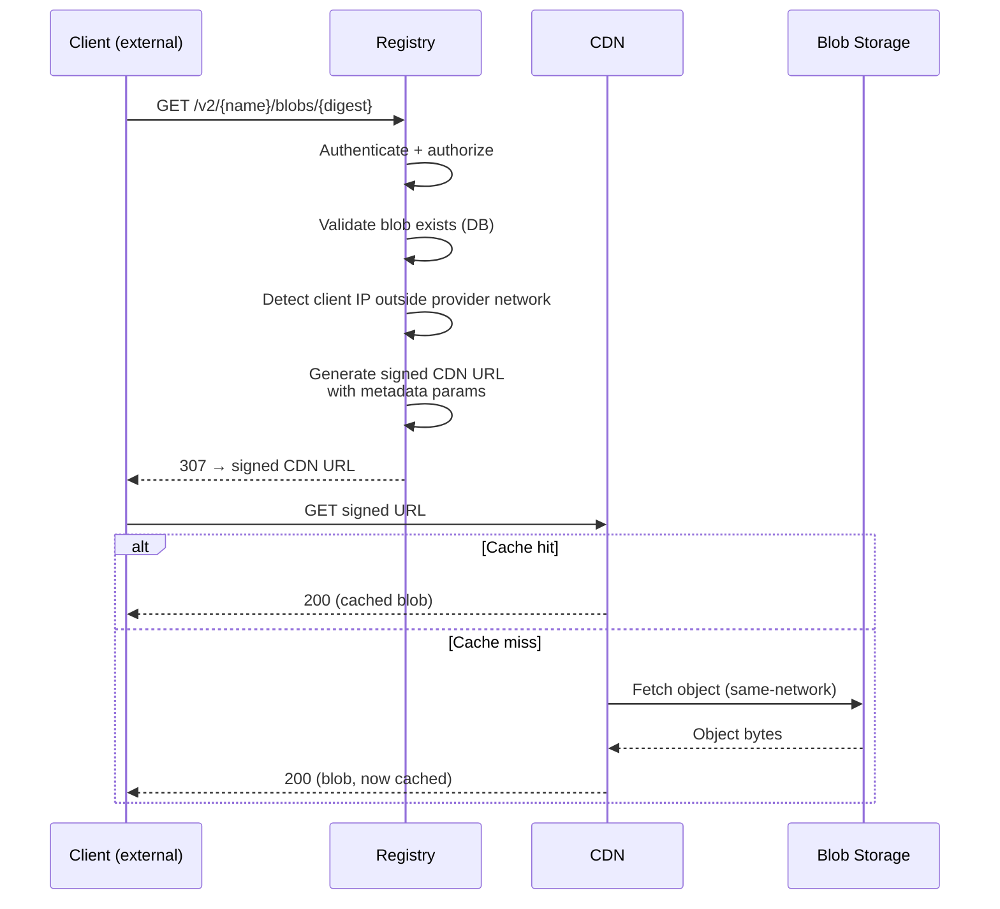
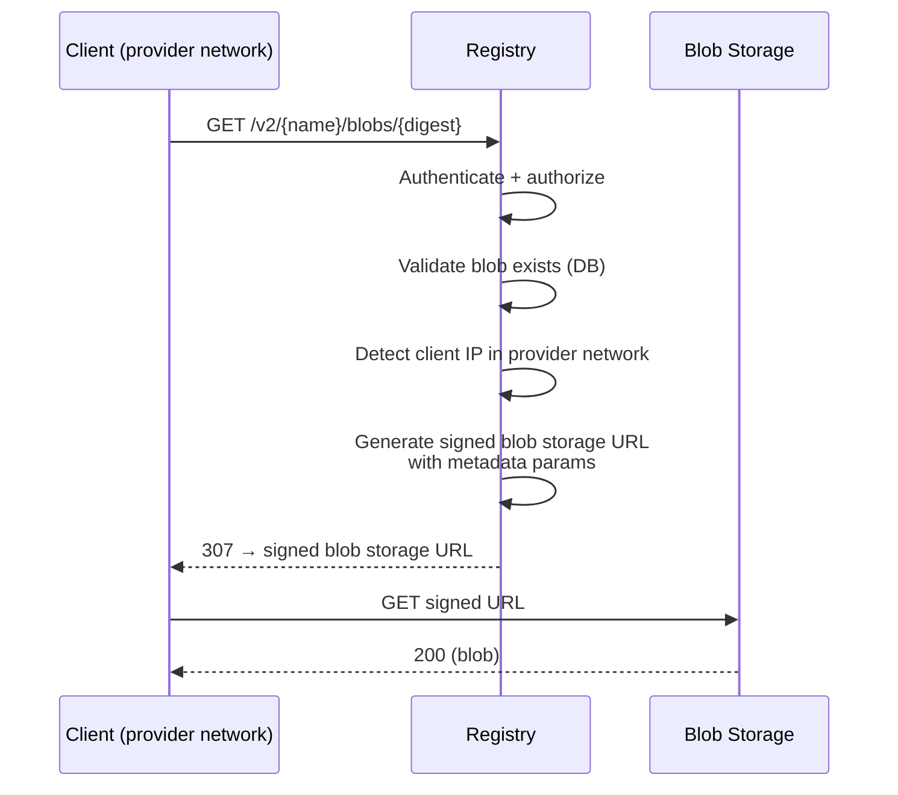
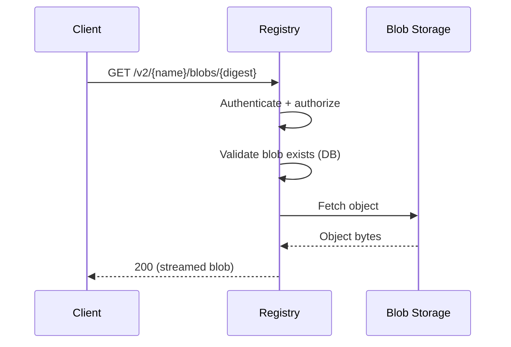

<!-- Design Documents often contain forward-looking statements -->
<!-- vale gitlab.FutureTense = NO -->

## Context

When a client downloads an artifact, the application must interact with the storage backend to serve the content. Depending on the deployment and client network conditions, the application either redirects the client to the storage backend through a pre-signed URL or streams the content directly (see [ADR-005](005_artifact_delivery_mode.md) for the delivery mode decision). Each pattern has different implications for CDN caching, URL signing, cost optimization, and billing attribution.

The Container Registry has operated this architecture on GitLab.com for years, handling tens of petabytes of monthly egress ([source](https://docs.google.com/spreadsheets/d/1mvHXxzRNQ2gVUGHtjluV1FyfXeoGA2KwihHdxbUKI-c/edit)) with a CDN cache hit rate above 85% ([source](https://gitlab.com/gitlab-com/content-sites/handbook/-/merge_requests/17524#note_3023542021)). The Artifact Registry adopts the same architecture.

This ADR formalizes the storage backend interaction as a standalone reference for the Artifact Registry, so the design has a single source of truth independent of the Container Registry's implementation.

## Decision

### Supported pairings

The storage backend and CDN are coupled. The CDN fronts the same provider's blob storage to benefit from same-network cache fills, native signed URL validation, and operational alignment. A supported pairing must satisfy:

- **Native signed URL validation**: the CDN validates signatures at the edge before serving from cache, keeping private blobs private on cache hits.
- **Cache key compatibility**: signing and metadata query parameters must not fragment the cache (that is, different signed URLs for the same blob share a single cache entry).
- **Sufficient max cacheable file size**: container image layers and large artifacts can reach tens of gigabytes. The minimum acceptable limit is 50 GB (the lowest among supported pairings: [CloudFront](https://docs.aws.amazon.com/AmazonCloudFront/latest/DeveloperGuide/cloudfront-limits.html#limits-web-distributions)). Google Cloud CDN supports up to [100 GiB](https://docs.cloud.google.com/cdn/docs/caching#maximum-size).

| Deployment | Blob storage | CDN | Signed URL algorithm |
|---|---|---|---|
| GitLab.com (SaaS) | GCS | Google Cloud CDN | HMAC-SHA1 (CDN), V4 HMAC-SHA256 (blob storage) |
| Dedicated (AWS) | S3 | CloudFront | RSA (CDN), SigV4 HMAC-SHA256 (blob storage) |

Self-managed customers configure whichever pairing matches their infrastructure. Switching between supported pairings is a configuration change.

### Interaction patterns

Three interaction patterns exist between the application and the storage backend. The pattern used depends on the delivery mode ([ADR-005](005_artifact_delivery_mode.md)) and the client's network origin.

#### Redirect, external client → CDN

The application authenticates, validates, and redirects the client to the CDN through a signed URL. The CDN validates the signature, serves from cache on hit, or pulls from blob storage on miss.

#### Redirect, provider-network client → blob storage directly

When the client originates from within the same cloud provider's network, the application can redirect directly to blob storage, bypassing the CDN. This is a cost optimization: same-network egress from blob storage to provider-network clients is cheaper than routing through the CDN. Whether this optimization is worthwhile depends on the pairing; if the gap between CDN and direct blob storage is negligible, the routing adds complexity without benefit.

#### Proxy (CDN bypassed)

In proxy mode ([ADR-005](005_artifact_delivery_mode.md)), the application streams the blob directly from blob storage. The CDN, signed URLs, and metadata propagation described below are all bypassed. The application observes the full transfer.

### Signed URL generation

The application generates signed URLs server-side. When a local private key is available, signing is purely in-process. For GCS without a local key (for example, Workload Identity), signing requires an external IAM call. S3 presigning is always in-process regardless of the credential source. Each pairing uses the CDN provider's native signing mechanism for CDN URLs and the blob storage provider's native signing mechanism for direct URLs. The CDN validates the signature at the edge before serving content, ensuring private blobs remain private on cache hits.

Signed URL expiry is configurable. Signed URLs are cached (for example, in Redis) to reduce signing overhead at high request rates. The cache key is derived from the blob's storage path and request options, excluding expiry (which is unique per request). The cache entry TTL is the URL's remaining validity minus a safety margin.

### Download metadata propagation

After the 307 redirect, the application cannot observe the download. It does not know whether the client completed the transfer, how many bytes were delivered, or whether the request failed.

The application embeds metadata as query parameters in the signed URL at generation time:

| Parameter | Purpose |
|---|---|
| `gitlab-namespace-id` | Billing attribution boundary on the monolith side (top-level group / namespace) |
| `gitlab-ar-namespace-id` | AR namespace ([ADR-001](001_organizations_as_anchor_point.md)) |
| `gitlab-auth-type` | Authentication method (PAT, OIDC, etc.) |
| `gitlab-size-bytes` | Blob size |

These parameters appear in the storage backend's access logs (CDN logs for CDN-served requests, blob storage logs for direct requests), capturing the actual transfer outcome alongside the metadata.

The Container Registry embeds this metadata in GCS + Google Cloud CDN signed URLs today ([prototype](https://gitlab.com/gitlab-org/gitlab/-/work_items/438065)). The Artifact Registry adopts the same approach, adding `gitlab-ar-namespace-id` for AR-specific attribution. Metadata propagation is only relevant for SaaS (GitLab.com), where egress is metered. Dedicated and self-managed deployments do not meter egress, so the S3 + CloudFront pairing does not require it. Processing of these logs for billing attribution is out of scope for this ADR.

Changing the storage backend + CDN pairing affects the entire propagation chain. Not all CDNs preserve custom query parameters in access logs or support edge interception for real-time extraction. Each new pairing requires validation of this capability.

## Consequences

### Positive

1. **Proven architecture**: mirrors the Container Registry, battle-tested at scale on GitLab.com.
1. **All pairing requirements satisfied**: both supported pairings meet the native signed URL validation, cache key compatibility, and max file size requirements defined above.
1. **Billing attribution across the redirect boundary**: metadata-in-URL bridges the visibility gap inherent in redirect mode on SaaS (GCS + Google Cloud CDN).
1. **Configuration-driven pairings**: switching between supported pairings requires no application changes.

### Negative

1. **Coupled pairing**: the CDN is tied to the blob storage provider. In practice this is unlikely to be a limitation, as deployments are typically all-GCP or all-AWS. A cross-provider CDN remains possible if needed (see [Alternative 1](#alternative-1-cross-provider-cdn-for-example-cloudflare)).
1. **CDN delivery cost at scale**: provider-native CDNs charge per-GiB delivery (tiered). At high traffic volumes this may become a significant cost line. A [cost analysis](https://docs.google.com/spreadsheets/d/1mvHXxzRNQ2gVUGHtjluV1FyfXeoGA2KwihHdxbUKI-c/edit) is available for reference.

## Alternatives

### Alternative 1: Cross-provider CDN (for example, Cloudflare)

A single CDN across all blob storage providers, reducing configuration divergence. A [cost analysis](https://docs.google.com/spreadsheets/d/1mvHXxzRNQ2gVUGHtjluV1FyfXeoGA2KwihHdxbUKI-c/edit) at Container Registry scale showed significant potential savings due to Cloudflare's unmetered delivery.

Evaluated in [!19690](https://gitlab.com/gitlab-com/content-sites/handbook/-/merge_requests/19690) (closed). Deferred because Cloudflare requires custom infrastructure for signed URL validation (WAF rule or Worker), manual cache key stripping, and an unvalidated metadata extraction mechanism. Cross-network cache fill costs are materially higher than same-network fills. AR starts from zero traffic, so the savings are not material at MVP.

This alternative is not foreclosed. A cross-provider CDN can be added as a new pairing in the future.

### Alternative 2: No CDN

Redirect downloads directly to blob storage without a CDN layer. Rejected because at any non-trivial traffic volume, the CDN reduces blob storage egress, improves download latency through edge caching, and increases availability.

## References

- [ADR-005: Artifact Delivery Mode](005_artifact_delivery_mode.md)
- [ADR-008: Content-Addressable Storage](008_content_addressable_storage.md)
- [Container Registry Cloud CDN middleware](https://gitlab.com/gitlab-org/container-registry/-/tree/master/registry/storage/driver/middleware/googlecdn) (reference implementation)
- [Container Registry CloudFront middleware](https://gitlab.com/gitlab-org/container-registry/-/tree/master/registry/storage/driver/middleware/cloudfront) (reference implementation)
- [Container Registry URL cache middleware](https://gitlab.com/gitlab-org/container-registry/-/tree/master/registry/storage/driver/middleware/urlcache) (reference implementation)
- [Egress visibility prototype](https://gitlab.com/gitlab-org/gitlab/-/work_items/438065)
- [Cloudflare CDN cost analysis](https://docs.google.com/spreadsheets/d/1mvHXxzRNQ2gVUGHtjluV1FyfXeoGA2KwihHdxbUKI-c/edit)
- [Cloudflare CDN proposal (closed)](https://gitlab.com/gitlab-com/content-sites/handbook/-/merge_requests/19690)
