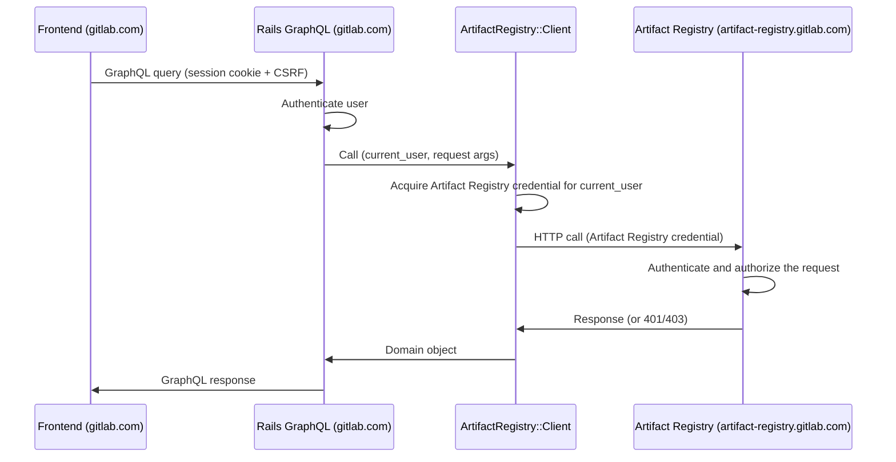

<!-- Design Documents often contain forward-looking statements -->
<!-- vale gitlab.FutureTense = NO -->

## Status

**Proposed.**

## Context

The Artifact Registry runs on a separate domain from the GitLab monolith
(for example, `artifact-registry.gitlab.com` while the monolith is at
`gitlab.com` or `gitlab.acme.com`).

This ADR addresses the browser frontend: the Vue UI that lists
namespaces, browses repositories, displays artifact metadata, and
exposes management actions.

[ADR-009](009_api_design.md) specifies that the Artifact Registry
exposes management APIs. [ADR-022](022_namespace_decoupling.md) defines
how the registry resolves namespaces independently of Rails
identifiers. The authentication mechanism between Rails and the
Artifact Registry follows the [auth agreement](../agreements/auth.md).
This ADR consumes those contracts.

The Artifact Registry is centralized today, with self-managed
deployments planned. Artifact Registry releases on a faster cadence than the Rails
monolith.

## Decision

**Adopt the Rails GraphQL resolver pattern, with a Ruby client in
the Rails monolith talking to Artifact Registry REST API directly.**

Rails resolvers talk to the registry through Ruby methods that map
one-to-one to Artifact Registry REST endpoints, the same way the
Container Registry's `lib/container_registry/client.rb` does.

### Authentication and request flow

The browser sends GraphQL queries and mutations to `/api/graphql`,
authenticated by the session cookie and CSRF token. The browser stays
same-origin; the Artifact Registry credential is acquired and held server-side by the
Ruby client and never reaches the browser.

The Ruby client handles authentication on its own. Given the current
Rails user, the client performs the token exchange and attaches the
resulting credential to the request. Artifact Registry's own authentication and
authorization middlewares validate the request.

### Cross-service data joining

The Artifact Registry stores GitLab identifiers, not the data they
point to. When a user creates, updates, or publishes something, Artifact Registry
records the user's ID; related projects and commits are stored as
references too. The actual names, avatars, profile links, project
metadata, and commit details all live in the Rails database. Most
user-facing Artifact Registry views need at least one of those, so the join from
Artifact Registry's identifiers to Rails entities runs on every user-facing read.

Rails does the join itself. For each kind of reference, a resolver
uses `BatchLoader::GraphQL` to fetch records by ID, reusing the
existing `Types::UserType`, `Types::ProjectType`, and
`Types::CommitType`. The pattern is used elsewhere in the monolith;
see `app/graphql/types/container_registry/container_repository_type.rb`
for live examples. However many records are on the page, the view
costs one Artifact Registry call plus one Rails query per referenced type.

This holds no matter how Artifact Registry ships, what its compatibility policy is,
or how it's deployed. It comes from Artifact Registry's choice to keep identifiers
rather than copy user, project, and commit data into Artifact Registry.

### API contract

GraphQL is the surface for browser-driven reads and mutations,
matching Container Registry. Each Artifact Registry resource has a matching Rails
GraphQL type: Namespace, Repository, Artifact, Tag, and Version. The
resolver derives the target resource identifier from arguments such
as `namespacePath` and `repositoryPath`. Resolvers map Artifact Registry
authorization failures to a not-available error and transport
failures to a service-unavailable error, matching the Container
Registry resolvers.

### Rails-side components

Three Rails-side components, each with a Container Registry analogue:

| Component | Path | Container Registry analogue |
|---|---|---|
| HTTP client | `lib/artifact_registry/client.rb` | `lib/container_registry/client.rb` |
| GraphQL types and resolvers | `app/graphql/types/artifact_registry/`, `app/graphql/resolvers/artifact_registry/` | `app/graphql/types/container_registry/`, `app/graphql/resolvers/container_repositories_resolver.rb` |
| Vue entry | `app/assets/javascripts/packages_and_registries/artifact_registry/` | `app/assets/javascripts/packages_and_registries/container_registry/explorer/` |

Rails persists the organization-to-namespace mapping as the namespace
UUID, written at namespace creation ([gitlab#603023](https://gitlab.com/gitlab-org/gitlab/-/work_items/603023)),
and resolves the slug and namespace status from the Artifact Registry,
caching both ([ADR-022](022_namespace_decoupling.md#slug-discovery)).
The client and the navigation gating (whether registry entries appear
for an organization) read from this persisted mapping and its cached slug/status instead of
calling the Artifact Registry on every page load.

The Rails-side credential acquisition follows the
[auth agreement](../agreements/auth.md); the specific service and
exchange protocol are open (see [Open Questions](#open-questions)).

Resolvers get the client through a cached helper on the loaded
resource (the same pattern as `ContainerRepository#registry`). Child
fields that fan out per parent use the same batched-lookup pattern
described in [Cross-service data joining](#cross-service-data-joining),
collapsing N parent resolutions into one Artifact Registry call per child field.

## Consequences

### Positive

1. **Reuses existing frontend infrastructure.** Session cookies,
   CSRF, axios defaults, the Apollo client, feature flags, and the
   error handling that's already in place all work as-is. It's the
   same pattern the Container Registry and Orbit (GKG) UIs use.
2. **Cross-service joins are cheaper.** Rails fetches the user,
   project, and commit data with existing GraphQL types and batches
   the lookups within a single request, so we avoid the extra
   round-trips and the merge code in the frontend that a
   frontend-side join would need. Batching on Artifact Registry's side is a
   separate question that depends on Artifact Registry's REST API (see Negative
   #3).
3. **Server-side authentication.** The Ruby client handles the token
   exchange from the Rails session identity.

### Negative

1. **Resolver surface scales with Artifact Registry's API.** Every Artifact Registry endpoint the
   frontend consumes needs a Rails GraphQL resolver.
2. **Domain model expressed twice.** Artifact Registry's domain is described in its
   own contract and again in Rails GraphQL types; drift is possible.
   Contract testing can mitigate this.
3. **Artifact Registry's API design is constrained.** The N+1 mitigation depends on
   Artifact Registry exposing bulk reads at every collection boundary the frontend
   renders.
4. **Additional latency.** Each request requires two network hops:
   Frontend to Rails, then Rails to Artifact Registry. This could be
   mitigated connecting the GraphQL calls to a gRPC endpoint instead of REST API.
   This could work when both services are co-located in the
   same platform (.com <-> .com for example). This involves Artifact Registry exposing
   gRPC which is additional work to do.
5. **Frontend release cadence is tied to Rails.** The frontend ships
   with the Rails monolith, so new Artifact Registry-facing features reach users
   only when their installation picks up the matching Rails release.
   Dedicated installations run on m-2, so Dedicated users see new Artifact Registry
   UI roughly two milestones after they're available on GitLab.com.

## Alternatives

### Alternative 1: Thin pass-through proxy

Rails would expose `/-/artifact_registry/proxy/graphql`, forward raw
GraphQL bodies to Artifact Registry, and attach a Rails-signed JWT. CustomersDot uses
this shape at `ee/app/controllers/customers_dot/proxy_controller.rb`.

**Pros:**

- Less Rails code; no per-resolver work.
- Artifact Registry's schema flows through directly. New fields show up in the
  frontend without a Rails change. Artifact Registry's additive-only commitment
  plus its faster release cadence keep schema drift away from the
  browser.

**Cons:**

- Cross-service joins move to the frontend: Artifact Registry stores GitLab
  identifiers rather than the underlying user, project, and commit
  data.
- Two sequential round trips per user-attributed view, plus a merge
  utility duplicated across many Vue components.
- Frontend depends on Artifact Registry's schema directly; no Rails-side error
  buffer.
- Introduces a second GraphQL endpoint in the frontend.
- Artifact Registry needs to implement an additional API: GraphQL. That's
  additional work to do on Artifact Registry.

**Why rejected:**

- The cross-service join becomes a frontend problem with no clean
  implementation path. Every user-attributed view costs an extra
  Rails round trip and a merge utility on the FE side.
- The duplication of merge logic across Vue components scales poorly
  with the frontend surface area.

### Alternative 2: GraphQL schema stitching

Rails uses a schema-stitching gateway to compose `GitlabSchema` with
the Artifact Registry's GraphQL schema into a unified supergraph at
`/api/graphql`. The stitching gem runs inside Rails; requests for Artifact Registry
types route to the Go service over HTTP, other queries stay with
`GitlabSchema`. A POC implementation using the `graphql-stitching`
gem exists at [gitlab-org/gitlab!227224](https://gitlab.com/gitlab-org/gitlab/-/merge_requests/227224).

**Pros:**

- One GraphQL endpoint for the frontend (same as the chosen pattern).
- Artifact Registry's schema is consumed directly. Rails doesn't need a resolver
  for each Artifact Registry field, and new fields reach the frontend without a
  Rails MR once the gateway reloads its schema.
- Cross-service joins are expressed declaratively: Artifact Registry's SDL declares
  cross-service references (for example, `Repository.createdBy: User`),
  Rails declares it can resolve `User` by `id`, and the stitching
  gem plans the cross-service fetch and batching automatically.

**Cons:**

- Artifact Registry needs to implement an additional API: GraphQL. That's
  additional work to do on Artifact Registry.
- Adds the `graphql-stitching` gem and a schema composition pipeline
  to the monolith.
- Rails has to either sync Artifact Registry's SDL into the monolith repo
  (cross-repo coordination on every schema change) or introspect Artifact Registry
  at boot (Rails startup and its public GraphQL surface tied to Artifact Registry's
  deploy cadence).
- Each Rails entity type Artifact Registry references needs a boundary resolver on
  the Rails side and a `@key` declaration on the Artifact Registry side.

**Why rejected:**

- Adds gateway infrastructure without a clear advantage over the
  resolver pattern.
- Rails-side schema integration adds either a cross-repo SDL sync or
  a startup dependency on Artifact Registry.

### Alternative 3: Direct cross-domain with a browser-held credential

The frontend talks to Artifact Registry cross-origin, carrying its own credential to
Artifact Registry. Two variants that exist in the monolith were considered:
an identity-token bearer credential (the frontend obtains an identity
token, holds it in memory, and sends it as `Authorization: Bearer`
directly to Artifact Registry) and an encrypted session cookie (Rails sets an encrypted
cookie scoped to the Artifact Registry subdomain, similar to `KasCookie` in
`app/controllers/concerns/kas_cookie.rb`, which the browser sends on
cross-origin requests).

**Pros:**

- Artifact Registry serves the frontend directly; no per-resolver Rails work.

**Cons:**

- Cross-service join still falls to the frontend (same shape as
  Alternative 1).
- The browser crosses origin to Artifact Registry, so Artifact Registry must serve CORS for the
  monolith origin. The identity-token variant requires preflight for
  `Authorization`-bearing requests; the cookie variant requires
  `Access-Control-Allow-Credentials: true`, an explicit origin
  allowlist (no wildcards), and `SameSite=None; Secure` cookies.
- Identity-token variant: the credential lifecycle moves into
  JavaScript (acquisition, in-memory storage, expiration handling,
  refresh on 401, SPA navigation), and the double-exchange flow on
  cache misses (FE → Artifact Registry → Rails → Artifact Registry) is slower than a single
  FE → Rails → Artifact Registry call.
- Cookie variant: KAS uses the pattern for a long-lived WebSocket
  where one handshake amortizes across the connection lifetime; Artifact Registry
  exchanges are many short-lived REST calls, each requiring cookie
  re-validation. Reproducing Rails cookie encryption and key rotation
  in Go conflicts with the JWT-based auth direction in the
  [auth agreement](../agreements/auth.md). Artifact Registry's authorization model is
  built around scoped JWTs with role enforcement; cookie auth would
  require a parallel authorization path inside Artifact Registry. The cookie domain
  would have to be scoped to a parent that includes both `gitlab.com`
  and `artifact-registry.gitlab.com` and potentially work with
  self-managed instances.

**Why rejected:**

- Leaves the cross-service join unsolved.
- Each variant adds a browser-side credential surface (a JS-held
  identity token or a parent-scoped encrypted cookie) and a parallel
  auth path inside Artifact Registry.

### Alternative 4: Iframe embed with `postMessage` credential delivery

The Artifact Registry serves a UI as an iframe with credentials passed
via `postMessage` at load time, similar to
`app/assets/javascripts/observability/utils/auth_manager.js`.

**Pros:**

- Lets Artifact registry service own its full UI.
- Decouples Rails instance versions from Artifact Registry versions: a new Artifact Registry
  backend feature with its UI reaches SaaS, Dedicated, and
  Self-Managed setups as soon as Artifact Registry ships, without waiting for a
  Rails release.

**Cons:**

- The iframe runs at Artifact Registry's origin and has no direct path to Rails
  (CORS plus no session sharing). The cross-service join has to
  happen either through `postMessage` requests back to the parent for
  user, project, and commit data, or it would need to be stored in
  Artifact Registry and kept in sync with Rails.
- Iframe communication breaks deep linking, browser-shell navigation,
  and accessibility patterns the GitLab monolith expects of in-shell
  views.

**Why rejected:**

- Cross-service join and CORS. The `postMessage` path costs the same
  as Alternative 3; the storage-and-sync alternative adds PII
  duplication, sync infrastructure, and GDPR-removal complications.
- Iframe-specific UX limitations apply across all in-shell views.

## Open questions

1. For self-managed deployments, how is the Artifact Registry endpoint
   URL surfaced to Rails? Possible mechanisms include a `gitlab.yml`
   config key or an Admin UI setting. Who owns the configuration
   contract between Rails and Artifact Registry for self-managed operators?
2. The token exchange between Rails and Artifact Registry is committed at the
   [auth agreement](../agreements/auth.md) level, but the credential
   format, claim shape, and minting service are not yet specified.
   The Ruby client's credential acquisition step depends on those
   decisions and is deliberately left abstract in this ADR.
3. The per-element shape and pagination shape (cursor format,
   page-size limits) for Artifact Registry list endpoints are not yet
   specified in ADR-009. The N+1 mitigation in this ADR depends on list
   endpoints returning enough per-element data to render list views
   without per-element follow-up calls.

## Future work

When the GitLab Adaptive Trust Environment is finalized, the Rails-side
credential acquisition migrates to it. The frontend pattern in this ADR
carries over unchanged.

If a future product requirement establishes browser-side direct Artifact Registry
access (for example, signed-URL artifact uploads from the browser), it
warrants a follow-up ADR addressing CORS, credential lifecycle, and
the specific resources in scope.

## References

- [ADR-009: API Design](009_api_design.md)
- [ADR-022: Namespace Decoupling](022_namespace_decoupling.md)
- [Auth agreement](../agreements/auth.md)
- Container Registry frontend: `app/assets/javascripts/packages_and_registries/container_registry/explorer/`
- Container Registry resolvers: `app/graphql/resolvers/container_repositories_resolver.rb`, `app/graphql/resolvers/container_repository_tags_resolver.rb`
- Container Registry auth service: `app/services/auth/container_registry_authentication_service.rb`
- Container Registry Ruby client: `lib/container_registry/client.rb`, `lib/container_registry/gitlab_api_client.rb`
- KAS cookie pattern: `app/controllers/concerns/kas_cookie.rb`
- CustomersDot proxy: `ee/app/controllers/customers_dot/proxy_controller.rb`, `ee/app/assets/javascripts/lib/customers_dot_graphql.js`
- GitLab Observability iframe and postMessage auth: `app/assets/javascripts/observability/utils/auth_manager.js`
- GraphQL schema stitching draft: [gitlab-org/gitlab!227224](https://gitlab.com/gitlab-org/gitlab/-/merge_requests/227224)
