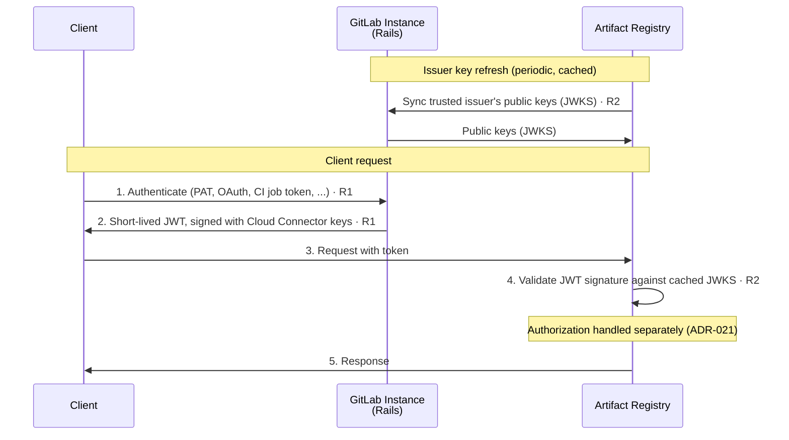

<!-- Design Documents often contain forward-looking statements -->
<!-- vale gitlab.FutureTense = NO -->

## Status

**Proposed**

This ADR covers **authentication** only — how a caller's identity is established. **Authorization** (roles, policy evaluation, role assignments) is covered separately by ADR-021: Authorization.
<!-- TODO: link to ADR-021 once merged — https://gitlab.com/gitlab-com/content-sites/handbook/-/merge_requests/18717 -->

## Context

Clients authenticate to the Artifact Registry with short-lived tokens issued by their GitLab Rails instance through a dedicated API endpoint. The Artifact Registry validates these tokens locally and is not involved in issuing them.

The contract with the Auth Platform team is the [Artifact Registry and Auth Platform interface agreement](../agreements/auth.md), which defines what the Artifact Registry requires across six requirements (R1–R6). This ADR consumes its authentication requirements — R1 (token exchange), R2 (token validation), and R3 (token payload).

## Decision

**The Artifact Registry authenticates clients by locally validating short-lived tokens issued by GitLab Rails through a dedicated token-exchange API endpoint.**

### Iteration scope

The first iteration targets same-boundary topologies (`.com ↔ .com`, `SM ↔ SM`), where a single instance has a single trust anchor: Rails signs the token with the Cloud Connector v1 key, and `gitlab_instance_uid` is omitted from the payload. The cross-boundary topology (multiple Self-Managed instances sharing one SaaS Artifact Registry) is a follow-up iteration.

## Architectural constraint

One constraint from the [interface agreement](../agreements/auth.md#no-callbacks-during-request-processing) shapes this decision:

**No callbacks during request processing.** The Artifact Registry never calls back to the GitLab instance, Rails, or any remote service **while processing a request**. It does have one remote dependency — the periodic, out-of-band sync of its trusted issuer's public keys (see [Token validation](#token-validation-r2)) — but that happens outside request handling, not per request. This matters most in cross-boundary setups — a Self-Managed instance connecting to a SaaS Artifact Registry — where that instance may be unreachable due to network conditions (firewalls, air-gapped environments). Everything needed to verify a request token MUST be in the token itself or already cached locally. This is what makes local, stateless validation a hard requirement rather than an optimization.

## Authentication flow

The token is issued by Rails (R1) and validated locally by the Artifact Registry against its trusted issuer's public keys, which it syncs periodically and caches (R2). The diagram below shows the first-iteration flow; authorization steps (role lookup, policy evaluation) are out of scope here — see ADR-021.



**Legend:**

| Step | Description |
|------|-------------|
| **Issuer key refresh** | The Artifact Registry syncs its pre-configured trusted issuer's public keys (JWKS) and caches them. This is the only remote dependency, and it happens out of band — never during request processing. |
| **1-2** | The client obtains a short-lived JWT from its GitLab instance directly (not through the Artifact Registry). The Artifact Registry never sees the client's long-lived credentials. |
| **3-5** | The client presents the token to the Artifact Registry, which validates the signature against its cached JWKS and serves the response. No callback to Rails occurs. |

## Token issuance (R1)

Rails exposes a dedicated token-exchange API endpoint that accepts client credentials and returns a short-lived token usable against the Artifact Registry.

1. **Supported credential types.** The endpoint authenticates the caller with standard GitLab API credentials, each of which resolves to a `User`: personal access tokens (legacy or granular), OAuth tokens, CI job tokens, and project/group access tokens. **Deploy tokens are not supported in the first iteration**: a deploy token is not a `User`, the only principal type the first iteration issues tokens for. The typed `sub` claim (see [Token payload](#token-payload-r3)) is designed to admit other principal types later, so deploy tokens — listed as an [R1](../agreements/auth.md#r1--token-exchange-service) target — are tracked as a follow-up.
1. **Client-side exchange.** The token exchange happens client-side: the client obtains the token from its GitLab instance and presents it to the Artifact Registry — the Artifact Registry never performs the exchange. The endpoint can be driven by `curl`, the `glab` CLI, or automatically by CI jobs. Because the token is short-lived, native package tooling that expects a static credential (for example Maven's `settings.xml` or npm's `.npmrc`) needs helper tooling to fetch and refresh it; the client-tooling design across Docker, Maven, and npm is tracked in the [client credential management work item](https://gitlab.com/gitlab-org/gitlab/-/work_items/595150).
1. **Token duration.** Tokens have a 5-minute default lifetime and a 12-hour maximum. A client may request a shorter lifetime; client-requestable TTL requires AppSec sign-off ([token-exchange TTL decision](https://gitlab.com/gitlab-org/gitlab/-/work_items/601469)). The bounds follow industry precedent for delegated-auth registries, documented in the [client credential management work item](https://gitlab.com/gitlab-org/gitlab/-/work_items/595150), so long as Maven/Gradle builds do not expire mid-flight.
1. **Enablement enforcement.** Token exchange should fail for organizations that have not enabled the Artifact Registry (R1, a SHOULD). This is an availability gate only; per-repository authorization stays with the Artifact Registry. The check runs at token issuance on the Rails side, which owns the organization-level enablement setting. Access does not rely on Unit Primitives or add-ons: an earlier revision gated issuance on the `:access_artifact_registry_service` ability backed by an add-on purchase, removed in [gitlab!243285](https://gitlab.com/gitlab-org/gitlab/-/merge_requests/243285) because no Artifact Registry add-on exists under the credit-based billing model. On its side, the Artifact Registry enforces access at the namespace level: the token's `gitlab_organization_id` claim must match the `entity_id` of the namespace's owner anchor ([ADR-001](001_organizations_as_anchor_point.md)), an opaque comparison that requires no organization awareness, and authorization is closed by default (ADR-021). Enablement gates token *issuance* rather than evaluating a permission, so it is recorded here rather than in [ADR-021](https://gitlab.com/gitlab-com/content-sites/handbook/-/blob/76d98101c0f0a379cc121196052d7d2dd2c18e60/content/handbook/engineering/architecture/design-documents/artifact_registry/decisions/021_authorization.md).

## Token validation (R2)

The token is a JWT signed with the GitLab instance's existing Cloud Connector keys (`CloudConnector::Keys`). The Artifact Registry is configured at startup with a **trusted issuer** (its GitLab instance) and syncs that issuer's public keys (JWKS) out of band. It validates each incoming token's signature against those pre-fetched keys. The validator also pins the signature algorithm and rejects tokens with the wrong audience or a past `exp`.

Key caching and refresh follow the existing Cloud Connector approach (per [R2](../agreements/auth.md#r2--token-validation)): keys are cached and refreshed periodically, and a stale key is retained briefly if a refresh fails, so a key-provider blip does not reject otherwise-valid tokens.

Reusing Cloud Connector v1 machinery keeps the first iteration simple: no new key-distribution infrastructure is required. The target state moves key serving to GATE, but the Artifact Registry-side action — verify the signature against cached trusted keys — is unchanged.

## Token payload (R3)

The token carries enough information to authenticate the request without callbacks. The authentication-relevant claims are:

```json
{
  "jti": "5d250d2f-0e6c-4f7d-987b-222973bfb6af",
  "iss": "https://gitlab.example.com",
  "aud": ["gitlab-artifact-registry"],
  "sub": "gid://gitlab/User/42",
  "iat": 1779870540,
  "nbf": 1779870540,
  "exp": 1779870840,
  "gitlab_realm": "saas",
  "gitlab_organization_id": 1
}
```

1. `sub` — the principal identity (R3), expressed as a GitLab GlobalID (for example `gid://gitlab/User/42`) rather than a bare numeric ID. Encoding the principal *type* in the value keeps it unambiguous and lets the claim extend to non-`User` principals (for example deploy tokens) without changing its meaning.
1. `iss` — the issuing instance's OIDC issuer URL. It is informational only (logged); the Artifact Registry does **not** use it to select verification keys (see [Token validation](#token-validation-r2)).
1. `aud` — `gitlab-artifact-registry`, scoping the token to the Artifact Registry.
1. `gitlab_organization_id` — organization context (R3 SHOULD); `gitlab_realm` is `saas` or `self-managed`.
1. `jti`, `iat`, `nbf`, `exp` — standard JWT claims; `exp = iat + ttl`.
1. `gitlab_instance_uid` is **omitted for now**. In the same-boundary topologies of the first iteration there is a single trust anchor, so an instance identifier is not needed; it becomes relevant only for the cross-boundary follow-up.
1. **Role and other authorization-bearing claims are described in ADR-021, not here.** The Artifact Registry uses this token to establish *who* the caller is; *what they may do* is evaluated separately. Whether authorization must also consider the *source credential type* (for example a PAT versus a CI job token) is likewise an ADR-021 concern.
<!-- TODO: link to ADR-021 once merged — https://gitlab.com/gitlab-com/content-sites/handbook/-/merge_requests/18717 -->

## Alternatives considered

This ADR does not weigh alternative authentication architectures. The Artifact Registry-side design follows from the [Artifact Registry and Auth Platform interface agreement](../agreements/auth.md): the Artifact Registry consumes the R1–R3 requirements, and the mechanism is driven by the Authentication team's decisions on how to implement them. Alternatives were evaluated on the platform side (see the [authentication and authorization direction for the modular service model](https://gitlab.com/gitlab-org/gitlab/-/work_items/595148)) and are out of scope here.

## Consequences

### Positive

1. **Independent of Rails availability during request processing**: because validation is local and stateless, the Artifact Registry can authenticate requests even when the originating GitLab instance is unreachable.
1. **Short-lived tokens limit blast radius**: the Artifact Registry never handles the client's long-lived GitLab credentials, only short-lived tokens — so a leaked token expires quickly and exposes far less than a leaked long-lived credential such as a PAT.
1. **Aligned with platform direction**: the Artifact Registry consumes the platform's token-exchange and validation primitives rather than maintaining a bespoke flow, per the [authentication and authorization direction for the modular service model](https://gitlab.com/gitlab-org/gitlab/-/work_items/595148).

### Negative

1. **Interim requires a callback to the GitLab instance**: to validate tokens the Artifact Registry must sync issuer keys from the GitLab instance's OIDC endpoint (out of band, not per request). The end-state goal is for the Artifact Registry to depend on no GitLab-instance connectivity at all; the target state achieves this by serving keys from GATE.
1. **Reuses Cloud Connector v1 machinery**: the interim relies on the existing Cloud Connector v1 keys and OIDC endpoint rather than target GATE-issued keys.
1. **Issued tokens cannot be revoked before expiry**: because validation is local with no callback or blocklist, a token stays valid until `exp` even if the originating credential is revoked moments after issuance (for example a phished PAT exchanged for a 12-hour token). This is mitigated by the short *default* TTL and is an accepted trade-off for the beta; stronger sender binding (such as DPoP) and key rotation are possible future hardening.

### Mitigations

- The Artifact Registry-side validation logic is identical across the interim and target issuers — only the issuer-key source changes — which limits the blast radius of the migration.

## Future work / open debates

These are unresolved authentication questions, out of scope for the first iteration but recorded so they are not lost. Most cluster around the cross-boundary follow-up and the target (GATE) state.

1. **GATE deployment topology.** In the target state the issuer keys are served by GATE rather than the issuing instance's own OIDC/JWKS endpoint. Depending on how GATE is deployed, the Artifact Registry fetches the issuer key from the corresponding GATE component. The deployment topology is not yet finalized.
1. **Cross-boundary issuer key and `gitlab_instance_uid`.** The first iteration omits `gitlab_instance_uid` because there is a single trust anchor. The cross-boundary follow-up has many Self-Managed instances behind one trust anchor, so a token must identify its issuing instance. Reintroducing `gitlab_instance_uid` (or an equivalent) and the resulting change to the validation model are open. The CI-specific case — automatic `CI_JOB_TOKEN` exchange for remote runners connecting to a SaaS Artifact Registry — falls under this follow-up and is tracked in the [CI_JOB_TOKEN exchange for remote runners work item](https://gitlab.com/gitlab-org/gitlab/-/work_items/599087).

## References

1. [ADR-001: Organizations as Anchor Point](001_organizations_as_anchor_point.md)
1. ADR-021: Authorization — companion ADR for authorization
<!-- TODO: link to ADR-021 once merged — https://gitlab.com/gitlab-com/content-sites/handbook/-/merge_requests/18717 -->
1. [ADR-022: Namespace Decoupling](022_namespace_decoupling.md)
1. [Artifact Registry and Auth Platform interface agreement](../agreements/auth.md) — the R1–R3 (authentication) requirements consumed here
1. [Authentication and authorization direction work item](https://gitlab.com/gitlab-org/gitlab/-/work_items/595148)
1. [Client credential management for remote artifact clients](https://gitlab.com/gitlab-org/gitlab/-/work_items/595150)
1. [Token-exchange endpoint work item](https://gitlab.com/gitlab-org/gitlab/-/work_items/601475)
1. [GATE identity federation design doc (cross-boundary auth)](https://gitlab.com/gitlab-org/architecture/auth-architecture/design-doc/-/blob/main/decisions/019-gate-identity-federation.md)
1. [RFC 2119](https://www.rfc-editor.org/rfc/rfc2119) — requirement-level keywords used in the interface agreement
1. [OCI Distribution Spec - Authentication](https://github.com/opencontainers/distribution-spec/blob/main/spec.md#authentication)
1. [Container Registry Token Authentication](https://docs.docker.com/registry/spec/auth/token/)
