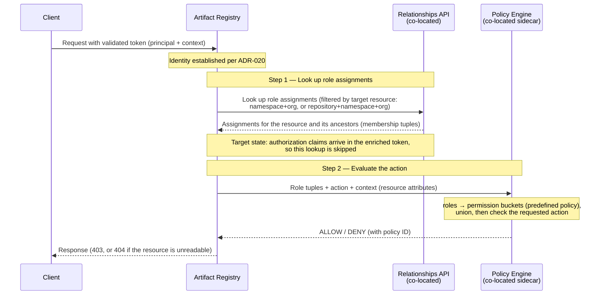

<!-- Design Documents often contain forward-looking statements -->
<!-- vale gitlab.FutureTense = NO -->

## Status

**Proposed**

This ADR covers **authorization** only — what an authenticated caller may do. **Authentication** (how the caller's identity is established, and how the token is issued and validated) is covered separately by [ADR-020: Authentication Flow](020_authentication_flow.md).

## Context

The Artifact Registry runs on a satellite service separate from the GitLab Rails monolith. [ADR-020](020_authentication_flow.md) establishes how a caller's identity is established: the client presents a short-lived token that the Artifact Registry validates locally, and the Artifact Registry never calls back to the GitLab instance during request processing.

This ADR addresses the next question: **what can that caller do?**

The contract with the Auth Platform team is the [Artifact Registry and Auth Platform interface agreement](../agreements/auth.md), which defines what the Artifact Registry requires across six requirements (R1–R6). ADR-020 consumes the authentication requirements (R1–R3). This ADR consumes the authorization requirements: **R4 (policy evaluation engine)**, **R5 (relationships API)**, and **R6 (bootstrapping)**.

### The permission model

To grant or deny an operation, the Artifact Registry evaluates three parts:

- **Principal**: the authenticated user or token holder, established by [ADR-020](020_authentication_flow.md). It is identified by the token's `sub` claim; the token payload shape is described in [ADR-020](020_authentication_flow.md#token-payload-r3). Every credential type (personal, OAuth, CI job, group, or project access token) resolves to the same `User` principal, so **closed beta authorizes by principal alone, independent of which credential was used**. A leaked CI job token therefore carries the user's full permissions; this is a deliberate trade-off for closed beta (tokens are short-lived by default — see [ADR-020](020_authentication_flow.md)). Differentiating authorization by credential type is an [open question](#open-questions).
- **Operation**: there are two types — repository management operations and artifact operations. [ADR-009](009_api_design.md) describes them in detail.
- **Resource**: resources live at two levels — the namespace (the registry as a whole; see [ADR-022](022_namespace_decoupling.md)) or an individual repository. Roles are assigned at these levels (see [Role assignment](#role-assignment)); the namespace maps one-to-one to the organization in closed beta.

The Artifact Registry uses a **roles and permissions** model:

- **Roles** define _who the principal is_ in the context of a resource. A principal is assigned a role through the [relationships API](#role-assignment) (R5). In closed beta the Artifact Registry fetches these role assignments and the policy engine resolves the effective permissions from them; in the target state, the authorization claims arrive in an enriched token.
- **Permissions** define _what the principal can do_. Each role maps to a fixed set of permissions (a "permission bucket"), defined by the [built-in defaults](#default-permission-buckets).

An operation is granted when the required permission is present in the principal's effective permission set.

For example:

- **Management operation**: creating a repository requires the `create_repository` permission, held by the Artifact Admin role.
- **Artifact operation**: publishing an artifact requires the `create_artifact` permission, held by the Artifact Contributor, Artifact Manager, and Artifact Admin roles.

In closed beta these role-to-permission mappings are fixed. A later iteration adds [access rules](#access-rules) that can tighten the artifact permissions (for example, removing Artifact Contributor from the roles allowed to publish to a production repository).

### Constraints

Three constraints shape the decision:

- **Closed-by-default.** Membership in the organization (or its groups and projects) does not grant any Artifact Registry access. A principal has no permissions until an Artifact Registry role is explicitly assigned. This is a deliberate move to secure-by-default, aligned with the cross-team direction in the [roles management work item](https://gitlab.com/gitlab-org/gitlab/-/work_items/593455).
- **No inheritance from platform membership.** Top-level group and project roles do not map to Artifact Registry roles. Artifact Registry roles are a distinct, product-specific concept and are assigned independently.
- **No callbacks to the GitLab instance during request processing.** Everything needed to authorize a request must be available without reaching the GitLab instance, which may be unreachable. The constraint targets _that instance_ — not the Artifact Registry's co-located dependencies: the relationships API and the GLAZ policy-engine sidecar, deployed alongside it and always reachable. In closed beta the Artifact Registry calls both on each request — the relationships API to resolve roles, the sidecar to evaluate them — which is permitted because they are co-located (see the [interface agreement](../agreements/auth.md#no-callbacks-during-request-processing)). If a dependency is unavailable, authorization fails closed, though the fail-open/fail-closed policy is still an [open question](#open-questions).

## Decision

**Define product-specific Artifact Registry roles. Assign them to the namespace and to individual repositories through the auth platform's relationships API. Evaluate permissions through the co-located policy evaluation engine (GLAZ, a sidecar) using built-in role-to-permission defaults. Access is closed-by-default; Organization Administrators are bootstrapped with full access.**

In closed beta, authorization uses two mechanisms:

1. **Namespace role assignment** ([details](#role-assignment)) — a principal is assigned a role on the namespace, granting a baseline set of permissions that inherits to every repository in the registry.
2. **Additive repository override** ([details](#role-assignment)) — a principal can be assigned an additional role on an individual repository, adding its permissions there. Overrides are additive in closed beta; reducing access on a specific repository is [deferred](#reductive-repository-overrides).

This separates concerns cleanly. The auth platform stores role assignments (relationships) and provides the policy evaluation engine. The Artifact Registry owns the role definitions and the permission model, and drives every decision through the co-located engine.

### Roles

The Artifact Registry defines four product-specific roles, scoped to the Artifact Registry and distinct from platform roles:

| Role | Intended for |
|---|---|
| **Artifact Viewer** | Consumers who pull artifacts and browse the registry. |
| **Artifact Contributor** | Producers who also publish artifacts (for example, CI jobs). |
| **Artifact Manager** | Repository owners who manage artifacts and repository configuration. |
| **Artifact Admin** | Registry administrators who manage registry-wide configuration and access. |

These are **user roles**, distinct from the platform **user types** (for example, Organization Administrator or Organization Member). A user type does not imply any Artifact Registry role; the two are assigned independently. See the [roles management work item](https://gitlab.com/gitlab-org/gitlab/-/work_items/593455) for the cross-team alignment behind this distinction.

A principal with no assigned role has no access to private repositories (closed-by-default). Public repositories remain readable without an assignment — see [Repository visibility](#repository-visibility).

Organization Administrators are **bootstrapped** with full access equivalent to Artifact Admin (R6). They hold an organization-level owner relationship — a tuple binding the owner to the organization — maintained continuously as ownership changes ([owner role assignments work item](https://gitlab.com/gitlab-org/gitlab/-/work_items/601665)); the policy engine treats that tuple as implicit access to the organization's Artifact Registry namespace and every repository under it. The grant is implicit and irrevocable — it cannot be revoked or downgraded while they remain an owner. Because it flows through ordinary relationship records evaluated like any other assignment, it needs no special-case handling in the Artifact Registry. This guarantees that at activation, before any assignments exist, an Organization Administrator can create repositories and assign roles to other users.

Custom roles are out of scope for closed beta; see [Custom roles](#custom-roles).

### Permissions

The Artifact Registry defines a fixed set of permissions:

| Permission | Description | Operation type |
|---|---|---|
| `read_artifact` | Browse and download artifacts (files, blobs, manifests, tags) | Artifact operations (client APIs) |
| `create_artifact` | Publish an artifact (Docker push, Maven deploy, npm publish), including re-publishing where the protocol permits it | Artifact operations (client APIs) |
| `delete_artifact` | Delete artifacts (images, packages, versions, tags, files) | Artifact operations (client APIs) |
| `read_repository` | List and view repositories, statistics, and virtual-repository upstream lists | Management operations |
| `create_repository` | Create hosted, remote, or virtual repositories | Management operations |
| `update_repository` | Update repository settings; test remote connections | Management operations |
| `delete_repository` | Delete repositories | Management operations |
| `create_upstream_association` | Associate a hosted or remote upstream with a virtual repository | Management operations |
| `update_upstream_association` | Reorder a virtual repository's upstream associations | Management operations |
| `delete_upstream_association` | Disassociate an upstream from a virtual repository | Management operations |

Permissions follow GitLab's [permission conventions](https://docs.gitlab.com/ee/development/permissions/conventions.html): every permission names an action and a `resource(_subresource)`, and the action is one of `read`, `create`, `update`, or `delete`. Three consequences of applying that convention here:

- **Reversible relationships are modeled as resources**, not bespoke verbs. An upstream link is an `upstream_association` — created to associate, deleted to disassociate.
- **Caching reuses the artifact permissions** — there are no separate cache permissions. Remote repositories cache artifacts in tables that mirror the hosted schema ([ADR-007](007_database_schema.md)) and serve them through the same endpoints ([ADR-009](009_api_design.md)).
- **`read_repository` also exposes a virtual repository's upstream list**, since the resolution order is relevant to anyone using the repository.

### Default permission buckets

Each role maps to a fixed set of permissions, shown below (✓ = the role holds it). A role holds the same permissions wherever it is assigned; what changes is _reach_ — a namespace assignment applies them across the registry, a repository assignment only to that repository.

| Permission | Viewer | Contributor | Manager | Admin |
|---|:---:|:---:|:---:|:---:|
| `read_artifact` | ✓ | ✓ | ✓ | ✓ |
| `create_artifact` | | ✓ | ✓ | ✓ |
| `delete_artifact` | | | ✓ | ✓ |
| `read_repository` | ✓ | ✓ | ✓ | ✓ |
| `create_repository` | | | | ✓ |
| `update_repository` | | | ✓ | ✓ |
| `delete_repository` | | | | ✓ |
| `create_upstream_association` | | | ✓ | ✓ |
| `update_upstream_association` | | | ✓ | ✓ |
| `delete_upstream_association` | | | ✓ | ✓ |

Each role is an independent permission bucket: it grants exactly the permissions marked in its column, with no hierarchy or inheritance between roles.

### Repository visibility

Each repository has a visibility level — public or private — stored in the Artifact Registry database (see [ADR-007: Database Schema](007_database_schema.md)). Visibility is an Artifact Registry-native attribute; it is not synced to any external entity.

Visibility affects baseline read access only:

- **Public**: Public read is granted based on the repository's `public` attribute even when role assignments are absent — so every caller, including unauthenticated ones, can read the repository and its artifacts. A caller with an assigned role additionally holds whatever that role grants.
- **Private**: no access without an assigned role.

Write and management operations always require the corresponding permission from an assigned role, regardless of visibility.

Internal visibility is deferred to a post-GA iteration; closed beta supports only public and private.

### Namespace-level and repository-level resources

#### Namespace-level resources

All namespace-level resources are management operations with fixed permission requirements:

| Resource | Operations | Required permission |
|---|---|---|
| Repository listing | List all repositories, list by format | `read_repository` |
| Registry statistics | View storage and download statistics | `read_repository` |
| Repository management | Create, update, delete hosted, remote, or virtual repositories | `create_repository`, `update_repository`, `delete_repository` |
| Virtual repository upstream listing | List remote and hosted upstreams | `read_repository` |
| Virtual repository upstream management | Associate, reorder, disassociate remote and hosted upstreams | `create_upstream_association`, `update_upstream_association`, `delete_upstream_association` |

#### Repository-level resources

**Management operations** (fixed permission requirements):

| Resource | Operations | Required permission |
|---|---|---|
| Repository details | View repository details | `read_repository` |
| Repository configuration | Update repository settings; test remote connection | `update_repository` |
| Repository statistics | View storage and download statistics | `read_repository` |
| Repository-upstream associations | Associate, reorder, disassociate upstreams with virtual repositories | `create_upstream_association`, `update_upstream_association`, `delete_upstream_association` |
| Cached artifacts (remote repositories) | View and evict cached rows — served through the artifact endpoints ([ADR-009](009_api_design.md)) on a `kind=remote` repository | `read_artifact`, `delete_artifact` |
| Artifacts | Browse the artifacts of a repository | `read_artifact` |

How listing is authorized — across the namespace and within a repository — is described under [List operations](#list-operations).

**Artifact operations** (default permission buckets):

| Operation | Required permission | Default allowed roles |
|---|---|---|
| Read (browse, download files and blobs, security audits) | `read_artifact` | Artifact Viewer, Artifact Contributor, Artifact Manager, Artifact Admin |
| Create (publish: Docker push, Maven deploy, npm publish, dist-tag management) | `create_artifact` | Artifact Contributor, Artifact Manager, Artifact Admin |
| Delete (delete images, packages, versions, tags, files, bulk deletes) | `delete_artifact` | Artifact Manager, Artifact Admin |

Publishing covers re-publishing where the format's protocol permits it (Maven `SNAPSHOT` redeploys, OCI tag re-pushes); immutable artifacts such as a published npm version cannot be overwritten by protocol. There is no separate overwrite permission: preventing overwrites of existing artifacts is an [access-rule](#access-rules) capability (the `overwrite` action), deferred from closed beta.

In closed beta these defaults are fixed. A later iteration adds [access rules](#access-rules) that can tighten them.

### Role assignment

Roles are assigned through the auth platform's [relationships API](../agreements/auth.md#r5--relationships-api) (R5) as `(subject, role, resource)` tuples, where the subject is the relationships-API [`Identity`](https://gitlab.com/gitlab-org/auth/iam/-/blob/main/docs/relationships-api.md#subject-and-identity) type (`origin`, `origin_id`, `local_id`) resolved from the token, and the resource is an Artifact Registry namespace or repository. A role assignment binds the subject to a resource within that subject's organization.

Managing role assignments is itself a permissioned operation: the **Artifact Admin** and **Artifact Manager** roles can create, update, and delete them, while Artifact Viewer and Artifact Contributor cannot ([decision](https://gitlab.com/groups/gitlab-org/-/work_items/22246#note_3471245743)). The capability is identical wherever the role is held — only its scope differs: a namespace-level role manages assignments across the registry, a repository-level role manages assignments on that repository. A principal cannot grant a role above their own — an Artifact Manager cannot mint an Artifact Admin — mirroring how a project Maintainer cannot promote a member to Owner. This is done through the GitLab UI, where Rails provides the frontend and API (R5); the relationships API authorizes the write itself ([relationships-API write authorization](https://gitlab.com/gitlab-org/gitlab/-/work_items/599078)). The relationships API itself is gRPC, so this Rails surface is a GraphQL-over-gRPC wrapper ([GraphQL wrapper work item](https://gitlab.com/gitlab-org/gitlab/-/work_items/602144)). Because the namespace maps one-to-one to the organization, this surfaces through the organization's access-management experience.

A role operates at one of **two resource levels** — the namespace or a repository — and any of the four roles can be assigned at either level:

- **Namespace (top level)**: the role applies across the entire registry — every repository. A namespace-level Artifact Manager, for example, is a manager of every repository; a namespace-level Artifact Viewer can read every repository. This is the baseline that lets administrators grant access to thousands of users at scale. Organization Administrators are bootstrapped as namespace-level Artifact Admins (R6).
- **Repository (additive override)**: a role assigned on a single repository adds its permissions to the principal's namespace role for that repository — it can only grant more, never less. The principal's effective permissions are the **union** of their namespace-level and repository-level assignments. Reducing access on a specific repository (a reductive override) is [deferred from closed beta](#reductive-repository-overrides).

Because `create_repository` and `delete_repository` act on the registry as a whole, the Artifact Admin role is meaningful primarily as a namespace-level assignment. Assigned as a repository override it adds nothing meaningful beyond Artifact Manager on that repository.

How role assignments reach the Artifact Registry depends on the iteration:

- **Closed beta**: the token carries identity and context only (no authorization claims). The Artifact Registry queries the co-located relationships API, **filtering by the target resource** — for a namespace operation it passes the namespace id and the organization id; for a repository operation it passes the repository id, the namespace id, and the organization id — and the API returns the principal's role assignments for that resource and its ancestors as membership tuples. The Artifact Registry passes all of those tuples to the policy engine, which resolves the effective permissions; because overrides are additive, the permissions are the union of the namespace-level and repository-level assignments (the engine's native most-permissive evaluation). The Artifact Registry caches the relationships API response for a short, AR-configured duration (default 30 seconds, maximum 60 seconds). The cache is keyed on the inputs sent to the relationships API — the principal, the operation, and the target resource — so a cached result is never reused across a different principal, operation, or resource. As a consequence, recent role-assignment changes — including revocations — may take up to that window to take effect rather than applying immediately.
- **Target state**: the auth platform's enrichment layer resolves role assignments and includes the authorization claims in the enriched token, so no lookup is needed. The shape of those claims, which ADR-020 defers to this ADR, is defined when the enrichment layer ships.

### Authorization flow

Authorization begins after authentication: the Artifact Registry has already validated the token and established the principal ([ADR-020](020_authentication_flow.md)). It then fetches the principal's role assignments from the relationships API and asks the co-located policy-engine sidecar to evaluate the requested action, returning a decision — without calling back to the GitLab instance.

The flow below assumes an authenticated principal. An unauthenticated request carries no token; on a public repository it is granted read from the repository's `public` attribute, and on any non-public repository it is denied. See [repository visibility](#repository-visibility).

When an operation is denied, the status code depends on whether the principal may even see that the resource exists, mirroring the metadata-leakage prevention applied to list and browse operations:

- **The principal cannot read the resource** (for example, a private repository on which they hold no role): the Artifact Registry returns **404 Not Found** on direct access, so it does not confirm the resource exists. This matches the filtering of list results.
- **The principal can read the resource but lacks the specific operation** (for example, they hold a role but not `delete_repository`): the Artifact Registry returns **403 Forbidden**, since the resource's existence is already known to them.

In neither case does the response reveal the permission or policy that caused the denial, to avoid leaking authorization policy details. The policy engine returns the policy ID that determined the decision (R4) for audit logging and debugging.

### List operations

A list spans many resources at once, so it does not fit the single-resource evaluation above.

**Listing repositories (namespace-scoped).** The Artifact Registry decides this from a single namespace-level check rather than one check per repository:

- A principal holding **any namespace-level role** can list **all** repositories in the namespace. Every role includes `read_repository`, so this reduces to "does the principal hold a role at the namespace?"; the Artifact Registry then enumerates the repositories from its own database.
- A principal with **no namespace-level role** — including unauthenticated callers — sees **public repositories only**, resolved from each repository's `public` attribute.

Viewing registry-wide statistics works the same way: they summarize the whole registry rather than a single repository, so they require a namespace-level role.

**Listing within a repository (repository-scoped).** Browsing a repository's contents or sub-resources targets a single repository, so it is an ordinary point check on that repository: artifact/content listing (tags, versions, files) requires `read_artifact`; repository details, per-repository statistics, and the upstream list require `read_repository`.

In all cases, resources the principal cannot read are omitted from results rather than rejected — an empty or partial list, with no error and no indication that hidden resources exist, preventing metadata leakage.

## Deferred to later iterations

The following capabilities are intentionally out of scope for closed beta. They are documented here so the design is on record, and will be revisited based on closed-beta customer demand.

### Reductive repository overrides

Closed beta supports **additive (raise-only)** repository overrides: a repository-level assignment only adds permissions on that repository, and the Artifact Registry grants the union of the namespace and repository assignments (see [Role assignment](#role-assignment)).

Lowering a principal's access on a specific repository (a reductive override) is out of scope, because it conflicts with role inheritance as it works across GitLab — a namespace-level assignment carries down to every repository. When this is added, the Artifact Registry will resolve precedence by reading the principal's permissions at both the namespace and repository levels and letting the repository level win outright — raising _or_ lowering access — instead of taking their union.

### Access rules

Access rules let an administrator tighten _which roles hold an artifact permission_ — on the namespace, a repository, or artifacts matching a pattern — without naming a principal. They cover two customer use cases: protecting specific artifacts, and allowing or preventing duplicate uploads. Modeled as user-defined policies for the policy engine (R4), they can only tighten — never widen — the built-in defaults, and would be managed through a dedicated set of `*_access_rule` permissions introduced with the feature. Because they are deferred, closed beta cannot tighten any permission per repository.

### Custom roles

Custom roles are deferred from closed beta. See the [custom roles roadmap work item](https://gitlab.com/gitlab-org/gitlab/-/work_items/590721).

The permission model accommodates custom roles naturally: a custom role is a new role with its own permission bucket. Because roles are independent permission buckets, a custom role can contain any combination of Artifact Registry permissions (for example, a "CI Publisher" role with `read_artifact` and `create_artifact` but not `read_repository`). A custom role defined through the auth platform is assigned through the same relationships API and can be referenced in access rules just like a built-in role.

## Consequences

### Positive

1. **Aligned with the platform direction.** The Artifact Registry consumes the auth platform's relationships API and policy evaluation engine (R4, R5) rather than building a bespoke authorization system, matching the consolidation direction.
1. **Co-located evaluation.** Once role assignments are available (resolved in closed beta, or carried in the enriched token in the target state), permission decisions are made through co-located services without calling back to the GitLab instance.
1. **Clean separation of concerns.** Identity is established by ADR-020; this ADR answers what the principal may do. The auth platform stores assignments; the Artifact Registry owns the role and permission model.
1. **Secure by default.** Closed-by-default access with no inheritance from platform membership means access is granted only when explicitly assigned, which enterprise customers value.
1. **Permission model preserved and portable.** Roles as independent permission buckets match the policy engine's "deny overrides" model, minimizing future migration effort.

### Negative

1. **Closed-beta role resolution.** Until the enrichment layer ships, the Artifact Registry resolves role assignments itself by querying the relationships API, which is more involved than reading a claim from the token.
1. **Onboarding overhead.** Closed-by-default requires explicit role assignment, which adds management effort. This is mitigated by bulk assignment workflows in the Organizations UI.
1. **Potential role proliferation.** Product-specific roles can grow into a large list over time. This is mitigated by Teams and group templates as the scaling mechanism, per the [roles management work item](https://gitlab.com/gitlab-org/gitlab/-/work_items/593455) north star.
1. **No per-repository tightening in closed beta.** Without access rules or reductive overrides, management permissions are held registry-wide and a principal's access can only be raised on a repository, never lowered. Both are [deferred](#deferred-to-later-iterations) and revisited on customer demand.

## Alternatives considered

### Organization Teams

[Organization Teams](https://gitlab.com/gitlab-com/content-sites/handbook/-/merge_requests/17975) introduce Teams as a first-class entity that assigns users a base role plus optional permission modifiers, with explicit inheritance controls. The Artifact Registry could use a Team per organization for baseline access, with per-repository granularity handled through sub-teams.

**Why not adopted now**: Organization Teams are in `proposed` status and not available in the Artifact Registry timeline. Teams remain the likely future scaling mechanism for role assignment (per the [roles management work item](https://gitlab.com/gitlab-org/gitlab/-/work_items/593455) north star), and role assignments made through the relationships API are compatible with that direction.

### Artifact Registry-native authorization

The Artifact Registry could maintain its own user-resource relationships and permission logic without relying on the auth platform.

**Why not adopted**: it would introduce another authorization system alongside the platform's, adding fragmentation — the opposite of the consolidation direction. It would require building user management from scratch, produce an inconsistent user experience, and be harder to converge with the platform later. The relationships API (R5) provides the per-resource role assignment that this ADR needs without those downsides.

## Open questions

1. **Behavior when the relationships service is unavailable.** Closed beta fails closed (the request is denied), but the fail-open versus fail-closed policy is still being finalized ([infrastructure discussion](https://gitlab.com/gitlab-org/gitlab/-/work_items/602298)).
1. **Organization-to-namespace resolution at scale.** Role assignments attach to the Artifact Registry namespace, which maps one-to-one to the organization in closed beta ([ADR-022](022_namespace_decoupling.md)). If a future organization merge places multiple namespaces under one organization, define how organization-wide concerns — owner bootstrapping and the org-scoping invariant on assignments — resolve across them.
1. **Credential-type-aware authorization.** Closed beta authorizes by the `User` principal alone; all credential types resolve to the same principal (ADR-020), so a leaked CI job token carries the user's full permissions. Whether to constrain authorization by credential type — for example, limiting CI job tokens to publish-only — is deferred. It would require ADR-020 to carry the credential type in the token first, so it is a joint ADR-020/ADR-021 follow-up.
1. **Interface agreement alignment.** The [interface agreement](../agreements/auth.md#gitlab-role-vocabulary) currently states that the Artifact Registry uses the five built-in GitLab roles and "does not define its own roles." That section needs a companion update, coordinated with the Auth Platform team, to reflect the product-specific roles decided here.

## References

- [ADR-001: Organizations as Anchor Point](001_organizations_as_anchor_point.md)
- [ADR-007: Database Schema](007_database_schema.md) — access rules
- [ADR-009: API Design](009_api_design.md) — management API and client API endpoints
- [ADR-020: Authentication Flow](020_authentication_flow.md) — identity establishment and token validation
- [ADR-022: Namespace Decoupling](022_namespace_decoupling.md)
- [Artifact Registry and Auth Platform interface agreement](../agreements/auth.md) — the R4–R6 (authorization) requirements consumed here
- [Relationships API](https://gitlab.com/gitlab-org/auth/iam/-/blob/main/docs/relationships-api.md) — the IAM relationships API contract; in closed beta it returns direct relationship tuples for a resource and its ancestors, which the policy engine evaluates as a union (additive overrides)
- [GitLab permission conventions](https://docs.gitlab.com/ee/development/permissions/conventions.html) — the naming and CRUD-decomposition rules these permissions follow
- [Roles management and Artifact Registry onboarding](https://gitlab.com/gitlab-org/gitlab/-/work_items/593455) — product-specific roles, closed-by-default, three-part model
- [GATE Design Document](https://gitlab.com/gitlab-org/architecture/auth-architecture/design-doc/-/blob/main/design.md) — GitLab Adaptive Trust Environment
- [Organization Teams Blueprint](https://gitlab.com/gitlab-com/content-sites/handbook/-/merge_requests/17975)
- [ADR-012: Organizations, Roles, and Permissions in Artifact Registry](https://gitlab.com/gitlab-com/content-sites/handbook/-/merge_requests/20030)
- [Custom roles roadmap](https://gitlab.com/gitlab-org/gitlab/-/work_items/590721)
