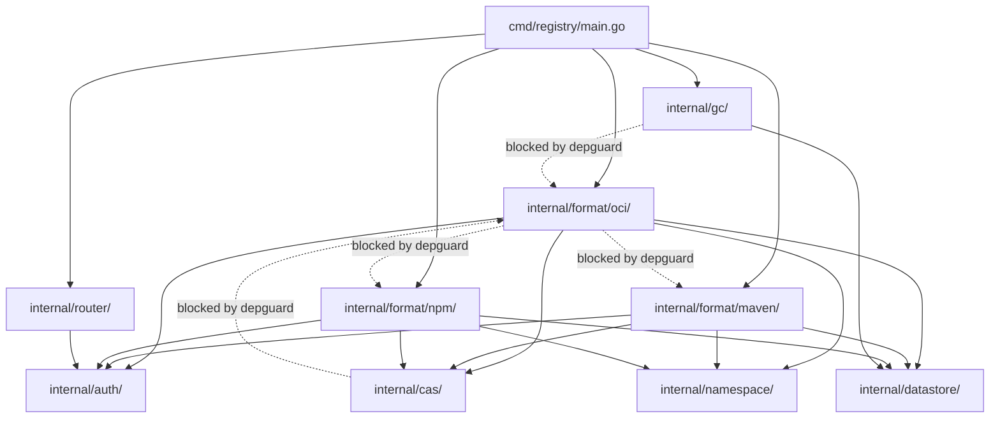

<!-- Design Documents often contain forward-looking statements -->
<!-- vale gitlab.FutureTense = NO -->

## Status

**Proposed.**

## Context

The Artifact Registry will support 15+ package formats (OCI, Maven, npm, PyPI, NuGet, and others)
developed by 20+ engineers. AI agents will write the format implementations, with engineers
writing specs, steering architecture, and reviewing output. The codebase
needs a structure that scales with format count. It must onboard new contributors quickly, and it
must let engineers navigate to the relevant code during incidents without tooling assistance. It must
enforce architectural boundaries mechanically rather than through code review alone.

Several prior ADRs constrain the design space:

- [ADR-006](006_technology_stack.md) establishes Go as the implementation language and defines the
  technology stack.
- ADR-007 defines the database schema with format-specific tables.
- [ADR-008](008_content_addressable_storage.md) specifies SHA256-based content-addressable storage
  with namespace-scoped deduplication.
- [ADR-009](009_api_design.md) specifies both management APIs (REST/GraphQL) and format-specific
  client APIs.
- [ADR-022](022_namespace_decoupling.md) introduces an internal namespaces entity that decouples
  the registry from Rails identifiers.

The format extensibility mechanism (Module Pattern with Service Provider Interface and Capability
Interfaces) is a fixed architectural input from the extensibility work. This ADR does not
re-evaluate it. It addresses the project directory layout and the tooling that enforces it.

We evaluated three established architecture patterns through demo projects, each implementing five
package formats (OCI, Maven, npm, Debian, Generic) with a cross-cutting feature (upload
provenance) and a format deletion exercise. The evaluation compared known patterns with documented
failure modes rather than exploring an open design space. An AI-generated hybrid layout might
find a better local optimum, but would lack the body of production evidence and community
knowledge that established patterns carry.

- [ar-guardrails-clean-arch](https://gitlab.com/gitlab-org/ci-cd/package-stage/ar-guardrails-clean-arch):
  Clean Architecture (layer-first)
- [ar-guardrails-ddd-hex](https://gitlab.com/gitlab-org/ci-cd/package-stage/ar-guardrails-ddd-hex):
  DDD + Hexagonal Architecture (bounded-context-first)
- [ar-guardrails-go-native](https://gitlab.com/gitlab-org/ci-cd/package-stage/ar-guardrails-go-native):
  Go Native (`cmd/` + `internal/` with package-per-feature organization)

Each demo implemented both client-facing APIs (OCI distribution, Maven layout, npm registry, Debian
repository, Generic blob) and management APIs (CRUD for repositories, packages, versions). The demos
produced partial implementations (no full error handling, metrics instrumentation, or structured
logging). The existing [container registry](https://gitlab.com/gitlab-org/container-registry)
codebase is a production reference point for extrapolating file sizes.

## Decision

We use a `cmd/` + `internal/` project layout with package-per-feature organization. These
conventions are widely adopted in production Go projects (including the
[container registry](https://gitlab.com/gitlab-org/container-registry)) and are rooted in Go's
own toolchain: `internal/` has [compiler-enforced visibility](https://go.dev/doc/go1.4#internalpackages)
and `cmd/` is the conventional entry-point directory.

The structure places a single entry point under `cmd/` and all application code under `internal/`.
Each package format lives in its own package under `internal/format/`. Cross-cutting infrastructure
(storage, auth, namespace resolution, garbage collection, and data access) lives in shared packages
directly under `internal/`.

This ADR locks in two things: the enforcement mechanisms (below) and the package paths they
reference. Locked paths: `cmd/`, `internal/`, `internal/format/<name>/`, and the shared
packages named in the depguard `no-reverse-dependency` rule (`internal/cas/`,
`internal/auth/`, `internal/datastore/`, `internal/gc/`). Renaming any locked path requires a
paired update to the depguard config. The per-format file layout (which files exist inside a
format package and how they are named) is a starting point based on the demo implementations.
The first format implementations with full test suites will establish the canonical
per-format structure. If test pressure reshapes the file layout, that is expected and does
not require revising this ADR.

Two mechanisms enforce architectural boundaries (details in
[Enforcement Tooling](#enforcement-tooling)):

1. **Go's `internal/` package visibility:** compiler-enforced, zero configuration.
2. **[depguard](https://github.com/OpenPeeDeeP/depguard):** ~45 lines of YAML covering
   cross-format isolation, raw SQL blocking, and reverse-dependency prevention.

### Directory Layout

The following tree is the initial layout drawn from the demo implementations, not a mandate.
Locked paths per the decision above: `cmd/`, `internal/`, `internal/format/<name>/`, and the
shared packages named in the depguard config (`internal/cas/`, `internal/auth/`,
`internal/datastore/`, `internal/gc/`). Everything inside a format package, the organization
of files within shared packages, and the naming of other shared packages is a starting point.
Engineers and AI agents should propose layout changes when the first format implementations
(with full test suites) reveal a better fit, or when the prescribed layout creates friction
in ongoing work. Revising the per-format layout does not require revising this ADR.

The tree shows the layout at five formats. Each format adds 2-6 files (including its
datastore implementation), scaling with format complexity. Simple formats like Generic require as
few as 2. Complex formats like OCI require 6. Shared infrastructure packages do not grow with
format count.

```text
artifact-registry/
  cmd/
    registry/
      main.go                     # Entry point, dependency wiring (~135 lines at 15 formats)
  internal/
    cas/
      cas.go                      # CAS interface and BlobInfo types
      client.go                   # SHA256 two-phase upload client
    auth/
      auth.go                     # Auth interfaces: ValidateToken, CheckScope
      middleware.go               # HTTP authentication middleware
      jwt.go                      # JWT token exchange with Rails
    namespace/
      namespace.go                # Namespace resolver interface
      resolver.go                 # Slug-to-namespace-ID resolution
    format/
      format.go                   # FormatHandler interface, FormatID enum
      oci/
        handler.go                # OCI /v2/ client API handlers
        delete.go                 # OCI manifest and blob deletion
        discovery.go              # Tag list, catalog endpoints
        metadata.go               # OCI manifest and layer types
        store.go                  # OCI artifact storage (calls CAS interface)
        version.go                # Tag resolution
      maven/
        handler.go                # Maven layout HTTP handlers
        metadata.go               # POM metadata types
        store.go                  # Maven artifact storage
        version.go                # Maven version ordering
      npm/
        handler.go                # npm registry API handlers
        metadata.go               # package.json types
        store.go                  # npm artifact storage
        version.go                # Semver handling
      pypi/
        handler.go                # PyPI API handlers
        metadata.go               # Distribution metadata types
        store.go                  # PyPI artifact storage
        version.go                # PEP 440 version parsing
      generic/
        handler.go                # Generic blob handlers
        store.go                  # Generic blob storage
    gc/
      gc.go                       # GC orchestrator
      collector.go                # FormatCollector interface
      worker.go                   # Background GC worker
    retention/
      retention.go                # Retention policy engine
      policy.go                   # Policy types
    datastore/
      datastore.go                # Database interface
      postgres.go                 # PostgreSQL implementation
      migrations/                 # Schema migrations
    repository/
      repository.go               # Repository entity (artifact container); DB access via datastore/
    router/
      router.go                   # HTTP router, format dispatch
    middleware/
      ratelimit.go                # Rate limiting
      logging.go                  # Request logging
      correlation.go              # Correlation ID propagation
    config/
      config.go                   # Configuration loading
    testutil/
      testutil.go                 # Shared test helpers
```

### Enforcement Tooling

Two tools cover all enforceable architectural boundaries.

**Go `internal/` (compiler-enforced):** The Go compiler rejects imports of `internal/` packages
from code outside the allowed tree. This enforces three rules with zero configuration:

- No external code can import the registry's internal packages.
- Format packages are invisible to code outside `internal/` but visible to each other (depguard
  handles cross-format isolation).
- Circular dependencies between packages cause a compilation error.

**depguard (CI-enforced):** Three rules in ~45 lines of YAML handle what `internal/` alone cannot.
The following excerpt shows the essential deny rules (the
[full config](https://gitlab.com/gitlab-org/ci-cd/package-stage/ar-guardrails-go-native/-/blob/0f6a822/.golangci.yml#L23-71)
includes test file exclusions and comments):

```yaml
linters-settings:
  depguard:
    rules:
      format-isolation:
        files:
          - "**/internal/format/**/*.go"
        deny:
          - pkg: "github.com/gitlab-org/artifact-registry/internal/format/"
            desc: "Format packages must not import sibling format packages"
      no-direct-db:
        files:
          - "**/internal/format/**/*.go"
        deny:
          - pkg: "database/sql"
            desc: "Format packages must use the datastore interface"
      no-reverse-dependency:
        files:
          - "**/internal/cas/**/*.go"
          - "**/internal/auth/**/*.go"
          - "**/internal/datastore/**/*.go"
          - "**/internal/gc/**/*.go"
        deny:
          - pkg: "github.com/gitlab-org/artifact-registry/internal/format/"
            desc: "Shared infrastructure must not import format packages"
```

The `format-isolation` deny rule uses prefix matching (`strings.HasPrefix`). This means format
packages cannot contain sub-packages (for example, `oci/internal/distribution/`), because the
deny prefix would also block a format from importing its own sub-packages. The prescribed layout
keeps all format code flat within the format package. If a format later grows complex enough to
warrant sub-packages, the depguard config would need a targeted allow rule for that format.

The following table shows what each enforcement mechanism catches:

| Violation | Enforcement |
|---|---|
| Format A imports Format B | depguard (CI) |
| Format imports raw SQL driver | depguard (CI) |
| Shared infrastructure imports format code | depguard (CI) |
| External code imports internal package | `internal/` (compiler) |
| Circular dependency | Go compiler |

The rejected candidates required 140-160+ lines of
[go-arch-lint](https://github.com/fe3dback/go-arch-lint) configuration that must be updated for
each new format. go-arch-lint operates on import graphs and cannot catch call-graph violations,
which the Clean Architecture demo exposed (management API endpoints bypassed the usecase layer
in every format).

### Dependency Flow



`cmd/registry/main.go` wires format packages, shared infrastructure, and the router. Format
packages import shared infrastructure (CAS, auth, namespace, datastore). Shared infrastructure
(CAS, auth, datastore, GC) never imports format packages (depguard-enforced). The GC package
defines a `FormatCollector` interface in `gc/collector.go`. Each format implements this interface,
and `main.go` injects the collectors into GC at startup as a `[]FormatCollector` slice. This
keeps GC format-agnostic and avoids linear growth of GC imports as formats are added.
Format-specific background processing (for example, npm metadata precomputation triggered by
version publish) follows the same principle: the logic lives in the format package. No formats
have been implemented yet, so the variety of background job patterns (event-triggered, periodic,
one-shot) is unknown. Designing shared scheduling infrastructure now would be premature. That
structure will emerge from the first formats that require background processing. Selection of
the background job tooling itself is tracked in the
[Artifact Registry background job processing tooling evaluation](https://gitlab.com/gitlab-org/gitlab/-/work_items/594600).
Format packages never import each other
(depguard-enforced). The Go compiler enforces all `internal/`
visibility boundaries.

### Comparative Analysis

The three demo projects produced measurable differences across file count, line volume,
enforcement configuration, and structural overhead. All numbers below come from the demo
implementations (five formats each).

#### Measured Metrics at Five Formats

| Metric | Go Native | Clean Arch | DDD + Hex |
|---|---|---|---|
| Total .go files | 36 | 65 | ~81 |
| Files per format (range) | 2-6 | 10-13 | 13 (fixed) |
| Composition root (main.go) | 92 lines | ~205 lines | ~120 lines |
| Enforcement config | ~45 lines (depguard) | ~140 lines (go-arch-lint) | ~158 lines (go-arch-lint) |
| Shared interface files | 12 | ~21 | ~28 |
| Cross-cutting change (provenance) | 9 files / 7 packages | 10 files / 8 packages | 10 files / 7 packages |
| Format removal (Generic) | 4 files deleted, 2 shared modified | 10 files deleted, 2 shared modified | 10 files deleted, 3 shared modified |
| Parallel dev merge conflicts | 2 files, ~16 lines | 2 files, mechanical | 2 files, ~49 lines |
| Shared interface modifications | 0 across all 5 formats | 0 across all 5 formats | 0 across all 5 formats |

Handler file sizes varied with format complexity, not architecture. The underlying HTTP logic
is the same regardless of project structure. Measured demo handler sizes by format:

| Format complexity | Handlers | Demo lines |
|---|---|---|
| Simple (Generic) | 10 | 300-350 |
| Moderate (Debian) | 14 | 480-530 |
| Moderate (Maven) | 17 | 570-725 |
| Moderate-high (npm) | 21-27 | 580-920 |
| Complex (OCI) | 26 | 700-800 |

The ranges reflect variation across architectures. The Go Native layout had the largest handler
files (797 lines for OCI, 916 for npm) because it co-locates all handler logic in a single file.
Clean Architecture and DDD split some handler-adjacent logic (error types, discovery methods)
into separate files, producing smaller handler files but more total files.

#### Structural Tax on Simple Formats

The most revealing metric is the overhead imposed on the simplest format (Generic, a blob
upload/download API with 10 handlers):

| Architecture | Files | Total lines | Overhead vs. Go Native |
|---|---|---|---|
| Go Native | 4 | ~450 | baseline |
| Clean Arch | 10 | 628 | +40% lines, +150% files |
| DDD + Hex | 10 | 760 | +69% lines, +150% files |

DDD + Hexagonal imposed 310 more lines of code than Go Native for the same functionality. That
overhead consists of domain error sentinels, port interface definitions, application service
wrappers, and adapter store boilerplate that the architecture requires regardless of format
complexity.

#### Production Extrapolation at Fifteen Formats

The demos produced partial implementations without full error handling, metrics instrumentation,
structured logging, or edge case coverage. The existing container registry codebase provides a
production reference: its `manifests.go` handler is 1,848 lines compared to demo OCI handlers
of 700-800 lines, a multiplier of 2.3-2.6x. The `repositories.go` handler is 1,484 lines.
The full handler directory totals 7,956 non-test lines for a single format. Test code in the
handler directory alone is 18,084 lines (a 2.3x test-to-code ratio).

Using a conservative 2-2.5x multiplier for production implementation and assuming 15 formats of
moderate complexity (Maven/Debian-like):

| Metric | Go Native | Clean Arch | DDD + Hex |
|---|---|---|---|
| Total .go files (format + shared) | ~98 | ~180 | ~223 |
| Per-format handler (production est.) | 1,200-1,800 lines | 1,200-1,800 lines | 1,200-1,800 lines |
| Composition root | ~135 lines | ~505 lines | ~400-450 lines |
| Enforcement config | ~45 lines | ~320 lines | ~278 lines |
| Per-format config cost | 0 lines | ~18 lines | ~12 lines |
| Format addition: files created | 2-6 | 10-13 | 13 |
| Format addition: shared files modified | 1 (main.go, 3-5 lines) | 2 (main.go ~30 lines, config ~18 lines) | 2 (main.go ~14 lines, config ~12 lines) |

The composition root in Clean Architecture grows at ~30 lines per format because each format
requires a multi-step wiring block (create stores, create usecases, create handler, register
provider). At 15 formats, the composition root exceeds 500 lines and becomes a merge conflict
bottleneck: every format addition and every wiring change modifies the same file. The Go Native
composition root grows at ~4 lines per format (one registration call) and stays under 150 lines.

The enforcement config difference compounds over the project lifetime. The Go Native depguard
config is generic (it matches `**/internal/format/**/*.go`) and never changes when formats are
added. Both rejected candidates require a human to update the go-arch-lint config per format.
An engineer who forgets this step adds a format that the linter does not check. At 15 formats
with 20+ engineers, some will forget.

#### Context Window Cost

An AI agent adding a new format must read enough of the codebase to understand the contract,
study a reference implementation, and wire the format into the application. The number of files
and tokens of structural context directly affects agent accuracy and the probability of
backtracking.

We estimated the input context by counting the files an agent must read (shared interfaces,
composition root, enforcement config, and one reference format) and their character counts,
then converting at ~4 characters per token:

| Metric | Go Native | Clean Arch | DDD + Hex |
|---|---|---|---|
| Files to read | 9 | 13 | 22 |
| Total lines | ~1,095 | ~1,317 | ~1,430 |
| Estimated input tokens | ~8,900 | ~9,500 | ~11,700 |
| Files to create | 2-6 | 10-13 | 13 |
| Shared files to modify | 1 | 2 | 2 |

The input token counts are closer across architectures than the file counts suggest, because the
underlying format logic (the reference handler) dominates the token budget in all three. The
architecture-specific structural overhead (interfaces, config, composition root) accounts for
~2,800 tokens in Go Native, ~4,900 in Clean Architecture, and ~5,700 in DDD + Hexagonal.

The creation cost diverges more sharply. Creating 2-6 files in a flat package is a simpler
task than creating 10-13 files across 4 directories with layer-specific naming conventions.
The DDD demo recorded 3 agent backtracks (the highest of all candidates), correlating with
the higher file count and directory-spanning creation requirement.

The zero shared interface modification record is the strongest signal: across all three demos,
an agent adding a format never needed to change the contract surface. The shared interfaces
(ContentStore, RepositoryStore, BlobReferenceStore, BlobReviewQueue, Authenticator, Authorizer,
NamespaceResolver, Limits, Metrics, FormatProvider) absorbed every format without modification.

#### File Size, File Count, and Context Pressure

File sizes and file counts affect AI agent context in different ways, and the three architectures
make different trade-offs between them.

The Go Native layout produces fewer, larger files. A format package has 2-6 files, with handler
files reaching 800-900 lines in the demo and projecting to 1,200-1,800 lines at production
scale. An agent working on a single format reads fewer files but each file consumes more of the
context window. The benefit is locality: all handler logic for a format lives in one place, and
the agent does not need to trace relationships across directories and layers.

Clean Architecture and DDD produce more, smaller files. A format spans 10-13 files across 4
directories, with individual files averaging 60-120 lines. An agent must read more files and
hold the layer relationships in context (which file calls which, which layer owns which
responsibility). The per-file token cost is lower, but the navigation cost and relationship
tracking cost are higher.

At production scale, the Go Native layout's large handler files will need splitting (see
Consequences, Negative). Once split, the per-file sizes become comparable across architectures,
but Go Native retains the advantage of fewer total files and a flat package structure with no
cross-directory layer navigation. A complex format like OCI that splits its handler into client
API and management API files adds 1-2 files to the package, still well below the 10-13 files
per format in the alternatives.

The production extrapolation also affects the reference format that agents must study. At demo
scale, reading the reference handler is ~6,000 tokens regardless of architecture. At production
scale with 1,200-1,800 line handlers, this grows to ~12,000-18,000 tokens. The structural
overhead (~2,800 to ~5,700 tokens) becomes a smaller fraction of total context as production
files grow, which means the architecture's impact on agent context cost diminishes relative to
format complexity. The architecture's impact on agent creation cost (number of files to create
and directories to navigate) does not diminish.

#### Cross-Cutting Change Amplification

The demos included one cross-cutting change: adding upload provenance tracking to every format's
upload path. The file counts below come from retrospective analysis of the final codebase, not
from isolated commits. Actual diffs may surface additional files (test helpers, config changes)
not captured here.

| Architecture | Shared files changed | Per-format files changed | Total at 5 | Projected at 15 |
|---|---|---|---|---|
| Go Native | 4 (interface + 3 storage impls) | 1 per format | 9 | ~19 |
| Clean Arch | 4 | 2 per format (usecase + adapter) | 14 | ~34 |
| DDD + Hex | 4 | 1 per format | 9 | ~19 |

The decomposed totals differ from the measured demo counts above (10 for Clean Arch, 10 for
DDD + Hex) because the provenance change did not require usecase-layer changes in every Clean
Architecture format, and the DDD count included one file outside the shared/per-format
decomposition. The projections use the full per-format cost as the scaling factor.

Clean Architecture doubles the per-format cost because each cross-cutting change must propagate
through both the usecase layer and the adapter layer. At 15 formats, a single shared interface
change requires modifying 34 files compared to 19 for the other two architectures.

Each cross-cutting concern has a unique propagation pattern through the codebase, so a single
demo example cannot represent the full range. Upload provenance touches the CAS interface. Adding
a new metric touches middleware. Changing the auth flow touches credential extraction in every
handler. What the demo does establish is the per-format constant: 1 file per format for Go Native
and DDD, 2 files per format for Clean Architecture. That constant applies regardless of which
cross-cutting concern triggers the change. The dominant term is N (number of formats), which no
architecture can reduce. The architecture choice can only avoid inflating the constant factor,
which Clean Architecture fails to do.

### Risk at Scale

The primary failure mode of the Go Native layout is inconsistency between format packages.
Without an architecture linter prescribing internal structure, each format package can organize
its files differently. Format A might put all handlers in one file while Format B splits them
across three.

This is a style and DRY problem, not a correctness problem. The compiler and depguard still
prevent all cross-boundary violations. The risk is aesthetic drift, not architectural drift.

Three mitigations reduce this risk:

- **Reference implementation:** One format package (OCI, as the most complex) is the canonical
  example. New formats copy its structure.
- **Contributing guide:** Documents the expected file layout within a format package, the naming
  conventions, and the shared interfaces each format must implement.
- **Conformance test suite:** Mechanical tests verify that each format implements the required
  interfaces, registers the expected routes, and passes behavioral contracts. The
  [prior-art research](https://gitlab.com/gitlab-org/ci-cd/package-stage/ar-guardrails-go-native)
  found that conformance testing scales better than code review for behavioral consistency.

The rejected candidates have worse failure modes at scale. Clean Architecture's primary failure
mode is usecase layer erosion: management API endpoints bypass the usecase layer because it adds
no logic, and go-arch-lint cannot detect this at the call-graph level. The demo confirmed this
independently in every format, meaning both human and AI authors hit the same gap. At 15+ formats
with 20+ engineers, the usecase layer degrades into a mix of real logic and pass-through stubs.
DDD + Hexagonal's primary failure mode is forced code duplication: every format adapter in the
demo reimplemented `extractCredentials` because the architecture prevents format adapters from
importing shared adapters. At 15 formats, every shared adapter pattern is duplicated 15 times,
and bug fixes must find and update all copies.

**Test overhead gap.** None of the three demos included test files, so we cannot compare test
boilerplate across architectures from measured data. The DDD demo's friction notes reference
6-9 mock interfaces per test, which suggests higher test setup cost than the other two candidates.
The container registry's production test-to-code ratio in handlers (2.3x) indicates that test
volume will exceed implementation volume. Tests regularly drive structural changes (package
splits, interface relocation, helper extraction) that the demos did not exercise. The
architecture's impact on test boilerplate is a real cost that this evaluation did not measure.

## Alternatives

### Clean Architecture (Layer-First)

Clean Architecture organizes code into concentric layers (domain, usecase, adapter) with a strict
dependency rule: inner layers do not import outer layers. go-arch-lint enforces the import
direction between layers in CI.

The [demo project](https://gitlab.com/gitlab-org/ci-cd/package-stage/ar-guardrails-clean-arch)
implemented all five formats. Each format required 10-13 files (average 10.6) spanning the domain,
usecase, and adapter layers, plus modifications to the composition root and go-arch-lint config.
The total format code across five formats was 5,607 lines in 53 files. The composition root reached 205 lines at
five formats. Cross-cutting changes (upload provenance) touched 10 files across 8 packages.

The demo exposed a structural enforcement gap. Management API endpoints bypassed the usecase layer
by reaching through service structs directly (`h.Services.Deploy.Packages.ListPackages`). This
happened independently in every format, meaning both human and AI authors hit the same gap.
go-arch-lint operates on import graphs, not call graphs. It verifies that the adapter layer
imports the usecase package, not that the adapter actually calls usecase methods. No Go linter in
production use catches "you imported the right package but called the wrong method on it." The
friction notes state: "the architecture's layering creates a real incentive to shortcut query
paths."

At 15 formats, the composition root projects to ~505 lines with ~30 lines of wiring per format.
The go-arch-lint config projects to ~320 lines with ~18 lines per format (4 component path
mappings and 4 `mayDependOn` blocks, each spanning 2-3 lines). Both files must be updated by a
human for each new format. Cross-cutting
changes project to ~34 files (double the other candidates) because each change must propagate
through both the usecase and adapter layers per format.

**Why rejected:** The usecase layer creates an enforcement gap that current Go tooling cannot
close. The layer adds overhead (10-13 files per format, 505-line composition root, 320-line
arch-lint config at 15 formats) without delivering the isolation guarantee it promises. The 2x
cross-cutting change amplification compounds this cost over the project lifetime.

### DDD + Hexagonal Architecture (Bounded-Context-First)

DDD + Hexagonal Architecture organizes code into bounded contexts (one per format), each containing
domain entities, application services, ports (interfaces), and adapters (implementations).
go-arch-lint enforces boundaries between contexts and layers within each context.

The [demo project](https://gitlab.com/gitlab-org/ci-cd/package-stage/ar-guardrails-ddd-hex)
implemented all five formats. Each format required exactly 13 files regardless of complexity.
The OCI bounded context (the most complex) totaled 1,550 lines. The Generic bounded context
(the simplest) totaled 760 lines, 69% more than the equivalent Go Native package (~450 lines).
This flat 13-file cost means simple formats pay the same structural tax as complex ones.

The demo exposed forced code duplication. Every format adapter reimplemented
`extractCredentials` (6 lines of authentication credential extraction from HTTP requests)
because go-arch-lint prevents adapters in one bounded context from importing adapters in another. A
canonical copy existed in the shared adapter layer (`internal/adapter/http/auth.go`) but format
adapters could not use it. No fix exists within the architecture: sharing the adapter violates
bounded-context isolation, and moving it to the domain layer misplaces infrastructure logic. At
15 formats, every shared adapter pattern is duplicated 15 times.

The OCI handler file reached 830+ lines in the demo (growing from an initial 696 lines after the
provenance cross-cutting change). The go-arch-lint config reached 158+ lines at 5 formats and
projects to ~278 lines at 15, with ~12 lines added per format (4 component path mappings and 4
`mayDependOn` blocks, each 1-2 lines).

DDD tactical patterns (aggregates, value objects, repositories) map poorly to Go. Go has no
annotations, no access modifiers beyond exported/unexported, and no inheritance for aggregate
base types. Aggregate invariant enforcement depends entirely on developer discipline. The learning
curve is the steepest of all three candidates: bounded contexts, aggregates, value objects,
repositories, ports, adapters, application services, and domain events. The demo required 6-9
mock interfaces per test in its friction notes, compounding the maintenance burden for test code.

**Why rejected:** The rigid 13-file-per-format structure imposes uniform overhead regardless of
format complexity and forces code duplication that the architecture cannot resolve. The DDD
tactical patterns do not map to Go's type system, and the learning curve is incompatible with a
team of 20+ engineers and AI agents.

## Consequences

### Positive

- **Compiler-enforced isolation:** Go's `internal/` visibility rules prevent cross-boundary
  imports at compile time. Zero configuration, zero false negatives.
- **Proportional per-format cost:** 2-6 files per format, scaling with complexity. Simple formats
  (Generic: 2 files, ~450 lines) pay less than complex formats (OCI: 6 files, ~1,300 lines).
  Clean Architecture imposed 10-13 files and DDD imposed exactly 13 regardless of complexity.
- **Smallest footprint at scale:** ~98 .go files at 15 formats, compared to ~180 for Clean
  Architecture and ~223 for DDD + Hexagonal. A ~135-line composition root compared to ~505 and
  ~450.
- **Lowest AI agent creation cost:** 2-6 files to create per format compared to 10-13 for both
  alternatives. The zero shared interface modification record means agents never change the
  contract surface.
- **Minimal enforcement configuration:** ~45 lines of depguard YAML that never changes when
  formats are added. Both alternatives require 270-320 lines of go-arch-lint configuration with
  12-18 lines added per format. Each format addition requires a human to update the config.
- **1x cross-cutting amplification:** Cross-cutting changes touch 1 file per format (the
  handler). Clean Architecture touches 2 per format (usecase + adapter), projecting to 34 files
  at 15 formats compared to 19.

### Negative

- **No prescribed internal structure within format packages.** Consistency across format packages
  depends on code review, a reference implementation, and a contributing guide. The other
  candidates prescribe internal structure through their layer/context rules, at the cost of higher
  overhead and enforcement gaps.
- **Layout is a starting point, not a contract.** The tree in Directory Layout documents the
  demo-validated starting structure. When it creates friction (for example, tests pushing on
  package boundaries, or a format whose shape resists the default file split), the expected
  response is to propose a layout change, not to work around it. AI agents in particular should
  treat the tree as guidance and surface better organizations rather than forcing code into
  packages that are not its natural home. Layout changes land in their own PRs rather than
  bundled with feature or bug-fix work, so the tradeoff is reviewed on its merits.
- **Large handler files require planned splitting.** Co-locating all handler logic in a single
  file per format produces files of 300-350 lines for simple formats, 500-900 for moderate
  formats, and 800+ for complex formats in the demo. At production scale with full error handling,
  metrics, and logging, these grow to roughly 800-1,200 lines (simple), 1,200-1,800 (moderate),
  and 1,800+ (complex). Complex formats like OCI will need to split their handler file before
  reaching production (the container registry's production `manifests.go` is 1,848 lines).
  Moderate formats may need a similar split as edge cases, logging, and metrics accumulate over
  time. The split is mechanical (for example, separating client API handlers from management API
  handlers, or grouping by resource type), and the resulting files remain within the same package.
  This is a known maintenance cost that the team should plan for rather than discover under
  pressure. The alternatives avoid this specific problem by distributing code across more files
  from the start, at the cost of higher file count and directory navigation overhead.
- **Unmeasured test overhead.** The demos did not include test files. Tests are the majority of
  production code (the container registry's handler test-to-code ratio is 2.3x) and regularly
  reshape structure: package boundaries, interface placement, and file splits often change to
  make code efficiently testable. The architecture's impact on test boilerplate (mock count,
  fixture complexity, setup ceremony) is a real cost that this evaluation did not quantify. The
  DDD friction notes indicate 6-9 mock interfaces per test. The per-format file layout prescribed
  above may need revision once the first format implementations include full test suites.
- **depguard cannot catch code duplication.** This is a limitation shared by all three candidates.
  DRY violations within and across format packages require code review regardless of project
  structure. The demo found `actionFromMethod` duplicated across all 5 format handlers.

## References

- [ADR-006: Technology Stack](006_technology_stack.md)
- ADR-007: Database Schema (not yet published)
- [ADR-008: Content-Addressable Storage](008_content_addressable_storage.md)
- [ADR-009: API Design](009_api_design.md)
- [ADR-022: Namespace Decoupling](022_namespace_decoupling.md)
- [Go 1.4 `internal/` packages](https://go.dev/doc/go1.4#internalpackages)
- [depguard](https://github.com/OpenPeeDeeP/depguard)
- [go-arch-lint](https://github.com/fe3dback/go-arch-lint) (referenced in alternatives)
- Demo: [ar-guardrails-clean-arch](https://gitlab.com/gitlab-org/ci-cd/package-stage/ar-guardrails-clean-arch)
- Demo: [ar-guardrails-ddd-hex](https://gitlab.com/gitlab-org/ci-cd/package-stage/ar-guardrails-ddd-hex)
- Demo: [ar-guardrails-go-native](https://gitlab.com/gitlab-org/ci-cd/package-stage/ar-guardrails-go-native)
- Production reference: [container-registry](https://gitlab.com/gitlab-org/container-registry) (file size calibration)
