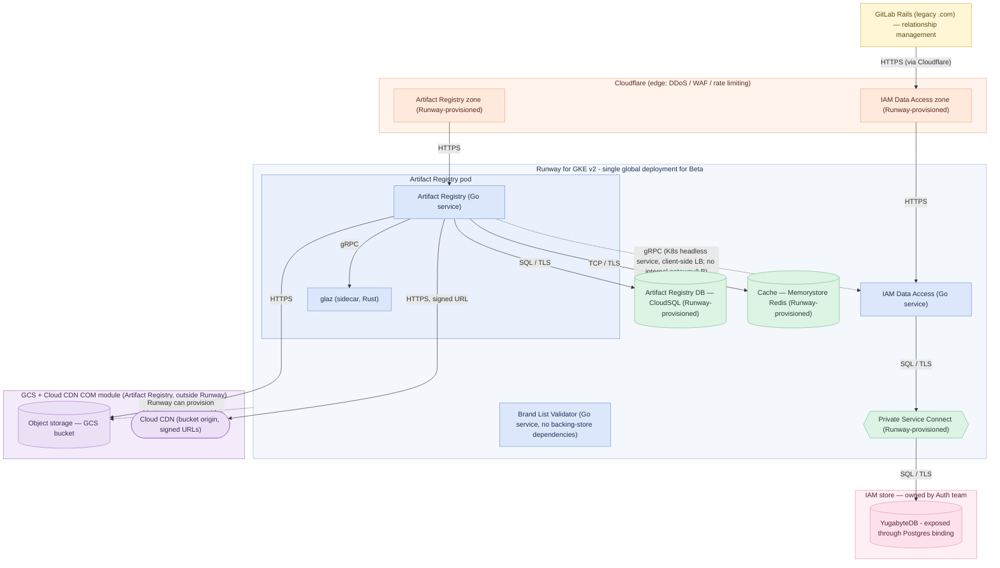

<!-- Design Documents often contain forward-looking statements -->
<!-- vale gitlab.FutureTense = NO -->

## Status

**Proposed.**

## Context

The target deployment model for the Artifact Registry
is a cell-based multi-tenant architecture
where each Cell is a self-contained regional data plane (GKE, PostgreSQL, Redis, GCS)
behind a shared edge (Cloudflare + Cloud CDN),
with slug-based routing through the Anchor Router and Anchor Topology services ([ADR-022](022_namespace_decoupling.md))
and a Cell lifecycle managed by Terraform, Argo CD, and Fairway.

That target cannot be fully in place for the closed beta.
The beta has a fixed FY27-Q2 window,
and several of its dependencies are still in flight:

1. The **Anchor Router** and **Anchor Topology** services
   are not yet available for the Artifact Registry to route against.
   Until they exist,
   the registry owns slug uniqueness in its own database ([ADR-022](022_namespace_decoupling.md)).
1. The **Theseus Platform Binding for Cells and Dedicated**
   — the mechanism that would let the registry be provisioned *inside* a Cell through the existing Instrumentor stack —
   is not ready.
   The Runway for GKE v2 work explicitly targets the Enterprise (non-Cellular) instance of Runway;
   Cells and Dedicated provisioning come later.
1. Per-Cell migration and rebalancing tooling does not exist.

## Decision

The Artifact Registry,
together with the Auth components it depends on,
is being used as the **thinnest viable platform** for building out [Theseus](https://gitlab.com/gitlab-com/content-sites/handbook/-/merge_requests/19702),
GitLab's internal developer platform.

AR is the first stateful GitLab Module heading to production,
so it exercises the parts of the platform — provisioning, service bindings, observability, build, and delivery —
that future Modular Components will reuse.
The Theseus platform teams **pave the path just ahead** of the AR and Auth teams:
they deliver the thinnest platform the beta needs,
rather than the full cell-based target,
and the product and the platform are built in parallel.

The Artifact Registry will be deployed using Fairway descriptors
on Runway's new "Runway for GKE v2" target.

Theseus allows application development teams to request backing stores for their components.
These are provisioned using automation, without the need for manual intervention.
The mechanism depends on the resource:
Runway provisions most backing stores directly,
while a small number are delivered as Artifact Registry
**[COM (Component Ownership Model) modules](/handbook/engineering/infrastructure-platforms/production/component-ownership-model/)**
— owned by the relevant product engineering team,
integrated into Config-Mgmt, and managed outside Runway.

The split was agreed between the Artifact Registry and Runway teams:

| Infrastructure | How it is provided | Tracking |
|---|---|---|
| CloudSQL (database) | Runway provisions | Runway [`team#933`](https://gitlab.com/gitlab-com/gl-infra/platform/runway/team/-/work_items/933) |
| Memorystore Redis (cache) | Runway provisions | Runway [`team#931`](https://gitlab.com/gitlab-com/gl-infra/platform/runway/team/-/work_items/931) |
| Private Service Connect | Runway provisions; VPC peering was rejected as too complex and a net increase in scope | Runway [`team#934`](https://gitlab.com/gitlab-com/gl-infra/platform/runway/team/-/work_items/934) |
| GCS bucket | Runway provisions in the general case; for the Artifact Registry it is a COM module, coupled with Cloud CDN | Runway [`team#932`](https://gitlab.com/gitlab-com/gl-infra/platform/runway/team/-/work_items/932); COM [`production-engineering#28463`](https://gitlab.com/gitlab-com/gl-infra/production-engineering/-/work_items/28463) |
| Cloud CDN | Artifact Registry COM module; no Runway provisioning. The GCS bucket ships in the same Terraform module, given the strong GCS–Cloud CDN coupling | COM [`production-engineering#28464`](https://gitlab.com/gitlab-com/gl-infra/production-engineering/-/work_items/28464); [coupling decision](https://gitlab.com/gitlab-com/gl-infra/production-engineering/-/work_items/28464#note_3467903274) |
| YugabyteDB (IAM store) | Owned by the Auth team, delivered through config-management; reached over the Runway-provisioned Private Service Connect | [`gitlab#598250`](https://gitlab.com/gitlab-org/gitlab/-/work_items/598250) |

*Source: [Runway work item #44](https://gitlab.com/groups/gitlab-com/gl-infra/platform/runway/-/work_items/44#note_3465201308).*

Runway-provisioned dependencies are consumed by the application through Fairway-generated service bindings.

### Strategy — Artifact Registry and Auth as the thinnest viable platform

AR and Auth are the first real Modular Components to be delivered using Theseus end to end,
and they are deliberately used as the **thinnest viable platform** for the platform itself:
the smallest workload that forces each Theseus capability
to be integrated.

The Theseus teams will pave the path just ahead of the AR and Auth teams,
delivering the thinnest platform each phase needs to deliver the Beta dotcom target.
Once that target is achieved, the focus will switch to the Self-Managed Beta target.

### Ways of working — early, continuous integration

The components are integrated **early and continuously**,
not assembled at the end.

Developers integrate locally against the full Cloud Native stack using **Caproni** ([`gitlab-org#22286`](https://gitlab.com/groups/gitlab-org/-/work_items/22286)),
and a **weekly demo** brings together individual contributors representing the various teams
— AR, Auth, and the Theseus platform teams —
to integrate their work as early as possible
and surface interface gaps while they are still cheap to fix.
This replaces a big-bang integration phase with a standing, demo-driven integration loop.

### Phase 1 — Dotcom closed beta

The Artifact Registry is deployed as a **single global service on Runway for GKE v2**
(the Enterprise, non-Cellular/non-Dedicated instance of Runway).

It is multi-tenant,
with tenants isolated by **namespace partitioning**:
the database is partitioned by namespace ([ADR-007](007_database_schema.md)),
and object-storage paths and deduplication are scoped per namespace ([ADR-008](008_content_addressable_storage.md)).

There is no per-Cell deployment,
no Anchor Router / Anchor Topology routing,
and no migration tooling in Phase 1.
The topology is shown in the [Phase 1 diagram](#architecture).

The following components are built and deployed:

1. The **Artifact Registry** (Go)
1. The **IAM Data Access** service (Go)
1. **GLAZ** (Rust authorization sidecar)
1. The **[Brand List Validator](https://internal.gitlab.com/handbook/engineering/architecture/design-documents/artifact_registry/decisions/015_slug_policy/)** Service (Go)

For the beta, non-FIPS binaries and container images are produced with GoReleaser.
FIPS images are out-of-scope for the Beta.

If the [TUBE proposal](https://gitlab.com/gitlab-com/content-sites/handbook/-/merge_requests/11660) is accepted
and when the TUBE build tooling is ready, it will be retrofitted into the projects.
Retrofitting is expected to be limited to build boilerplate
(CI/CD configuration and build scripts) rather than application code.
This may happen after the Beta period, or during development, but,
importantly, is not on the critical path.

The Artifact Registry and IAM Data Access service request backing stores through
their `FairwayManifest`s. Runway for GKE v2, acting as the Platform Binding, satisfies these dependencies,
and the application consumes them through provider-agnostic **service bindings**
(the Postgres and Redis bindings) surfaced through **LabKit v2**.

Note: Object storage is **not** consumed through a LabKit object-storage binding.
While Theseus will provide object-storage provisioning and service-binding in the general case,
the Artifact Registry will access **native cloud-provider SDKs (GCS/S3) directly, through HTTP requests**.
The registry depends on native object-storage primitives: specifically resumable, chunked uploads,
and this cannot currently be supported through a generic, provider-agnostic abstraction.
For the Artifact Registry, object storage will be delivered through a COM module rather than provisioned by Runway,
so the registry will configure the endpoint itself, and provider differences
(GCS on GitLab.com, S3 in Cells) will need to be handled in application configuration rather than hidden by a binding.
A LabKit object-storage abstraction that meets the Artifact Registry's and Container Registry's
requirements may be built in a later iteration, but it is not on the beta critical path.

The service bindings **must not** leak the provider-specific interface into the application manifest, for example
CloudSQL vs Amazon RDS vs Self-Managed Postgres,
so the same bindings carry over to Self-Managed
and the cellular target (Phase 2) without changes on the application side.

Driver selection sits behind the binding as well:
the application uses the Postgres-compatible `v2/postgres` client for its initial YugabyteDB integration,
and any future use of Yugabyte's cluster-aware smart drivers is handled by LabKit and Runway configuration
rather than chosen in the application manifest.
This keeps development, test, and production environments portable.

### Phase 2 — Cellular target

Once a Theseus Platform Binding for GitLab Dedicated and Cell is available,
the Artifact Registry will be deployed **as part of the Cell infrastructure, through Instrumentor**,
reaching the cell-based multi-tenant target.

This will build on GitLab's **existing** Cells and Dedicated automation (the Instrumentor stack)
rather than a new, parallel cellular fabric,
by accelerating the **Dedicated / Cells Platform Binding for Theseus** —
which also gives other GitLab Modules a route to the same platform underpinnings.

When the Artifact Registry moves into Cells,
customers are migrated **transparently** from the original global instance to the appropriate Cell,
aiming for the smallest customer-visible interruption the migration tooling can achieve.
This interim-to-target migration carries real cost and risk that grows the longer it is deferred — see [Negative consequences](#negative).

For GitLab.com / Cells customers,
the default placement is the Cell in the same isolation boundary as the customer's GitLab Cell (a rule of thumb, not a hard rule).

Authority for slug uniqueness moves from the registry's own database to the Anchor Topology service at this point;
slugs created during the single-instance era must be seeded into Anchor Topology before a second Cell can accept namespace creation.

The migration tooling required to move customers in is treated as **business-as-usual rebalancing capability**,
not throwaway one-off work.

## Consequences

### Positive

- The Dotcom beta ships on the FY27-Q2 timeline,
  without waiting on the Anchor Router, Anchor Topology, or the Theseus Platform Binding for Cells/Dedicated.
- Using AR and Auth as the thinnest viable platform builds Theseus against a real production workload:
  each capability is delivered just ahead of the product that needs it
  and in a form the next Modular Component can reuse.
  Early, continuous integration through Caproni and the weekly demo surfaces interface gaps while they are cheap to fix,
  rather than at a late integration milestone.
- Backing stores follow a consistent provisioning model with clear ownership:
  Runway provisions the database, cache, and Private Service Connect directly,
  consumed by the application through Fairway-generated service bindings;
  the Artifact Registry GCS bucket and Cloud CDN are delivered as self-contained,
  replaceable **COM modules** owned by product engineering.
- The Cells deliverables build on proven Cells and Dedicated automation,
  giving the registry — and future GitLab Modules — a single, shared deployment and operations path
  rather than two competing ones.
- The customer-migration work needed to move from the global instance into Cells
  doubles as the rebalancing tooling the cellular architecture needs anyway;
  nothing is wasted.

### Negative

- During the beta the registry is **not** Cellular:
  there is no per-Cell deployment, no request routing, and no migration tooling.
  Cells can, however, use Artifact Registry through the Global instance running in
  Runway for GKE.
  During this phase, Artifact Registry is a Global Service, but this is a [temporary state](https://gitlab.com/gitlab-com/content-sites/handbook/-/merge_requests/20067#note_3460179693).
  Various technical challenges will need to be overcome before Artifact Registry can be moved into the Cellular infrastructure.
  This includes the need to sync the [trusted issuer's public key](020_authentication_flow.md#authentication-flow),
  and the ability for each cell to call the [Relationships API](https://gitlab.com/gitlab-com/content-sites/handbook/-/merge_requests/18717).
- Tenant isolation in the Dotcom beta rests entirely on namespace partitioning within a single shared data plane;
  the stronger isolation and resiliency properties of the cellular model only arrive with the Cells/Dedicated Platform Binding
  and other work required to prepare the Artifact Registry for a cellular architecture.
- A later migration of Dotcom beta customers from the global instance into Cells is unavoidable,
  and the slug-authority handover (registry database → Anchor Topology) must be designed and executed carefully.
  The longer this migration is deferred, the higher the risk:
  - Vertical scaling of the global instance is only a temporary hedge;
    the longer the global instance grows, the larger and riskier the eventual migration.
  - The global instance runs in Google Cloud (GCS-backed) while the cellular instances run in AWS (S3-backed),
    so the move incurs cross-hyperscaler egress costs that scale with both customer activity and the delay before migration is supported
    (egress is on the order of USD 120 for the first TB and ~USD 1,000 for the first 10 TB).
  - Inter-Cell migration tooling should ideally be delivered as shared infrastructure for all teams building cellular (Modular) components,
    so that standardisation, security, and operational best practices are established once rather than reimplemented per component.
  - That shared infrastructure will take time to build. Depending on the urgency of the first migration,
    the tooling may be used before it is fully mature, with some disruption (minutes or even hours)
    before it can perform migrations with only seconds of customer-visible interruption.

  See the [CTO review migration planning notes](https://docs.google.com/document/d/12eJYdzyCcEUUeBjkV6wIL_5FymsUbh9Tb_yRDWHRWKo/edit?tab=t.i2jtfrt0twt9#bookmark=id.7n3stb68gv0a) for broader cross-Cell migration context.

## Alternatives considered

**Build a parallel cellular fabric for the registry.**
Stand up a registry-specific cell architecture independent of the existing Cells / Dedicated Instrumentor investment.
*Rejected:* it duplicates the most complex and costly part of the platform,
fragments the deployment and operations story,
and makes deploying modules into Single-Tenant, Dedicated, Dedicated for Government, and Self-Managed harder rather than easier.
Picking a cellular architecture for one part of the system and not the rest is the worst of both worlds —
the cost of making the hardest component cellular with none of the fleet-wide benefit.

## Architecture

### Phase 1 — Dotcom beta service architecture

