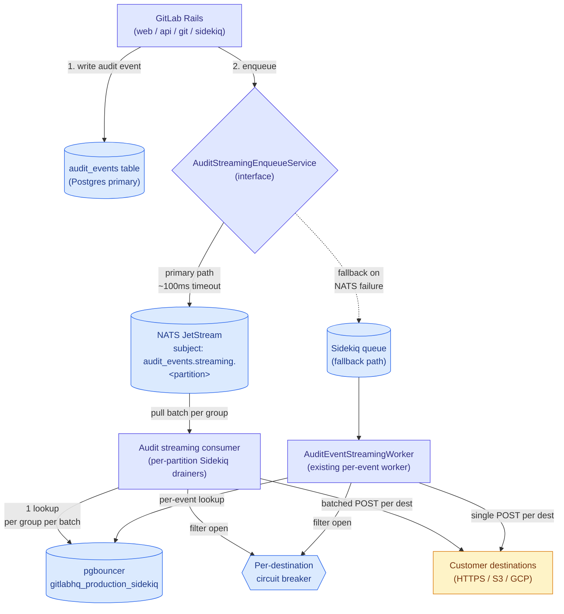

<!-- vale gitlab.FutureTense = NO -->



## Summary

Audit event streaming delivers ~65-75M events per day to customer-configured external destinations (HTTP webhooks, AWS S3, GCP Cloud Logging). The current architecture enqueues one Sidekiq job per (audit event × destination) onto `redis-sidekiq-catchall-b`. This per-event fan-out has caused multiple S1/S2 incidents in the last six months by saturating Redis memory and the `gitlabhq_production_sidekiq` pgbouncer pool, with blast radius extending to other workloads sharing the `catchall-b` shard.

This document proposes replacing the per-event Sidekiq dispatch with a NATS-based event delivery pipeline. Rails publishes audit events to NATS JetStream synchronously on creation (with Sidekiq fallback for NATS unavailability). A Sidekiq cron worker (running in the monolith) pulls batches from NATS, groups events by top-level group, and dispatches them to customer destinations with consolidated destination lookups and credential decryption per batch. This decouples audit streaming from the Redis-bounded Sidekiq queue, reduces pgbouncer pool pressure by ~100x via batching, and aligns the workload with the strategic Data Insights Platform direction.

## Motivation

Audit event streaming has been the trigger workload for at least three production incidents in the last six months:

1. **[INC-10096](https://gitlab.com/gitlab-com/gl-infra/production/-/work_items/22103) (S1, 2026-05-12):** `redis-sidekiq-catchall-b` ran out of memory. Audit streaming jobs were deferred to relieve pgbouncer saturation, but the deferred set grew unboundedly and exhausted Redis. The cascade took the `catchall-b` shard down, affecting all workloads sharing it.
2. **[INC-10255](https://gitlab.com/gitlab-com/gl-infra/production/-/work_items/22170) (S2, 2026-05-19):** Re-enabling streaming for `gitlab-org` after a circuit breaker rollout immediately saturated the pgbouncer pool. Peak load reached ~10k audit events/sec. Streaming was disabled globally for ~3 hours.
3. **[INC-8169](https://gitlab.com/gitlab-com/gl-infra/production/-/work_items/21484) (S2, 2026-03-09):** Sidekiq jobs experienced sustained, high backlogs on catchall-b, elasticsearch, and low-urgency-cpu-bound shards, causing poor job processing performance and SLO violations.

Mitigations shipped to date:

1. **Per-destination circuit breaker** ([MR !235349](https://gitlab.com/gitlab-org/gitlab/-/merge_requests/235349)) reduced error rate from 19.44% to 0.058% by short-circuiting dispatch to consistently-failing destinations. This addressed the destination-failure amplification class of incident but did not reduce raw event volume.
2. **Block specific audit event types from being streamed** ([MR !237996](https://gitlab.com/gitlab-org/gitlab/-/merge_requests/237996)) to external destinations via a configurable denylist. This allows blocking certain high volume event types like `repository_git_operation` and `user_authenticated_using_job_token`.

These are response-time mitigations, not structural fixes. The underlying property that the workload exceeds the capacity of its current infrastructure remains. The [Data Insights Platform blueprint](/handbook/engineering/architecture/design-documents/data_insights_platform/) explicitly names audit events as a target workload for migration to NATS-based delivery.

### Goals

1. **Eliminate the Redis-memory-bounded backlog** for audit streaming. The buffer between event creation and delivery should be disk-bounded, not RAM-bounded.
2. **Reduce pgbouncer pool pressure** from audit streaming dispatch by an order of magnitude or more, via batched destination lookups.
3. **Decouple audit streaming from `catchall-b`** so that audit streaming spikes do not affect neighboring workloads (CI, env_mgmt).
4. **Preserve customer contract.** Customers on the current single-event path see no change. Customers who opt into the batched NATS path receive batched payloads, an array of events per HTTP request, multiple entries per S3 object. This is a contract change, gated per-group and announced, not silent.
5. **Maintain delivery durability.** Audit events must not be silently lost. At-least-once delivery semantics, with deduplication at the destination (customer) layer.
6. **Be safely re-enableable for high-volume namespaces** including gitlab-org, which currently triggers incidents.

### Non-Goals

1. **Real-time delivery latency improvements.** Audit streaming already operates with second-scale delivery latency, which is acceptable for SIEM ingestion. Batching may add seconds of latency; this is acceptable.
2. **Replacing the per-destination circuit breaker.** The breaker is workload-protection logic that continues to apply at the dispatch layer regardless of buffer technology.
3. **Audit event creation path changes.** Audit events continue to be written to the Postgres table as the source of truth. This proposal only changes the streaming-delivery layer.
4. **Self-Managed parity in initial rollout.** This proposal targets GitLab.com. Self-Managed continues on the current Sidekiq path until NATS becomes part of the SM bundle. The interface abstraction (see "Migration") allows independent rollout timing.
5. **Modularization of audit streaming out of the monolith.** The consumer process (Sidekiq cron) must run in the monolith environment to access destination models. Extracting this to a separate service is a future consideration.

## Proposal

Replace the per-event Sidekiq enqueue with a three-layer NATS-based pipeline:

1. **Producer:** Rails publishes audit events synchronously to NATS JetStream on creation. An interface abstraction wraps the enqueue call so that NATS failures fall back to the existing Sidekiq path, preserving durability during the transition and as a permanent safety net.

2. **Buffer:** NATS JetStream holds audit events in a durable, disk-backed stream, partitioned into a fixed number of subjects by a hash of the top-level group ID. Partitioning bounds subject cardinality and enables parallel, ordered consumption.

3. **Consumer:** A Sidekiq cron scheduler fans out one drainer worker per partition. Each drainer pulls batches from its partition, groups events by top-level group, performs one destination lookup per (group × batch), and dispatches batched payloads to customer destinations. The existing per-destination circuit breaker applies at the dispatch step.



### Expected impact

Based on current volume (~65-75M events/day, peak ~10k/sec) and batch size 100:

| Metric | Current | After |
| --- | --- | --- |
| Sidekiq jobs enqueued per day | ~65-75M | ~650-750K (consumer cron triggers only) |
| NATS publish volume | n/a (Redis-backed Sidekiq queue) | ~65-75M/day (~750/sec), one publish per streamed event, disk-backed |
| Peak Sidekiq enqueue rate | ~10k/sec | ~100/sec |
| Pgbouncer acquisitions for dispatch | ~10k/sec at peak | ~100/sec at peak (destination lookups only) |
| Redis memory pressure from audit streaming | Unbounded, OOM-prone (events and payloads in Redis) | Minimal (cron entries only, payloads move to NATS disk) |
| Catchall-b Redis dependency | Critical path for all streaming | Eliminated for streaming dispatch |
| Streaming-only events handling | In-job payload via Sidekiq | In-message payload via NATS |
| Consumer-side Postgres dependency | Required per event | Required per group per batch for destination config only |

## Design and implementation details

A working end-to-end proof-of-concept is available as a [short demo video](https://youtu.be/MDFGnL18924). It runs the full path through the actual Rails codebase, an audit event is published to the NATS stream from Rails, picked up by the consumer, and streamed to a destination, with no manual steps in the loop beyond the one-time stream creation. This validates that the core mechanics described below work in practice rather than only on paper.

### Producer: synchronous publish with fallback

Rails publishes audit events to NATS in the audit event creation transaction. The publish call has aggressive timeouts (target: 50-100ms; specific value TBD via benchmarking with the NATS infrastructure team) and a circuit breaker to prevent NATS unavailability from hanging Rails request paths.

```ruby
# ee/app/services/audit_events/streaming/enqueue_service.rb
module AuditEvents
  module Streaming
    class EnqueueService
      def self.enqueue(audit_event)
        return unless streamable?(audit_event)

        if use_nats?(audit_event)
          publish_to_nats(audit_event)
        else
          enqueue_to_sidekiq(audit_event)
        end

      rescue StandardError => e
        Gitlab::ErrorTracking.log_exception(e, audit_event_id: audit_event.id)
        enqueue_to_sidekiq(audit_event)  # fallback on any failure
      end

      def self.publish_to_nats(audit_event)
        payload = {
          schema_version: 1,
          event: audit_event.streaming_payload,  # full serialized event, same as current per-event worker sends
          group_id: audit_event.root_group_entity_id,
          event_type: audit_event.event_type,
          persisted: audit_event.persisted?  # informational; consumer doesn't branch on this
        }.to_json

        partition = audit_event.root_group_entity_id % PARTITION_COUNT
        subject = "audit_events.streaming.#{partition}"

        Gitlab::Nats::Client.instance.publish(
          subject,
          payload,
          timeout: PUBLISH_TIMEOUT_MS
        )
      end

      # NATS is used only when all three gates pass:
      #   1. Gitlab::Nats.configured?  - connection settings present (infra capability)
      #   2. use_nats_for_audit_streaming  - instance application setting (operator master switch)
      #   3. audit_event_streaming_via_nats - per-root-group feature flag (rollout)
      def self.use_nats?(audit_event)
        Gitlab::Nats.enabled? &&
          Feature.enabled?(:audit_event_streaming_via_nats, audit_event.root_group_entity)
      end

      def self.enqueue_to_sidekiq(audit_event)
        # Existing per-destination enqueue path, retained as fallback
        audit_event.root_group_entity.external_audit_event_streaming_destinations.active.each do |dest|
          AuditEventStreamingWorker.perform_async(audit_event.id, dest.id)
        end
      end
    end
  end
end
```

Key properties:

1. **Synchronous publish.** Initial implementation; aligns with NATS team recommendation. Async + ack-wait may be considered in a future iteration.
2. **Fallback to Sidekiq on any failure.** Preserves durability without requiring a separate outbox pattern.
3. **Three-layer gating.** NATS publish requires NATS connection config (`Gitlab::Nats.configured?`), the instance-wide `use_nats_for_audit_streaming` application setting, and the per-group `audit_event_streaming_via_nats` feature flag (gradual rollout matching the circuit breaker pattern).
4. **Full payload in the NATS message.** The serialized audit event payload is included in the NATS message, not just an ID reference. This is required to support streaming-only events, that are not persisted to the Postgres table but are still streamed to customer destinations. Per [Kibana data](https://log.gprd.gitlab.net/app/r/s/juRKw), streaming-only events are the overwhelming majority of streaming volume (~455M/week streaming-only vs ~6.2M/week saved to DB, roughly 99%). Carrying the full payload also eliminates a PG fetch from the consumer's hot path, further reducing pgbouncer pressure. See "Storage and security considerations" below for size and data-handling implications.

**Note on `Gitlab::Nats::Client`:** This class does not currently exist in the GitLab Rails codebase. As part of this work, a NATS client wrapper needs to be introduced, wrapping the `nats-pure` gem (the official pure-Ruby NATS client). The gem's published JetStream API (verified against nats-pure 2.5.0) supports the operations this design relies on: synchronous `publish` returns a pub-ack and raises on ack timeout, and `pull_subscribe` with a durable name plus `fetch(batch_size)` and explicit `msg.ack` is the documented pull-consumer pattern. The remaining items to validate during implementation are production-hardening concerns rather than API gaps: TLS configuration against the GitLab NATS cluster, publish-timeout behavior at the low values this design targets, and reconnect-on-failure semantics for the long-lived connection. The wrapper handles connection lifecycle (singleton with reconnect-on-failure), TLS configuration, publish-with-timeout, and JetStream pull-subscribe semantics.
The end-to-end proof-of-concept above exercises these operations (publish from Rails, and durable pull-subscribe with ack on the consumer) against a running NATS instance, confirming the client behavior in a real flow rather than only against the published docs.

### Event ID generation

Every streamed event needs a stable identifier, generated once at publish time, used both as the NATS message ID and for customer-side deduplication (see the deduplication discussion under Buffer configuration below).

A per-event ID is currently generated in [`BaseStreamDestination#request_body`](https://gitlab.com/gitlab-org/gitlab/-/blob/ac27e17550cd47edccd40916719296e8855b11db/ee/lib/audit_events/streaming/destinations/base_stream_destination.rb#L40): it uses `audit_event.id`, or `SecureRandom.uuid` when the id is blank for streaming-only events. This generation happens per-destination at dispatch time, so the same event currently receives a different UUID for each destination. For this design the ID must be generated once per event at publish time and carried in the message payload, so that NATS can dedup publishes on a stable key and every destination sees the same ID for the same event. The Sidekiq fallback path must use the same upstream-generated ID, so an event delivered via fallback and the same event delivered via NATS remain dedupable customer-side. The consumer reads the ID from the payload rather than minting its own.

### Buffer: NATS JetStream configuration

A new JetStream stream serves audit event streaming traffic. Subjects use deterministic partitioning rather than one subject per group: the top-level group ID is hashed into a fixed number of partitions (initial proposal: 256), giving the subject pattern `audit_events.streaming.<partition>` where `<partition>` is `group_id % PARTITION_COUNT`.

One subject per group does not work at GitLab.com's scale. There are ~7.25M top-level groups, orders of magnitude beyond what a single JetStream stream can track as distinct subjects (subject state is held in memory, and streams degrade in the tens of thousands of subjects). Hashing into a fixed partition count keeps subject cardinality constant at PARTITION_COUNT regardless of group count.

The hash is deterministic, so a given group always maps to the same partition and all of its events land there in publish order. This preserves FIFO ordering per group even though many groups share a partition. The partition count also bounds consumer parallelism: each partition is drained by exactly one worker at a time, so up to PARTITION_COUNT drainers run in parallel, and because no group spans partitions, a group's events are always processed by a single drainer in order. 256 is chosen to sit far below the subject-cardinality limit while leaving generous parallelism headroom; re-partitioning is cheap during shadow mode but disruptive after live cutover, so the count is settled during shadow mode and sized generously up front.

Stream configuration (initial values, subject to NATS team review):

1. **Retention:** Limits-based (messages retained until `max_age` or `max_bytes`, whichever fires first)
2. **Storage:** File-backed (disk-bounded, not RAM)
3. **Replication:** 3 (consistent with other JetStream streams in the cluster)
4. **Max age:** 24 hours (events older than this fail-loudly rather than silently lagging)
5. **Max bytes:** TBD based on capacity planning; sized for peak burst plus consumer-lag buffer
6. **Duplicate window:** 2 minutes (NATS-native deduplication on message ID)

Limits-based retention is chosen over work-queue retention because the design assumes at-least-once delivery with parallel consumers (one durable per partition) and possibly additional independent readers later (for example a future consumer that persists streaming-only events to ClickHouse). Work-queue retention removes messages on ack, which couples the message lifecycle to a single consumer and precludes that. With limits-based retention, each durable consumer tracks its own ack state; messages are released only when they age out of the retention window.

Every event carries the stable ID described in Event ID generation above. This ID is the basis for deduplication, and it does two jobs.

The load-bearing one is customer-side dedup. At-least-once delivery means a customer can receive the same event more than once (a consumer that POSTs successfully then crashes before acking NATS gets the message redelivered). The stable ID is what lets the customer recognize and drop the duplicate. This is not new behavior introduced by NATS: the current Sidekiq path is also at-least-once and has the same redelivery-to-customer property. The migration inherits the need for a stable ID rather than creating it.

As an optimization, the same ID is set as the NATS message ID so NATS can drop duplicate *publishes* within a dedup window (for example, a publish that succeeds on the NATS side but whose ack back to Rails is lost, triggering a re-publish). A 2-minute window covers realistic publish-retry timing. This is distinct from the customer-side dedup above: NATS publish-dedup reduces the duplicate rate but the system is correct without it, whereas customer-side dedup on the stable ID is what makes at-least-once delivery tolerable.

### Storage and security considerations

**NATS storage volume.** At ~750 events/sec sustained and ~2KB per payload, the stream takes on roughly 130 GB/day. With 24-hour retention and 3x replication, the cluster holds about 400-500 GB of streaming data at any given time. That's well within what JetStream's file-backed storage handles. The retention policy is the safety valve: anything older than `max_age` is dropped regardless of ack status, so a stuck consumer can't grow the stream forever.

For bursts, a one-hour spike at ~10k events/sec adds roughly 70 GB before consumers catch up. NATS absorbs it on disk while the consumer drains at its own rate. This is exactly what's missing from the current Redis-backed setup: there's no equivalent of "absorb on disk" when the buffer is RAM.

**Data in transit and at rest.** Audit event payloads carry identifying information: user IDs, IP addresses, target resources. With full payloads in NATS, that data sits in the stream for up to the retention window. NATS runs inside the same trust boundary as Rails, with TLS on client connections and disk encryption on the underlying volumes. The current Sidekiq path keeps the same payloads in Redis under the same boundaries, so this isn't new ground.

**Streaming-only events.** About 99% of streaming traffic (~455M/week per [Kibana](https://log.gprd.gitlab.net/app/r/s/juRKw) vs ~6.2M/week persisted to Postgres) is events that never get persisted to Postgres. They exist as Ruby objects during the request and get streamed on the fly. The full-payload approach handles them the same way as DB-saved events: the consumer doesn't need a branch for "did this event come from PG or not." Everything it needs is in the NATS message.

### Message serialization format

NATS messages use JSON (with a `schema_version` field for evolution), consistent with the customer-facing payload format and the [Data Insights Platform's](../data_insights_platform/_index.md) CloudEvents direction. Protobuf was considered and discarded for this workload.

**Protobuf pros:**

- Smaller wire size (~30-60% vs JSON), which is meaningful at ~130 GB/day in the stream.
- Schema is an enforced contract, producer and consumer cannot silently drift.
- Faster decode and lower allocation. Type-safe generated models across languages (relevant for a future Go consumer such as a ClickHouse exporter).

**Protobuf cons (decisive for audit events):**

- Audit event payloads are heterogeneous: the `details` object varies per event type. Modeling this in protobuf requires `google.protobuf.Struct` / `map` / opaque bytes, which discards the type-safety benefit and degrades to "binary JSON."
- The customer contract is JSON (HTTP / S3 / GCP), so the consumer would transcode protobuf to JSON before dispatch anyway which is an extra encode/decode cycle versus JSON end-to-end.
- Loss of inspectability: readable JSON in `nats stream view` is operationally valuable for an audit/compliance system whereas binary payloads are opaque.
- Adds a codegen/dependency step in the Rails monolith with clunkier Ruby ergonomics than `Gitlab::Json`.

**Decision:** Use JSON, aligning with the Data Insights Platform's JSON/CloudEvents standard. If NATS storage volume later becomes the binding constraint, message compression (gzip on the body) recovers most of protobuf's size advantage while keeping the JSON contract and inspectability.

### Consumer: per-partition Sidekiq drainers

Consumption uses two workers: a lightweight scheduler on a cron, and a per-partition drainer that the scheduler fans out.

Sidekiq cron fires at most once per minute, too coarse to be the delivery cadence on its own. So the scheduler does not drain; it fires every minute and enqueues one drainer job per partition. Each drainer owns one partition's durable consumer, drains it in a loop for most of the minute, and exits before the next tick. The next minute's scheduler run starts a fresh drainer per partition. This "long-running cron" pattern gives near-continuous draining despite the one-minute cron floor while staying on existing Sidekiq infrastructure, with no new long-running process type to deploy, monitor, or page on.

One durable consumer per partition is what preserves per-group ordering. Because a group always hashes to one partition, and that partition is drained by exactly one worker at a time, a group's events are always processed in order. The scheduler does not overlap runs for the same partition (a drainer exits before the next minute's tick), so no two drainers ever share a partition's durable, which would otherwise let JetStream load-balance a partition's messages across workers and break ordering.

Worst-case delivery latency is therefore roughly one minute, well within SIEM ingestion tolerances. This is looser than a dedicated long-running consumer would give, and is the deliberate tradeoff for staying on Sidekiq. If future requirements demand lower latency, the drainer logic moves to a long-running process unchanged; only the scheduling wrapper changes.

This shape was chosen over a long-running Rails consumer process for several reasons:

1. No new process type to deploy, monitor, or alert on. The workers run on existing Sidekiq infrastructure with existing tooling.
2. The cron-based pattern matches the circuit breaker rollout the team has already shipped successfully.
3. Reversibility: disabling a feature flag and removing cron workers is trivial compared to decommissioning a deployed process type.

```ruby
# Scheduler: on the 1-minute cron, fans out one drainer per partition.
# ee/app/workers/audit_events/streaming/nats_consumer_worker.rb
module AuditEvents
  module Streaming
    class NatsConsumerWorker
      include ApplicationWorker
      include CronjobQueue

      feature_category :audit_events
      urgency :low
      idempotent!

      PARTITION_COUNT = 256

      def perform
        return unless Gitlab::Nats.enabled?

        PARTITION_COUNT.times do |partition|
          AuditEvents::Streaming::NatsPartitionConsumerWorker.perform_async(partition)
        end
      end
    end
  end
end
```

```ruby
# Drainer: owns one partition's durable, drains in a loop for most of the minute.``
# ee/app/workers/audit_events/streaming/nats_partition_consumer_worker.rb
module AuditEvents
  module Streaming
    class NatsPartitionConsumerWorker
      include ApplicationWorker

      feature_category :audit_events
      urgency :low
      idempotent!  # safe to re-run: unacked messages redeliver, acked ones don't

      BATCH_SIZE = 100
      MAX_RUN_TIME = 55.seconds # exit before the next 1-minute cron tick
      PULL_TIMEOUT = 5.seconds
      DISPATCH_CONCURRENCY = 20 # in-process concurrent dispatches; see throughput note

      def perform(partition)
        return unless Gitlab::Nats.enabled?

        deadline = Time.current + MAX_RUN_TIME
        subscription = Gitlab::Nats::Client.instance.pull_subscribe(
          "audit_events.streaming.#{partition}",
          durable: "audit_streaming_consumer_#{partition}",
          batch_size: BATCH_SIZE
        )

        loop do
          break if Time.current >= deadline

          messages = subscription.fetch(BATCH_SIZE, timeout: PULL_TIMEOUT)
          break if messages.empty?

          process_batch(messages)
        end
      rescue NATS::Timeout
        # No messages this run; normal, exit cleanly.
      rescue StandardError => e
        Gitlab::ErrorTracking.track_exception(e, partition: partition)
        # Do not re-raise: unacked messages stay in NATS and redeliver on the
        # next run, which the next cron tick schedules anyway.
      end

      private

      def process_batch(messages)
        parsed = messages.map { |msg| [msg, Gitlab::Json.parse(msg.data)] }

        # All messages in this partition belong to groups that hash here.
        # Group by group_id so destination config is looked up once per group
        # per batch, not per event (avoids N+1).
        parsed.group_by { |_, payload| payload['group_id'] }.each do |group_id, group_msgs|
          dispatch_for_group(group_id, group_msgs)
        end
      end

      def dispatch_for_group(group_id, group_messages)
        group = Group.find_by(id: group_id)
        unless group
          group_messages.each { |msg, _| msg.ack }  # group gone; ack to stop redelivery
          return
        end

        destinations = group.external_audit_event_streaming_destinations.active.to_a
        destinations = AuditEvents::Streaming::CircuitBreaker.reject_open(destinations)

        # Events come from the NATS message body; no PG fetch. Works uniformly
        # for DB-saved and streaming-only events.
        events = group_messages.map { |_, payload| payload['event'] }

        # Dispatch destinations concurrently, up to DISPATCH_CONCURRENCY in flight.
        # Concrete primitive TBD at implementation (e.g. Concurrent::FixedThreadPool
        # from concurrent-ruby, already a dependency). Serial dispatch is not viable
        # at peak; see "concurrent in-process dispatch" below.
        destinations.each do |destination|
          # runs concurrently, not serially
          BatchedDispatcher.new(destination, events).execute
        end

        group_messages.each { |msg, _| msg.ack }  # ack only after dispatch
      rescue StandardError => e
        Gitlab::ErrorTracking.track_exception(e, group_id: group_id)
        # Leave unacked; NATS redelivers after ack_wait. Do not ack on failure.
      end
    end
  end
end
```

Key properties:

1. **Group-by-group dispatch with no PG fetch on the hot path.** One destination config lookup per (group × batch), not per event. Payloads come from the NATS message body, not from Postgres. This is the dominant pgbouncer reduction and decouples dispatch from Postgres availability.
2. **One durable per partition preserves per-group ordering.** A group hashes to one partition, drained by one worker at a time, so its events are delivered in order.
3. **Concurrent in-process dispatch is the throughput knob, not optional.** The current Sidekiq path runs ~4.2K concurrent worker threads at peak (7-day max; mean ~1.1K), each doing one event-to-destination delivery. The NATS path must provide comparable peak dispatch concurrency or it regresses throughput. Effective concurrency is (active drainers) × (`DISPATCH_CONCURRENCY` per drainer); for example 256 partitions × 20 concurrent dispatches each ≈ 5,120, comfortably above peak. A serial drainer (one dispatch at a time) would give only ~256-way concurrency, so in-process concurrency is required. The 4.2K figure is a conservative ceiling: batching collapses many per-event deliveries into one batched request, so the real concurrency requirement is lower and is confirmed under load in Phase 3.
4. **At-least-once delivery via explicit ack.** A group's batch is acked only after dispatch succeeds. A failure leaves it unacked and NATS redelivers; customer-side dedup on the stable ID absorbs duplicates. A single persistently-failing destination would block acking its group's batch (causing redelivery to destinations that already succeeded); the per-destination circuit breaker mitigates this by rejecting consistently-failing destinations before dispatch.
5. **Per-destination circuit breaker preserved.** The existing breaker filters destinations before dispatch. NATS doesn't replace destination-level protection.
6. **Batched delivery is the default and only mode on the NATS path.** Events for a group are dispatched to each destination as a single batched payload, not one request per event. The `audit_event_streaming_via_nats` feature flag doubles as the customer's opt-in to the batched payload format. Groups not yet on the flag stay on the single-event Sidekiq path. The legacy single-event path is removed once all groups are migrated.

### Batch payload contract

Batched delivery changes the wire format per destination type:

| Destination | Change | Detail |
| --- | --- | --- |
| GCP Cloud Logging | Non-breaking | The Logging API accepts multiple `entries` natively. The batch maps to a multi-entry write. |
| HTTP | Breaking | The body becomes an array of events (each element self-describes its event type, already present in the body), and the per-request `X-Gitlab-Audit-Event-Type` header is dropped. |
| AWS S3 | Breaking | Multiple events are written per object (with a revised object-naming scheme) instead of one object per event. |

Because the HTTP and S3 changes are breaking, affected customers are notified before their group is enabled on the NATS path, and the change is gated per-group via the `audit_event_streaming_via_nats` flag (see Goal 4, "Preserve customer contract"). GCP Cloud Logging destinations require no customer action.

### Migration plan

Phased rollout with continuous fallback to Sidekiq:

**Phase 1: Interface abstraction (no behavior change)**

- Introduce `AuditEvents::Streaming::EnqueueService` wrapping the existing Sidekiq enqueue
- Replace all direct `AuditEventStreamingWorker.perform_async` calls with `EnqueueService.enqueue`
- Ships independently. No customer or operational impact.

**Phase 2: NATS publish path**

- Implement NATS publishing inside `EnqueueService`, gated by three layered checks: (1) `Gitlab::Nats.configured?` (NATS connection settings present), (2) the `use_nats_for_audit_streaming` instance application setting (operator-level master switch, default off), and (3) the `audit_event_streaming_via_nats` feature flag (per-root-group rollout)
- Stand up NATS deployment in GSTG and validate publish path with non-production traffic
- Enable the `use_nats_for_audit_streaming` instance setting in the target environment, then enable the per-group feature flag for a small subset of low-volume groups, validate publish success rate

**Phase 3: NATS consumer in shadow mode**

The consumer is validated against real production load before it ever delivers to a customer.

- Deploy the consumer (a scheduler cron that fans out one drainer per partition) on existing Sidekiq infrastructure, gated behind a feature flag. Instrumentation (consumer-lag apdex SLI, per-partition stream depth, publish-to-would-be-dispatch latency) lands before shadow traffic begins; the value of this phase is in what it measures.
- Run in shadow mode: Sidekiq remains the live delivery path and is solely responsible for customer delivery. In parallel, events are published to NATS and the per-partition drainers run the full pipeline (publish, partitioned streams, grouping, batching, ack) but the final dispatch step does not write to the customer destination. This exercises the NATS path under real production load with zero risk of duplicate or incorrect customer delivery.
- Measure under real load: per-partition throughput, whether 256 partitions keep up with peak volume, batch fill rates, ack and fetch overhead, and end-to-end lag from publish to would-be-dispatch.
- One limitation: a shadow dispatch that returns instantly would not reproduce the cost of real customer HTTP/S3/GCP round-trips and would make the consumer look artificially healthy on dispatch concurrency, the exact dimension partition sizing depends on. The shadow dispatch therefore simulates representative dispatch latency rather than returning immediately. Final confirmation that dispatch concurrency is sufficient comes from the controlled gitlab-org cutover in Phase 4.
- Decision gate: only after shadow mode shows the single partitioned-stream design keeps up do we cut over to live NATS delivery. If it does not keep up, the two-stream repartitioning design (see Open Decisions) is the documented fallback.

**Phase 4: Production rollout starting with gitlab-org**

- Enable `audit_event_streaming_via_nats` for gitlab-org first
- Rationale: gitlab-org is the workload whose volume profile exceeds the Sidekiq path's capacity. Validating the NATS path with low-volume groups first does not exercise the conditions that caused the prior incidents; gitlab-org-first validates the design against the actual load it needs to handle
- Fallback safety: any NATS publish failure falls back to Sidekiq via `EnqueueService`, so worst case during rollout is degrading to current behavior
- Monitor closely during initial enablement: consumer lag, NATS publish success rate, end-to-end delivery latency, pgbouncer pool saturation, circuit breaker trip rate
- After gitlab-org is stable on NATS for an observation window (proposal: 1-2 weeks), enable remaining customer groups in larger cohorts

**Phase 5: Deprecate Sidekiq dispatch path**

- Once all groups are on the NATS path and stability is proven, retain Sidekiq as a fallback only
- Eventually remove `AuditEventStreamingWorker` entirely

### Failure modes and mitigations

| Failure | Behavior | Mitigation |
| --- | --- | --- |
| NATS publish times out | `EnqueueService` catches, logs, falls back to Sidekiq enqueue | No event loss → degrades to current behavior |
| NATS cluster unavailable | All publishes fall back to Sidekiq → behaves as current system | Sidekiq path retained as permanent fallback |
| Consumer process crashed | Unacked messages redelivered by NATS after ack_wait | Standard at-least-once redelivery |
| Consumer falls behind | NATS stream depth grows → alert fires → consumer scaled up | Monitored via NATS pending message count |
| Customer destination broken | Per-destination circuit breaker trips → events skipped for breaker window | Existing breaker behavior, no change |
| Duplicate delivery to customer | NATS dedup window catches most cases → customer dedups by Event ID | Documented in customer-facing audit streaming docs |

### Observability

We model each signal as an SLI using the right type for what it measures. Apdex covers latency. Error ratio covers success and failure rates. Gauges get a plain threshold alert.

1. **Consumer lag** is the time between publish and ack. We track it as an apdex SLI. We pick a satisfactory lag and a tolerated lag (values still TBD with infra). Each measurement falls into one of those buckets. The SLO sits on the resulting apdex score.
2. **Publish success rate** is successful publishes over total publish attempts. We track it as an error ratio SLI with an SLO on the success ratio. A drop tells us NATS is unhealthy.
3. **Fallback rate** is publishes that fell back to Sidekiq over total publishes. We track it as an error ratio SLI. It should stay near zero in steady state. A sustained rise is an early warning that the NATS path is in trouble.
4. **NATS stream depth** is the count of pending messages per subject. This is a gauge rather than a latency or a ratio. We watch it with a threshold alert on sustained growth.
5. **Existing dashboards retained:** Kibana audit streaming dashboard, circuit breaker metrics, pgbouncer pool saturation.

## Alternative Solutions

### Alternative 1: Postgres outbox pattern

Write a row to an `audit_event_streaming_outbox` table in the same transaction as the audit event. A background worker pulls batches from the outbox and dispatches.

Pros:

1. No new infrastructure dependency
2. Ships faster (Postgres already available)
3. Works on Self-Managed immediately
4. Transactional consistency between audit event and outbox row

Cons:

1. Adds load to the already-pressured `gitlabhq_production_sidekiq` pgbouncer pool (additional writes for outbox, additional reads for batch claim)
2. WAL volume increases proportionally to event volume
3. Vacuum pressure on a high-churn table
4. Adds load to the same Postgres primary that's the root constraint
5. Does not align with the Data Insights Platform direction

Postgres outbox is a defensible architecture and would solve the Redis OOM failure mode. The deciding factor against it is that it shifts pressure to the Postgres primary, which is the resource the infra team is actively trying to reduce dependency on. NATS keeps audit streaming off the constrained resource entirely.

### Alternative 2: Redis Streams

Use Redis Streams as the buffer instead of Sidekiq queues, with consumer-group semantics for batched consumption.

Pros:

1. Better data structure for queue use than Sidekiq's list-based queues
2. Native consumer-group support

Cons:

1. Still RAM-bounded; same failure mode as the current architecture (Redis OOM)
2. Does not address the underlying constraint

Rejected as the same failure mode as the current system.

### Alternative 3: Continue with current architecture + tuning

Increase pgbouncer pool size, increase Redis memory, accept periodic incidents.

Pros:

1. No engineering effort
2. No new dependencies

Cons:

1. Does not address the structural problem
2. Incident pattern continues; each successive growth in audit streaming volume triggers another incident
3. Operational burden of repeated runbook execution
4. gitlab-org remains a blocker for full streaming re-enablement

Rejected. The recurring incident pattern indicates the workload has outgrown its current infrastructure shape.

### Alternative 4: Batching within existing Sidekiq architecture

Replace per-event Sidekiq enqueue with batched enqueue (N events per job), keeping Redis as the buffer.

Pros:

1. Smaller change than NATS migration
2. Reduces job count proportionally to batch size

Cons:

1. Does not address Redis-as-RAM-bounded-buffer (Redis OOM failure mode persists)
2. Producer-side batching requires shared state (where to accumulate the batch) which is its own design problem
3. A simpler scoped version of this is part of any solution; the question is whether the buffer is Redis or NATS

Considered as a stepping stone. Batching is a necessary component of any solution and could ship independently as an interim improvement, but it does not address the Redis OOM failure mode on its own.

### Alternative 5: ClickHouse as the buffer

Use ClickHouse as the durable buffer between event creation and dispatch, potentially leveraging the existing Siphon (Postgres → ClickHouse) replication pipeline.

Cons:

1. Siphon only replicates events persisted to Postgres. With current volume, persisted events are ~1% of streaming traffic (~6.2M/week of ~461M/week); the other ~99% are streaming-only and never reach ClickHouse via Siphon. A ClickHouse-fed-by-Siphon approach would miss almost all events that need streaming. Publishing streaming-only events to ClickHouse directly would require a separate write path, at which point ClickHouse is just another queue candidate evaluated on its own merits.
2. ClickHouse is a columnar OLAP store optimized for batch inserts and analytical reads. It lacks queue primitives: no row-level claim/ack, no `SELECT ... FOR UPDATE SKIP LOCKED` equivalent for multi-consumer dispatch, and frequent small inserts (the queue write pattern) are an explicit anti-pattern that thrashes the background merge process. Marking events as dispatched requires expensive mutations rather than cheap deletes.
3. No backpressure or redelivery semantics comparable to JetStream.

Rejected. ClickHouse is a good fit for analytics on audit events (querying historical streaming activity, aggregations) and remains a candidate as a future downstream consumer of the NATS stream, see the limits-based retention rationale under Buffer configuration. It is not a fit for the queue role itself.

## Open decisions

The following require input from participating teams before implementation can begin:

1. **NATS GSTG/GPRD deployment timeline.** NATS is currently deployed in a dedicated Orbit cluster. A monolith-serving deployment in the GSTG/GPRD clusters is required. *(Owner: NATS infrastructure team / Platform Insights)*

2. **Publish timeout and retry policy.** Specific timeout value (50-100ms?) and retry count for synchronous publishes. *(Owner: NATS infrastructure team)*

3. **Partition count, drainer count, and per-drainer dispatch concurrency.** Subject partition count (proposed: 256) is set once and generously, since re-partitioning changes group-to-partition mapping and is disruptive. Drainer count and per-drainer dispatch concurrency multiply to peak delivery concurrency, which must meet or exceed the current Sidekiq peak (~4.2K concurrent, 7-day max; mean ~1.1K), though batching means the real requirement is lower, confirmed under load in Phase 3. Batch size and the 1-minute cron cadence are also tuned here. *(Owner: SSCS:Compliance, validated with infra during Phase 3 shadow mode)*

4. **Self-Managed migration timeline.** When and how SM customers move to the NATS path, which depends on NATS becoming part of the SM bundle. *(Owner: Distribution, Platform Insights)*

5. **Payload size in NATS messages.** The design carries full audit event payloads in NATS messages to support both DB-saved and streaming-only events uniformly. Average payload size is ~2KB; at 750/sec sustained this is ~130 GB/day in NATS storage with 24h retention. Confirm with NATS infrastructure team that this storage profile is acceptable. *(Owner: NATS infrastructure team)*

6. **Two-stream repartitioning design (deferred, revisit after shadow-mode validation).** If the single partitioned stream with per-partition cron drainers does not keep up under production shadow testing, the alternative is a two-stream design: a `raw_events` ingestion stream (short retention, one event per message, producer stays trivial) and a `grouped_events` stream partitioned by `hash(top_level_group_id) % N`, where each grouped message is an *array* of events. The array-per-message shape means the dispatch consumer acks once per batch instead of once per event, collapsing dispatch-side ack and fetch overhead, and grouping happens once in the repartitioning step rather than on every dispatch run. The repartitioning and batching consumer could run on Data Insights Platform infrastructure rather than as a new GitLab-operated process, preserving the "no new process type" property. This is deliberately deferred: it adds a stream, a repartitioning hop, and a process to operate, and we want production data from shadow mode on whether the simpler design suffices before taking that on. *(Owner: SSCS:Compliance, Platform Insights / DIP)*

### Risks and unknowns

This design adopts NATS JetStream, which GitLab does not yet operate in the production monolith path (it currently runs only in a dedicated Orbit cluster). Proposing the partitioning-only design first, rather than the more elaborate two-stream approach, deliberately limits how much new surface area we take on before we have operational experience. The following are the known unknowns, and the validation in Phase 3 shadow mode exists specifically to retire them before any customer traffic moves.

1. **Operating a relatively new pub/sub dependency.** JetStream's failure modes, tuning, and operational behavior under our specific load are not yet known to the team or to infra in the monolith context. Production behavior around the low publish timeouts this design targets, reconnect-on-failure, and TLS against the GitLab cluster has been validated against docs and a proof-of-concept but not under sustained production load. There are likely unknown unknowns that only surface in shadow mode.

2. **NATS behavior with many in-flight messages.** The design holds a large backlog on disk during bursts (up to ~70 GB in a one-hour spike) and runs up to PARTITION_COUNT durable consumers with significant per-consumer fetch and ack traffic. How JetStream behaves at this concurrency and in-flight-message volume — fetch latency, ack throughput, memory under deep streams — is not yet characterized for our workload and is a primary thing shadow mode measures.

3. **Partition count is cheap to change during shadow mode, expensive after cutover.** Re-partitioning re-hashes group-to-subject assignments. After live cutover this is disruptive (a real backlog that cannot be dropped, ordering that cannot be interrupted). During shadow mode it is nearly free: messages are never delivered to customers, so we can disable the feature flag, drop and recreate the stream with a new `PARTITION_COUNT`, and re-enable, in minutes, losing nothing. Shadow mode is therefore where the partition count is settled, precisely because it is the last point where the number can be changed cheaply. We still aim to size it approximately right up front to minimise iteration.

These unknowns carry a schedule cost. Budget an additional ~2-4 weeks beyond the core implementation for production hardening of the NATS client and for shadow-mode investigation and tuning (timeout behavior, reconnect, per-partition consumer sizing, ack throughput under real load) before the Phase 4 cutover. This is investigation time to retire the unknowns above, not implementation of new functionality.
