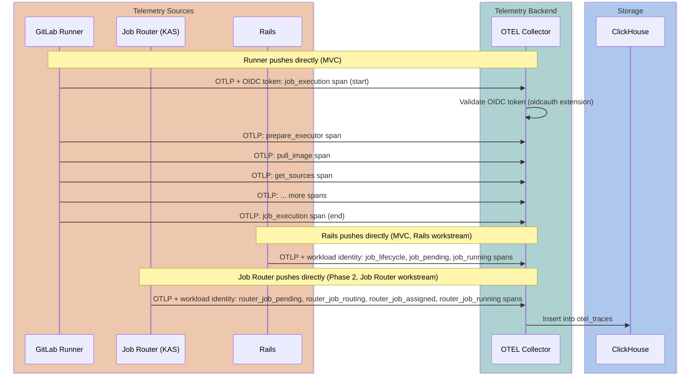
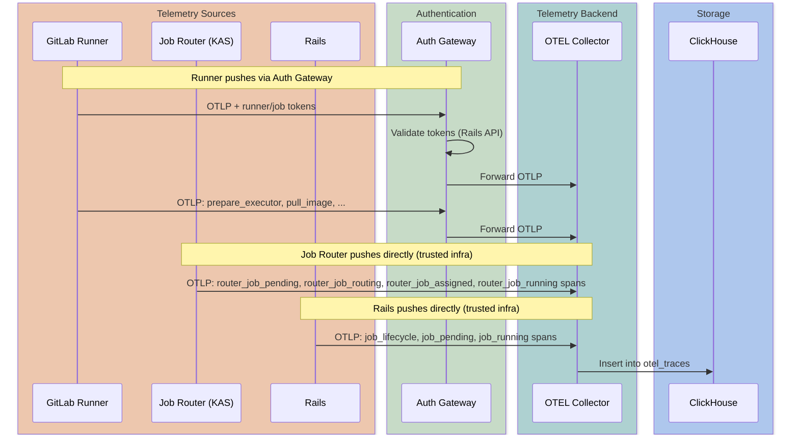
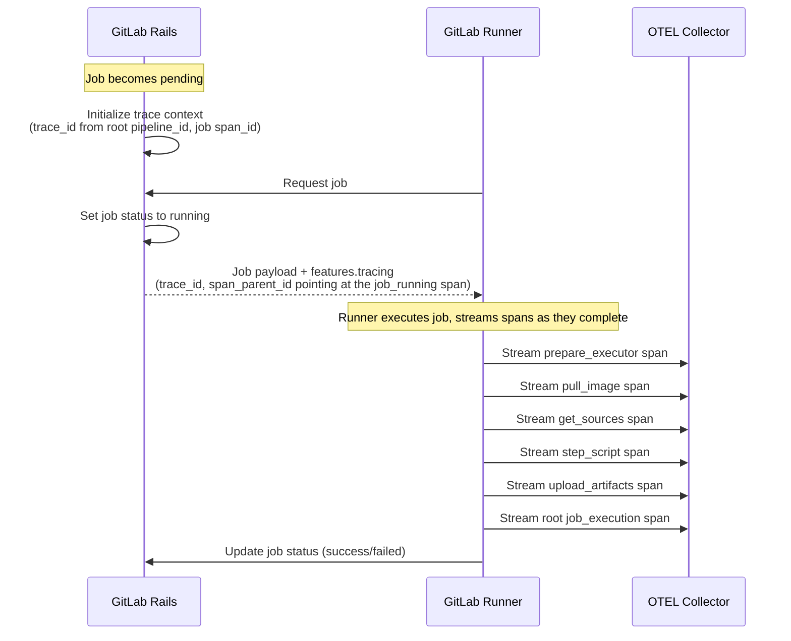
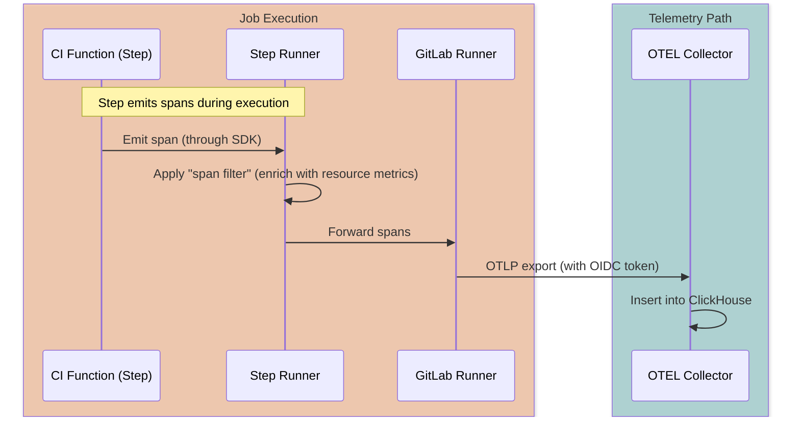



## Summary

This design document proposes a **service-agnostic OTLP telemetry backend for GitLab**,
with **CI Job Telemetry as its first product feature**.
CI Job Telemetry gives DevOps engineers visibility into CI job execution performance —
including CI Functions (steps), resource usage, and error diagnostics —
using OpenTelemetry (OTLP) standards.

While the MVC serves internal teams (DevExp as Customer 0) through Grafana dashboards,
the long-term goal is a **product feature available to all GitLab customers** on GitLab.com,
Self-Managed, and Dedicated. Users will be able to analyze pipeline behavior, identify
optimization opportunities, and leverage AI to improve their pipelines.
MVC shortcuts (for example, OIDC auth, Grafana-only visualization) are chosen specifically
because they are compatible with the long-term product path.

The telemetry backend is built on a **service-agnostic OTLP traces store**:
traces land in a generic [`otel_traces`](#clickhouse-schema) table
(auto-created by the [OTEL Collector ClickHouse exporter](https://github.com/open-telemetry/opentelemetry-collector-contrib/tree/main/exporter/clickhouseexporter)),
while domain-specific [Materialized Views](#clickhouse-schema) route data into
purpose-built tables filtered by `ServiceName`.
This architecture allows any GitLab component to emit standard OTLP traces
and benefit from the same ingestion pipeline, storage, and query infrastructure.

### CI Job Telemetry — first consumer

When operating complex CI/CD pipelines at scale, teams need visibility into system-level metrics such as
Docker image pull times, Git operation durations, cache hit/miss rates, and artifact upload/download times.
No robust solution exists today — existing ad-hoc instrumentation runs from jobs, is brittle to maintain,
and cannot capture operations that happen after the `after_script` block.

Multiple sources contribute spans for the same CI job:

1. **Rails**: Job lifecycle spans (`job_lifecycle`, `job_pending`, `job_running`)
1. **Job Router**: Scheduling and routing metrics (pending→accepted, admission control)
1. **Runner**: Execution-level metrics (CI Functions, resource operations)

Each component pushes telemetry directly to the backend
using standard OTEL exporters, authenticated through OIDC/workload identity (MVC) or a
token-based gateway (long-term).
See [Job Router telemetry](#workstream-job-router-telemetry) for Job Router integration details.
CI Functions are the unified abstraction for all timed operations within a job, encompassing:

- Traditional job sections (`prepare`, `script`, `after_script`)
- Built-in operations (image pull, cache restore, artifact upload)
- [CI Functions](https://docs.gitlab.com/ci/steps/) as the platform adopts the new declarative model

This telemetry system captures timing and metadata for any CI Function type,
providing a foundation for comprehensive CI/CD observability regardless of how jobs are defined.

## Key Dependencies

This section summarizes the components required for CI Job Telemetry and their current status.

### Component availability

| Component | Owner | Status | Timeline | Notes |
|-----------|-------|--------|----------|-------|
| OTEL Collector | Observability | Production-ready | Available | Standard OTEL Collector with [ClickHouse exporter](https://github.com/open-telemetry/opentelemetry-collector-contrib/tree/main/exporter/clickhouseexporter) — writes to `otel_traces`. Uses [loadbalancing exporter](https://github.com/open-telemetry/opentelemetry-collector-contrib/tree/main/exporter/loadbalancingexporter) for trace-ID-based routing at scale. A single deployment serves all telemetry; separate exporter pipelines write to different CH instances (see [design decision](#design-decisions)). |
| ClickHouse instance (Observability) | Observability | Enabled | [Phase 1](#phase-1-mvc-gitlabcom-hosted-runners) | Internal-only ClickHouse instance for operational dashboards and cross-service trace correlation ([MR](https://gitlab.com/gitlab-com/gl-infra/observability/clickhouse-cloud/-/merge_requests/102), merged 2026-02-12). Not exposed to end-users. |
| Feature negotiation + trace context | CI Platform | Not started | [Phase 1](#phase-1-mvc-gitlabcom-hosted-runners): ~1 week | Rails job payload changes: `features.tracing` ([&20945](https://gitlab.com/groups/gitlab-org/-/epics/20945)) |
| Runner instrumentation | Runner Core | [In progress](https://gitlab.com/groups/gitlab-org/-/epics/20633) | [Phase 1](#phase-1-mvc-gitlabcom-hosted-runners): ~3 weeks (basic instrumentation: ~1w, CI Functions spans: ~2w) | Collects telemetry spans, pushes to OTEL Collector with OIDC auth. Blocked on feature negotiation + trace context. |
| CI telemetry Materialized View | CI Platform | Not started | [Phase 3](#phase-3-insights-layer) | `ci_job_telemetry_traces` MV over auto-created `otel_traces` table ([schema](#clickhouse-schema)). Deferred until query patterns are established. |
| Rails lifecycle spans | CI Platform / Pipeline Execution | Not started | [Phase 1](#phase-1-mvc-gitlabcom-hosted-runners) | `job_lifecycle`, `job_pending`, `job_running` spans from Rails state machine ([Rails integration](#workstream-rails-integration)). Pulled into MVC for end-to-end visibility including Sidekiq/`PipelineProcessWorker` delays. |
| Job Router telemetry | Runner Core | Not started | [Phase 2](#phase-2-complete-telemetry-pipeline) | Scheduling spans from KAS Job Router (`router_job_pending` through `router_job_running`) ([Job Router telemetry](#workstream-job-router-telemetry)) |
| Authentication gateway | TBD | Not started | [Phase 2](#phase-2-complete-telemetry-pipeline) (Beyond GitLab.com workstream) | Long-term standard auth for all runners; replaces MVC's OIDC shortcut |

### MVC timeline constraints

- **Target**: GitLab internal runners building `gitlab-org` projects only (Customer 0 use case).
  Once validated, expand to all GitLab.com Hosted Runners (same trust model and network access, higher volume).
- **Estimated effort**: ~4-5 weeks end-to-end (critical path), with some parallelism possible
  - CI Platform: `features.tracing` payload (~1 week) → unblocks Runner
  - Runner basic instrumentation: `features.tracing` consumption + first `job_execution` span + built-in stage spans (~1 week, started) → depends on CI Platform payload changes
  - Runner CI Functions spans: (~2 weeks, conservative) → after basic instrumentation
- **Blocking dependencies**:
  - ~~ClickHouse instance enablement for CI telemetry~~ (done — [MR](https://gitlab.com/gitlab-com/gl-infra/observability/clickhouse-cloud/-/merge_requests/102) merged 2026-02-12)
  - OTEL Collector deployment (standard component, managed by Observability; single well-known endpoint for all telemetry sources)

See [Cross-Team Dependencies](#cross-team-dependencies) for detailed breakdown. For the post-MVC roadmap (Job Router telemetry, customer-owned runners, Self-Managed/Dedicated), see [Phase 2](#phase-2-complete-telemetry-pipeline) and [Phase 3](#phase-3-insights-layer).

## Motivation

When operating complex CI/CD pipelines at scale, teams need holistic visibility into
**end-to-end CI job execution performance** — not just pipeline and job runtimes,
but the detailed breakdown of every stage a job passes through:

- **Scheduling and routing**: Queue time, routing decisions, runner assignment latency
- **Environment preparation**: Docker image pull times, executor setup duration
- **Source code operations**: Clone/fetch times, operation types, and parameters used
- **Caching**: Hit/miss rates, download/upload times per cache key
- **Artifacts**: Upload/download durations and sizes
- **Script execution**: User-defined script execution (`script`, `before_script`, `after_script` blocks)
- **CI Functions**: Individual functions as jobs migrate to the declarative model

This visibility is valuable **regardless of the executor type or whether jobs use the
steps/CI Functions model**. Every CI job already passes through preparation, git, cache,
artifact, and script stages — the Runner already tracks these as
[build sections](https://docs.gitlab.com/runner/development/#log-a-build-section).
The CI Functions model adds finer granularity, but the foundational telemetry applies to all jobs.

These metrics help identify problems early and assess impact without manually diving into separate job logs.

### Customer verbatim

1. "To analyze a specific job, some more detailed information would be required for the job in addition to the pipeline.
   The following parameters would help here: Duration (split into the sections of the log to identify
   the possible bottlenecks, and with the custom collapsible sections,
   it is possible to split the job into separate steps to analyze)" - [Epic #11835](https://gitlab.com/groups/gitlab-org/-/epics/11835#note_1631621923)

1. Users can only see what's happening at the application layer through job logs.
   To locate root causes, users need to correlate GitLab job-level data with runner and infrastructure-level
   information at the same moment.

### Goals

- **Product goal**: Enable DevOps engineers to analyze their CI/CD pipeline performance, identify bottlenecks, and leverage AI to optimize their pipelines — on GitLab.com, Self-Managed, and Dedicated
- **MVC goal**: Provide the DevExp team (as Customer 0) with data to build Grafana dashboards, validating the telemetry pipeline before exposing it to all customers
- Provide a service-agnostic OTLP telemetry backend that any GitLab component can emit traces to
- Enable GitLab Runner to report structured telemetry data for each stage and CI Function executed during a job
- Design a flexible schema that supports all executor types, current job stages, and the CI Functions model
- Store telemetry in ClickHouse for efficient querying and trend analysis
- Enable automated alerting when metrics deviate from baselines or show degradation trends
  (for example, cache hit rate drops, artifact upload times increase)
- Enable users and AI agents to identify optimization opportunities:
  - Pipeline bottlenecks and hotspots
  - Work parallelization opportunities
  - Job wait time reduction
  - Cache hit rate improvements
  - Job runtime cost reduction (CI minutes, cloud costs)
  - Overall pipeline duration reduction

### Non-Goals

- **User-level telemetry**: Custom metrics from arbitrary user scripts (test coverage, custom timings) are out of scope
  and partially addressed by the existing [`metrics_reports` feature](https://docs.gitlab.com/ci/testing/metrics_reports/).
  This is distinct from CI Function telemetry, which uses structured APIs provided by the step-runner.
- **In-product visualization in MVC**: The MVC focuses on data collection and Grafana dashboards;
  in-product UI visualization in GitLab is planned for [Phase 3](#phase-3-insights-layer)

## Key definitions

The following terms are used throughout this document. Implementation details (such as which
ID maps to which OTEL concept) are defined here once to keep the rest of the document
resilient to future changes.

| Term | Definition |
|------|-----------|
| **OTLP** | [OpenTelemetry Protocol](https://opentelemetry.io/docs/specs/otel/protocol/); the wire format used by all components (Runner, Rails, Job Router) to export spans to the OTEL Collector over HTTP or gRPC. |
| **Span** | A single timed operation within a trace, identified by a unique **Span ID** (randomly generated 64-bit value). Child spans reference their parent through `parent_span_id`, forming a tree. |
| **CI Function** | A discrete, timed operation within a CI job — built-in stages (`pull_image`, `restore_cache`, `upload_artifacts`, `step_script`), and future declarative [steps](https://docs.gitlab.com/ci/steps/). Each CI Function is represented as a span under the job's parent span. |
| **Pipeline trace** | All spans sharing the same Trace ID, representing a CI pipeline hierarchy's execution. There is no explicit pipeline root span — jobs are top-level spans grouped by a shared Trace ID. Not to be confused with an OTEL "trace" resource — this is simply the collection of spans that share the same Trace ID. |
| **Trace ID** | A 128-bit identifier that groups all spans for a pipeline hierarchy. Deterministically derived from the **root** pipeline ID (see [trace context initialization](#multi-source-trace-coordination)). All jobs across parent and child pipelines share this value. |
| **Job span** | A span representing a single job's execution lifecycle. In the root pipeline, job spans are root-level spans (no parent). In child pipelines, job spans are children of the trigger (bridge) job's span. The Rails `job_lifecycle` span serves as the job span, with the Runner's `job_execution` span nested under it. |
| **Parent span ID** | The span ID passed to the Runner in the job payload (`span_parent_id`) so it can parent its `job_execution` span under the correct Rails span. Contains the `job_running` span's ID (deterministically derived from the job ID). For child pipeline jobs, the `job_lifecycle` span itself is a child of the trigger (bridge) job's span. |
| **`features.tracing`** | A unified object in the `/api/v4/jobs/request` response that combines feature negotiation, trace context, and endpoint configuration. Its presence signals that telemetry is enabled; it always contains `trace_id` (pipeline), `span_parent_id` (the Rails `job_running` span ID for this job), and `otel_endpoints` (array of endpoint objects with URL and optional auth configuration; single entry for MVC, see [future work](#future-work-byo-otlp-endpoints) for a potential second entry). See [job payload changes](#job-payload-changes). |
| **`ServiceName`** | The OTEL [service name](https://opentelemetry.io/docs/specs/semconv/resource/#service) resource attribute identifying the emitting component (for example, `gitlab-ci-runner`, `gitlab-ci-job-router`, `gitlab-ci-rails`). Used to filter and route spans into domain-specific Materialized Views. |
| **Resource attributes** | OTLP resource-level key-value pairs describing the entity producing telemetry (for example, `ci.pipeline.id`, `ci.job.id`, `ci.project.id`, `ci.pipeline.source`). Stored in `otel_traces.ResourceAttributes`. Stable per TracerProvider instance — in this design, per job. |
| **Span attributes** | OTLP span-level key-value pairs describing a specific operation (for example, cache key, artifact name, transfer bytes). Stored in `otel_traces.SpanAttributes` and denormalized into typed columns in `ci_job_telemetry_traces`. |
| **`traversal_path`** | A denormalized namespace hierarchy key (for example, `0/…/group_id/project_id/`) computed at insert time through a ClickHouse dictionary lookup, enabling efficient org/group/project-level aggregation queries. |
| **OTEL Collector** | An [OpenTelemetry Collector](https://opentelemetry.io/docs/collector/) instance that receives, processes, and exports spans to ClickHouse. A single deployment serves all telemetry sources, with separate exporter pipelines per ClickHouse instance (see [design decision](#design-decisions)). Managed by the Observability team. |
| **`otel_traces`** | The service-agnostic ClickHouse table where the OTEL Collector writes raw spans. Follows the standard OTEL schema and is shared across all instrumented services. |
| **`ci_job_telemetry_traces`** | ([Phase 3](#phase-3-insights-layer)) A ClickHouse [Materialized View](https://clickhouse.com/docs/en/sql-reference/statements/create/view#materialized-view) that projects CI-specific columns from `otel_traces` into a query-optimized schema. Fires on insert into `otel_traces`, filtering by `ServiceName`. This is the primary table queried by the [query layer](https://gitlab.com/gitlab-org/gitlab/-/issues/590589). |
| **Job Router** | The [KAS](https://docs.gitlab.com/ee/administration/clusters/kas/) module responsible for CI job scheduling and runner assignment. Emits routing spans (`router_job_pending` through `router_job_running`) in [Phase 2](#phase-2-complete-telemetry-pipeline). |
| **Capability fingerprint** | A stable hash that uniquely identifies all factors determining job-runner compatibility: tags, runner type (instance/group/project), protected status, and project access. Runners sharing the same fingerprint can handle the same set of jobs. Defined in the [Runner Job Router architecture](/handbook/engineering/architecture/design-documents/runner_job_router/). Included as a span attribute in the MVC (Rails workstream), enabling telemetry queries like "which capability groups have slow cache restores?" or per-capability-group SLOs. |

## Proposal

Implement a telemetry submission endpoint using **OpenTelemetry Protocol (OTLP)**.
Each CI Function is represented as a span under the [job span](#key-definitions).
Spans are submitted in near-real-time batches (the OTEL SDK batches every 5 seconds by default), enabling:

- **Near-real-time visibility**: See job progress within seconds of state changes, not just after completion
- **Long-running job support**: No need to wait for job completion to analyze performance
- **Multi-source telemetry**: Job Router, Runner, and Rails push spans independently to the telemetry backend

**Why a dedicated endpoint** (vs. parsing trace logs):

1. **Simplicity**: A dedicated endpoint is straightforward to implement and maintain
1. **Performance**: Avoids the computational cost of parsing potentially large job logs
1. **Reliability**: Structured data is less prone to parsing errors than log text
1. **Flexibility**: Allows the Runner to report metrics not present in logs (for example, internal timing data)
1. **Standards support**: Enables use of industry-standard protocols (OTLP) that would be impractical to embed in log streams

**Why OTLP** (vs. custom JSON):

1. **Industry standard**: OpenTelemetry is the widely-adopted standard for observability data
1. **Span hierarchy**: CI Functions naturally map to child spans under a job parent span
1. **Library support**: Go has mature OTLP support for Runner; standard OTEL Collector handles server-side ingestion
1. **Future integration**: Enables potential integration with GitLab Observability (SigNoz) and external platforms
1. **Semantic conventions**: Rich, standardized attributes for CI/CD telemetry

**Backend-agnostic design**:

The telemetry backend is designed as a **general-purpose OTEL traces store**, not a CI-specific pipeline.
All telemetry lands in a standard `otel_traces` table following the [ClickStack traces schema](https://clickhouse.com/docs/use-cases/observability/clickstack/ingesting-data/schemas#traces).
CI-specific views (for example, `ci_job_telemetry_spans`) are populated through Materialized Views filtered by `service_name`.
This approach:

1. **Enables reuse**: Other GitLab components can emit traces to the same backend without schema changes
1. **Follows standards**: The `otel_traces` schema aligns with industry-standard OTEL storage patterns
1. **Simplifies ingestion**: No custom transformation logic in the ingestion path - standard OTEL Collector writes directly to ClickHouse
1. **Decouples concerns**: CI-specific denormalization and query optimization happen in the MV layer, not the ingestion layer

### High-level architecture

The telemetry pipeline uses a standard OTEL Collector with the [ClickHouse exporter](https://github.com/open-telemetry/opentelemetry-collector-contrib/tree/main/exporter/clickhouseexporter)
to write OTLP data directly to ClickHouse, bypassing PostgreSQL staging.

#### MVC (GitLab.com hosted runners)



On GitLab.com, all components authenticate directly to the OTEL Collector using standard mechanisms —
no custom auth gateway is needed:

- **Runner** uses [OIDC tokens](https://opentelemetry.io/docs/collector/configuration/#authentication)
  validated by the Collector's
  [`oidcauth` extension](https://github.com/open-telemetry/opentelemetry-collector-contrib/tree/main/extension/oidcauthextension)
- **Job Router** and **Rails** use
  [workload identity](https://cloud.google.com/kubernetes-engine/docs/concepts/workload-identity)
  as internal components running in GitLab-managed infrastructure
- Where workload identity is available,
  [Identity-Aware Proxy (IAP)](https://cloud.google.com/iap/docs/concepts-overview)
  can further simplify access control

#### Post-MVC (self-managed / Dedicated)



For self-managed deployments, and as the long-term standard for all runners,
a lightweight token-based authentication gateway validates runner and job tokens
against a [Rails endpoint](#token-based-authentication-gateway) before forwarding OTLP requests.

#### Common architecture

**Direct push architecture**: Each component uses standard OTEL exporters to push telemetry
directly to a single, well-known [OTEL Collector](#key-definitions) endpoint. A shared
[Trace ID](#key-definitions) stitches all traces together across components. Rails sends the
endpoint configuration to the Runner in the [`features.tracing`](#job-payload-changes) job payload
(`otel_endpoints` — an array of endpoint objects carrying URL and authentication details), so
the feature works automatically for any runner without static configuration — enablement
depends on runner version and namespace plan, not manual setup.

- **Runner** (MVC): Pushes CI Function spans (prepare, pull_image, get_sources, etc.)
- **Rails** (MVC, [Rails integration](#workstream-rails-integration) workstream): Pushes job lifecycle spans (`job_lifecycle`, `job_pending`, `job_running`) — covers bridge jobs and external jobs out-of-the-box, and provides visibility into Sidekiq/`PipelineProcessWorker` delays
- **Job Router** (Phase 2, [Job Router telemetry](#workstream-job-router-telemetry) workstream): Pushes job routing spans (pending → routing → admitted → assigned → running)

**Why direct push** (vs. routing through a single proxy like KAS):

- **Standard OTEL exporters**: Each component uses the standard OTEL SDK — no custom streaming protocols needed
- **No single point of failure**: Components push independently; one component's failure doesn't affect others
- **Simpler architecture**: No intermediate proxy to maintain, no `FollowSpan()` channels between components
- **Decoupled deployment**: Each component's telemetry can be enabled/disabled independently
- **Latency**: The OTEL SDK creates batches at short intervals (5 seconds by default, or max span count),
  which is effectively near-real-time for our use case

**Service-agnostic telemetry backend**:

The `otel_traces` table stores all OTLP traces from any service and is auto-created by the
OTEL Collector ClickHouse exporter. The ingestion path is deliberately simple —
a standard **OTEL Collector writes directly to ClickHouse** with no intermediate queuing layer,
making it straightforward to integrate with the Observability team's
[distributed tracing infrastructure](https://gitlab.com/groups/gitlab-com/gl-infra/-/epics/1517) as it matures.
For MVC, DevExp queries `otel_traces` directly via Grafana. In [Phase 3](#phase-3-insights-layer),
a Materialized View filters by `ServiceName` and denormalizes CI-specific attributes into
`ci_job_telemetry_traces` (see [ClickHouse schema](#clickhouse-schema)).

## Scope and Phases

### Phase 1: MVC (GitLab.com hosted runners)

The MVC focuses on establishing the core telemetry pipeline for GitLab.com:

1. **Runner telemetry collection**: Instrument GitLab Runner to collect timing and metadata for built-in build stages
   (`prepare_executor`, `pull_image`, `get_sources`, `restore_cache`, `step_script`, `after_script`, `archive_cache`, `upload_artifacts`)
1. **Rails job lifecycle spans**: Rails emits `job_lifecycle`, `job_pending`, and `job_running` spans covering
   the full job state machine (`created` → `pending` → `running` → `finished`). This provides end-to-end
   visibility including Sidekiq/`PipelineProcessWorker` delays that are invisible to the Runner. See
   [Rails integration workstream](#workstream-rails-integration).
1. **Telemetry backend**: Deploy OTEL Collector with a single well-known endpoint for all telemetry sources.
   At scale, the [loadbalancing exporter](https://github.com/open-telemetry/opentelemetry-collector-contrib/tree/main/exporter/loadbalancingexporter) routes spans by trace ID to backend collectors, ensuring
   all spans for a job land on the same instance.
1. **ClickHouse schema**: The `otel_traces` table is [auto-created](https://github.com/open-telemetry/opentelemetry-collector-contrib/tree/main/exporter/clickhouseexporter) by the OTEL Collector on the Observability team's ClickHouse instance — no migrations needed for MVC. The `ci_job_telemetry_traces` Materialized View is deferred to [Phase 3](#phase-3-insights-layer).
1. **Internal dashboards**: Enable the DevExp team (Customer 0) to build Grafana dashboards by querying `otel_traces` directly (filtering by `ServiceName = 'gitlab-ci-runner'`) for GitLab.com CI/CD performance

Once validated with internal runners, telemetry expands to **all GitLab.com Hosted Runners**
(customer projects). This requires no architectural changes — the same trust model (OIDC),
network access, and Collector infrastructure apply. The only difference is ingestion volume.

**MVC explicitly excludes** (all deferred to Phase 2, Phase 3, or future work):

- `ci_job_telemetry_traces` Materialized View ([Phase 3](#phase-3-insights-layer) — deferred until query patterns are established)
- BYO OTLP endpoints (customer-configured OTLP destinations) — [future work](#future-work-byo-otlp-endpoints)
- Job Router telemetry (KAS spans)
- Self-managed runners reporting to GitLab.com
- Self-Managed and Dedicated instance deployment
- In-product UI visualization
- Automated alerting
- Resource usage metrics (CPU, memory, disk I/O)
- CI Functions DAG telemetry (nested function calls)

### Phase 2: Complete telemetry pipeline

After the MVC ships, multiple workstreams can proceed **in parallel** to complete the
telemetry pipeline across all components and deployment targets:

1. **Workstream: [Job Router telemetry](#workstream-job-router-telemetry)**: Add telemetry from KAS Job Router (scheduling spans: `router_job_pending`, `router_job_routing`, `router_job_admitted`, `router_job_assigned`, `router_job_running`)
1. **Workstream: [Beyond GitLab.com hosted runners](#workstream-beyond-gitlabcom-hosted-runners)**: Extend telemetry to self-hosted runners on GitLab.com (tier b — requires token-based auth gateway) and Self-Managed/Dedicated (tier c — requires shipping an OTEL Collector; Dedicated through GET/Instrumentor; Self-Managed depends on [OAK](/handbook/engineering/architecture/design-documents/selfmanaged_segmentation/))
1. **Workstream: [CI Functions DAG](#workstream-ci-functions-dag)**: Support nested spans for CI Functions calling other functions

### Phase 3: Insights layer

Gated on the MVC **Rails integration** workstream, which provides the full job
lifecycle data (queue time, job duration, bridge job visibility) needed for meaningful
user-facing features. Multiple workstreams can proceed **in parallel** within this phase:

1. **Workstream: [Data consumable by users](#workstream-data-consumable-by-users)**: Aggregated metrics (MVs for p50/p95 durations, cache hit rates), GraphQL API, GLQL integration, and Duo AI/DAP
1. **Workstream: [Alerting](#workstream-alerting)**: Baseline alerting on metric deviations (depends on aggregated metrics)
1. **Workstream: [In-product visualization](#workstream-in-product-visualization)**: Build GitLab UI dashboards for pipeline performance insights (depends on GraphQL API)

## Cross-Team Dependencies

This initiative requires coordination across multiple teams. MVC work items can proceed in parallel once the design is approved:

| Team/Domain                      | Responsibility                                                                                                                                                          | Blocking     | Status                   |
| -------------------------------- | ----------------------------------------------------------------------------------------------------------------------------------------------------------------------- | ------------ | ------------------------ |
| **Runner Core** (Verify)         | [Instrument Runner to collect and push telemetry spans](https://gitlab.com/gitlab-com/content-sites/handbook/-/merge_requests/17980#note_3022842795) using standard OTEL exporter | Yes (MVC)    | Design phase             |
| **TBD**                          | [Authentication gateway](#token-based-authentication-gateway) (token validation, OTEL forwarding) — standard auth for all runners (Phase 2, Beyond GitLab.com workstream); MVC uses OIDC as interim shortcut | No (Phase 2) | Not started              |
| **CI Platform** (Verify)         | [Rails auth endpoint](#token-based-authentication-gateway) (`POST /api/v4/internal/ci/telemetry/auth`)                                                                    | Post-MVC     | Not started (~1 week)    |
| **Observability**                | ClickHouse instance hosting `otel_traces` (auto-created by the OTEL Collector) on the [Observability ClickHouse instance](https://gitlab.com/gitlab-com/gl-infra/observability/clickhouse-cloud/-/merge_requests/102) | Yes (MVC)    | Coordination needed      |
| **CI Platform** (Verify)         | `ci_job_telemetry_traces` Materialized View ([schema](#clickhouse-schema)) | [Phase 3](#phase-3-insights-layer) | Not started              |
| **Pipeline Execution** (Verify)  | [Rails job lifecycle telemetry](#workstream-rails-integration)                                                                                                           | Yes (MVC)    | Not started              |
| **Runner Core** (Verify)         | [Job Router telemetry integration](#workstream-job-router-telemetry)                                                                                                     | No (Phase 2) | Future                   |
| **Observability**                | OTEL Collector deployment and management ([collaboration path](#relationship-to-gitlab-observability)); potential integration with GitLab Observability tracing infrastructure | Yes (MVC)    | Coordination needed      |
| **Distribution**                 | [Self-Managed/Dedicated packaging](#self-managed-and-dedicated-instances)                                                                                                | No (Phase 2) | Future                   |

**Notes**:

- **Ingestion pipeline**: A standard [OTEL Collector](https://opentelemetry.io/docs/collector/) with the [ClickHouse exporter](https://github.com/open-telemetry/opentelemetry-collector-contrib/tree/main/exporter/clickhouseexporter) writes
  OTLP data directly to the auto-created `otel_traces` table. In [Phase 3](#phase-3-insights-layer), a Materialized View denormalizes CI-specific
  attributes into `ci_job_telemetry_traces`. See [ClickHouse schema](#clickhouse-schema) for details.
- **ClickHouse instances**: Two ClickHouse instances serve different purposes on GitLab.com:
  - **Observability CH** (MVC): The [Observability team's instance](https://gitlab.com/gitlab-com/gl-infra/observability/clickhouse-cloud/-/merge_requests/102)
    hosts `otel_traces` for internal/operational use (Grafana dashboards,
    cross-service trace correlation). This instance is **not exposed to end-users**.
  - **Production CH** (post-MVC): The main production ClickHouse instance receives a filtered/sampled
    subset of `ci_job_telemetry_traces` for customer-facing features (GraphQL, GLQL, Duo). Rails queries
    this instance through `ClickHouse::Client`. Different retention and sampling policies apply.

  The OTEL Collector uses separate exporter pipelines per instance (see [design decision](#design-decisions)).
- **Observability collaboration**: The Observability team is building distributed tracing infrastructure for all GitLab
  services (see [epic 1517](https://gitlab.com/groups/gitlab-com/gl-infra/-/epics/1517)). They may provide the OTEL Collector
  deployment and ClickHouse hosting as part of their `tenant-observability-stack`. See [Relationship to GitLab Observability](#relationship-to-gitlab-observability).
- For MVC (GitLab.com), runners authenticate with OIDC/workload identity directly to the OTEL Collector, avoiding the need for a custom auth proxy.
  For self-managed (post-MVC), a [token-based authentication gateway](#token-based-authentication-gateway) validates runner and job tokens.

**Key coordination points for MVC**:

- Observability team coordination for OTEL Collector deployment and ClickHouse instance hosting
- Runner Core team coordination for telemetry instrumentation implementation

## Cost Estimation (GitLab.com)

### Assumptions

| Parameter | Value | Notes |
|-----------|-------|-------|
| Jobs per day | 7,200,000 | GitLab.com estimate |
| Spans per job | 8 | Average (not all jobs have all stages) |
| Bytes per span (uncompressed) | ~500 | Fixed columns + variable metadata |
| Compression ratio | ~3x | LZ4 compression |
| Bytes per span (compressed) | ~170 | After compression |
| Retention period | 30 days (post-MVC) | MVC uses 3-day retention (matching current Observability CH); extend to at least 30 days post-MVC |

### Storage calculation

| Metric | Calculation | Result |
|--------|-------------|--------|
| Daily spans | 7.2M jobs × 8 spans | 57.6M spans/day |
| Daily storage | 57.6M × 170 bytes | ~9.8 GB/day |
| Total storage | 9.8 GB × 30 days | **~294 GB** |

### Cost breakdown

| Component | Estimate | Notes |
|-----------|----------|-------|
| ClickHouse storage | ~$7/month | 294 GB at $22/TB/month |
| Ingestion compute | Shared | OTEL Collector (autoscaled) |
| Query compute | Shared | Existing ClickHouse instance |
| Data ingress | Free | Runners, OTEL Collector, and ClickHouse all on GCP |
| Data egress | ~$1/month | 30 GB inter-region at $0.036/GB (dashboard queries) |

Cost assumes CI telemetry shares the [Observability team's ClickHouse instance](https://gitlab.com/gitlab-com/gl-infra/observability/clickhouse-cloud/-/merge_requests/102), so incremental cost is storage and egress only.
See [pricing calculator](https://clickhouse.com/pricing?plan=enterprise&provider=gcp&region=gcp-us-east1&useCase=observability&hours=24&computeMinSize=8&computeMaxSize=8&replicas=3&storage=300GB&storageCompressed=true&backupFrequency=24&backupRetention=30&estimateBackup=true&fullBackup=300GB&incrementalBackup=10GB&transfers[0][type]=inter-region&transfers[0][value]=30GB&transfers[0][region]=gcp-us-central1) for detailed assumptions (ClickHouse Cloud Enterprise, GCP).

## Design and implementation details

### Telemetry ingestion endpoint

Each telemetry source uses a standard OTEL exporter to push spans to the OTEL Collector endpoint.
For MVC (GitLab.com), runners authenticate with OIDC directly to the Collector — no custom auth gateway
is needed. For MVC, Runner telemetry and Rails job lifecycle spans are in scope; Job Router telemetry is a Phase 2 workstream.

The Runner uses the OpenTelemetry Go SDK (`go.opentelemetry.io/otel`) to create spans and export them
through OTLP/HTTP or OTLP/gRPC. The OTEL SDK handles batching (default: 5-second intervals or max span count,
whichever comes first).

**Export benefits**:

- Standard OTEL SDK handles batching, retries, and backpressure
- No custom protocol or client implementation needed
- Each component is independent - no single point of failure
- Spans from different sources are stitched together through shared `trace_id`

**Authentication approach**
([discussion](https://gitlab.com/gitlab-com/content-sites/handbook/-/merge_requests/17980#note_3072920006),
[OIDC suggestion](https://gitlab.com/gitlab-com/content-sites/handbook/-/merge_requests/17980#note_3078583475)):

Since GitLab.com runners operate on infrastructure we control, we use standard cloud-native
identity mechanisms through the OTel Collector's built-in
[authentication extensions](https://opentelemetry.io/docs/collector/configuration/#authentication):

- **OIDC tokens**: Runners authenticate using short-lived OIDC tokens issued by the GitLab instance,
  verified by the Collector's
  [`oidcauth` extension](https://github.com/open-telemetry/opentelemetry-collector-contrib/tree/main/extension/oidcauthextension).
- **Workload identity**: On GCP, runners can use
  [Workload Identity Federation](https://cloud.google.com/iam/docs/workload-identity-federation) to
  authenticate without managing secrets.
- **Identity-Aware Proxy (IAP)**: Depending on the ACL granularity required, GCP
  [IAP](https://cloud.google.com/iap) can provide additional network-level access control in front
  of the Collector.

**Authentication flow**:

1. Runner obtains an OIDC token from the GitLab instance (or uses workload identity credentials)
1. Runner includes the token in OTLP request headers (`Authorization: Bearer <token>`)
1. OTel Collector's `oidcauth` extension validates the token against the GitLab OIDC provider
1. On success, Collector processes and exports spans to ClickHouse
1. On failure, Collector returns `401 Unauthorized`

This approach avoids a custom auth proxy, uses battle-tested OTel ecosystem components, and aligns
with zero-trust principles. For trusted internal components (Job Router, Rails), service-scoped
workload identity is sufficient instead of per-job token validation
([discussion](https://gitlab.com/gitlab-com/content-sites/handbook/-/merge_requests/17980#note_3075176238)).

For **self-managed** and Dedicated deployments, and as the long-term standard for all runners,
a [token-based authentication gateway](#token-based-authentication-gateway) is planned for
[Phase 2 (Beyond GitLab.com workstream)](#workstream-beyond-gitlabcom-hosted-runners), replacing the MVC's OIDC shortcut.

NOTE:
OIDC/workload identity is the MVC authentication approach for GitLab.com hosted runners.
For self-managed and Dedicated runners, a [token-based authentication gateway](#token-based-authentication-gateway)
is planned for Phase 2. Once self-managed auth is worked out, we should revisit whether OIDC
can be kept as a preferred standard rather than replaced by the gateway
([discussion](https://gitlab.com/gitlab-com/content-sites/handbook/-/merge_requests/17980#note_3128555041)).

**Authentication responsibility by path**:

| Path | Auth Handler | Backend Coupling | Notes |
|------|--------------|------------------|-------|
| Runner → OTEL Collector (GitLab.com) | OIDC / workload identity | None | Standard OTEL auth extension; no custom proxy needed |
| Runner → Auth Gateway → Backend (self-managed) | Token-based gateway | None | Gateway validates runner/job tokens, forwards to backend as trusted source |
| Job Router → Backend | Internal trust (workload identity) | None | Job Router runs within GitLab infrastructure |
| Rails → Backend | Internal trust (workload identity) | None | Rails runs within GitLab infrastructure |

This design keeps the telemetry backend decoupled from the CI/CD domain. On GitLab.com, workload
identity provides zero-trust authentication without custom components. For self-managed, the
token-based gateway handles validation and forwards to the backend.

**HTTP status codes** (OTLP/HTTP):

- `200 OK`: Spans accepted for processing
- `400 Bad Request`: Malformed span or schema validation failure
- `401 Unauthorized`: Invalid or missing job/runner token
- `403 Forbidden`: Runner not assigned to this job
- `429 Too Many Requests`: Rate limit exceeded
- `503 Service Unavailable`: Backend temporarily unavailable

**Error handling**: Validation failures return HTTP errors. The Runner logs errors but does not
fail the job, as telemetry is non-critical. Transient errors (for example, `503`) are retried with
backoff by the OTEL SDK. Buffered spans can be flushed after job completion within a grace period
(for example, 60 seconds) since authentication uses runner token + job association rather than job token validity.

#### Span format

Each streamed span follows the [OTLP specification](https://opentelemetry.io/docs/specs/otlp/). Each CI Function
is a span with:

- **Span name**: The function name (for example, `pull_image`, `restore_cache`)
- **Trace ID**: The pipeline's [Trace ID](#key-definitions) (shared across all jobs in the pipeline)
- **Span ID**: Randomly generated 16-byte ID by the [OpenTelemetry SDK](https://opentelemetry.io/docs/specs/otel/trace/sdk/#id-generators), ensuring uniqueness even for parallel spans with the same name (for example, multiple concurrent `download_artifact` spans)
- **Parent span ID**: The parent span's ID (for example, CI Function spans reference `job_execution` as parent)
- **Timestamps**: `start_time` and `end_time` as OTLP timestamps (see [Design Decision: Clock synchronization](#design-decisions))
- **Status**: Uses the standard OTLP `StatusCode` (`STATUS_CODE_OK`, `STATUS_CODE_ERROR`, `STATUS_CODE_UNSET`) and `StatusMessage` (error details for failed operations)
- **Attributes**:
  - Resource: `ci.resource.type`, `ci.resource.key`, `ci.resource.operation`, `ci.resource.hit`
  - Network: `ci.network.rx_bytes`, `ci.network.tx_bytes`
  - Operation: `ci.operation.retry_count`
  - Job: `ci.job.status` (CI job outcome: `success`, `failed`, `canceled`, `skipped` — set on the `job_execution` span by the Runner at completion, or on the `job_lifecycle` span by Rails for jobs that never run)
  - Extended: function-specific attributes (see [Metadata attributes by function type](#metadata-attributes-by-function-type))

NOTE: The `ci.resource.*` attributes describe the **CI Function's target resource** (cache, artifact, image, repository) — not the OTLP
[Resource](https://opentelemetry.io/docs/concepts/resources/) concept, which describes the *entity producing telemetry* and is captured
in `ResourceAttributes` (for example, `ci.project.id`, `ci.runner.id`).

Example OTLP span for a cache restore operation in job `12345` (JSON representation):

```json
{
  "name": "restore_cache",
  "traceId": "00000000000000000000000000003039",
  "spanId": "EEE19B7EC3C1B174",
  "parentSpanId": "DDD19B7EC3C1B173",
  "startTimeUnixNano": "1736690408900000000",
  "endTimeUnixNano": "1736690412100000000",
  "status": { "code": "STATUS_CODE_OK" },
  "attributes": [
    { "key": "ci.operation.retry_count", "value": { "intValue": "0" } },
    { "key": "ci.resource.type", "value": { "stringValue": "cache" } },
    { "key": "ci.resource.key", "value": { "stringValue": "ruby-gems-a1b2c3d4e5f6" } },
    { "key": "ci.resource.operation", "value": { "stringValue": "restore" } },
    { "key": "ci.resource.hit", "value": { "boolValue": true } },
    { "key": "ci.network.rx_bytes", "value": { "intValue": "52428800" } }
  ]
}
```

Note: `parentSpanId` references the `job_execution` span (`DDD19B7EC3C1B173`), which is the Runner's root span for this job.

Example spans for a complete job (simplified, showing key attributes):

| Span name          | Resource type | Resource key                              | Operation | Hit     |
| ------------------ | ------------- | ----------------------------------------- | --------- | ------- |
| `pull_image`       | `image`       | `registry.gitlab.com/.../ci-image:v2.3.1` | `pull`    | `false` |
| `get_sources`      | `repository`  | `https://gitlab.com/.../project.git`      | `fetch`   | -       |
| `restore_cache`    | `cache`       | `ruby-gems-a1b2c3d4e5f6`                  | `restore` | `true`  |
| `step_script`      | -             | -                                         | -         | -       |
| `upload_artifacts` | `artifact`    | `junit-report`                            | `upload`  | -       |
| `upload_artifacts` | `artifact`    | `coverage-html`                           | `upload`  | -       |

Note: Multiple artifacts result in multiple `upload_artifacts` spans, each with its own timing and resource key.

#### CI Function types

The telemetry system captures timing and metadata for CI Functions. Initially, these map to existing
Runner job stages, but the schema is designed to accommodate the evolving CI Functions architecture
and user-defined functions.

| Function             | Description                 | Resource type | Resource operation          | Resource key example                    |
| -------------------- | --------------------------- | ------------- | --------------------------- | --------------------------------------- |
| `pull_image`         | Docker image pull           | `image`       | `pull`                      | `registry.gitlab.com/group/project:tag` |
| `prepare_executor`   | Executor preparation        | -             | -                           | -                                       |
| `prepare_script`     | Script preparation          | -             | -                           | -                                       |
| `get_sources`        | Source repository retrieval | `repository`  | `fetch`, `clone`, or `none` | `https://gitlab.com/group/project.git`  |
| `restore_cache`      | Cache download              | `cache`       | `restore`                   | `ruby-gems-a1b2c3d4`                    |
| `download_artifacts` | Artifact download           | `artifact`    | `download`                  | `rspec-junit-report`                    |
| `step_script`        | Main script execution       | -             | -                           | -                                       |
| `after_script`       | After script execution      | -             | -                           | -                                       |
| `archive_cache`      | Cache upload                | `cache`       | `archive`                   | `ruby-gems-a1b2c3d4`                    |
| `upload_artifacts`   | Artifact upload             | `artifact`    | `upload`                    | `rspec-junit-report`                    |

As CI Functions adoption grows, additional types will be added (for example, `step_run`, `step_action`)
with their corresponding attributes.

CI Functions execute as a directed acyclic graph (DAG). The step-runner will represent each function as a separate OTLP span. When a function calls another function, those calls will become child spans in the trace hierarchy.

If function authors want to emit custom metrics, the step-runner will provide a built-in mechanism (distinct from arbitrary user script metrics, which remain a [non-goal](#non-goals)). This will automatically handle telemetry context propagation, so function authors won't need to manually pass telemetry data between functions.

#### Metadata attributes by function type

In addition to the core columns, functions report extended attributes stored in the `metadata` JSON field:

| Function             | Transfer columns            | Metadata attributes                                |
| -------------------- | --------------------------- | -------------------------------------------------- |
| `pull_image`         | `rx_bytes` = image size     | -                                                  |
| `get_sources`        | `rx_bytes` = data pulled    | `ci.git.depth`, `ci.git.filter`, `ci.git.strategy` |
| `restore_cache`      | `rx_bytes` = cache size     | -                                                  |
| `archive_cache`      | `tx_bytes` = cache size     | -                                                  |
| `download_artifacts` | `rx_bytes` = artifact size  | `ci.artifact.type`                                 |
| `upload_artifacts`   | `tx_bytes` = artifact size  | `ci.artifact.type`                                 |

Attribute descriptions:

- `ci.network.rx_bytes`: Bytes received (downloaded) during the operation. Stored in `rx_bytes` column.
- `ci.network.tx_bytes`: Bytes transmitted (uploaded) during the operation. Stored in `tx_bytes` column.
- `ci.git.depth`: Clone/fetch depth (for example, `50` for shallow clone)
- `ci.git.filter`: Partial clone filter (for example, `blob:none`)
- `ci.git.strategy`: Git strategy used (`fetch`, `clone`, `none`)
- `ci.artifact.type`: Artifact report type (`junit`, `coverage`, `archive`, etc.)
- Error details for failed operations are captured in the standard OTLP `StatusMessage` field (set when `StatusCode` is `STATUS_CODE_ERROR`)

#### Resource abstraction

Many CI Functions interact with external resources (caches, artifacts, images, repositories). To enable efficient
aggregation queries across function types without parsing JSON, we extract common resource patterns into dedicated columns:

| Column               | Type                     | Description                                                                             |
| -------------------- | ------------------------ | --------------------------------------------------------------------------------------- |
| `resource_type`      | `LowCardinality(String)` | Category: `cache`, `artifact`, `image`, `repository`                                    |
| `resource_key`       | `String`                 | Identifier: cache key, artifact name, image URI, repo URL                               |
| `resource_operation` | `LowCardinality(String)` | Action: `pull`, `fetch`, `clone`, `none`, `restore`, `archive`, `upload`, `download`    |
| `resource_hit`       | `LowCardinality(String)` | Whether resource was found/cached (`'true'`), missing/pulled (`'false'`), or N/A (`''`) |

This enables queries like:

- "Average cache hit ratio across all projects" - filter by `resource_type = 'cache'`, aggregate `resource_hit`
- "Most frequently accessed artifacts" - filter by `resource_type = 'artifact'`, group by `resource_key`
- "Image pull frequency by registry" - filter by `resource_type = 'image'`, extract registry from `resource_key`

Functions without resources (for example, `prepare_executor`, `step_script`) leave these columns empty.

**Multiple resources**: When a function operates on multiple resources (for example, uploading several artifacts),
the Runner reports each as a separate function entry with its own timing. This enables per-resource performance analysis
and keeps the schema simple (one row = one resource operation).

### ClickHouse schema

The telemetry storage uses a **two-table architecture**: a service-agnostic `otel_traces` table
and a CI-specific `ci_job_telemetry_traces` table populated by a Materialized View.

#### `otel_traces` — service-agnostic ingestion table

The [ClickHouse exporter](https://github.com/open-telemetry/opentelemetry-collector-contrib/tree/main/exporter/clickhouseexporter) **auto-creates this table** if it does not already exist.
The [schema](https://github.com/open-telemetry/opentelemetry-collector-contrib/blob/main/exporter/clickhouseexporter/internal/sqltemplates/traces_table.sql) is functionally compatible with the
[ClickStack `otel_traces` schema](https://clickhouse.com/docs/use-cases/observability/clickstack/ingesting-data/schemas#traces)
(same core columns, types, and ordering; minor differences in codec parameters and ClickStack-specific indexes):

```sql
CREATE TABLE IF NOT EXISTS otel_traces
(
    Timestamp DateTime64(9) CODEC(Delta, ZSTD(1)),
    TraceId String CODEC(ZSTD(1)),
    SpanId String CODEC(ZSTD(1)),
    ParentSpanId String CODEC(ZSTD(1)),
    TraceState String CODEC(ZSTD(1)),
    SpanName LowCardinality(String) CODEC(ZSTD(1)),
    SpanKind LowCardinality(String) CODEC(ZSTD(1)),
    ServiceName LowCardinality(String) CODEC(ZSTD(1)),
    ResourceAttributes Map(LowCardinality(String), String) CODEC(ZSTD(1)),
    ScopeName String CODEC(ZSTD(1)),
    ScopeVersion String CODEC(ZSTD(1)),
    SpanAttributes Map(LowCardinality(String), String) CODEC(ZSTD(1)),
    Duration UInt64 CODEC(ZSTD(1)),
    StatusCode LowCardinality(String) CODEC(ZSTD(1)),
    StatusMessage String CODEC(ZSTD(1)),
    -- Span Events: timestamped annotations within a span (e.g. exceptions, retries).
    Events Nested (
        Timestamp DateTime64(9),
        Name LowCardinality(String),
        Attributes Map(LowCardinality(String), String)
    ) CODEC(ZSTD(1)),
    -- Span Links: causal references to spans in other traces (e.g. upstream/downstream pipelines).
    Links Nested (
        TraceId String,
        SpanId String,
        TraceState String,
        Attributes Map(LowCardinality(String), String)
    ) CODEC(ZSTD(1)),
    INDEX idx_trace_id TraceId TYPE bloom_filter(0.001) GRANULARITY 1,
    INDEX idx_res_attr_key mapKeys(ResourceAttributes) TYPE bloom_filter(0.01) GRANULARITY 1,
    INDEX idx_res_attr_value mapValues(ResourceAttributes) TYPE bloom_filter(0.01) GRANULARITY 1,
    INDEX idx_span_attr_key mapKeys(SpanAttributes) TYPE bloom_filter(0.01) GRANULARITY 1,
    INDEX idx_span_attr_value mapValues(SpanAttributes) TYPE bloom_filter(0.01) GRANULARITY 1,
    INDEX idx_duration Duration TYPE minmax GRANULARITY 1
) ENGINE = MergeTree
PARTITION BY toDate(Timestamp)
ORDER BY (ServiceName, SpanName, toDateTime(Timestamp))
TTL toDate(Timestamp) + toIntervalDay(3)
SETTINGS index_granularity = 8192, ttl_only_drop_parts = 1;
```

Notes:

- This is the schema [auto-created by the OTEL Collector ClickHouse exporter](https://github.com/open-telemetry/opentelemetry-collector-contrib/blob/main/exporter/clickhouseexporter/internal/sqltemplates/traces_table.sql).
  It is [functionally compatible](https://clickhouse.com/docs/use-cases/observability/clickstack/ingesting-data/schemas#traces) with the ClickStack `otel_traces` schema
  (same core columns, types, and ordering; minor differences in `Nested` vs `Array` syntax for Events/Links
  and the absence of ClickStack-specific indexes).
  **No ClickHouse migrations are needed for MVC** — the OTEL Collector creates this table automatically on first span ingestion.
  The `ci_job_telemetry_traces` Materialized View (below) is a **[Phase 3](#phase-3-insights-layer)** optimization.
- `ServiceName` is the top-level discriminator. CI telemetry sources set this to `gitlab-ci-runner`,
  `gitlab-ci-job-router`, or `gitlab-ci-rails`. Other GitLab services can use their own service names.
- `ResourceAttributes` and `SpanAttributes` use `Map(LowCardinality(String), String)` with bloom filter
  indexes for efficient lookups on arbitrary attributes.
- `Duration` is in nanoseconds (UInt64), following the OTLP convention.
- 3-day TTL matches the current Observability CH retention; extended post-MVC.
- ORDER BY starts with `ServiceName` to enable efficient filtering by service — this is critical for
  the Materialized View to process only CI-related spans efficiently.

#### `ci_job_telemetry_traces` — CI-specific Materialized View target

A Materialized View filters `otel_traces` by CI service names and denormalizes OTLP attributes into
typed columns optimized for CI-specific queries:

```sql
CREATE TABLE ci_job_telemetry_traces
(
    pipeline_id UInt64 CODEC(DoubleDelta, LZ4) DEFAULT 0,
    pipeline_source LowCardinality(String) DEFAULT '',
    build_id UInt64 CODEC(DoubleDelta, LZ4) DEFAULT 0,
    project_id UInt64 CODEC(DoubleDelta, LZ4) DEFAULT 0,
    runner_id UInt64 CODEC(DoubleDelta, LZ4) DEFAULT 0,
    runner_manager_system_xid String CODEC(ZSTD(1)) DEFAULT '',
    trace_id String CODEC(ZSTD(1)) DEFAULT '',
    span_id String CODEC(ZSTD(1)) DEFAULT '',
    parent_span_id String CODEC(ZSTD(1)) DEFAULT '',
    traversal_path String CODEC(ZSTD(3)) DEFAULT '0/',
    span_name LowCardinality(String) DEFAULT '',
    service_name LowCardinality(String) DEFAULT '',
    job_status LowCardinality(String) DEFAULT '',
    status_code LowCardinality(String) DEFAULT '',
    status_message String CODEC(ZSTD(1)) DEFAULT '',
    start_time DateTime64(9, 'UTC') CODEC(Delta, ZSTD(1)) DEFAULT 0,
    duration_ns UInt64 CODEC(ZSTD(1)) DEFAULT 0,
    retry_count UInt8 DEFAULT 0,
    resource_type LowCardinality(String) DEFAULT '',
    resource_operation LowCardinality(String) DEFAULT '',
    resource_key String CODEC(ZSTD(1)) DEFAULT '',
    resource_hit LowCardinality(String) DEFAULT '',
    rx_bytes Int64 DEFAULT -1,
    tx_bytes Int64 DEFAULT -1,
    metadata String CODEC(ZSTD(3)) DEFAULT ''
)
ENGINE = MergeTree
PARTITION BY toDate(start_time)
ORDER BY (traversal_path, build_id, span_name, start_time)
TTL toDate(start_time) + toIntervalDay(3)
SETTINGS index_granularity = 8192, ttl_only_drop_parts = 1;
```

```sql
CREATE MATERIALIZED VIEW ci_job_telemetry_traces_mv
TO ci_job_telemetry_traces
AS SELECT
    -- Extract CI-specific resource attributes into typed columns for efficient querying.
    -- Map values are strings; toUInt64OrZero/toUInt8OrZero coerce to native types.
    toUInt64OrZero(ResourceAttributes['ci.pipeline.id']) AS pipeline_id,
    ResourceAttributes['ci.pipeline.source'] AS pipeline_source,
    toUInt64OrZero(ResourceAttributes['ci.job.id']) AS build_id,
    toUInt64OrZero(ResourceAttributes['ci.project.id']) AS project_id,
    toUInt64OrZero(ResourceAttributes['ci.runner.id']) AS runner_id,
    ResourceAttributes['ci.runner_manager.system_xid'] AS runner_manager_system_xid,
    TraceId AS trace_id,
    SpanId AS span_id,
    ParentSpanId AS parent_span_id,
    -- Resolve namespace hierarchy from project_id via ClickHouse dictionary.
    -- Enables org/group/project-level aggregation queries (Siphon pattern).
    -- Falls back to '0/' when project_id is missing or zero.
    multiIf(
      toUInt64OrZero(ResourceAttributes['ci.project.id']) != 0,
      dictGetOrDefault('project_traversal_paths_dict', 'traversal_path',
        toUInt64OrZero(ResourceAttributes['ci.project.id']), '0/'),
      '0/'
    ) AS traversal_path,
    SpanName AS span_name,
    -- Denormalized from otel_traces to avoid joins when filtering by source component.
    ServiceName AS service_name,
    -- CI job outcome (success/failed/canceled/skipped); set on job_execution or job_lifecycle spans.
    SpanAttributes['ci.job.status'] AS job_status,
    -- Standard OTLP status fields for span-level outcome.
    StatusCode AS status_code,
    StatusMessage AS status_message,
    Timestamp AS start_time,
    -- Duration is in nanoseconds (UInt64), matching the OTLP wire format.
    Duration AS duration_ns,
    toUInt8OrZero(SpanAttributes['ci.operation.retry_count']) AS retry_count,
    -- Resource abstraction columns: enable efficient aggregation (e.g. cache hit ratios)
    -- without Map extraction at query time. See "Resource abstraction" section.
    SpanAttributes['ci.resource.type'] AS resource_type,
    SpanAttributes['ci.resource.operation'] AS resource_operation,
    SpanAttributes['ci.resource.key'] AS resource_key,
    SpanAttributes['ci.resource.hit'] AS resource_hit,
    -- Default -1 distinguishes "not reported" from "reported as 0 bytes".
    toInt64OrDefault(SpanAttributes['ci.network.rx_bytes'], -1) AS rx_bytes,
    toInt64OrDefault(SpanAttributes['ci.network.tx_bytes'], -1) AS tx_bytes,
    SpanAttributes['ci.metadata'] AS metadata
FROM otel_traces
-- Only materialize spans from CI-related services; other services remain in otel_traces only.
WHERE ServiceName IN ('gitlab-ci-runner', 'gitlab-ci-job-router', 'gitlab-ci-rails');
```

Notes:

- The MV fires on every insert into `otel_traces` and populates `ci_job_telemetry_traces` automatically.
  No custom exporter component is needed — the OTEL Collector writes to `otel_traces` and ClickHouse
  handles the transformation.
- `trace_id`, `span_id`, and `parent_span_id` store OTLP trace context as hex strings. These enable
  reconstructing span hierarchies for CI Functions DAG execution, where functions can call other functions.
- `service_name` is denormalized from `otel_traces.ServiceName` to distinguish which component
  (Runner, Job Router, Rails) produced each span without joining back to `otel_traces`.
- `job_status` captures the CI job outcome (`success`, `failed`, `canceled`, `skipped`) as a span attribute on
  `job_execution` (Runner) or `job_lifecycle` (Rails) spans. Enables filtering for failed or skipped jobs.
  Only populated on job-level spans, not on individual CI Function spans.
- `status_code` captures the OTLP span outcome: `STATUS_CODE_OK`, `STATUS_CODE_ERROR`, or `STATUS_CODE_UNSET`.
  Present on every span (both job-level and CI Function spans). Use this to find failed individual operations
  (for example, a failed `restore_cache` within an otherwise successful job).
- `retry_count` tracks retry attempts for operations that support retries (cache, artifact operations).
- `runner_id` and `runner_manager_system_xid` enable runner-level performance analysis without joining to `ci_finished_builds`.
- `traversal_path` enables org/group/project level reporting using
  [Siphon-like hierarchy de-normalization](https://docs.gitlab.com/development/database/clickhouse/clickhouse_table_design_with_siphon/#create-a-hierarchy-lookup-optimized-table).
  The value is computed at insert time by the MV from a dictionary lookup.
- `resource_type`, `resource_key`, `resource_operation`, and `resource_hit` enable efficient aggregation queries (for example, cache hit ratios) without Map extraction. See [Resource abstraction](#resource-abstraction).
- `rx_bytes` and `tx_bytes` track bytes received and transmitted during network operations. This enables transfer rate analysis
  (`rx_bytes / duration_ns` for download speed) and cross-function aggregations. Populated based on function type:
  downloads (`pull_image`, `get_sources`, `restore_cache`, `download_artifacts`) set `rx_bytes`;
  uploads (`archive_cache`, `upload_artifacts`) set `tx_bytes`.
  Default is `-1` (not reported/unavailable) to distinguish from `0` (reported as zero bytes). Use `WHERE rx_bytes >= 0` to filter to spans that reported the metric.
- `metadata` stores additional span attributes as a JSON string for less-frequently-queried fields.
  The `resource_*` columns handle the most common query patterns.
- `start_time` uses `DateTime64(9)` (nanosecond precision) and `duration_ns` uses `UInt64` (nanoseconds),
  both aligned with the OTLP convention used in `otel_traces`.
- **Span ordering**: Spans can arrive out of order. Child spans reference their parent through `parent_span_id`, and the
  hierarchy is reconstructed at query time by joining on `span_id = parent_span_id`.
  This follows standard OTLP behavior for distributed tracing.
  Parent spans (for example, `job_execution`) are streamed when they complete, after their child spans.
- `traversal_path` is first in ORDER BY to optimize queries filtering by project or namespace hierarchy.
- End time can be computed as `start_time + duration_ns` when needed; storing only `start_time` reduces storage.
- `duration_ns` is materialized for efficient filtering and aggregation without computing from timestamps.
- 3-day initial retention, matching current Observability CH retention (see [Cost Estimation](#cost-estimation-gitlabcom)).
- Compression codecs on `ci_job_telemetry_traces` are based on [preliminary research](https://gitlab.com/gitlab-org/analytics-section/siphon/-/issues/172) and should be validated with representative data before table creation.

#### Span hierarchy

The following diagram illustrates the span hierarchy for a typical job:

```mermaid
gantt
    title CI Job Telemetry - Span Hierarchy Example (Job)
    dateFormat HH:mm:ss
    axisFormat %H:%M:%S

    section Depth 1 - Rails
    job_lifecycle (root)           :crit, rails, 00:00:00, 3m

    section Depth 2 - Rails
    job_pending                    :rp, 00:00:00, 8s
    job_running                    :rrun, 00:00:08, 170s

    section Depth 3 - Job Router
    router_job_pending             :active, jr1, 00:00:00, 3s
    router_job_routing             :active, jr2, after jr1, 2s
    router_job_admitted            :active, jr3, after jr2, 2s
    router_job_assigned            :active, jr4, after jr3, 1s
    router_job_running             :active, jr5, 00:00:08, 170s

    section Depth 3 - Runner
    job_execution                  :exec, 00:00:08, 170s

    section Depth 4 - CI Functions
    prepare_executor               :prep, 00:00:08, 4s
    pull_image                     :pull, after prep, 13s
    get_sources                    :git, after pull, 10s
    restore_cache                  :cache, after git, 7s
    step_script                    :script, after cache, 108s
    archive_cache                  :archive, after script, 8s
    upload_artifacts (junit)       :up1, after archive, 7s
    upload_artifacts (coverage)    :up2, after up1, 5s
```



The Rails `job_lifecycle` span is the root span for each job, with `job_pending` and `job_running` as children mapping to the [Rails job state machine](https://gitlab.com/gitlab-org/gitlab/-/blob/master/app/models/concerns/ci/has_status.rb). Queue time (created→pending) can be derived from ClickHouse timestamps rather than requiring a dedicated span — this also avoids creating spans for jobs that never activate (manual jobs, skipped jobs, `when: on_failure` jobs). The Job Router spans (`router_job_pending` through `router_job_assigned`) nest under the Rails `job_pending` span since routing occurs while the job is in pending state. The `router_job_running` span nests under the Rails `job_running` span, alongside the Runner's `job_execution` span which owns all CI Function spans as children.

The hierarchy depth is extensible. As CI Functions mature, nested function calls (for example, `step_run` invoking `step_action`) would add deeper levels to the trace.

### Telemetry ingestion pipeline

The ingestion path uses a standard OTEL Collector with the [ClickHouse exporter](https://github.com/open-telemetry/opentelemetry-collector-contrib/tree/main/exporter/clickhouseexporter)
to write directly to `otel_traces`. No intermediate message queues (NATS, PubSub) or custom
exporters — the [Materialized View](#clickhouse-schema) handles CI-specific denormalization at insert time.

**Endpoint configuration and scaling**: All telemetry sources (Runner, Job Router, Rails) push to
a single, well-known OTEL Collector endpoint. For runners, the endpoint URL comes from Rails in
the [`features.tracing`](#job-payload-changes) job payload. For Rails and Job Router, it is an
application/infrastructure setting. At scale, the OTEL Collector's
[loadbalancing exporter](https://github.com/open-telemetry/opentelemetry-collector-contrib/tree/main/exporter/loadbalancingexporter)
routes spans by `traceID` using consistent hashing, ensuring all spans for the same job land on the
same backend collector. This enables horizontal scaling without any application-level routing logic
and guarantees trace completeness for downstream consumers (Grafana, tail-based samplers).
The loadbalancing exporter supports DNS and Kubernetes service discovery for automatic backend
resolution.

The ingestion layer writes standard OTLP data and has no knowledge of CI-specific semantics.
The Materialized View handles CI-specific transformation:

- Filters by `ServiceName IN ('gitlab-ci-runner', 'gitlab-ci-job-router', 'gitlab-ci-rails')`
- Extracts denormalized columns from `ResourceAttributes` and `SpanAttributes` maps
- Computes `traversal_path` from `project_id` through a ClickHouse dictionary lookup

**Benefits of this approach**:

- **Service-agnostic**: The ingestion layer handles any OTLP data; other GitLab services can emit traces
  without pipeline changes
- **No custom exporter**: CI-specific transformation is a ClickHouse Materialized View, not application code
- **No PostgreSQL staging**: Data flows directly to ClickHouse
- **Decoupled domains**: The telemetry backend has no CI/CD knowledge; domain logic lives in the MV definition
- **Consistent with ClickStack**: The storage layer is functionally compatible with the [ClickStack traces schema](https://clickhouse.com/docs/use-cases/observability/clickstack/ingesting-data/schemas#traces); domain-specific MVs are layered on top

#### Data transformation example

This example shows how a job with multiple CI Functions is transformed as it flows through the pipeline.
Each streamed span results in a ClickHouse row.

**Trace and span ID encoding**:

- **Trace ID**: The pipeline ID encoded as a zero-padded 32-character hex string: `fmt.Sprintf("%032x", pipelineID)`. For pipeline ID `1975306`, this produces `000000000000000000000000001e240a`. All jobs in the same pipeline share this [Trace ID](#key-definitions).
- **Span IDs**: All span IDs are derived from context (for example, hash of `job_id + span_name + start_time`) to ensure uniqueness across executions.
- **Parent span ID**: CI Function spans reference the [job span](#key-definitions) ID as their parent, establishing the hierarchy.

**1. Runner streams OTLP spans (shown as batch for illustration):**

```json
{
  "resourceSpans": [{
    "resource": {
      "attributes": [
        { "key": "ci.pipeline.id", "value": { "intValue": "12345" } },
        { "key": "ci.pipeline.source", "value": { "stringValue": "push" } },
        { "key": "ci.job.id", "value": { "intValue": "67890" } },
        { "key": "ci.project.id", "value": { "intValue": "11111" } },
        { "key": "ci.runner.id", "value": { "intValue": "1001" } },
        { "key": "ci.runner_manager.system_xid", "value": { "stringValue": "r_vMRp4ZzJkLy2" } }
      ]
    },
    "scopeSpans": [{
      "spans": [
        {
          "name": "restore_cache",
          "traceId": "00000000000000000000000000003039",
          "spanId": "EEE19B7EC3C1B174",
          "parentSpanId": "DDD19B7EC3C1B173",
          "startTimeUnixNano": "1736690408900000000",
          "endTimeUnixNano": "1736690412100000000",
          "attributes": [
            { "key": "ci.resource.type", "value": { "stringValue": "cache" } },
            { "key": "ci.resource.key", "value": { "stringValue": "ruby-gems-a1b2c3d4" } },
            { "key": "ci.resource.operation", "value": { "stringValue": "restore" } },
            { "key": "ci.resource.hit", "value": { "boolValue": true } }
          ]
        },
        {
          "name": "step_script",
          "traceId": "00000000000000000000000000003039",
          "spanId": "FFF19B7EC3C1B175",
          "parentSpanId": "DDD19B7EC3C1B173",
          "startTimeUnixNano": "1736690412100000000",
          "endTimeUnixNano": "1736690532100000000",
          "attributes": []
        },
        {
          "name": "upload_artifacts",
          "traceId": "00000000000000000000000000003039",
          "spanId": "AAA19B7EC3C1B176",
          "parentSpanId": "DDD19B7EC3C1B173",
          "startTimeUnixNano": "1736690532100000000",
          "endTimeUnixNano": "1736690535600000000",
          "attributes": [
            { "key": "ci.resource.type", "value": { "stringValue": "artifact" } },
            { "key": "ci.resource.key", "value": { "stringValue": "junit-report" } },
            { "key": "ci.resource.operation", "value": { "stringValue": "upload" } }
          ]
        },
        {
          "name": "upload_artifacts",
          "traceId": "00000000000000000000000000003039",
          "spanId": "BBB19B7EC3C1B177",
          "parentSpanId": "DDD19B7EC3C1B173",
          "startTimeUnixNano": "1736690535600000000",
          "endTimeUnixNano": "1736690538200000000",
          "attributes": [
            { "key": "ci.resource.type", "value": { "stringValue": "artifact" } },
            { "key": "ci.resource.key", "value": { "stringValue": "coverage-html" } },
            { "key": "ci.resource.operation", "value": { "stringValue": "upload" } }
          ]
        }
      ]
    }]
  }]
}
```

**2. OTEL Collector inserts into the service-agnostic `otel_traces` table:**

The ingestion layer performs a standard OTLP-to-ClickHouse mapping with no CI-specific logic.
Each OTLP span maps 1:1 to an `otel_traces` row, preserving all attributes in `Map` columns:

```sql
INSERT INTO otel_traces
  (Timestamp, TraceId, SpanId, ParentSpanId, SpanName, SpanKind,
   ServiceName, ResourceAttributes, ScopeName, SpanAttributes,
   Duration, StatusCode, StatusMessage)
VALUES
  ('2025-01-12 14:30:08.900000000',
   '00000000000000000000000000003039', 'EEE19B7EC3C1B174', 'DDD19B7EC3C1B173',
   'restore_cache', 'SPAN_KIND_INTERNAL',
    'gitlab-ci-runner',
     {'ci.pipeline.id': '12345', 'ci.pipeline.source': 'push', 'ci.job.id': '67890', 'ci.project.id': '11111', 'ci.runner.id': '1001', 'ci.runner_manager.system_xid': 'r_vMRp4ZzJkLy2'},
   'gitlab-runner', {'ci.resource.type': 'cache', 'ci.resource.key': 'ruby-gems-a1b2c3d4', 'ci.resource.operation': 'restore', 'ci.resource.hit': 'true', 'ci.network.rx_bytes': '52428800'},
   3200000000, 'STATUS_CODE_OK', ''),
  -- ... (additional spans follow the same pattern)
```

**3. Materialized View automatically populates `ci_job_telemetry_traces`:**

At insert time, the [`ci_job_telemetry_traces_mv`](#clickhouse-schema) Materialized View filters for
`ServiceName IN ('gitlab-ci-runner', 'gitlab-ci-job-router', 'gitlab-ci-rails')` and extracts denormalized columns from the `Map` attributes. For the spans
above, the MV produces:

| `build_id` | `span_name`        | `status_code`     | `duration_ns`  | `retry_count` | `resource_type` | `resource_key`       | `resource_hit` |
| ---------- | ------------------ | ------------ | -------------- | ------------- | --------------- | -------------------- | -------------- |
| 67890      | `restore_cache`    | `STATUS_CODE_OK`    | 3200000000     | 0             | `cache`         | `ruby-gems-a1b2c3d4` | `true`         |
| 67890      | `step_script`      | `STATUS_CODE_OK`    | 120000000000   | 0             |                 |                      |                |
| 67890      | `upload_artifacts` | `STATUS_CODE_OK`    | 3500000000     | 0             | `artifact`      | `junit-report`       |                |
| 67890      | `upload_artifacts` | `STATUS_CODE_ERROR` | 2600000000     | 2             | `artifact`      | `coverage-html`      |                |

The MV handles all field extraction (see the [`SELECT` definition](#clickhouse-schema) for the complete mapping).
The `traversal_path` column is computed by the Materialized View's `SELECT` expression,
which looks up the project's namespace hierarchy from `project_traversal_paths_dict`.

### Multi-source trace coordination

Multiple components (Rails, Job Router, Runner) contribute spans for the same pipeline. To enable unified
traces across these sources:

1. **Rails initializes trace context**: When a job becomes pending, Rails creates the trace context:
   - `trace_id`: Derived from the **root pipeline** ID (32-char hex encoding) — all jobs in the pipeline
     hierarchy (parent, child, grandchild pipelines) share this value
   - `span_id`: Generated for this job's [job span](#key-definitions)

1. **Trace context passed to Runner**: The trace context is included in the job request payload
   (`/api/v4/jobs/request` response), allowing the Runner to attach its spans under the correct job span.

1. **All jobs share the same trace ID**: All jobs across the entire pipeline hierarchy share the same
   [Trace ID](#key-definitions) (derived from the root pipeline). This enables observability platforms
   to display the full pipeline execution as a single trace, with each job as a top-level span.

1. **Child pipeline nesting**: Child pipelines inherit the root pipeline's Trace ID. The Rails
   `job_lifecycle` span for a child pipeline job is created as a child of the trigger (bridge) job's
   span, so child pipeline spans appear nested under the trigger job in the trace tree. This applies
   recursively for multi-level pipeline hierarchies (child of child). The `span_parent_id` in
   `features.tracing` always references the Rails `job_running` span ID (not the trigger job span ID),
   producing the hierarchy `job_lifecycle` → `job_running` → `job_execution`.



NOTE:
Spans are streamed when they **complete** (with full duration), not at start and end.
This diagram shows the MVC scenario (Runner telemetry + Rails lifecycle spans). Phase 2 workstreams will add:

- **Phase 2, Job Router workstream**: Job Router (KAS) spans (`router_job_pending`, `router_job_routing`, `router_job_admitted`, `router_job_assigned`, `router_job_running`)

#### Coordinating span IDs across Rails request boundaries

`span_parent_id` ships in the job payload, but the Rails `job_running` span it points to
does not exist until the `pending → running` transition fires *after* the payload has been
sent. Rails must commit to a span ID before the span exists and have the OTel SDK later
emit a span with that exact ID. The SDK's `start_span` API does not accept a span ID
argument — a custom [`IdGenerator`](https://github.com/open-telemetry/opentelemetry-ruby/blob/opentelemetry-sdk%2Fv1.11.0/sdk/lib/opentelemetry/sdk/trace/tracer_provider.rb#L145)
is the only supported injection point.

The CI telemetry `TracerProvider` installs a `DeterministicIdGenerator` (a pattern
reusable beyond CI) exposing a one-shot, thread-local priming API. The "committed"
ID is not stored — it's derived deterministically from job identifiers available
to both the `POST /api/v4/jobs/request` handler (which puts it in
`features.tracing.span_parent_id`) and the `pending → running` state transition
(which uses it to wrap span creation). Both paths compute the same value
independently, with no shared state:

```ruby
id_generator.with_span_id(committed_hex_id) do
  tracer.start_span("job_running") { ... }   # emits a span whose ID == committed_hex_id
end
```

The primed value is per-thread and consumed by the next span on that thread;
everything else stays random. Because the ID is derived rather than stored,
abandoned jobs cost nothing — no DB writes, no cleanup.

### Job payload changes {#job-payload-changes}

The `/api/v4/jobs/request` response includes a unified `features.tracing` object for
CI job telemetry. This is the contract between Rails and Runner:

```json
// Top-level pipeline job on GitLab.com hosted runner (GCE OIDC auth):
{
  "features": {
    "tracing": {
      "trace_id": "000000000000000000000000001e240a",
      "span_parent_id": "a1b2c3d4e5f60718",
      "otel_endpoints": [
        {
          "url": "https://otel-collector.gitlab.example.com:4318",
          "auth": {
            "type": "http_bearer_gcp_oidc",
            "http_bearer_gcp_oidc": {
              "audience": "ci-runner-traces"
            }
          }
        }
      ]
    }
  }
}

// Child pipeline job (the job_lifecycle span is nested under the bridge job's span):
{
  "features": {
    "tracing": {
      "trace_id": "000000000000000000000000001e240a",
      "span_parent_id": "b2c3d4e5f6071829",
      "otel_endpoints": [
        {
          "url": "https://otel-collector.gitlab.example.com:4318",
          "auth": {
            "type": "http_bearer_gcp_oidc",
            "http_bearer_gcp_oidc": {
              "audience": "ci-runner-traces"
            }
          }
        }
      ]
    }
  }
}

```

| Field | Type | Description |
|-------|------|-------------|
| `trace_id` | String (32-char hex) | The [Trace ID](#key-definitions) derived from the **root** pipeline ID. All jobs across the pipeline hierarchy (parent and child pipelines) share this value. |
| `span_parent_id` | String (16-char hex) | The span ID of the Rails `job_running` span for this job. The Runner uses this to parent its `job_execution` span under the `job_running` span, producing the hierarchy: `job_lifecycle` → `job_running` → `job_execution`. For child pipeline jobs, the `job_lifecycle` span itself is a child of the trigger (bridge) job's span. |
| `otel_endpoints` | Array of Object | OTEL Collector endpoint configurations. Each object contains a `url` (endpoint URL whose scheme determines the transport protocol — `https://` for OTLP/HTTP, `grpcs://` for OTLP/gRPC) and an optional `auth` object. For MVC, this contains a single entry: GitLab's Collector (from a Rails application setting). The Runner configures one OTLP exporter per entry (HTTP or gRPC based on the URL scheme). When `auth` is absent, the Runner exports without authentication. See [endpoint auth schema](#endpoint-auth-schema) for field details. A [future extension](#future-work-byo-otlp-endpoints) may add a second entry for customer-configured BYO OTLP destinations. |

**Semantics:**

- **Presence** of `features.tracing` signals that telemetry is enabled **and sampled**
  for the job's pipeline. When absent, the Runner skips all telemetry instrumentation.
- **Enablement** is controlled by a project-level feature flag, a configured OTEL Collector
  endpoint (Rails application setting), and a [sampling decision](#sampling-strategy) based
  on a global sampling rate applied deterministically per root pipeline ID. All three
  conditions must be true for `features.tracing` to be included. The object does not carry
  sampling configuration because the sampling decision was already made by Rails.

#### Endpoint auth schema {#endpoint-auth-schema}

Each entry in `otel_endpoints` is an object with the following fields:

| Field | Type | Description |
|-------|------|-------------|
| `url` | String (URL) | OTLP endpoint URL. Required. The URL scheme determines the transport protocol: `https://` or `http://` for OTLP/HTTP, `grpcs://` or `grpc://` for OTLP/gRPC. GitLab's Collector uses OTLP/HTTP. |
| `auth` | Object, optional | Authentication configuration. When absent, the Runner exports without authentication. Contains a `type` discriminator and a type-specific sub-object with the same name. |
| `auth.type` | String | Authentication type. Determines which sub-object contains the configuration. The Runner ignores endpoint entries with an unrecognized `auth.type`. |

**Supported auth types:**

| `type` value | Sub-object | Description |
|-------------|------------|-------------|
| `http_bearer_gcp_oidc` | `auth.http_bearer_gcp_oidc` | Runner fetches a [GCE instance identity token](https://cloud.google.com/compute/docs/instances/verifying-instance-identity#request_signature) from the local metadata server and attaches it as `Authorization: Bearer <token>` on OTLP requests. Only works on GCE VMs (GitLab.com hosted runners). |

Future auth types (not yet implemented):

- `http_bearer_aws_oidc` — AWS IMDS identity token for runners on EC2 (Dedicated/self-managed on AWS)
- `http_bearer_azure_oidc` — Azure IMDS identity token for runners on Azure VMs
- `mtls` — client certificate authentication (for self-managed customers)

Auth types are **platform-specific by design**. The Runner hardcodes the token acquisition
mechanism for each type (for example, always fetching from the GCE metadata server for
`http_bearer_gcp_oidc`), and Rails only passes the minimal parameters needed (such as
`audience`). This limits the attack surface compared to a generic "fetch a token from any
URL" approach, where a compromised Rails instance could direct the Runner to exfiltrate
credentials.
([discussion](https://gitlab.com/gitlab-org/gitlab-runner/-/work_items/39231#note_3181758475))

**`http_bearer_gcp_oidc` fields:**

| Field | Type | Description |
|-------|------|-------------|
| `audience` | String | The `audience` claim to request when fetching the identity token from the [GCE metadata server](https://cloud.google.com/compute/docs/instances/verifying-instance-identity#request_signature). The OTEL Collector's [`oidcauth` extension](https://github.com/open-telemetry/opentelemetry-collector-contrib/tree/main/extension/oidcauthextension) validates this value matches the expected audience. |

The Runner caches the fetched token and refreshes it before expiry. Token fetch failures are
handled gracefully — the Runner logs a warning and continues exporting without authentication
(best-effort telemetry).

### GitLab Runner changes

The Runner streams telemetry spans in near-real-time as each CI Function completes.
Each component uses [LabKit](https://gitlab.com/gitlab-org/labkit) (GitLab's Go observability library,
which wraps the standard OTEL SDK) to push spans to the OTEL Collector.
Key implementation points:

1. **OTEL SDK exporter through LabKit**: Use [LabKit tracing](https://gitlab.com/gitlab-org/labkit/-/blob/master/tracing/initialization_options.go) to push spans to the OTEL Collector endpoint as CI Functions complete. The endpoint configuration (URL and auth) comes from Rails in `features.tracing.otel_endpoints` — no static runner manager configuration is needed. The Runner configures one OTLP exporter per endpoint object (HTTP or gRPC based on the URL scheme), applying the specified [authentication](#endpoint-auth-schema) (for example, fetching a GCE identity token for `http_bearer_gcp_oidc` auth). The Observability team is [integrating an OTel collector directly into LabKit](https://gitlab.com/gitlab-org/labkit/-/merge_requests/280), which will provide sensible defaults on sampling and batching out of the box.
1. **Timing collection**: Runner already tracks section start/end for trace log output; extend this to stream structured span data. The trace context (`trace_id`, `span_id`) enables future [correlation with CI job logs](#ci-job-log-correlation).
1. **Metadata enrichment**: Add relevant context (image names, cache keys, Git parameters) from the job configuration
1. **Graceful degradation**: Telemetry is best-effort and never affects job outcome. See [Failure handling](#failure-handling) for details.
1. **Feature negotiation**: Runner checks for [`features.tracing`](#key-definitions) in the job payload response (see [job payload changes](#job-payload-changes) for field semantics). When present, the Runner iterates over `otel_endpoints`, configures an OTLP exporter for each entry (with the specified URL and auth), and instruments the job. When absent, all telemetry is skipped. Runner instruments every enabled job; sampling is handled at the [OTEL Collector level](#sampling-strategy).
1. **CI Functions support**: As the Runner adopts CI Functions, each function becomes a streamed span
1. **Connection lifecycle**: Stream closes gracefully after `job_execution` span is sent (after `after_script` and artifact upload)

NOTE: Runner implementation details are tracked in [epic &20633](https://gitlab.com/groups/gitlab-org/-/epics/20633).

#### Failure handling

Telemetry is strictly best-effort — it must never cause a job to fail, slow down, or
change behavior. The OTEL SDK (through LabKit) provides built-in resilience, and the Runner
adds additional safeguards:

| Scenario | Runner behavior |
|----------|----------------|
| **Collector unreachable** | The OTLP exporter retries transient errors with [exponential backoff and jitter](https://opentelemetry.io/docs/specs/otel/protocol/exporter/#retry). Unrecoverable export errors are [reported to the global `otel.ErrorHandler`](https://opentelemetry.io/docs/specs/otel/error-handling/#configuring-error-handlers), which the Runner uses to increment Prometheus counters. Job execution proceeds normally. |
| **Sustained outage** | Spans buffer in the [`BatchSpanProcessor`](https://opentelemetry.io/docs/specs/otel/trace/sdk/#batching-processor) queue (bounded by [`MaxQueueSize`](https://pkg.go.dev/go.opentelemetry.io/otel/sdk/trace#BatchSpanProcessorOptions), default 2048). When the queue is full, **new** spans are dropped on enqueue (not oldest). The Runner detects drops through the [`otel.ErrorHandler`](https://opentelemetry.io/docs/specs/otel/error-handling/#configuring-error-handlers) and increments the `ci_telemetry_spans_dropped_total` Prometheus metric. |
| **Post-job flush timeout** | Runner calls [`TracerProvider.Shutdown(ctx)`](https://opentelemetry.io/docs/specs/otel/trace/sdk/#shutdown) with a deadline (default: 30 seconds). Shutdown [reports whether it succeeded, failed, or timed out](https://opentelemetry.io/docs/specs/otel/trace/sdk/#shutdown). Undelivered spans are dropped and a warning is logged. |
| **Malformed/rejected spans** | Collector returns `400 Bad Request` (a non-transient error per the [OTLP spec](https://opentelemetry.io/docs/specs/otlp/#failures-1)). The OTLP exporter does not retry; the error is reported to [`otel.ErrorHandler`](https://opentelemetry.io/docs/specs/otel/error-handling/#configuring-error-handlers). |
| **Auth failure (401/403)** | Runner logs the error and disables telemetry export for the remainder of the job. Job proceeds normally. |

**Design principles**:

- **No job impact**: Telemetry failures are invisible to the job. Exit code, artifacts, and logs are unaffected.
- **No disk I/O**: Spans are buffered in memory only. No on-disk persistence — if the Runner process crashes, buffered spans are lost. This is acceptable because telemetry gaps result in missing dashboard data, not broken pipelines.
- **Observability of telemetry itself**: The Runner exposes Prometheus metrics for telemetry health (`ci_telemetry_spans_exported_total`, `ci_telemetry_spans_dropped_total`, `ci_telemetry_export_errors_total`), enabling operators to monitor telemetry pipeline health independently of job health.

#### Step-runner telemetry integration

Each component in the job execution pipeline uses a standard OTEL exporter to push spans
to the telemetry backend:



**Key architectural points**:

1. **Standard OTEL export through LabKit**: Runner uses [LabKit](https://gitlab.com/gitlab-org/labkit) to push spans to the
   OTEL Collector (directly with OIDC on GitLab.com, or through the authentication gateway for self-managed runners).
   LabKit wraps the standard OTEL SDK, providing consistent tracing configuration across all GitLab Go services.

1. **Step-runner span collection**: Step-runner collects spans from CI Functions and forwards them to Runner.
   Step-runner does not push directly to the telemetry backend because the Runner team is
   [actively removing secrets/auth from the job environment](https://gitlab.com/gitlab-com/content-sites/handbook/-/merge_requests/17980#note_3073751707).
   Runner aggregates and exports all spans with proper authentication.

1. **"Span filters" (Platform Services)**: The step-runner can apply "span filters" to enrich spans with additional
   context before forwarding to Runner. These filters are loaded as [Platform Services](https://gitlab.com/gitlab-org/gitlab-runner/-/work_items/39216)
   (OCI images pulled using the same mechanism as CI Functions). Use cases include:
   - Adding resource consumption metrics (CPU, memory) from the execution environment
   - Enriching spans with container metadata (image digests, versions)
   - Environment-specific instrumentation (Kubernetes pod metrics, VM stats)

1. **Resource metrics collection**: Resource usage metrics (CPU, RAM, disk I/O) are collected through
   environment-specific plugins rather than being built into the step-runner. This allows:
   - Docker executor: Container stats through Docker API
   - Kubernetes executor: Metrics Server or async metrics channel (resource metrics are outside the Pod)
   - Shell executor: `/proc` parsing or cgroup metrics

   **Resource cost attribution**: For Kubernetes-based runners, emitting pod resource **requests**
   (`cpu_request`, `memory_request`) as span attributes enables cost curve reconstruction --
   cost is proportional to requested resources x time, since cluster autoscalers provision nodes
   based on the sum of pod requests. This supports chargeback use cases (attributing infrastructure
   cost to teams/projects) and efficiency guidance (identifying over-provisioned jobs). A future
   VPA (Vertical Pod Autoscaler) integration in the Kubernetes executor could auto-tune resource
   requests based on historical utilization data from the OTEL pipeline
   ([discussion](https://gitlab.com/gitlab-com/request-for-help/-/work_items/4186#note_3133074265)).

1. **`FollowResults` replacement**: OTLP spans can capture CI Function inputs/outputs through span attributes,
   potentially replacing the need for a separate `FollowResults` API. Span metadata can include:
   - Function inputs (with appropriate masking for sensitive values)
   - Function outputs and return codes
   - Container versions and image hashes for debugging and version locking

This architecture is aligned with the [Runner Technical Vision](https://gitlab.com/gitlab-com/content-sites/handbook/-/merge_requests/18194)
and enables extensible telemetry collection without coupling the step-runner to specific execution environments.

### Rate limiting and security

- **GitLab.com**: Runners authenticate using [OIDC](https://opentelemetry.io/docs/collector/configuration/#authentication)
  or [workload identity](https://cloud.google.com/iam/docs/workload-identity-federation), leveraging the
  OTel Collector's built-in authentication extensions. Since GitLab.com runners run on infrastructure we control,
  standard cloud-native identity mechanisms (OIDC tokens, certificates) provide strong authentication
  without a custom proxy. Depending on the ACL granularity required, [Identity-Aware Proxy (IAP)](https://cloud.google.com/iap)
  may also be viable.
- **Self-managed/Dedicated (Phase 2, Beyond GitLab.com workstream)**: Falls back to token-based authentication through an auth gateway that
  validates both runner token and job token (dual authentication):
  - Runner token validates the runner is authorized (long-lived token)
  - Job token (JWT) validates the job was recently executed by this runner, using `Ci::JobAuthFinder`
    with a grace period for expired tokens (allows buffered spans to flush after job completion)
- Rate limited per runner: maximum spans per second per job (protects against runaway telemetry)
- Individual span size limited to 4 KB (sufficient for metadata, prevents abuse)
- Maximum spans per job: 1000 (covers complex jobs with many CI Functions)

### Sampling strategy

Sampling is handled through a **phased approach**, starting with Rails-side control and adding
Collector-level sophistication as we gain confidence
([original discussion](https://gitlab.com/gitlab-com/content-sites/handbook/-/merge_requests/17980#note_3109467086),
[clarification](https://gitlab.com/gitlab-org/gitlab-runner/-/work_items/39231#note_3164573891)):

#### Stage 1: Rails-side deterministic head sampling (MVC)

Rails makes the sampling decision **before** including `features.tracing` in the job payload.
This ensures minimal overhead — only sampled pipelines generate telemetry traffic, and the
Collector is not overwhelmed with data that would be dropped.

The decision uses two controls:

1. **Feature flag** (`ci_job_telemetry`, Project actor): Gates which projects have telemetry
   enabled. Standard `ops` flag with percentage-of-actors on Project.
1. **Global application setting** (`ci_job_telemetry_sampling_rate`, float 0.0–1.0): Controls
   what fraction of pipelines within enabled projects are instrumented.

For each job, Rails evaluates both conditions. The sampling rate is applied deterministically
using a hash of the **root pipeline ID**, so all jobs in the same pipeline hierarchy get the
same result — either all are instrumented or none are. This preserves trace completeness
(no partial traces with missing spans).

The **Runner uses `AlwaysOn` SDK sampling** — if `features.tracing` is present in the job
payload, it instruments everything and exports all spans. If absent, it skips all telemetry.
The Runner has no sampling logic and no sampling configuration.

NOTE:
The Runner's OTEL SDK integration through
[LabKit](https://gitlab.com/gitlab-org/labkit/-/merge_requests/280) provides batching
defaults out of the box. However, **the Runner must override LabKit's default sampler**
(which is `TraceIDRatioBased(0.01)` — 1% client-side sampling) with `AlwaysOn`
(`Config{SampleRate: 1.0}`), since sampling decisions belong to Rails, not the SDK.

**Rollout plan:**

1. Start with a low sampling rate (for example, 10%) to validate the pipeline end-to-end
1. Gradually increase the rate as we confirm storage and query performance are acceptable
1. Target higher rates (up to 100%) for the Customer0 scope once the pipeline is proven,
   since this is a low-volume subset of overall CI traffic

#### Stage 2: Collector-side probabilistic sampling (broader rollout)

As telemetry expands beyond Customer0, the OTEL Collector can apply **additional** sampling
on top of Rails-side decisions using the standard
[probabilistic sampler processor](https://github.com/open-telemetry/opentelemetry-collector-contrib/tree/main/processor/probabilisticsamplerprocessor).
This provides a second layer of control without requiring Rails or Runner changes:

1. Different sampling rates per exporter pipeline (for example, the Observability CH instance
   receives the full stream while the production CH instance receives a filtered subset)
1. Centrally adjustable rates without redeploying Rails
1. CI Functions may retain a higher sampling rate than general job traces, since they produce
   richer span hierarchies

#### Stage 3: Tail sampling (future)

The ideal long-term strategy is
[tail sampling](https://opentelemetry.io/docs/concepts/sampling/#tail-sampling),
where the Collector selects which traces to **keep after they complete**. This enables
intelligent filtering based on trace outcomes:

1. Collect a baseline sample (1–10%) of all executions for general visibility
1. **Always retain** traces for jobs that failed during setup, or took abnormally long to start
1. **Always retain** traces with error spans (failed artifact uploads, cache misses on critical paths)
1. **Sample by pipeline source**: Use `ci.pipeline.source` as a sampling dimension — for example, retain
   all traces from `merge_request_event` pipelines (high signal) while sampling `schedule`-triggered
   pipelines at a lower rate
1. Drop routine, healthy traces above the baseline to manage storage costs

Tail sampling requires the [tail sampling processor](https://github.com/open-telemetry/opentelemetry-collector-contrib/tree/main/processor/tailsamplingprocessor) and benefits from the
[loadbalancing exporter](https://github.com/open-telemetry/opentelemetry-collector-contrib/tree/main/exporter/loadbalancingexporter) routing all spans for a trace to the same Collector instance (already part of the
[architecture](#telemetry-ingestion-pipeline)).

## Threat Model

This section analyzes security considerations for the telemetry endpoint.

### Assets

| Asset           | Description                                              | Sensitivity                           |
| --------------- | -------------------------------------------------------- | ------------------------------------- |
| Telemetry data  | Timing and metadata for CI Functions                     | Low - operational metrics, no secrets |
| Auth credentials | OIDC tokens (GitLab.com) or runner/job tokens (self-managed) | High - grants telemetry submission access |
| ClickHouse data | Aggregated telemetry across projects                     | Medium - could reveal usage patterns  |

### Threat actors

| Actor                     | Capability                          | Motivation                         |
| ------------------------- | ----------------------------------- | ---------------------------------- |
| Malicious Runner operator | Controls Runner infrastructure      | Data exfiltration, resource abuse  |
| Compromised job           | Code execution within job container | Lateral movement, data injection   |
| External attacker         | Network access to GitLab API        | DoS, data manipulation             |

### Threats and mitigations

#### T1: Unauthorized telemetry submission

**Threat**: Attacker submits fake telemetry data for jobs they don't control.

**Mitigations**:

- **GitLab.com**: OIDC/workload identity authentication through OTel Collector's built-in
  [authentication extensions](https://opentelemetry.io/docs/collector/configuration/#authentication)
  ensures only trusted runners can submit traces. IAP can provide additional network-level access control.
- **Self-managed (Phase 2, Beyond GitLab.com workstream)**: Dual authentication required — both job token and runner token.
  Job token validated against the specific job ID; runner token validated against the runner
  assigned to the job (`Ci::Build#runner_id`).

#### T2: Telemetry data injection

**Threat**: Malicious metadata values used to attack downstream systems (ClickHouse, Grafana).

**Mitigations**:

- Strict schema validation on all input fields
- Span names validated against known function types (built-in Runner functions and registered CI Functions)
- Metadata field validation (type checking, length limits)
- ClickHouse Exporter handles type conversion and escaping during batch insertion

#### T2b: Untrusted self-hosted runner data

**Threat**: Self-hosted runners are untrusted data sources — operators can fabricate or corrupt
spans, potentially polluting telemetry data across pipelines or tenants.

**Design decision**: The authentication gateway performs **trace_id validation** on every span:
the Rails auth endpoint returns the expected `trace_id` for the authenticated job, and the
gateway rejects any span whose `trace_id` does not match. This prevents cross-pipeline and
cross-tenant data pollution. The gateway does **not** validate `span_parent_id` relationships
because spans arrive incrementally in near-real-time — child spans may arrive before parents,
and the gateway has no visibility into the full span tree. `span_parent_id` correctness is the
runner operator's responsibility and only affects their own data quality.

**Mitigations**:

- Gateway validates `trace_id` on every span against the expected value for the authenticated job
- Customers corrupting their own trace data only affect their own project's data
  (no cross-tenant impact due to `trace_id` scoping to pipeline ID + project isolation)
- Strict schema validation and span size/count limits (see T2, T3) apply regardless of trust level

**Alternative considered and rejected** (Rails-mediated span generation): Runner sends raw JSON
to Rails, Rails validates and generates OTLP spans. Rejected because: (a) unacceptable Rails
load at scale, and (b) Rails becomes a single point of failure — any Rails downtime causes
span loss, defeating the near-real-time ingestion goal.

#### T3: Denial of service through excessive streaming

**Threat**: Attacker streams excessive spans to exhaust resources.

**Mitigations**:

- Individual span size limit: 4 KB
- Maximum spans per job: 1000
- Rate limiting: Maximum spans per second per stream
- Authentication gateway enforces rate limits before forwarding
- Telemetry rejected if job completes or is canceled (after grace period)

#### T4: Information disclosure through metadata

**Threat**: Sensitive information leaked through metadata fields (for example, image names containing tokens).

**Mitigations**:

- Metadata fields are predefined with known semantics (for example, only textual field allowed is `resource_key`)
- Maximum number of metadata fields available for storage per CI Function: 10
- Documentation warns against embedding secrets in CI/CD Function metadata
- Future: Consider some form of introspection on CI Functions so that administrators can review
  generated telemetry metadata.
- Future: Consider scrubbing patterns that look like tokens/credentials

#### T5: Timing-based information disclosure

**Threat**: Telemetry timing data reveals information about job internals to unauthorized users.

**Mitigations**:

- Telemetry data inherits project visibility permissions
- ClickHouse queries filtered by project access
- No cross-project aggregation without explicit permission

### Security controls summary

| Control          | Implementation                           |
| ---------------- | ---------------------------------------- |
| Authentication   | OIDC/workload identity (MVC); CI job and runner token through auth gateway (post-MVC) |
| Authorization    | Runner-to-job assignment verification    |
| Input validation | Schema validation, allowlists            |
| Rate limiting    | Per-stream rate limit, max spans per job |
| Size limiting    | 4 KB per span, 1000 spans max per job    |
| Data isolation   | Project-scoped queries in ClickHouse     |

## Relationship to GitLab Observability

[GitLab Observability](https://docs.gitlab.com/operations/observability/) is building a comprehensive observability platform
for monitoring applications and infrastructure. This CI job telemetry work is **complementary**, not competing:

### How they relate

| Aspect              | GitLab Observability                          | CI Job Telemetry                                   |
| ------------------- | --------------------------------------------- | -------------------------------------------------- |
| **Focus**           | Pipeline and job traces/metrics               | End-to-end job lifecycle telemetry                 |
| **Data source**     | Rails (post-completion export)                | Multi-source: Runner, Job Router, Rails             |
| **Instrumentation** | Opt-in with `GITLAB_OBSERVABILITY_EXPORT` var | Automatic (built into GitLab components)           |
| **Granularity**     | Job-level timing from Rails perspective       | Sub-job spans (cache, artifacts, git, scripts)     |
| **Data access**     | SigNoz UI (embedded iframe)                   | Direct ClickHouse queries, GitLab APIs             |

### Complementary value

GitLab Observability exports pipeline and job spans from Rails when pipelines complete (job names, durations, status,
runner info). CI Job Telemetry complements this with:

1. **Sub-job granularity**: Telemetry from inside the Runner (image pulls, cache operations, Git fetches) that Rails cannot observe
2. **Near-real-time telemetry**: Data flows during job execution, not just at completion
3. **Multi-source spans**: Combines telemetry from Runner, Job Router, and Rails for end-to-end visibility
4. **Correlation potential**: Both use OTLP format, enabling future correlation between the two systems

### Architecture differences

GitLab Observability embeds [SigNoz](https://signoz.io/) in an iframe, with SigNoz managing its own ClickHouse instance
for trace and metrics storage. This proposal uses a standard OTEL Collector writing to a shared `otel_traces` ClickHouse
table, with CI-specific data extracted through a Materialized View. The Observability team is actively working on a
[distributed tracing solution](https://gitlab.com/groups/gitlab-org/-/epics/1517) for all GitLab services and is exploring
ClickHouse as the trace datastore. The long-term goal is for the OTEL Collector infrastructure to be managed by the
Observability team as part of their `tenant-observability-stack`, with domain teams owning their Materialized Views.

### Collaboration with Observability team

The Observability team is the natural long-term owner of GitLab's shared tracing infrastructure. Their
[distributed tracing initiative](https://gitlab.com/groups/gitlab-org/-/epics/1517) aims to provide a
company-wide OTEL platform for all GitLab services. This proposal is designed to converge with that work
rather than compete with it:

1. **Standard OTEL stack**: By using a standard OTEL Collector writing to the ClickStack `otel_traces` schema,
   we avoid building anything proprietary. When the Observability team's `tenant-observability-stack` is ready,
   the CI telemetry pipeline can migrate to their managed collector with minimal changes — the ClickHouse
   schema and Materialized Views remain the same.
2. **Shared schema**: The service-agnostic `otel_traces` table is designed for multi-service use. Other teams
   can emit traces into the same table, with their own Materialized Views for domain-specific queries.
3. **Rails tracing through LabKit**: The Observability team is adding OTEL trace collection to Rails through
   [LabKit](https://gitlab.com/gitlab-org/ruby/gems/labkit-ruby/-/merge_requests/228) (@hmerscher).
   The MVC Rails integration workstream should build on this work rather than introducing separate instrumentation.
   Past attempts at Rails tracing have stumbled on data volume and instrumentation overhead, so careful
   sampling configuration will be essential.
4. **No duplicate visualization**: For the MVC, CI telemetry is consumed through Grafana dashboards querying
   ClickHouse directly. We do not build a separate trace exploration UI — that is the Observability team's
   domain.
5. **Regular sync**: Maintain communication between Verify and Observability teams to ensure alignment as both
   initiatives evolve.

CI job telemetry addresses an immediate need for sub-job performance data. The architecture intentionally
stays close to the default OTEL stack so that ownership can transfer to the Observability team's
infrastructure when it reaches production readiness (see [design decision on fan-out](#design-decisions)).

## Alternative Solutions

### Alternative 1: Parse telemetry from trace logs

**Approach**: Parse structured telemetry data embedded in job trace logs.

**Pros**:

- No new endpoint needed
- Runner changes minimal (mostly log formatting)

**Cons**:

- Requires parsing potentially large log files
- Higher computational cost on GitLab side
- More brittle (log format changes could break parsing)
- Cannot capture data for operations after trace is closed

**Decision**: Rejected in favor of dedicated endpoint for simplicity and reliability.

### Alternative 2: Custom JSON format

**Approach**: Use a custom JSON schema instead of OTLP for telemetry data.

**Pros**:

- Simpler to implement initially
- Easier to debug (plain JSON)
- No dependency on OpenTelemetry libraries

**Cons**:

- Custom schema requires manual versioning and evolution
- No span hierarchy (flat list of functions)
- Requires conversion layer if we later want to integrate with observability platforms
- Misses opportunity to align with industry standards

**Decision**: Rejected. While simpler initially, the lack of span hierarchy and future integration
capabilities make this less attractive than OTLP, especially given that OpenTelemetry libraries
are already available in both Rails and Go.

<details>
<summary>Example custom JSON payload (for reference)</summary>

```json
{
  "schema_version": "1.0",
  "reported_at": "2025-01-12T14:32:45.123Z",
  "functions": [
    {
      "name": "pull_image",
      "start_time": "2025-01-12T14:29:58.150Z",
      "duration_ms": 1850,
      "metadata": {
        "resource_type": "image",
        "resource_key": "registry.gitlab.com/mygroup/myproject/ci-image:v2.3.1",
        "resource_operation": "pull",
        "resource_hit": false
      }
    },
    {
      "name": "get_sources",
      "start_time": "2025-01-12T14:30:02.400Z",
      "duration_ms": 6500,
      "metadata": {
        "resource_type": "repository",
        "resource_key": "https://gitlab.com/mygroup/myproject.git",
        "resource_operation": "fetch",
        "git_depth": 50,
        "git_filter": "blob:none"
      }
    },
    {
      "name": "restore_cache",
      "start_time": "2025-01-12T14:30:08.900Z",
      "duration_ms": 3200,
      "metadata": {
        "resource_type": "cache",
        "resource_key": "ruby-gems-a1b2c3d4e5f6",
        "resource_operation": "restore",
        "resource_hit": true
      }
    },
    {
      "name": "step_script",
      "start_time": "2025-01-12T14:30:14.600Z",
      "duration_ms": 135400
    },
    {
      "name": "upload_artifacts",
      "start_time": "2025-01-12T14:32:35.500Z",
      "duration_ms": 9500,
      "metadata": {
        "resource_type": "artifact",
        "resource_key": "rspec-junit-report",
        "resource_operation": "upload",
        "artifact_type": "junit"
      }
    }
  ]
}
```

</details>

### Alternative 3: HTTP batch endpoint

**Approach**: Use HTTP POST to submit all spans at job completion instead of gRPC streaming.

**Pros**:

- Simpler to implement initially
- Easier to debug (JSON payloads)
- Consistent with existing Runner-to-GitLab HTTP communication

**Cons**:

- No near-real-time visibility during job execution
- Memory accumulation for long-running jobs
- Doesn't align with Job Router's gRPC-based architecture
- All-or-nothing: job cancellation loses all telemetry

**Decision**: Rejected for MVC. Near-real-time streaming provides telemetry during execution and aligns with the Job Router architecture.
However, see Alternative 4 below for OTLP/HTTP consideration.

### Alternative 4: OTLP/HTTP instead of gRPC

**Approach**: Use OTLP/HTTP (POST with protobuf body) instead of gRPC streaming.

**Pros**:

- Works over HTTP/1.1, through corporate proxies, through Cloudflare
- Works on subpath installs without WebSocket encapsulation
- No HTTP/2 dependency
- Simpler transport layer
- [Duo Workflow learned this lesson](/handbook/engineering/architecture/design-documents/duo_workflow/decisions/002_add_websocket_support/) when they had to add WebSocket support for gRPC compatibility

**Cons**:

- No true streaming (must batch spans)
- Higher latency due to batching delay
- Higher memory footprint (must buffer spans for batch POSTs rather than streaming immediately)
- Less alignment with Job Router's gRPC-based architecture (though the current design uses standard OTEL exporters rather than a custom gRPC endpoint)

**Decision**: The current design uses standard OTEL exporters (which support both gRPC and HTTP).
With the move to an authentication gateway instead of KAS as proxy, OTLP/HTTP becomes more
attractive since it works through proxies and Cloudflare without WebSocket encapsulation. The
choice between gRPC and HTTP is now an implementation detail of the OTEL exporter configuration.

### Alternative 5: Off-the-shelf OTEL backends (OTEL Collector, Jaeger, Tempo) — **chosen** {#alternative-5-off-the-shelf-otel-backends-otel-collector-jaeger-tempo}

**Approach**: Use the standard [OTEL Collector](https://opentelemetry.io/docs/collector/) with its [ClickHouse exporter](https://github.com/open-telemetry/opentelemetry-collector-contrib/tree/main/exporter/clickhouseexporter)
instead of custom components.

**Pros**:

- Battle-tested, production-ready infrastructure
- Minimal custom infrastructure needed
- Active community and ecosystem
- GitLab's own (divested) observability tracing effort validated this pattern

**Cons**:

- **Schema control**: OTEL Collector's ClickHouse exporter uses a generic schema. We need denormalized
  columns (for example, `job_id`, `project_id`, `cache_key`) for fast CI-specific queries. This would require either:
  - Custom processor in the Collector pipeline, or
  - Materialized Views in ClickHouse to extract CI attributes
- **Operational ownership**: Who operates the OTEL Collector in production? Infrastructure team capacity needed.
- **Self-Managed compatibility**: Must ensure the Collector version works across customer environments
- **Auth integration**: Collector doesn't natively integrate with GitLab's job token authentication

**Decision**: **Chosen approach.** The current design uses a standard OTEL Collector with the
[ClickHouse exporter](https://github.com/open-telemetry/opentelemetry-collector-contrib/tree/main/exporter/clickhouseexporter) writing to the service-agnostic `otel_traces` table. CI-specific denormalization is handled entirely by a
ClickHouse Materialized View — no custom Collector processors are needed. The cons are addressed as follows:

- **Schema control**: Materialized Views handle CI-specific denormalization without custom Collector processors.
- **Operational ownership**: The Observability team is working toward providing managed OTEL Collector
  infrastructure as part of their `tenant-observability-stack`.
- **Auth integration**: [OIDC/workload identity](#telemetry-ingestion-endpoint) for GitLab.com (MVC);
  [token-based auth gateway](#token-based-authentication-gateway) for self-managed (post-MVC).

The [ClickHouse exporter](https://github.com/open-telemetry/opentelemetry-collector-contrib/tree/main/exporter/clickhouseexporter) auto-creates an `otel_traces` table whose core columns closely match the
[ClickStack schema](https://clickhouse.com/docs/use-cases/observability/clickstack/ingesting-data/schemas#traces) (minor differences in `Nested` vs `Array` syntax, codec parameters,
and ClickStack-specific indexes). See [Alternative 6](#alternative-6-clickstack) for the migration path.

### Alternative 6: ClickStack

**Approach**: Use [ClickStack](https://clickhouse.com/docs/use-cases/observability/clickstack/overview),
ClickHouse's OpenTelemetry-native observability stack.

**Pros**:

- Native OTLP ingestion out of the box
- Available as managed (ClickHouse Cloud) or open source

**Schema comparison**: The exporter and ClickStack schemas are functionally compatible
(minor differences in `Nested` vs `Array` syntax, codec parameters, and ClickStack-specific indexes).
See [ClickHouse schema notes](#otel_traces--service-agnostic-ingestion-table) for details.

A future option is to use **ClickHouse JSON type** (v25.3+): The
[JSON type](https://clickhouse.com/docs/sql-reference/data-types/newjson) stores the
[most frequently used paths as native sub-columns](https://clickhouse.com/docs/sql-reference/data-types/newjson#handling-paths-with-shared-data-structure)
(up to `max_dynamic_paths`, default 1024), with
[type hints](https://clickhouse.com/docs/sql-reference/data-types/newjson#type-hints)
guaranteeing specific paths are always promoted. This could **reduce** the need for
the MV approach, though type hints are essentially declaring your schema
upfront (a form of denormalization). Whether this provides meaningful advantages over
the MV approach needs evaluation with our expected query patterns. Only
[production-ready from **ClickHouse v25.3**](https://clickhouse.com/docs/sql-reference/data-types/newjson).

**Cons**:

- **Authentication gap**: The OTEL Collector does not natively support GitLab job token validation.
  The telemetry authentication gateway addresses this, but its design and ownership need to be
  finalized.
- **Operational ownership**: Who runs and maintains the ClickStack instance in production?
- **ClickStack schema stability**: The `ci_job_telemetry_traces` MV depends on ClickStack's
  [`otel_traces` schema](https://clickhouse.com/docs/use-cases/observability/clickstack/ingesting-data/schemas#traces) remaining stable across upgrades.
- **JSON type availability**: The JSON type optimization requires CH 25.3+, but
  the MV approach works with any ClickHouse version.

**Decision**: Not chosen as the initial approach, but a viable future evolution path.
[Alternative 5](#alternative-5-off-the-shelf-otel-backends-otel-collector-jaeger-tempo) is the chosen
approach. The [OTEL Collector exporter's `otel_traces` schema](https://github.com/open-telemetry/opentelemetry-collector-contrib/blob/main/exporter/clickhouseexporter/internal/sqltemplates/traces_table.sql)
is closely aligned with [ClickStack's](https://clickhouse.com/docs/use-cases/observability/clickstack/ingesting-data/schemas#traces)
(same core columns, types, and ordering; minor differences in codec parameters and ClickStack-specific
indexes), so migrating to the full ClickStack platform later would primarily be
an operational decision (managed ClickStack vs. standalone OTEL Collector) rather than an
architectural one. The main factors that would drive a future migration to ClickStack are operational
maturity, schema stability guarantees, and whether ClickHouse Cloud's managed ClickStack offering
provides sufficient value over a self-operated OTEL Collector.
See [open question on ClickHouse JSON columns](#open-questions) for timeline details.

## Future Considerations

This section details the Phase 2 and Phase 3 workstreams outlined in [Scope and Phases](#scope-and-phases).
For BYO OTLP endpoints (customer-configured OTLP destinations), see [Future work: BYO OTLP endpoints](#future-work-byo-otlp-endpoints).

### Workstream: Rails integration

Rails will emit spans that capture the full job lifecycle from creation to completion. The `job_lifecycle` span
becomes the [job span](#key-definitions), re-parenting Runner and Job Router spans as children.
This workstream is part of the MVC because it provides end-to-end visibility including
Sidekiq/`PipelineProcessWorker` delays that are invisible to the Runner, and covers bridge jobs and
external jobs out-of-the-box.

**Rails spans**:

- `job_lifecycle`: Full job duration from `created` to final state (`success`, `failed`, `canceled`) — becomes the top-level [job span](#key-definitions) for each job. `job_pending` and `job_running` are direct children; the Runner's `job_execution` span nests under `job_running` (via `span_parent_id` in `features.tracing`)
- `job_pending`: Duration in `pending` state until `running` (time waiting for a Runner to pick up the job — Job Router spans nest under this span)
- `job_running`: Duration in `running` state until execution complete (time the job is actively executing on a Runner — Runner's `job_execution` span nests under this span)

NOTE:
There is no pipeline-level root span. All job spans share the same Trace ID (derived from the root
`pipeline_id`), which is sufficient for tracing UIs to group them into a single pipeline view.
Child pipeline jobs are nested under their trigger job's span. A pipeline root span can be added
in the future if explicit parent-child hierarchy is needed.

**Implementation approach**:

Rails tracing should build on the Observability team's [LabKit OTEL integration](https://gitlab.com/gitlab-org/ruby/gems/labkit-ruby/-/merge_requests/228),
which is adding trace collection to Rails. The `job_lifecycle` span would be created when the job is created
and completed when the job reaches a terminal state. The `job_pending` span captures the time waiting for a Runner.
Queue time (created→pending) is derived from ClickHouse timestamps on the `job_lifecycle` span attributes rather
than a dedicated span, avoiding noise from jobs that are never activated (manual, skipped, `when: on_failure`). The [`features.tracing`](#job-payload-changes) context is passed to the Runner in the job payload, ensuring
all spans in the pipeline share the same [Trace ID](#key-definitions).

**Parent-child relationship**: Rails sets the `job_pending` span's `span_id` as the `span_parent_id` for Job Router
spans, and the `job_running` span's `span_id` as the `span_parent_id` in the `features.tracing` job payload for
the Runner's `job_execution` span, producing the hierarchy shown in the [span hierarchy diagram](#span-hierarchy).

> **Note**: Past attempts at adding tracing to Rails have stumbled on data volume and instrumentation overhead.
> [Sampling](https://opentelemetry.io/docs/concepts/sampling/) will be essential — starting with a low
> probabilistic sampling rate and increasing it based on observed overhead and storage costs.

### Workstream: Job Router telemetry

The [Job Router](/handbook/engineering/architecture/design-documents/runner_job_router/) (KAS Job Router Module)
pushes its own spans directly to the OTEL Collector using workload identity (internal trust), since it runs in trusted infrastructure.

Job Router spans would capture the [job state transitions](/handbook/engineering/architecture/design-documents/runner_job_router/#phase-3-full-job-orchestration):

- `router_job_pending`: Time waiting in queue
- `router_job_routing`: Capability fingerprint matching and runner selection
- `router_job_admitted`: Admission controller processing (instance → group → project)
- `router_job_assigned`: Final assignment to specific runner
- `router_job_running`: Duration of Runner execution phase (nests under Rails `job_running`)

Since the Job Router runs in trusted infrastructure, it has direct access to the OTEL Collector. Service-scoped authentication may be sufficient for this trusted component.

Job Router scheduling spans (`router_job_pending` through `router_job_assigned`) nest under the Rails `job_pending` span, which passes its `span_id` as the parent context.
The `router_job_running` span nests under the Rails `job_running` span, alongside the Runner's `job_execution` span.

### Workstream: Beyond GitLab.com hosted runners

The MVC targets GitLab.com hosted runners, where both the OTEL Collector and
ClickHouse are centrally operated. Three deployment tiers define the progression:

| Tier | Runners | Infrastructure | Auth | Phase |
|------|---------|----------------|------|-------|
| **(a1) GitLab internal runners** | GitLab-managed (`gitlab-org` projects) | Centrally operated Collector + CH | OIDC / workload identity | [Phase 1](#phase-1-mvc-gitlabcom-hosted-runners) (MVC) |
| **(a2) All GitLab.com Hosted Runners** | GitLab-managed (all customer projects) | Centrally operated Collector + CH | OIDC / workload identity | [Phase 1](#phase-1-mvc-gitlabcom-hosted-runners) (after MVC validation) |
| **(b) Self-hosted runners on GitLab.com** | Customer-managed | Centrally operated Collector + CH | [Token-based auth gateway](#token-based-authentication-gateway) | [Phase 2](#phase-2-complete-telemetry-pipeline) |
| **(c) Self-Managed / Dedicated** | Customer-managed | Customer-deployed Collector + CH | Token-based auth gateway | [Phase 2](#phase-2-complete-telemetry-pipeline) |

Tiers (a1) and (a2) are turnkey — no customer deployment needed; the only difference is
ingestion volume. Tier (b) requires the auth gateway
(runners are outside GitLab-controlled infrastructure). Tier (c) additionally requires
shipping an OTEL Collector alongside GitLab for in-product features.

#### Self-managed runners reporting to GitLab.com

In this stage, customers bring their own runners but traces are still reported to
GitLab.com's centrally operated infrastructure (OTEL Collector, ClickHouse). No new
components need to be deployed by the customer.

The primary challenge is **authentication**: these runners are outside infrastructure
we control, so OIDC/workload identity (which relies on our identity infrastructure)
may not be available. The [token-based authentication gateway](#token-based-authentication-gateway) provides authentication for these runners and is the long-term standard auth mechanism for all runners.

Additional considerations:

- **Network reachability**: The GitLab.com OTEL Collector endpoint must be reachable
  from the customer's runner infrastructure, which may involve firewall or proxy
  configuration.
- **Trust boundary**: We cannot make assumptions about the runner environment.
  Trace data must be validated and rate-limited to prevent abuse from untrusted sources.
- **Sampling**: As self-managed runner volume grows, [probabilistic sampling](#sampling-strategy) becomes important to manage storage costs.

#### Self-Managed and Dedicated instances

Deploying CI job telemetry on Self-Managed and Dedicated GitLab instances requires
the telemetry stack (OTEL Collector, ClickHouse) to be available in the customer's environment.

**In-product features (GraphQL, GLQL, Duo) require a Collector**: For self-managed instances to
offer CI telemetry as an in-product feature, an OTEL Collector must be shipped alongside GitLab.
Without it, telemetry data cannot flow from runners to ClickHouse and in-product queries have
no data source.

The Observability team's
[Tenant Observability Stack](https://gitlab-com.gitlab.io/gl-infra/terraform-modules/observability/tenant-observability-stack/)
provides a future distribution path for these components — in particular, the `k8s-monitoring-stack` Helm chart
includes an OTEL Collector. However, this stack is **not yet configured to receive and store traces**;
enabling trace ingestion requires additional configuration work
([discussion](https://gitlab.com/gitlab-com/content-sites/handbook/-/merge_requests/17980#note_3128537575)).
This approach ships observability **alongside** GitLab as a separately
installable component rather than bundling it into GitLab itself, avoiding licensing issues
(for example, Grafana).

**Data topology**: Each deployment type has its own isolated ClickHouse instance — telemetry data does not
cross deployment boundaries:

| Deployment | OTEL Collector | ClickHouse | Data Isolation |
|------------|----------------|------------|----------------|
| GitLab.com | Shared instance | Observability CH (internal, MVC); production CH (customer-facing, post-MVC) | Per-organization through `traversal_path` |
| Dedicated | Per-tenant instance | Per-tenant | Full tenant isolation |
| Self-Managed | Customer-deployed | Customer-deployed | Full instance isolation |

**Deployment approach** (planned — none of this infrastructure exists yet;
[discussion](https://gitlab.com/gitlab-com/content-sites/handbook/-/merge_requests/17980#note_3128539895)):

- **Dedicated**: Would require adding OTEL Collector and ClickHouse configuration into
  [GET](https://gitlab.com/gitlab-com/gl-infra/gitlab-environment-toolkit)/[Instrumentor](https://gitlab.com/gitlab-com/gl-infra/gitlab-dedicated/instrumentor)
  for each Dedicated instance.
- **Self-Managed**: The OTEL Collector would be available through the Tenant Observability Stack's
  `k8s-monitoring-stack` Helm chart. For Omnibus deployments,
  [OAK (Omnibus Alternative Kit)](/handbook/engineering/architecture/design-documents/selfmanaged_segmentation/)
  provides an alternative delivery path. In both cases, the component would be **disabled by default**
   and enabled through configuration.

#### Beyond-MVP challenges

Deploying the telemetry stack on Self-Managed and Dedicated instances
([discussion](https://gitlab.com/gitlab-com/content-sites/handbook/-/merge_requests/17980#note_3079154001))
introduces challenges that do not apply to GitLab.com:

- **New infrastructure component**: The OTEL Collector is available through the Observability team's
  [Tenant Observability Stack](https://gitlab-com.gitlab.io/gl-infra/terraform-modules/observability/tenant-observability-stack/) (`k8s-monitoring-stack` Helm chart) or through
  [OAK](/handbook/engineering/architecture/design-documents/selfmanaged_segmentation/)
  for Omnibus deployments. Integrating CI telemetry configuration into these distribution
  paths adds operational complexity for administrators.
- **ClickHouse dependency**: Self-Managed telemetry requires a ClickHouse instance. While
  GitLab already uses ClickHouse for other features (for example, error tracking, analytics),
  not all Self-Managed deployments have it enabled. Telemetry should gracefully degrade
  when ClickHouse is unavailable.
- **Authentication**: GitLab.com uses OIDC/workload identity.
  Self-managed instances need the [token-based auth gateway](#token-based-authentication-gateway).
  Once self-managed auth is worked out, revisit whether OIDC can be kept as a preferred standard.
- **Network topology**: On Self-Managed instances, runners may be on different networks
  than the GitLab instance. The OTEL Collector endpoint must be reachable from runner
  infrastructure, which may require firewall or proxy configuration.
- **Resource overhead**: Administrators need guidance on sizing the OTEL Collector and
  ClickHouse storage for their deployment scale. Default configurations should be
  conservative, with documentation for scaling up.
- **Data residency**: Self-managed and Dedicated customers may have data residency
  requirements that constrain where trace data can be stored and processed.

#### Token-based authentication gateway

A token-based authentication gateway sits in front of the OTEL Collector for
self-managed runners reporting to GitLab.com and for Self-Managed/Dedicated
instances (Phase 2, [Beyond GitLab.com](#workstream-beyond-gitlabcom-hosted-runners) workstream). This is the long-term standard authentication mechanism for all
deployments, replacing the MVC's interim OIDC/workload identity shortcut once proven at scale.

The gateway must be **completely transparent** — it validates and forwards OTLP requests but
does **not transform** the data. This design preserves compatibility with potential
[future BYO OTLP endpoints](#future-work-byo-otlp-endpoints).
See [T2b: Untrusted self-hosted runner data](#t2b-untrusted-self-hosted-runner-data)
for the data trust model.

**Authentication and validation flow (self-managed)**:

1. Component includes runner token and job token in OTLP request headers
1. Auth gateway validates tokens against Rails internal endpoint
1. Rails returns the expected `trace_id` for the authenticated job
1. Gateway validates that every span in the OTLP request carries the expected `trace_id`
   (prevents cross-pipeline/cross-tenant data pollution — see [T2b](#t2b-untrusted-self-hosted-runner-data))
1. On success, gateway forwards the unmodified OTLP request to the backend (OTEL Collector or ClickStack)
1. On failure, gateway returns `401 Unauthorized` (bad tokens) or `400 Bad Request` (trace_id mismatch)

**Rails auth endpoint specification**
([discussion](https://gitlab.com/gitlab-org/gitlab/-/issues/589219#note_3070330639)):

- **Route**: `POST /api/v4/internal/ci/telemetry/auth`
- **Request headers**:
  - Runner token header (identifies the runner)
  - Job token header (JWT format — CI platform is migrating from
     `ci_builds.token_encrypted` to JWTs). Job ID is extracted from the JWT payload.
- **Response**:
  - `200 OK` on success, with JSON body `{ "trace_id": "<expected_trace_id>" }` and
     `Cache-Control: private, max-age=<seconds>` header indicating how long the gateway can
     cache the authentication result for this token pair. The `trace_id` is used by the gateway
     to validate that all spans in subsequent OTLP requests belong to the authenticated job's pipeline.
  - `401 Unauthorized` if tokens are invalid or job was not executed by this runner
- **Validation**: Decode the job JWT, verify the job was/is being executed by the runner identified by the
  runner token.
- **Grace period**: For jobs in a terminal state, allow a grace period for expired tokens to flush buffered spans.
  This can leverage `Ci::JobAuthFinder` with an optional grace period parameter for expired JWTs
  ([discussion](https://gitlab.com/gitlab-com/content-sites/handbook/-/merge_requests/17980#note_3069246489)).
- **Rate limiting**: New rate limit key `ci_telemetry_auth` scoped per runner, following the pattern in
  [`Gitlab::ApplicationRateLimiter`](https://gitlab.com/gitlab-org/gitlab/-/blob/master/lib/gitlab/application_rate_limiter.rb)

The gateway caches successful auth results per token pair using the `max-age` directive from the `Cache-Control`
header, avoiding repeated auth requests during a telemetry session.

**Open design questions**:

- **Gateway implementation**: Whether to implement as a standalone lightweight service, an OTEL Collector
  extension/processor, or leverage an existing component. The gateway must be easy to operate and maintain.
- **Auth convergence**: The token-based auth gateway is planned for self-managed runners where OIDC
  [is not available](https://gitlab.com/gitlab-com/content-sites/handbook/-/merge_requests/17980#note_3079360806).
  Once self-managed auth is worked out, revisit whether OIDC can be kept as a preferred standard
  rather than being replaced by the gateway
  ([discussion](https://gitlab.com/gitlab-com/content-sites/handbook/-/merge_requests/17980#note_3128555041)).
- **Team ownership**: The CI Platform team (Verify) will build the Rails auth endpoint. Ownership of the gateway component itself is TBD — candidates include CI Platform, Observability, or Distribution.

Related work is tracked under the [PREP work item](https://gitlab.com/gitlab-org/architecture/readiness/-/work_items/13).

### Workstream: Data consumable by users

**Goal**: Expose CI telemetry metrics to customers — aggregated metrics (p50/p95 durations, cache hit rates) served through a GraphQL API, with GLQL integration and Duo AI/DAP on top.

**Prerequisite**: The Observability CH instance is for internal use only and is not exposed to end-users.
Customer-facing features require the OTEL Collector's production-CH exporter pipeline to be active,
writing a filtered/sampled subset of `ci_job_telemetry_traces` to the main production ClickHouse
instance. Rails queries this instance through `ClickHouse::Client`.
Retention policies for customer data need separate consideration before this workstream begins —
for MVC, the Observability CH uses 3-day retention
([discussion](https://gitlab.com/gitlab-com/content-sites/handbook/-/merge_requests/17980#note_3128596516)).

#### Aggregated metrics

The MVC stores raw telemetry rows, which works for ad-hoc queries but doesn't scale for
dashboards. Pre-aggregated data in ClickHouse is needed:

1. **Materialized Views**: Create ClickHouse materialized views that aggregate metrics at useful granularities:
   - Hourly/daily cache hit rates per project
   - p50/p95 span durations per span name and project

These queries aggregate by `traversal_path` and `span_name`, making them independent of span nesting depth.
Full trace reconstruction with span hierarchies (using `trace_id`, `span_id`, `parent_span_id`) is a separate,
more complex use case — see [GitLab Observability Backend traces querying](https://gitlab.com/gitlab-org/opstrace/opstrace/-/blob/main/go/pkg/query-api/traces/traces.go)
for reference patterns if this becomes a requirement.

#### User-facing query layer

The MVC establishes the data foundation for AI-powered CI/CD optimization. The long-term vision involves a
three-layer integration:

1. **GraphQL API**: Expose aggregated telemetry metrics through GraphQL queries (for example, average artifact fetch duration,
   cache hit rates by project, slowest build stages). This provides a structured, permission-aware interface to
   ClickHouse telemetry data.

2. **GLQL integration**: Make telemetry metrics queryable through [GitLab Query Language (GLQL)](https://docs.gitlab.com/api/glql/).
   [GLQL compiles to GraphQL](/handbook/engineering/architecture/design-documents/glql/) queries, enabling users and
   AI agents to query CI telemetry without writing raw SQL. GLQL is currently Work Item-centric, but its
   [extensibility roadmap](/handbook/engineering/architecture/design-documents/glql/#key-extensibility-features) includes
   expanding to "CI/CD pipelines, deployment histories, user activity" - CI telemetry fits naturally into this vision.

3. **Duo Agent Platform**: Leverage GLQL through the [`run_glql_query` tool](https://gitlab.com/gitlab-org/modelops/applied-ml/code-suggestions/ai-assist/-/blob/main/duo_workflow_service/tools/run_glql_query.py)
   to enable AI-powered CI/CD analysis and recommendations. Adding CI telemetry to the GLQL schema makes it automatically
   available to [foundational agents](https://docs.gitlab.com/user/duo_agent_platform/agents/foundational_agents/).

**Example use cases**:

- *"Why is my pipeline slow?"* → Duo queries telemetry to identify the slowest stages and suggests optimizations
- *"How can I improve my cache hit rate?"* → Duo analyzes cache patterns and recommends key adjustments
- *"What changed since last week?"* → Duo compares telemetry across time ranges to identify regressions
- *"Which projects have the worst artifact upload times?"* → Duo aggregates across projects for organizational insights
- *"Which teams are over-provisioning their runner resources?"* → Duo analyzes resource requests vs. utilization to identify cost optimization opportunities

**Implementation path**:

The integration follows the existing DAP architecture:
`DAP → run_glql_query tool → GLQL API (POST /api/v4/glql) → GLQL compiler → GraphQL → GitLab data`

Steps required:

1. Extend the GraphQL schema with CI telemetry types and resolvers that query ClickHouse
2. Add GLQL syntax support for telemetry queries
3. Coordinate with the Analytics and AI teams on query patterns

Once CI telemetry is exposed through GraphQL/GLQL, Duo agents can automatically leverage it through the existing
`run_glql_query` tool without additional AI-specific integration work.

### Workstream: Alerting

Builds on the [Data consumable by users](#workstream-data-consumable-by-users) workstream's aggregated metrics to enable automated alerting on metric deviations.

1. **Baseline tables**: Store computed baselines (for example, 7-day rolling averages) that alerts can compare against

1. **Alert integration**: Integrate with GitLab's existing alerting infrastructure or external systems (Prometheus Alertmanager, PagerDuty) to trigger notifications when:
   - Cache hit rate drops below threshold
   - Artifact upload times exceed baseline by X%
   - New span types appear (potential misconfiguration)

### Workstream: CI Functions DAG

Support nested spans for CI Functions calling other functions. As CI Functions mature
(through declarative [steps](https://docs.gitlab.com/ci/steps/)), a `step_run` function
may invoke child functions (for example, `step_action`), adding deeper levels to the trace
hierarchy. The span hierarchy is already extensible — this workstream formalizes the nesting
contract and adds tooling support (trace viewers, aggregation queries that respect depth).

### Workstream: In-product visualization

Build GitLab UI dashboards for pipeline performance insights, replacing the MVC's
Grafana-only approach. Depends on the GraphQL API from the
[Data consumable by users](#workstream-data-consumable-by-users) workstream.

### Other future enhancements

#### CI job log correlation

The trace context (`trace_id`, `span_id`) included in telemetry spans enables future correlation with CI job logs.
OTLP defines three observability signals: **traces** (what we're building), **logs**, and **metrics**.
These signals can be correlated through shared trace context.

**Future scenario**: CI job log lines could be enriched with trace context during collection:

```json
{
  "timestamp": "2025-01-12T14:30:10.123Z",
  "severity": "INFO",
  "body": "Restoring cache from ruby-gems-a1b2c3d4...",
  "trace_id": "00000000000000000000000000003039",
  "span_id": "EEE19B7EC3C1B174"
}
```

This would enable:

- **Log-to-trace navigation**: Click a log line to see the span it belongs to
- **Trace-to-log drill-down**: From a slow `restore_cache` span, jump to its log output
- **Cross-signal queries**: "Show me logs for all failed `upload_artifacts` spans in this project"

This correlation is a natural extension once CI job logs are ingested into an OTLP-compatible system.

## Risks

### Data ingestion volume

Scale is the primary risk for this system. Previous attempts at similar-scale telemetry at GitLab
have failed due to data ingestion volume. At 7.2M jobs/day with ~8 spans each, the system must
handle ~57.6M span inserts/day (~670 spans/second sustained, with peak bursts significantly higher).

**Mitigations already in the design**:

- **Conservative sampling**: Start at ~10% (MVC), ramp up only after validating the pipeline handles the load
- **Phased rollout**: Internal runners first, then all Hosted Runners, then self-managed — each phase validates scale before expanding
- **Short retention**: 3-day TTL limits storage accumulation
- **OTEL Collector batching**: The Collector batches inserts to ClickHouse, smoothing burst traffic
- **ClickHouse compression**: ~3x compression ratio keeps storage costs manageable
- **Head-based sampling (MVC)**: Sampling decisions happen at the client (Runner/LabKit), preventing the Collector from being overwhelmed

**Monitoring required during rollout**:

- Ingestion rate vs Collector throughput capacity
- ClickHouse insert latency and merge queue depth
- Storage growth rate vs projected estimates
- Collector memory usage (especially if tail sampling is introduced)

## Design Decisions

The following questions have been resolved during design review:

| Decision | Resolution | Rationale |
|----------|------------|-----------|
| **CI Function limit per job** | No limit for MVC | CI Functions map to existing build stages which are already unbounded. Monitor in production and introduce limits only if needed. |
| **Authentication approach** | OIDC/workload identity (MVC); token-based auth gateway (self-managed/Dedicated) | MVC uses OIDC/workload identity for GitLab.com hosted runners. Token-based auth gateway is planned for self-managed runners where OIDC is not available. Once self-managed auth is worked out, revisit whether OIDC can be kept as a preferred standard. ([discussion](https://gitlab.com/gitlab-com/content-sites/handbook/-/merge_requests/17980#note_3078583475), [follow-up](https://gitlab.com/gitlab-com/content-sites/handbook/-/merge_requests/17980#note_3079360806), [OIDC preference](https://gitlab.com/gitlab-com/content-sites/handbook/-/merge_requests/17980#note_3128555041)) |
| **Auth gateway for self-managed** | Telemetry unavailable if auth gateway not deployed | Phase 2 (Beyond GitLab.com workstream) scope. Auth gateway must be included in Self-Managed/Dedicated deployment. Once worked out, revisit whether OIDC can replace the gateway if self-managed instances can issue OIDC tokens. |
| **Self-managed Collector requirement** | Ship an OTEL Collector for in-product features | In-product CI telemetry features (GraphQL, GLQL, Duo) on self-managed require an OTEL Collector to ingest spans into ClickHouse. Distributed through the Observability team's [Tenant Observability Stack](https://gitlab-com.gitlab.io/gl-infra/terraform-modules/observability/tenant-observability-stack/) (`k8s-monitoring-stack` Helm chart) or [OAK](/handbook/engineering/architecture/design-documents/selfmanaged_segmentation/) for Omnibus. Disabled by default, enabled through configuration. |
| **OTEL Collector endpoint configuration** | Rails application setting, sent in `features.tracing.otel_endpoints` | GitLab's Collector endpoint is a Rails application setting, passed to the Runner per-job in `otel_endpoints` as a structured object carrying URL and [per-endpoint auth configuration](#endpoint-auth-schema). No static runner-side configuration (`config.toml`) is needed — the feature works automatically based on runner version and namespace plan. A [future extension](#future-work-byo-otlp-endpoints) may add a second entry for customer-configured BYO OTLP destinations. ([discussion](https://gitlab.com/gitlab-com/content-sites/handbook/-/merge_requests/17980#note_3112980648)) |
| **`otel_endpoints` schema** | Array of objects with `url` + typed `auth` | Implementation feedback surfaced that different deployment targets require different auth mechanisms (GCE metadata OIDC for hosted runners, AWS/Azure OIDC for other clouds). Each endpoint object carries a `type`-discriminated `auth` sub-object. Auth types are **platform-specific** (e.g., `http_bearer_gcp_oidc`) rather than generic (e.g., "fetch token from arbitrary URL") to limit the attack surface — the Runner hardcodes the token acquisition mechanism and Rails only passes minimal parameters like `audience`. The `type` field ensures extensibility for future auth schemes without breaking the schema. ([initial discussion](https://gitlab.com/gitlab-org/gitlab-runner/-/work_items/39231#note_3145356104), [security refinement](https://gitlab.com/gitlab-org/gitlab-runner/-/work_items/39231#note_3181758475)) |
| **Endpoint URL scheme** | Standard schemes (`https://`, `grpcs://`, etc.) | The `url` field uses standard URL schemes to signal the transport protocol: `https://`/`http://` for OTLP/HTTP, `grpcs://`/`grpc://` for OTLP/gRPC. This is more intuitive than LabKit's `otlp`/`otlps` convention. The Runner selects the appropriate exporter (HTTP or gRPC) based on the scheme. gRPC support enables future [BYO OTLP endpoints](#future-work-byo-otlp-endpoints) where customers may prefer gRPC. ([discussion](https://gitlab.com/gitlab-org/gitlab-runner/-/work_items/39231#note_3181758475)) |
| **Sampling location** | Rails-side deterministic head sampling (MVC); Collector-side as additional layer (Stage 2) | Rails uses a global application setting (`ci_job_telemetry_sampling_rate`) + deterministic hash of the root pipeline ID to decide whether a pipeline is sampled. The Runner uses `AlwaysOn` SDK sampling — if `features.tracing` is present, it instruments everything. The Collector receives only pre-sampled traces in MVC. This avoids overwhelming the Collector, ensures per-pipeline consistency (all jobs in a pipeline hierarchy get the same sampling decision), and keeps sampling control centralized in Rails. Collector-side sampling is layered on in Stage 2 for finer control per exporter pipeline. ([original rationale](https://gitlab.com/gitlab-com/content-sites/handbook/-/merge_requests/17980#note_3109467086), [clarification](https://gitlab.com/gitlab-org/gitlab-runner/-/work_items/39231#note_3164573891)) |
| **Runner SDK sampler** | `AlwaysOn`, overriding LabKit default | LabKit's new OTEL integration ([v2/trace](https://gitlab.com/gitlab-org/labkit/-/merge_requests/280)) defaults to `TraceIDRatioBased(0.01)` (1% client-side sampling). The Runner must explicitly set `SampleRate: 1.0` (`AlwaysSample()`) to ensure all spans for sampled jobs are exported. Sampling decisions belong to Rails, not the SDK. |
| **Capability fingerprint as metadata** | Yes, include in MVC (Rails workstream) | Available in job payload, enables valuable queries like "which capability groups have slow cache restores?" |
| **ClickHouse instance** | Observability team's instance (MVC) | The [Observability team's ClickHouse instance](https://gitlab.com/gitlab-com/gl-infra/observability/clickhouse-cloud/-/merge_requests/102) hosts the `otel_traces` table; the OTEL Collector writes to it directly. This instance is for **internal/operational use only** (Grafana dashboards, Observability team queries) and is not exposed to end-users. ([discussion](https://gitlab.com/gitlab-com/content-sites/handbook/-/merge_requests/17980#note_3078667261)) |
| **Telemetry coverage measurement** | Use Service Ping | Report ratio of jobs with telemetry spans vs total jobs completed in a given period. |
| **Memory management for spans** | Non-issue with OTEL SDK batching | OTEL SDK batches spans (default 5-second intervals or max count) and exports them. Spans are not accumulated indefinitely in memory. |
| **Resource usage metrics** | Yes, post-MVC using "span filters" | Collected by step-runner through Platform Services plugins; environment-specific (Docker API, Kubernetes Metrics Server, `/proc` parsing). See [Step-runner telemetry integration](#step-runner-telemetry-integration). |
| **Authentication grace period TTL** | Fixed at 60 seconds, not configurable | Allows buffered spans to flush after job completion. Uses `Ci::JobAuthFinder` with grace period parameter for expired JWTs ([discussion](https://gitlab.com/gitlab-com/content-sites/handbook/-/merge_requests/17980#note_3069246489)). |
| **Clock synchronization** | Trust durations and parent-child relationships | CI Functions can be delegated to step runners on different hosts with clock drift. Based on [Jaeger prior art](https://github.com/jaegertracing/jaeger/issues/722):<br/>• Trust durations from monotonic clocks<br/>• Use `trace_id`/`span_id`/`parent_span_id` for hierarchy, not timestamp ordering<br/>• Accept visual oddities in trace UIs<br/>• Leverage backend clock skew adjusters |
| **OTEL Collector fan-out** | Same OTEL deployment, separate exporter pipeline per CH instance | A single OTEL Collector deployment serves all telemetry. Separate exporter pipelines within that deployment write to different ClickHouse instances with independent filters, sampling, and retention policies. The Observability CH instance receives the full stream for internal dashboards; the production CH instance receives a filtered/sampled subset for customer-facing features (GraphQL, GLQL, Duo). The Observability team operates the shared Collector deployment; each exporter pipeline is configured by its consuming team. ([discussion](https://gitlab.com/gitlab-com/content-sites/handbook/-/merge_requests/17980#note_3112470636)) |
| **ClickHouse instance for Rails queries** | Production CH (post-MVC) | Post-MVC (Phase 3, [Data consumable by users](#workstream-data-consumable-by-users) workstream), the Collector's production-CH exporter pipeline writes a filtered/sampled subset of `ci_job_telemetry_traces` to the main production CH instance. Rails queries this data through `ClickHouse::Client` for GraphQL/GLQL. Different retention and sampling policies apply per instance. ([discussion](https://gitlab.com/gitlab-com/content-sites/handbook/-/merge_requests/17980#note_3112470636)) |

## Open Questions

The following questions (non-exhaustive) need team discussion before finalizing the design.

### OTEL Collector deployment and fan-out

Resolved — see [design decision: OTEL Collector fan-out](#design-decisions).

### OTEL Collector endpoint configuration

Resolved — see [design decision: OTEL Collector endpoint configuration](#design-decisions).

### LabKit `ParentBased` sampler wrapping

LabKit's new OTEL integration ([v2/trace](https://gitlab.com/gitlab-org/labkit/-/merge_requests/280))
uses a raw `TraceIDRatioBased` sampler without wrapping it in
[`ParentBased`](https://opentelemetry.io/docs/specs/otel/trace/sdk/#parentbased). This means
child spans can be independently sampled or dropped, regardless of the parent span's sampling
decision. In distributed tracing scenarios where multiple components emit spans (Runner, Rails,
Job Router in Phase 2), this could cause trace fragmentation — a parent span is kept but its
child spans are dropped, or vice versa.

For MVC this is not an issue because the Runner uses `AlwaysOn` sampling (overriding LabKit's
default). However, when Rails (MVC) and Job Router (Phase 2) also emit spans and potentially use
LabKit's default sampler, the lack of `ParentBased` wrapping could cause incomplete traces.

**Follow-up**: Raise with the Observability team whether LabKit should wrap its sampler with
`ParentBased` by default, ensuring that child spans respect the parent's sampling decision.

### ClickHouse schema

1. **ClickHouse JSON columns as MV alternative** (post-MVC): Could ClickHouse's native JSON
   column type replace the `ci_job_telemetry_traces` Materialized View? The JSON type stores
   frequently-queried paths as native sub-columns and could allow querying `otel_traces` directly
   without a separate MV and target table. However, type hints (which guarantee specific paths get
   sub-columns) are essentially declaring your schema upfront, which is a form of denormalization.
   Whether this provides meaningful advantages over the MV approach requires evaluation with our
   expected query patterns.
   **Update**: Per [ClickHouse team feedback](https://gitlab.com/gitlab-com/content-sites/handbook/-/merge_requests/17980#note_3074541693),
   currently supported versions are CH 23, 24, and 25 (CH 23 being phased out in the next major release).
   The ClickHouse [JSON type](https://clickhouse.com/docs/sql-reference/data-types/newjson), which
   [stores the most frequently used paths as native sub-columns](https://clickhouse.com/docs/sql-reference/data-types/newjson#handling-paths-with-shared-data-structure), is only
   [production-ready from **ClickHouse v25.3**](https://clickhouse.com/docs/sql-reference/data-types/newjson).
   A schema difference for GitLab.com only is feasible short-term; CH 25 as the minimum version is
    targeted for GitLab 19.0. This aligns with the Self-Managed/Dedicated deployment timeline (Phase 2, Beyond GitLab.com workstream),
   which is not expected before GitLab 19.0.

### Observability

1. **Trace ID coordination with GitLab Observability** (post-MVC): GitLab Observability's
   [pipeline export](https://docs.gitlab.com/operations/observability/#automatic-cicd-pipeline-instrumentation)
   generates its own `trace_id` using `SecureRandom.hex(16)`. CI Job Telemetry uses a deterministic
   [Trace ID](#key-definitions) derived from the pipeline.
   For true correlation between the two systems, they would need to use the same trace ID. Should GitLab Observability
   adopt the same derivation, or should both systems coordinate on a shared trace context?

1. **Overlap with GitLab Observability pipeline export** (post-MVC): GitLab Observability already exports pipeline
   and job spans when pipelines complete (through `GITLAB_OBSERVABILITY_EXPORT`). Once CI Job Telemetry includes
   Rails `job_lifecycle` spans (MVC, Rails integration workstream), there may be redundant data. Should GitLab Observability continue
   exporting pipeline/job spans independently, or should it rely on CI Job Telemetry for this data?

## Future work: BYO OTLP endpoints {#future-work-byo-otlp-endpoints}

Beyond the phased roadmap above, a potential future extension is **BYO (Bring Your Own)
OTLP endpoints** — allowing customers to route CI telemetry to their own OTLP-compatible
backends (Datadog, Grafana Cloud, New Relic, etc.) by configuring an additional endpoint
at the project or group level.

This would extend `otel_endpoints` to support a second entry (max 2 total). Rails would
include both GitLab's Collector and the customer's endpoint in
[`features.tracing.otel_endpoints`](#job-payload-changes), each with its own
[authentication configuration](#endpoint-auth-schema), and the Runner would export to
all endpoints in parallel. On self-managed instances, the customer-deployed Collector
could also be configured with additional exporter pipelines for further fan-out.

This capability is **not part of the current phased roadmap** (Phases 1–3). It depends on:

- Proven stability of the core telemetry pipeline (Phase 1)
- Customer demand signals and pricing/packaging decisions
- Auth schema extensibility (the [endpoint auth schema](#endpoint-auth-schema) is designed
  to accommodate future auth types such as `mtls` for self-managed customers)

## References

- Epic: [Build scalable CI job telemetry reporting](https://gitlab.com/groups/gitlab-org/quality/analytics/-/epics/22)
- Related: [Pipeline Insights epic #11835](https://gitlab.com/groups/gitlab-org/-/epics/11835)
- [GitLab Runner Job Router](/handbook/engineering/architecture/design-documents/runner_job_router/) - KAS-based intelligent job routing with capability fingerprinting
- [Data Insights Platform](/handbook/engineering/architecture/design-documents/data_insights_platform/)
- [Self-Managed Segmentation (OAK)](/handbook/engineering/architecture/design-documents/selfmanaged_segmentation/) - Omnibus Alternative Kit for self-managed deployment
- [GitLab Observability](https://docs.gitlab.com/operations/observability/) - Automatic CI/CD pipeline instrumentation using `GITLAB_OBSERVABILITY_EXPORT`
- [OTEL Collector](https://opentelemetry.io/docs/collector/) with [ClickHouse exporter](https://github.com/open-telemetry/opentelemetry-collector-contrib/tree/main/exporter/clickhouseexporter) and [Loadbalancing exporter](https://github.com/open-telemetry/opentelemetry-collector-contrib/tree/main/exporter/loadbalancingexporter)
- [ClickStack](https://clickhouse.com/docs/use-cases/observability/clickstack/ingesting-data/schemas#traces) — ClickHouse's reference OTLP traces schema
- [Platform Services spike](https://gitlab.com/gitlab-org/gitlab-runner/-/work_items/39216) - Plugin-based services for step-runner
- [Runner Technical Vision](https://gitlab.com/gitlab-com/content-sites/handbook/-/merge_requests/18194) - Long-term Runner architecture direction
- [Fleeting metrics](https://gitlab.com/gitlab-org/fleeting/fleeting/-/merge_requests/16) - Resource metrics collection for autoscaling
- [The New Auth Stack (GATE)](/handbook/engineering/architecture/design-documents/new_auth_stack/) - Consolidating GitLab authentication around zero-trust, workload identity, and ambient credentials ([epic &17711](https://gitlab.com/groups/gitlab-org/-/epics/17711))
