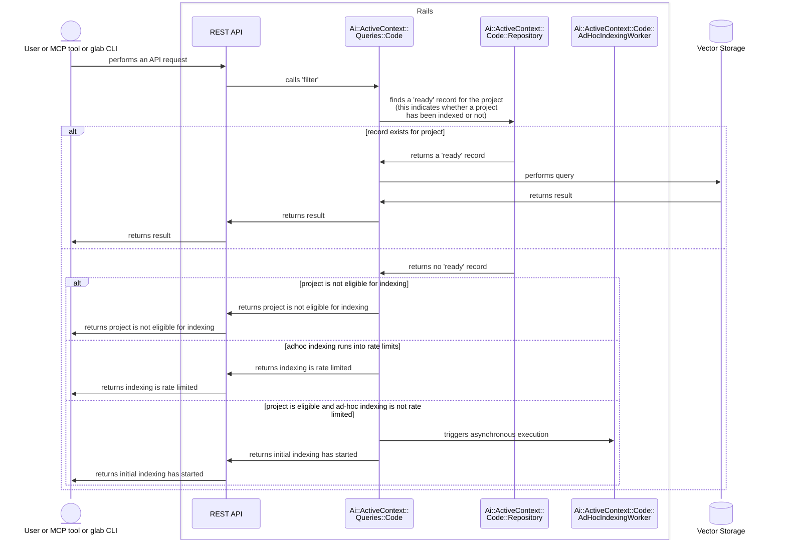

<!--

The canonical place for the latest set of instructions (and the likely source
of this file) is
[content/handbook/engineering/architecture/design-documents/_template.md](https://gitlab.com/gitlab-com/content-sites/handbook/-/blob/main/content/handbook/engineering/architecture/design-documents/_template.md).

Document statuses you can use:

- "proposed"
- "accepted"
- "ongoing"
- "implemented"
- "postponed"
- "rejected"

-->

<!-- Design Documents often contain forward-looking statements -->
<!-- vale gitlab.FutureTense = NO -->

<!-- This renders the design document header on the detail page, so don't remove it-->


## Overview

Ad-hoc indexing is a lazy-loading mechanism that automatically triggers initial indexing when a user attempts to perform semantic code search on a project that hasn't been indexed yet.

### Benefits

1. **Dramatically reduced storage**: Only active projects are indexed, reducing storage from 39-118 TB to manageable levels
1. **Cost efficiency**: Elasticsearch cluster can be significantly smaller
1. **Scalability**: Easier to manage growth incrementally rather than all at once

### Trade-off

1. **First-access latency**: The first semantic code search on a project will be slower as embeddings are generated

## Execution Flow

1. A user or AI agent attempts a semantic code search on an unindexed project. This can be done through various tools (MCP or `glab`) that eventually flows to the [Semantic Code Search REST API](semantic_code_search.md#semantic-code-search-on-the-rest-api).
1. The Semantic Code Search REST API invokes a search on the [`Ai::ActiveContext::Queries::Code` class](./semantic_code_search.md#using-the-activecontext-query)
1. If the project has not yet been indexed but it's eligible for indexing, `Ai::ActiveContext::Queries::Code` triggers the `Ai::ActiveContext::Code::AdHocIndexingWorker`. This queues an ad-hoc indexing job that will run asynchronously.
1. `Ai::ActiveContext::Queries::Code` returns a message indicating: `initial indexing has been started, try again in a few minutes`
1. The Semantic Code Search REST API returns the message to the invoking user or tool.
1. In a few minutes, when the user or AI agent performs a search on the project, the Semantic Code Search tool or REST API will return relevant search results.

### `Ai::ActiveContext::Code::AdHocIndexingWorker`

On perform, `AdHocIndexingWorker` calls `RepositoryIndexWorker.perform_async`. From there, initial indexing will start for the given project.

For further details on initial indexing and related state management, please see [Index state management](code_embeddings.md#index-state-management).

### Rate limits

Ad-hoc indexing is rate-limited per namespace to prevent a single namespace from overwhelming the system with indexing requests.

- Key: `semantic_code_search_ad_hoc_indexing`
- Scope: Root namespace (shared across all projects in the namespace)
- Limit: 10 requests per hour. This is a low rate limit because initial indexing only needs to be done once per project.

### Sequence Diagram

