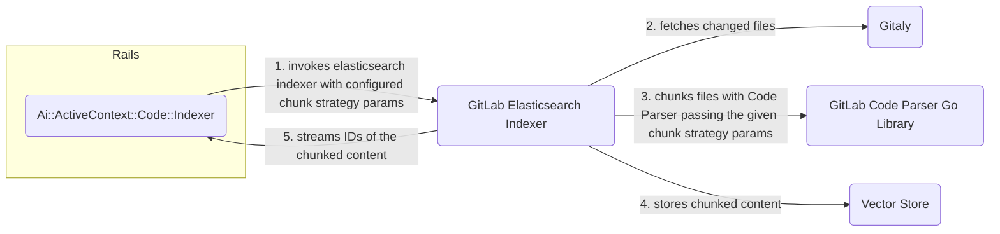

## Overview

When code files are indexed for Semantic Code Search, they are split into smaller chunks before embedding.
This is a critical component that affects both search quality and performance, driven by the following factors:

- **Embedding Model Limits** - Embedding models have maximum token limits (for example, 2048 tokens)
- **Search Relevance** - Smaller chunks provide more precise search results
- **Vector Store Efficiency** - Storing many small vectors is more efficient than storing few large vectors
- **Memory Management** - Processing large files in chunks avoids memory overload

## Chunk Strategy and Chunk Size

**Chunk strategy** is the algorithm used to determine how to split the code content (for example, by bytes, by semantic boundaries).
**Chunk size** refers to the maximum size of each chunk.

- By Bytes
  - Split code into fixed-size byte chunks without considering code structure or semantics.
  - The chunk size refers to the maximum number of bytes per chunk
- By PreBERT tokenization
  - Split code using semantic boundaries optimized for BERT-based embedding models, respecting code structure.
  - The chunk size refers to the maximum number of tokens per chunk

## Chunking implementation and flow

Chunking is implemented in the [**GitLab Code Parser**](https://gitlab.com/gitlab-org/rust/gitlab-code-parser),
a Rust application that exposes a [Go library](https://gitlab.com/gitlab-org/rust/gitlab-code-parser/-/tree/main/bindings/go)
through FFI (Foreign Function Interface).

The [**GitLab Elasticsearch Indexer**](https://gitlab.com/gitlab-org/gitlab-elasticsearch-indexer)
uses the Code Parser library to chunk code content, accepting the parameters `chunk_strategy` and `chunk_strategy_size`.

On Rails, the `Ai::ActiveContext::Code::Indexer` passes the configured chunk strategy parameters when invoking the **GitLab Elasticsearch Indexer**.

**Illustration**



## Configuration

The chunking strategy configuration is persisted in the `Ai::ActiveContext::Collection` record `options`, for example:

```ruby
Ai::ActiveContext::Collections::Code.collection_record.options
=> {"chunk_strategy"=>'code_pre_bert', "chunk_strategy_size"=>256}
```

This can be specified when setting the embedding model for the first time.

If the chunking strategy was never configured, it falls back to the default values of
`chunk_strategy='code_bytes'` and `chunk_strategy_size=1000`.

## Limitations

The chunking strategy cannot be changed after the first time the embedding model is set, as changing it would require a full re-indexing of all content.

## Future Enhancement

Support for changing chunking strategy with automatic re-indexing.
