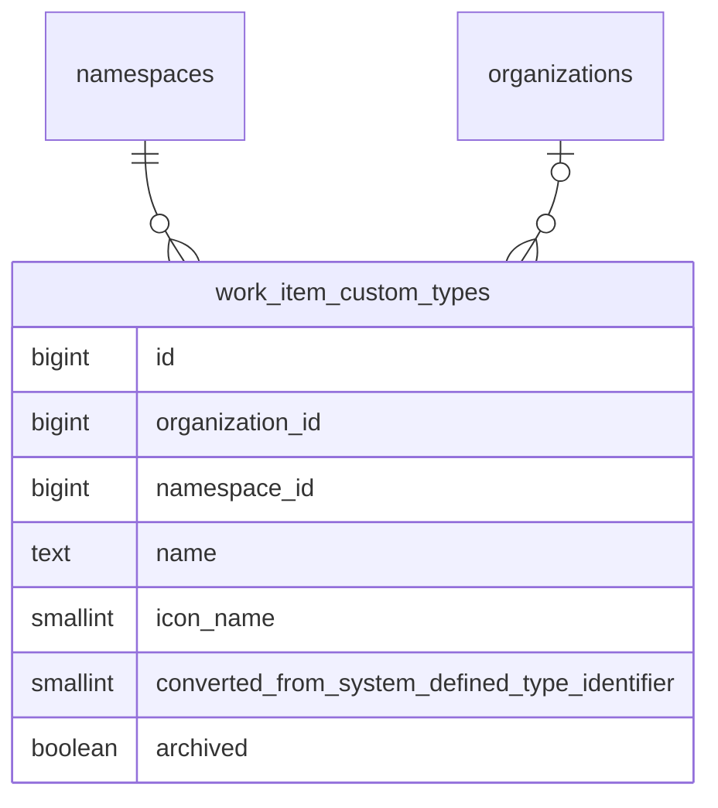

<!-- Design Documents often contain forward-looking statements -->
<!-- vale gitlab.FutureTense = NO -->

<!-- This renders the design document header on the detail page, so don't remove it-->



## Summary

This document outlines our approach to implementing [configurable work item types](https://gitlab.com/groups/gitlab-org/-/epics/9365) for work items in GitLab.

This allows Premium and Ultimate customers to customize the system-defined work item types and create new work item types to match their planning workflows.

To balance customer requirements for top-down control and autonomous teams, users are allowed to customize work item types and their hierarchy restrictions
at the highest possible level only. And if allowed by the organization, descendant namespaces or projects can customize the types further by disabling types they
don't want to use.

Widget customization per type is planned for follow-up iterations. For the initial release, custom types use the same widget set as the system-defined `issue` type.

## Glossary

Reference for vocabulary used throughout this document. Skip to [Customizing work item types](#customizing-work-item-types) on first read — terms are linked back here on their first use in each section.

### System-defined type

A built-in work item type shipped with GitLab (`issue`, `incident`, `task`, `epic`, `ticket`, etc.). Stored in-memory as [`ActiveRecord::FixedItemsModel`](https://docs.gitlab.com/development/fixed_items_model/) objects with IDs in the range 1-9, shared across all namespaces. System-defined types cannot be deleted, but they can be customized — see converted type.

### Custom type

A user-created work item type stored in `work_item_custom_types`. Custom types can be entirely new (for example "Bug Report", "Feature Request") or created by customizing a system-defined type. Custom type IDs start at 1001 to keep them disjoint from system-defined IDs.

### Converted type

A custom type that was created by customizing a system-defined type. For example, renaming "Issue" to "Feature" creates a converted type. The `converted_from_system_defined_type_identifier` column stores the original system-defined type's identifier. Converted types inherit the special feature mappings of their source type (Service Desk, incident management) and retain the original type's Global ID format. They are the architectural bridge between customization and backward compatibility.

### Delegation source

The system-defined type that a custom type inherits behavior from — widgets, hierarchy restrictions, base type predicates, and configuration flags. For converted types this is the system-defined type identified by `converted_from_system_defined_type_identifier`. For new custom types this defaults to `issue`. Per-custom-type widget and hierarchy customization is planned for follow-up iterations; until then, delegation provides the defaults.

### Provider

The `WorkItems::TypesFramework::Provider` class. The single authority on type existence and availability for a given namespace. All code that needs to resolve a work item type goes through the Provider, which merges system-defined and custom types into a per-request indexed cache.

### NamespacedType

A lightweight `SimpleDelegator` subclass that wraps a type in the Provider's cache to make it namespace-aware. Carries per-namespace state (`enabled`, `is_a_group`, `tasks_on_boards`) without mutating the shared `FixedItemsModel` singletons. Identity methods are preserved so the wrapper stays transparent to equality checks.

### SIWAR

Sparse Inheritance with Ancestor Resolution. The pattern used for resolving per-namespace settings (visibility in particular) along the namespace hierarchy with "closest ancestor wins" semantics. Sparse because only namespaces that deviate from the inherited default need a row.

## Customizing work item types

We allow configuration of work item types at the highest possible level. This allows customers to configure types for all the groups and projects that they own.
This will be the root namespace level for SaaS instances and the [organization level](https://docs.gitlab.com/user/organization/) for self-managed instances.

[System-defined types](#system-defined-type) are stored in-memory as `ActiveRecord::FixedItemsModel` objects and shared across all groups and projects. Customizations are stored in the PostgreSQL database and sharded by `organization_id` or `namespace_id`.



The `work_item_custom_types` table uses an ID sequence starting at 1001 to avoid collisions with system-defined type IDs (1-9). A check constraint enforces `id >= 1001`. The `organization_id` and `namespace_id` columns are mutually exclusive (exactly one must be non-null). There is a limit of 40 custom types per parent namespace or organization.

### Scope of MVC1 customization

The framework is designed so any [system-defined type](#system-defined-type) can be renamed and have its icon changed, but MVC1 deliberately narrows what the UI exposes:

- **Issue** can be renamed and have its icon changed.
- **New [custom types](#custom-type)** can be created. They always use Issue as their [delegation source](#delegation-source) and inherit its widget set and hierarchy restrictions.
- **All other system-defined types** (`epic`, `incident`, `task`, `ticket`, `test_case`, `requirement`, `objective`, `key_result`) are locked. They cannot be renamed, archived, or otherwise customized.
- **Widget customization, hierarchy customization, and configuration flag overrides** are out of scope for MVC1 and tracked in the [iteration epics](https://gitlab.com/groups/gitlab-org/-/epics/9365).

The restriction on other system-defined types is a frontend constraint, not a framework limitation. Several places in the UI still reference these types by their system-defined name in list views, detail views, and creation flows. Until those surfaces are revamped to be type-name agnostic and data-driven, renaming would produce inconsistent UI. The intent is to unlock customization for additional types as those surfaces are migrated.

### Customizing a system-defined type

When a user customizes a [system-defined type](#system-defined-type) (currently renaming Issue or changing its icon — see [Scope of MVC1 customization](#scope-of-mvc1-customization)), we create a new `work_item_custom_types` record and store the original system-defined ID in the `converted_from_system_defined_type_identifier` column. The work items themselves are not touched. Their `work_item_type_id` continues to point at the system-defined ID. For example, all existing issues keep `work_item_type_id = 1`, and all newly created issues are also written with `work_item_type_id = 1`. The customization takes effect through lookup, not data migration: the [Provider](#provider) resolves the system-defined ID to the [converted type](#converted-type) wherever it appears. [Similar to custom statuses](../work_items_custom_status/#converting-system-defined-lifecycles-and-statuses-to-custom-ones), this means the change is immediate and cheap.

Storing the system-defined ID rather than the custom record's PK is the architectural keystone. Rewriting `work_item_type_id` for every existing work item on every customization is not feasible at the scale of the `issues` table, and it would also break the single-column storage model that keeps queries fast. See [Storing a work item's type](#storing-a-work-items-type) for the full rationale.

The conversion is transparent to API consumers. Global IDs continue to use the format `gid://gitlab/WorkItems::Type/<system-defined identifier>`, the GraphQL type is unchanged, and our APIs accept Global IDs in this format when passing in system-defined types that have been customized. The only externally visible change is the type's name and icon. Once a system-defined type has been customized, it remains a [converted type](#converted-type) even if it is renamed back to its original name — there is no "un-convert" operation.

The converted type acts as a decorator over the original system-defined type. It delegates widgets, hierarchy restrictions, configuration flags, and base type predicates to the original via the [delegation source](#delegation-source) pattern. Special-feature behavior (Service Desk for `ticket`, incident management for `incident`) is preserved through this delegation chain: when the application asks "is this the type that handles Service Desk?", it requests the type's `base_type`, which delegates to the system-defined type via the delegation source and returns `:ticket`. Configuration flags on the system-defined type (`service_desk: true`, `incident_management: true`) then identify the type as the one designated for that feature. The `converted_from_system_defined_type_identifier` column is the linkage that makes this delegation chain resolve correctly — it is not what the feature code reads directly.

When fetching a work item's type, the [Provider](#provider) applies the conversion. When listing available types for a namespace or project, the Provider fetches all system-defined and [custom types](#custom-type), then excludes system-defined types that have a mapped custom type record.

### Creating a new work item type

A new [custom type](#custom-type) is represented by a `work_item_custom_types` record with a null `converted_from_system_defined_type_identifier` value.

All types — [system-defined](#system-defined-type), [converted](#converted-type), and new custom — use the same Global ID format: `gid://gitlab/WorkItems::Type/<id>`. Both `SystemDefined::Type#to_global_id` and `Custom::Type#to_global_id` explicitly build GIDs with `model_name: 'WorkItems::Type'`. The disjoint ID spaces (1-9 for system-defined, 1001+ for custom) prevent collisions.

For the initial iterations, new types behave like the system-defined `issue` type. They are allowed at the project level only and their widgets and hierarchy restrictions match those of `issue`. Group-level availability for new custom types is planned for follow-up iterations. Widget customization per type is also planned for follow-up iterations.

### Archiving a work item type

[Custom types](#custom-type) can be archived rather than deleted to preserve historical data. When a type is archived:

- It is marked with the `archived` boolean column on `work_item_custom_types`
- It no longer appears in the type creation flow
- Existing work items of that type are preserved and remain accessible
- The type can be unarchived to make it available again

This follows the same pattern as [custom fields archiving](../work_items_custom_fields/#archiving-custom-fields).

#### Type name uniqueness

To prevent confusion and ensure a clear user experience, type names must be unique across both [custom](#custom-type) and non-converted [system-defined types](#system-defined-type) within a namespace or organization. This means:

- A custom type cannot have the same name as a system-defined type that has not been customized
- A custom type cannot have the same name as another custom type
- If a system-defined type is customized (e.g., renamed from "Task" to "Pizza"), a new custom type can be created with the name "Task" since the original system-defined type is no longer available under that name
- If a user renames a [converted type](#converted-type) back to its original name, given that original name was not taken in the meantime, then the custom type name becomes available to be taken again. E.g. rename "Pizza" back to "Task", then "Pizza" is now available as a name for a type

### Storing a work item's type

We use a [single-column approach](https://gitlab.com/gitlab-org/gitlab/-/issues/580065) to store the type on a work item. The existing `issues.work_item_type_id` column stores the type ID for all types:

- **[System-defined types](#system-defined-type):** The system-defined ID (1-9) is stored directly.
- **[Converted types](#converted-type):** The `converted_from_system_defined_type_identifier` value is stored — the original system-defined ID. This is the key that allows existing work items to automatically pick up customizations without data migration.
- **New [custom types](#custom-type):** The custom type's own ID (1001+) is stored.

This is handled by the `HasType#persistable_type_id` method, which determines the correct ID to write based on the type's nature.

The single column carries two semantic meanings at once: a value in the 1-9 range identifies a system-defined or converted type, a value in the 1001+ range identifies a new custom type. The disjoint ID ranges make this unambiguous without a discriminator column. The [Provider](#provider) is the resolution layer that turns the stored ID into the correct type object for the namespace.

The single-column approach was chosen over alternatives (dual columns with mutual exclusivity constraint, negative IDs for custom types, three-column approach) after [investigating the tradeoffs](https://gitlab.com/gitlab-org/gitlab/-/issues/580065). The decisive factors:

- **No rewrite of `issues` on customization.** Converted types keep their stored ID as the system-defined ID, so customizing a type does not touch any work item row. At the scale of the `issues` table this is the difference between an instant operation and an impossible one.
- **Index density and query speed.** A single integer column keeps existing indexes on `work_item_type_id` fully usable. Queries like "all tickets in this project" remain a single integer match rather than fanning out across per-namespace custom records.
- **No schema changes on the high-traffic `issues` table.** Adding columns to `issues` is actively discouraged for performance and operational reasons, and a dual-column design would also require a backfill and a new index. The single-column approach avoids both.
- **Cells compatibility.** System-defined types live in-memory as `FixedItemsModel` objects with no backing table. A foreign key from `issues.work_item_type_id` to a types table cannot exist for system-defined IDs because there is no row to reference. The single-column approach embraces this rather than fighting it.

The downside of the single column is the absence of a foreign key constraint on `work_item_type_id`. Two reasons make this acceptable:

- **System-defined IDs have no table.** A standard FK is impossible for the 1-9 range regardless of design.
- **Custom IDs live in `work_item_custom_types`.** A partial FK targeting only the 1001+ range is possible but adds asymmetry without much benefit, since the integrity guarantee would only cover half the value space.

Referential integrity for custom type IDs is instead enforced by database triggers ([!223997](https://gitlab.com/gitlab-org/gitlab/-/merge_requests/223997)) that mimic the relevant parts of a foreign key without the constraint plumbing on the high-traffic `issues` table:

- A trigger on `work_item_custom_types` blocks deletion of any row that is still referenced by an `issues` row. There is no cascade — deletion fails outright. In practice this is paired with [archiving](#archiving-a-work-item-type), which is the supported lifecycle operation; outright deletion is reserved for unused types.
- Triggers on `issues` (and other tables that store `work_item_type_id`) validate the value on insert and update. A row with a non-existent custom type ID is rejected at write time.

The original FK was [removed](https://gitlab.com/gitlab-org/gitlab/-/issues/588587) as part of this transition. Application-layer resolution still happens through the [Provider](#provider), which is the single resolution path for any type ID. When asked for a type that does not exist in the current namespace, the Provider returns `nil` — this is the normal path for "this custom type belongs to a different namespace", not a dangling-reference indicator.

## Provider pattern

The [Provider](#provider) is the single authority on type existence and availability for a given namespace. All code that needs to resolve a work item type goes through it rather than querying type models directly.

### How it works

The CE Provider delegates all public methods to two private methods: `resolve_by_id` and `resolve_all`. This gives the EE layer a single pair of override points.

The EE Provider overrides these two methods to route through a per-request indexed cache built from both [system-defined](#system-defined-type) and [custom types](#custom-type). Each type in the cache is wrapped in a [`NamespacedType`](#namespacedtype) delegator that carries an `enabled` attribute without mutating the `FixedItemsModel` singletons (which are shared Ruby objects with stable `object_id` across requests).

```ruby
provider = WorkItems::TypesFramework::Provider.new(namespace)
provider.find_by_id(1)         # Returns Issue (or its converted custom type)
provider.find_by_id(1001)      # Returns custom type with ID 1001
provider.all_ordered_by_name   # All available types for the namespace
provider.find_by_base_type(:incident)  # Returns the type designated for incidents
```

### Cache structure

The indexed cache is a hash keyed by type ID, stored in `SafeRequestStore` (per-request, per-thread). When a system-defined type has been converted to a custom type, the converted type replaces the system-defined type in the cache and is indexed under both the system-defined ID and its own AR primary key. This double-indexing ensures round-trip safety: code that resolves a type, reads `.id`, and passes it back through `find_by_id` gets the same object.

### NamespacedType delegator

[`NamespacedType`](#namespacedtype) wraps a type to make it namespace-aware. It does not add behavior of its own — it enriches the wrapped type with state that only makes sense in the context of a specific namespace. Identity methods (`class`, `is_a?`, `instance_of?`, `kind_of?`) are overridden to report as the wrapped type's class so the wrapper stays transparent to `FixedItemsModel` equality checks.

The namespace-specific state carried on the wrapper covers everything the rest of the codebase needs to answer "what does this type look like in this namespace?":

- `enabled` — whether this type is turned on for use in this specific namespace
- `is_a_group` — whether the current namespace is a group (affects type-level behaviour like group-only types)
- `tasks_on_boards` — whether the tasks-on-boards feature is active for the namespace
- `enabled_by_default_for_new_namespaces?` — lazy predicate backed by `SafeRequestStore`, used only by the type admin UI; resolved on demand rather than during cache build to keep the Provider hot path cheap

The distinction between availability and enablement is the key mental model:

- `available` = the type exists in the namespace hierarchy (it's in the cache)
- `enabled` = the type is turned on for use in this specific namespace

A type can be available but disabled — for example, `Task` might exist in the hierarchy but be disabled for a specific project. Disabled types are still returned by `find_by_id` (existing items render correctly), but the creation flow rejects them.

For the initial release, `enabled` defaults to `true` for all types. [Visibility controls](#visibility-controls) populate it from real persistence.

### nil namespace handling

The Provider is frequently constructed with `nil` namespace (imports, metrics, scopes on Issue). The EE `feature_available?` method returns `false` when namespace is `nil`, which causes the Provider to fall through to the CE implementation that returns only system-defined types. Organization namespaces similarly short-circuit visibility resolution — the visibility map returns `{}` for organization namespaces, so all types default to `enabled: true`.

## Delegation source

[Custom types](#custom-type) delegate their behavior to a [delegation source](#delegation-source) — the [system-defined type](#system-defined-type) that determines widgets, hierarchy restrictions, configuration flags, and base type predicates:

- **[Converted types](#converted-type):** The delegation source is the original system-defined type identified by `converted_from_system_defined_type_identifier`.
- **New custom types:** The delegation source defaults to the `issue` system-defined type.

This means:

- `custom_type.widgets` returns the widget list from its delegation source
- `custom_type.issue?` returns `true` for a new custom type (delegates to Issue)
- `custom_type.incident?` returns `true` for a type converted from Incident
- Hierarchy restrictions match the delegation source's restrictions

Per-custom-type widget and hierarchy customization is planned for follow-up iterations. The delegation source pattern provides the foundation: once customization is implemented, widget and hierarchy overrides will layer on top of the delegated defaults.

## Visibility controls

Type visibility is controlled per namespace using the [SIWAR](#siwar) pattern. Three tables support this:

- `work_item_type_visibilities` — Explicit visibility overrides per namespace per type. Sparse: only namespaces that deviate from the default need a record.
- `work_item_type_visibility_defaults` — Defaults applied when new child namespaces are created.
- `work_item_settings` — Feature settings per organization or root namespace. Contains the `customizable_type_visibility` boolean, which is the user-controlled toggle that enables visibility management.

### Enabling visibility management

Visibility management is opt-in. By default, `customizable_type_visibility` is `false`, which means every type is enabled everywhere — the [Provider](#provider) short-circuits visibility resolution entirely and returns `enabled: true` for all types regardless of any rows that might exist in the visibility tables. To use visibility controls, an admin must first enable the `customizable_type_visibility` setting on the organization or root namespace via the `workItemSettingsUpdate` mutation. Only then do the visibility tables take effect.

This two-step model means customers can adopt visibility controls deliberately rather than having type-level toggles silently affect their existing namespaces.

### Resolution semantics

The resolution query uses PostgreSQL `traversal_ids` with "closest ancestor wins" semantics: the most specific override in the namespace hierarchy takes precedence. A row with `propagate: true` applies to all descendants until a closer ancestor overrides it. The Provider runs this query during cache build and sets [`NamespacedType.enabled`](#namespacedtype) from the results.

### Visibility actions

Three independent visibility actions are available:

| Action | Effect | Storage |
|---|---|---|
| Control this namespace only | Toggles type visibility for this namespace | Single row in `work_item_type_visibilities` |
| Propagate to all existing children | Writes overrides for all descendant namespaces (clears conflicting descendant rows) | Single row with `propagate: true` |
| Set defaults for new children | Sets defaults for future child namespaces | Single row in `work_item_type_visibility_defaults` |

The `workItemAvailabilityToggle` mutation enables or disables a specific type for a given namespace and exposes these actions through its scope argument.

### Default visibility for new namespaces

Each type has a default visibility that applies when new child namespaces are created. Defaults are set on type create or update via the `enabledByDefaultForNewNamespaces` input on the `workItemTypeCreate` and `workItemTypeUpdate` mutations, and are stored in `work_item_type_visibility_defaults` scoped to the organization or root namespace.

When a new group or project is created, the seeding service reads the org/root defaults and compares each against what [SIWAR](#siwar) currently resolves for the new namespace. A visibility row is written only where the two disagree — if a propagating ancestor already produces the desired state, no row is needed. This keeps the visibility tables sparse and avoids redundant writes.

The initial release scopes defaults to the organization or root namespace only. Setting defaults at arbitrary namespace levels (so a subgroup can define defaults for its own future children) is planned for a follow-up iteration via a `NEW_CHILDREN` scope on `workItemAvailabilityToggle`.

### Import and export interaction

Imports (CSV, Direct Transfer, file-based) deliberately bypass model-level type validation via an `importing?` exemption on `validate_work_item_type_id`. Without this exemption, a record whose original type is disabled in the target namespace — or whose type matches by name but is disabled there — would fail to save and be dropped. That contradicts the import contract: imports should land records on a best-effort basis, not drop them silently.

The import path uses a visibility-aware fallback chain: matched-by-name → matched-and-enabled-in-target → default issue type. Model validation remains the enforcement point for synchronous user-initiated writes (UI, GraphQL, REST, Service Desk, quick actions). Imports are the explicit exception by design.

## Creating work items of custom types

Creating a work item of any type — [system-defined](#system-defined-type), [converted](#converted-type), or new [custom](#custom-type) — goes through the same creation path. The [Provider](#provider) is the resolution point: it determines whether the type exists and is available in the namespace, and the rest of the creation flow treats the resolved type uniformly.

The conceptual model has two distinct authorization layers:

- **Type availability** — does this type exist and is it usable in this namespace? This is the Provider's job, and it covers feature flag gating, license gating, and namespace visibility. If the type is not available, the request is rejected before any creation logic runs.
- **Creation permission** — does the user have permission to create work items in this namespace? This is the standard `:create_work_item` policy check and is independent of the type.

Permission checks that historically keyed off base type predicates (for example "is this user allowed to create incidents?") still apply to system-defined and converted types where they remain meaningful. New custom types do not carry their own base type permissions — they delegate to Issue, and creating a work item of a new custom type is gated by the standard "create work item" permission.

## Permissions

| Permission | Scope | Role (SaaS) | Role (Self-Managed) | Purpose |
|---|---|---|---|---|
| `create_work_item_type` | Root group, organization | Maintainer+ | Admin, or organization Owner | Create new custom types |
| `update_work_item_type` | Root group, organization | Maintainer+ | Admin, or organization Owner | Update or convert types |
| `update_work_item_type_visibility` | Root group, subgroup, project | Maintainer+ | Maintainer+ | Toggle type visibility for a namespace |
| `configure_work_item_type` | Subgroup, project | Maintainer+ | Maintainer+ | Access the work item type settings UI at subgroup and project level. Reserved as the entry point for future per-type configuration such as widget customization and hierarchy customization, which are inherited from the delegation source today. |

The `WorkItems::TypesFramework::Custom::TypePolicy` delegates authorization to the parent namespace or organization and checks the licensed feature.

## Licensing and downgrades

Configurable work item types are available as a licensed feature (`configurable_work_item_types`) for Premium and Ultimate customers.

On license downgrade:

- All custom types and configurations remain readable
- Mutations are blocked (creating, updating, converting types)
- No data destruction or type mapping
- Existing work items of custom types continue to function
- Re-upgrading restores full functionality without data migration

This follows the [framework-wide licensing principle](../work_items_framework_vision/#licensing-and-downgrade-strategy): keep existing configurations and data intact on downgrade, but disallow mutations.

## Frontend architecture

The frontend implementation includes:

- **Settings pages** at root group, subgroup, project, and admin levels for managing work item types
- **Types list view** with create, edit, and archive actions, plus an active types counter showing the limit
- **Enabled/disabled toggle view** for subgroups and projects, allowing namespace admins to control which types are available
- **Create/edit form** for defining new types or customizing existing ones

The frontend uses the [configuration provider pattern](../work_items_framework_vision/#1-configuration-over-type-checks) described in the framework vision, fetching type configuration per namespace and caching it in Apollo. The API response drives which types are available and what actions are possible — no hardcoded assumptions about type availability.

## Configurations and type checks

To reduce hard-coded type checks throughout the application while maintaining clarity about type behavior,
we use a configuration-based approach with a centralized interface for accessing type settings.

Configurations are boolean flags (or value-based attributes in later iterations) that control
how types behave and render. Multiple types can share the same configuration.

### Configuration interface

**Backend:**

```ruby
# Checking configurations
type.configured_for?(:use_legacy_view)  # => true/false
type.configured_for?(:group_level)      # => true/false
type.configured_for?(:available_in_create_flow)  # => true/false

# Future: value-based configurations
type.configuration(:required_widgets)  # => [:title, :description]
```

**Frontend:** Configurations are exposed via GraphQL and passed to the frontend client.
The frontend should not perform type checks but instead query the configuration flags to determine behavior.

### Special type handling

Service Desk and Incident Management functionality is tied to specific work item types (`ticket` and `incident`).
We handle these through:

1. Configuration flags for quick checks:

   ```ruby
   type.configured_for?(:service_desk)         # Is this the service desk type?
   type.configured_for?(:incident_management)  # Is this the incident type?
   ```

2. Type provider for lookups

   ```ruby
   # Finding the designated type for a feature
   # (concrete class name might be subject to change).
   WorkItems::TypesFramework::Provider.new(namespace).service_desk_type
   WorkItems::TypesFramework::Provider.new(namespace).incident_type
   ```

### Required widgets

Types like `ticket` and `incident` have mandatory widgets needed for their associated features (Service Desk, Incident Management).
These required widgets are defined as part of the system-defined type definition and
inherited by converted custom types via `converted_from_system_defined_type_identifier`.

## Implementation Details

The implementation uses the `WorkItems::TypesFramework` namespace to organize type-related functionality and provide clear separation of concerns.
It continues the pattern we established with the `WorkItems::Statuses` namespace where we grouped all status related functionality in.
In detail this means:

1. System-defined classes using the `FixedItemsModel` use the `WorkItems::TypesFramework::SystemDefined` namespace.
1. Models and classes for custom type related concepts use the `WorkItems::TypesFramework::Custom` namespace.

### Frontend metadata provider pattern

The frontend adds, to the metadata provider vue component, a separate query that fetches work item types configuration. This pattern ensures that type configuration is always available and up-to-date as users navigate between items in different namespaces.

#### How it works

The configuration is fetched once per namespace fullpath and cached in Apollo. This means:

1. When the SPA initially mounts, we fetch the type configuration for the current namespace path (group or project)
2. As users navigate to items within the same namespace, the cached configuration is reused
3. When navigating to items in a different namespace, the fullpath updates and forces a new configuration to be fetched for that namespace path
4. Each namespace path has its own cache entry, allowing the SPA to maintain configurations for multiple namespaces simultaneously
5. When a component wants to access the config, it passes its current work item type to the utility method, returning the right type config for the right namespace.

#### Use cases

This pattern handles several navigation scenarios:

- **Same namespace navigation**: Clicking on items within the same project/group reuses the cached configuration
- **Cross-project navigation**: When navigating to items in different projects, a new configuration is fetched for that project's path
- **Cross-group navigation**: When navigating between items in different groups or root namespaces, the appropriate configuration is fetched and cached
- **Contextual view changes**: When viewing an epic (group context) and then selecting an issue (project context), the configuration updates to reflect the new context

## Work Item Settings sections configurations

This is frontend-specific configuration that doesn't make sense to expose in the API since it's very specific to GitLab's own frontend implementation and UI layout decisions.

### 1. Settings configuration factory

The `getSettingsConfig(context)` factory function in
`ee/app/assets/javascripts/work_items/constants.js` produces a configuration
object tailored to the caller's context. It accepts one of four context strings:
`'root'`, `'subgroup'`, `'project'`, or `'admin'` (defaults to `'root'`).

The function builds the config in two layers:

1. **Base defaults** — a `DEFAULT_SETTINGS_CONFIG` object inside the function
   defines the full set of boolean visibility flags, permissions, and layout:

   | Property | Type | Purpose |
   |---|---|---|
   | `showWorkItemTypesSettings` | `boolean` | Show the configurable types section. |
   | `showEnabledWorkItemTypesSettings` | `boolean` | Show the enabled types section. |
   | `showCustomFieldsSettings` | `boolean` | Show the custom fields section. |
   | `showCustomStatusSettings` | `boolean` | Show the custom status section. |
   | `workItemTypeSettingsPermissions` | `string[]` | Permissions applied to configurable types (for example, `['edit', 'create', 'archive']`). |

2. **Context-specific text** — two lookup maps (`configurableTypesSubtexts` and
   `enabledTypesSubtexts`) key descriptive strings by context. The factory
   merges the matching strings into the returned object as
   `configurableTypesSubtext` and `enabledTypesSubtext`.

Consumers call the factory and then override any flags they need:

```js
// Admin — disable sections not yet supported
const config = {
  ...getSettingsConfig('admin'),
  showEnabledWorkItemTypesSettings: false,
  showCustomFieldsSettings: false,
  showCustomStatusSettings: false,
};

// Subgroup — only the enabled types section
const config = {
  ...getSettingsConfig('subgroup'),
  showWorkItemTypesSettings: false,
  showEnabledWorkItemTypesSettings: true,
  showCustomFieldsSettings: false,
  showCustomStatusSettings: false,
};
```

#### Scalability pattern for new config options

To add a new settings section or config property:

1. Add a new boolean flag (for example, `showMyNewSettings`) to
   `DEFAULT_SETTINGS_CONFIG` inside `getSettingsConfig`.
2. If the new section needs context-specific text, add a new lookup map
   (for example, `myNewSettingsSubtexts`) keyed by context string and merge
   the result into the returned object.
3. Each consumer that already spreads `getSettingsConfig(context)` inherits the
   new default automatically. Consumers only need to override the flag if their
   context requires a non-default value.
4. In `WorkItemSettingsHome`, add a `v-if` guard using the new flag to
   conditionally render the corresponding component.

This approach keeps the factory as the single source of truth for defaults while
allowing each entry point to opt in or out of individual sections. New contexts
(for example, `'organization'`) require only a new entry in each lookup map.

### 2. Enabled work item types section

The `EnabledConfigurableTypesSettings` component
(`ee/groups/settings/work_items/configurable_types/enabled_configurable_types_settings.vue`)
renders inside a `SettingsBlock` and displays which work item types are
currently active in a given namespace.

- Visibility is controlled by `showEnabledWorkItemTypesSettings` in the config.
- The description text comes from `config.enabledTypesSubtext`, so it
  automatically reflects the current context.
- The component delegates rendering to
  `WorkItemTypesListEnabledDisabledView`, which owns its own Apollo query.

---

## Context-Specific Behavior Matrix

| Context | Configurable Types Section | Enabled Types Section | Custom Fields | Custom Status |
|---|---|---|---|---|
| **Admin** | Shown | Hidden | Hidden | Hidden |
| **Root Group** | Shown | Shown | Shown | Shown |
| **Subgroup** | Hidden | Shown | Hidden | Hidden |
| **Project** | Hidden | Shown | Hidden | Hidden |

---

## Component Hierarchy

```text
WorkItemSettingsHome
├── ConfigurableTypesSettings          (if showWorkItemTypesSettings)
│   └── WorkItemTypesList              (always renders list/crud view)
├── EnabledConfigurableTypesSettings   (if showEnabledWorkItemTypesSettings)
│   └── WorkItemTypesListEnabledDisabledView  (self-fetching)
├── CustomStatusSettings               (if showCustomStatusSettings)
└── CustomFieldsList                   (if showCustomFieldsSettings)
```

## Iterations

MVC1 shipped in GitLab 19.0. For the full breakdown of what shipped and what is planned for future iterations, see the [top-level epic](https://gitlab.com/groups/gitlab-org/-/epics/9365) and its subepics:

1. [Widget customization on work item types](https://gitlab.com/groups/gitlab-org/-/epics/20075)
2. [Customizable types within groups and configurable hierarchy](https://gitlab.com/groups/gitlab-org/-/epics/20076)
3. [Enhanced configuration options for types (policies)](https://gitlab.com/groups/gitlab-org/-/epics/20077)

## License and tier considerations

Custom work item types are a Premium and above feature. The licensed feature is named `configurable_work_item_types`.
When a customer downgrades to a tier that does not support custom types, we apply the following strategy:

### Downgrade behavior

On downgrade, we keep all existing configurations and data intact but disallow mutations:

- Existing custom types and their configurations remain accessible for reading
- Creating new custom types is blocked
- Modifying existing custom types is blocked
- Relationships and hierarchy remain intact but cannot be modified beyond current license capabilities
- Renamed system-defined types keep their custom names and cannot be modified further

This approach avoids destructive actions and data loss while clearly communicating the reduced functionality
of the downgraded tier and is in line with downgrade behavior of the status and custom fields features.

### Custom type limits

`40` active work item types limit is enforced across custom and system defined work item types, per top level namespace or organization for the Premium tier.

### Future tier differentiation

In future iterations, we may introduce additional restrictions between Premium and Ultimate tiers, such as hierarchy depth limits. These will follow the same strategy: keep existing configurations and relationships, but restrict new usage and modifications beyond the current license capabilities.

## Work item type states and settings UI

### Work item type states

1. Enabled - Default for any work item type
1. Locked - A system type that cannot be renamed, disabled, or deleted.
1. Archived - Alternative for deletion. The optimal workflow was to delete a type and migrate to a new type, however since that wasn't possible, we added this "Archive" type
   1. Should not be available in filters (does not depend on any cascading settings since only happens at root level)
   1. No rename and edit icon allowed
1. Disabled
   1. Should not be available in filters in the projects/groups it is disabled for (if inheriting from parent then continue the same permissions)
   1. Should not be allowed to be created
   1. Rename and edit icon allowed

### Work item type sections

We have separate sections on the work item settings page

1. "Work item types" - This is where types are defined, created, and managed globally.
2. "Enabled work item types" - This is purely local configuration, where we can toggle the availability

Depending on the context and requirement, we have separate combinations for both the above section on work item settings pages.

## Decision registry

1. [Configure types at the root namespace-level for SaaS instances and at the organization-level for self-managed instances](https://gitlab.com/groups/gitlab-org/-/epics/7897#note_2795232631).

   We are not ready to move every customer to separate organizations on GitLab.com so we have to configure types at the root namespace level for now. Self-managed instances on the other hand
   will always have a single organization so we can configure at the organization level.

   Self-managed customers typically work across multiple root namespaces on their instances so we want them to be able to configure at a higher level so that they will be able to standardize
   their types and workflows.

1. System-defined types will be stored [in-memory as `ActiveRecord::FixedItemsModel` objects](https://gitlab.com/gitlab-org/gitlab/-/issues/519894) to avoid cluster-wide tables and unblock Cells and sharding work.
1. Special features like Service Desk and incident management will be [mapped 1:1 to a system defined type](https://gitlab.com/groups/gitlab-org/-/epics/7897#note_2857326975).
1. To avoid breaking changes, we will [keep the existing Global ID format for system-defined types](https://gitlab.com/gitlab-org/gitlab/-/issues/579238). The same format is also retained even when the system-defined type is customized.
1. [Use configuration-based approach for type behavior instead of separate capability concept](https://gitlab.com/gitlab-com/content-sites/handbook/-/merge_requests/17119#ai-summary-of-the-discussion-in-slack-for-the-record).

   We explored introducing both "capabilities" (exclusive type identities) and "configurations" (behavioral flags) but chose a unified configuration approach. With only two special types requiring exclusive handling, a single concept is simpler to understand and maintain for now.

1. [We use the `WorkItems::TypesFramework` namespace](https://gitlab.com/gitlab-org/gitlab/-/merge_requests/212636#note_2948286714).
1. [On license downgrade, keep existing configurations and data but disallow mutations](https://gitlab.com/gitlab-org/gitlab/-/issues/579231).
1. We are not going ahead with saving/storing pluralization of the work item type name to avoid pluralizing work item type names entirely. Instead of "Issues", "Epics", "Stories", type names should remain singular, and when referring to multiple items of that type, the plurality is handled at the container level: "work items of type: [Name]" or "items".
1. Tickets can only be created via email or using the `/convert_to_ticket user@example.com` quick action.
   1. "Ticket" is removed from the list of available types for creation.
   1. "Create new ticket" is removed from the child items section.
1. We use "New related item" instead of "New related TYPE_NAME" in the header action menu.
1. Users can relate tickets to any other item type
1. [Fetch work item type configuration per namespace path and cache it in Apollo](https://gitlab.com/groups/gitlab-org/-/epics/20061#note_3020401416).

   See the [Frontend metadata provider pattern](#frontend-metadata-provider-pattern) section for details on how this pattern works and its benefits.

1. [Remove all link restrictions between work item types](https://gitlab.com/gitlab-org/gitlab/-/issues/581932#note_3019673313).

   Any work item type should be able to link to any other type with relationships like "Blocked by / Blocks" and "Related to". This decision applies to linked items only, not child items (hierarchy).

1. [We will delegate custom work item types to existing system-defined types](https://gitlab.com/gitlab-org/gitlab/-/issues/581932#note_2959381705),
postponing custom widget definition and hierarchy restriction table creation until users actually customize these features in future iterations.

1. All work item type configuration code should live in `ee/` since configurable work item types is a Premium and above feature.

   CE users will never be able to customize types, widgets, or hierarchy. The top-level work item type GraphQL query and related configuration code can safely reside in the EE codebase. The `namespaceWorkItemTypes` query handles all work item list functionality and is appropriate for CE. Any reusable components that are currently in CE but only used for type configuration should be evaluated for migration to EE.

1. [Type names must be unique across custom and non-converted system-defined types](https://gitlab.com/gitlab-org/gitlab/-/merge_requests/218464#note_3022168638).

1. [Separate system-defined and custom work item types by ID range](https://gitlab.com/gitlab-org/gitlab/-/merge_requests/223117).

   System-defined work item types use IDs 1-1000 while custom work item types use IDs 1001 and above, with a new sequence starting at 1001
   for the `work_item_custom_types` table to prevent any overlap between the two categories.

1. All available work item types will be visible at all levels i.e organization level/top level groups, subgroup level and project level

1. Epics are shown as a work item type at project level with explanation tooltip that it's disabled for projects, because Epics are currently only available at group level. Note: that is subject to change in future iterations.

1. We can only create/edit a work item type at the organization level/top level group.

1. In addition to "Work item types" section , we will have a separate section "Enabled work item types" [which will also be visible on top level groups](https://gitlab.com/gitlab-org/gitlab/-/issues/585643#note_3080703281)

1. Subgroups and projects will only have the "Enabled work item types" section.

1. Archived types are visible at organization level/top level group as split button view but not visible on the project and subgroup level.

1. [Custom work item types use `WorkItems::Type` as the GID model class](https://gitlab.com/gitlab-org/gitlab/-/merge_requests/224790#note_3125745798).

   For new custom types similar to converted and system-defined types, we build the Global ID using the legacy `WorkItems::Type` class. This means both system-defined and custom types produce Global IDs in the format `gid://gitlab/WorkItems::Type/<id>`.

   - It keeps the GraphQL API surface uniform — clients never need to distinguish between system-defined and custom type GIDs.
   - `Custom::Type` is an internal implementation detail, not a public API concept.
   - The `WorkItems::TypesFramework::Provider` is the intended class for resolving both type kinds uniformly; using `WorkItems::Type` as the GID model now means that future refactor will not break existing API contracts.

   See also [Discussion about using `WorkItems::Type` GID uniformly](https://gitlab.com/gitlab-org/gitlab/-/merge_requests/223304#note_3092047469).

1. [Allow unrestricted conversion of work items between custom types](https://gitlab.com/gitlab-org/gitlab/-/work_items/595002#note_3210323887).

   For the current MVC, any work item of a custom type can be converted to any other custom type without restriction. Because all custom types share the same widget set and behavior as the system-defined `issue` type, converting work items between them preserves all widgets and data with no risk of data loss. Any work item type that already supports conversion to `issue` should also list all custom types as valid conversion targets in `supportedConversionTypes`. This decision may be revisited in future iterations when widget customization or hierarchy customization could introduce differences between custom types.

   See also [discussion on the implementation details](https://gitlab.com/gitlab-org/gitlab/-/merge_requests/227980#note_3201204553).

1. [The work items dashboard will only show the Type filter if an organization exists, otherwise no Type filter is shown.](https://gitlab.com/gitlab-org/gitlab/-/merge_requests/233252#note_3290323376)

1. [BuildService inlines `enabled && !archived?` rather than calling the full `NamespacedType#enabled?` predicate](https://gitlab.com/gitlab-org/gitlab/-/merge_requests/235382), because the latter's `visible_in_context?` check is correct for UI gating but too aggressive for creation, clone, and move flows where context gating already happens upstream (policy checks, Provider filtering, beta feature flags).

## Resources

1. [Top level epic for this initiative](https://gitlab.com/groups/gitlab-org/-/epics/9365)
1. [GitLab 19.0 release notes — Configure work item types](https://docs.gitlab.com/releases/19/gitlab-19-0-released/#configure-work-item-types)
1. [User documentation — Configurable work item types](https://docs.gitlab.com/user/work_items/configurable_work_item_types/)
1. Designs for [create/edit work item type](https://gitlab.com/gitlab-org/gitlab/-/issues/580932) (closed)
1. Designs for [work item type detail view](https://gitlab.com/gitlab-org/gitlab/-/issues/580940)
1. Designs for [work item types list view](https://gitlab.com/gitlab-org/gitlab/-/issues/580929) (closed)
1. [POC for configurable work item types](https://gitlab.com/gitlab-org/gitlab/-/issues/580260) (closed)
1. [Investigation: type storage approach](https://gitlab.com/gitlab-org/gitlab/-/issues/580065) (closed)
1. [Work Items Framework Engineering Vision](../work_items_framework_vision/) — Architectural principles and technical direction
1. [Configurable Work Item Statuses](../work_items_custom_status/) — FixedItemsModel pattern and system-defined entity conventions

## Team

Please mention the current team in all MRs related to this document to keep everyone updated. We don't expect everyone to approve changes.

```text
@gweaver @acroitor @nickleonard @gitlab-org/plan-stage/project-management-group/engineers
```
