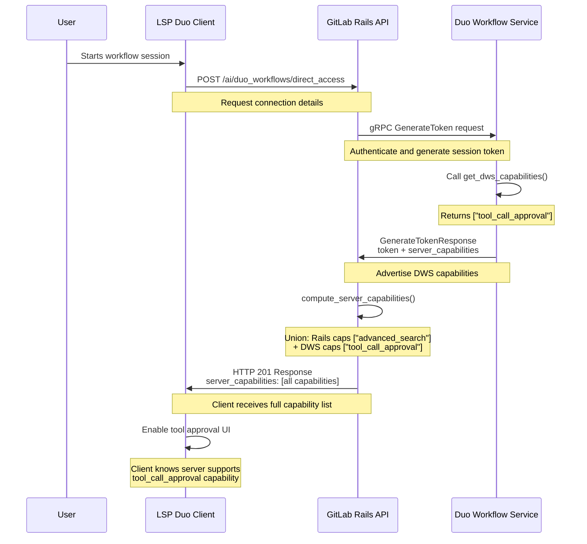
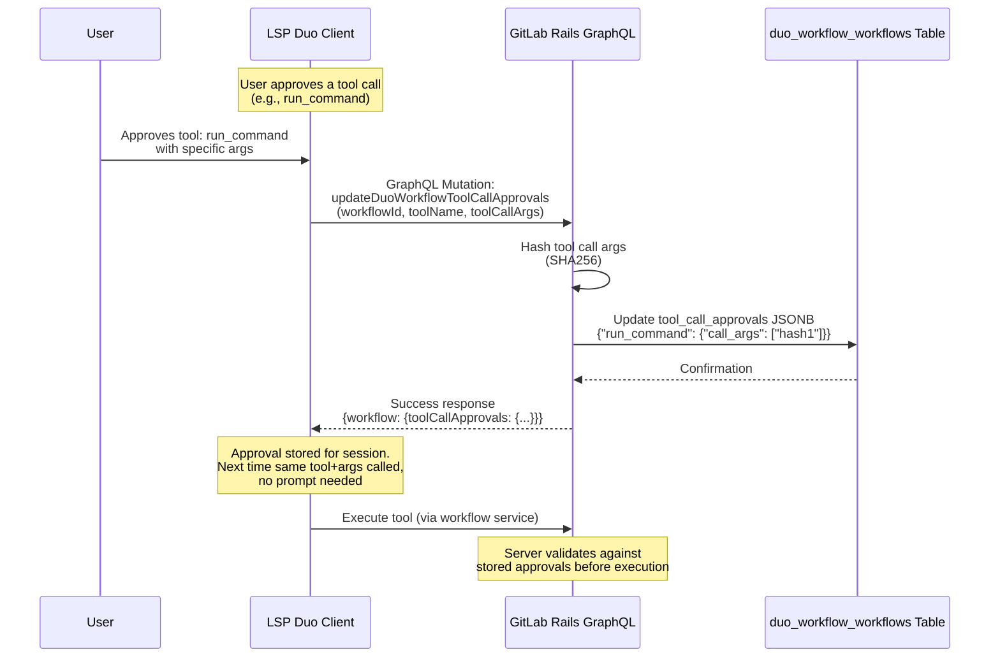



## Summary

Tool Approval System enables GitLab Duo agents to:

1. **Discover server capabilities** via the `/direct_access` endpoint (System 1)
2. **Persist user approvals** across tool invocations within a workflow session (System 2)

**System 1 (Capability Negotiation)**: DWS advertises features it supports (e.g., `"tool_call_approval"`) via protobuf. Rails unions these with Rails-provided capabilities (e.g., `"advanced_search"`). Clients receive the complete list and adapt their UI accordingly.

**System 2 (Approval Persistence)**: Clients send user approval decisions via GraphQL mutation. Rails stores SHA256 hashes of approved tool+args combinations in the workflow's JSONB column. This eliminates redundant approval prompts within a session without compromising security.

By utilizing GitLab Rails as the single source of truth for both capability advertisement and approval storage, this system ensures a "secure-by-default" posture that supports cross-client consistency, centralized auditing, and the long-term roadmap for organizational AI governance.

### Goals

0. **Enable Feature Detection**: Allow clients to discover which features the server supports before attempting to use them.
1. **Centralize Security Policy**: Establish GitLab Rails as the authoritative store for tool approvals.
2. **Enable AI Governance**: Provide the architectural foundation for organization-level tool policies, allowlists/denylists, and compliance auditing.
3. **Optimize User Experience**: Eliminate redundant approval prompts within a session without compromising the security boundary.

---

## Motivation

As AI agents move from simple chat interfaces to autonomous workflows, the trust model must scale. While technical spikes explored client-side storage, a backend-mediated approach is required for enterprise-grade security and oversight.

This system addresses two fundamental questions: (1) Does the server support tool approval workflows? (2) What has the user already approved? The first question is answered by **capability negotiation**, the second by **approval persistence**.

By moving approval state into the GitLab backend, we solve for:

* **Auditability**: Organizations require a permanent record of what was approved and by whom for compliance.
* **Consistency**: A workflow session is a cloud-level entity. Whether a user interacts via VS Code, JetBrains, or the GitLab Web UI, the security context remains identical.
* **Scalability**: This architecture allows for future policy injection, where organizational rules (e.g., "Always allow `ls` in Project X") can be merged with user-level approvals.
* **Extensibility**: This architecture supports extending tool approval to regex patterns and wildcard approvals. As well, this is a fundamental step in enabling autonomous ("yolo") mode for users.
* **Feature Detection**: Clients can gracefully degrade when connecting to older servers that don't support tool approvals.
* **Progressive Enhancement**: New capabilities can be added without breaking older clients.

---

## Architecture

### Architecture Overview

The architecture consists of two complementary systems:

1. **System 1: Capability Negotiation** (Feature Detection)
   * **Purpose**: Client discovers whether server supports tool approval features
   * **Endpoint**: `POST /api/v4/ai/duo_workflows/direct_access`
   * **Flow**: DWS advertises → Rails unions → Client receives

2. **System 2: Approval Persistence** (State Management)
   * **Purpose**: Client sends actual user approval decisions; server stores them
   * **Endpoint**: GraphQL mutation `updateDuoWorkflowToolCallApprovals`
   * **Storage**: `duo_workflow_workflows.tool_call_approvals` JSONB column

**Combined Flow**: Client calls `/direct_access` and receives `server_capabilities: ["tool_call_approval", ...]`. If `tool_call_approval` capability is present, client enables approval UI. When user approves a tool, client sends GraphQL mutation. Rails stores approval hash. Server validates future tool calls against stored approvals.

### System 1: Capability Negotiation

### System 2: Approval Persistence

### Components

#### GitLab Rails (Dual Role)

**For Capability Negotiation (System 1):**

* Receives capability advertisement from DWS via gRPC `GenerateTokenResponse.server_capabilities`
* Computes union of Rails capabilities (e.g., `advanced_search`) + DWS capabilities
* Returns unified capability list in `/direct_access` endpoint response
* Optionally stores capabilities in checkpoint metadata for GraphQL queries

**For Approval Persistence (System 2):**

* Exposes GraphQL mutation `updateDuoWorkflowToolCallApprovals`
* Stores user approval decisions in `duo_workflow_workflows.tool_call_approvals` JSONB column
* Hashes tool call arguments (SHA256) before storage
* Validates approvals using `UpdateToolCallApprovalsService`
* Provides GraphQL type `DuoWorkflows::WorkflowType.tool_call_approvals` for querying stored approvals

#### Duo Workflow Service

* Advertises its capabilities via `get_dws_capabilities()` function in `server_capabilities.py`
* Currently advertises: `["tool_call_approval"]`
* Capabilities returned during token generation, before workflow execution starts
* Extensible: new capabilities can be added to the list
* **Note**: DWS validates tool executions against stored approvals retrieved from Rails

#### LSP Client (Dual Role)

**For Capability Discovery (System 1):**

* Calls `/direct_access` to get connection details **and** server capabilities
* Receives complete capability list upfront
* Enables/disables UI features based on advertised capabilities
* If `tool_call_approval` capability present → Show approval UI

**For Approval Submission (System 2):**

* When user approves a tool call, sends GraphQL mutation
* Mutation includes: `workflowId`, `toolName`, `toolCallArgs` (raw JSON)
* Receives confirmation that approval was stored
* Can skip approval prompts for previously-approved tool+args combinations in the same session

#### AI Gateway

* Facilitates secure gRPC communication between Rails and DWS
* No additional capability-specific logic (transparent pass-through)
* Handles protobuf serialization/deserialization for `server_capabilities` field

#### Database (Postgres)

* `duo_workflow_workflows.tool_call_approvals` JSONB column stores approval hashes
* Schema validated by `duo_tool_call_approvals.json` JSON schema
* Data structure: `{"tool_name": {"call_args": ["sha256_hash", ...]}}`
* 64KB size limit enforced by schema

---

## Capability Types

Capabilities are strings that advertise feature support. Clients check for specific capabilities before enabling features.

### Current Capabilities

| Capability | Source | Meaning |
|------------|--------|---------|
| `tool_call_approval` | DWS | Server requires user approval before executing tools. Client should show approval UI. |
| `advanced_search` | Rails | Elasticsearch is enabled. Agents can use advanced search features. |

---

## Design Decisions

### System 1: Capability Negotiation Decisions

1. **Capability-First Architecture**
   * **Decision**: Server advertises what it supports; client adapts behavior accordingly
   * **Rationale**: Enables graceful degradation. Older DWS instances that don't support tool approvals won't advertise the capability. Clients can detect this and skip approval workflows or show different UI.

2. **Union of Capabilities**
   * **Decision**: Rails combines its own capabilities with DWS capabilities (union operation)
   * **Rationale**: Both Rails and DWS may have independent features. Rails knows about `advanced_search` (Elasticsearch). DWS knows about `tool_call_approval`. Client needs to know about both.

3. **Protobuf Contract Extension**
   * **Decision**: Add `repeated string server_capabilities` to `GenerateTokenResponse`
   * **Rationale**: Capabilities are established during token generation, making them immutable for the session lifetime. Protobuf provides strong typing and cross-language support.

4. **Direct Access Endpoint**
   * **Decision**: Return capabilities in `/direct_access` POST response, not via WebSocket handshake
   * **Rationale**: Simplifies architecture by removing stateful WebSocket negotiation. Client gets all connection info + capabilities in a single HTTP request.

### System 2: Approval Persistence Decisions

1. **GraphQL for Approval Submission**
   * **Decision**: Use GraphQL mutation `updateDuoWorkflowToolCallApprovals` instead of REST API
   * **Rationale**: GraphQL provides strong typing, schema validation, and field-level permissions. Clients can query `workflow.toolCallApprovals` to verify what's stored. Consistent with other workflow mutations.

2. **Hashed Storage (SHA256)**
   * **Decision**: Store SHA256 hashes of tool call arguments, not raw arguments
   * **Rationale**:
     * Security: Prevents sensitive data (passwords, tokens) from being stored in plaintext
     * Size control: Hashes are fixed-length (64 chars), limiting JSONB column growth
     * Comparison: Hashes allow exact match detection without storing full argument payloads

3. **JSONB Column in Workflow Table**
   * **Decision**: Store approvals in `duo_workflow_workflows.tool_call_approvals` JSONB column
   * **Rationale**:
     * Session-scoped: Approvals tied to workflow lifecycle (automatically cleaned up when workflow deleted)
     * Flexible schema: JSONB allows nested structure without schema migrations
     * Efficient queries: Postgres JSONB indexing enables fast lookup
     * 64KB limit enforced by JSON schema prevents abuse

4. **Workflow Status: `tool_call_approval_required`**
   * **Decision**: Add dedicated workflow status for approval-blocked state
   * **Rationale**: Enables workflow to pause execution until user approves. Clear state machine: `running` → `tool_call_approval_required` → `running` (after approval). Supports async approval patterns.

---

**JSON Schema Validation:**

See `app/validators/json_schemas/duo_tool_call_approvals.json` for the complete schema. Key constraints:

* Tool names must match `^[a-zA-Z0-9_]+$`
* Hashes must be exactly 64 hex characters (SHA256)
* Maximum 100 tool types per workflow

---

## Security & Governance Model

| Strategy | Implementation |
| :--- | :--- |
| **Tamper Resistance** | Approvals are stored in the GitLab Postgres DB; they cannot be modified by the agent's own tool execution. |
| **Audit Trail** | Because state is stored in Rails, every approval event can be logged for compliance and security reviews. |
| **Governance Hooks** | Allows Rails to intercept approval requests and apply organization-level blocklists before execution. |
| **Feature Detection** | Clients discover capabilities without assumptions. Missing capability = feature not available. |
| **Capability Allowlisting** | Only explicitly advertised capabilities are available. Server controls the list. |
| **Immutable Session Capabilities** | Capabilities established at token generation time cannot be modified during workflow execution. |
| **Cross-Client Consistency** | All clients connecting to the same DWS/Rails instance see identical capabilities. |

---

### Backward Compatibility

* Rails checks `respond_to?(:server_capabilities)` before accessing field
* If DWS doesn't support capabilities (old version), Rails treats it as empty array
* Client receives empty capability list → assumes no advanced features available

---

## Conclusion

The Tool Approval System provides a scalable, secure, and user-friendly foundation for Duo Workflow through **two complementary systems**:

1. **Capability Negotiation (System 1)** enables clients to discover what features the server supports, allowing graceful degradation and progressive enhancement as new capabilities are added.

2. **Approval Persistence (System 2)** eliminates redundant approval prompts within a session by centralizing approval state in the GitLab backend.

System 1 is the prerequisite for System 2: clients must first discover the `tool_call_approval` capability before they know to show approval UI and submit approval decisions.

By centralizing both capability advertisement and approval storage in GitLab Rails, we eliminate the fragility of client-side assumptions and provide the necessary hooks for enterprise-level AI governance, cross-client consistency, and comprehensive auditing.

This architecture serves as the foundation for future enhancements including organization-level policies, persistent cross-session approvals, pattern-based approvals, and fully autonomous execution modes.
