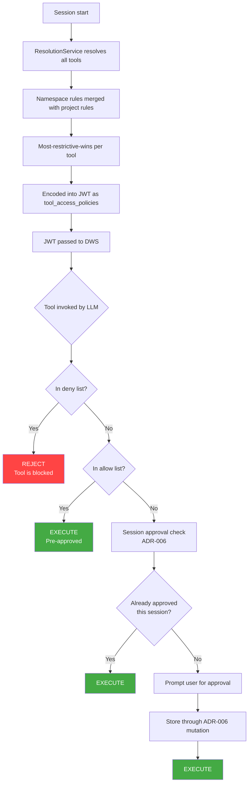
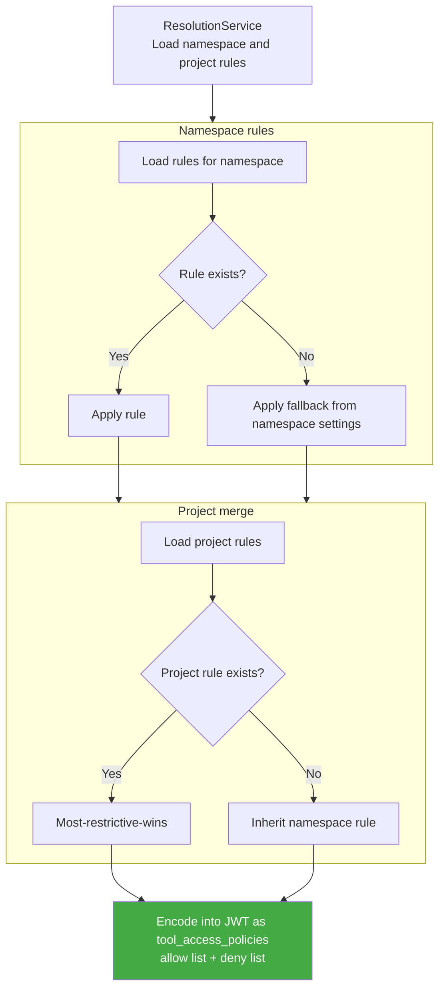



## Executive Summary

This document defines the architecture for GitLab's AI tool rules engine: a persistent, hierarchical policy layer that sits on top of the session-level tool approval system established in [ADR-006: Tool Approval System](006_tool_approval.md).

**ADR-006 (implemented)** answers: *"Has this user already approved this exact tool+args in this session?"* It stores SHA256-hashed approvals in a workflow's JSONB column, scoped to a single session.

**This document (007)** answers: *"Is this tool allowed at all, and does it need human confirmation?"* It introduces a persistent `ai_tool_rules` table where policies cascade hierarchically from Organization/Group down to Project and User scopes, surviving across sessions.

The system treats two concerns as orthogonal axes:

- **Axis 1 — Access control** (`web_access` / `local_access`): Determines whether a tool is permitted at all, and whether it requires human confirmation. Values are `allow`, `ask`, or `deny`. A `deny` at any ancestor level blocks the tool entirely for all descendants, non-overridable.
- **Axis 2 — Surface**: Rules are applied per surface (`web` or `local`), allowing different policies for web-based and IDE-based invocations.

| Signal | Cascade direction | Overridable? |
| :--- | :--- | :--- |
| `deny` | Top-down | No |
| `ask` | Top-down | No |
| `allow` | Never inherited | Explicit rule required |

---

## 1. Problem Statement

- **Current State:** Two systems are in place. ADR-006 provides session-scoped approval persistence, once a user approves a tool+args combination, they are not re-prompted during that workflow session. [MR !230300](https://gitlab.com/gitlab-org/gitlab/-/merge_requests/230300) adds a cascading three-state feature toggle (`default_on`/`default_off`/`never_on`) at the Instance/Group/Subgroup/Project level, giving administrators coarse-grained control over whether tool approval is active. However, neither system supports per-tool policies, user-level pre-approvals, or access control (blocking specific tools entirely).
- **Desired State:** A persistent, per-tool rule engine where policies cascade hierarchically from the Organization/Group level down to both Projects and individual Users. This builds on the feature-level toggle from MR !230300 (which controls the primary switch) and the session approvals from ADR-006 (which provide within-session caching), adding per-tool granularity and a surface-aware governance model.
- **Core Objective:** Establish a robust set of GraphQL endpoints that serve as the foundational entry point for tool governance. This infrastructure will eventually support extended governance and compliance requirements at an Enterprise scale.

---

## 2. Integration with Existing Systems

This system composes with, not replaces, the existing tool approval infrastructure. Three layers operate at different levels of abstraction:

| Layer | System | Role | Persistence | Scope |
| :--- | :--- | :--- | :--- | :--- |
| **Feature toggle** | Cascading `tool_approval_for_session` setting ([MR !230300](https://gitlab.com/gitlab-org/gitlab/-/merge_requests/230300)) | Primary switch: is the tool approval system active for this scope? | Persistent (settings tables through `cascading_attr`) | Instance/Group/Subgroup/Project |
| **Per-tool governance** | **007 (this doc)** — Governance Rules | Policy ceiling: is *this specific tool* allowed? Does it need approval? | Persistent (dedicated DB table) | Org/Group/Project/User hierarchy |
| **Session cache** | **006** — Session Approvals | Runtime cache: has the user already approved this tool+args in this session? | Session-scoped (workflow JSONB) | Single workflow session |

### 2.1 Feature-Level Toggle (Existing)

The cascading `tool_approval_for_session` setting provides a three-state feature toggle at the Instance/Group/Subgroup/Project level:

| State | Meaning | Cascade behavior |
| :--- | :--- | :--- |
| `default_on` | Tool approval is active — tools require approval by default | Descendants can override |
| `default_off` | Tool approval is inactive — tools run freely by default | Descendants can override |
| `never_on` | Tool approval is locked off — no descendant can disable approval requirements | Non-overridable (uses `cascading_attr` lock) |

This setting uses GitLab's existing `cascading_attr` infrastructure and operates as the **primary switch** for the entire governance system. When `default_off`, per-tool governance rules (this document) still apply if they exist — the feature toggle controls the *default behavior* when no per-tool rules match, not whether the rules engine is consulted.

### 2.2 Composed Runtime Flow

When a workflow session starts, Rails resolves all tool governance decisions upfront through `ResolutionService`. The resolved allow/deny lists are encoded into a signed JWT as `tool_access_policies` and passed to DWS for the duration of the session. DWS reads the allow/deny lists from the JWT before presenting tools to the LLM.



**Key composition rules:**

1. Governance resolution runs once at session start, the deny rules are evaluated before the session begins. A denied tool never reaches the LLM.
1. `deny` rules block the tool entirely for all descendants, and is non-overridable.
1. `ask` rules require human confirmation at invocation time through ADR-006's session approval flow.
1. `allow` rules pre-approve the tool, no confirmation needed.
1. The fallback when no rule exists is determined by the namespace's `tool_approval_for_session` setting.
1. A single rule at the group level cascades to all projects within that group. For org-wide policies, a top-level group rule suffices, per-project rules are overrides, not the common case.

### 2.3 Session Approvals and Argument Matching

ADR-006 stores session approvals as SHA256 hashes of tool+args combinations. This is an exact-match mechanism by design — it answers "has the user approved *exactly this* invocation?" SHA256 hashing is inherently incompatible with glob/regex pattern matching.

In v1, this is not a conflict: both governance rules (this document) and session approvals (ADR-006) use exact matching. When v2 introduces glob/regex matching for governance rules, the session approval layer will need its own evolution — likely moving from hash-based lookup to a pattern-aware comparison. That change is scoped to ADR-006's storage model and does not affect the governance rules API defined here.

### 2.4 Capability Negotiation

ADR-006's capability negotiation (`tool_call_approval` through `/direct_access`) remains unchanged. The governance rules system adds no new capabilities to negotiate — it operates server-side as a pre-check before the existing approval flow. The `tool_call_approval` capability continues to be filtered based on the cascading `tool_approval_for_session` setting.

---

## 3. Governance Logic

The system operates on a surface-aware three-state model: `allow`, `ask`, `deny`. Rules are stored per surface (`web_access`, `local_access`) allowing different policies for web-based and IDE-based invocations.

### 3.1 Hierarchy of Enforcement

Resolution applies most-restrictive-wins across the namespace and project hierarchy:

- A `deny` at any ancestor level immediately blocks the tool for all descendants. Non-overridable.
- A project rule can only escalate (make stricter) relative to the namespace rule, it cannot loosen a namespace policy.
- When no rule exists, the fallback is determined by the namespace's `tool_approval_for_session_availability` setting: `default_off` falls back to `allow`, `default_on` falls back to `ask`.



### 3.2 Authority Tiers & UI States

The UI reflects the current state for each tool per surface.

#### Access Mandates (hard cascade)

When a `deny` rule exists at any ancestor level, the tool is blocked entirely for all descendants.

- **Behavior:** The tool is inaccessible. No local override is possible.
- **UI State:** The toggle is **Locked/Disabled** and labeled: *"Blocked by [Group Name]"*.

#### Approval Required

When a rule is set to `ask`, human confirmation is required before the tool runs.

- **Behavior:** The tool is available but requires approval at each invocation (subject to ADR-006 session caching).
- **UI State:** The toggle shows **Ask** and may be locked if set by an ancestor scope.

#### Auto-approve

When a rule is set to `allow`, the tool runs without confirmation.

- **Behavior:** The tool is pre-approved for the session.
- **UI State:** The toggle shows **Allow**.

### 3.3 Resolution Matrix

| Namespace Rule | Project Rule | Effective Rule |
| :--- | :--- | :--- |
| `deny` | Any | `deny` |
| `ask` | `deny` | `deny` |
| `ask` | `allow` | `ask` (project cannot loosen) |
| `ask` | `ask` | `ask` |
| `allow` | `deny` | `deny` |
| `allow` | `ask` | `ask` |
| `allow` | `allow` | `allow` |
| None | `deny` | `deny` |
| None | `ask` | `ask` |
| None | `allow` | `allow` |
| None | None | Fallback from namespace settings |

---

## 4. API Design & Integration

### 4.1 GraphQL Mutations

```graphql
mutation UpdateAiToolRule($input: UpdateAiToolRuleInput!) {
  updateAiToolRule(input: $input) {
    toolRule {
      id
      name
      webAccess
      localAccess
      actionType
      category
      source
    }
    errors
  }
}
```

**UpdateAiToolRule**
Allows namespace owners to define or update a governance rule for a specific tool. Accepts `fullPath` (namespace), optional `projectPath` (for project-scoped rules), `toolId`, `webAccess`, and `localAccess`. Tool names are validated against the registry at write time. Project-scoped rules can only be stricter than the namespace rule, loosening is not permitted.

### 4.2 GraphQL Queries

```graphql
query {
  aiToolRules(fullPath: "my-group", projectPath: "my-group/my-project") {
    nodes {
      id
      name
      webAccess
      localAccess
      actionType
      category
      source
    }
  }
}
```

**aiToolRules**
Returns the merged effective rules for all tools in the registry, applying most-restrictive-wins across namespace and project rules. When `projectPath` is provided, project-level rules are merged on top of namespace rules. Fallback values are returned for tools with no explicit rule, derived from the namespace's `tool_approval_for_session_availability` setting. Supports optional filter arguments: `search`, `actionType`, `category`, `source`, and their negated equivalents.

### 4.3 Authorization Model

- **Namespace rules:** Owner role required (read + write).
- **Project rules:** Owner of the parent namespace required. Project-level rules can only escalate, so will never loosen the namespace policy.
- **User rules:** Deferred to post-GA. See v2 document.

---

## 5. Data Model

### 5.1 Database Schema

```ruby
create_table :ai_tool_rules do |t|
  t.references :namespace, null: false, foreign_key: { on_delete: :cascade }
  t.references :project, null: true, foreign_key: { on_delete: :cascade }
  t.string :tool_name, null: false
  t.integer :web_access, limit: 2      # 0: allow, 1: ask, 2: deny
  t.integer :local_access, limit: 2    # 0: allow, 1: ask, 2: deny
  t.string :tool_source
  t.jsonb :tool_arguments
  t.timestamps_with_timezone

  t.check_constraint "(web_access IS NOT NULL OR local_access IS NOT NULL)",
    name: "chk_ai_tool_rules_has_permission"
end

add_index :ai_tool_rules,
  [:namespace_id, :project_id, :tool_name],
  unique: true,
  nulls_not_distinct: true,
  name: "idx_ai_tool_rules_ns_proj_tool_unique"

add_index :ai_tool_rules, :project_id,
  name: "index_ai_tool_rules_on_project_id"
```

**namespace_id is always required.** `project_id` is an additional scoping constraint rather than a peer alternative to `namespace_id`. A project rule is a namespace rule scoped further down to a specific project, not a rule owned by the project instead of the namespace. This gives stronger data integrity (foreign keys on both columns) and avoids the polymorphic association pattern.

**`NULLS NOT DISTINCT`** on the composite unique index treats `NULL` `project_id` values as equal for uniqueness purposes, ensuring at most one namespace-level rule per tool and at most one project-level rule per tool per project.

**ON DELETE CASCADE:** When a namespace or project is deleted, all associated governance rules are automatically removed.

### 5.2 Schema Structure

- **namespace_id**: Always non-null. The root owner of every rule.
- **project_id**: Nullable. When present, scopes the rule to a specific project within the namespace.
- **web_access**: SmallInt enum. Permission for web and ambient surfaces. `0` = allow, `1` = ask, `2` = deny.
- **local_access**: SmallInt enum. Permission for local/IDE surfaces. Same values as `web_access`.
- **tool_name**: String identifier validated against the tool registry at write time.
- **tool_source**: String. `gitlab` for built-in tools, `mcp` for external MCP tools.
- **tool_arguments**: JSONB. Reserved for future argument-level matching. Currently unused in resolution.

---

## 6. Performance

**Upfront resolution:** Governance decisions are resolved once at session start rather than per-invocation. The resolved allow/deny lists are encoded into a signed JWT and passed to DWS, eliminating per-invocation latency and removing the need for decision caching or Redis pub/sub invalidation. A rule change takes effect at the start of the next session.

**Query efficiency:** Resolution performs two queries, one for namespace rules and one for project rules, and merges them in memory. At the current scale of the tool registry and rule table this is efficient. For deeper group hierarchies or larger rule sets, GitLab's `traversal_ids` (materialized path on namespaces) could be used to fetch all rules in a single query. This optimisation is deferred until production data indicates it is needed.

**Audit Trail:** Audit events are emitted when tool rules are created or updated, providing compliance teams with a trail of policy changes. Tool invocation audit events are handled by ADR-006.

---

## 7. Security & Integrity

- **JWT signing:** Governance decisions are encoded in a signed JWT. DWS verifies the JWT signature before reading the allow/deny lists, preventing spoofing or tampering in transit.
- **Fail-Closed Policy:** In the event of a resolution failure, the system falls back to `DEFAULT_PRIVILEGES`, a predefined set of all available privilege groups (`READ_WRITE_FILES`, `READ_ONLY_GITLAB`, `READ_WRITE_GITLAB`, `RUN_COMMANDS`, `USE_GIT`, `RUN_MCP_TOOLS`). This grants access to all tools but with no pre-approvals, meaning every tool invocation will require user confirmation through ADR-006's session approval flow. This is fail-open for access but fail-closed for autonomy, tools are available but none are auto-approved.
- **Denied Tool Filtering:** Denied tools are stripped from the toolset before DWS presents tools to the LLM. The model never sees tools it cannot use, reducing hallucination risk and preventing the model from attempting to invoke blocked tools.

---

## 8. v2 and Beyond

Deferred capabilities and their rationale are tracked in [AI Governance v2: Deferred Capabilities](007_ai_governance_v2.md).
