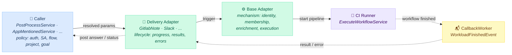
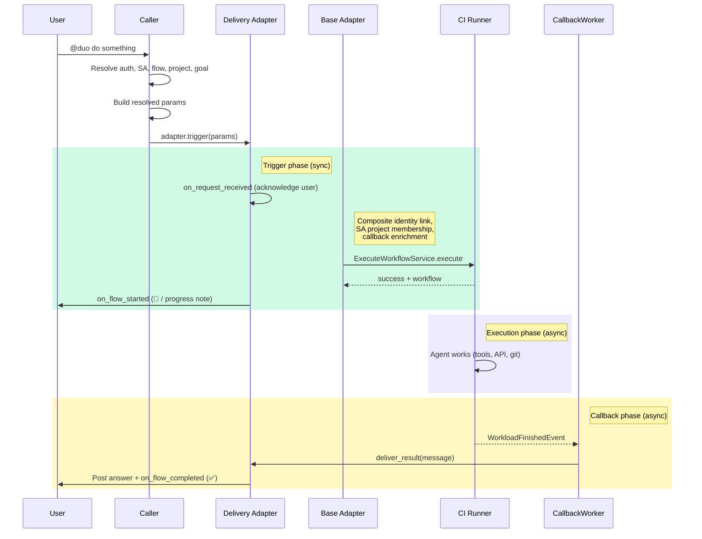
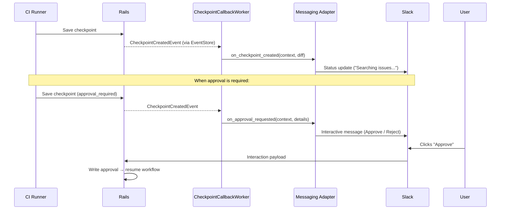

## Context

We want users to interact with Duo from various surfaces — external messaging
services (Slack, Microsoft Teams, WhatsApp, Telegram) as well as GitLab-native
surfaces like issue and merge request comments. A user @mentions Duo, gives it
a task, and Duo works on it asynchronously and posts back the result.

While the primary motivation is external messaging platforms, the same adapter
pattern naturally extends to GitLab note-based interactions (e.g., @mentioning
a Duo service account on an MR or issue). Comments on a merge request are
conceptually a form of messaging, and the architecture treats them uniformly.

Two challenges are specific to these interactions:

1. CI pipelines require a project, but some surfaces (e.g., Slack) have no
   project context
2. Multiple surfaces need to be supported without duplicating orchestration
   logic

### Alternatives considered

Five approaches were investigated:

1. **CI job (Flows API)** — Trigger a CI pipeline via the existing Flows
   infrastructure. Battle-tested, ADR 004 compliant, no Workhorse or DWS
   changes. The only approach that provides a real execution environment —
   the agent can git clone, run tests, install tools, and do full development
   tasks. Downside: CI startup latency (~10s with empty project). Requires a
   project for the pipeline — solved by auto-creating a workspace project when
   no project context exists. When the surface already provides a
   project (e.g., a GitLab note on an MR), no workspace project is needed.

2. **WebSocket blocking** — Sidekiq worker opens a WebSocket to Workhorse,
   keeps it open for the full workflow duration. Simple, supports streaming.
   Downside: blocks a Sidekiq thread for up to 5 minutes per request, limiting
   throughput to ~50 concurrent workflows per Sidekiq process. No execution
   environment — the agent runs inside Workhorse with no filesystem, no git,
   no ability to run commands. Limits the agent to read-only API interactions
   with no path to development tasks.

3. **WebSocket fire-and-forget** — Sidekiq opens WebSocket, sends start
   request, disconnects immediately. **Blocked**: prototyping revealed Workhorse
   terminates the workflow when the client disconnects (sends `StopWorkflow` on
   clean close, tears down gRPC on abnormal close). Would require Workhorse
   changes to add a headless/detached mode. Same execution environment
   limitation as option 2.

4. **Direct gRPC** — Sidekiq opens a gRPC bidi stream directly to DWS.
   Lower latency, type-safe. **Violates ADR 004** (introduces a second path to
   DWS). Must reimplement HTTP action proxying in Ruby. No established pattern
   for gRPC bidi streaming from Sidekiq in the codebase. Same execution
   environment limitation — no filesystem or tooling available.

5. **Workhorse headless HTTP** — New Workhorse endpoint that accepts a
   workflow trigger via HTTP POST, manages the gRPC stream internally.
   **Requires cross-team Workhorse changes** (~50-100 lines of Go) and a
   modified runner lifecycle. Same execution environment limitation as
   options 2-4 — no path to development tasks without additional architecture.

## Decision

Use the **Flows API (CI job)** approach with an **adapter pattern** for
multi-surface support and a **per-namespace workspace project** as a fallback
for surfaces that lack project context.

### Architecture



**Solid arrows** = synchronous calls &nbsp;&nbsp; **Dashed arrows** = async events

### Request flow



### Key design choices

**Caller owns policy, adapter owns delivery, base adapter owns mechanism.**
The architecture separates three concerns:

- **Callers** (e.g., `PostProcessService` for `@mention` triggers,
  `AppMentionedService` for Slack) own all policy decisions: authorization,
  service account selection, flow selection, version selection, project
  selection, and goal building. The caller resolves everything and builds a
  typed, resolved input before involving the adapter.
- **Delivery adapters** (e.g., `GitlabNote`, `Slack`) own the user-facing
  lifecycle: acknowledging the request, showing progress, delivering results
  or errors, and persisting callback state for async restoration. Adapters are
  organized by **delivery channel**, not trigger source — a `GitlabNote`
  adapter handles any flow that delivers via note threads, whether triggered
  by `@mention`, `@GitLabDuo`, or a future webhook.
- **The shared base adapter** handles security-critical mechanism no caller or
  adapter should do individually: composite identity linking, SA project
  membership, callback context enrichment, resource translation, and workflow
  execution via `ExecuteWorkflowService`.

This means different callers can have fundamentally different auth models
(e.g., Slack uses workspace install + namespace mapping, GitLab note uses
`:trigger_ai_flow` policy, `@GitLabDuo` uses MR-level abilities) while
reusing the same delivery adapter when the channel is the same.

**Flow reference and version are caller-controlled.** Each caller specifies
which flow to trigger (e.g., `developer/v1`) and optionally pins a version.
Callers can use the standard resolution path for flow versioning or override
the version independently. This allows the same infrastructure to support
multiple agent flows with different version strategies.

**`project:` is caller-controlled — workspace project is a fallback.** When a
caller has a project (e.g., a GitLab note on an MR provides `note.project`),
that project is used directly. The `duo-workspace` auto-created project only
comes into play for callers without project context (e.g., Slack's
`AppMentionedService`).

**`duo-workspace` auto-created project (for project-less surfaces).** A
private, empty project per top-level namespace provides CI pipeline context
when no project is available. The workspace project is created at the **root
namespace** of the user's `duo_default_namespace` — for example, if the user's
default namespace is `gitlab-org/editor-extensions`, the workspace project is
created at `gitlab-org/duo-workspace`. This keeps one workspace project per
top-level group, avoiding proliferation of projects across nested namespaces.
The exact project name (`duo-workspace`) is not final and can be iterated on.

The workspace project is created when the admin enables the flow for the
namespace (using admin permissions), with a fallback find-or-create at trigger
time for robustness. Teams customize the workspace project (Docker image,
AGENTS.md, skills, CI variables, runner tags) using existing project features.
Follows the same pattern as Security Policy Projects.

**Composite identity uses existing auth-domain primitives.** Composite identity
linking delegates to the auth domain rather than introducing a parallel linker
module. The SA uses `composite_identity_enforced: true` — the same security
model used by Duo Developer and other agent platform flows. Effective
permissions are the intersection of the triggering user's and the service
account's access.

**Tiered resilience.** Lifecycle hooks are categorized by criticality:
user-facing acknowledgement must succeed or the trigger short-circuits;
best-effort hooks (progress updates, completion signals) are resilient to
failure; security-critical steps and workflow execution fail loudly.

**EventStore callback.** `CallbackWorker` subscribes to
`WorkloadFinishedEvent`, checks for `messaging_callback_context` on the
workflow record (JSONB column), and delivers results through the adapter.
No GraphQL, no polling. The base adapter enriches the adapter-provided callback
context with orchestration metadata (adapter key, service account ID, flow
reference, version) before persisting it, so the async path can resolve the
adapter and service account without re-resolving them. Example:

```json
{
  "adapter": "slack",
  "team_id": "T0123ABC",
  "channel_id": "C0123ABC",
  "thread_ts": "1234567890.123456",
  "service_account_id": 12345,
  "flow_reference": "developer/v1"
}
```

### Path to streaming and human approval

The architecture extends to real-time progress and interactive features without
changing the core design:



A new `CheckpointCallbackWorker` subscribes to a `WorkflowCheckpointCreatedEvent`
— separate from `CallbackWorker` because checkpoint events have different
characteristics (high frequency, different retry semantics). Each step is
event-driven; no persistent connections are needed. Approval state is persisted
on the workflow record and the flow can be stopped and restarted.

### Adapter interface

The adapter's `trigger` method accepts fully resolved input from the caller
(user, service account, flow, version, project, goal). The adapter does not
resolve policy — it only delivers.

**Delivery (required):**

| Method | Purpose |
|---|---|
| `build_callback_context` | Build adapter-specific context for async delivery (e.g., note/discussion IDs, Slack channel/thread IDs) |
| `deliver_result(callback_context:, message:)` | Post the final answer to the surface |
| `deliver_error(callback_context:, error:)` | Post an error message to the surface |

**Lifecycle hooks (optional overrides):**

| Method | Purpose |
|---|---|
| `on_request_received` | Pre-trigger acknowledgement (e.g., create progress note). Must succeed or trigger aborts |
| `on_flow_started` | Signal work started (e.g., 👀 emoji, update progress note) |
| `on_flow_completed` | Signal work done (e.g., ✅ emoji) |
| `on_flow_failed` | Signal failure (e.g., ❌ + error). Distinguishes sync failures (before workflow started) from async failures (workflow ran and failed) so adapters can do conditional cleanup |
| `on_checkpoint_created` | Intermediate progress update (future) |
| `on_approval_requested` | Post approval prompt (future) |

**Async restoration:** Each adapter declares a unique key for registry lookup
and implements a factory method to reconstruct itself from persisted callback
context. `CallbackWorker` uses a descendants-based registry to resolve the
correct adapter class at delivery time.

The base class provides a template method that orchestrates: acknowledgement,
callback context building, composite identity linking, SA project membership,
callback context enrichment, and workflow execution. Callers resolve policy and
build the input; adapters implement delivery; the base class handles shared
mechanism.

### Responsibility split

| Concern | Owner |
|---------|-------|
| Authorization | Caller (surface-specific policy) |
| Service account selection | Caller |
| Flow and version selection | Caller |
| Project selection | Caller |
| Goal building | Caller |
| Build resolved input for adapter | Caller |
| Pre-flight checks (e.g., Slack OAuth linking, license) | Caller (before adapter is involved) |
| Callback context (channel/thread IDs) | Delivery adapter |
| User-facing lifecycle (progress, results, errors) | Delivery adapter |
| Async restoration from callback context | Delivery adapter |
| Composite identity linking | Base adapter (mechanism) |
| SA project membership | Base adapter (mechanism) |
| Callback context enrichment (adapter key, SA ID, flow ref) | Base adapter (mechanism) |
| Resource translation (Issue → `issue_id`, MR → `merge_request_id`) | Base adapter (mechanism) |
| Workflow execution (`ExecuteWorkflowService`) | Base adapter (mechanism) |

This three-layer split — caller, delivery adapter, base adapter — means adding
a new trigger source on an existing channel (e.g., `@GitLabDuo` on GitLab
notes) requires only new caller-side resolution code; the existing delivery
adapter is reused unchanged. Adding a new channel (e.g., Microsoft Teams)
requires a new delivery adapter but no changes to the base adapter or existing
callers.

### Startup time

| Step | Today (large project) | With duo-workspace |
|---|---|---|
| Git clone | Seconds–minutes | Near-instant (empty repo) |
| Docker image | Default, pulled each time | Custom via `agent-config.yml`, cached |
| `duo-cli` install | `npm install` each run (~15s) | Pre-baked into custom image |

Prototyping showed end-to-end response times under 10 seconds with an empty
workspace project. This is acceptable for async messaging. Teams optimize
further by customizing the workspace project (cached images, dedicated runners,
pre-installed tools).

## Pros

- Battle-tested CI/Flows infrastructure — no new execution runtime
- No Workhorse or DWS changes required
- ADR 004 compliant
- Every CI improvement benefits messaging for free
- Adapter pattern cleanly separates surface policy from shared mechanism
- Same architecture handles both external messaging and GitLab-native surfaces
- Workspace project is a natural customization surface (image, skills, secrets)
- Typed adapter contract catches missing fields early
- Streaming and human approval extend the same architecture additively
  (new EventStore subscriptions, new adapter hooks — no core changes)

## Cons

- CI startup latency (~10s with empty project) is slower than a direct
  service call, though acceptable for async messaging
- Auto-creating projects and service accounts adds implicit resources to
  namespaces
- Adapter methods run in two contexts — sync (full state) and async (only
  callback context) — requires clear documentation for new adapter authors
- Each new trigger source must implement its own resolution logic (auth, SA,
  flow, project) at the call site, though this is typically straightforward
  code rather than a new class

## Implementation

- [Issue](https://gitlab.com/gitlab-org/gitlab/-/work_items/590434)

### Feature flag

The entire flow is gated behind the
[`slack_duo_agent`](https://gitlab.com/gitlab-org/gitlab/-/work_items/592185)
feature flag (per-user), which already gates the `AppMentionedService`.
