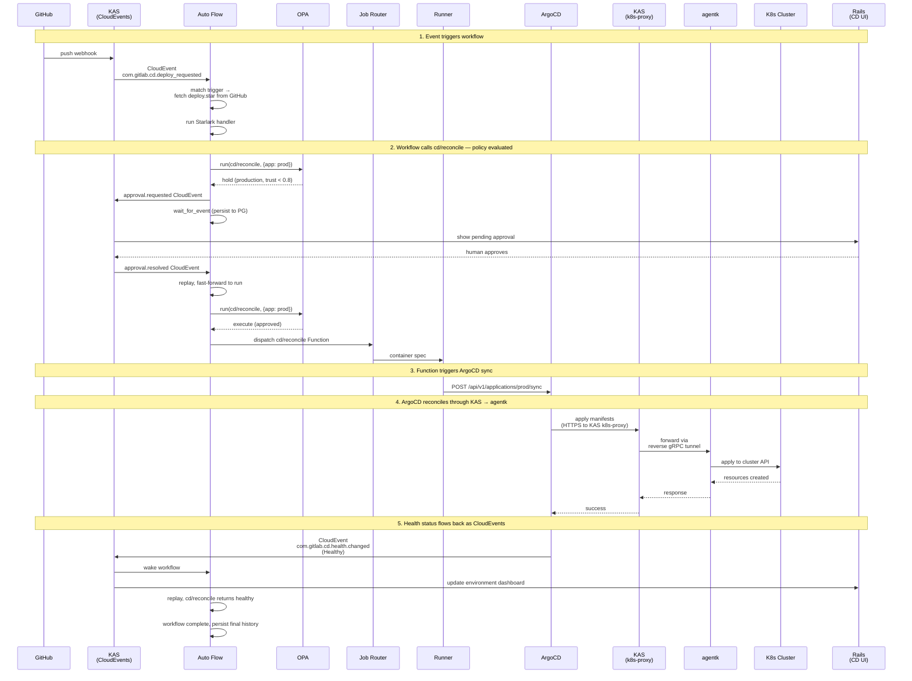



## Overview

This design describes a Continuous Deployment product for GitLab. It is a standalone product — it does not require GitLab SCM or CI, though it integrates with both when present.

The system is built on **Auto Flow**, a durable workflow engine running in KAS. Auto Flow orchestrates deployment decisions. **GitLab Functions** execute deployment actions on Runner. **OPA** governs what runs where. A **GitOps reconciler** (ArgoCD as the golden path) converges clusters to desired state. **CloudEvents** flowing through KAS connect everything.

## The Problem

GitLab doesn't have a CD product. What we call CD today is CI jobs with `environment:` annotations. Our own Delivery team chose ArgoCD over our tooling for deploying gitlab.com — CI handles orchestration, ArgoCD handles reconciliation, and ArgoCD's UI is the operational surface. That split works, but it's not a product.

Three things are missing:

1. **No deployment engine.** CI can run deployment scripts, but it has no concept of reconciliation, drift detection, health-based completion, or live state. A deployment job succeeds when the script exits 0, not when the workload is healthy.

2. **No durable orchestration.** CD workflows wait — for soak periods, deployment windows, human approvals — and need to survive failures without restarting from scratch. CI pipelines have no human-in-the-loop mechanism and are deeply coupled with SCM. GitLab has no general-purpose workflow engine for processes that span human-scale time. Auto Flow was designed to be this engine, but stalled — partly on its Temporal dependency, partly on lack of investment.

3. **No governance for AI-driven deployments.** AI agents are increasingly capable of making deployment decisions. They don't currently have a way to participate safely in CD workflows — no identity model, no trust accumulation, no policy framework that governs what an agent can do in which environment.

## Architecture

### Auto Flow

Auto Flow is a durable workflow engine that runs as a module in KAS. Workflows are Starlark scripts fetched from any Git server. Three primitives:

- **`run`** — invoke a GitLab Function. The only primitive that does work. Subject to OPA policy on every invocation.
- **`sleep`** — suspend the workflow for a duration.
- **`wait_for_event`** — suspend until a matching CloudEvent arrives.

Auto Flow executes in-memory where possible. A goroutine runs the Starlark script start-to-finish. Built-in Functions (`builtin://`) execute in-process in KAS. Catalog and Agent Functions dispatch to Runner via the Job Router. State is the accumulated results of activities that have been executed — each activity completion is automatically persisted to PostgreSQL. On resume, the script replays from the top. Completed activities return cached results instantly. The script fast-forwards to where it left off.

Auto Flow owns trigger registration. A trigger binds a CloudEvent type (with optional filter) to a workflow definition (Git URL, path, ref, credentials). When a matching event arrives at KAS, Auto Flow fetches the script, loads it, and runs the matching `on_event` handler. Triggers are created through Auto Flow's API — the CD UI in Rails is one client, but any future Auto Flow consumer can register triggers through the same API.

Auto Flow is not CD-specific. It is a general-purpose durable workflow engine. CD is the first product built on it.

The deployment execution layer — the Deploy Driver, the pipeline config, and the Argo Rollouts Beta — is described in the [GitLab CD: Deployment Execution](cd_execution.md) sub-document.

### Functions

All work in a workflow is a Function invocation via `run`. Functions are the existing GitLab Functions technology — versioned, with declared inputs and outputs, executed on Runner by Step Runner. They're referenced by Git URL and version, the same way CI jobs reference them today.

Three sources of Functions:

- **Built-in** (`builtin://`) — provided by KAS, execute in-process. Lightweight operations like sending events.
- **Component Catalog** — published Functions for reuse. CD-specific Functions for reconciliation, metrics, compliance. Also customer-published Functions.
- **AI Catalog** — Agent Functions. Same dispatch model, different catalog source. Trust scores and certification live here.

Functions dispatch to Runner through the Job Router — same path for CI and CD. Runner doesn't know the source. KAS auth is pluggable (GitLab Rails for CI, OIDC or static tokens for standalone CD), so Runners can attach to the CD system without CI runner registration.

### Policy

OPA evaluates every `run` call. The policy input includes:

- **Function identity** — the reference and inputs from the `run` call
- **Trust score** — from the Component Catalog or AI Catalog, if the Function is registered there
- **Environment** — from CD configuration, resolved by the context of the invocation
- **Caller** — workflow identity, trigger source, initiator

Policy returns **execute**, **hold**, or **reject**.

```rego
package gitlab.functions

default decision := "execute"

decision := "hold" {
    input.environment.tier == "production"
    input.function.trust_score < 0.8
}

decision := "reject" {
    input.environment.tier == "production"
    in_change_freeze(input)
    not input.caller.emergency_bypass
}
```

Execute proceeds directly. Reject returns an error to the Starlark script. Hold emits an `approval.requested` CloudEvent and the workflow enters `wait_for_event` — transparent to the script. When approval arrives from a human or a trusted agent, the Function dispatches. The workflow author writes the same code regardless of what policy applies.

OPA is the policy engine for Function execution across GitLab. CD writes deployment governance policies. CI can write pipeline security policies. Different rules, same framework.

Policy rules are versioned and reviewed. Git is one source — version-controlled and MR-reviewable. OCI policy bundles are another — they support signing out of the box, providing stronger integrity guarantees than Git alone, and the GitLab Registry already supports the OCI media types. Environment configuration (tier, risk level, labels) is managed through the CD API and stored in CD's own tables. Trust scores live in the catalogs. All feed into OPA as data.

### Environments

An environment is a named policy scope. It has a tier (production, staging, development), a risk level, labels, and associated deployment targets. Environments are the core domain object that CD owns.

When a Function runs in the context of a deployment workflow, the environment determines what policy applies. "Production requires approval for Functions invoked by AI agents with trust below 0.8" — that's a policy rule that references environment properties.

Environments are managed through the CD API in Rails and stored in CD tables. Auto Flow doesn't know what an environment is. OPA evaluates environment properties as data.

### Reconciliation

A GitOps reconciler converges clusters to declarative desired state — sourced from Git, OCI, or any other supported origin. ArgoCD is the golden path. The reconciler is not part of Auto Flow — it's a deployment target that CD Functions interact with.

CD Functions trigger the reconciler, query health, preview diffs, and initiate rollbacks. These Functions are published in the Component Catalog. They call the reconciler's API. The reconciler reports status back through CloudEvents flowing through KAS. A different reconciler (Flux, or something custom) means different Function implementations. The workflow doesn't change.

ArgoCD connects to remote clusters through KAS's k8s-proxy, where agentk provides a transparent Kubernetes API bridge. ArgoCD doesn't know KAS exists.

### CloudEvents

KAS is the event bus. Events flow in from Rails, ArgoCD, agentk, agentw, external webhooks (GitHub, Jenkins, any CI system). Events flow out to Auto Flow (triggers and wake-ups) and Rails (dashboard updates).

CloudEvents are how CI integrates with CD. CI pipeline completes → CloudEvent → Auto Flow trigger → deployment workflow runs. No shared workflow engine needed. The event is the integration point.

### CD in GitLab Rails

The CD product surface is an organization-level UI in Rails. It queries Auto Flow over gRPC for workflow runs labeled as CD. It reads its own tables for environment configuration. It reads catalog data for trust scores. It assembles a view from these sources:

- **Environment dashboard** — what's deployed where, health state, drift status. Live updates from CloudEvents.
- **Workflow runs** — active deployments, their history, decision trails. From Auto Flow.
- **Approvals** — pending decisions with context, approve/deny. Writes back to Auto Flow.
- **Compliance** — audit trail by framework, environment, time period. From workflow history.
- **Trust** — agent activity, trust scores, certification status. From AI Catalog.

CD configuration (environments, triggers, policy references) is managed through Rails and stored in CD tables. Trigger creation calls Auto Flow's API. Environment data is loaded into OPA as policy data.

The Rails domain model, API, persistence, and lifecycle are described in the [GitLab CD: Rails](rails.md) sub-document.

## Example: Canary to Production

```python
# deploy.star — fetched by KAS from any Git server

def canary_to_production(w, ev):
    service = ev["data"]["service"]
    version = ev["data"]["version"]

    # Deploy canary. Dispatches to Runner.
    w.run(step="gitlab.com/cd/reconcile@v1", inputs={
        "app": "%s-canary" % service,
        "revision": version,
        "wait_healthy": True,
    })

    # Soak.
    w.sleep(minutes=30)

    # Check canary health. Dispatches to Runner.
    metrics = w.run(step="gitlab.com/cd/metrics-query@v1", inputs={
        "query": "rate(http_errors_total{service='%s',canary='true'}[10m])" % service,
        "threshold": 0.01,
    })
    if metrics["breached"]:
        w.run(step="gitlab.com/cd/rollback@v1", inputs={"app": "%s-canary" % service})
        return

    # Promote to production. Dispatches to Runner.
    # If policy says "hold" for this environment, the workflow
    # transparently suspends until approval arrives.
    w.run(step="gitlab.com/cd/reconcile@v1", inputs={
        "app": "%s-production" % service,
        "revision": version,
        "wait_healthy": True,
    })

on_event(type="com.gitlab.cd.deploy_requested", handler=canary_to_production)
```

This workflow has four activities: two `run` calls that dispatch to Runner, one `sleep`, and a potential policy hold on the production `run`. State is persisted after each completes. If policy auto-approves, the second reconcile dispatches immediately. If policy holds, the workflow suspends — the script doesn't know or care. It called `run` and eventually gets a result back.

## What Needs to Be Built

| Component | Status |
|---|---|
| **Auto Flow replay engine** | New. Replaces Temporal. PostgreSQL-backed activity history, replay/resume lifecycle, timer service. Core build. |
| **Auto Flow trigger registration** | New. API for binding CloudEvent types to workflow definitions. |
| **Auto Flow script fetching** | New. KAS fetches Starlark from any Git server via HTTPS/SSH. |
| **Starlark interpreter in KAS** | Exists (AutoFlow PoC). Extend with `run`, `sleep`, `wait_for_event`. |
| **CloudEvent routing in KAS** | Partially exists (AutoFlow PoC, Rails → KAS path). Extend with ArgoCD, agentk, external webhooks. |
| **OPA integration in KAS** | New. Embedded OPA evaluates policy on every `run`. |
| **Job Router** | Being built (Job Router blueprint). Extend to accept dispatches from Auto Flow. |
| **KAS pluggable auth** | New. go-plugin interface for OIDC, static tokens, Vault. |
| **K8s proxy enhancements** | Exists. Needs path-based routing and watch stream reliability for ArgoCD. |
| **CD Functions** | New. `cd/reconcile`, `cd/metrics-query`, `cd/rollback`, `cd/compliance`, etc. Published in Component Catalog. |
| **CD tables in Rails** | New. Environments, policy references, deployment target mappings. |
| **CD UI in Rails** | New. Organization-level dashboard, approvals, compliance, trust visualization. |
| **Trust scores in catalogs** | New. Per-function/agent per-scope scores in Component Catalog and AI Catalog. |
| **Runner** | Exists. No changes — new job source is transparent. |
| **ArgoCD** | External, unchanged. Connected via K8s proxy and CloudEvents. |
| **PostgreSQL** | Exists. New tables for Auto Flow state and CD configuration. |

## Sequence



## Open Questions

**Workflow serialization.** GitLab Delivery needs one active deployment per environment at a time (same problem CI's `resource_group` solves). Auto Flow needs an equivalent — a concurrency constraint on workflow runs, scoped by environment or custom key.

**Standalone deployment topology.** For a customer buying GitLab CD without SCM: what exactly do they deploy? KAS, PostgreSQL, Runner, ArgoCD, and the Rails CD UI — but no Gitaly, no Sidekiq? The minimal footprint needs to be specified.

**Replay engine correctness.** Starlark replay requires determinism. Anything non-deterministic (clock access, RNG, etc.) is an activity whose result is persisted and replayed. The replay semantics need formal specification and thorough testing.

**Visual deployment canvas.** The product requirements describe a visual editor that generates deployment workflows. This canvas would produce Starlark. The canvas design and the Duo AI integration for generating `deploy.star` from repository analysis need separate design work.
