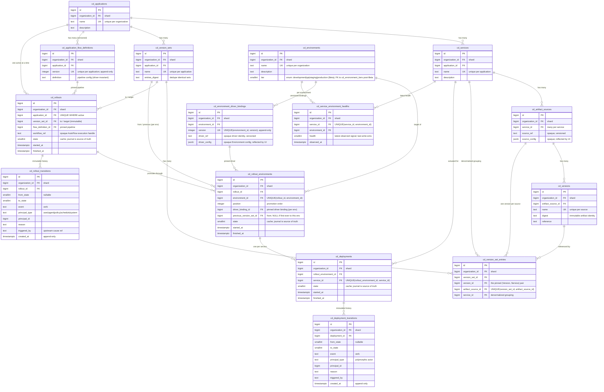

This document describes the Rails layer of [GitLab CD](_index.md): the domain model, the API, the persistence and lifecycle of a deployment, and the UI that configures it. Rails owns the *data* of a deployment — what you're deploying, where, and the immutable record of what happened. It does not run the deployment, and it does not know how the deployment is performed.

That last point is the whole game. GitLab CD has to deploy to Kubernetes today and to Cloud Run, Lambda, or something nobody's invented yet tomorrow — from artifacts built by GitLab CI or pulled from ECR, Artifactory, or a registry we've never heard of. If Rails knows how to talk to Kubernetes, or assumes the artifact came from a GitLab pipeline, we've already lost. So the design keeps Rails ignorant of both, on purpose.

## Scope

This document covers:

- The CD domain entities and their relationships.
- How a deployment is configured, recorded, and made reproducible.
- The lifecycle of a Rollout and how its state is tracked and audited.
- The GraphQL surface.

**Non-requirements** — owned by other teams and other docs, referenced here only at the seam:

- The durable workflow engine. That's [AutoFlow](https://gitlab.com/groups/gitlab-org/-/work_items/21235).
- The deployment *mechanism* — the `Starlark` program that performs a deploy, and its config schemas. That's the Deployment Execution team's Deploy Driver.
- The *data structure* of the pipeline. Also Deployment Execution.
- The contents of a workload definition — container arguments, memory limits, replica counts, manifests. Those live behind the driver, outside Rails.
- Authorization and policy. Covered separately in the [GitLab CD auth](https://gitlab.com/gitlab-com/content-sites/handbook/-/merge_requests/19551) doc.
- Secrets. Resolved live by reference at deploy time; never stored or pinned by CD. A later document.

## Design principles

Three invariants drive every decision here. When something looks indirect, it's almost always one of these earning its keep.

1. **Deploy-mechanism agnostic.** Rails MUST NOT couple to how a deployment is performed. No `cluster_agent_id`, no `platform_type`, no Kubernetes-shaped column. The mechanism is a Deploy Driver, addressed by an opaque reference and configured by an opaque blob.
2. **Source agnostic.** Rails MUST NOT assume the artifact came from GitLab CI, and therefore MUST NOT couple to `Project`. Where artifacts come from is an opaque pointer to any kind of source.
3. **Rollout immutability.** A Rollout is a reproducible snapshot. Every input is immutable or pinned by reference to an immutable record. A rollback is a new Rollout, never a mutation of an old one.

## Domain model



The graph connects everything into one picture, which is hard to read in a single pass. The same model is written out as tables below — the two views carry identical fields and relationships.

### Entities

- **Application** — a named group of Services that ship together (a backend, a worker, a frontend). It does not require a GitLab Project; it can be made entirely of external artifacts. Owned by an Organization.
- **Service** — a single deployable unit of an Application.
- **Artifact Source** — a generic pointer to where a Service's artifacts come from. The pointer can address any kind of source — a container image, a machine image, and so on — opaquely. A Service has *many* (a Pod with three containers may pull from three places).
- **Version** — a specific artifact on a source, pinned by `digest` (immutable identity).
- **Version Set** — a curated set of `(Version, Service)` pairs, one entry per source. This is *what* gets deployed — for example, "Payments 2.0 = api@v7 + worker@v3 + web@v9". The same Version is reused across many Version Sets, so the entries are a join.
- **Environment** — a named deployment target (staging, production-eu, …) with a [tier](#environment-tiers). It binds a Deploy Driver. Owned by an Organization.
- **Rollout** — promoting a Version Set through one or more Environments. The unit of change and of audit. One Rollout is driven by one AutoFlow workflow that moves the Version Set from environment to environment until done. Detailed [below](#rollouts-are-immutable-change-records).
- **Rollout Environment** — the Version Set landing in *one* Environment within a Rollout. Holds that environment's pinned driver binding, its `from` Version Set, and its position in the promotion order.
- **Deployment** — actuating one Service within a Rollout Environment. It carries the M Versions of that Service's M sources (the Pod's M containers). The per-service unit of state and health.
- **Flow Definition** — the pipeline, a versioned document per Application, authored in the canvas.

Note: there is no `Project` foreign key anywhere, and nothing names Kubernetes. That's invariants #1 and #2 holding.

### Tables

Sharding key is `organization_id` on every table (see [Tenancy](#tenancy-sharding-and-retention)). `id` / `created_at` / `updated_at` are present everywhere and omitted below.

**`cd_applications`**

| Column | Type | Notes |
|---|---|---|
| `organization_id` | bigint FK | shard |
| name | text | unique per organization |
| description | text | |

**`cd_services`**

| Column | Type | Notes |
|---|---|---|
| `organization_id` | bigint FK | shard |
| `application_id` | bigint FK | → `cd_applications` |
| name | text | unique per application |
| description | text | |

**`cd_artifact_sources`**

| Column | Type | Notes |
|---|---|---|
| `organization_id` | bigint FK | shard |
| `service_id` | bigint FK | → `cd_services`; many per service |
| `source_ref` | text | opaque, versioned source-pointer identity |
| `source_config` | `jsonb` | opaque; reflected by UI |

**`cd_versions`**

| Column | Type | Notes |
|---|---|---|
| `organization_id` | bigint FK | shard |
| `artifact_source_id` | bigint FK | → `cd_artifact_sources` |
| name | text | unique per source |
| digest | text | immutable artifact identity |
| reference | text | |

**`cd_version_sets`**

| Column | Type | Notes |
|---|---|---|
| `organization_id` | bigint FK | shard |
| `application_id` | bigint FK | → `cd_applications` |
| name | text | unique per application |
| `entries_digest` | text | dedupe identical sets |

**`cd_version_set_entries`**

| Column | Type | Notes |
|---|---|---|
| `organization_id` | bigint FK | shard |
| `version_set_id` | bigint FK | → `cd_version_sets` |
| `version_id` | bigint FK | → `cd_versions`; the pinned (Version, Service) pair |
| `artifact_source_id` | bigint FK | → `cd_artifact_sources`; UNIQUE(`version_set_id`, `artifact_source_id`) |
| `service_id` | bigint FK | → `cd_services`; denormalized; per-service grouping |

**`cd_environments`**

| Column | Type | Notes |
|---|---|---|
| `organization_id` | bigint FK | shard |
| name | text | unique per organization |
| description | text | |
| tier | `smallint` | enum (`development`, `qa`, `staging`, `production`) for Beta; replaced by `tier_id` FK to `cd_environment_tiers` post-Beta — see [Environment tiers](#environment-tiers) |

**`cd_environment_driver_bindings`**

| Column | Type | Notes |
|---|---|---|
| `organization_id` | bigint FK | shard |
| `environment_id` | bigint FK | → `cd_environments` |
| version | integer | UNIQUE(`environment_id`, version); append-only |
| `driver_ref` | text | opaque driver identity, versioned |
| `driver_config` | `jsonb` | opaque Environment config; reflected by UI |

**`cd_rollouts`**

| Column | Type | Notes |
|---|---|---|
| `organization_id` | bigint FK | shard |
| `application_id` | bigint FK | → `cd_applications`; UNIQUE WHERE active — one active Rollout per Application |
| `version_set_id` | bigint FK | → `cd_version_sets`; the *to* / target (immutable) |
| `flow_definition_id` | bigint FK | → `cd_application_flow_definitions`; pinned pipeline version |
| `workflow_ref` | text | opaque AutoFlow execution handle |
| state | `smallint` | denormalized cache; journal is source of truth |
| `started_at` | `timestamptz` | |
| `finished_at` | `timestamptz` | |

**`cd_rollout_environments`**

| Column | Type | Notes |
|---|---|---|
| `organization_id` | bigint FK | shard |
| `rollout_id` | bigint FK | → `cd_rollouts` |
| `environment_id` | bigint FK | → `cd_environments`; UNIQUE(`rollout_id`, `environment_id`) |
| position | integer | promotion order |
| `driver_binding_id` | bigint FK | → `cd_environment_driver_bindings`; pinned driver binding for this environment |
| `previous_version_set_id` | bigint FK | → `cd_version_sets`; the *from*; NULL only for first-ever to this environment |
| state | `smallint` | cache; journal is source of truth |
| `started_at` | `timestamptz` | |
| `finished_at` | `timestamptz` | |

**`cd_deployments`**

| Column | Type | Notes |
|---|---|---|
| `organization_id` | bigint FK | shard |
| `rollout_environment_id` | bigint FK | → `cd_rollout_environments` |
| `service_id` | bigint FK | → `cd_services`; UNIQUE(`rollout_environment_id`, `service_id`); M Versions derived from the set |
| state | `smallint` | cache; journal is source of truth |
| `started_at` | `timestamptz` | |
| `finished_at` | `timestamptz` | |

**`cd_application_flow_definitions`**

| Column | Type | Notes |
|---|---|---|
| `organization_id` | bigint FK | shard |
| `application_id` | bigint FK | → `cd_applications` |
| version | integer | unique per application; append-only |
| definition | text | pipeline config (driver-invariant) |

**`cd_rollout_transitions`**

| Column | Type | Notes |
|---|---|---|
| `organization_id` | bigint FK | shard |
| `rollout_id` | bigint FK | → `cd_rollouts` |
| `from_state` | `smallint` | nullable (creation) |
| `to_state` | `smallint` | |
| event | text | verb: start, pause, resume, `request_approval`, approve, reject, complete, fail, cancel |
| `principal_type` | text | user / agent / policy / schedule / system |
| `principal_id` | bigint | |
| reason | text | nullable |
| `triggered_by` | text | nullable; upstream cause reference |
| `created_at` | `timestamptz` | append-only |

**`cd_deployment_transitions`**

| Column | Type | Notes |
|---|---|---|
| `organization_id` | bigint FK | shard |
| `deployment_id` | bigint FK | → `cd_deployments` |
| `from_state` | `smallint` | nullable |
| `to_state` | `smallint` | |
| event | text | verb |
| `principal_type` | text | polymorphic actor |
| `principal_id` | bigint | |
| reason | text | nullable |
| `triggered_by` | text | nullable |
| `created_at` | `timestamptz` | append-only |

**`cd_service_environment_healths`**

| Column | Type | Notes |
|---|---|---|
| `organization_id` | bigint FK | shard |
| `service_id` | bigint FK | → `cd_services`; UNIQUE(`service_id`, `environment_id`) |
| `environment_id` | bigint FK | → `cd_environments` |
| health | `smallint` | latest observed signal; last-write-wins (not history) |
| `observed_at` | `timestamptz` | |

### Version Sets, entries, and the multi-container case

An Artifact Source is the unit of *independent versioning*, not of physical placement. Take a Pod with three containers, two of them the same image configured differently.

The same image is **one** Artifact Source → one Version → one entry in the Version Set. The driver maps that one source into two (or N) container slots — that mapping is configured ahead of time and lives behind the driver, not in Rails. The only thing that forces a second entry is a slot that's versioned *independently*; that is, by definition, a second source. So the rule is **one Version per source per set** (`UNIQUE(version_set_id, artifact_source_id)`), and how many slots a source lands in is the driver's problem.

### Environment tiers

Each Environment has a **tier** that groups it for filtering and presentation in the UI. For the Beta, tiers are a fixed set shipped by GitLab (production, staging, QA, development); post-Beta they become user-defined per organization, independent of any other organization.

For the Beta the values are stored as a `smallint` enum on `cd_environments.tier` (`development: 0, qa: 1, staging: 2, production: 3`). Post-Beta, the user-defined set is backed by a new `cd_environment_tiers` table; `cd_environments.tier` (smallint) is replaced by `cd_environments.tier_id` (bigint FK).

**Why an enum for the Beta**:

1. The management UI for user-defined tiers is out of Beta scope. A `cd_environment_tiers` table would only ever hold the same four hardcoded defaults per organization, which the enum represents directly with no inserts.
1. Seeding those four defaults per organization has multiple entry points (`ai_native_deploy` enable, environment listing or filtering by tier, environment create), each adding non-trivial logic. The enum avoids the seeding problem entirely.
1. The user-defined shape may still evolve between Beta and the post-Beta UI work, so committing to a table shape now risks running backfills twice.

**Post-Beta migration**:

When `cd_environment_tiers` ships, we backfill the four default rows for each organization that used a tier value in Beta (bounded by Beta participation, expected to be small), migrate `cd_environments.tier` (smallint) to `cd_environments.tier_id` (bigint FK), and add the management operations for users to define, edit, and reorder tiers. The backfill cost is paid once, only for organizations that actually used CD in Beta.

## The Deploy Driver

A Deploy Driver is the deployment *mechanism*, kept entirely behind an opaque seam. It is three pieces of data:

1. A **`Starlark` deployment workflow** — runs on AutoFlow, performs the deploy. Rails never sees inside it.
2. An **Environment config schema** — what the driver needs to interact with an environment. For the Argo driver, a cluster agent id.
3. An **Application-Environment config schema** — what it means to deploy a given application to a given environment. For the Argo driver, the Argo CD Application identity (namespace and name), the rollout strategy, and load-balancing details. Collected per (application, environment) pair, because one application may deploy to several environments.

For the Beta there is exactly **one** driver — an Argo Rollouts driver — shipped as a **Ruby gem** built by the Deployment Execution team and imported by the monolith. The gem is the driver; it stays strictly separate from the GitLab CD models. Rails stores `driver_ref` (which driver, which version) and the two configurations as opaque blobs. It never introspects them — except to satisfy their schemas generically, which is the next section.

### The driver manifest

A driver gem declares itself with a manifest — the gem's entry point. It names the driver, the pipeline steps the driver can enact, and the files for the two schemas and the workflow:

```json
{
  "ref": "argo-rollouts",
  "supported_pipeline_steps": ["deploy", "pause", "approval", "analysis"],
  "environment_schema": "v1/environment.json",
  "application_environment_schema": "v1/application_environment.json",
  "workflow": "v1/deploy.star"
}
```

Rails reads `supported_pipeline_steps` to validate a pipeline up front: every step in a Flow Definition must be one the driver can enact, checked when the pipeline is authored and again when a Rollout starts — never discovered halfway through a deploy. The step types themselves are defined once, in their own gem separate from any driver; a driver opts into a step by listing it once its workflow can enact it. Adding a step type is additive.

### Driver versioning

Driver artifacts are major-versioned in the gem — `v1/deploy.star`, `v1/environment.json`, and so on. A minor upgrade MUST be backward compatible. A major upgrade MUST NOT be applied automatically, and nothing forces an Environment onto a new major, so old majors stay in the gem indefinitely. That's what keeps a pinned `driver_ref` reproducible: the exact workflow and schemas it named are still there.

## Configuring through reflection

Rails renders the configuration forms for a driver's two schemas by **reflecting** on them. It does not know what a "cluster agent" or a "rollout strategy" is; it reads the schema, renders a form, validates the input, and stores the blob. A new driver ships new schemas and Rails renders them with zero code change.

For this to work, the schemas carry **UI annotations**. The pipeline config schema and this annotation vocabulary are the entire interface between Rails and Deployment Execution.

### The annotation convention

Annotations live in a single custom keyword, **`gitlabUi`**, on any schema node. JSON Schema ignores keywords it doesn't recognize, so the schema stays valid — an annotation-unaware validator validates types and never looks at `gitlabUi`. The split is clean: **JSON Schema carries the type and constraints** (`type`, `enum`, `required`, `if`/`then`) — what Rails validates and stores; **`gitlabUi` carries the `widget`** — which control the form renders. A field is always (type) + (widget): `"type": "integer"` says *what it is*, `gitlabUi.widget: "agent_picker"` says *how to collect it*. Unknown widgets fall back to the default control for the type.

Display copy — labels, option text, help — is **not** in the gem. The schema carries semantic identifiers: the field name, the `widget`, and `enum` values that are meaningful tokens (`canary`, `blue_green`). Rails owns the human-readable copy and maps those tokens to it. So fixing a label is a frontend change, not a Deployment Execution gem release — the two teams don't cut a gem to fix UI copy. A JSON Schema `description`, where present, is a developer comment; the UI never renders it.

### Annotation kinds (Beta)

The widget vocabulary Rails commits to — deliberately small, exactly enough to render both Argo schemas:

| Kind | JSON Schema type | `gitlabUi.widget` | UI renders |
|---|---|---|---|
| Reference picker | underlying scalar (for example, `integer`) | `agent_picker` | A typed resource picker resolving to the scalar id. Beta ships one target: `agent_picker`. New targets = new widget names, no Rails change. |
| String input | `string` | `text` (default) | Single-line text; the UI supplies label and placeholder. |
| Number input | `integer` / `number` | `number` (default) | Numeric input; honors `minimum`/`maximum`. |
| Boolean toggle | `boolean` | `checkbox` (default) | Checkbox; drives conditional fields. |
| Single-select enum | `string` + `enum` | `select` (default) | Dropdown list; `enum` values are tokens, option labels supplied by the UI. |
| Conditional field | any, gated by JSON Schema `if`/`then` | inherits field widget | Shows/applies only when its condition holds. Validation and visibility read one source of truth. |

The only `gitlabUi` property is `widget`. Labels, option text, and help live in the UI, keyed by the field and its `enum` tokens. **Out of scope for Beta:** `secret`-typed fields — secrets are resolved live by reference, never collected into a config blob; they'll get their own widget and resolution path later.

### Example: Environment config schema (Argo driver)

```json
{
  "$schema": "https://json-schema.org/draft/2020-12/schema",
  "type": "object",
  "title": "Argo Rollouts — Environment configuration",
  "required": ["cluster_agent_id"],
  "additionalProperties": false,
  "properties": {
    "cluster_agent_id": {
      "type": "integer",
      "description": "GitLab agent for Kubernetes used to reach this environment's cluster (developer note; the UI supplies the label).",
      "gitlabUi": { "widget": "agent_picker" }
    }
  }
}
```

`cluster_agent_id` is typed as a plain `integer` — Rails has no FK to `Clusters::Agent`, it just stores the number. The `agent_picker` widget tells the form to render an agent selector. Swap the driver and the whole field goes with it.

### Example: Application-Environment config schema (Argo driver)

```json
{
  "$schema": "https://json-schema.org/draft/2020-12/schema",
  "type": "object",
  "title": "Argo Rollouts — Application-Environment configuration",
  "required": ["namespace", "application", "rollout_strategy", "use_load_balancing"],
  "additionalProperties": false,
  "properties": {
    "namespace": {
      "type": "string",
      "default": "argocd",
      "description": "Namespace where the Argo CD Application objects live.",
      "gitlabUi": { "widget": "text" }
    },
    "application": {
      "type": "string",
      "description": "The Argo CD Application to sync for this (application, environment) pair.",
      "gitlabUi": { "widget": "text" }
    },
    "rollout_strategy": {
      "type": "string",
      "enum": ["canary", "blue_green"],
      "default": "canary",
      "description": "Progressive delivery strategy used by Argo Rollouts.",
      "gitlabUi": { "widget": "select" }
    },
    "use_load_balancing": {
      "type": "boolean",
      "default": false,
      "gitlabUi": { "widget": "checkbox" }
    },
    "load_balancer_type": {
      "type": "string",
      "enum": ["istio", "nginx", "alb"],
      "gitlabUi": { "widget": "select" }
    }
  },
  "if": {
    "properties": { "use_load_balancing": { "const": true } },
    "required": ["use_load_balancing"]
  },
  "then": { "required": ["load_balancer_type"] },
  "else": { "properties": { "load_balancer_type": false } }
}
```

The conditional lives in real JSON Schema: when `use_load_balancing` is `true`, `load_balancer_type` is required; when `false`, the property is rejected. The form reads the same `if`/`then`/`else` to show the field only when the toggle is on, so validation and visibility never drift.

### Where the configurations land

The Environment config is collected when configuring an Environment and stored as `driver_config` on a driver binding. The Application-Environment config is collected per (application, environment) pair and embedded as an opaque blob inside the pipeline's deploy node — the pipeline config has a slot for it. Rails carries it through; the driver reads it. For the Argo driver this is also where per-Service source placement lives — the file and path in Git that Argo syncs each Service from. Driver-specific, so it rides in the same opaque blob; Rails doesn't model it.

The **pipeline canvas** is *not* configured through reflection. The pipeline config data structure is one shape, defined once by Deployment Execution and the same for every pipeline and every driver — so the canvas authors against that fixed structure directly. Reflection is only for the two per-driver config schemas.

## Rollouts are immutable change records

Audit, rollback, and reproducibility all fall out of immutable Rollouts. Get the Rollout right and the rest is free.

A Rollout promotes a **Version Set** through one or more **Environments** — staging, then production-eu, then production-us — driven by a single AutoFlow workflow that moves the Version Set from one environment to the next until it's done. The Version Set is the *to* (`version_set_id`, immutable). Each environment it lands in is a **Rollout Environment**, which records, for that environment:

- `previous_version_set_id` — the *from*, the live set being replaced in that environment. NULL only for the first-ever Rollout to it.
- `driver_binding_id` — the exact driver + config used there.
- `position` — where it sits in the promotion order.

So each Rollout Environment is a self-contained statement: "Environment E went from Version Set A to Version Set B, through driver binding D."

### One active Rollout per Application

`UNIQUE(application_id) WHERE state is active`. You can't have two Rollouts of the same Application in flight — the second would race the first across the same environments. **Concurrent Rollouts to a single Environment are fine**, as long as they belong to different Applications (separate apps shipping to production independently). The constraint is on the Application, not the Environment.

### Rollback is a new Rollout

There is no rollback *state* and no rollback *entity*. To roll back, you create a new Rollout whose target Version Set is a prior one.

An Application goes `VS1 → VS2 → VS3` and VS2 turns out to be the problem. The rollback is a new Rollout targeting VS1; in each environment, its Rollout Environment records `from: VS3, to: VS1`. It's an ordinary Rollout — it pins its pipeline and driver bindings, it can pause, it can require approval, it's audited. "Is this a rollback?" is **derived** (the target is an earlier, previously-live set), not a flag. There is no `cause` enum either — the reasons multiply forever (a user triggers an agent evaluation, which finds a metric, which violates a policy, which requests the rollback). That chain is provenance, and provenance lives in the transition journal.

## How Rollout immutability is maintained

A Rollout is reproducible only if everything it depends on is frozen. We don't copy blobs — we pin by reference to records that can't change:

- **Version Set** — immutable once created. Its entries are a fixed set of `(Version, Service)` pairs, and a Version is pinned by `digest`.
- **Flow Definition** — a Rollout pins `flow_definition_id`, a specific version. New pipeline edits create new versions; the pinned one never changes.
- **Driver binding** — each Rollout Environment pins `driver_binding_id`, a specific append-only `cd_environment_driver_bindings` row. Editing an Environment's driver config tomorrow writes a new binding version; it can't rewrite what a past Rollout used.
- **Deploy workflow** — the binding's `driver_ref` names a major-versioned, immutable gem artifact (`deploy.star` plus its schemas). Old majors are never removed, so the exact workflow a Rollout ran is always recoverable — the create-workflow request reproduces even after AutoFlow's execution history ages out.

Everything a Rollout pins is therefore either immutable or append-only. Editing live configuration produces a new record; it never mutates a record a Rollout points at. That's the whole of invariant #3, and it's why a rollback has to be a new Rollout: the only way to change anything is to capture then-current state in a fresh, immutable record.

## Lifecycle, gates, and the transition journal

### State is operational; approval is not a state

The lifecycle states describe operational reality, nothing else:

```text
Rollout:    pending → in_progress ⇄ paused → { completed | failed | cancelled }
Deployment: pending → deploying          → { healthy | degraded | failed | cancelled }
```

`paused` means *literally not moving* for a non-approval reason — an operator hold, or a timed pause the driver surfaces. Note: this is not a mirror of the Argo CR's pause. An indefinite Argo pause that our workflow advances programmatically is the workflow *working* — that's `in_progress`. Only a pause the driver chooses to surface as "halted, will resume" becomes a Rails `paused`.

There is deliberately no `awaiting_approval` state. Approval is not a state — it's a **gate** on forward progress. AutoFlow can suspend almost any step for human-in-the-loop, so gates have to be generic; baking each one in as a state means enumerating transitions out of every approval pseudo-state, and it still can't record who approved or why.

### The transition journal is the system of record

Every state change, and every *request* to change state, writes a row to a transition journal — `cd_rollout_transitions` and `cd_deployment_transitions`. Append-only. Immutable. Each row records the `from_state`/`to_state`, the `event` (the verb), the `principal` who acted, a `reason`, and a `triggered_by` link to the upstream cause.

A **gate** is a journal event: a `request_approval` row suspends forward progress until an `approve`/`reject` row resolves it. Two rules make this clean:

- The gate suspends **forward progress** only. **Abort transitions — `cancel`, and system-driven `fail` — always bypass it.** You can cancel a Rollout that's waiting on an approval.
- The resolution **routes**: `approve` lets the next forward transition fire; `reject` fires an alternate (typically `cancel`).

"Awaiting approval" is therefore **derived** — an unresolved `request_approval`. Two short journals (happy path, then a cancel while waiting):

```text
start            pending → in_progress       (user)
request_approval [gate opens]                 (policy)
approve          [gate resolved]              (release-manager)
complete         in_progress → completed
```

```text
start            pending → in_progress
request_approval [gate open]
cancel           in_progress → cancelled      ← never satisfied the gate
```

The `state` column on the Rollout / Deployment is a denormalized cache of the latest applied `to_state`, kept for fast queries and the one-active-per-Application index. **The journal is the truth.**

And: **events are ephemeral transport; the CD tables are the system of record.** When AutoFlow, a driver, or a policy signals a change over the events platform, Rails *persists* it as a journal row. The events platform is never replayed for history; CD never depends on an external system to reconstruct its own past.

### How the PRD's states map

The PRD describes a richer set of states. They line up with the operational-state-plus-gate model like this:

| PRD state | This model |
|---|---|
| Pending / In Progress / Paused | `pending` / `in_progress` / `paused` |
| Awaiting Approval | `in_progress` + an open `request_approval` gate (derived) |
| Completed / Failed / Canceled | the matching terminal states |
| Pending Rollback Approval | a **new** rollback Rollout, `pending` + an open approval gate |
| Rolling Back | that rollback Rollout, `in_progress` |
| Rolled Back | that rollback Rollout, `completed` (the original is superseded; "rolled back" is derived) |

The desired behavior the PRD asks for is all there — it's just expressed as operational states, generic gates, and rollback-as-a-new-Rollout, rather than a wide state enum. Gates show up wherever AutoFlow suspends: a canary-step approval (gate on an advance), a pause that needs a human to resume (gate on `paused → in_progress`), or a deploy freeze (a policy `hold` is a gate).

### Execution handoff

Rails creates a Rollout, then asks AutoFlow to run it — `StartWorkflow`, handing over the Version Set, the entity graph, the pinned driver configurations and workflow, and the pinned pipeline. AutoFlow returns an opaque execution handle, stored as `workflow_ref`. That handle is how Rails signals the workflow later (resolving a gate sends the approval back to it) and how inbound events are correlated.

## Service health

A Deployment is a change record. It reaches a terminal state *at deploy time* and freezes. It does not track what happens to the service afterward.

But services degrade in production for reasons unrelated to a deploy — a dependency fails, load spikes. We keep the **latest health signal** from the environment for each Service in `cd_service_environment_healths`, updated continuously whether or not a Rollout is happening. It's a last-write-wins cache of an observed signal — the cluster is the source of truth, not Rails. It is **not** history and **not** Deployment state.

Viewing health and metrics *over time* is the problem space of Observability, which we have not tackled yet. When health degrades enough to act, that action is a new Rollout (a rollback or a roll-forward), possibly triggered by an agent or a policy. The old Deployment is never reopened.

## How new versions arrive

When a new artifact is available, something tells CD. For the Beta, GitLab CI publishes an event through the internal event system, `Gitlab::EventStore`, and a CD worker turns it into one or more `cd_versions`. The event is generic — not CI-shaped — so the same shape can later arrive from external sources over the events platform.

```ruby
class Cd::ArtifactPublishedEvent < Gitlab::EventStore::Event
  def schema
    {
      'type' => 'object',
      'required' => %w[image digest],
      'properties' => {
        'image'        => { 'type' => 'string' },
        'digest'       => { 'type' => 'string' },
        'tag'          => { 'type' => 'string' },
        'published_at' => { 'type' => 'string', 'format' => 'date-time' }
      }
    }
  end
end
```

CD subscribes a worker that matches the image to every Artifact Source pointing at it — there may be several, owned by different Applications and teams — and inserts a Version on each. How sources are matched and discovered is out of scope here — this is just to show the shape of the seam.

## API

CD is exposed over GraphQL, at the Organization level: entity reads and writes (Applications, Environments, Version Sets, Rollouts, …), plus the endpoints the UI needs to fetch a driver's config schemas for reflection. Lifecycle mutations — request a Rollout, resolve a gate — translate into the execution handoff and journal writes above. Status fields are derived (from the journal and the health cache), never authored by clients.

## Tenancy, sharding, and retention

**Ownership is the Organization.** Applications and Environments are owned by an Organization. We start org-only; Group-level ownership is deferred until a customer needs it (see [Open questions](#open-questions)).

**The sharding key is `organization_id`, everywhere.** Every entity belongs to an Organization, so `organization_id` is present on every table, top to bottom. One key the whole way down — no dual sharding key, no group-only child tables.

**Retention is compliance-driven.** Rollouts, Deployments, and the two transition journals are the audit trail — the reason invariant #3 exists. Retention is long and policy-driven; we archive rather than purge. A short rotating window would delete exactly the history a regulated customer is required to keep.

When the high-growth tables (`cd_deployments` and the journals) need physical partitioning for scale, the scheme is [LIST by `partition_id`](https://docs.gitlab.com/development/database/partitioning/list/) — GitLab's idiomatic pattern for high-write append-only tables, where archiving is detaching a partition. *Not* `created_at`: these are read by entity (`rollout_id`, `deployment_id`), not by date, so a time-range partition would force a time predicate the queries don't carry. Partitioning is separate from the `organization_id` sharding key and can be added later without reshaping the model, so it's deferred until volume warrants it.

## Open questions

- **Workflow topology.** Is each per-Service Deployment a separate child workflow, or does one Rollout workflow coordinate them? This is settled enough to build the data model either way, but it affects whether a Deployment needs its own execution handle.
- **Multiple concurrent gates.** A gate is "the latest unresolved `request_approval`." If a single step ever needs two approvals at once (say a security sign-off *and* a change-management sign-off), an `approve` becomes ambiguous and we add a correlation id linking each resolution to its request. Not needed if at most one gate is open at a time.
- **Access default.** Open-by-default vs. closed-by-default for CD resources is a product decision (and one Artifact Registry is also working through).
- **Group ownership.** Deferred. Adding it later means deciding whether group-owned records move with a Group when it transfers between Organizations. If they do, that's a dual sharding key — `group_id` on every table — not the single `organization_id` key here.
