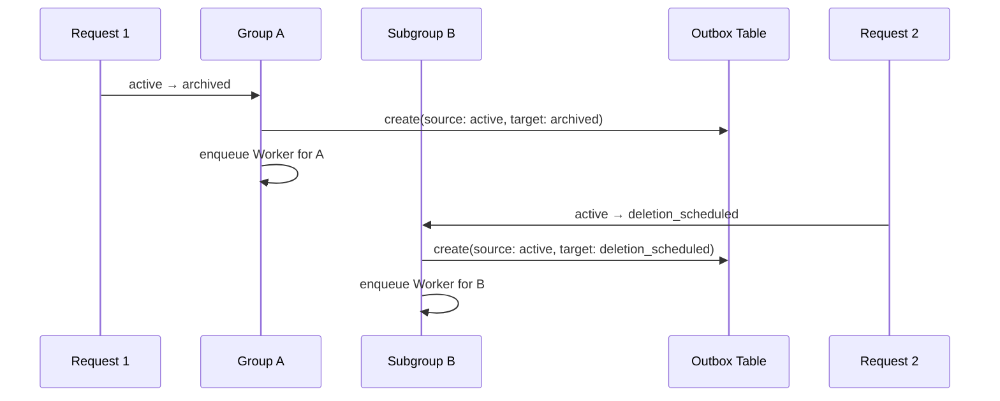
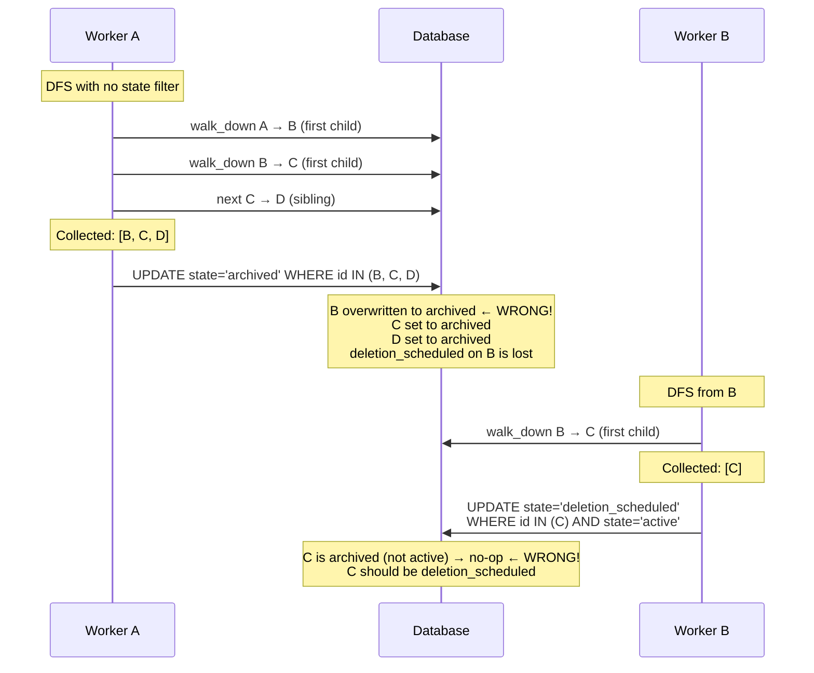
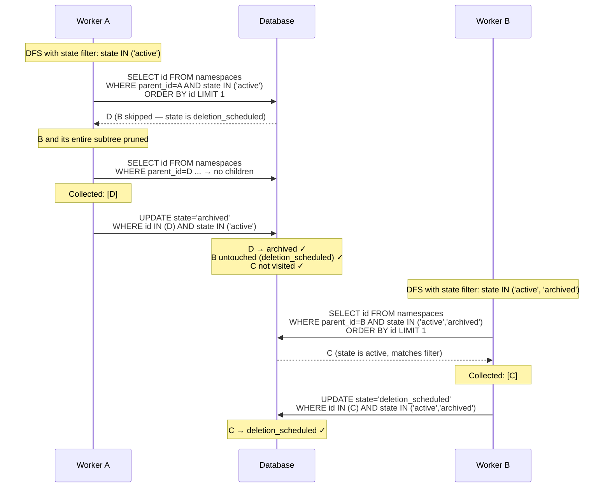
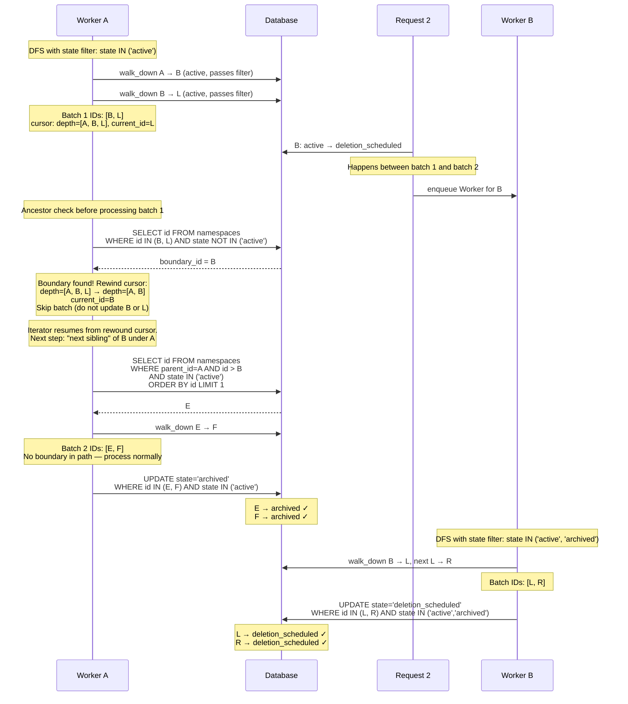

## Context

In GitLab's hierarchical namespace structure (Organization > Group > Subgroup > Project), state management needs to handle inheritance efficiently. The current approach has several issues:

- State in descendants is sometimes inferred from ancestors inconsistently
- No clear rules for how state should propagate through the hierarchy
- Performance concerns with propagating state changes to all descendants
- Complexity in maintaining state consistency across large hierarchies

We need a clear model for how state propagation works that balances consistency, performance, and simplicity.

## Decision

We will implement a **state propagation model** with the following rules:

### State Classification

States are classified into two categories based on their propagation behavior:

1. **Propagated states**: `active`, `archived`, `deletion_scheduled` — these states are propagated to all descendants when set on a namespace. When a namespace transitions to one of these states, all descendant namespaces and projects receive the same state. The `active` state (also referred to as `ancestor_inherited`) represents the default state with no restrictions applied.
2. **Non-propagated states**: `creation_in_progress`, `deletion_in_progress`, `transfer_in_progress` — these states represent short-lived operations and are NOT propagated to descendants. They apply only to the namespace undergoing the operation.

### State Propagation Rules

1. **Propagation on transition**: When a namespace transitions to a propagated state (`active`, `archived`, or `deletion_scheduled`), that state is written to all descendant namespaces and projects. For example, archiving a group archives all its descendants, and unarchiving (transitioning to `active`) restores all its descendants.
2. **Propagation boundary**: Propagation stops when it encounters a descendant that already has a different propagated state. For example, if a namespace is `deletion_scheduled` inside an `archived` ancestor, unarchiving the ancestor propagates `active` only down to — but not through — the `deletion_scheduled` namespace. The `deletion_scheduled` namespace and its own descendants retain their state. This preserves explicitly set states within the hierarchy.
3. **Reliable asynchronous propagation via transactional outbox**: Propagation uses the [transactional outbox pattern](https://microservices.io/patterns/data/transactional-outbox.html) to guarantee delivery. When a namespace transitions to a propagated state, a `namespace_state_propagation` record is created **in the same database transaction** as the state change. The record captures both the `source_state` (state before transition) and `target_state` (state after transition), along with `status: pending`. This ensures the propagation request is never lost, even if the process crashes before the Sidekiq job is enqueued. A `Namespaces::StatePropagationWorker` is then enqueued to perform the actual propagation using the [tree iterator](https://docs.gitlab.com/development/database/poc_tree_iterator/) to batch-process descendants. The tree iterator uses a recursive CTE with depth-first traversal and cursor-based batching via the `parent_id` column, allowing it to safely process large hierarchies without timeouts (unlike `traversal_ids`-based queries which can time out for very large groups). The worker transitions the outbox record to `processing` on start and deletes it on finish.
4. **CRON-based reconciliation**: A `Namespaces::StatePropagationCronWorker` runs every few minutes to catch propagations that were never picked up or stalled mid-execution. For `processing` records, it checks the Sidekiq deduplication lock to determine if the worker is still actively running. If the lock has expired (i.e., no job is running or queued for that namespace and target state), the record is reset to `pending`. It then re-enqueues all `pending` records. The propagation worker uses Sidekiq `deduplicate :until_executed` so that duplicate enqueues are safely dropped if a job for the same namespace and target state is already queued or running. This approach avoids fixed time thresholds — instead of guessing whether a job is stale based on elapsed time, it checks the actual Sidekiq job state.
5. **Side-effects after propagation**: Any action that depends on descendants being in the new state must only occur after propagation is complete. This includes domain events (e.g., `GroupArchivedEvent`, `ProjectArchivedEvent`), callbacks, webhooks, and any downstream processing. For example, `GroupArchivedEvent` should only be published after all descendant namespaces and projects have been archived, so that any subscriber reacting to the event can assume the entire hierarchy is already in the expected state. Triggering side effects before propagation completes could lead to race conditions where consumers observe inconsistent state across the hierarchy.
6. **Ancestor validation on write**: While propagation eliminates the need for ancestor lookups on read, ancestor state must still be validated on write. State transition guards must check the parent's state before allowing a transition. For example, a descendant cannot be unarchived if its parent is still archived. This ensures hierarchical consistency is maintained without requiring ancestor traversal for every read operation.
7. **Boundary enforcement in the tree iterator**: Propagated states have a precedence order: `deletion_scheduled` (highest) > `archived` > `active` (lowest). The propagation worker enforces rule 2 (propagation boundary) at three layers:
    - **Traversal pruning**: A subclass of [`Gitlab::Database::NamespaceEachBatch`](https://gitlab.com/gitlab-org/gitlab/-/blob/master/lib/gitlab/database/namespace_each_batch.rb) (`Namespaces::StatePropagationIterator`) overrides the `walk_down` and `next_elements` methods to add a state filter (`AND state IN (overwritable_states)`) to the LATERAL subqueries in the recursive CTE. This causes the DFS to skip namespaces with equal or higher precedence, pruning their subtrees from traversal.
    - **Per-batch ancestor check with cursor rewind**: Before each batch update, the worker checks whether any namespace in the cursor's `depth` path has concurrently changed to a non-overwritable state. If a boundary is found mid-path, the worker skips the batch and **rewinds the cursor** — trimming the depth to the boundary's parent and setting `current_id` to the boundary namespace. This causes the tree iterator's next batch to resume from the boundary's next sibling, effectively walking up and over the boundary subtree. The iterator then continues DFS into the remaining unaffected subtrees.
    - **Conditional UPDATE**: The batch UPDATE includes a `WHERE state IN (overwritable_states)` clause as a final safety net against concurrent state changes between the ancestor check and the update.
8. **State preservation during propagation**: When propagation overwrites a descendant's state, the descendant's previous state is preserved in `state_metadata` (see [ADR 006: State Preservation](006_state_preservation.md)). This ensures that if the parent operation is cancelled, descendants can be restored to their original state rather than a default. For example, if Subgroup B is `archived` and Parent A schedules deletion, propagation sets B to `deletion_scheduled` while preserving `archived` in B's `state_metadata`. If A later cancels deletion, B is restored to `archived` (not `active`). When propagating `active` (restore/unarchive), preserved states are cleared since descendants are being restored to their default state.

#### Concurrent propagation — race condition and solution

Consider this hierarchy where Group A contains Subgroup B, Project D, and Subgroup B contains Project C:

```plaintext
         Group A (active)
         ├── Subgroup B (active)
         │   └── Project C (active)
         └── Project D (active)
```

Two concurrent operations occur — Group A is archived while Subgroup B is independently scheduled for deletion:



##### Without boundary enforcement (incorrect)

A's worker iterates all descendants and updates them unconditionally:



Both B's state and C's state end up incorrect.

##### With tree iterator boundary enforcement (correct)

A's worker uses a tree iterator whose "walk down" and "next sibling" steps include a state filter: `AND state IN ('active')` (only states with lower precedence than `archived`). When the DFS encounters B (`deletion_scheduled`, precedence 2 > 1), the state filter excludes B — the iterator **does not walk down into B** and skips directly to the next sibling:



Final hierarchy state (correct):

```plaintext
         Group A (archived)
         ├── Subgroup B (deletion_scheduled)  ← preserved, DFS skipped over B
         │   └── Project C (deletion_scheduled)  ← propagated by B's worker
         └── Project D (archived)  ← propagated by A's worker
```

The tree iterator's state filter acts as a natural boundary enforcement during DFS traversal. When the iterator encounters a namespace with equal or higher precedence, it doesn't descend into that subtree — it moves to the next sibling instead. Each propagation worker only touches the subtree it owns, and the cursor-based batching ensures large hierarchies are processed safely without timeouts.

##### Mid-traversal boundary (cursor rewind)

The traversal pruning handles the case where B's state has already changed before A's worker visits it. But what if B changes state **after** A's worker has already entered B's subtree? Consider a larger hierarchy:

```plaintext
         Group A (active)
         ├── Subgroup B (active)
         │   ├── Project L (active)
         │   └── Project R (active)
         └── Subgroup E (active)
             └── Project F (active)
```



Final hierarchy state (correct):

```plaintext
         Group A (archived)
         ├── Subgroup B (deletion_scheduled)  ← changed concurrently
         │   ├── Project L (deletion_scheduled)  ← propagated by B's worker
         │   └── Project R (deletion_scheduled)  ← propagated by B's worker
         └── Subgroup E (archived)  ← propagated by A's worker
             └── Project F (archived)  ← propagated by A's worker
```

The cursor rewind avoids both problems: it doesn't skip valid subtrees (E and F are processed in batch 2), and it doesn't do redundant writes into B's subtree. By trimming the cursor depth to `[A, B]` and setting `current_id=B`, the tree iterator's "next sibling" step naturally finds E (the next child of A after B) and continues DFS from there.

### State Validation Guards

Validation guards prevent inconsistent state combinations that would create confusing user experiences.
These validation rules govern state transitions across three layers: parent state, self state, and children states.

The following tables shows all possible state transitions and whether they are allowed or denied:

#### All State Transitions

| **New State**            | **Old state: active**    | **Old state: archived**   | **Old state: creation_in_progress** | **Old state: deletion_in_progress** | **Old state: deletion_scheduled** | **Old state: transfer_in_progress** |
|--------------------------|--------------------------|---------------------------|-------------------------------------|-------------------------------------|-----------------------------------|-------------------------------------|
| **active**               | -                        | :white_check_mark: Allow  | :white_check_mark: Allow            | :white_check_mark: Allow            | :white_check_mark: Allow          | :white_check_mark: Allow            |
| **archived**             | :white_check_mark: Allow | -                         | :x: Deny                            | :white_check_mark: Allow            | :white_check_mark: Allow          | :white_check_mark: Allow            |
| **creation_in_progress** | :x: Deny                 | :x: Deny                  | -                                   | :x: Deny                            | :x: Deny                          | :x: Deny                            |
| **deletion_in_progress** | :x: Deny                 | :x: Deny                  | :white_check_mark: Allow            | -                                   | :white_check_mark: Allow          | :x: Deny                            |
| **deletion_scheduled**   | :white_check_mark: Allow | :white_check_mark: Allow  | :x: Deny                            | :white_check_mark: Allow            | -                                 | :x: Deny                            |
| **transfer_in_progress** | :white_check_mark: Allow | :white_check_mark: Allow  | :x: Deny                            | :x: Deny                            | :x: Deny                          | -                                   |

#### Valid State Transitions

| Allowed Transition                          | Note/Reason                                                                                        |
|---------------------------------------------|----------------------------------------------------------------------------------------------------|
| archived → active                           | Unarchive                                                                                          |
| creation_in_progress → active               | Creation complete                                                                                  |
| deletion_in_progress → active               | Deletion failure. Skip deletion_scheduled to avoid infinite retry loop.                            |
| deletion_scheduled → active                 | Restore from delete                                                                                |
| transfer_in_progress → active               | Transfer complete                                                                                  |
| active → archived                           | Archive                                                                                            |
| deletion_in_progress → archived             | Deletion triggered from archived namespace failed. Skip deletion_scheduled to prevent retry loop.  |
| deletion_scheduled → archived               | Deletion triggered from archived namespace                                                         |
| transfer_in_progress → archived             | Allow transfer to complete for archived item                                                       |
| creation_in_progress → deletion_in_progress | Fatal creation failure                                                                             |
| deletion_scheduled → deletion_in_progress   | Start deletion of the namespace                                                                    |
| active → deletion_scheduled                 | Schedule deletion                                                                                  |
| archived → deletion_scheduled               | Schedule deletion of archived namespace                                                            |
| deletion_in_progress → deletion_scheduled   | Deletion failure. Requeue for retry                                                                |
| active → transfer_in_progress               | Transfer a namespace                                                                               |
| archived → transfer_in_progress             | Transfer archived namespace                                                                        |

#### Invalid State Transitions

| Denied Transition                           | Note/Reason                                                                               |
|---------------------------------------------|-------------------------------------------------------------------------------------------|
| creation_in_progress → archived             | Must transition to active before archived                                                 |
| active → creation_in_progress               | Cannot revert to creation_in_progress once active. Use creation_in_progress for new only. |
| archived → creation_in_progress             | Cannot revert to creation_in_progress                                                     |
| deletion_in_progress → creation_in_progress | Cannot revert to creation_in_progress                                                     |
| deletion_scheduled → creation_in_progress   | Cannot revert to creation_in_progress                                                     |
| transfer_in_progress → creation_in_progress | Cannot revert to creation_in_progress                                                     |
| active → deletion_in_progress               | Must go through deletion_scheduled first                                                  |
| archived → deletion_in_progress             | Must go through deletion_scheduled first                                                  |
| transfer_in_progress → deletion_in_progress | Transfer must complete before permanent deletion                                          |
| creation_in_progress → deletion_scheduled   | Deletion schedule only allowed after successful creation                                  |
| transfer_in_progress → deletion_scheduled   | Deletion schedule only allowed after successful transfer                                  |
| creation_in_progress → transfer_in_progress | Transfer only allowed after successful creation                                           |
| deletion_in_progress → transfer_in_progress | Cannot transfer while deletion is in progress                                             |
| deletion_scheduled → transfer_in_progress   | Cannot transfer while deletion is scheduled                                               |

#### State Transition Overview

For each allowed transition, we examined dependencies across the state hierarchy.
The following shows the permitted transitions along with the parent and children state requirements that must be satisfied:

| Transition                                  | Parent Check                                                                             | Parent Check Note                                                                               | Children Check                                     | Children Check Note                                                                       |
|---------------------------------------------|------------------------------------------------------------------------------------------|-------------------------------------------------------------------------------------------------|----------------------------------------------------|-------------------------------------------------------------------------------------------|
| archived → active                           | NOT archived, NOT deletion_in_progress, NOT deletion_scheduled                           | Parent must not be archived, deletion_in_progress, or deletion_scheduled                        | -                                                  | Children inherit unarchive or become active                                               |
| creation_in_progress → active               | -                                                                                        | Parent state doesn't restrict creation completion                                               | N/A (no children exist yet)                        | No children exist during creation_in_progress                                             |
| deletion_in_progress → active               | -                                                                                        | Allowed for fatal cases like deleting user loses access                                         | -                                                  | Allowed for recovery scenarios                                                            |
| deletion_scheduled → active                 | -                                                                                        | Restore action - no parent restrictions                                                         | -                                                  | Children restored to previous state                                                       |
| transfer_in_progress → active               | -                                                                                        | Successful transfer completion                                                                  | -                                                  | Transfer completion - children remain in their states                                     |
| active → archived                           | NOT archived, NOT deletion_in_progress, NOT deletion_scheduled, NOT transfer_in_progress | Parent cannot be in archived, deletion_in_progress, deletion_scheduled, or transfer_in_progress | NOT creation_in_progress, NOT transfer_in_progress | Children in creation_in_progress or transfer_in_progress block parent archiving           |
| deletion_in_progress → archived             | NOT archived                                                                             | Parent is already archived, instead use active                                                  | -                                                  | Allowed as restore to archived state                                                      |
| deletion_scheduled → archived               | NOT archived                                                                             | Parent is already archived, instead use active                                                  | -                                                  | Allowed as restore to archived state                                                      |
| transfer_in_progress → archived             | -                                                                                        | Successful transfer completion of archived namespace                                            | -                                                  | Transfer completion - children remain in their states                                     |
| creation_in_progress → deletion_in_progress | -                                                                                        | Cleanup on fatal creation failure                                                               | -                                                  | No children exist during creation_in_progress                                             |
| deletion_scheduled → deletion_in_progress   | -                                                                                        | Begin deletion process after grace period                                                       | -                                                  | All child states allowed                                                                  |
| active → deletion_scheduled                 | NOT deletion_in_progress, NOT deletion_scheduled, NOT transfer_in_progress               | Parent cannot be in deletion_in_progress, deletion_scheduled, or transfer_in_progress           | NOT creation_in_progress, NOT transfer_in_progress | Children in creation_in_progress or transfer_in_progress block parent deletion scheduling |
| archived → deletion_scheduled               | NOT deletion_in_progress, NOT deletion_scheduled, NOT transfer_in_progress               | Parent cannot be in deletion_in_progress or deletion_scheduled, or transfer_in_progress         | NOT creation_in_progress, NOT transfer_in_progress | Children in creation_in_progress or transfer_in_progress block parent deletion scheduling |
| deletion_in_progress → deletion_scheduled   | -                                                                                        | Rollback on deletion failure for retry                                                          | -                                                  | Rollback scenario - all children states allowed                                           |
| active → transfer_in_progress               | NOT deletion_in_progress, NOT deletion_scheduled, NOT transfer_in_progress               | Parent must be active or archived                                                               | All children must be active or archived only       | All children must be active or archived                                                   |
| archived → transfer_in_progress             | NOT deletion_in_progress, NOT deletion_scheduled, NOT transfer_in_progress               | Parent must be active or archived                                                               | All children must be active or archived only       | All children must be active or archived                                                   |

### Implementation Approach

#### Outbox table

The `namespace_state_propagations` table serves as the transactional outbox:

```sql
CREATE TABLE namespace_state_propagations (
  id BIGSERIAL PRIMARY KEY,
  namespace_id BIGINT NOT NULL REFERENCES namespaces(id) ON DELETE CASCADE,
  source_state SMALLINT NOT NULL,
  target_state SMALLINT NOT NULL,
  status SMALLINT NOT NULL DEFAULT 0, -- 0: pending, 1: processing
  started_at TIMESTAMPTZ,
  created_at TIMESTAMPTZ NOT NULL DEFAULT NOW(),
  updated_at TIMESTAMPTZ NOT NULL DEFAULT NOW()
);

CREATE INDEX idx_propagations_pending ON namespace_state_propagations (status, created_at);
CREATE UNIQUE INDEX idx_propagations_unique ON namespace_state_propagations (namespace_id, target_state)
  WHERE status IN (0, 1);
```

#### State machine with outbox write

```ruby
module Namespaces
  module Stateful
    extend ActiveSupport::Concern

    PROPAGATED_STATES = %i[active archived deletion_scheduled].freeze
    NON_PROPAGATED_STATES = %i[creation_in_progress deletion_in_progress transfer_in_progress].freeze

    included do
      ...

      state_machine :state, initial: :active, initialize: false do
        ...

        before_transition any => :active do |namespace|
          if namespace.ancestor_archived?
            raise StateMachine::InvalidTransition, "Cannot unarchive when ancestor is archived"
          end
        end

        before_transition any => :archived do |namespace|
          if namespace.ancestor_deletion_scheduled?
            raise StateMachine::InvalidTransition, "Cannot archive when ancestor is scheduled for deletion"
          end
        end

        after_transition any => PROPAGATED_STATES do |namespace, transition|
          Namespaces::StatePropagation.create!(
            namespace_id: namespace.id,
            source_state: transition.from,
            target_state: transition.to,
            status: :pending
          )

          Namespaces::StatePropagationWorker.perform_async(namespace.id, transition.to)
        end

        ...
      end
    end
  end
end
```

#### Propagation worker

The propagation worker is idempotent and deduplicated using `until_executed`, ensuring only one job per namespace and target state runs at a time. It uses a subclass of [`Gitlab::Database::NamespaceEachBatch`](https://gitlab.com/gitlab-org/gitlab/-/blob/master/lib/gitlab/database/namespace_each_batch.rb) for cursor-based DFS batching, with a state filter to enforce propagation boundaries (see rule 7).

We create a subclass that overrides the `walk_down` and `next_elements` methods to add `AND state IN (overwritable_states)` to the LATERAL subqueries. This causes the DFS to skip namespaces with equal or higher precedence states, pruning their entire subtrees from traversal:

```ruby
module Namespaces
  class StatePropagationIterator < Gitlab::Database::NamespaceEachBatch
    def initialize(namespace_class:, cursor:, state_filter:)
      super(namespace_class: namespace_class, cursor: cursor)
      @state_filter = state_filter
    end

    private

    attr_reader :state_filter

    def walk_down
      lateral_query = namespace_class
        .select(*lateral_query_columns)
        .where('parent_id = cte.current_id')
        .where(state: state_filter)
        .order(:id)
        .limit(1)

      base_namespace_class.select(
        base_namespace_class.arel_table[:id].as('current_id'),
        Arel.sql("cte.depth || #{base_namespace_table}.id::bigint").as('depth'),
        Arel.sql(type_filtered_ids_append).as('ids'),
        Arel.sql('cte.count + 1').as('count'),
        Arel.sql('1::bigint AS index')
      ).from("cte, LATERAL (#{lateral_query.to_sql}) #{base_namespace_table}")
    end

    def next_elements
      lateral_query = namespace_class
        .select(*lateral_query_columns)
        .where("#{base_namespace_table}.parent_id = cte.depth[array_length(cte.depth, 1) - 1]")
        .where("#{base_namespace_table}.id > cte.depth[array_length(cte.depth, 1)]")
        .where(state: state_filter)
        .order(:id)
        .limit(1)

      base_namespace_class.select(
        base_namespace_class.arel_table[:id].as('current_id'),
        Arel.sql("cte.depth[:array_length(cte.depth, 1) - 1] || #{base_namespace_table}.id::bigint").as('depth'),
        Arel.sql(type_filtered_ids_append).as('ids'),
        Arel.sql('cte.count + 1').as('count'),
        Arel.sql('2::bigint AS index')
      ).from("cte, LATERAL (#{lateral_query.to_sql}) #{base_namespace_table}")
    end
  end
end
```

The propagation worker uses this iterator:

```ruby
module Namespaces
  class StatePropagationWorker
    include ApplicationWorker

    idempotent!
    deduplicate :until_executed, including_scheduled: true

    STATE_PRECEDENCE = { active: 0, archived: 1, deletion_scheduled: 2 }.freeze

    def perform(namespace_id, target_state)
      propagation = Namespaces::StatePropagation.find_by!(
        namespace_id: namespace_id,
        target_state: target_state,
        status: :pending
      )

      propagation.update!(status: :processing, started_at: Time.current)

      overwritable = overwritable_states(propagation.source_state, propagation.target_state)

      iterator = Namespaces::StatePropagationIterator.new(
        namespace_class: Namespace,
        cursor: { current_id: namespace_id, depth: [namespace_id] },
        state_filter: overwritable
      )

      iterator.each_batch(of: 500) do |ids, cursor|
        # Ancestor check: the cursor's depth array holds the DFS path
        # from the propagation source to the current position. Check if
        # any ancestor in that path has concurrently transitioned to a
        # non-overwritable state (e.g., deletion_scheduled appeared
        # after the iterator entered its subtree).
        ancestors_in_path = cursor[:depth] - [namespace_id]
        boundary_id = Namespace.where(id: ancestors_in_path)
                               .where.not(state: overwritable)
                               .order(:id).pick(:id)

        if boundary_id
          # Rewind the cursor: trim the depth to the boundary's parent
          # and set current_id to the boundary. The tree iterator's
          # "next sibling" step will then resume from the boundary's
          # next sibling, skipping the entire boundary subtree.
          boundary_index = cursor[:depth].index(boundary_id)
          cursor[:depth] = cursor[:depth][0..boundary_index]
          cursor[:current_id] = boundary_id
          next
        end

        # Conditional update: only overwrite namespaces still in a
        # lower-precedence state as a safety net against concurrent
        # changes between the ancestor check and this update.
        Namespace.where(id: ids, state: overwritable)
                 .update_all(state: propagation.target_state)
      end

      propagation.destroy!
    end

    private

    def overwritable_states(source_state, target_state)
      target = STATE_PRECEDENCE.fetch(target_state.to_sym)
      source = STATE_PRECEDENCE.fetch(source_state.to_sym)

      if target == 0
        # Propagating active: which descendants to overwrite depends
        # on the source state (what the parent transitioned from).
        #
        # Unarchive (archived → active): overwrite only archived
        # descendants. Stop at deletion_scheduled (propagation
        # boundary, rule 2) — those were explicitly scheduled and
        # should not be implicitly restored.
        #
        # Restore (deletion_scheduled → active): overwrite both
        # deletion_scheduled and archived descendants, since the
        # entire subtree should be restored.
        STATE_PRECEDENCE.select { |_, v| v > 0 && v <= source }.keys
      else
        # Propagating archived or deletion_scheduled: overwrite all
        # states with strictly lower precedence.
        STATE_PRECEDENCE.select { |_, v| v < target }.keys
      end
    end
  end
end
```

#### CRON reconciliation worker

The CRON worker catches lost or stalled propagation jobs:

```ruby
module Namespaces
  class StatePropagationCronWorker
    include ApplicationWorker
    include CronjobQueue

    def perform
      # Check processing records: if the Sidekiq deduplication lock has
      # expired, the worker is no longer running — reset to pending so
      # it can be re-enqueued. This avoids fixed time thresholds by
      # checking actual job state instead of elapsed time.
      Namespaces::StatePropagation.where(status: :processing).find_each do |propagation|
        unless job_deduplicated?(propagation)
          propagation.update!(status: :pending, started_at: nil)
        end
      end

      # Re-enqueue all pending propagations. Sidekiq deduplication
      # ensures no duplicate jobs run concurrently.
      Namespaces::StatePropagation.where(status: :pending).find_each do |propagation|
        Namespaces::StatePropagationWorker.perform_async(
          propagation.namespace_id,
          propagation.target_state
        )
      end
    end

    private

    def job_deduplicated?(propagation)
      Gitlab::SidekiqMiddleware::DuplicateJobs::DuplicateJob.new(
        { 'class' => 'Namespaces::StatePropagationWorker',
          'args' => [propagation.namespace_id, propagation.target_state] },
        'default'
      ).duplicate?
    end
  end
end
```

## Consequences

### Positive Consequences

- **Fast reads**: State is stored directly on each namespace — no ancestor traversal needed to determine effective state
- **Consistency**: Descendants always reflect the parent's propagated state, eliminating stale or inconsistent reads
- **Simplicity of queries**: State checks are simple column comparisons (e.g., `WHERE state = 'archived'`) without joins or recursive lookups
- **Transient state isolation**: In-progress operations remain scoped to the namespace undergoing the operation, avoiding unnecessary propagation
- **Reliable delivery**: The transactional outbox pattern guarantees propagation is never silently lost — the outbox record is committed atomically with the state change, and the CRON reconciliation worker catches any jobs that fail to enqueue or stall during execution
- **Observability**: The `namespace_state_propagations` table provides a queryable record of pending and in-progress propagations, enabling monitoring and debugging. Records are deleted on completion, keeping the table small.

### Technical Consequences

- **Write amplification**: Propagating state changes requires updating all descendants, which can be expensive for large hierarchies
- **Transient state preservation**: Propagation must skip descendants in non-propagated states (`_in_progress`) to avoid interrupting ongoing operations
- **Validation Complexity**: State transition guards need to check ancestor and descendant states
- **Migration Complexity**: Existing state data needs careful migration to new model

## Alternatives

### Alternative 1: Lookup-based inheritance

Determine effective state by traversing up the ancestor hierarchy at read time.

- **Pros**: No propagation writes, simpler state transitions
- **Cons**: Read-time query overhead, requires caching, ancestor lookup for every state check

### Alternative 2: No inheritance

Each namespace manages its own state independently.

- **Pros**: Simple implementation, no inheritance complexity
- **Cons**: Inconsistent user experience, no way to apply organization-wide policies

### Alternative 3: Event-driven inheritance

Use events to notify descendants of state changes.

- **Pros**: Decoupled architecture, eventual consistency
- **Cons**: Complex event handling, potential for temporary inconsistencies
