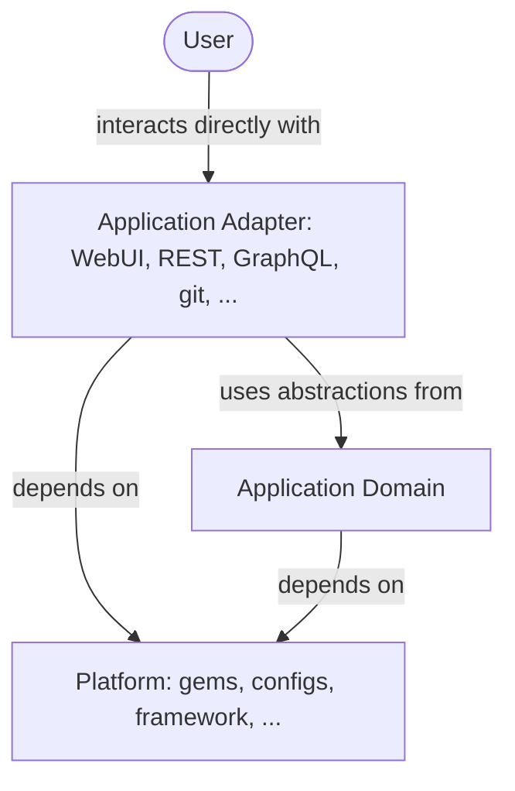

## Background

This design document supersedes the previous [Composable GitLab Codebase](../../composable_codebase_using_rails_engines/)
where we explored the idea of separating the codebase into technical runtime profiles:
for example, run the monolith solely as a Sidekiq node.
With a modular monolith and the use of an Hexagonal Architecture, we can achieve both
separation of domains as well as separation of application adapters, which may include the usage of engines and/or different runtime profiles.

## Summary

**TL;DR:** Change the Rails monolith from a [big ball of mud](https://en.wikipedia.org/wiki/Big_ball_of_mud) state to
a [modular monolith](https://www.thereformedprogrammer.net/my-experience-of-using-modular-monolith-and-ddd-architectures/)
that uses an [Hexagonal architecture](https://en.wikipedia.org/wiki/Hexagonal_architecture_(software)) (or ports and adapters architecture).
Extract cohesive functional domains into separate directory structure using Domain-Driven Design practices.
Extract infrastructure code (logging, database tools, instrumentation, etc.) into gems, essentially remove the need for `lib/` directory.
Define what parts of the functional domains (for example application services) are of public use for integration (the ports)
and what parts are instead private encapsulated details.
Define Web, Sidekiq, REST, GraphQL, and Action Cable as the adapters in the external layer of the architecture.


## Details



### Application domain

The application core (functional domains) is composed of all the code that describes the business logic, policies and data
that is unique to the GitLab product. It is divided into separate top-level [bounded contexts](../bounded_contexts.md),
each represented as a module that owns its data and exposes a small, well-documented public interface.

The application domain has no knowledge of outer layers like the application adapters and only depends on the
platform code. This makes the domain code the SSoT of the business logic, reusable and testable regardless of
whether the request came from the WebUI or REST API. If an inner layer needs something from an outer layer, that
is solved with inversion of control, especially dependency injection.

Isolating the domain — exclusive data ownership, boundary enforcement, decoupling shared models, and how we get
there — is documented in full on its own page, which is the single source of truth:
[Isolating the domain layer](../domain_layer.md).

### Transport layer

Application adapters live in the transport layer and are the thin glue between the outside world
and the domain's public API. They are Web (controllers and views), REST, GraphQL, and Sidekiq.
They interpret the request, parse parameters, invoke the right abstraction from the application
domain, and optionally present the result back — they carry no business logic of their own.

[Decomposing the transport layer into adapters](../transport_layer.md) describes this in detail.

### Platform code

Platform code is the third layer: any classes and modules required by the application domain and/or application
adapters to work, but carrying no business logic of their own. These are cross-cutting concerns such as logging,
error reporting, metrics, rate limiters, parsers, and generic utilities like `Banzai`. Aside from the Rails framework
code, platform code is extracted into single-purpose gems under the `gems/` directory inside the monolith.

Read more: [Extracting cross-cutting libraries into gems](../library_extraction.md).

### Enforcing boundaries

Ruby does not have the concept of privacy of constants in a given module. Unlike other programming languages, even extracting
well documented gems doesn't prevent other developers from coupling code to implementation details because all constants
are public in Ruby.

We can have a codebase perfectly organized in an hexagonal architecture but still having the application domain, the biggest
part of the codebase, being a non modularized [big ball of mud](https://en.wikipedia.org/wiki/Big_ball_of_mud).

Enforcing boundaries is also vital to maintaining the structure long term. We don't want that after a big modularization
effort we slowly fall back into a big ball of mud gain by violating the boundaries.

We explored the idea of [using Packwerk in a proof of concept](../proof_of_concepts.md#use-packwerk-to-enforce-module-boundaries)
to enforce module boundaries.

[Packwerk](https://github.com/Shopify/packwerk) is a static analyzer that allows to gradually introduce packages in the
codebase and enforce privacy and explicit dependencies. Packwerk can detect if some Ruby code is using private implementation
details of another package or if it's using a package that wasn't declared explicitly as a dependency.

Being a static analyzer it does not affect code execution, meaning that introducing Packwerk is safe and can be done
gradually.

Companies like Gusto have been developing and maintaining a list of [development and engineering tools](https://github.com/rubyatscale)
for organizations that want to move to using a Rails modular monolith around Packwerk.

### EE and JH extensions

One of the unique challenges of modularizing the GitLab codebase is the presence of EE extensions (managed by GitLab)
and JH extensions (managed by JiHu).

By moving related domain code (e.g. `Ci::`) under the same bounded context and Packwerk package, we would also need to
move `ee/` extensions in it.

To have top-level bounded contexts to also match Packwerk packages it means that all code related to a specific domain
needs to be placed under the same package directory, including EE extensions, for example.

The following is just an example of a possible directory structure:

```shell
domains
├── ci
│   ├── package.yml       # package definition.
│   ├── packwerk.yml      # tool configurations for this package.
│   ├── package_todo.yml  # existing violations.
│   ├── core              # Core features available in Community Edition and always autoloaded.
│   │   ├── app
│   │   │   ├── models/...
│   │   │   ├── services/...
│   │   │   └── lib/...   # domain-specific `lib` moved inside `app` together with other classes.
│   │   └── spec
│   │       └── models/...
│   ├── ee                # EE extensions specific to the bounded context, conditionally autoloaded.
│   │   ├── models/...
│   │   └── spec
│   │       └── models/...
│   └── public            # Public constants are placed here so they can be referenced by other packages.
│       ├── core
│       │   ├── app
│       │   │   └── models/...
│       │   └── spec
│       │       └── models/...
│       └── ee
│           ├── app
│           │   └── models/...
│           └── spec
│               └── models/...
├── merge_requests/
├── repositories/
└── ...
```

## Challenges

- Such changes require a shift in the development mindset to understand the benefits of the modular
  architecture and not fallback into legacy practices.
- Changing the application architecture is a challenging task. It takes time, resources and commitment
  but most importantly it requires buy-in from engineers.
- This may require us to have a medium-long term team of engineers or a Working Group that makes progresses
  on the architecture evolution plan, foster discussions in various engineering channels and resolve adoption challenges.
- We need to ensure we build standards and guidelines and not silos.
- We need to ensure we have clear guidelines on where new code should be placed. We must not recreate junk drawer folders like `lib/`.

## Opportunities

The move to a modular monolith architecture enables a lot of opportunities that we could explore in the future:

- We could align the concept of domain expert with explicitly owning specific modules of the monolith.
- The use of static analysis tool (such as Packwerk, RuboCop) can catch design violations in development and CI, ensuring
  that best practices are honored.
- By defining dependencies between modules explicitly we could speed up CI by testing only the parts that are affected by
  the changes.
- Such modular architecture could help to further decompose modules into separate services if needed.
