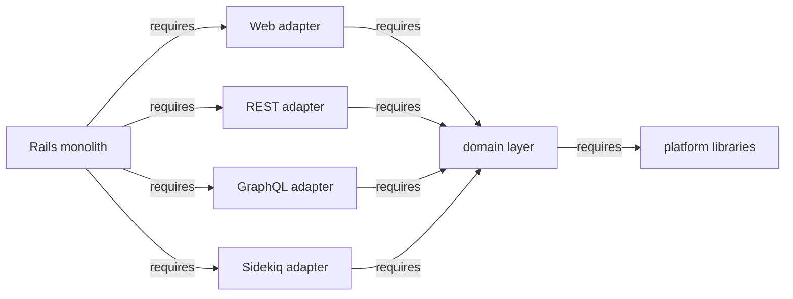

## What is the transport layer?

The transport layer is what the [hexagonal monolith](hexagonal_monolith/index.md)
calls the [adapters](hexagonal_monolith/index.md#transport-layer): the outer
layer of the ports-and-adapters architecture, which connects the outside world to
the domain's public interface. To keep terminology consistent, the rest of this
page uses **transport layer** throughout.

The transport layer comprises:

- Web UI (Rails controllers, views, JS and Vue client)
- REST API endpoints (Grape)
- GraphQL endpoints (types, resolvers, mutations)
- Sidekiq (background jobs)

Each part is responsible for the interaction with the outside world: interpret
the request, parse parameters, invoke the right abstraction from the domain layer,
and optionally present the result back.
Presentation logic, and possibly authentication, live in the transport layer.

### The transport layer is thin

The transport layer parses a request, invokes the domain's public API, and
presents the result. It does **not** own ActiveRecord models or business logic —
those live in the domain layer. A controller orchestrates calls to domain public
APIs:

```ruby
# A controller orchestrates calls to domain public APIs.
project = Projects.authorized_find_by_id!(id: params[:id], current_user: @current_user) # Projects domain
response = Ci::CreatePipelineService.new(project, @current_user).execute(:push)          # CI domain

if response.success?
  render_ok(response.payload)
else
  render_bad_request(response.message)
end
```

The transport layer holds no business rules of its own: it only translates between the
transport (HTTP params, GraphQL arguments, job arguments) and the domain's public
interface, then formats the response. See [Open questions](#open-questions) for a
counter-view on where single-consumer services should live.

## Four transport adapters

The transport layer decomposes into **four adapters**, one per transport type.
The defining rule is that each adapter depends **only on the domain layer** — never
on another adapter, and never with the domain depending back on it. This is a
mechanical refactor: file moves, no logic changes.

| Adapter | Contains | Depends on |
| --- | --- | --- |
| Web | All Rails controllers and views (`app/controllers/`, `app/views/`) | Domain layer |
| REST | All Grape API endpoints (`lib/api/`) | Domain layer |
| GraphQL | All GraphQL types, resolvers, mutations (`app/graphql/`) | Domain layer |
| Sidekiq | Queue and runtime configuration (see [Sidekiq is a special case](#sidekiq-is-a-special-case)) | Domain layer |

Each adapter boots only the framework it needs (Action View, Grape, GraphQL, or
Sidekiq) and calls into the domain layer for business logic. *How* each adapter is
packaged — as a gem or as a Rails Engine — is a separate, still-open decision; see
[Tactical options](#tactical-options-gems-or-rails-engines).

## Runtime profiles

Isolating the transport layer into independent adapters is what makes **runtime
profiles** possible: the application can boot only the adapters a given node needs.

- An **API-only node** loads the REST adapter and the domain layer, but not
  GraphQL or the Web (controllers/views) stack.
- A **Sidekiq-only node** loads the Sidekiq runtime configuration and the domain
  layer, but does not load Grape, GraphQL, or Action View.

The payoff is reduced memory footprint and boot time per node, and independent
scaling of web and background workloads.

This realizes a goal we have carried for a long time. It supersedes the earlier
[Composable GitLab Codebase](../composable_codebase_using_rails_engines/) idea
of separating the codebase into technical runtime profiles — referenced in the
[hexagonal monolith Background](hexagonal_monolith/index.md#background) — and the
Sidekiq-node goal noted in
[ADR-001](decisions/001_modular_application_domain/). Independent transport adapters
are the concrete mechanism that makes those runtime profiles possible.

## Sidekiq is a special case

Sidekiq needs more careful treatment than the REST and GraphQL transports. The naive
move — relocate all of `app/workers/` into the Sidekiq adapter — does not work,
because of how workers are scheduled.

Workers are scheduled **from within the domain layer**: a domain service object
calls `SomeWorker.perform_async`. The worker, when it runs, calls back into a
domain service object. So extracting all worker code into the Sidekiq adapter creates
a **circular dependency**:

```text
domain service --schedules--> worker (Sidekiq adapter) --executes--> domain service
```

The worker's body *is* domain logic and belongs with its domain. What a Sidekiq
*runtime profile* actually needs extracted is the **queue configuration and
runtime config** (for example, cron schedules), not the worker business logic.

There are two complementary ways to break the circular dependency. Both apply:

1. **`Gitlab::EventStore`.** Instead of a domain scheduling a concrete worker
   directly, the domain publishes an **event**. The monolith / event store schedules
   the concrete Sidekiq worker in the subscriber's domain. Subscription registration
   moves into a Rails initializer. This inverts the dependency cleanly: the
   publishing domain no longer references the subscribing domain's worker at all.

2. **A generated Sidekiq client.** A small generated component (for example a
   `gitlab-sidekiq-client` gem) could expose minimal stubs and metadata — worker
   class names, argument signatures, queue names — **without** the executable worker
   code or references to the worker constants. A domain can schedule a job by
   depending on the client, without depending on the full Sidekiq runtime or on the
   worker implementation that lives in another domain.

In both approaches the worker's business logic stays with its domain; only the
scheduling surface (events, or stub metadata) and the queue/runtime configuration
are extracted into the transport layer.

## Dependency direction

Adapters depend on the domain layer, never the reverse, and never on each other.
The target dependency graph is strictly one-way:



The key invariant for [runtime profiles](#runtime-profiles) is that **no adapter
depends on another adapter**. Each adapter depends only on the domain layer (which
in turn depends on the platform libraries) — never on a sibling adapter. As long as
that holds, a node can boot any subset of adapters (API-only, Sidekiq-only) without
dragging in a transport it does not need. Establishing this invariant — driving the
adapter-to-adapter dependencies down to zero — is the real work, and it is largely
independent of how the adapters are ultimately packaged.

## Tactical options: gems or Rails Engines

The four adapters and the one-way dependency rule above are the architecture. *How*
each adapter is packaged is a separate, tactical decision, and it is **not settled**.
There are two viable options; both preserve the adapter boundaries and both enable
runtime profiles.

### Option A — Extract adapters into gems

Each adapter becomes a gem under `adapters/`, referenced via `path:` in the Gemfile.

- **Pros:** the strongest isolation. A gem declares its dependencies explicitly,
  runs its own CI suite, and cannot reach into code it does not depend on.
- **Cons:** extracting an adapter gem *before* the domain layer is itself a gem
  creates a cycle — the monolith requires the REST adapter, which requires domain
  code that still lives in the monolith, which requires the adapter. Bundler forbids
  circular dependencies, so that does not load. Dependency injection can break the
  cycle, but the transport layer touches so much of the domain that the number of
  dependencies to inject is large. In practice this option wants the domain layer
  extracted first, or the lowest-dependency components (authentication/authorization,
  settings, [libraries](library_extraction.md)) pulled out first to untangle the
  graph.

### Option B — Isolate adapters as Rails Engines

Each adapter becomes a Rails Engine under `engines/`, **staying inside the monolith**
rather than being published as a gem.

- **Pros:** Engines live in the same codebase, so there is **no Bundler dependency
  cycle** to resolve — the hard part of Option A disappears. Each engine is still
  isolated per transport, mounts its own routes and middleware, and can be
  **selectively enabled**, which is exactly what runtime profiles need.
- **Cons:** isolation is enforced by Rails' engine boundaries and convention rather
  than by a hard gem dependency declaration, so coupling is easier to re-introduce;
  it does not give each adapter a fully independent dependency graph the way a gem
  does.

## Evolution to domain-scoped layers

The four adapters above are **horizontal**: one per transport type, spanning all
domains. Once domains are isolated (the forthcoming domain layer), each horizontal
adapter could be split **per domain**:

```text
ci-api            # CI REST endpoints only
ci-graphql        # CI GraphQL resolvers only
packages-api      # Packages REST endpoints only
packages-graphql  # Packages GraphQL resolvers only
...
```

The horizontal adapter then **aggregates** the per-domain ones: the REST adapter
includes `ci-api`, `packages-api`, and so on — not the other way around.
Each per-domain adapter depends on its domain in the domain layer for business logic.

## Open questions

- **Package adapters as gems or Rails Engines?** The central unresolved tactical
  choice (see [Tactical options](#tactical-options-gems-or-rails-engines)). Gems give
  the hardest isolation but hit a Bundler dependency cycle when extracted before the
  domain layer; Rails Engines stay in the monolith and avoid that cycle while still
  isolating each transport and supporting selective enablement. See the
  [discussion on the proposal MR](https://gitlab.com/gitlab-com/content-sites/handbook/-/merge_requests/18906#note_3449483874).
- **Where do single-consumer services live?** This doc's stance is that the
  transport layer stays thin and business logic belongs in the domain layer. A
  counter-view holds that a service used *only* by one adapter — with no
  other consumer — could reasonably live inside that adapter. We note the
  tension here rather than resolving it.
- **Use Packwerk first to map and untangle transport interdependencies?** Before any
  hard extraction, could [Packwerk](https://github.com/Shopify/packwerk) be used to
  identify the interdependencies across transport components and drive them down in
  place? Removing those dependencies gradually, while the code still lives in the
  monolith, would let us establish the
  [no-adapter-depends-on-adapter invariant](#dependency-direction) before committing
  to either packaging option.

## Related

- [Hexagonal Rails Monolith](hexagonal_monolith/index.md) — the three-layer model
  (domain, transport, platform) this fits into.
- [Extracting cross-cutting libraries into gems](library_extraction.md) — the peer
  effort for the platform layer.
- [Defining bounded contexts](bounded_contexts.md) — how the domain layer the
  transport adapters depend on is structured.
