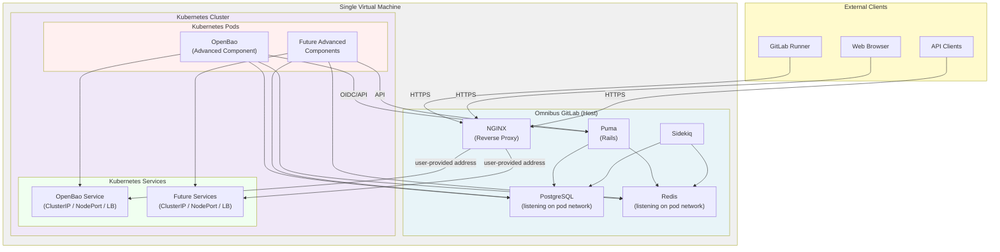

<!--
Document statuses you can use:

- "proposed"
- "accepted"
- "ongoing"
- "implemented"
- "postponed"
- "rejected"

-->

<!-- Design Documents often contain forward-looking statements -->
<!-- vale gitlab.FutureTense = NO -->



## Summary

Omnibus-Adjacent Kubernetes (OAK) is a transitional architecture designed to bridge the gap between traditional Omnibus GitLab deployments and cloud-native GitLab. It enables self-managed customers to run GitLab Omnibus alongside a lightweight Kubernetes distribution on the same virtual machine, allowing them to leverage cloud-native components (such as OpenBao for secrets management) without requiring a full cloud-native deployment.

This design document captures the findings from our discovery phase, where we successfully validated that three lightweight Kubernetes distributions—k3s, k0s, and microk8s—can be integrated with Omnibus GitLab on a single node. We demonstrated end-to-end functionality by deploying OpenBao (a secrets management solution) on Kubernetes and integrating it with Omnibus GitLab's secrets manager feature.

OAK serves as a stepping stone for the [Segmentation proposal](../selfmanaged_segmentation/_index.md), enabling Early Self-Managed customers to adopt advanced features that require cloud-native components while maintaining the operational simplicity of Omnibus.

## Motivation

### Problem Statement

GitLab's product roadmap includes advanced features (such as native secrets management) that are architected for cloud-native deployments. However, many self-managed customers are not ready to migrate to a full cloud-native setup due to operational complexity, cost, or infrastructure constraints. This creates a gap where customers cannot access these advanced features without a complete architectural overhaul.

Additionally, the Segmentation proposal requires a transitional offering for Early Self-Managed Advanced component tier customers. OAK provides this transition path by allowing customers to run both Omnibus and Kubernetes on the same infrastructure, enabling them to adopt cloud-native components incrementally.

### Goals

- **Enable advanced features for self-managed customers**: Allow customers to use cloud-native GitLab features (like secrets management) without requiring a full cloud-native deployment.
- **Provide a clear transition path**: Establish OAK as a stepping stone toward eventual cloud-native adoption, reducing friction for customers considering migration. Omnibus core components could also run in OAK before a final migration to a cloud provider.
- **Establish operational patterns**: Document proven patterns for service interconnection, network configuration, and deployment procedures that can guide future implementations.
- **Support Segmentation proposal**: Enable the Early Self-Managed Advanced tier offering by providing a viable deployment architecture for Omnibus users that don't want to do a full cloud-native deployment.

## Decisions

- [ADR-001: Don't package or bless any kubernetes distributions](./decisions/001_dont_package_or_bless_kubernetes_distros.md)
- [ADR-002: OAK Testing and Integration Ownership](./decisions/002_oak_testing_and_integration_ownership.md)
- [ADR-003: Omnibus is agnostic to Kubernetes service exposure](./decisions/003_omnibus_agnostic_k8s_service_exposure.md)
- [ADR-004: Multi-node Omnibus support in OAK](decisions/004_multi_node_omnibus_support.md)
- [ADR-005: Zero-Downtime Upgrades](decisions/005_zero_downtime_upgrades.md)

## Proposal

### Architecture Overview

OAK consists of the following components:

1. **Omnibus GitLab**: Running on the host VM, providing the core GitLab application, PostgreSQL, Redis, and other services.
2. **Lightweight Kubernetes Distribution**: Running on the same VM, providing a container orchestration platform for cloud-native components.
    - Deployed by the user.
3. **Cloud-Native Components**: Services like OpenBao deployed on Kubernetes, integrated with Omnibus through well-defined APIs.
4. **Network Isolation**: Network policies and kube-proxy configuration to ensure Kubernetes services are only accessible from the host (localhost), preventing external access.

### Validated Kubernetes Distributions

Based on our discovery work, we have validated that 3 small kubernetes
distributions work for this purpose: `k0s`, `k3s`, and `microk8s`.

For more details on the finding for each for them, refer to the [OAK milestone 1 epic](https://gitlab.com/groups/gitlab-com/gl-infra/software-delivery/-/work_items/30).

### Service Interconnection Pattern

Our discovery work established a proven pattern for integrating Kubernetes services with Omnibus. When
adding Omnibus automation, we should consider these patterns:

1. **PostgreSQL Exposure**: Configure Omnibus PostgreSQL to listen on the Kubernetes pod network interface (for example, CNI bridge IP), allowing Kubernetes pods to connect using credentials.
   - Different kubernetes distributions provide different network interfaces. `microK8s` supports VXLAN , while `k3s` and `k0s` deploys a bridge. They use different IPs, so the user needs to inform Omnibus about those.
2. **Service Access**: Omnibus is agnostic to how Kubernetes services are exposed. Users provide an address (IP, hostname, or `IP:port`) pointing to where the service is reachable — this may be a ClusterIP (same-VM deployments), a NodePort, or a LoadBalancer. See [ADR-003](./decisions/003_omnibus_agnostic_k8s_service_exposure.md).
3. **NGINX Reverse Proxy**: Omnibus NGINX acts as a reverse proxy, forwarding external requests to Kubernetes services using the user-provided address.
4. **Authentication**: Services like OpenBao use OIDC/JWT authentication with GitLab as the identity provider.

### Network Security Model

- **Kubernetes services are not directly exposed externally**: Omnibus NGINX is the single external entry point for traffic to Kubernetes services. How those services are exposed internally (ClusterIP, NodePort, LoadBalancer) is the user's choice and does not affect Omnibus configuration.
- **Omnibus acts as the gateway**: All external traffic to Kubernetes services flows through Omnibus NGINX, which can apply additional security controls. Omnibus automation needs to be implemented to provide automatic NGINX configuration.
- **Pod-to-host communication**: Kubernetes pods can communicate with Omnibus services (PostgreSQL, Redis) through the pod network interface.
- **No external Kubernetes API exposure**: The Kubernetes API server is not exposed externally; management is done locally on the VM.
- **TLS**: To support external communication to the advanced components, imagine possibly a runner trying to talk directly to OpenBao, we need to support some level of TLS. This can be achieved by configuring Omnibus NGINX SSL offloading. We should also consider our Let's Encrypt certificate generation the same way [we have for core components](https://docs.gitlab.com/omnibus/settings/ssl).

### Multi-Node Omnibus Support

OAK supports multi-node Omnibus deployments. Network configuration and service exposure are the customer's responsibility. The automation planned for the Beta phase, combined with existing Omnibus settings, covers what customers need to get up and running. Anything beyond that is out of scope — Omnibus only manages its own node and has no knowledge of or control over other nodes in the deployment.

Multi-node Omnibus deployments enable zero-downtime upgrades following existing Omnibus ZDU procedures. For details on ZDU strategy for OAK, see [ADR-005: Zero-Downtime Upgrades](decisions/005_zero_downtime_upgrades.md).

For detailed information on multi-node Omnibus support, see [ADR-004: Multi-node Omnibus support in OAK](decisions/004_multi_node_omnibus_support.md).

### Offline installations

OAK does not introduce new offline deployment requirements at the Omnibus level. [Offline](https://docs.gitlab.com/topics/offline/) Omnibus installations and offline Helm chart installations are already supported through existing mechanisms. Customers design their own network to allow Omnibus and advanced components to communicate, and no Omnibus-level changes are expected for this scenario.

### FIPS compliance

OAK does not introduce new FIPS compliance requirements at the Omnibus level. Omnibus already supports FIPS, no new components have been added to Omnibus as part of OAK, and advanced components deployed in the cluster, as well as the cluster itself, must independently satisfy FIPS requirements.

### Kubernetes tools distribution

OAK does not distribute or manage Kubernetes tools such as `helm` or `kubectl`. Customers are responsible for installing and managing these tools. Introducing tool distribution would move Omnibus into an orchestration role, which is outside its intended scope.

### Helm automation level

OAK does not automate Helm chart installation. Customers install charts manually using the Helm values files generated by Omnibus. Automating `helm install` would expand Omnibus into an orchestration layer and create implicit support contracts for chart lifecycle management, both of which are outside its intended scope.

### Sizing guidance

OAK does not define separate sizing guidelines. Existing Omnibus sizing recommendations apply, and the Kubernetes cluster should meet the resource requirements of the advanced components being deployed. For single-node installations, where the Omnibus and the Kubernetes cluster share the same underlying resources, the minimum sizing must account for both sets of resources.

### Monitoring & Logging

Monitoring and logging for OAK deployments are customer-managed through existing infrastructure patterns. No Omnibus-level changes are required.
Existing GitLab configurations and standard tooling provide sufficient flexibility for users to design solutions that fit their infrastructure.

**Monitoring**: Users can leverage existing `prometheus['scrape_configs']` in Omnibus to consolidate metrics from advanced components. Advanced components expose Prometheus-compatible metrics (for example, OpenBao exposes metrics at `/v1/sys/metrics`). In single-node (colocated) deployments, metrics are accessible on localhost. In deployments with external Kubernetes clusters, users can either expose metrics externally (NodePort, LoadBalancer) to scrape via `prometheus['scrape_configs']`, or use Kubernetes-native patterns (PodMonitor, Prometheus Operator).

**Logging**: GitLab already provides logging functionality. Users are responsible for configuring their log aggregation solution (choosing tools like Filebeat, Fluent Bit, ELK, Loki and others) based on their infrastructure needs. Both Omnibus logs and Kubernetes pod logs can be collected using standard shipper/agent patterns (such as DaemonSet for Kubernetes, agents on VMs for Omnibus).

## Beta Implementation Proposal

Based on discussions with the team, the following represents a proposed Beta implementation of OAK. This Beta phase focuses on establishing a minimal viable product that enables single-node customers to adopt advanced components while intentionally introducing some friction to encourage eventual migration to cloud-native architectures.

### Beta Goals

- **Enable advanced component adoption**: Allow single-node Omnibus customers to deploy and use advanced cloud-native components (such as OpenBao for secrets management).
- **Establish operational patterns**: Validate the service interconnection patterns and deployment workflows with real customers.
- **Gather customer feedback**: Understand customer pain points and preferences for automation levels.

### Beta Scope: What's Included

#### 1. Omnibus Automation

Omnibus will provide **limited, focused automation** for OAK setup:

- **NGINX configuration generation**: Omnibus automatically generates NGINX reverse proxy configurations for exposed Kubernetes services (such as OpenBao). This is the highest-value automation that reduces the most common source of configuration errors.
- **PostgreSQL network exposure**: When OAK is enabled, Omnibus automatically configures PostgreSQL to listen on the Kubernetes pod network interface (determined by the user-provided network IP). This enables Kubernetes components to access the database without manual configuration.
- **Helm values generation**: Omnibus generates pre-configured Helm values files for advanced components, including:
  - Database connection details (host, port, credentials)
  - Service node port assignments
  - GitLab integration endpoints (for bi-directional communication)
  - Network configuration details

#### 2. Deployment Workflow (Ordered Steps)

The Beta implementation follows a deliberate three-step workflow that introduces minimal friction while maintaining clear separation of concerns:

**Step 1: User installs Kubernetes**

- User selects and installs a lightweight Kubernetes distribution (k3s, k0s, or microk8s) on the same VM as Omnibus.
- User provides the Kubernetes pod network IP/CIDR to Omnibus (such as `10.42.0.0/16` for k3s).
- This step is intentionally manual because our ADR 001 informs that we won't be Kubernetes distributors.

**Step 2: User reconfigures Omnibus**

- User runs `omnibus-ctl reconfigure` with OAK enabled and the Kubernetes network information.
- Omnibus performs the following automatically:
  - Configures PostgreSQL to listen on the Kubernetes pod network interface
  - Configures Redis to listen on the Kubernetes pod network interface (if needed by advanced components)
  - Generates NGINX configuration files for each advanced component
  - Generates Helm values files for each advanced component
- Omnibus outputs the generated Helm values files to a well-known location (such as `/etc/gitlab/oak/helm-values/`).

**Step 3: User installs Helm charts manually**

- User manually installs Helm charts using the generated values files.
- Example: `helm install openbao gitlab/openbao -f /etc/gitlab/oak/helm-values/openbao.yaml`
- This step is intentionally manual to:
  - Ensure users learn Helm basics (required for eventual cloud-native migration)
  - Maintain clear separation between Omnibus and Kubernetes management
  - Initially, avoid creating implicit support contracts for Helm automation. To be considered for future automation.

#### 3. Service Interconnection in Beta

For Beta, service interconnection follows these patterns:

- **PostgreSQL access**: Kubernetes pods access Omnibus PostgreSQL using the pod network IP and standard PostgreSQL credentials. Omnibus exposes PostgreSQL on the pod network interface when OAK is enabled.
- **Redis access**: Similar to PostgreSQL, Redis is exposed on the pod network interface when needed.
- **External service access**: Omnibus NGINX acts as the reverse proxy for external traffic to Kubernetes services, using the address provided by the user in `gitlab.rb`. Omnibus is agnostic to how the service is exposed in Kubernetes (ClusterIP, NodePort, or LoadBalancer).
- **Bi-directional communication**: For components like OpenBao that need to communicate back to GitLab (such as for OIDC), Omnibus provides the GitLab endpoint URL in the generated Helm values.

##### Architecture Diagram

**Key architectural points:**

- **Single VM**: Both Omnibus and Kubernetes run on the same virtual machine
- **NGINX as the single external gateway**: All external traffic to Kubernetes services flows through Omnibus NGINX
- **NGINX gateway**: All external traffic to Kubernetes services flows through Omnibus NGINX
- **Pod network access**: Kubernetes pods can access Omnibus PostgreSQL and Redis via the pod network interface
- **Bi-directional communication**: Advanced components can communicate back to GitLab (Puma) for authentication and API calls

#### 4. NGINX Configuration

Omnibus generates NGINX configuration files that:

- Expose Kubernetes services on specific ports or subdomains (such as `openbao.gitlab.example.com` or `gitlab.example.com:8200`).
- Forward traffic to the Kubernetes service using the address provided by the user (`oak['address']` or a per-component override via `oak['components']['<name>']['address']`).
- Support TLS termination using existing Omnibus SSL certificate management.
- Are placed in a dedicated directory (such as `/etc/gitlab/nginx/conf.d/oak-services.conf`) for easy management.

Users can customize these configurations if needed, but Omnibus provides sensible defaults.

#### 5. Helm Values Generation

Omnibus generates Helm values files that include:

- **Database configuration**: Host, port, username, password for PostgreSQL/Redis access.
- **Service configuration**: NodePort assignments, service type (NodePort), and any required node selectors.
- **GitLab integration**: GitLab endpoint URL, authentication tokens, and other integration details.
- **Network configuration**: Pod network CIDR, any required network policies.

These values files are generated based on:

- The Kubernetes network information provided by the user
- The advanced component's requirements (determined by the component team)
- Omnibus configuration and secrets

#### 6. Documentation and Support

Beta documentation includes:

- **Step-by-step guides**: For each advanced component on how to enabled them using OAK.
- **Troubleshooting guides**: Common issues and how to debug them.
- **Architecture diagrams**: Showing the service interconnection patterns.
- **Helm chart documentation**: Links to official Helm chart documentation for each advanced component.

#### 7. Object Storage Requirements

Advanced components deployed in OAK may have different storage requirements:

- **Stateless components** (such as OpenBao): These components store state in external databases (PostgreSQL, Redis) provided by Omnibus. No additional object storage is required.
- **Stateful components requiring disk**: Any advanced component that requires persistent disk storage (beyond what can be stored in PostgreSQL/Redis) must use object storage. Omnibus administrators deploying such components must migrate to object storage for all data that would otherwise be stored on local disk.

**Key principle**: Kubernetes components should not rely on local disk storage. Instead, they should either:

1. Store state in Omnibus-provided or PostgreSQL or Redis
2. Use object storage (S3-compatible, GCS, Azure Blob Storage, etc.) for file-based data

This ensures that components can be properly scaled, backed up, and migrated in the future. Omnibus administrators should plan for object storage adoption as they deploy advanced components that require persistent data storage beyond databases.

### Beta Scope: What's NOT Included

The following are explicitly deferred from Beta and will be addressed in future phases:

- **Automatic Helm installation**: Omnibus does not automatically run `helm install` commands. Users must do this manually.
- **Air-gapped deployments**: Not supported/validated in Beta; internet access is required.
- **Automatic service discovery**: Service addresses are statically configured via `gitlab.rb` values.
- **Separate VM support**: Kubernetes must run on the same VM as Omnibus in Beta. In the future, we'll validate the scenario of Kubernetes running on a separate VM. This requires network configuration by the network admin.
- **Mutual TLS**: Not implemented in Beta; components communicate over localhost without mTLS. This will be required when Kubernetes is on a separate node.
- **Kubernetes tool distribution**: Users must install Helm, kubectl, and other tools themselves.

### Beta Success Criteria

The Beta phase is considered successful when:

1. **Functionality**: Single-node customers can successfully deploy and use at least one advanced component (OpenBao) with OAK.
2. **Documentation**: The following documentation artifacts are created and published:
   - **Runbook**: Step-by-step deployment guide for OAK with OpenBao (covering k3s, k0s, and microk8s)
   - **Troubleshooting guide**: Common issues, error messages, and resolution steps
   - **Recorded demo**: Video walkthrough showing end-to-end installation (Kubernetes distribution → Omnibus → OpenBao)
3. **Customer feedback**: We have feedback from at least 2-5 beta customers on the setup experience and automation level.
4. **Operational patterns**: The service interconnection patterns are validated and documented.
5. **Support readiness**: Support team has access to:
   - Runbook and troubleshooting guides
   - Recorded demo for reference
   - Two AMA (Ask Me Anything) sessions scheduled during Beta to address customer questions. Be open to more AMAs on-demand.
6. **Security review**: AppSec has reviewed the architecture and implementation.

### Transition from Beta to GA

The path to GA is not yet set in stone. Rather than committing to a fixed GA scope upfront, we have chosen a feedback-driven approach: Beta will remain active while we gather real-world customer data to determine whether, and in what form, GA makes sense.

#### Beta feedback period

Beta will run for approximately **6 months**, during which we aim to:

- Collect feedback from **at least 5 beta customers**.
- Quantify adoption using instrumentation of the `gitlab.yml` configuration keys (such as, counting instances of `oak['enabled']: true`).
- Gather qualitative feedback through a public issue and by announcing the Beta to CS and partner users.

#### Decision criteria at the end of the feedback period

At the end of the feedback period, we will assess:

1. **Do we have enough data?** If not, we may choose to leave Beta running longer.
2. **Was the feature well accepted and needs no significant improvements?** → Toggle Beta to GA as-is, with no additional feature work before the release. Any identified nice-to-haves become future improvements.
3. **Does the feature need improvements before GA?** → Decide whether those improvements are required for GA or whether we can toggle Beta to GA and treat them as future-looking work.
4. **Did the feature fail to attract users?** → We retain the option to retire OAK from Beta before it ever reaches GA, which gives us the flexibility to drop the feature cleanly.

#### Out of scope before GA

We are intentionally **not** investing in additional automation or infrastructure work until feedback validates the need. The following items that were originally scoped as GA prerequisites are now on hold, pending feedback data:

- Automation expansion (such as automatic Helm installation).
- Advanced air-gapped deployment support beyond what Omnibus already provides.
- Distribution of Kubernetes-related tools.

These remain valid future improvements and will be revisited if customer feedback indicates demand.

### Rationale for Beta Approach

The Beta approach balances several competing concerns:

- **Customer experience**: Omnibus automation for NGINX and Helm values generation significantly reduces setup complexity compared to fully manual configuration.
- **Maintenance burden**: By keeping Helm installation manual, we avoid creating a complex automation system that would require ongoing maintenance.
- **Learning opportunity**: Requiring manual Helm installation ensures customers learn Kubernetes fundamentals, preparing them for eventual cloud-native migration.
- **Clear boundaries**: Separating Omnibus and Kubernetes management maintains clear operational boundaries and reduces support surface area.
- **Feedback gathering**: The manual steps provide natural points where customers can provide feedback on what automation would be most valuable.

## Next Steps

### Immediate Actions (Design Document Phase)

1. **Stakeholder alignment**: Present this design document to technical leaders, product managers, and engineering managers to align on the open questions.
2. **Decision documentation**: Document decisions made on new ADRs for each open question and update this design document accordingly. Can/should be done in subsequent follow-up MRs. This will help us to split the work and provide a cleaner focused discussion on each topic.
3. **Detailed requirements**: Based on decisions, create detailed requirements for the implementation phase.
4. **Architecture refinement**: Refine the architecture based on stakeholder feedback and decisions.

### Implementation Phase (Following Design Document Approval)

1. **Omnibus automation**: Implement Omnibus configuration and automation for OAK setup as described in the Beta proposal.
2. **Helm values generation**: Implement the Helm values generation system for advanced components.
3. **NGINX configuration**: Implement automatic NGINX configuration generation.
4. **Documentation**: Extend OpenBao documenation to guide users on how to deploy it with OAK.
5. **Testing and validation**: Have a CI pipeline automated test.
6. **Security review**: AppSec review of the architecture and implementation.
7. **Beta release**: Release OAK as a beta feature for early adopters.

## References

- [Parent Epic: Omnibus Adjacent Kubernetes (OAK) - Operate Implementation](https://gitlab.com/groups/gitlab-com/gl-infra/software-delivery/-/work_items/22)
- [Completed Discovery Phase: Milestone 1](https://gitlab.com/groups/gitlab-com/gl-infra/software-delivery/-/work_items/30)
  - [k3s Discovery Issue](https://gitlab.com/gitlab-org/omnibus-gitlab/-/work_items/9525)
    - [k3s Documentation](https://docs.k3s.io/)
  - [k0s Discovery Issue](https://gitlab.com/gitlab-org/omnibus-gitlab/-/work_items/9526)
    - [k0s Documentation](https://docs.k0sproject.io/)
  - [microk8s Discovery Issue](https://gitlab.com/gitlab-org/omnibus-gitlab/-/work_items/9527)
    - [microk8s Documentation](https://canonical.com/microk8s)
- [Design Document Phase Epic](https://gitlab.com/groups/gitlab-com/gl-infra/software-delivery/-/work_items/33)
- [GitLab Segmentation Proposal](../selfmanaged_segmentation/_index.md)
