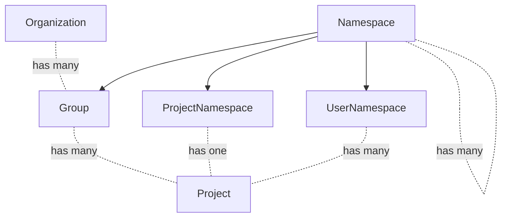
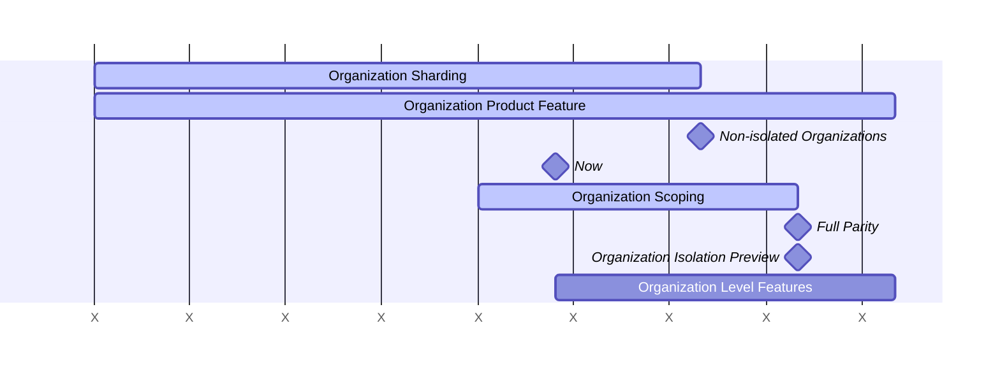



This document is a work in progress and represents the current state of the Organization design.

## Glossary

- User: A user account.
- Top-level Group: Top-level Group is the name given to the topmost Group of all other Groups. Groups and Projects are nested underneath the top-level Group.
- Organization: An Organization is the container for one or multiple top-level Groups. Organizations are isolated from each other.
- Organization user: Organizations have many Users called Organization users. Adding a User to a Group or Project within an Organization makes them an Organization user.
- Organization user type: An Organization user can have an Organization user type of Organization Administrator or Organization Regular User. This user type is used to determine the user's privileges.
- Default Organization: An Organization with `ID = 1` seeded on every GitLab instance.

## Summary

GitLab.com is a public shared installation of the GitLab software. This provides GitLab as a convenient SaaS but falls short of the full GitLab experience in important ways:

1. Parity: The features provided to a customer on GitLab.com and Self Managed
   are different. For example, on GitLab.com customers do not receive
   administrative privileges which accounts for a significant amount of
   functionality.
2. Isolation: On GitLab.com a customer can not exist independent of other
   customers like they do with a Self Managed installation.

Organizations will solve these problems by being a common container across all platforms. Through the creation of an Organization container we can enforce isolation boundaries, and provide a common entity for all top level features.

In effect, the Organization will wrap the Self Managed features into a container and bring this experience to all other GitLab platforms.

The isolation solution is also a pre-requisite for the [Cells project](https://docs.gitlab.com/ee/architecture/blueprints/cells/index.html) which is described in relation to Organization in [Organizations and Cells](cells.md).

## Frequently Asked Questions

If you have a specific question it may be answered within our [FAQ](faq.md) or you may also try to query [GitLab Duo Chat](https://docs.gitlab.com/user/gitlab_duo_chat/examples/) referencing the "Organization Blueprints".

### Splitting the GitLab.com Platform

The GitLab.com platform will be split into two distinct experiences.

Customers join GitLab.com today as a top level group within the default organization.
This experience will persist indefinitely in part to allow for a shared pool of users to contribute to open source projects.

GitLab.com will now expand its offering with a solution for private enterprise Organizations.
These enterprise Organizations will operate in complete isolation from all other Organizations, including the default organization.

Eventually it will be possible for customers to migrate out of the default
organization and into their own private Organization.

## Fundamentals of Organizations

- Organization will wrap around nearly all GitLab features.
- It won't be possible to read or write data between Organizations. Read more about [Organization Isolation](isolation.md).
- Many product features will remain unchanged, but most instance level features will move down and other features up to Organization level. Level changes are elaborated [below](#level-structure).
- Users can be an Organization user of multiple Organizations.
- They can be Administrators of the Organization or just a Regular User.
- Organization Administrators will have admin style privileges within their Organization, such as the ability to delete user accounts. More details [below](#user-types-and-permissions).
- These changes will occur on all GitLab platforms including GitLab.com, Self Managed, and Dedicated.

## Organization Isolation

All Organization data and functionality in GitLab will be isolated.
Isolation means that data and features can never cross Organization boundaries.
This is covered in further detail at [Organization Isolation](isolation.md).

On GitLab.com, organizations begin in a **non-isolated** state to support the
gradual transition of top-level groups out of the Default Organization.
Features that depend on organization-scoped data must check whether the current
organization is non-isolated, or isolated, before enforcing organization boundary rules.
See [ADR 008: Non-isolated organizations on GitLab.com](decisions/008_non_isolated_organizations_gitlab_com.md)
for full details.

## Impact of the Organization on Other Domains

Here is a growing list of pages that describe in more detail how
Organization affects other parts of the system.

- [Billing](billing.md)
- [Cells](cells.md)
- [Settings](settings.md)
- [Lifecycle](lifecycle.md)
- [Users](users.md)
- [Login](login.md)
- [OAuth - GitLab as SP](oauth_client_auth.md)

## Level Structure

Organization will form a new level that combines most Instance Level functionality and all of the Top Level Group functionality.

Instance Level will be reserved for infrastructure level settings.
On GitLab.com, what is Instance Level will only operate on a cell-local basis.
Most Instance Level features and settings should be moved down to Organization Level.
Leaving Instance Level as cell-local means that teams may be asked to perform manual configuration for each cell,
which is not efficient.

Instance Level is not an issue for self-managed because there are no cells, and only one organization.

On GitLab.com, top-level groups currently serve as the container for organization-level features (billing, settings, etc.). These features will move to the Organization level. Top-level groups will then function identically to regular groups and subgroups - the 'pseudo level' distinction goes away. This brings GitLab.com into alignment with Self-Managed, where this distinction never existed.

Below is a depiction of the current and future hierarchy levels within GitLab.

| Current Hierarchy         | Future Hierarchy |
| ------------------------- | -----------------|
| Instance Level            | Most settings move to Organization |
|                           | Organization Level |
| Top Level Group           | Loses special status. Becomes a normal group |
| Group                     | Group (unchanged) |
| Project                   | Project (unchanged) |

Only core features will be moved to Organization prior to Organization launch.
After launch all remaining features will move to the Organization level.

Here is an entity diagram of these levels:

## User Management

For details on how Users are managed within an Organization, see [Organization Users](users.md).

## Visibility

Organizations can be public or private. Public Organizations can be seen by
everyone. They can contain public and private Groups and Projects. Private
Organizations can only be seen by their Organization users. They can only
contain private Groups and Projects.

In the future, Organizations will get an additional internal visibility setting
for Groups and Projects. This will allow us to introduce internal Organizations
that can only be seen by the Users it contains. This would mean that only Users
that are part of the Organization will see:

- The Organization front page, instead of a 404 when navigating to the
  Organization URL
- Name of the Organization
- Description of the Organization
- Organization pages, such as the Activity page, Groups, Projects, and Users
  overview. Content of these pages will be determined by each User's access to
  specific Groups and Projects. For instance, private Projects would only be
  seen by the members of this Project in the Project overview.
- Internal Groups and Projects

As an end goal, we plan to offer the following scenarios:

| Organization visibility | Group/Project visibility | Who sees the Organization? | Who sees Groups/Projects? |
| ------ | ------ | ------ | ------ |
| public | public | Everyone | Everyone |
| public | internal | Everyone | Organization users |
| public | private | Everyone | Group/Project members |
| private | private | Organization users | Group/Project members |

## User types and Permissions

Organizations will have an Administrator user type. Compared to other Organization Regular Users, they can perform the following actions:

| Action | Organization Administrator | Organization Regular User |
| ------ | ------ | ----- |
| View Organization settings | ✓ |  |
| Edit Organization settings | ✓ |  |
| Delete Organization | ✓ |  |
| Remove Users | ✓ |  |
| View Organization front page | ✓ | ✓ |
| View Groups overview | ✓ | ✓ (1) |
| View Projects overview | ✓ | ✓ (1) |
| View Users overview | ✓ |  |
| View Organization activity page | ✓ | ✓ (1) |
| Transfer top-level Group into Organization if Owner of TLG and Administrator of Organization | ✓ |  |

(1) Organization users can only see what they have access to.

[Roles](https://docs.gitlab.com/ee/user/permissions.html) at the Group and Project level remain as they currently are.

## Relationship between Organization Administrator and Instance Administrator

Users with the (Instance) Administrator user type can currently [administer a self-managed GitLab instance](https://docs.gitlab.com/ee/administration/index.html).
As functionality is moved to the Organization level, Organization Administrators will be able to access more features that are currently only accessible to Instance Administrators.
On our SaaS platform, this helps us in empowering enterprises to manage their own Organization more efficiently without depending on the Instance Administrators, which is currently a GitLab team member.
On SaaS, we expect the Instance Administrator and the Organization Administrator to be different users.
Self-managed instances are generally scoped to a single organization, so in this case it is possible that both user types are fulfilled by the same person.
There are situations that might require intervention by an Instance Administrator, for instance when Users are abusing the system.
When that is the case, actions taken by the Instance Administrator overrule actions of the Organization Administrator.
For instance, the Instance Administrator can ban or delete a User on behalf of the Organization Administrator.

## Organization Space

Every Organization, including non-isolated ones, occupies its own scoped space — independent of [isolation](isolation.md) and Cell placement. This gives each its own namespace, keeps paths stable across Cell moves, and provides a home for Organization-level features. See [ADR 012: Organization is a scoped space](decisions/012_organization_space.md) for the rationale.

### Routing

Today only Users, Projects, Namespaces and container images are considered routable entities which require global uniqueness on `https://gitlab.com/<path>/-/`.
We will update routing rules to allow existing globally scoped routes, and introduce a new parallel set of Organization scoped routes.
The globally scoped routes will maintain backwards compatibility with existing routes, and also reduce path verbosity for platforms other than GitLab.com which are likely to have a single Organization.
The URL mechanism is decided in [ADR 004](decisions/004_path_scope.md), and there are further details on [Current Organization](current_organization.md).

## Organization Development

Below is a high level development roadmap for Organizations.
The project is complicated and requires coordination across many engineering teams.
In response to this, the roadmap has been broken into the following broad phases.

### Work Streams

#### Organization Context and Isolation

Tables, with a small number of exceptions, should be related to an Organization.
Organizational tables must have an `organization_id`, `namespace_id`, or a `project_id` column so all tables directly or indirectly belong to an Organization.
This work is currently located within this epic: https://gitlab.com/groups/gitlab-org/-/work_items/11670.
All tables with an `organization_id` foreign key are defined with not null foreign key constraints.
All code paths are writing the correct `organization_id` value and are not relying on a default value.

- We also aim to [prevent reads from extending beyond the boundary of an Organization](https://gitlab.com/groups/gitlab-org/-/epics/17388).
- Our focus will be on the primary pages for group and project creation, as well as the users dashboards.

#### Organization Product Feature

Build a user interface for the Organization including Organization user management and dashboard.

We will include the following set of features in the initial Organization
target. In some cases we have intentionally restricted the problem scope and intend to expand on the solution later.

- **Creation**
  - A default organization is seeded during the installation process.
  - On GitLab.com Organizations can only be created during user registration.
  - Self Managed and Dedicated will not offer the option to create an
    Organization during registration.
  - An admin setting controls the ability to create Organizations. This setting is enabled on GitLab.com and disabled elsewhere.
  - In addition to the admin setting, a feature flag will control the ability to create Organizations. On GitLab.com, this feature flag will only be enabled for GitLab team members. Elsewhere this feature flag will be disabled by default. We will warn against enabling it, but will not be able to prevent self-managed instances from doing so.
- **Editing**
  - Organizations can be edited in the **Settings > General** section. Form fields include name, ID (readonly), description, avatar, and visibility. Only accessible by Organization Administrator.
  - Organization slug can be changed in the **Settings > General** section. Only accessible by Organization Administrator.
- **Visibility**
  - Organizations can be public or private.
  - The Default Organization is public.
  - Requests made to non-Organization specific endpoints such as `/explore` will
    default to the default organization.
  - Public Organizations can be seen by everyone. They can contain public and private Groups and Projects.
  - Private Organizations can only be seen by the Users that are part of the Organization. They can only contain private or internal Groups and Projects.
- **Users**
  - [User types and permissions](#user-types-and-permissions)
  - The creation of an Organization appoints the creating User as the Organization Administrator.
  - Organization Administrators can update the existing user type of a user from Regular User to Administrator or vice versa.
  - There must be at least one Organization Administrator per Organization.
  - A User can only be part of one Organization. A new account needs to be created for each Organization a User wants to be part of.
  - Organization Administrators can delete users within their own Organization.
  - When a user becomes a member of a group or project they are also added as an Organization user. They receive an email informing them that they have been added to the Organization.
  - Removing a user from their last group or project should not remove them from the Organization.
  - Users can delete their own accounts. Users should not be able to delete their account when they are the last Administrator of an Organization.
- **Groups**
  - All existing top-level Groups are part of the default Organization.
  - Groups can be created in an Organization.
  - Groups can be edited by the Organization Administrator.
  - Groups can be deleted by the Organization Administrator.
  - Organization users can view the groups they have access to in the Groups overview. The list of groups can be sorted and searched.
- **Projects**
  - All existing Projects on GitLab.com are part of the default Organization.
  - Projects cannot be created directly in an Organization, instead they are created in a group that belongs to an Organization.
  - Projects can be edited by the Organization Administrator.
  - Projects can be deleted by the Organization Administrator.
  - Organization users can view the projects they have access to in the Projects overview. The list of projects can be sorted and searched.
- **Activity**
  - Organization users can access the Activity page for the Organization.
- **Instance Administrators**
  - All created Organizations are listed in the Admin Area section `Organizations`.
  - Instance Administrators can assign the Administrator or Regular User user type to new users.
  - Instance Administrators can update the existing user type of a user.
  - Instance Administrators can delete a user and receive a warning about the user's Organization association. Instance Administrators cannot delete the last Organization Administrator. They need to assign a new Organization Administrator first.
- **Navigation**
  - Current Organization context is indicated in the navigation sidebar.

#### Organization Level Features

Features will move from Instance Level and Top Level Group to Organization
Level. New features may also be built at the Organization Level. The focus
will begin with core features such as authentication and billing.

There are two phases to this work stream. The first phase is to migrate critical
features that make Organization viable. A second phase after Organization
release is to bring all remaining features to the Organization level.

## Data Exploration

From an initial [data exploration](https://gitlab.com/gitlab-data/analytics/-/issues/16166#note_1353332877), we retrieved the following information about Users and Organizations:

- For the users that are connected to an organization the vast majority of them (98%) are only associated with a single organization. This means we expect about 2% of Users have a need to navigate across multiple Organizations.
- The majority of Users (78%) are only Members of a single top-level Group.
- 25% of current top-level Groups can be matched to an organization.
  - Most of these top-level Groups (83%) are associated with an organization that has more than one top-level Group.
  - Of the organizations with more than one top-level Group the (median) average number of top-level Groups is 3.
  - Most top-level Groups that are matched to organizations with more than one top-level Group are assumed to be intended to be combined into a single organization (82%).
  - Most top-level Groups that are matched to organizations with more than one top-level Group are using only a single pricing tier (59%).
- Most of the current top-level Groups are set to public visibility (85%).
- Less than 0.5% of top-level Groups share Groups with another top-level Group.
  These groups will be unable to migrate to an Organization until we determine a solution.

Based on this analysis we expect to see similar behavior when rolling out Organizations.

## Decisions

- 2023-05-15: [Organization route setup](https://gitlab.com/gitlab-org/gitlab/-/issues/409913#note_1388679761)
- [001: Organization context resolution](decisions/001_organization_context_resolution.md)
- [004: Organization path scope](decisions/004_path_scope.md)
- [005: Organization login](decisions/005_organization_login.md)
- [006: Administration and Settings](decisions/006_administration_and_settings.md)
- [007: Self-managed and Dedicated Single Organization](decisions/007_self_managed_dedicated_single_organization.md)
- [008: Non-isolated organizations on GitLab.com](decisions/008_non_isolated_organizations_gitlab_com.md)
- [009: State machine for organization lifecycle](decisions/009_state_machine.md)
- [010: Organization Read-Only Mode](decisions/010_organization_read_only_mode.md)
- [011: Universal Onboarding Workflow](decisions/011_onboarding.md)
- [012: Organization is a scoped space](decisions/012_organization_space.md)
- [013: Warn when creating a Top-Level-Group inside an organization](decisions/013_warn_on_tlg_creation.md)
- [014: Organization roles renamed to Organization user types](decisions/014_organization_roles_renamed_to_organization_user_type.md)

## Links

- [Organization epic](https://gitlab.com/groups/gitlab-org/-/epics/9265)
- [Organization Isolation](isolation.md)
- [Organization: Frequently Asked Questions](faq.md)
- [Organization development guidelines](https://docs.gitlab.com/development/organization/)
- [Enterprise Users](https://docs.gitlab.com/ee/user/enterprise_user/index.html)
- [Cells blueprint](../cells/_index.md)
