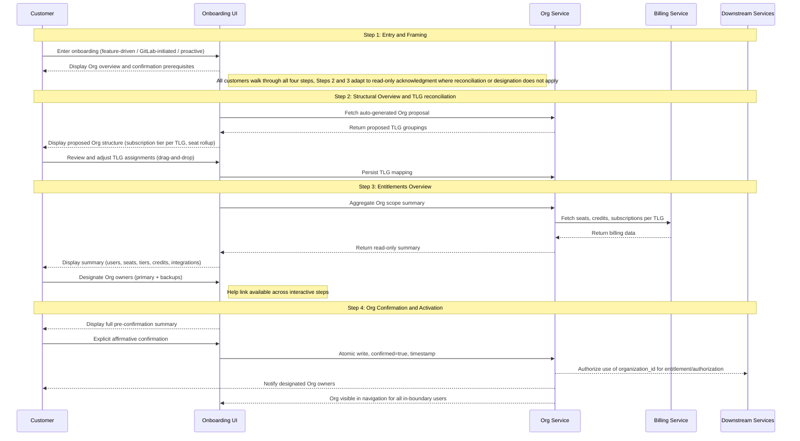

GitLab is introducing Organizations as a foundational primitive that plays three roles across the product. They're distinct, but they reinforce each other in practice.

**The canonical tenant boundary.** An Organization encapsulates a customer's top-level groups, projects, and users under a shared data boundary. It is the boundary that downstream systems use for authorization and entitlement, and that makes the Cells architecture tractable by giving GitLab infrastructure a portable, self-contained unit to move between Cells.

**The unified control plane and unit of build and deploy.** An Organization is the single surface from which customers manage their entire GitLab footprint, and the canonical unit GitLab builds against and deploys to. We build once and deploy everywhere. The same data model, capabilities, and application surface ship to GitLab.com, Self-Managed, and Dedicated rather than three divergent implementations of the same concept. The Org is also the consolidated control plane customers experience: user lifecycle management, visibility controls, billing visibility, settings, and feature enablement all consolidate at the Org level over time, giving every deployment type the same governance surface. On SaaS today, governance is managed TLG by TLG, which produces technical divergence and product fragmentation versus SM and Dedicated. Without the Org as a shared primitive, GitLab forks into three implementations of the same product, and that fragmentation grows across every new feature shipped. The Org guards against that by being both the unit GitLab builds against and the surface customers govern through.

**The unit of cross-platform migration.** When a customer moves between deployment types, GitLab.com to Dedicated, Dedicated to Self-Managed, or across Cells, the Organization is what travels. It is the portable container for the customer's data, groups, and entitlements. A customer cannot complete a cross-platform migration without a confirmed Org on the source platform. This is also what makes migration economics tractable: when the Org is self-contained and portable, migrations become tooled and automated rather than bespoke engineering engagements.

A confirmed Org boundary is the prerequisite for all three. This ADR defines how a customer reaches that confirmed boundary.

This ADR defines the canonical four-step onboarding workflow that moves an Organization from unconfirmed to confirmed to active. The workflow is universal. Every customer walks through all four steps regardless of deployment type. What varies is whether each step requires customer action or read-only acknowledgment. Multi-TLG SaaS customers reconcile their structure in Step 2 and review their entitlements and owner set in Step 3. Single-TLG SaaS customers verify pre-populated structure and entitlements on the same surfaces with less to act on. Self-Managed and Dedicated customers review the same content as read-only acknowledgments before consenting in Step 4: their instance's structure, their entitlements, and their initial owner set. An Org becomes live only once a defined set of conditions is true, and the onboarding workflow is what checks every one of those boxes for every customer.

This workflow is the foundation on which all interim manual flows are built. Customers onboarded through those flows land in a state fully compatible with this workflow when self-service ships. v1 ships alongside a parallel GitLab-managed onboarding path for selected customers, where GitLab creates the Org, transfers the TLG, and confirms on the customer's behalf with their explicit acknowledgment. Both paths produce Orgs in states fully compatible with this workflow; the manual path winds down as self-service capability matures.

What happens after an Org is active, feature enablement, ongoing administration, and the optional upgrade to isolated mode, is out of scope for this ADR. The isolation upgrade flow is specified separately.

---

## The Org State Machine

The [Organization Lifecycle](../lifecycle.md) defines three states relevant to onboarding.

**Unconfirmed:** The Org exists as infrastructure with an Org ID and a data boundary. It is invisible to customers and inert to downstream systems. GitLab auto-creates unconfirmed Organizations for all customers in the background.

**Confirmed:** The customer has reviewed the Org's boundary, entitlements, and initial owner set, and explicitly committed to them. The Org shape is locked.

**Active:** The Org is confirmed and fully provisioned for downstream use. The confirmed Org boundary is visible to in-scope users, the Org owner set is recorded, and downstream systems are authorized to use organization_id for entitlement and authorization.

The four steps in this workflow move an Org from unconfirmed to confirmed. Confirmation initiates the backend work required to make the Org active.

**Confirmed → Active transition.** Confirmation initiates platform-driven background work that completes before the Org becomes active: organization memberships are created, TLG resources are transferred (for SaaS), and downstream systems are authorized to recognize the organization_id. Org-anchored features (such as Artifact Registry) require the active state; confirmation alone is not sufficient for feature enablement. If activation fails, the Org remains in the confirmed state and recovery routes through the help link to support. The customer-visible experience during this transition (progress indicator, success notification, failure messaging) is a UX dependency and must be designed before the workflow ships.

This ADR defines the onboarding lifecycle at the level needed for customer onboarding and downstream activation. More detailed backend state modeling, including any intermediate provisioning states, lives in the [Organization Lifecycle](../lifecycle.md) blueprint.

---

## Governing Principle

Organizations onboarding confirms the boundary. It does not restructure what is inside it. Billing, entitlements, and commercial decisions that predate the Org continue to work as they did. New Org-level features attach to the confirmed Org boundary and are purchased separately. Onboarding does not initiate, restructure, or force decisions that belong to the billing system or to a future Org-level billing design.

All data model decisions made during onboarding must be forward-compatible with future Org-level capabilities, including Org-level seat pooling, Org-anchored contracts, and any flags that govern future operational posture. No implementation choice in this workflow should require destructive migration to support those future models.

Confirmation is an active, informed customer choice on every deployment type. There's no undo path: confirmation makes the Org the authoritative boundary for downstream systems, and it introduces real changes (an Admin Area separate from instance admin, new control plane attributes) the customer needs to understand before agreeing to. Every customer walks through all four steps, regardless of deployment type. What varies is whether each step calls for action or just acknowledgment, but the customer sees what they're agreeing to before they agree.

**Why the workflow is universal across deployment types.** Every customer walks through all four steps, even when a step requires no action from them. Three reasons. Confirmation has no undo path, and customers can't reasonably consent to a boundary, entitlements, or owner set they've never seen, so skipping steps where there's no action to take would mean asking them to commit to content they were never shown. Beyond consent, the Org is GitLab's single unit of build, deploy, and customer-facing governance. Carving the workflow by deployment type fragments both the customer experience and what engineering has to maintain, and we lose the leverage of building once and deploying everywhere. And practically, Steps 2 and 3 are where future customer actions will land: Org owner designation, expanded reconciliation, more Org-level governance. Keeping the same shape today means those features land in known places later, not in a restructured workflow.

---

## Decision Summary

| Decision | Rationale |
|---|---|
| The workflow is universal across deployment types | Every customer walks through all four steps. The shape doesn't change by deployment type; only whether a step requires action or just acknowledgment. Single-TLG SaaS and SM/Dedicated customers verify pre-populated content rather than reconcile it, but they still see it and consent to it. Every confirmed Org reaches that state by satisfying the same conditions. |
| Purchase completes after Org confirmation, not before | Customers cannot reason about Org-level features without a confirmed Org boundary. Forcing purchase before confirmation creates billing records against an uncommitted structure. |
| Subscription tier reconciliation is deferred | Billing remains TLG-anchored at launch. No Org-level billing mechanism exists yet. Forcing tier harmonization imposes financial or operational penalties on customers without a corresponding product benefit. This is a deliberate deferral pending a holistic Org-level billing strategy. |
| Subscription and contract reconciliation is not an Organizations deliverable | Organizations can surface decision points in the UI. The backend to execute contract merges, tier harmonization, and credit pool consolidation must be built and owned by Billing and Fulfillment. |
| Org owner designation lives in Step 3 | Customers designate the Org's owners on the entitlements surface where they also see what those owners will govern. v1 defers the designation surface to a future workstream paired with Admin Area readiness; in the interim the platform produces the initial owner set via TLG-owner auto-promotion during TLG transfer/backfill. Reassignment requests route through the help link to support until the Admin Area ships. |
| SM and Dedicated Organizations walk through all four steps, with Steps 2 and 3 as read-only acknowledgments | The instance boundary is already the Org boundary and entitlements remain at the instance/license level, so Steps 2 and 3 are pre-populated by the platform. The customer still sees them. Step 2 shows the structural view of their instance (TLGs, groups, projects, namespaces); Step 3 shows the entitlements and the initial Org owner set, which is the existing instance admins, auto-promoted. The customer consents at Step 4 having seen what they're agreeing to. The action has no undo. |
| No mid-flow state preservation | If a customer abandons the workflow mid-flow, they restart at Step 1 on return. Target completion time is under 5 minutes, so re-entry friction is bounded. Avoiding state caching keeps the workflow stateless and engineering simpler; as customers opt in, the population not yet confirmed decreases, further reducing practical impact. |

---

## Workflow Trigger Events and Eligibility Handling

### Trigger events

Three events surface the onboarding flow to a customer.

Throughout this section, **users with confirmation authority** refers to the pre-confirmation authority set: TLG owners on SaaS, instance admins on SM and Dedicated. The Org owner role does not exist until confirmation; users with confirmation authority are the people who can act on an unconfirmed Org, and who become the initial Org owner set at confirmation (via TLG-owner or instance-admin auto-promotion in v1).

A feature-driven trigger occurs when a customer attempts to enable or purchase an Org-anchored feature like Artifact Registry and the platform checks whether their Organization has been confirmed. If the Org is unconfirmed, the platform intercepts the enablement attempt and surfaces the onboarding flow before allowing the purchase or activation to proceed. This applies on GitLab.com, Self-Managed, and Dedicated. The workflow runs the same shape for all of them, with Steps 2 and 3 adapting to read-only acknowledgments where the customer has nothing to reconcile.

A direct navigation trigger occurs when a customer navigates to `gitlab.com/o/new` or an equivalent onboarding entry point without a specific feature purchase as the initiating action. This path is expected to grow as Organizations becomes more visible in the product surface.

A platform-initiated trigger occurs when the GitLab backfill process creates an unconfirmed Organization for an existing customer and the platform surfaces a prompt to a user with confirmation authority on their next login or at a scheduled touchpoint.

### Drop-in point routing

Step 1 is always the entry point for any customer who acts interactively. A customer who arrives with an unconfirmed Organization already created by the backfill process still needs to understand what an Organization is and what they are being asked to do before any subsequent step makes sense. The orientation in Step 1 is not optional even when the structural work has already been done for them.

What changes based on Organization state is the path Step 1 hands the customer to.

If no Organization exists, Step 1 proceeds to Step 2 for the full reconciliation flow. If a backfill has already run and an unconfirmed Organization exists, Step 1 frames the situation and routes to Step 2 for review. All four steps run for every customer; what varies is the content and required interaction at Steps 2 and 3. Multi-TLG SaaS customers reconcile structure (Step 2) and review entitlements and the owner set (Step 3). Single-TLG SaaS customers verify pre-populated structure (Step 2) and review pre-populated entitlements and the owner set (Step 3). SM and Dedicated customers see a pre-populated structural view of their instance (Step 2) and a pre-populated entitlements view with the initial owner set (Step 3). Step 4 is the consolidated pre-confirmation checkpoint for every customer. If the Organization is already confirmed, onboarding is bypassed entirely.

| Organization state at trigger | Step 1 exit path |
|-------------------------------|------------------|
| No Organization exists | Step 2 → Step 3 → Step 4 |
| Unconfirmed Org exists, multiple TLGs | Step 2 (reconciliation) → Step 3 (review + designate owners) → Step 4 |
| Unconfirmed Org exists, single TLG | Step 2 (structure verification) → Step 3 (review) → Step 4 |
| Organization already confirmed | Onboarding bypassed |
| SM or Dedicated | Step 2 (read-only structural review) → Step 3 (read-only entitlements + owner set review) → Step 4 |

The content of Step 1 is not identical across the interactive paths. Feature-driven customers need efficient framing that gets them to the feature they purchased as quickly as responsible. Backfill customers need to understand why they are being asked to act on something GitLab created without their input. The orientation is always required; the messaging is context-specific.

Note for UX: Step 1 requires at least three distinct content states corresponding to the interactive routing paths above. Copy ownership and the DRI for each state should be resolved before Step 1 design is finalized.

### Ineligible user handling

When a customer arrives at any onboarding entry point but cannot proceed, the platform surfaces the reason and provides a clear path forward. Silent gating is not acceptable. A customer who lacks confirmation authority (not a TLG owner on SaaS, not an instance admin on SM/Dedicated) should see an explanation of the requirement and guidance on who to contact: a TLG owner for SaaS, an instance admin for SM/Dedicated. A customer who arrives signed out should be directed to sign in before the flow is accessible.

Users without confirmation authority do not see unconfirmed Organizations. The onboarding surface is only presented to users who can act on the Org boundary in its unconfirmed state.

### Email is not a trigger

Email is not a mechanism for initiating the onboarding flow. Customers are not required to enter an email address to start the process, and outbound email is not the primary vehicle for surfacing the flow. Entry points are in-product.

---

## Workflow Overview

This is the canonical onboarding workflow for Organizations. Every customer walks through all four steps; what varies is whether each step requires customer action or read-only acknowledgment. Multi-TLG SaaS customers reconcile structure in Step 2 and review entitlements and designate owners in Step 3 (in the future state; v1 ships designation as read-only review). Single-TLG SaaS customers verify pre-populated structure and entitlements on the same surfaces with less to act on. SM and Dedicated customers see the same surfaces as read-only acknowledgments: the structural view of their instance, entitlements at the instance/license level, and the initial owner set of existing instance admins. Net-new SaaS customers receive an Org silently in the background and may not encounter the flow until a feature gate or platform-initiated prompt surfaces it. Confirmation at Step 4 is an active, informed customer choice for every deployment type. The action has no undo, and the post-confirmation state introduces real changes that the customer must see and consent to.

A help link is available at every step (Step 1 through Step 4), because customers may need help at any point in the flow. It routes to a support queue with pre-filled Org context (Org ID, deployment type, current step, TLG mapping state) so issues with the proposed structure or summary can be resolved outside the flow.

---

### Step 1: Entry and Framing

**What it does:** Orients the customer on what an Organization is, why confirming one is a prerequisite for Org-level features, and what the onboarding process involves. No commitments are made at this step.

**Entry points:**

- Feature-driven: Customer attempts to purchase or access an Org-level feature. The purchase gate surfaces the Org confirmation requirement before the transaction can complete.
- Platform-initiated: GitLab prompts an existing customer to review and confirm the Org it has proposed.
- Direct navigation: Customer initiates onboarding independently ahead of any specific feature need (e.g., via gitlab.com/o/new).

**What changes at confirmation:**

1. **Organization navigation surface.** A new Organization object appears in the side panel as a sibling concept to Groups and Projects. Customers can navigate to the Organization Settings page (where Org-scoped features like Artifact Registry are enabled) and the Organization landing page (a shell surface partner teams populate over time).
2. **Subscription and entitlement anchoring.** Subscriptions, entitlements, and Org-anchored features attach to the organization_id rather than to TLG (SaaS) or instance license (SM/Dedicated). Existing entitlements transition transparently; new Org-anchored features become available to enable once the Org is active.
3. **Org Owner role recorded.** TLG owners (SaaS) or instance admins (SM/Dedicated) are auto-promoted to Org owners at confirmation. In v1, this is a record-only role; TLG/instance permissions continue to cover all needed actions. When the Admin Area ships, Org owners gain Org-scoped administrative authority (subscriptions, user management at Org level, Org-wide settings) distinct from TLG owner or instance admin authority.
4. **Future Admin Area.** A new Admin Area is planned to ship paired with customer-facing Org owner designation. It will be distinct from instance admin (or TLG owner authority on SaaS) and will handle Org-scoped governance. It does not ship with v1.
5. **No undo.** Confirmation is a one-way action. Post-confirmation restructuring requires support involvement until Org merge tooling is available.

**Key decisions:**

- Purchase completes after Org confirmation. Feature-driven customers are told this explicitly before they begin.
- SM and Dedicated customers work through all four steps, same as SaaS. Orientation is essential: they need to understand what an Organization is, what changes with confirmation (the Admin Area is distinct from instance admin), and what they're being asked to agree to. Their Steps 2 and 3 are pre-populated by the platform and presented as read-only acknowledgments; they still see the same content (structure, entitlements, owner set) before committing in Step 4.
- Net-new SaaS customers receive a silently provisioned Org during account creation. They do not interact with it until a feature gate or platform-initiated prompt surfaces. The long-term direction is for every customer to have a confirmed Org; rollout is slow and opt-in for now, and the specific nudge mechanism for proactive onboarding is captured in Open Question 9.

**Dependencies:** The state machine (unconfirmed / confirmed / active) must be implemented as a first-class Org attribute before this step ships. Purchase gate enforcement requires coordination with the relevant purchasing flows.

---

### Step 2: Structural Overview and TLG Reconciliation

**What it does:** Asks the customer to review the Org proposal GitLab has put together: a structural view of the top-level groups, subgroups, projects, and namespaces assembled as their Org. The question on the screen is whether this represents everything that belongs to their organization in GitLab. Reconciliation happens at the top-level group level since TLGs are the unit that moves between Orgs; subgroups, projects, and namespaces come along with their TLG.

**Applies to:** All customers, with varying interaction. Multi-TLG SaaS customers reconcile structure via drag-and-drop. Single-TLG SaaS customers verify a pre-populated structure with one TLG. SM and Dedicated customers acknowledge a pre-populated structural view of their instance (no grouping decision exists because the instance is the boundary). Every customer sees what's structurally in their Org before proceeding.

**Key decisions:**

- GitLab proposes the structure. The customer reviews and optionally adjusts it. The wizard opens with a proposal, not a blank canvas.
- No billing or subscription decisions are made here. Subscription tier is displayed per TLG as context only. No action is required and no conflict is flagged when tiers differ.
- Seat rollup and user overlap are displayed as informational only. They do not gate confirmation.
- Single-TLG customers have a fast path. The structural overview is shown for the user to verify their Organization; no reconciliation work is required because there is only one TLG. Target completion time is under two minutes.
- Multi-TLG customers can move top-level groups between proposed Organizations via drag-and-drop and explicit selection.
- Customers may only move or confirm top-level groups they are authorized to act on. The reconciliation flow does not allow a user to attach arbitrary TLGs outside their authority.
- Following confirmation, SaaS customers can create new top-level groups. The creation flow should surface a warning that billing remains TLG-anchored at launch and that newly created TLGs do not automatically inherit sibling subscriptions, credits, or other commercial state. Billing for the new top-level group remains separate from its siblings until Org-level billing exists, so the warning makes the boundary explicit without blocking customers from structuring their Organization with multiple top-level groups.
- The platform auto-generates a default slug for the Org URL path during confirmation. For SaaS, the slug is based on the customer's primary TLG name. For SM and Dedicated, the slug is based on the customer's registered organization name from their license or contract. Customers do not select or approve the slug during onboarding; conflict-handling logic is governed by Open Question 4. Slug claiming and editing are handled on the post-confirmation Org page by Org Owners, so the default is committed at Step 4 and can be changed later without onboarding rework.

**Data model constraint:** organization_id assignments, subscription tier per TLG, and BillingAccount associations recorded here must be forward-compatible with future Org-level billing models. Engineering sign-off on the storage approach is required before this step ships.

**Dependencies:** Engineering sign-off on forward-compatible data model. Finance confirmation on TLG creation block lift criteria. UX confirmation on proposal heuristic for multi-TLG customers.

---

### Step 3: Entitlements Overview

**What it does:** Shows the customer the commercial picture of the proposed Org: users, seats, subscription tiers, credits, integrations, and Org-scoped entitlements. They also see the initial Org owner set, the people who'll hold Org-wide administrative authority once the Admin Area ships. In the future state, the customer designates that set here (primary plus backups); in v1, it's auto-populated and shown read-only so the customer knows who'll hold authority before they consent. Step 3 puts the commercial picture and the ownership view on the same surface so the customer can think about both before committing. It's separate from Step 2 (structure) and Step 4 (the final consolidated checkpoint).

**Applies to:** All customers, with varying interaction. SaaS customers see the entitlements aggregated across their TLG mapping from Step 2. SM and Dedicated customers see entitlements at the instance/license level. The initial owner set is shown for every customer: TLG-owner-promoted for SaaS, instance-admin-promoted for SM and Dedicated. In v1, the owner set is read-only across all deployment types; future-state designation lives here as a customer action.

**Key decisions:**

- The summary is read-only. No billing decisions are required. Billing continues to work as it does today at the TLG level.
- The summary includes: total users (deduplicated), total seats, subscription tier per TLG, credits balance where applicable, project and group counts, active integrations, and Org-scoped add-on entitlements.
- AR entitlement is Org-scoped (access applies across all top-level groups in the Org). Billing for AR flows through the TLG via which it is purchased, using namespace_id as it does today. No TLG billing anchor designation is required from the customer during onboarding.
- The customer reviews the initial Org owner set on this surface. The set will hold administrative authority over subscriptions, user management, credits, and Org-wide settings once the Admin Area ships. In the future state, the customer designates this set directly (primary plus backups); v1 defers customer-facing designation to a future workstream paired with Admin Area readiness. Until that surface ships, the set is auto-populated and shown as read-only: TLG owners for SaaS (during the TLG transfer/backfill that precedes confirmation), instance admins for SM and Dedicated (at confirmation). Reassignment requests post-confirmation route through the help link to support. See Out of Scope.
- A help link is available on this step and at every other step (Step 1 through Step 4) for cases where the summary or proposed Org structure does not look right. It routes to a support queue with the ticket pre-filled with Org ID, deployment type, current step, and TLG mapping state. Help link interactions are an explicit signal source for product iteration; patterns in what customers flag indicate where the summary or Org structure is unclear or incorrect. Silent abandonment, meaning customers who enter the flow but neither use the help link nor complete it, is an implicit signal of friction or hesitation that warrants investigation. Both signal types should be aggregated for review.

**Dependencies:** Org scope summary data aggregation confirmed as queryable from existing namespace data. TLG mapping from step 2 must be persisted before step 3 renders (or aggregation must run from session state). Credits balance availability confirmed with Fulfillment. Integration surface completeness confirmed with engineering. Help link routing and ticket pre-fill confirmed with Support.

---

### Step 4: Org Confirmation and Activation

**What it does:** The non-negotiable commit step. The customer reviews a complete summary of everything established in steps 1 through 3 and explicitly commits. This is the action that moves the Org from unconfirmed to confirmed to active and authorizes downstream services to use organization_id.

**Key decisions:**

- Confirmation requires an explicit affirmative action. Not a passive scroll or default acceptance.
- The set of Org owners designated in Step 3 is committed at confirmation. The pre-confirmation summary surfaces the designated owners so the customer knows what they are committing to. (v1 interim: until customer-facing designation ships, the platform produces the owner set via TLG-owner auto-promotion; reassignment requests route through the help link to support.)
- The confirmation screen states that this action commits the Org structure as the authoritative boundary for downstream systems, including the auto-generated Org path (for example, `/o/acme-org/`). The Org Owner can claim or edit the slug on the post-confirmation Org page. Post-confirmation structural restructuring is not self-serve in v1 and requires support involvement until Org merge tooling is available.
- SM and Dedicated confirmation is an active, informed customer choice, the same gating principle as SaaS. The customer has already seen the structural view (Step 2) and the entitlements with the initial owner set (Step 3) as read-only acknowledgments; Step 4 consolidates them and the customer explicitly opts in. Confirmation gates Org activation; no SM or Dedicated Org becomes active without customer consent.
- If the customer identifies an error in the pre-confirmation summary, each element links back to the step where it was established.

**What confirmation produces:**

- `state = STATES[:confirmed]` on the Org record
- Confirmation timestamp recorded
- Org visible in navigation for all users within the boundary
- Org Admin Area enabled when it ships, paired with the future owner designation workstream
- Downstream services authorized to use organization_id for entitlement and authorization
- Designated Org owners notified

**Dependencies:** Atomic write guarantee for the Org record state transition must be confirmed with engineering. Navigation visibility propagation timing confirmed. Return navigation invalidation logic (what step 3 data is invalidated if step 2 changes) confirmed with engineering.

---

## Cross-Cutting Dependencies

The following dependencies affect multiple steps and must be resolved before the workflow can ship end-to-end.

| Dependency | Owner | Affects |
|---|---|---|
| State machine (unconfirmed / confirmed / active) implemented as first-class Org attribute | Tenant Scale Engineering | Steps 1, 4 |
| Purchase gate enforcement: Org-level features cannot be purchased against an unconfirmed Org | Fulfillment, AR team | Step 1 |
| Forward-compatible data model for organization_id assignments and TLG metadata | Tenant Scale Engineering | Steps 2, 3 |
| TLG mapping persistence timing: written on step 2 completion or only on step 4 confirmation | Tenant Scale Engineering | Step 3 |
| Org scope summary data aggregation from existing namespace_ids | Tenant Scale Engineering | Step 3 |
| Atomic write guarantee for confirmed and timestamp fields | Tenant Scale Engineering | Step 4 |
| Org merge tooling for post-confirmation restructuring | Tenant Scale Engineering | Step 4 |
| Step 3 owner designation surface paired with Admin Area readiness; v1's TLG-promoted owner set must be editable when the designation surface ships | Tenant Scale Engineering, Tenant Scale Product | Step 3, Admin Area launch |
| Help link routing and ticket pre-fill (Org ID, deployment type, current step, TLG mapping state) | Support, Tenant Scale UX | All interactive steps, especially Step 3 |
| Post-confirmation Org page with slug claiming/editing surface for Org Owners | Tenant Scale Engineering, Tenant Scale UX | Step 2 slug auto-generation, Step 4 confirmation outputs |
| Onboarding flow telemetry: step-by-step progression, help link interactions, and silent abandonment (entered flow, did not use help link, did not complete) | Tenant Scale Product, Analytics Instrumentation | All interactive steps |

---

## Out of Scope

The following are explicitly not in scope for this workflow and are tracked separately.

**Feature enablement and post-onboarding operations.** What an active Org enables, feature surfaces, the Admin Area, and ongoing governance are downstream of confirmation and not part of reaching the confirmed boundary.

**The isolation upgrade.** Upgrading a confirmed, active non-isolated Org to isolated mode is specified in ADR 012. Nothing in this workflow sets, references, or depends on an isolation flag.

**Subscription tier reconciliation at Org formation.** Billing remains TLG-anchored at launch. No Org-level billing mechanism exists. Forcing tier harmonization during onboarding imposes financial or operational penalties on customers without a corresponding product benefit. This requires a holistic Org-level billing strategy before it can be designed.

**Org merge tooling.** This operates on two already-active confirmed Organizations with live subscriptions and established boundaries. It is architecturally distinct from the reconciliation wizard in step 2, which operates before any Org is confirmed. Merge tooling is tracked in a separate epic.

**Credits partitioning at Org level.** Whether usage-based credits can be partitioned at the TLG level within an Org is architecturally unresolved. This is deferred until the credits architecture is confirmed to support it.

**Customer-facing Org owner designation surface (Step 3).** The target steady state for owner designation is a customer-facing surface in Step 3 where the customer designates the Org's owners (primary plus backups) alongside the entitlements view. v1 defers this surface to a future workstream paired with Admin Area readiness. In the interim, the platform produces the initial Org owner set via auto-promotion: TLG owners for SaaS (during the TLG transfer/backfill that precedes confirmation) and instance admins for SM and Dedicated (at confirmation). The set is shown to the customer as read-only in Step 3 across all deployment types, so consent applies to the owner set as well as the Org boundary. Reassignment requests post-confirmation route through the help link to a support queue. The future workstream must include a self-serve reassignment surface for the initial seeded set.

---

## Open Questions Requiring Resolution Before Workflow Ships

1. Forward-compatible data model storage approach. Requires engineering sign-off.
2. TLG mapping persistence timing. Affects step 3 query architecture.
3. Purchase gate mechanism across all Org-level purchasing flows. Requires Fulfillment coordination.
4. Slug uniqueness scope, global or BillingAccount-scoped. This governs the platform's auto-generation logic during confirmation (collision handling) and the post-confirmation slug claiming and editing surface on the Org page. Global uniqueness requires a broader availability check; BillingAccount-scoped uniqueness requires only intra-customer conflict handling. Resolution affects both auto-generation defaults and the post-confirmation Org page slug surface.
5. Multi-TLG proposal heuristic. Exact signals and confidence thresholds for GitLab's auto-proposal.
6. TLG creation block lift criteria. Milestone, capability threshold, or volume threshold.
7. Atomic write guarantee for the Org record state transition. Requires engineering confirmation.
8. Admin Area launch timing and scope. The Admin Area launch must be paired with the Step 3 owner designation surface so that customer-facing designation works when authority becomes actionable.
9. Platform-initiated trigger mechanism for non-feature-driven onboarding. The intent is to eventually nudge every customer toward Org confirmation; rollout is slow and opt-in for now. The specific trigger surface (admin login prompt, scheduled communication, banner, etc.) is undefined for customers not arriving via a feature gate. Applies to SM/Dedicated and to net-new SaaS that hasn't yet hit a feature gate.

---

## Alternatives Considered

**Single-step confirmation without a staged workflow.** Rejected. The decisions required for multi-TLG customers, the structural overview, the entitlements overview, and owner designation cannot be collapsed into a single screen without creating an overwhelming and error-prone experience. The staged workflow also lets the platform auto-complete inapplicable steps cleanly for SM and Dedicated rather than presenting screens with nothing to decide.

**Blank canvas reconciliation UI.** Rejected. Asking customers to assemble their Org structure from scratch in step 2 puts the burden of recall on the customer and produces inconsistent results. GitLab already knows the customer's TLGs, so the flow opens with a proposal the customer corrects rather than an empty surface they must populate.

**Purchase before Org confirmation.** Rejected. Creates billing records against an uncommitted Org structure. Customers cannot reason about Org-level features without a confirmed Org boundary. Also creates a messy billing state if onboarding is abandoned after purchase.

**Requiring subscription tier harmonization at Org formation.** Rejected. Billing is TLG-anchored at launch. The Org is not the billing entity. Forcing harmonization imposes a financial or operational penalty for solving a problem the platform cannot yet address. 2.7% of .com customers have more than one TLG, and these long-tenured customers are the most likely early AR adopters. Imposing harmonization at the point of onboarding would create friction for exactly the customers most likely to need early Org-scoped capabilities such as AR.

**Auto-confirmation for all SaaS customers without a self-service flow.** Rejected. SaaS customers with multiple top-level groups need to confirm the grouping is correct before downstream systems treat the Org as authoritative. Auto-confirmation without review creates an Org structure the customer may not recognize or trust.

**Skipping or shape-varying the workflow by deployment type.** Rejected. Two variants were considered and rejected: (a) SM/Dedicated skip the workflow entirely with platform auto-confirmation, which bypasses informed consent; (b) SM/Dedicated walk through only Steps 1 and 4 with Steps 2 and 3 auto-completing invisibly, which creates a deployment-specific workflow shape and weakens consent. The adopted model is universal: every customer walks through all four steps, with content adapting to context (interactive reconciliation, fast-path verification, or read-only acknowledgment) but structure staying the same. This keeps the workflow simple and the customer's consent meaningful, regardless of deployment type.

---

## Review and Approval Required

This ADR requires review and approval from the following before implementation begins on any step.

| Reviewer | Area | Required for |
|---|---|---|
| Tenant Scale Engineering Lead | Data model, state machine, atomic writes, forward compatibility | All steps |
| UX and Technical Writing | Orientation content, reconciliation wizard, entitlements summary screen with owner designation, help link affordance, confirmation screen | Steps 1, 2, 3, 4 |
| AR Team | Entitlement scoping to organization_id, purchasing flow integration | Step 3 |

---

## References

- New Isolation upgrade ADR: Isolation Upgrade Workflow (downstream of a confirmed Org)
- Organizations Onboarding Step Specs: Steps 1 through 4 (this initiative)
- Organizations and Billing issue: gitlab.com/gitlab-org/gitlab/-/work_items/597957
- Non-Isolated Organizations Onboarding epic: gitlab.com/groups/gitlab-org/-/work_items/21394
- Organizations Onboarding Workflow for Artifact Registry Enablement: gitlab.com/groups/gitlab-org/-/work_items/21393
- AR Usage Billing Integration MR: gitlab.com/gitlab-org/architecture/usage-billing/design-doc/-/merge_requests/27
- ADR 008: Non-Isolated Organizations on GitLab.com: https://handbook.gitlab.com/handbook/engineering/architecture/design-documents/organization/decisions/008_non_isolated_organizations_gitlab_com/
- Cells: Organization Migration design document: https://handbook.gitlab.com/handbook/engineering/architecture/design-documents/organization-data-migration/
- Cells: Organization Migration design document
