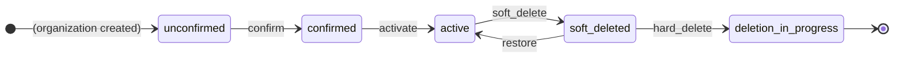

<!-- Design Documents often contain forward-looking statements -->
<!-- vale gitlab.FutureTense = NO -->

## Summary

An Organization moves through five states: `unconfirmed` → `confirmed` → `active` → `soft_deleted` → `deletion_in_progress`. Owners can soft-delete an `active` Organization (which hides it from the UI and public API) and restore it. Only instance admins can escalate a `soft_deleted` Organization to hard deletion, which is irreversible. Every transition is audited in a JSONB column on `organization_details`.

We use the [`state_machine` gem](https://github.com/state-machines/state_machines) and share low-level infrastructure with `Namespaces::Stateful` through `Gitlab::TenantContainerLifecycle::Stateful` modules. See [ADR 009](decisions/009_state_machine.md) for the rationale.

## Goals and non-goals

Goals:

- A machine-enforced lifecycle with explicit allowed transitions.
- An immutable audit trail for every transition, stored alongside the Organization.
- Reversible soft-deletion for owners; admin-gated hard-deletion for legal/GDPR follow-through.
- Shared infrastructure with the namespace state machine to avoid duplication.

Non-goals:

- Archival (a namespace concept).
- Cross-cell transfer.
- State inheritance — Organizations are roots.

## State diagram



There is no `deleted` state — a successful hard deletion destroys the row. `unconfirmed` and `confirmed` have no path to `soft_deleted`: an Organization that has not yet completed activation cannot be deleted.

### States

| State | Integer | Meaning |
|-------|:-:|---------|
| `unconfirmed` | 0 | Newly created; not yet usable. |
| `soft_deleted` | 1 | Hidden from UI and public API; owners can restore, admins can hard-delete. |
| `deletion_in_progress` | 2 | Hard-deletion worker is running; the row is destroyed on success. |
| `confirmed` | 3 | Owner has confirmed; background provisioning is running. |
| `active` | 4 | Provisioning complete; fully operational. |

Integer values are append-only and reflect introduction order, not lifecycle order.

### Transitions

| Event | Source → Target | Required arguments |
|-------|-----------------|--------------------|
| `confirm` | unconfirmed → confirmed | `transition_user`, `confirmed_by_user` |
| `activate` | confirmed → active | — |
| `soft_delete` | active → soft_deleted | `transition_user` |
| `restore` | soft_deleted → active | `transition_user` |
| `hard_delete` | soft_deleted → deletion_in_progress | `transition_user` |

Every transition records who triggered it through `update_state_metadata`. Failures call `update_state_metadata_on_failure`, which writes `last_error` and emits a structured log without changing state.

Authorization for `soft_delete`, `restore`, and `hard_delete` is enforced at the [service layer](#service-entry-points). The state machine only checks that `transition_user` is supplied.

## Data model

```sql
organizations
  state  SMALLINT  NOT NULL  DEFAULT 0

organization_details
  soft_deleted_at  TIMESTAMP WITH TIME ZONE
  state_metadata   JSONB  NOT NULL  DEFAULT '{}'
```

`state_metadata` is validated against a strict JSON Schema (`organization_detail_state_metadata.json`, `additionalProperties: false`):

```json
{
  "last_updated_at":         "<datetime>",
  "last_changed_by_user_id": <integer | null>,
  "last_error":              "<string | null>",
  "correlation_id":          "<string | null>",
  "soft_deleted_by_user_id": <integer | null>,
  "restored_at":             "<datetime | null>",
  "restored_by_user_id":     <integer | null>,
  "confirmed_at":            "<datetime | null>",
  "confirmed_by_user_id":    <integer>
}
```

Fields are exposed as typed accessors on `OrganizationDetail` through `jsonb_accessor`.

## Adding a new state or transition

A state-machine change spans two repositories:

1. In `gitlab-org/gitlab`, in a single MR: `Organizations::Stateful` (state enum, `state_machine` block, guards, callbacks) **and** `organization_detail_state_metadata.json` if the new state adds metadata fields. The schema and the code must land together — `additionalProperties: false` will fail saves in production otherwise.
2. In `gitlab-com/content-sites/handbook` (this repository): this blueprint — states table, transitions table, future-work table.

Cross-link the two MRs and merge them together.

Integer values are append-only — assign the next free integer, regardless of lifecycle position.

## Service entry points

Every user-driven transition has a dedicated service that wraps the state-machine event with authorization, idempotency, and audit logging. Each one follows the same shape:

1. Check authorization through `OrganizationPolicy`.
2. Verify the current state is a valid source for the event.
3. Invoke the event with `transition_user: current_user`.
4. Surface state-machine errors as the service response if the transition did not happen.
5. Emit an audit-log event and return a successful `ServiceResponse`.

| Service | Event | Ability |
|---------|-------|---------|
| `Organizations::SoftDeleteService` | `soft_delete` | `:soft_delete_organization` |
| `Organizations::RestoreService` | `restore` | `:restore_organization` |
| `Organizations::HardDeleteService` | `hard_delete` | `:hard_delete_organization` (admin-only) |

Notes:

- `SoftDeleteService` requires the Organization to be empty (no groups nor projects) — soft deletion only hides, and is reversible.
- `HardDeleteService` enqueues the background hard-deletion worker on success; the worker performs the row destruction. Hard deletion is for legal/GDPR follow-through and is not exposed in the standard UI.

## Error handling

When a transition fails (a guard returns `false`):

- `update_state_metadata_on_failure` writes the error to `state_metadata['last_error']` and saves the detail record.
- `log_transition_failure` emits a structured error log.
- `organizations.state` is **never** modified on failure.

If a hard-deletion worker fails partway, the Organization stays in `deletion_in_progress` with `last_error` populated. Recovery is by re-running an idempotent worker, not a state-machine backward transition. A dedicated recovery transition can be added later if we need it.

## Future work

The state machine is in place; the service and API surface still need work:

| Transition | Service | GraphQL mutation | REST endpoint |
|-----------|---------|-----------------|--------------|
| `confirm` | [#598074](https://gitlab.com/gitlab-org/gitlab/-/work_items/598074) | [#596669](https://gitlab.com/gitlab-org/gitlab/-/work_items/596669) | [#596669](https://gitlab.com/gitlab-org/gitlab/-/work_items/596669) |
| `activate` | [#597856](https://gitlab.com/gitlab-org/gitlab/-/work_items/597856) | N/A (background) | N/A (background) |
| `soft_delete` | [#594308](https://gitlab.com/gitlab-org/gitlab/-/work_items/594308) — rename pending | [#594313](https://gitlab.com/gitlab-org/gitlab/-/work_items/594313) — rename pending | [#599345](https://gitlab.com/gitlab-org/gitlab/-/work_items/599345) — rename pending |
| `restore` | [#599343](https://gitlab.com/gitlab-org/gitlab/-/work_items/599343) | [#599344](https://gitlab.com/gitlab-org/gitlab/-/work_items/599344) | [#599346](https://gitlab.com/gitlab-org/gitlab/-/work_items/599346) |
| `hard_delete` | TBD — admin-only | TBD — admin-only | TBD — admin-only |

"Rename pending" rows are issues originally framed around `schedule_deletion` / `cancel_deletion` / `start_deletion` that need re-scoping to the soft-delete / restore / hard-delete naming. Finder changes to hide `soft_deleted` Organizations from non-owners are tracked in [#594312](https://gitlab.com/gitlab-org/gitlab/-/work_items/594312).

## Relationship with Organization Isolation

Lifecycle and [Isolation](isolation.md) are orthogonal. Lifecycle answers *"Is this Organization operational?"*; isolation answers *"How strictly are its data boundaries enforced?"*. They do not share a state machine, and isolation flags can be set independently of soft-deletion.

One dependency: the first isolation step (`isolation_desired`) requires the Organization to be `active`. Triggering isolation in `unconfirmed` or `confirmed` would be premature.

## Open Questions

### Concurrency and locking

Two actors could try to transition the same Organization at once — for example, an owner restores while an admin hard-deletes. Current lean: optimistic locking on `lock_version` is enough. All transitions are human-driven, so contention should be rare. If real-world conflict rates are higher than expected, we can either add a custom pessimistic-lock helper or migrate to [AASM](https://github.com/aasm/aasm#pessimistic-locking), which supports pessimistic locking natively. Decide before the first user-facing surface ships.

### Recovery from `confirmed`-state failures

If background provisioning fails after `confirm`, the Organization stays in `confirmed` indefinitely — there is no path back to `unconfirmed` or forward to a `failed` state. Are we relying on idempotent retries, or do we need a recovery transition? To be decided.

### Initial state for user-created Organizations

`unconfirmed` fits the case where GitLab provisions an Organization for a customer. Once end users create Organizations themselves (post-GA), there is no provisioning step to confirm. Two options:

- Run `confirm` + `activate` synchronously inside the creation service, so `ConfirmationService` side effects still execute.
- Allow `unconfirmed → active` directly (or default user-created rows to `active`) when no side effects are needed.

The choice depends on what side effects, if any, are bound to confirmation by the time self-service ships. See [MR thread](https://gitlab.com/gitlab-com/content-sites/handbook/-/merge_requests/19693#note_3328588386).

### Retention window for `soft_deleted`

Should `restore` be available indefinitely, or expire after a retention window (after which only `hard_delete` is legal)? Indefinite is simplest; a fixed window (for example, 30 days) would match the prior delayed-deletion behavior and GDPR expectations. Decide before `restore` ships behind a UI.

## Alternative Solutions

See [ADR 009](decisions/009_state_machine.md) for the rationale for using a state machine over simpler data models.
