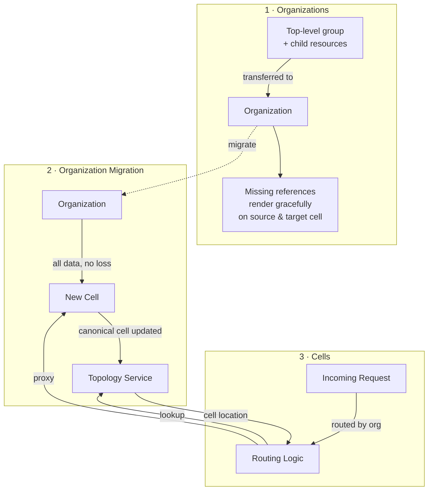



## Summary

Protocells relieves the [legacy cell](../cells/goals.md#legacy-cell)'s databases by providing horizontal scalability.

Organizations serve as logical boundaries and Cells serve as physical boundaries.

This design document integrates three key components: Organizations, Organization Migration, and Cells.

Progress is tracked in the [working epic](https://gitlab.com/groups/gitlab-com/gl-infra/-/work_items/1616).

## Motivation

GitLab.com operates as a single monolithic instance with a shared database, which creates a fundamental scalability
bottleneck.

As GitLab grows, the legacy cell's databases face increasing load and capacity constraints.

Protocells addresses this by enabling horizontal scalability through:

- **Logical Isolation**: Organizations provide a clear logical boundary for customer data and operations.
- **Physical Distribution**: Cells enable distributing Organizations across multiple self-contained GitLab instances.
- **Scalability**: Multiple Cells can operate independently, removing load from the legacy cell and enabling growth.
- **Feature Parity**: Maintaining consistent features across all deployment models (GitLab.com, Self-Managed,
  Dedicated).

### Goals

- Introduce Organizations as the logical boundary with Organization Isolation to enable data separation.
- Establish a one-to-one mapping between instance and Organization on Self-Managed and Dedicated deployments.
- Deploy multiple self-contained GitLab instances as Cells on GitLab.com, each capable of hosting multiple
  Organizations.
- Ensure cross-organization operations utilize public APIs to maintain isolation boundaries.
- Achieve feature parity for Organizations and Cells across all deployment models.
- Relieve the [legacy cell](../cells/goals.md#legacy-cell)'s database.

### Non-Goals

- Detailed implementation specifications for individual features.
- Regional compliance.
- Multi-Cloud support.
- Organization load re-balancing.
- Global Admins.
- Global settings.

## Proposal

Protocells is built on three pillars:

**1. Organizations**: Introduce Organizations as the logical boundary with
[Organization Isolation](../organization/isolation.md).

This prevents data and operations from crossing Organization boundaries.
Organization context resolution is established for all requests.

On Self-Managed and Dedicated, a one-to-one mapping between instance and Organization is established through the
[Organization ADR](../organization/decisions/007_self_managed_dedicated_single_organization.md).

**Result**: A top-level group, and its child resources (groups, projects and users, and so on) are transferred to its own Organization.

- When this Organization is moved to another cell, pages do not break when references are missing.
  For example, an issue tries to render the author name, but the author (User) was outside of this organization, and was not moved together with this org.
  That issue page should continue to render.
- Similarly, pages on the source cell should not break due to missing references.
  For example, a user in the organization that was moved to another made a comment on an issue in another organization.
  That issue page should continue to render.

**2. Organization Migration**: Enable the movement of Organizations between Cells through the
[Organization Data Migration](../organization-data-migration/_index.md) design document.

This tooling supports migrating Organizations from the Legacy Cell to new Cells.
It enables horizontal scalability and load distribution across the infrastructure.

**Result**: All data for an Organization are moved from one cell to another, without data loss. The canonical cell for that Organization is updated in Topology Service to switch over.

**3. Cells**: Deploy multiple self-contained GitLab instances as Cells on GitLab.com through the
[Cells Design Document](../cells/_index.md).

Each Cell is capable of hosting multiple Organizations.
Cells operate as independent GitLab instances with their own databases and infrastructure.

**Result**: [Routing logic](../cells/http_routing_service.md) directs requests to the appropriate Cell based on Organization.

[Source](https://excalidraw.com/#json=kIOOzXyJ-snh5P_pK0RGX,xrCYj2lKaXxB79YySTBtbg)

This effort does not preclude other complementary efforts to support the legacy cell's database, such as [Data Retention](../../guidelines/data_lifecycle/data_retention.md).

## Design and Implementation Details

### Logical vs. Physical Boundaries

The architecture distinguishes between two types of boundaries:

**Logical Boundary (Organization)**: Defines data sharding boundary (e.g. PostgreSQL, Gitaly) and access control.

Organizations are the unit of isolation for all GitLab features and data.

**Physical Boundary (Cell)**: Defines infrastructure distribution.

Cells are self-contained GitLab instances that can host multiple Organizations.

This separation enables:

- Organizations to move between Cells without changing their logical structure.
- Multiple Organizations to share infrastructure on a single Cell.
- Cross-organization operations to use public APIs.

### Organization-Scoped Operations

Most operations should be scoped to an Organization.

This ensures features operate within the logical boundary and maintain isolation.

### Cross-Organization Operations

All operations that span multiple Organizations must utilize public APIs.

This ensures:

- Proper authentication and authorization boundaries.
- Consistent behavior across deployment models.
- Clear separation of concerns between Organizations.

Examples of cross-organization operations:

- User authentication and session management.
- Public API access to shared resources.
- Administrative operations on GitLab.com.

### Deployment Models

#### GitLab.com

- Multiple Cells, each hosting multiple Organizations.
- Organizations are the unit of isolation.
- Cells are the unit of physical distribution.
- Default Organization provides backward compatibility for existing users.

#### Self-Managed and Dedicated

- Single instance per Organization (one-to-one mapping).
- Organizations provide the logical boundary.
- Instance provides the physical boundary.
- Simplified operational model compared to GitLab.com.

## Dependencies

This design document depends on three key design documents:

- **[Cells Design Document](../cells/_index.md)**: Defines the architecture for deploying multiple self-contained
  GitLab instances.
- **[Organization Design Document](../organization/_index.md)**: Defines the Organization model and its role as a
  logical boundary.
- **[Organization Data Migration Design Document](../organization-data-migration/_index.md)**: Defines the tooling and
  processes for migrating Organizations between Cells.

## Feature Parity

Feature parity will be required to ensure customers retain existing functionality.
These efforts will focus on:

- [**Organization Feature Parity**](https://gitlab.com/groups/gitlab-com/gl-infra/-/work_items/1871): Ensuring Organizations have consistent features across all deployment models.
- [**Cells Feature Parity**](https://gitlab.com/gitlab-org/architecture/readiness/-/blob/main/templates/platform_strategy/cells.md): Ensuring Cells support all GitLab features required for production use.

## Alternative Solutions

### Multiple Independent Instances

**Pros:**

- Complete isolation between instances.
- Simple to operate.

**Cons:**

- No shared resources or features.
- Difficult to manage multiple instances.
- Does not provide the unified GitLab experience.

## Links

- [Working Epic](https://gitlab.com/groups/gitlab-com/gl-infra/-/work_items/1616)
- [Cells Design Document](../cells/_index.md)
- [Organization Design Document](../organization/_index.md)
- [Organization Isolation](../organization/isolation.md)
- [Organization Data Migration](../organization-data-migration/_index.md)
- [Organization ADR: Self-Managed and Dedicated Single Organization](../organization/decisions/007_self_managed_dedicated_single_organization.md)
