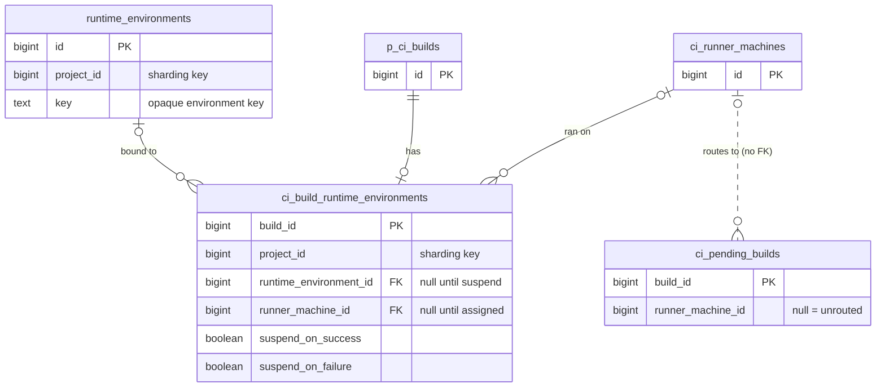



## Overview

Runner environments today are ephemeral. When a job finishes - or when an agent pauses to ask a human a question - the environment is destroyed. Everything on disk, every installed dependency, every bit of working state: gone. Resuming means cold-starting from scratch: provisioning, cloning, and rebuilding before anyone can do anything.

**Suspendable Environments** solves this by suspending the environment in place rather than releasing it. Resume brings it back with full state intact. A job opts in by setting suspension triggers; after it completes, the runner suspends the environment and reports an environment key to GitLab. The next run receives that key and resumes on the same environment with disk state preserved.

The mechanism has two implementation paths, each described in its own document:

- **[Fleeting-Based Executors](fleeting.md)** (Instance and Docker Autoscaler): The instance is stopped via the cloud provider API. The disk is preserved on the instance's own storage. Resume means powering the instance back on.
- **[Kubernetes Executor](kubernetes.md)**: The pod is deleted but a PersistentVolumeClaim retains the working directory. Resume means creating a new pod mounting the same PVC.

### Use Cases

- **Human-in-the-Loop (HIL)**: An agent suspends at a decision point and surfaces a resume link in the MR. The developer clicks it and is dropped into the exact environment in seconds, not minutes.
- **Cost-Efficient Agent Sessions**: Agents on multi-step tasks suspend during natural idle periods (waiting for CI results, review feedback) and resume without losing progress, turning always-on sessions into pay-for-what-you-use.

## Environment Key Design

The environment key is the identity of a suspended environment. It is prefixed with the runner ID and system ID (for routing) and is otherwise opaque to GitLab:

```text
<runner-id>/<url-encoded-system-id>/<url-encoded-fields>
```

The runner ID and system ID come first (before the second `/`) so GitLab can route the resumed job without parsing the rest. The runner ID identifies the runner registration and the system ID identifies the specific runner manager. Together they uniquely identify the runner manager process that holds the suspended environment. The system ID is URL-path-encoded so values containing path-significant characters (such as `/`) round-trip correctly. Everything after the second `/` is a URL-encoded query string (the same encoding `url.Values.Encode()` produces in Go: `key1=value1&key2=value2`, with values URL-escaped), parsed only by the runner. New fields can be added without changing the outer structure or breaking existing parsers - a parser ignores keys it does not recognise.

**The content after the second `/` is executor-internal state. No component outside the Runner Manager may parse, validate, index, or depend on its structure.** GitLab Rails may read the runner ID and system ID prefix for routing, but must treat everything after it as an opaque blob. This keeps the GitLab API surface minimal and ensures the key format can evolve without cross-component changes.

## Suspension and Resume Behaviour

All new changes in GitLab Runner are behind a feature flag `FF_SUSPENDABLE_ENVIRONMENTS`.

### Suspension on Job Completion

Suspension triggers and the environment key are internal job plumbing, not CI variables. They are set by the pipeline creation chain (e.g. the Workload framework) and are not user-visible, not overridable by group or project settings, and not subject to the CI variable inheritance hierarchy.

Note: neither lives in `build.options`. Options feed the deduplicated `Ci::JobDefinition` - a checksummed payload that cut options storage by ~90% - and an instance-unique environment key there would explode the number of unique definitions. So the triggers and the key live in the runtime-environment tables instead, and Rails injects them into the job payload at dispatch (see [Persistence](#persistence)).

The runner inspects two suspension triggers: `suspend_on_success` and `suspend_on_failure`. When a job completes and the matching trigger is set, the runner suspends the environment instead of releasing it. The job outcome (success or failure) is preserved. Both triggers can be set simultaneously - the environment is suspended regardless of job outcome. If a job is terminated (by a user, timeout, or pipeline supersession), the environment is released normally - termination does not trigger suspension. If termination arrives while suspension is already in progress, termination wins - the runner waits for the suspension to complete (to avoid leaving a half-suspended environment), then tears down the environment. On resume, the runner receives the environment key in its job payload and uses it to resume the suspended environment.

### Resume on Job Dispatch

When a job arrives with an environment key set, the runner resumes the suspended environment and waits until it is ready. Git source fetching is skipped on resume. The working directory is preserved from the suspended job - running git checkout would remove untracked files (build artifacts, installed dependencies, agent checkpoints) and defeat the purpose of suspend/resume. `GIT_STRATEGY` is not modified; the source stage simply does not execute. Cache restore and artifact download stages still run normally.

## Rails Integration

Rails persists the environment key, enforces auth on resume, and routes the resumed workload to the correct runner. This is a temporary stand-in for the [Runner Environment Service](../runner_job_router/), which will own environment lifecycle behind an opaque key once it exists - at which point these tables and routing rules go away. The schema below is intentionally minimal and disposable.

### Persistence

The data behind a suspended environment is large, instance-specific, and short-lived - the environment is torn down after a TTL, and only a small fraction of jobs ever suspend. It lives in its own tables.

**`runtime_environments`** - one row per suspended environment: a surrogate primary key `id`, the opaque `key` the runner reports, and a `project_id` sharding key. The `id` is just an internal handle for joins; the `key` is the meaningful identifier. The table is small and lifecycle-bounded, so it can be partitioned and dropped on the same TTL as the environments.

**`ci_build_runtime_environments`** - one row per build that takes part in suspend/resume. It holds the build's suspension triggers (`suspend_on_success`, `suspend_on_failure`) and its link to a runtime environment. A row is created only when a job opts in:

- **A job that may suspend** (either trigger set) gets a row at pipeline creation with `runtime_environment_id` still `NULL` - no environment exists yet. When the job suspends and reports its key, Rails creates the `runtime_environments` row and fills the link in.
- **A resume** - the orchestrator dispatches a job carrying an environment key - gets a row at pipeline creation already pointing at the existing environment.

One environment is reused across many jobs - each human-in-the-loop round is a new job on the same environment - so this is many builds to one environment. `runner_machine_id` records which machine actually ran the build, set on assignment; it is for correlation and audit, not routing. A row whose job never suspends keeps a `NULL` link and is swept on the same TTL.

Both new tables carry `project_id` as their sharding key, modeled on `p_ci_runner_machine_builds`. `runner_machine_id` is a plain column, not a foreign key: `ci_runner_machines` is cell-local (a different schema), so a cross-schema FK is not allowed - again matching `p_ci_runner_machine_builds`.

Instance and dedicated runners are cell-local, so a suspended environment and the runner manager holding it stay in the same cell. Routing is intra-cell, and these tables move with the organization like the rest of the CI queue. Resume routing uses a denormalized column on `ci_pending_builds` - see [Job Routing](#job-routing).



Note: this is `runtime_environment`, not `environment`. CI already uses `environment` for the deployment keyword in `.gitlab-ci.yml`, and reusing the term would be a constant source of confusion.

These are separate tables rather than columns on `p_ci_runner_machine_builds` because that table has billions of rows and no retention - it is long-term data. A reference column there needs a foreign key, the foreign key needs a matching (non-partial) index, and that index would be large from day one and slow to build. Separate, lifecycle-bounded tables keep the storage cost and the retention where they belong and leave the hot path alone.

### Auth at Resume

Rails enforces auth centrally when a job with an environment key is dispatched, so orchestrators do not need to re-implement the check:

- Project match: the build that suspended the environment belongs to the same project.
- Permission: the dispatching user has `:update_build` on the build that suspended the environment.

Per-user binding is not enforced - sessions can legitimately transfer between users (handoff, mob debugging). If an orchestrator wants per-user policy, it owns that constraint.

### Key Flow on Resume

The orchestrator reads the environment key from the suspending build's record through an internal API endpoint - not GraphQL, since this is an internal contract for now, not a public one - then dispatches a new job carrying the key. Pipeline creation binds that build to the same runtime environment (see [Persistence](#persistence)). Access is gated to `:update_build` on the suspending build, so the key is only available to actors who can also dispatch a resume.

### Job Routing

Routing is by runner machine, in the queue query.

When a resumed build moves from `created` to `pending`, Rails resolves the runner-and-system-id prefix of its environment key to a `runner_machine_id` and denormalizes that onto the `ci_pending_builds` row. The queue query gains one predicate:

```sql
AND (runner_machine_id IS NULL OR runner_machine_id = :requesting_machine_id)
```

`NULL` means any eligible runner can take the build, which is the normal case. A set value means only that machine can. This is a query predicate, not a post-query check in Ruby: every row the query returns is already valid for the asking runner. That matters because the queue pulls a bounded window of candidates - a routed build filtered out after the fact would sit at the head of the queue as a poison pill. Filtering in the query avoids that.

Routing keys on the machine. One registration backs many workers - they share a single token - and a suspended environment lives on exactly one of them, so the machine is the right granularity. The query compares a single integer; it never parses the key, which is resolved to a machine id once, as the build is queued.

The `ci_pending_builds` row is created with its routing target already set, so a routed build never appears in the queue without it - no window for the wrong machine to grab it.

## Environment Cleanup

### Orchestrator Cleanup

When a workflow is done with an environment, the orchestrator dispatches a job carrying the environment key with neither suspension trigger set. The runner resumes onto the environment, runs the (no-op) job, and - with no trigger to suspend - releases it instead of suspending again. Same routing and auth as any resume; there is no separate terminate API.

### Runner TTL

The runner enforces a hard TTL as a safety net. A background loop tears down any suspended environment older than N days (configurable, default 1 week). This catches crashed workflows, abandoned sessions, and orchestrator bugs. No coordination with Rails is needed - the cleanup is local, self-contained, and bounded.

## Security

1. **The environment key is not a secret.** The key is composed of non-sensitive identifiers: the runner ID, system ID, an acquisition UUID or PVC name, and optionally a container ID. Possession of the key alone grants nothing - authentication still goes through the executor's own connection mechanism (Fleeting connection details, Kubernetes API). Dispatching a resumed job also requires project membership. The key does not need to be masked in logs or treated as a credential.

1. **Runner-local isolation.** The environment key is only meaningful to the runner process that issued it. There is no external API through which an attacker can call resume. Cross-runner replay is structurally impossible: a key from runner A has no effect on runner B.

1. **Same-project enforcement.** The runner has no way to verify that the job carrying an environment key belongs to the same project that suspended the environment. Rails enforces project match centrally at dispatch. Without it, another project could attach to the preserved environment and read its disk contents.

1. **Same-user enforcement.** Per-user binding is not enforced - another user within the same project can resume onto the environment. This is by design (handoff, mob debugging are legitimate cross-user transfers). Orchestrators that need stricter user isolation own that policy.

1. **Sensitive data at rest during suspension.** Any data written to the environment during the job - credentials, API tokens, intermediate build secrets - persists for the full duration of the suspension window. The storage medium (instance disk or PVC) remains in cloud storage. A compromised cloud account can read that data. The workload is responsible for cleaning up sensitive data written outside the runner's control (such as OAuth tokens persisted to .git/config) before suspension.

1. **`CI_JOB_TOKEN` does not survive the suspension boundary.** `CI_JOB_TOKEN` is scoped to a single job and expires when that job completes. The resumed job receives a fresh token from GitLab - the original token is not reused. However, if the original job wrote `CI_JOB_TOKEN` to disk (e.g. git credential helpers, registry auth configs), those stale credentials persist on the resumed environment's disk. They are expired and cannot be used for authentication, but they are sensitive data at rest.

1. **Isolation between suspended and active jobs.** Suspend/resume does not change the isolation model of the executor - it inherits whatever boundaries the executor already provides. On the Instance executor, jobs share the host filesystem. On Docker Autoscaler, each job has its own containers but shares the Docker daemon. The suspension window extends the period during which a suspended job's state is co-resident with other jobs on the same instance. The level of cross-job isolation depends on the executor's configuration (container boundaries, gVisor, privileged mode, `capacity_per_instance`).

## Out of Scope

1. **Filesystem integrity verification on resume**: The runner has no mechanism to verify disk state before handing the job back. Detecting or recovering from a corrupted or missing filesystem is out of scope.
1. **Instance executor with nesting**: Nesting runs multiple isolated VMs on a single instance. Suspend/resume for individual nested VMs is out of scope. The suspend/resume steps for the Instance executor apply to the non-nested case where the instance itself is the environment.
1. **Shell, Docker (standalone), and docker+machine executor**: These executors are legacy. Suspend/resume will not be implemented for them.
1. **Orphaned cloud resources**: Suspended state is persisted to disk and reconstructed on runner restart. However, if the persisted state is lost (disk failure, manual deletion), the underlying instance or PVC is left with no one managing it. Cloud-level orphan detection (e.g. tagged resources with no corresponding runner state) is out of scope.

## Open Questions

1. **Observability and metrics**: Operators need visibility into suspend/resume operations to manage cost and capacity. What metrics should be exposed (suspend/resume latency, failure rate, number of currently suspended environments, time-in-suspension distribution, storage cost)? Should these be runner-level Prometheus metrics, reported to GitLab, or both?

## Future Work

### GitLab-Initiated Suspension

Suspend mid-execution on a signal from GitLab, for example pausing an agent session from the UI. Requires a signal channel from GitLab to the runner that interrupts the running script and triggers suspension before the job has exited.

### Agent-Initiated Suspension

For interactive workflows where the agent or script itself decides when to pause, the environment needs an in-band API for suspension - not just the job-completion triggers described above. The [Runner Environment Service](../runner_job_router/) defines this shape - `Create`, `Stop`, `Start`, `Terminate` for environment lifecycle and `Run`/`Exec` for executing within an environment, sketched in the [step-runner proto](https://gitlab.com/gitlab-org/step-runner/-/blob/e0f48aa3d1049f510c015878d93d08c410e6822d/proto/sandbox.proto). The suspend/resume mechanism in this blueprint is the implementation of `Stop`/`Start` in that model. Exposing these operations to the agent inside the environment - enabling it to suspend at a decision point, surface a question to the human, and resume with the answer - is a future iteration building on it.

### Detachable Storage

Instance suspend preserves state on the instance's own disk by keeping the VM stopped. A dedicated volume persists state on a separately managed disk that survives the instance being released entirely. They can be used independently or together: a job can suspend the instance and keep a volume attached for extra durability, or use a volume alone to give up the instance slot entirely - valuable for long-lived suspensions where ongoing instance billing is not acceptable, or for workloads on spot/preemptible instances that may be reclaimed mid-suspension. The environment key format already supports this - a `volume-id` field can be added alongside executor-specific fields without changing the outer structure.

### CI Debugging

Suspend a failing job at the point of failure via `suspend_on_failure`. A developer resumes into the preserved environment to investigate without re-running the pipeline.

## References

- [Resumable Jobs for CI and Agent Sessions](https://gitlab.com/groups/gitlab-org/-/work_items/21159)
- [Blueprint - Resumable Jobs for CI and Agent Sessions](https://gitlab.com/gitlab-org/gitlab/-/work_items/593314)
- [GitLab Runner Job Router](../runner_job_router/) - defines the Runner Environment Service
- [Suspendable Environments on Kubernetes - Research](https://gitlab.com/-/snippets/5973444)
- [Provision a runner fleet with a modern executor for the duo tag](https://gitlab.com/gitlab-org/gitlab/-/work_items/597038)
