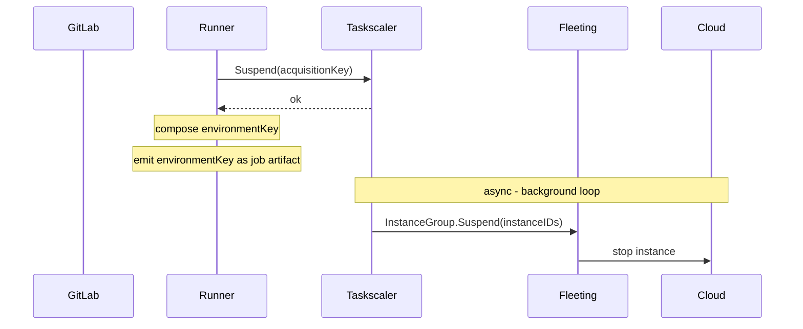
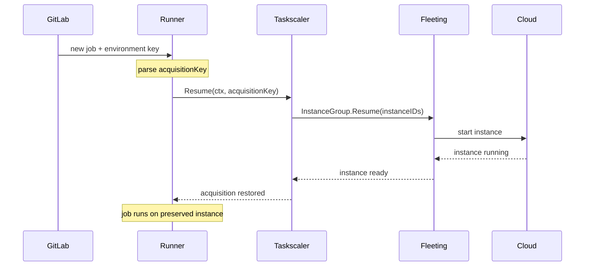
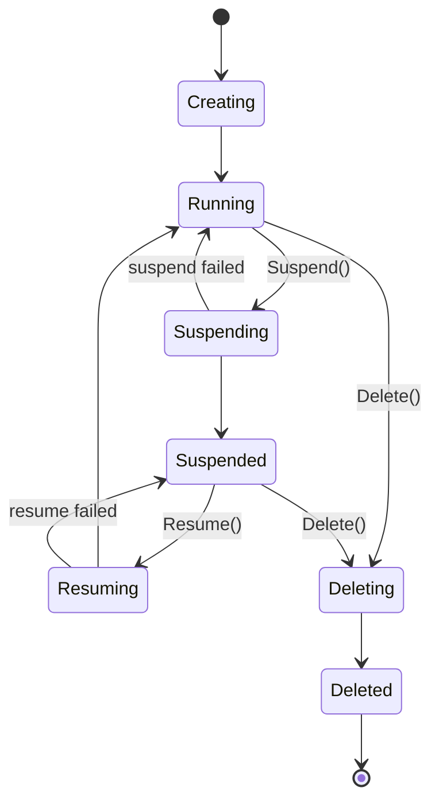

This document describes the suspend/resume implementation for the **Instance and Docker Autoscaler executors**, which run on cloud VMs managed through the Fleeting/Taskscaler stack. Suspension means stopping the VM via the cloud provider API; the disk is preserved on the instance's own storage. Resume means powering the instance back on.

For the shared design (environment key format, security model, open questions), see the [main blueprint](_index.md). For the Kubernetes executor implementation, see [kubernetes.md](kubernetes.md).

## Architecture

Suspend/Resume is an opt-in capability that propagates bottom-up: a cloud plugin declares support in its capabilities; fleeting surfaces this to taskscaler; taskscaler exposes the same to the runner. If any layer in the chain does not support suspension and the job requests it, the runner fails the job.

### Suspend Flow



### Resume Flow



## Architectural Design Records (ADR)

### ADR1: Lazy Instance Suspension

Marking an acquisition suspended happens immediately. The underlying instance stop is deferred until all acquisitions on the instance are suspended or released. A single instance often serves multiple concurrent jobs - suspending one must not affect the others.

### ADR2: Block Acquisitions During Cloud Suspend

When the cloud suspend operation is in-flight for an instance, new acquisitions skip that instance entirely rather than landing on it and then cancelling the suspend. This avoids the need for cancel tracking and compensating resume operations that arise when a new job races with an in-progress cloud stop. The cost is that the instance's free slots are temporarily unavailable while the cloud stop completes - but the cloud stop only starts when all acquisitions on the instance have been suspended or released, so those slots were already idle. If demand arrives during this window, the scaler provisions a new instance.

## Components

### Fleeting

`StateSuspended` is a long-lived stable state - an instance may remain suspended for hours or days. It polls at the same configurable slow rate as `StateRunning`; only transitional states (`StateSuspending`, `StateResuming`) trigger aggressive polling. A suspended instance may be deleted directly without first being resumed.



Capabilities are declared by the plugin as part of `ProviderInfo`, returned from the existing `Init()` call - no separate RPC needed:

```go
type ProviderInfo struct {
    // existing fields unchanged...
    Capabilities []Capability
}

type Capability string

const (
    CapabilitySuspendResume Capability = "suspend_resume"
    // future capabilities added here
)
```

The provisioner reads `ProviderInfo.Capabilities` once at init and exposes `HasCapability(cap)` so callers don't reach past the abstraction. It only invokes `Suspend`/`Resume` on the plugin when `HasCapability(CapabilitySuspendResume)` is true. `HasCapability` is a generic capability check that works for `suspend_resume` and any future capabilities.

`Suspend` and `Resume` are added to the core `InstanceGroup` interface. The provisioner only calls them if the plugin declared the `suspend_resume` capability; plugins that do not declare the capability never have these methods called and may leave the implementation as a stub.

```go
type InstanceGroup interface {
    // existing methods unchanged...
    Suspend(ctx context.Context, instances []string) (succeeded []string, err error)
    Resume(ctx context.Context, instances []string) (succeeded []string, err error)
}
```

Suspended instances remain part of the pool - they hold cloud resources even while stopped, and the provisioner does not launch replacements for them.

An instance's readiness signal resets whenever the instance leaves `StateRunning` - not only when it reaches `StateSuspended`. This ensures correct behavior for all transition paths, including `Running -> Suspending -> Running` (failed suspend revert) where `StateSuspended` is never reached. Callers waiting for a resumed instance use the same wait mechanism as for a newly provisioned one.

The fleeting state machine has no `Suspending -> Resuming` transition, so a resume must wait for any in-flight suspend to reach `StateSuspended` first. Fleeting handles this internally: bounded by the configured timeout, it waits for the suspended state before issuing the cloud resume, then waits for the instance to reach `StateRunning` before returning.

### Fleeting Plugins

A plugin opts in by populating `ProviderInfo.Capabilities` in `Init()` and implementing `Suspend`/`Resume`:

```go
func (g *InstanceGroup) Init(ctx context.Context, log hclog.Logger, settings provider.Settings) (provider.ProviderInfo, error) {
    // existing init logic...
    return provider.ProviderInfo{
        // existing fields...
        Capabilities: []provider.Capability{provider.CapabilitySuspendResume},
    }, nil
}

func (g *InstanceGroup) Suspend(ctx context.Context, instances []string) ([]string, error) {
    // 1. Move instances out of auto-scaling management
    // 2. Stop instances
    // 3. Return IDs of successfully suspended instances
    return succeeded, nil
}

func (g *InstanceGroup) Resume(ctx context.Context, instances []string) ([]string, error) {
    // 1. Start instances
    // 2. Re-add instances to auto-scaling management
    // 3. Return IDs of successfully resumed instances
    return succeeded, nil
}
```

Plugins that do not opt in leave `Capabilities` empty. The provisioner never calls `Suspend`/`Resume` on them. Existing precompiled plugins will work as-is without any changes.

### Cloud Provider Plugins

Each cloud provider has the same challenge: stopping an instance that belongs to a managed auto-scaling group causes the group's health checks to mark it unhealthy and replace it. The solution in each case is to move the instance out of active management before stopping it, and restore it on resume. If the stop step partially fails, the preceding step is rolled back for the affected instances.

| Cloud | Suspend | Resume | Notes |
|---|---|---|---|
| AWS | `EnterStandby` (ASG) -> `StopInstances` (EC2) | `StartInstances` (EC2) -> `ExitStandby` (ASG) | |
| GCP | `abandonInstances` (MIG) -> `instances.stop` (CE) | `instances.start` (CE) -> `addInstances` (MIG) | |
| Azure | Enable instance protection (VMSS) -> `deallocate` (VMSS) | `start` (VMSS) -> Remove instance protection (VMSS) | Unlike AWS and GCP, which remove the instance from the scaling group on suspend and re-add it on resume, Azure keeps the instance in the VMSS throughout the suspend/resume cycle. Instance protection prevents VMSS from terminating it, but the instance remains visible to VMSS autoscaling rules and counts against the scale set's capacity during both suspension and resumption. The Azure plugin must account for this when reconciling desired vs. actual capacity. |

Stopping an instance releases its ephemeral public IP on all clouds. On resume, a new public IP is assigned. The private IP within the VPC/VNET is stable across stop/start cycles on all clouds.

The runner always re-fetches connection details before connecting to an instance, so it always uses the current IP after a resume. Plugins must not cache addresses across a stop/start cycle.

### Taskscaler

Three methods are added to the existing `Taskscaler` interface:

```go
type Taskscaler interface {
    // existing methods unchanged...
    // HasCapability returns true if the underlying fleeting provisioner supports the given capability.
    HasCapability(cap provider.Capability) bool
    // Suspend marks an acquisition as suspended and cancels its context with ErrAcquisitionSuspended.
    // Fails fast if the provisioner does not support suspend/resume.
    // The acquisition is preserved - not removed - for Resume.
    // The actual instance stop is deferred until the last non-suspended acquisition on the instance is
    // suspended or released, so suspending one job never disrupts other jobs on the same instance.
    Suspend(key string) error
    // Resume restores the acquisition by resuming the underlying instance via
    // fleeting and waiting for it to become ready. State inspection (running,
    // suspending, suspended) is handled by the fleeting provisioner internally.
    // If the context is cancelled, the acquisition stays suspended so the caller can retry.
    Resume(ctx context.Context, key string) (Acquisition, error)
}
```

Suspended slot assignments are persisted to disk. On restart, taskscaler reconstructs suspended acquisitions from saved state without re-provisioning. During graceful shutdown, the runner normally waits for all active acquisitions to finish (drain) before exiting. Suspended acquisitions are excluded from this drain count - they are not running, so the runner does not wait for them. Similarly, suspended instances are skipped during teardown so they persist across runner restarts rather than being released.

Suspended slots are excluded from the scaling calculation in a way that prevents them from blocking new provisioning. A suspended instance is not counted as active capacity, so its suspended slots must not inflate the "unavailable" count either - otherwise the scaler's demand guard would incorrectly conclude that demand exceeds what the active instances can provide and refuse to scale up. Suspended slots are also excluded from idle capacity so the scaler does not treat them as available. New acquisitions are allowed on instances that have suspended slots - the acquisition loop skips over suspended slot indices and places new jobs on available slots. Instances with an in-flight cloud suspend are skipped by the acquisition loop entirely (see ADR2).

Suspended instances must count against the runner's configured capacity (e.g. `MaxInstances`). A stopped VM still holds a slot - if the scaler ignores suspended instances when evaluating how many instances it can provision, unbounded suspension can exhaust the configured capacity ceiling and prevent new instances from being created.

## GitLab Runner

All new changes in GitLab Runner will be behind a feature flag `FF_SUSPENDABLE_ENVIRONMENTS`.

### Executor Suspend/Resume Interface

Executor-specific suspend/resume behaviour is decoupled from the provider through one interface and one concrete struct:

```go
// SuspendableExecutor is implemented by executors that can preserve a job's
// workload state across job boundaries.
type SuspendableExecutor interface {
    // Suspend persists the workload state and returns the fields needed to
    // restore it. These fields are carried in the EnvironmentKey to a future
    // resuming job.
    Suspend(ctx context.Context) (url.Values, error)
    // Resume rebuilds the workload state from the fields produced by a prior
    // Suspend call.
    Resume(ctx context.Context, fields url.Values) error
}

// EnvironmentKey identifies a suspended environment. The runner produces it
// when suspending a job and parses it when a follow-up job resumes. The
// runner-id and system-id route the resume back to the same runner instance
// that issued the suspension; the fields carry executor-specific state.
//
// Format: <runner-id>/<url-encoded-system-id>/<url-encoded-fields>
type EnvironmentKey struct {
    RunnerID int64
    SystemID string
    Fields   url.Values
}
```

The provider is executor-agnostic - it decides *whether* to suspend (based on the suspension triggers), but delegates the *how* to the executor via `SuspendableExecutor`. The provider mixes its own routing fields (e.g. `acquisition-key`) into the same `url.Values` and emits the resulting `EnvironmentKey`. On resume, the provider parses the wire-format string back into `EnvironmentKey`, extracts its provider-owned fields, and hands the remaining fields to the executor's `Resume`.

The interface is designed to be extended to other providers (e.g. Kubernetes) without changes to the suspend/resume framework.

### Suspension on Job Completion

**Instance executor** (non-nested; see [Out of Scope](_index.md#out-of-scope) for nesting):

1. No-op (the instance itself is the environment; no workload-level preparation needed).
2. Provider calls `scaler.Suspend(acquisitionKey)` - the slot is preserved, not returned to the pool.
3. Provider composes the environment key with the runner ID, system ID, and acquisition key.
4. Runner emits the environment key as a job artifact.

**Docker Autoscaler**:

1. Executor stops the build container, helper container, and all service containers concurrently via the Docker API (containers are stopped, not removed).
2. Executor returns the IDs of all preserved containers as env-key fields: `build-container-id`, `helper-id`, and `service-ids` (comma-separated).
3. Provider calls `scaler.Suspend(acquisitionKey)` - the slot is preserved, not returned to the pool.
4. Provider composes the environment key with the runner ID, system ID, acquisition key, and container IDs.
5. Runner emits the environment key as a job artifact.

### Resume on Job Dispatch

**Instance executor**:

1. Runner parses the acquisition key from the environment key.
2. Runner calls `scaler.Resume(acquisitionKey)`, which blocks until the instance is running and ready.
3. No-op at the executor level - the instance is ready as-is.

**Docker Autoscaler**:

1. Runner parses the acquisition key and container IDs from the environment key.
2. Runner calls `scaler.Resume(acquisitionKey)`, which blocks until the instance is running and ready.
3. Executor inspects the build container by ID and derives network and volume state from its inspect response.
4. Executor restarts each service container by ID and waits for them to become healthy.
5. Executor populates the build and helper container caches so subsequent commands run on the preserved containers.
6. If any preserved resource is missing, the resume fails with an error.

### Environment Key Fields

| Provider / Executor | Key format |
|---|---|
| Autoscaler / Instance | `<runner-id>/<system-id>/acquisition-key=<uuid>` |
| Autoscaler / Docker | `<runner-id>/<system-id>/acquisition-key=<uuid>&build-container-id=<id>&helper-id=<id>&service-ids=<id1>,<id2>` |

### Environment Persistence

**Instance executor**: Suspension stops the instance without tearing down the environment - the filesystem, installed dependencies, and build artifacts on the attached disk are preserved intact. On resume, the instance starts back up with everything in place. This requires persistent (non-ephemeral) storage - instances backed by ephemeral volumes lose disk state on stop/start and are incompatible with suspend/resume.

**Docker Autoscaler**: The build container, helper container, and service containers are stopped (not removed) on suspend and restarted on resume. Named volumes and the build network are preserved on the VM. The containers' writable layers on the instance disk are intact across the cycle. The Docker executor uses its Docker client connection for all operations - no shell commands are executed via the connector.

## Failure Modes

| Failure | Behaviour |
|---|---|
| Executor does not support suspension | Runner fails the job when `FF_SUSPENDABLE_ENVIRONMENTS` is enabled; otherwise the options are silently ignored. |
| Cloud plugin does not support suspension | Runner fails the job when `FF_SUSPENDABLE_ENVIRONMENTS` is enabled; otherwise the options are silently ignored. |
| Acquisition key not found (clean restart) | The runner restarts and reconstructs suspended acquisitions from persisted state on disk. Normal operation - no data loss. |
| Acquisition key not found (state corruption) | The runner's persisted state is corrupted or lost (disk failure, manual deletion). The underlying instance remains suspended in the cloud with no one managing it - requires manual cleanup or a retention policy. |
| Instance terminated externally | Resume fails; runner fails the job. The dangling acquisition must be cleaned up. |
| Docker container not found | Runner fails the job before attempting resume. The suspended instance and acquisition remain intact. |
| Resume timeout | Acquisition stays suspended. The caller can retry by resubmitting with the same environment key. |
| Filesystem state lost on resume | The instance powers on successfully but the disk state is gone (e.g. ephemeral storage wiped on stop/start, or manual disk replacement). The runner has no visibility into disk integrity - the job resumes into a broken environment and behaviour is undefined. |

## Alternatives Considered

### Long-Lived Instances

Keep instances running between jobs rather than releasing them. No suspend/resume machinery needed - the environment is always available.

Rejected because idle instances are billed at full compute rate. At any scale, the cost of keeping instances warm between jobs is prohibitive.

### Disk Snapshots

On job completion, snapshot the instance's disk (EBS on AWS, Persistent Disk on GCP, Managed Disk on Azure) and store the snapshot ID in the environment key. The instance is released immediately. On resume, provision a new instance with the snapshot restored as its volume.

This eliminates instance pinning - a resumed job can run on any instance in the pool - and removes the need for ASG Standby or MIG abandon. Snapshot storage costs a fraction of a running instance, and the approach survives spot termination without special handling.

However, it only works cleanly in a one-job-per-instance model. When multiple acquisitions share an instance, you must wait for all other jobs to complete before snapshotting and releasing - the same wait as lazy instance suspension, but with a slower resume (snapshot restore + new instance boot + lazy volume hydration can add several minutes). Taking a live snapshot while other jobs write to disk also risks inconsistent state. For the multi-job-per-instance case that taskscaler is built around, snapshots offer no meaningful advantage over instance suspend and are significantly slower to resume.

Disk snapshots remain a viable complement for very long-lived suspensions where ongoing instance billing is not acceptable.

### Persistent Shared Storage

Mount a network-attached filesystem (AWS EFS, GCP Filestore, Azure Files) as the job's working directory - the cloned repository and any files written during the job. On "suspend", the job completes and the instance is released. On "resume", any instance mounts the same volume.

This requires no cloud-specific suspend logic and no instance pinning. However, it only preserves the mounted directory - installed packages, system libraries, Docker layers, and anything outside the mount point are gone on resume. The job arrives on a fresh instance and must reinstall its full toolchain, which negates the primary benefit. Network storage is also significantly slower than local SSD, degrading build-heavy workloads.

This approach suits artifact persistence, not full environment preservation.

### Process-Level Checkpointing (CRIU)

Checkpoint/Restore In Userspace (CRIU) saves the full process tree state - including memory - to disk and restores it on any host. Unlike instance suspend, it preserves in-memory state and is not tied to a specific instance.

Despite running in userspace (the name refers to where the checkpoint logic executes, not its privilege level), CRIU requires elevated kernel capabilities (`CAP_SYS_PTRACE`, `CAP_SYS_ADMIN`). It also has limited compatibility with GPU workloads, certain kernel features, and multi-threaded programs, and is not supported natively by any major cloud provider. The operational complexity and workload restrictions make it unsuitable as a general-purpose solution for CI environments.
