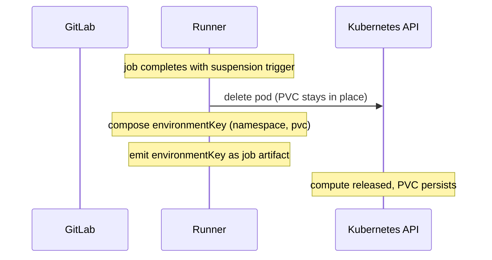
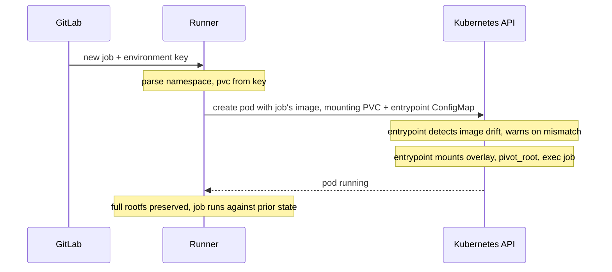

This document describes the suspend/resume implementation for the **Kubernetes executor**. Unlike Fleeting-based executors where suspension means stopping a VM, Kubernetes has no equivalent primitive - when a pod is deleted, its writable layer and emptyDir volumes are destroyed. The approach here mounts an overlayfs inside the container with its upper and work directories backed by a PersistentVolumeClaim, then `pivot_root`s into the overlay so every filesystem modification (system packages, global installs, `/tmp`, `/home`, the working directory) lands on the PVC and survives pod deletion.

For the shared design (environment key format, security model, open questions), see the [main blueprint](_index.md). For the Fleeting-based implementation (Instance and Docker Autoscaler), see [fleeting.md](fleeting.md).

## Architecture

An entrypoint script mounts an overlayfs where the lower layer is the container's base image (read-only) and the upper and work directories live on a PVC mounted at `/persist`. After the overlay is mounted, the script bind-mounts `/proc`, `/sys`, `/dev`, `/persist`, and the kubelet-injected `/etc/resolv.conf`, `/etc/hosts`, and `/etc/hostname` into the merged tree, uses `pivot_root` to make the merged tree the new root of the mount namespace, and unmounts the old root. The script itself ships in a Kubernetes ConfigMap that the runner creates per environment, alongside the PVC, and that shares the PVC's lifecycle. Every pod for that environment (initial run, suspends, and resumes) mounts the ConfigMap at `/scripts` and runs the script as its command. Both `/persist` and `/scripts` are mounted by the kubelet at pod startup, so they are available to the entrypoint before any overlay setup runs.

The bind-mounts handle paths that the overlay alone cannot cover: kernel pseudo-filesystems populated by the kernel rather than the image (`/proc`, `/sys`), runtime-provided device nodes (`/dev`), the PVC itself (so `/persist` remains accessible after the pivot), and the host-injected pod networking files (`/etc/resolv.conf`, `/etc/hosts`, `/etc/hostname`) which the kubelet writes into the container at startup. Everything else in the filesystem (`/etc`, `/usr`, `/var`, `/home`, `/tmp`, `/root`, etc.) comes through the overlay.

`pivot_root` (not `chroot`) is essential. The Kubernetes executor streams each job command into the running container via the Kubernetes exec API (the same API `kubectl exec` uses) - the job's actual work happens through exec'd processes, not the container's entrypoint.

`chroot` is per-process: it only changes the root view of the calling process. Exec'd job commands would start with the original container root and silently bypass the overlay; their writes would land in the pod's ephemeral writable layer and disappear when the pod is deleted.

`pivot_root` operates at the mount-namespace level. Every process that enters the namespace - PID 1, exec'd commands, debugging shells - sees the overlay as `/`, and every write lands in the upper directory on the PVC.

On suspend, the pod is deleted but the PVC (carrying the overlay state) is retained. On resume, a new pod is created mounting the same PVC. The entrypoint cleans the overlay work directory (the bookkeeping is per-mount), remounts the overlay over the same upper, and pivots in. All prior filesystem modifications - cloned repo, build artifacts, dependencies, system packages, global pip/gem/npm installs, `/tmp`, `/home`, agent checkpoints - are visible.

On the first run for a new environment, the runner provisions the PVC and ConfigMap, the entrypoint mounts the overlay over an empty upper directory, and the job runs against a fresh base image. Subsequent suspends and resumes follow the cycle above.

This approach:

- **Runtime-agnostic** - works with containerd, CRI-O, runc, and crun. No runtime-specific tooling.
- **No host-level changes** - no DaemonSet, no privileged helper pod, no node-level config changes. The entire mechanism lives inside the workload pod.
- **No explicit snapshot step** - changes persist as they happen. There is no checkpoint window during which work can be lost.
- Uses **standard Kubernetes primitives** (Pod, PVC, ConfigMap) that every cluster administrator understands.

The trade-offs:

- **Requires `CAP_SYS_ADMIN`** to perform the overlay mount and `pivot_root`. With user namespaces (`hostUsers: false`, GA in Kubernetes 1.36), this capability is namespaced and grants no host privilege. Sandboxed runtimes (gVisor, Kata Containers) similarly contain it within the sandbox boundary, since syscalls do not reach the host kernel directly. Without any of these, it is a real host capability and is acceptable only in trusted environments.
- **PVC node and zone affinity** - `ReadWriteOnce` PVCs with zonal block storage pin the resumed pod to the same zone, and on some storage drivers to the same node. Operators that require cross-node scheduling on resume need either `ReadWriteMany` storage (NFS, CephFS) or object-storage sync on suspend/resume.
- **Process state is not preserved** - this preserves the rootfs, not live processes, memory, or open file descriptors. The job script restarts from the beginning on resume; in-flight work is the user's responsibility to checkpoint (agent state files, build cache, etc.).
- **Image consistency is a user contract, not a runner enforcement** - the overlay upper is layered onto whatever base image the resuming job specifies, so image drift (the resuming image differing from the one used at suspend, whether by a tag change or a registry rebuild of the same tag) can produce subtle runtime failures. The entrypoint detects drift at resume time and emits a warning to the job log, but does not refuse to resume. Stronger mitigations (automatic digest resolution, hard-failing the resume on mismatch) may be considered as future enhancements based on operational experience.

## Suspend/Resume Flow

### Suspend



### Resume



## GitLab Runner

All new changes in GitLab Runner will be behind a feature flag `FF_SUSPENDABLE_ENVIRONMENTS`.

### Executor Suspend/Resume Interface

The Kubernetes executor implements the same `SuspendableExecutor` interface used by the Fleeting-based executors:

```go
// SuspendableExecutor is implemented by executors that can preserve a job's
// workload state across job boundaries.
type SuspendableExecutor interface {
    // Suspend persists the workload state and returns the fields needed to
    // restore it. These fields are carried in the EnvironmentKey to a future
    // resuming job.
    Suspend(ctx context.Context) (url.Values, error)
    // Resume rebuilds the workload state from the fields produced by a prior
    // Suspend call.
    Resume(ctx context.Context, fields url.Values) error
}

// EnvironmentKey identifies a suspended environment. The runner produces it
// when suspending a job and parses it when a follow-up job resumes. The
// runner-id and system-id route the resume back to the same runner instance
// that issued the suspension; the fields carry executor-specific state.
//
// Format: <runner-id>/<url-encoded-system-id>/<url-encoded-fields>
type EnvironmentKey struct {
    RunnerID int64
    SystemID string
    Fields   url.Values
}
```

For Kubernetes, `Suspend` returns `url.Values{"namespace": []string{ns}, "pvc": []string{pvcName}}`; the runner places those into the `EnvironmentKey.Fields` it emits.

### Suspension on Job Completion

On suspend, the executor:

1. Deletes the pod, releasing compute. The PVC is left in place to carry the overlay state into the resumed pod. If `NamespacePerJob` is enabled, the namespace is also retained so the resumed pod can be created in the same namespace.
1. Composes the environment key with the runner ID, system ID, namespace, and PVC name.
1. Emits the environment key as a job artifact.

### Resume on Job Dispatch

On resume, the executor:

1. Parses namespace and PVC name from the key.
1. Creates a new pod with the resuming job's configured image, mounting the existing PVC at `/persist` and the entrypoint ConfigMap at `/scripts`. The pod's command points at the entrypoint, and the runner passes the resuming image reference to the entrypoint so it can detect drift from the previous run.
1. The entrypoint then takes over inside the pod. It detects whether the resuming image differs from the one used in the previous run and emits a warning to stdout if so (skipped on the first run, when there is no prior reference). It then mounts the overlay over the upper directory on the PVC, `pivot_root`s into the merged tree, and exec's the job command.
1. Waits for the pod to be running and ready.

### Environment Key Fields

| Executor | Key format |
|---|---|
| Kubernetes | `<runner-id>/<system-id>/namespace=<ns>&pvc=<pvc-name>` |

### PVC Lifecycle

- **Creation**: The runner dynamically creates a PVC and a companion entrypoint ConfigMap (containing the overlay setup script) for each suspendable environment when the first job starts and no existing environment is referenced. The PVC uses the cluster's default StorageClass or a configured one. The two resources share a lifecycle: created together at first run, retained together across suspends and resumes, and deleted together on environment teardown.
- **Layout on the PVC**: The PVC is mounted at `/persist` and contains:
  - `upper/` - all filesystem changes since the first run of this environment.
  - `work/` - overlayfs bookkeeping, recreated on every mount.
  - `merged/` - the overlay mount point used during pivot.
  - `.image-tag` - records the image reference (tag and digest) the upper was originally produced against.
- **Retention**: The PVC and its companion ConfigMap are retained across pod deletion. They are only deleted on explicit environment termination (TTL expiry or explicit release).
- **StorageClass requirements**: The StorageClass must support `ReadWriteOnce` access mode and dynamic provisioning. This is available on virtually every Kubernetes cluster (GKE Persistent Disk, EKS EBS, AKS Managed Disk, local-path-provisioner, etc.). For cross-node resume, a `ReadWriteMany` StorageClass (NFS, CephFS) is required.

## Failure Modes

| Failure | Behaviour |
|---|---|
| PVC not found on resume | At resume, the runner fails the job. |
| StorageClass does not support dynamic provisioning | At job start, the runner fails the job when PVC creation fails. |
| PVC in wrong availability zone or node | At resume scheduling, the runner fails the job because no eligible node satisfies the PVC's affinity. `ReadWriteOnce` PVCs with zonal storage are bound to a single zone, and some block-storage drivers further pin to a single node. Operators must use regional or `ReadWriteMany` storage classes when cross-node resume is required. |
| Namespace deleted (`NamespacePerJob`) | At resume, the runner fails the job. |
| Runner restarts and loses in-memory state | No impact. The environment key contains the PVC name and namespace, which is sufficient to reconnect. No runner-local state is needed for resume. |
| Resuming image differs from the image used at suspend | At resume, the entrypoint emits a warning to job stdout and proceeds. The runner does not enforce image consistency. Filesystem state may desync from package-manager state in subtle ways (ABI drift, stale package DB, hidden drop-in configs). |
| Stale overlayfs work directory after ungraceful pod termination | At resume, the entrypoint recreates the work directory on mount; the upper directory is preserved. |

## Alternatives Evaluated

Several approaches were evaluated for Kubernetes suspend/resume before settling on PVC-backed overlayfs with `pivot_root`. The rejected alternatives are summarized below. For the full research, see [Suspendable Environments on Kubernetes](https://gitlab.com/-/snippets/5973444) and [Provision a runner fleet with a modern executor for the `duo` tag](https://gitlab.com/gitlab-org/gitlab/-/work_items/597038).

### Keep the Pod Alive

Keep the pod running but idle during suspension (`sleep infinity`). Preserves everything but does not release compute - directly contradicts the pay-for-what-you-use goal. Not spot-safe.

### Docker Commit to Registry

Capture the container's writable layer as a new image via `docker commit` and push to a registry. Requires container runtime access (Docker socket or containerd socket), which is not available in standard Kubernetes executor pods. Incompatible with gVisor and other sandboxed runtimes. Image push/pull adds significant latency.

### Kubelet Checkpoint API (CRIU)

Use the kubelet checkpoint API to create a CRIU-based checkpoint. The `ContainerCheckpoint` feature gate is alpha (since Kubernetes 1.25) and is not enabled by default on any managed Kubernetes service. Requires direct HTTPS access to the kubelet, which runner pods do not have.

### gVisor Rootfs Tar Snapshot

gVisor's `runsc tar rootfs-upper` captures the overlay upper layer (all filesystem modifications), and a paired annotation (`dev.gvisor.tar.rootfs.upper.*`) restores it on a new sandbox. The original obstacle was that GitLab.com's production gVisor environment uses **GKE Sandbox** (fully managed), where `runsc` configuration is not accessible and the `--allow-rootfs-tar-annotation` flag cannot be enabled out of the box.

A [follow-up exploration](https://gitlab.com/gitlab-org/gitlab/-/work_items/597038#note_3269895130) demonstrated that this can be worked around with a privileged `DaemonSet` that modifies the node-level `runsc` configuration to enable the flag, making the approach viable even under GKE Sandbox; the proof-of-concept ran end-to-end. This was the strongest gVisor-native alternative considered.

It was not selected because:

- **gVisor-specific.** Self-managed Kubernetes deployments without gVisor would still need a separate solution.
- **Host-level changes required.** A privileged `DaemonSet` that mutates node-level `runsc` config couples the runner deployment to operator-managed host changes - exactly the property the chosen approach avoids.
- **Cross-node coordination.** Tar files are written to node-local `/var/tmp/`. Allowing a resumed pod to land on a different node from where it suspended would require additional plumbing to ferry the tar to wherever Kubernetes schedules the resume - e.g. pushing the tar to object storage (or some shared store) on suspend and pulling it back on the resume node before the sandbox starts. That is buildable but is a separate subsystem to design, deploy, and operate.

This whole approach becomes unnecessary once the chosen PVC + overlayfs design itself works on gVisor. The blocker today is gVisor's incomplete in-container overlay `mount(2)` ([google/gvisor#4768](https://github.com/google/gvisor/issues/4768)); an upstream fix is in flight at [google/gvisor#12982](https://github.com/google/gvisor/pull/12982), and a patched gVisor build was confirmed to work end-to-end with the chosen approach. The fix has not yet landed upstream, and once it does, GKE Sandbox will pick it up on its own managed-release cadence.

### PVC-mounted Working Directory Only

An earlier iteration mounted the PVC at `/builds` and preserved only the working directory, leaving the container's writable layer (system packages, global installs, `/tmp`, `/home`) ephemeral. This was simpler and required no `CAP_SYS_ADMIN`, but every resume started with a fresh writable layer, forcing pre-baked images for toolchains and environment-variable redirection (`PIP_TARGET`, `npm_config_prefix`, `GEM_HOME`, `GOPATH`, `CARGO_HOME`) for any state that needed to survive. The overlay-based approach supersedes it because preserving the full rootfs eliminates these mitigations entirely.
