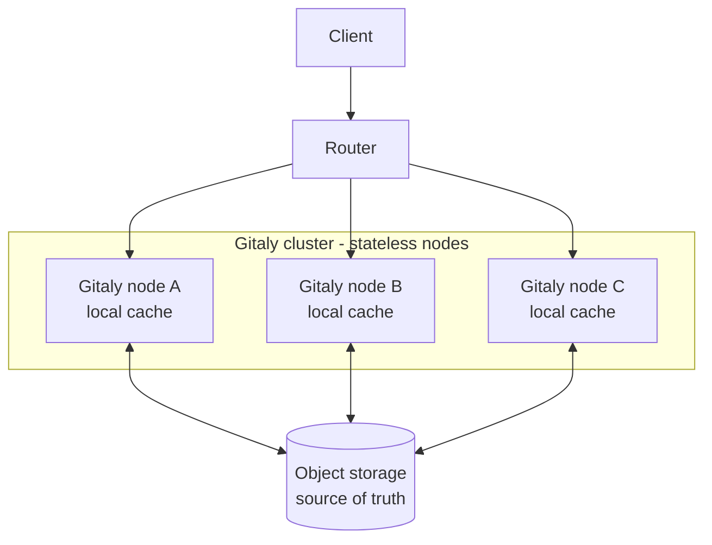
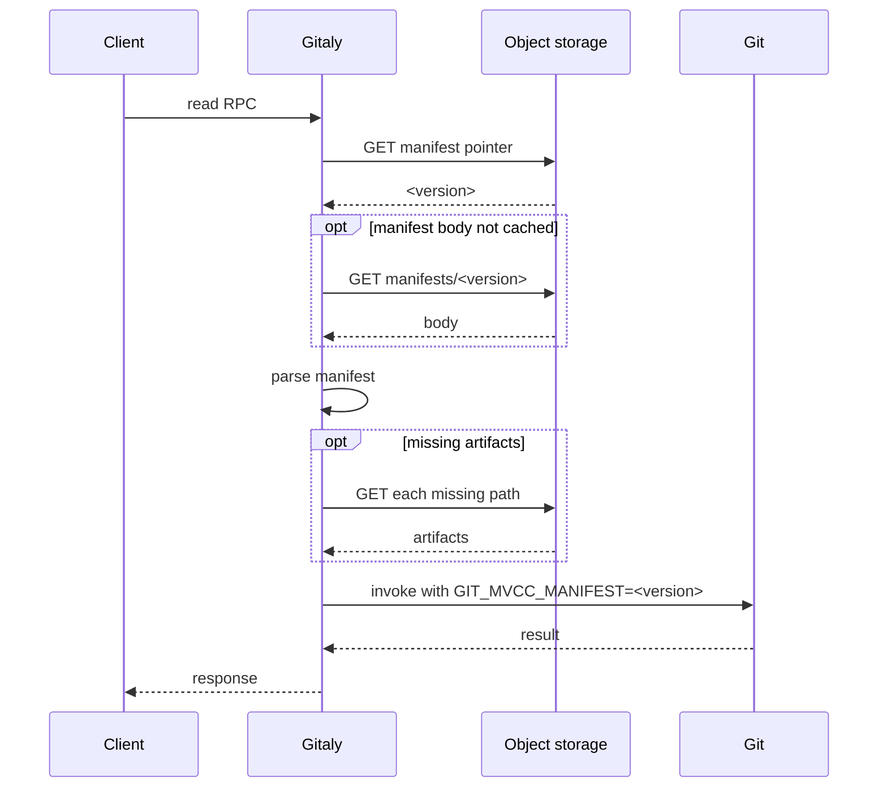
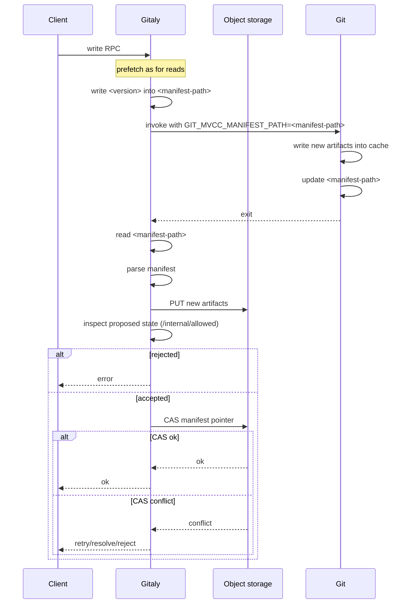
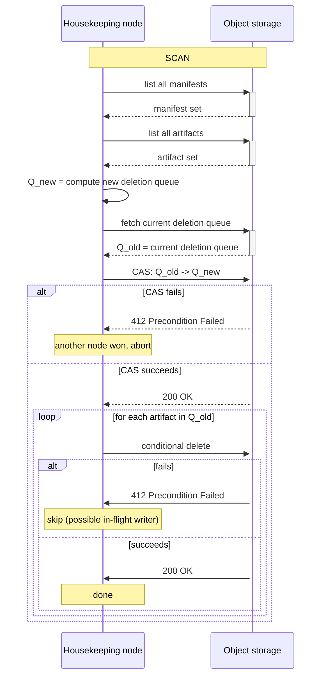
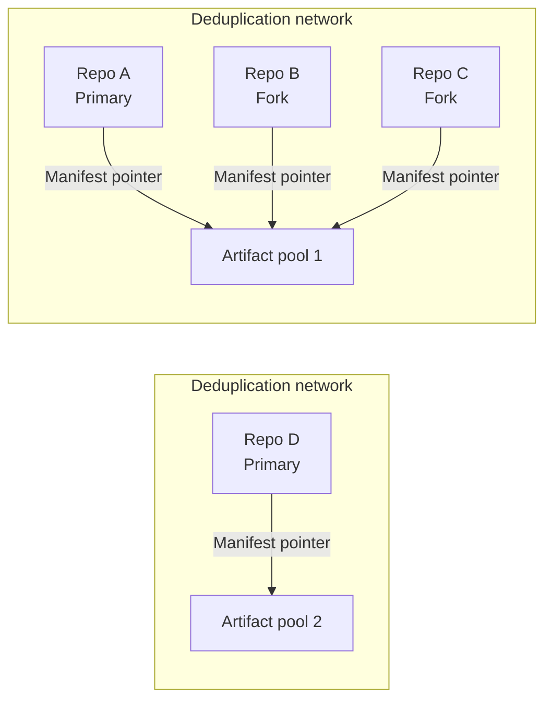



This is a proposal. It is being iterated on and is not yet a committed design.

## Summary

Gitaly stores the authoritative copy of a repository on the serving nodes'
filesystem. Compute and storage are thus tightly coupled with one another, which
makes it hard to scale either of these dimensions.

This blueprint proposes a new architecture that decouples compute from storage
so that both layers can be scaled independently:

- **Storage**: object storage (e.g. AWS S3, Google Cloud Storage, SeaweedFS) is
  the single source of truth for repository data.
- **Compute**: stateless Gitaly nodes execute Git against a local cache of
  artifacts fetched from object storage.

The foundation for this is Git's pluggable object database infrastructure that
we have been upstreaming into Git. With this foundation we are able to take
ownership of the reference and object database formats and create a
custom-tailored storage format that directly serves Gitaly's special needs.

Based on this foundation we propose new multi-version concurrency control (MVCC)
backends for storing references and objects. The repository's persistent state
is a set of immutable, content-addressed artifacts. An immutable manifest tells
us which of these artifacts are currently supposed to be active. The currently
active manifest is referenced by the mutable manifest pointer. This design
allows for consistent reads and atomic updates, and multiple Git processes
running in the same repository can act on different versions thereof.

Gitaly is the orchestrator: it pulls the artifacts named by the active manifest
onto local disk, runs Git against that cache, publishes new artifacts back to
object storage, and advances the pointer with a compare-and-swap (CAS).

As object storage holds the authoritative state, any node can serve any
repository after a cache fill, and nodes can be added on demand and torn down
without data loss. The local disk effectively acts as a cache only. An
orchestrating layer sits in front of the Gitaly nodes and knows to scale the
cluster on demand and route requests efficiently.

## Motivation

A repository's workload is currently bound to a single node: the repository
lives on one node's filesystem and every request for it is served there. The
only way to serve more load for a given repository is to scale up the node's
hardware. Vertical scalability is limited though, and for some of our biggest
nodes we have already reached those limits.

The resource costs of some of the most expensive RPCs we serve thus create an
upper boundary of how much traffic we can serve for any single repository:

- `git-pack-objects` for a `gitlab-org/gitlab` clone holds ~4–6 GB of anonymous
  memory, capping in-flight clones per node regardless of CPU.
- epoll contention, file-descriptor starvation, and CPU on hot repositories
  regularly create bottlenecks in our system.
- Slowloris-style clients hold `git-pack-objects` memory while draining the
  response slowly.
- Stampeding CI fetches against a single repository often bring Gitaly to its
  knees.

In addition to that, we see a significant rise in RPC calls that are caused by
agentic workloads, and we expect this to accelerate going forward. Without
per-repository horizontal scalability, the busiest repositories will exceed what
any single node can serve.

It is thus important that we are able to horizontally scale a repository's
workload across a cluster of nodes. While we tried to address this issue with
read distribution via Praefect, that effort has basically failed to yield a
horizontally scalable cluster due to various issues.

### Goals

- Object storage is the single source of truth for repository data.
- Gitaly nodes are stateless: losing a node (and its disk) causes degraded
  performance (cold cache), but it does not cause data loss or unavailability.
- A repository's read workload scales horizontally across nodes.
- Reads are observed as a consistent, point-in-time snapshot.
- Publishing a write is atomic and isolated, serialized by an atomic
  compare-and-swap on the manifest pointer.
- The overhead of the local working set stays small: a node fetches only those
  artifacts required for a given repository, and prunes old data that is not
  referenced anymore.

### Assumptions

- Most repositories are read-mostly; scaling reads is more urgent than scaling
  writes. We thus focus on read-scaling, but given that the design allows for
  both multiple readers and multiple writers we anticipate that we can also move
  the bottleneck for write throughput.
- Higher throughput is worth some added per-request latency. Caching and
  cache-aware routing minimize the added latency.
- The object store provides atomic single-key writes, read-after-write
  consistency, and conditional writes.

## Proposal

The architecture splits the durable storage tier from the stateless compute tier,
with a routing layer between the client and the nodes.



For each repository, object storage holds every artifact and a mutable manifest
pointer as the single source of truth. A Gitaly node is a stateless compute unit
that runs Git against a local cache directory populated from object storage and
holds no authoritative state of its own. Git itself performs no network I/O: it
only reads and writes local files, and the set of files it sees is dictated by
the active manifest. In front of the nodes a router maps each request to a node,
preferring nodes that already hold a warm cache for the target repository.

## Design and implementation details

### Git MVCC backend

The foundation for the new storage architecture is a custom-tailored storage
backend for references and objects. This backend has the following properties:

- It allows for consistent reads.
- It allows for multiple readers to read the repository at different versions
- It allows for atomic writes.
- It clearly identifies all files required to read the repository at any given
  snapshot.
- It is completely self-describing such that the manifest can be used to
  bootstrap a full Git repository without additional information.
- All of its data is content-addressable so that two concurrent writers cannot
  conflict with one another.

Taken together, these properties allow us to assemble a complete repository
given from a single manifest file. This allows the orchestrator to keep the
authoritative state in object storage, pull only the files required to serve a
specific version of the repository into the local cache, and upload only those
files that are required for a specific other version.

#### Directory layout

All artifacts live under one cache directory. Everything except the single
mutable `manifest` pointer is immutable and content-addressed:

```text
<commondir>/mvcc/
  manifest               mutable pointer (hash of the active manifest)
  manifests/<hash>       immutable manifest bodies
  pack/<hash>.pack       immutable packs
  pack/<hash>.idx
  pack/<hash>.rev
  refs/<hash>.ref        immutable reftables
```

Because everything but the pointer is content-addressed, new files can land
alongside existing ones safely: two writers that produce the same artifact cannot
collide, and files left behind by an aborted write are simply unreferenced and
harmless until reclaimed.

#### Manifest format

A manifest body is a chunk-based binary file, built on the
[`gitformat-chunk`](https://git-scm.com/docs/gitformat-chunk)
framework, that enumerates the artifacts of exactly one consistent snapshot. A
header carries an `MVCC` signature, a format version, the chunk count, the
fixed-width size of a `PATH` record, and the repository's object hash algorithm
(SHA-1 or SHA-256). Three chunks follow:

- `PATH` is a lexicographically sorted list of fixed-width, NUL-terminated
  relative paths (relative to the cache directory). It is the canonical artifact
  list used by the orchestrator to fetch and upload artifacts.
- `OBJS` is a `(start_index, count)` range into `PATH` naming the object-storage
  artifacts.
- `REFS` is a sequence of `PATH` indices in reftable stack order, where later
  tables shadow earlier ones for the same ref.

A trailing 32-byte SHA-256 over the body both provides parse-time corruption
detection and serves as the body's content-addressed name. A consumer that only
needs to enumerate dependencies of any given snapshot only has to read the
`PATH` chunk. Unknown chunk IDs are ignored, so a future artifact kind can be
added without a format-version bump or any Gitaly change.

#### Pinning and pointer resolution

Git resolves the active manifest with a fixed precedence:

1. The `GIT_MVCC_MANIFEST` environment variable allows the caller to pin Git
   to a specific manifest version. This will result in a read-only snapshot,
   and Git will abort when trying to write any artifact.
2. The `GIT_MVCC_MANIFEST_PATH` environment variable allows the caller to
   instruct Git to read and update the manifest at the given path.
3. The repository's own `<commondir>/mvcc/manifest` pointer is used in case no
   other override is active.

Setting `GIT_MVCC_MANIFEST=<sha>` overrides every on-disk pointer for reads and
makes the handle read-only for the lifetime of the process, which is how any
process obtains a consistent point-in-time view.

Isolating writes can be done by exporting `GIT_MVCC_MANIFEST_PATH` and having
multiple different temporary manifests. This environment variable will instruct
Git to use the temporary manifest, which will cause it to use it as the source
of truth for the current manifest version, and will publish the new manifest
version to that path when writing new data. This allows Gitaly to isolate
multiple writers from one another so that unpublished state will not be visible
to other in-flight processes.

Hooks executed by Git will have their `GIT_MVCC_MANIFEST` environment set so
that they see the same manifest version as the parent process. This also ensures
that child processes cannot write data.

Note that eventually, once the canonical source of truth sits in object storage,
Gitaly will never use `<commondir>/mvcc/manifest` anymore. Instead, it is
expected to always resolve the version with a GET request and then export it via
either `GIT_MVCC_MANIFEST` or by writing it into `GIT_MVCC_MANIFEST_PATH`.

When neither `GIT_MVCC_MANIFEST` nor `GIT_MVCC_MANIFEST_PATH` are set, then Git
uses the pointer in `<commondir>/mvcc/manifest`.

#### Scope

The backend performs no network I/O of its own: every object named by the active
manifest must be present locally, and a missing artifact is a hard error rather
than a trigger to fetch. All communication with the object storage is the
orchestrator's responsibility, described next.

### Object storage as source of truth

For each repository, object storage holds the full artifact set together with a
durable manifest-pointer key. Gitaly resolves this durable pointer at the start
of every RPC and never treats a local cache pointer as authoritative.

There are a couple of requirements against the object storage provider:

- It must support single-key PUTs with read-after-write consistency.
- It must support conditional updates of the pointer key.
- It must support conditional deletes to make housekeeping safe.
- It must support updating ETags of objects.

It is the orchestrator's responsibility to fetch all dependencies of a resolved
manifest before spawning Git. Furthermore, it is the orchestrator's
responsibility to upload all dependencies required by a new manifest that is
about to be activated.

### Read RPC lifecycle

Read RPCs such as `GetCommit` or `FindRefs` need a consistent snapshot but
produce no new state.



Gitaly enumerates dependencies required for the MVCC snapshot through the `PATH`
chunk alone and does not have to interpret any other chunks. Prefetching is
idempotent because artifacts are immutable and content-addressed. Pinning with
`GIT_MVCC_MANIFEST` ensures that every Git process spawned within a single RPC
observes the same state even while other writers advance the repository. No
external pointer file is created, and reads never advance the cache pointer.

{}
It is important that the manifest pointer is resolved to a specific version
exactly once for any RPC call and that all Git processes inherit that exact
version so that it is not possible to observe torn reads when there are
concurrent writers.
{}

Note that fetching missing artifacts can potentially take a long time in case
the cache has not been warmed yet. This will be mitigated by two mechanisms:

- The routing layer needs to ensure that requests are routed to nodes that have
  a warm cache.
- The repository housekeeping needs to ensure that we don't unnecessarily
  rewrite artifacts so that the amount of changing data has an upper bound.

### Write RPC lifecycle

Write RPCs such as `UserCommitFiles` or `PostReceivePack` produce new state that
must become durable.



Gitaly would first resolve the manifest in the same way that it did for
read-only RPCs. Instead of pinning the version via `GIT_MVCC_MANIFEST` though,
it writes the resolved manifest version into a temporary manifest path and
invokes Git with `GIT_MVCC_MANIFEST_PATH` so that all updates are self-contained
and don't impact concurrent writes.

When Git has finished, Gitaly may have to inspect the new state. Part of the
inspection may be to reach out to Rails' `/internal/allowed` checks, which would
then perform a set of reads against the new state. To allow these reads to be
distributed across nodes, Gitaly would have to upload artifacts to object
storage already before it updates the canonical and persistent manifest pointer.
Subsequent checks for this version should propagate `GIT_MVCC_MANIFEST` to point
to the proposed new version.

Note that there is a tradeoff at play here:

- The access checks can be expensive by themselves, so distributing them across
  nodes ensures potentially-higher throughput.
- Distributing reads will necessarily require the other nodes to fetch the new
  artifacts.

Potentially, we will want to restrict read distribution during the access
checks by pinning subsequent reads to the writing node.

{}
Same as with read-only RPCs, the manifest version shall be resolved exactly
once. From thereon, the temporary manifest shall be the single source of truth
for the manifest version for all subsequent Git processes in the mutating RPC.

Furthermore, the canonical manifest pointer must be updated _at most once_.
Otherwise, the mutating RPC may result in torn writes.
{}

When the new state was accepted and the artifacts have been uploaded, then
Gitaly performs a compare-and-swap operation of the manifest pointer. As there
can be multiple writers, this operation may fail due to a conflict. If so, there
are two scenarios:

- There can be a logical conflict because one reference is being updated to
  different versions. This will result in a reject and no update shall happen.
- There can be a conflict only in nature because the manifest pointer was
  changed, but none of the updates are conflicting. In this case, Gitaly will
  try to resolve the conflict by doing a three-way merge of the changed
  references.

The three-way merge can be performed by taking the three manifests that are
relevant:

- Base, which is the one that Gitaly has written into the temporary manifest
  pointer initially.
- Ours, which is the proposed update computed by the mutating RPC and that can
  be derived by reading the temporary manifest pointer once all writing Git
  commands have finished.
- Theirs, which is the current version that the canonical manifest pointer
  points to and that has been advanced by a concurrent writer.

The merge then reads the references that have changed between these three
different versions and merges them. If any reference has received a conflicting
update then we have a logical conflict and reject the write. Otherwise, if no
reference has received multiple writes we can accept it.

Note that there is no need for a three-way merge for objects. Instead, we can
treat them as conflict-free and always take the union of them.

### Repository housekeeping

The design will result in new packfiles and reftables on every single write. To
limit the number of files referenced by a manifest, ensure fast data lookup and
have good opportunities for object deltification we have to perform regular
compaction.

This compaction needs to balance two needs:

- We want to have as few files as possible to retain fast lookups.
- We want to avoid rewriting files regularly to avoid frequent cache misses on
  other nodes.

This need is balanced by performing geometric compaction with a maximum size for
packfiles. All files smaller than a given size threshold need to form a
geometric sequence regarding their size. If that property does not hold, then we
repack as many files as possible to restore it. Once a file reaches the size
threshold we stop repacking it.

The frozen packfiles also ensure an important property: assuming that the cache
of the repository has been warmed with manifest A and we do a snapshotted read
with manifest B, where B is older than A, we know that:

- Any frozen pack that exists in B also exists in A.
- We know that all non-frozen packs form a geometric sequence.
- The geometric sequence can have a size of at most $\frac{T r}{r - 1}$, where
  $T$ is the threshold and $r$ is the ratio of the geometric sequence.

By scaling the parameters we can thus limit the upper bound of data we have to
fetch. For a threshold of 1GB and a ratio of 2, the upper bound of data we would
have to fetch is 2GB.

Note that this assumes that we don't delete unreachable objects by default
anymore. This is expected to be acceptable for most repositories.

### Garbage Collection

The MVCC backend creates new artifacts on every modification. Consequently,
unreferenced artifacts accumulate both on the local disk and in object storage
over time. To keep storage growth under control we thus have to regularly clean
up both of these.

As the on-node data serves as a cache, only, it is safe to eagerly perform local
cleanups. The cleanup logic for object storage needs to be implemented in a
race-free way with concurrent readers and writers.

There are two different kinds of garbage collection in this system:

- Pruning of old manifests should be configurable. This allows us to retain
  for example several point-in-time restores for a specific period in time and
  should thus be subject to a specific policy.
- Pruning of unreferenced artifacts does not have to be policy-based.

The following only considers race-free deletion of unreferenced artifacts. To
achieve this, we use a two-generation deletion queue.



When a node decides to perform pruning, it will scan all the available manifest
files and list all existing artifacts. The candidates that are eligible for
pruning are then computed by taking the list of existing artifacts and removing
the list of artifacts referenced by any manifest. Furthermore, the mtime of each
artifact is checked to be smaller than the current time minus a given threshold.
The result is the set of candidates that are eligible for pruning.

The node now creates the new deletion queue from that set of candidates. The
queue contains:

- The names of the artifacts that shall be deleted.
- The ETag for each of these artifacts that can be used for a conditional delete.

The node downloads the current deletion queue and performs a compare-and-swap
operation to update it with the new list of candidates. If successful, the node
will now verify the list of pending deletions from the downloaded queue. For
each entry, it checks performs a conditional delete of that artifact using the
ETag stored in the deletion queue.

A writer that starts to reference an artifact that its manifest was not
previously referencing, but that already exists in object storage, must update
the ETag of the object in object storage to ensure that it cannot be
concurrently deleted in case no other manifest references it. If updating the
ETag fails because of a concurrent deletion, then the writer will have to
re-upload the artifact.

A housekeeping run that crashes before, during or after the swap is harmless
because a future re-run will again derive the set of candidates that shall be
pruned.

### Deduplication networks

When a repository is forked, a new repository is created that starts off as an
identical copy of the upstream repository. Even if the fork diverges from the
upstream, there is typically a common base history that remains shared between
the repositories. Knowing this relationship, it is desirable to deduplicate
objects present in both the fork and upstream repository to reduce the overall
storage footprint. This is crucial for heavy fork-based workflows often seen in
agentic workloads.

In the current architecture, Gitaly achieves objects deduplication via object
pool repositories. An object pool is a separate Git repository that contains the
set of objects intended to be shared with other related repositories.
Repositories that depend on these shared objects link to the object pool via the
Git alternates mechanism.

With the MVCC design, each Git repository has a manifest pointer that defines
current MVCC artifacts (reftables, packfiles, and manifest) in use. The manifest
specified by the repository's manifest pointer effectively allows Git to
construct an isolated snapshot/view of the repository. By associating
repositories with related histories (the upstream and its forks), it becomes
possible to deduplicate MVCC artifacts by using a shared pool of MVCC artifacts.
This works because MVCC artifacts are content addressable and immutable. A set
of repositories that share an MVCC artifact pool is referred to as a
deduplication network.



Note that creating a new repository sets up the repo in a new deduplication
network while creating a fork repository sets up the repo to join an existing
deduplication network. For this to work, an individual repository needs to know
the MVCC artifact pool it fetches from and also its manifest pointer. This
information can be stored as a key-value mapping between the repository key and
its pool/manifest location. In a clustered setup, repositories using the same
artifact pool will likely want to be routed to the same Gitaly node to enable
artifact deduplication in the local cache and reduce cold cache hits.

For deduplication at the artifact level to be effective, it requires artifacts
to be considered stable at a certain point. For example, repository housekeeping
may rewrite MVCC artifacts to be more compact and consequently produce new
distinct artifacts that are no longer common across repositories in the
deduplication network. For packfile artifacts, repacks can be prevented by
setting an upper limit on its size. This enables "large" packfiles to remain
consistent across repository writes and reused by repositories in the
deduplication network. This does mean packfile artifacts under the size limit
are unlikely to remain deduplicated as repository histories evolve. Also, the
set of packfile artifacts that can be deduplicated are determined once at the
time-of-fork.

Note that while reftable and manifest artifacts in theory can be deduplicated
since they also exist in the same pool, in practice these artifacts are unlikely
remain stable as repository histories evolve and thus not commonly shared
amongst repositories in the deduplication network.

### Routing and clustering

WIP

## Migration

Landing the whole project will be a significant effort. To ensure that we can
test different properties of the system as fast as possible we will split up
this project into different stages:

1. MVCC references migration
2. MVCC objects migration
3. Object storage migration
4. Clustering

Each of these stages rolls out a smaller part of the overall design, where most
stages already provide value to the customer. This ensures a fast time to
production, allows us to surface design issues early on and thus reduces the
risk of the project failing.

### Stage 1: MVCC references migration

The first stage will roll out the MVCC backend for references, only. This
requires the MVCC reference backend in Git and the logic to handle reads and
writes on the Gitaly side.

The benefit of separating this phase from the objects migration is that we
already have a migration path and the reference backend is already fully
pluggable in Git. So we can roll this out while the infrastructure for pluggable
object databases is still being finalized, and we can already start to verify
our handling of the MVCC logic in Gitaly.

This phase provides the benefit that we're migrating to reftables as backend for
storing Git's references, which solve a long-standing scalability issue when
deleting references. Besides that though, the benefit to our customers will be
limited. As such, we expect that we will only roll this out to repositories in
our staging environment and to a selection of production-facing repositories.

### Stage 2: MVCC objects migration

The second stage will roll out the MVCC backend for objects so that both
references and objects will be backed by MVCC. This requires the pluggable
object interfaces to be ready for Gitaly's needs, and it requires the MVCC
object backend in Git. The logic to handle reads and writes on the Gitaly side
will already have been implemented in the first stage.

With this stage, repositories will have the exact layout required for object
storage, but all data will still sit on the local disk. It concludes all changes
required on the Git side.

This phase provides the following benefits:

- All reads are fully consistent and will not be impacted by concurrent writers.
- Writers are atomic.
- We have the ability to do snapshotted reads at specific points in time.

This stage is a prerequisite for a smooth migration to object storage. It is
thus anticipated that we will eventually migrate all repositories to this
backend.

Furthermore, this stage will be the final stage for non-enterprise customers.

### Stage 3: Object storage migration

The third stage will migrate the source of truth for repository data from the
local disk to object storage. Essentially, this means that every repository will
be hosted by a cluster of one Gitaly node.

This phase provides the following benefits:

- Globally consistent backups can now be performed via object storage.
- We can start to prune repository data from local disks and thus reduce storage
  costs.
- We can trivially serve every repository by any arbitrary Gitaly node because
  the single source of truth sits in object storage.

It is expected that we will migrate all of GitLab.com to this stage. This
migration will only be performed for enterprise customers.

### Stage 4: Clustering

The fourth stage will introduce cluster management capabilities into Gitaly.
This includes the ability to have intelligent routing and to automatically scale
the cluster up or down depending on the load.

This phase provides the following benefits:

- We can dynamically scale up or down based on the load for a specific repository.

## Alternative Solutions

### Praefect

Praefect already provides reads distribution. Unfortunately though, Praefect has
proven hard to operate in practice:

- The use of Postgres results in multiple sources of truth that are a
  challenge to back up.
- Transactional voting has proven to be unreliable in practice.
- Writes need to happen on all nodes at once. So as the number that serve a
  specific repository grow, it becomes more likely that a subset of nodes will
  fail.
- The failure mode often leads to replication runs that are never able to
  catch up with concurrent writes. The consequence is that reads distribution
  is ineffective.

This solution is thus treated as a failed design.

### Networked filesystem

Before we used Praefect we used networked filesystems to distribute data across
multiple Gitaly nodes. Unfortunately though, the increased access latency has
proven to be a challenge. Furthermore, networked filesystems tend to exhibit
edge cases that are not POSIX-compliant and that lead to hard-to-debug problems.

### Storing Git data in a database

An alternative that was considered is to store Git references and objects in a
proper database. This would have the benefit that the data is trivially
accessible by any client.

Unfortunately though, many of Git's operations require us to read the whole
object graph and all references, and reading those individually would be
unworkable when one considers the network roundtrip times.

A potential path forward here would be to introduce heavy caching layers. But
given the time criticality of the whole project this idea was discarded for now
as it has too many unknowns.

## Risks and open questions

The new system does not come without its own risks:

- The added-latency-for-throughput tradeoff may prove unacceptable for some
  scenarios. A potential mitigation strategy is to cache resolved manifest
  pointers for a certain timeframe.
- Cold-cache fill latency for repositories with many or large files is a
  concern. A potential mitigation strategy is eager cache warming.
- Compaction cadence and granularity must be balanced against
  cache-invalidation cost.
- Rate limiting for reading from and writing into object storage may create a
  bottleneck.

These risks need to be addressed via early benchmarking.

## Further reading

- Epic: gitlab-org&21711+
- Git MVCC backend PoC: gitlab-org/git!551+
- Gitaly integration PoC: gitlab-org/gitaly!8812+
- Routing mechanism: gitlab-org/gitaly#7214+
- Gitaly clustering and routing: gitlab-org&22205+
- Pooled MVCC artifacts: gitlab-org/gitaly#7250+
- Garbage Collection: gitlab-org/gitaly#7249+
