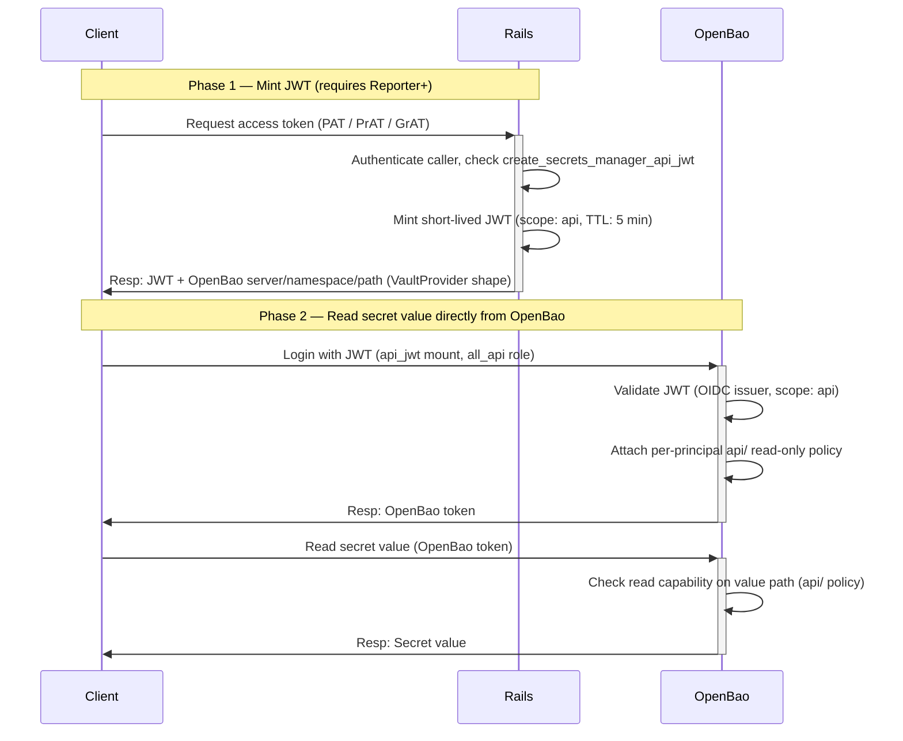

## Context

GitLab Secrets Manager (SM) originally supported secret value access through
one path only: **CI/CD pipelines**, via a Runner JWT issued by GitLab Rails
and validated by OpenBao's `pipeline_jwt` mount.

Non-CI workloads such as Kubernetes runtime pods (for example, via the
External Secrets Operator), Terraform/OpenTofu data sources, or
service-account automation scripts had no way to read secret values without
being bound to a GitLab pipeline and without GitLab-specific SDKs.

This gap was surfaced by beta customers and discussed in
[gitlab-org/gitlab#594090](https://gitlab.com/gitlab-org/gitlab/-/work_items/594090).
The design was agreed in
[that discussion thread](https://gitlab.com/gitlab-org/gitlab/-/work_items/594090#note_3391198730)
and implemented in
[!240364](https://gitlab.com/gitlab-org/gitlab/-/merge_requests/240364) and
[!241443](https://gitlab.com/gitlab-org/gitlab/-/merge_requests/241443).

## Decision

### New `api_jwt` OpenBao mount

Following the existing one-mount-per-auth-type pattern (`pipeline_jwt` for
runners, `user_jwt` for the UI), a new dedicated `api_jwt` mount is added with
its own CEL role (`all_api`) for non-CI API access. The existing mounts are
untouched.

Rationale for a new mount rather than a new role on `user_jwt`:

- **Distinct audit identity.** OpenBao audit logs can differentiate API access
  from UI access by mount and role. Reusing `user_jwt` would blur them.
- **Independent dials.** Token TTL, bound audiences, and policy assignment are
  tuned per mount and role without touching the UI path.
- **Consistent with the existing pattern.** Pipeline and user already have
  their own mounts; API access gets its own.

### New Rails endpoint

A new REST endpoint mints a short-lived JWT for the caller's project or group
and returns the OpenBao connection details:

```plaintext
POST /api/v4/projects/:id/secrets_manager/access_token
POST /api/v4/groups/:id/secrets_manager/access_token
```

The response is shaped like `external-secrets.io/v1.VaultProvider` so that
clients (ESO, Terraform, scripts) can consume it with standard Vault-compatible
tooling. `expires_at` is included at the top level so clients can manage token
refresh without parsing the JWT:

```json
{
  "expires_at": "2026-06-12T10:35:00Z",
  "provider": {
    "vault": {
      "server": "https://openbao.example.com",
      "namespace": "org_5/ns_42/project_99",
      "path": "secrets/kv",
      "version": "v2",
      "auth": {
        "jwt": {
          "path": "api_jwt",
          "role": "all_api",
          "token": "<encoded JWT>"
        }
      }
    }
  }
}
```

The endpoint **mints a token; it never reads a secret value**. The value read
happens client-side, directly against OpenBao.

### JWT scope and claims

The minted JWT carries:

- `secrets_manager_scope: "api"` — a new scope value extending
  [ADR-012](012_jwt_separation.md), which defined `privileged`, `pipeline`,
  and `user`. The `api` scope is validated by the `api_jwt` CEL role and
  rejected by all other mounts.
- `auth_via` claim — records the token type used to call the endpoint
  (`personal_access_token`, `resource_access_token`, `service_account`,
  `oauth`, or `session`) for audit forensics.
- TTL: 5 minutes.

### New `read_value` secret permission

Prior to this change, the per-principal secret permissions were `read`
(metadata only), `write`, and `delete`. None granted read on the secret value
path, so values were not readable outside the CI flow.

A new explicit `read_value` permission is added:

| Permission | Action | OpenBao capability | Path |
|---|---|---|---|
| Read metadata (renamed from "Read") | `read_metadata` | `read` | metadata path |
| Write | `write` | `create` + `update` | value path + metadata path |
| Delete | `delete` | `delete` | value path + metadata path |
| **Read value (new)** | `read_value` | `read` on value path + `list` on metadata path | value path + metadata path |

The existing `read` action is kept as a deprecated alias of `read_metadata`
(accepted on input, still emitted on readback) so the frontend can migrate
independently. No data migration is required: actions are derived from OpenBao
capabilities on readback.

`read_value` is additive. The backend does not enforce a dependency on
`read_metadata`; `read_value` is valid on its own. The `api/` policy
automatically grants `list` on the metadata path for discovery when
`read_value` is granted. Requiring `read_metadata` as a prerequisite is a
UI-level rule deferred to [gitlab-org/gitlab#602726](https://gitlab.com/gitlab-org/gitlab/-/work_items/602726).
Existing grants are unchanged and gain nothing until an Owner explicitly opts in.

### Two-policy structure per principal

To keep value reads off the UI mount, each principal gets two OpenBao policies:

- A **management policy** (under `users/`) used by the existing `user_jwt`
  mount: metadata read, write, delete. It never grants read on the value path,
  so the UI flow still cannot read values.
- A **dedicated read-only policy** (under `api/`) used by the new `api_jwt`
  mount: read on the value path only, written when `read_value` is granted and
  removed when it is not.

Each mount's CEL role attaches its own policy set. An API token can therefore
read values but never write, regardless of the principal's other grants.

### Authorization model

Access is enforced in two independent layers:

1. **Minting a token** is gated by `create_secrets_manager_api_jwt`, granted
   to Reporter and above via the role permission YAML (`config/authz/roles/reporter.yml`),
   and conditioned on the secrets manager being enabled for the namespace.
   Token scoping (which namespaces a granular token may mint for) is enforced
   by the `route_setting :authorization` declaration on the endpoint.
2. **Reading a secret value** is gated separately in OpenBao by the `read`
   capability on the value path, written into the per-principal `api/` policy
   by Rails when `read_value` is granted and removed when it is not. A minted
   JWT whose principal has no `read_value` grant will have no `read` capability
   on the value path in their `api/` policy, and OpenBao will deny every read
   attempt.

Reporter access to minting is intentional: `read_value` can be granted to any
Reporter+ member, so the mint must be open to the same set of people. Checking
"has `read_value` somewhere" at mint time is not feasible because `read_value`
lives in OpenBao, not the GitLab database.

Expected impact by membership level:

- **Non-member**: cannot mint a token. Endpoint returns 404 (resource hidden).
- **Guest / Planner**: cannot mint a token. Endpoint returns 403 (member but
  permission not granted).
- **Reporter and above**: can mint a token. Can read values only for secrets
  where they (or a role/group/member-role they belong to) were explicitly
  granted `read_value`.

### Accepted token types

The endpoint accepts any credential that resolves to a `User` row via the
Rails auth pipeline: PAT, service-account PAT, standalone project access token
(PrAT), standalone group access token (GrAT), OAuth tokens, and browser
sessions. CI job tokens are explicitly excluded — CI workloads already have
the `pipeline_jwt` path.

Session and OAuth are currently accepted because the endpoint is a standard
Rails API route. Restricting to token-only is an open question tied to whether
we ever make OpenBao reachable directly from browsers: if we do, a browser
session minting a JWT and reading values directly from OpenBao would keep
values out of Rails the same way the non-CI flow does. No restriction is
planned for now.

A dedicated token scope (`read_secrets_via_openbao`) is deferred to GA maturity,
coordinated with `~group::authorization`. For beta, the existing `api` scope
is used.

### Provisioning scope

The `api_jwt` mount and `all_api` CEL role are provisioned on **new** SM
enrollments as part of this change. Backfill of the mount and role into
already-enrolled namespaces is tracked separately in
[gitlab-org/gitlab#602549](https://gitlab.com/gitlab-org/gitlab/-/work_items/602549).

## Request Flow

### Non-CI Client Secret Access

The flow has two phases: the client first calls Rails to mint a short-lived JWT
and receive OpenBao connection details, then uses that JWT directly against
OpenBao to read secret values. Rails is never in the secret-value path.



## Consequences

### Benefits

- Non-CI workloads (ESO, Terraform, scripts) can read GitLab-managed secrets
  using standard Vault-compatible tooling and a GitLab token they already have.
- Reads are decoupled from Rails: secret availability scales with OpenBao
  independently of GitLab Rails.
- The `api_jwt` mount provides a distinct audit identity in OpenBao logs,
  separating API access from pipeline and UI access.
- Value access is opt-in per principal via `read_value`, secure by default.
  Membership alone does not expose values.
- The response shape (`external-secrets.io/v1.VaultProvider`) maps directly
  onto ESO's HashiCorp Vault provider config, minimising customer integration
  effort.

### Trade-offs and risks

- **Stored long-lived credential at rest.** The ESO pattern requires a
  service-account token stored in a Kubernetes Secret (etcd). This is the
  primary new risk. Mitigations: use a service-account token (not a personal
  PAT), tighten K8s RBAC on the token Secret, encrypt etcd at rest, and rotate
  the token on a schedule. Workload identity federation
  ([gitlab-org/gitlab#601894](https://gitlab.com/gitlab-org/gitlab/-/work_items/601894))
  is the longer-term direction that removes the stored credential entirely.
- **JWT TTL is a fulfillment dial.** Once a JWT is minted, the caller can keep
  reading until it expires. Enforcement granularity is bounded by JWT TTL
  (proposed 5 minutes). Usage quota enforcement happens at issuance time;
  read-level tracking strategy is deferred to the broader fulfillment thread
  ([gitlab-org/gitlab#600967](https://gitlab.com/gitlab-org/gitlab/-/work_items/600967)).
- **JWTs are stateless and cannot be revoked mid-life.** A stolen JWT grants
  the value reads the principal was explicitly granted, scoped to the issuing
  project or group, for at most the JWT TTL.
- **Backfill required for existing namespaces.** The `api_jwt` mount is only
  provisioned on new enrollments. Existing SM-enabled namespaces require a
  separate backfill operation ([gitlab-org/gitlab#602549](https://gitlab.com/gitlab-org/gitlab/-/work_items/602549)).
- **`read_value` UI not yet available.** The GraphQL exposure and UI toggle for
  granting `read_value` ship separately
  ([gitlab-org/gitlab#602726](https://gitlab.com/gitlab-org/gitlab/-/work_items/602726)).
  Until that ships, `read_value` is grantable via the API only.

## Alternatives considered

### Rails proxy that returns secret values

Rejected. Secret values would flow through Rails (memory, logs, error
tracking, APM, request traces). The JWT-minting shape keeps Rails out of the
secret-value path entirely. Every read would also couple to Rails availability
and scale, whereas JWT issuance is less frequent and the client can cache the
token for its TTL.

### Rails does the JWT-to-Vault-token exchange and returns a Vault token

Rejected. Adds a Rails-to-OpenBao dependency at issuance time. Also removes
the high-fanout optimisation that explicit JWT login gives ESO (one login,
many reads).

### New role on the existing `user_jwt` mount

Rejected. Would blur audit identity between UI and API access, and would
couple the TTL and policy configuration of the two access patterns.

### GraphQL endpoint instead of REST

Not chosen for the initial implementation. The primary consumers (ESO,
Terraform provider, `vault` CLI, curl scripts) all expect REST. A GraphQL
field remains a possible future addition.

## References

- Issue: [gitlab-org/gitlab#594090](https://gitlab.com/gitlab-org/gitlab/-/work_items/594090)
- Design discussion: [note_3391198730](https://gitlab.com/gitlab-org/gitlab/-/work_items/594090#note_3391198730)
- Implementation MR: [gitlab-org/gitlab!240364](https://gitlab.com/gitlab-org/gitlab/-/merge_requests/240364)
- GraphQL `READ_VALUE` enum: [gitlab-org/gitlab!241443](https://gitlab.com/gitlab-org/gitlab/-/merge_requests/241443)
- `read_value` permission UI: [gitlab-org/gitlab#602726](https://gitlab.com/gitlab-org/gitlab/-/work_items/602726)
- Backfill existing namespaces: [gitlab-org/gitlab#602549](https://gitlab.com/gitlab-org/gitlab/-/work_items/602549)
- QA spec: [gitlab-org/gitlab#602550](https://gitlab.com/gitlab-org/gitlab/-/work_items/602550)
- Workload identity federation: [gitlab-org/gitlab#601894](https://gitlab.com/gitlab-org/gitlab/-/work_items/601894)
- Usage tracking and billing: [gitlab-org/gitlab#600967](https://gitlab.com/gitlab-org/gitlab/-/work_items/600967)
- Related ADR: [ADR-012: Separate JWT Domains](012_jwt_separation.md)
