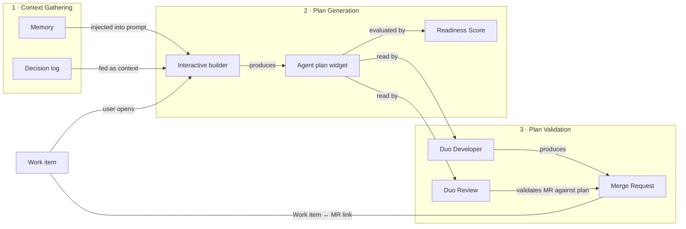

<!-- Design Documents often contain forward-looking statements -->
<!-- vale gitlab.FutureTense = NO -->



## Summary

Spec-Driven Development (SDD) is fundamentally about capturing intent and using it to generate outputs through Agentic work. Today, context needed to execute work is scattered across issues, comments, design files, code, and people's heads. Agents that try to act on a work item without structured input produce inconsistent results because they lack the why, how, and what.

SDD solves this by introducing a structured planning layer on GitLab work items. An **Agent plan** is collaboratively built by humans and AI agents, enriched with project context, and then consumed downstream by execution agents (Duo Developer) and validation agents (Duo Review).

We are building this feature with the mindset that any work done should work for Agents and Human both. In practice what this means is that SDD is a way of working,
and we are seeing this rise in popularity with Agents. But the underlying concept is very human: documentation-centric way of developping, accelerated with Agents.

For product context see the [parent epic](https://gitlab.com/groups/gitlab-org/-/work_items/21218) and [wiki](https://gitlab.com/groups/gitlab-org/plan-stage/-/wikis/Spec-driven-development-(SDD)).

## End-to-end flow

## Three layers to build

The architecture breaks down into three layers. Each layer has its own problems to solve and its own set of subpages with detailed designs.

### 1. Context Gathering

Before a plan can be generated, the agent needs context: project conventions, past decisions, architectural patterns, related work items, and team preferences. The challenge is figuring out where to store these layers of context, how to keep them current, and how to inject the right slices at the right time.

| Component | Description | Subpage |
| ----------- | ------------- | --------- |
| Memory | Long-lived project and team context stored in git, with multiple layers (project, group, user) | [Memory and context injection](memory.md) |
| Decision log | Structured decisions (pending and resolved) captured on the work item, fed into plan generation sessions | [Decision log](decision_log.md) |

### 2. Plan Generation

The Agent plan is the central artifact. Users talk with agents through the Interactive builder to iteratively shape a plan that captures the Why, How, What, and a clear list of pending questions and steps. Plans get refined over time and multiple stakeholders can contribute, so we need versioning, an auditing trail, and a lightweight review flow.

| Component | Description | Subpage |
| ----------- | ------------- | --------- |
| Agent plan widget | Markdown-based work item widget that stores the plan | [Agent plan](work_plan.md) |
| Interactive builder | Reusable Duo Chat + live preview UI for iterating on LLM output | [Interactive builder](interactive_builder.md) |
| Plan readiness scoring | Lightweight quality gate that signals whether a plan is ready for agent execution | [Scoring](scoring.md) |

### 3. Plan Validation

Once a plan is approved, it needs to carry weight. Downstream agents read the plan, execute against it, and validate that the resulting merge request matches the stated intent. This requires a strong link between work items and MRs.

| Component | Description | Subpage |
| ----------- | ------------- | --------- |
| Work item ↔ MR relationship | First-class bidirectional link so downstream agents can find and validate against the plan | [Work item to MR relationship](wi_mr_relationship.md) |
| Downstream consumers | How Duo Developer and Duo Review read and use the plan | [Downstream consumers](downstream_consumers.md) |

## Decisions

| Date | Decision | Who |
| ------ | ---------- | ----- |
| 2026-03-30 | Short-lived artifact is an **Agent plan** on the work item (not standalone, supports all work item types). | Workshop |
| 2026-03-31 | Output is **Markdown** through work item templates. | @fredericcaplette |
| 2026-03-31 | **Approval workflow out of scope** for current phase. | @izzychu, @shekharpatnaik |
| 2026-04-09 | Use **sync Duo Chat** for AI interactions on work items. | @vanessaotto, @fredericcaplette |
| 2026-04-09 | **Markdown over YAML** for human readability. | @fredericcaplette, @vanessaotto, @timzallmann |

## Constraints

- Agent sessions are single-user (async collaboration only through work item comments)
- Work item approvals do not exist on the platform
- MR-to-work-item link is the only bridge for Duo Review to access the plan
- IDE interactive builder out of scope for v1
- Long-lived Spec storage unresolved

## Timeline

| Workstream | Target | Confidence |
|------------|--------|------------|
| 0 - [Agent plan widget](https://gitlab.com/groups/gitlab-org/-/work_items/21511) | 2026-06-30 | Medium |
| 0.5 - [Plan scoring](https://gitlab.com/gitlab-org/gitlab/-/work_items/596916) | TBD | Not started |
| 1 - [MR enforcement](https://gitlab.com/groups/gitlab-org/-/work_items/21514) | TBD | Not started |
| 2 - [Memory loop](https://gitlab.com/groups/gitlab-org/-/work_items/21512) | TBD | Not started |
| 3 - [Decision log](https://gitlab.com/groups/gitlab-org/-/work_items/21552) | 2026-06-30 | Medium |
| [Interactive builder](https://gitlab.com/groups/gitlab-org/-/work_items/21653) | TBD | Medium |

Release stages: Core team (now) -> Internal preview (2026-05-30) -> Customer preview (TBD) -> GA (TBD).

## Links

- [Parent Epic](https://gitlab.com/groups/gitlab-org/-/work_items/21218)
- [Wiki SSoT](https://gitlab.com/groups/gitlab-org/plan-stage/-/wikis/Spec-driven-development-(SDD))
- [AI Panel architecture](../ai_panel/_index.md)
- [Design Issue](https://gitlab.com/gitlab-org/gitlab/-/work_items/592316)
- [Engineering Spike](https://gitlab.com/gitlab-org/gitlab/-/work_items/592314)
- [Workshop notes](https://docs.google.com/document/d/1zFs7ziXNBrY7rYvXhhWZvyavWT-j_DAqNwmxbMMTa4o/edit?tab=t.0)
