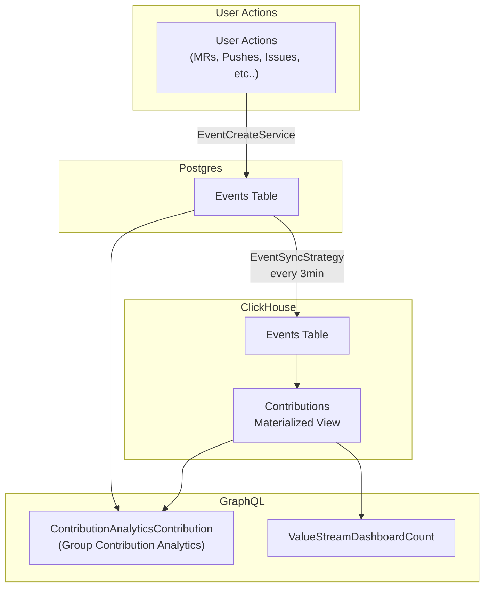
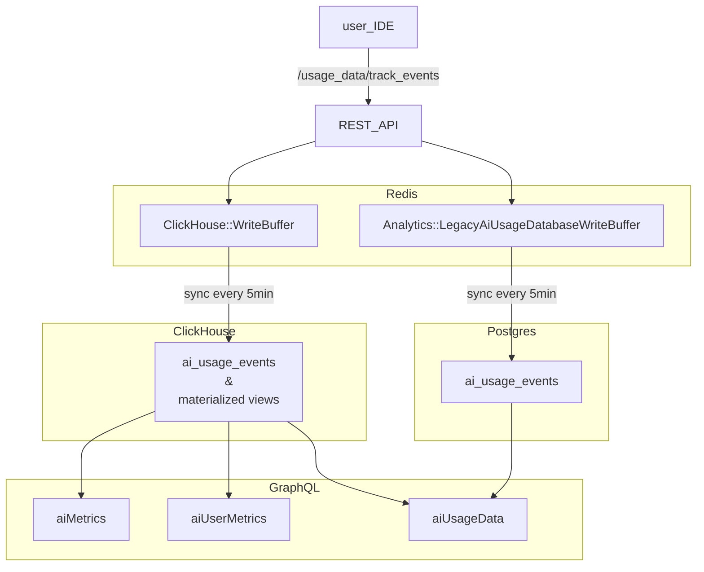

## Analytics:Optimize

**[Optimize Group Direction and Roadmap](https://gitlab.com/groups/gitlab-org/analytics-section/optimize-group/-/wikis/Optimize-Group-Direction-and-Roadmap)**

### How we work

- In accordance with our [GitLab values](/handbook/values/).
- Transparently: nearly everything is public, we record meetings whenever possible.
- We get a chance to work on the things we want to work on.
- Everyone can contribute; no silos.
  - The goal is to have product give engineering and design the opportunity to be involved with direction and issue definition from the very beginning.
- You can reach out to the team on slack at: [#g_analytics_optimize](https://gitlab.enterprise.slack.com/archives/CJZR6KPB4)
  - All Optimize team members are ancouraged to triage and respond to requests in the team Slack channel, regardless of the nature of the questions being asked.

#### Prioritization

Our priorities should follow [overall guidance for Product](/handbook/product/product-processes/). This should be reflected in the priority label on each issue. **Engineers are the DRI for assigning priority labels** to the issues they work on, ensuring visibility into the relative importance of work across the team.

| Priority | Description | Probability of shipping in milestone |
| ------ | ------ | ------ |
| priority::1 | **Urgent**: top priority for achieving in the given milestone. These issues are the most important goals for a release and should be worked on first; some may be time-critical or unblock dependencies. | ~100% |
| priority::2 | **High**: important issues that have significant positive impact to the business or technical debt. Important, but not time-critical or blocking others.  | ~75% |
| priority::3 | **Normal**: incremental improvements to existing features. These are important iterations, but deemed non-critical. | ~50% |
| priority::4 | **Low**: stretch issues that are acceptable to postpone into a future release. | ~25% |

As a general guideline, we try to plan each release in this way:

- **Bugs**: 25%
- **Features**: 50%
- **Maintenance**: 25%

These targets will be [reviewed monthly](/handbook/product/product-processes/) after each release during the [retrospective](https://gitlab.com/gl-retrospectives/analytics/optimize/-/work_items?sort=created_date&state=opened&label_name%5B%5D=retrospective&first_page_size=20).

#### SSoT for data flows across Optimize features

##### Data flow for Contribution analytics

**Data flow for [Group contribution analytics](https://docs.gitlab.com/ee/user/group/contribution_analytics) & [Group value stream dashboard contributions](https://docs.gitlab.com/ee/user/analytics/value_streams_dashboard.html)**



##### Data flow for GitLab Duo and SDLC trends

**Data flow for [Group/Project GitLab Duo and SDLC trends](https://docs.gitlab.com/user/analytics/duo_and_sdlc_trends/)**



#### Organizing the work

We generally follow the [Product Development Flow](/handbook/product-development/how-we-work/product-development-flow/#workflow-summary). As an engineering team, we focus on the following workflow stages:

1. `workflow::planning breakdown` - needs a Weight estimate. **The engineer who opens an issue is the DRI for moving it from this stage to `workflow::ready for development`.**
1. `workflow::scheduling` - needs a milestone assignment
1. `workflow::ready for development`
1. `workflow::in dev`
1. `workflow::in review`
1. `workflow::verification` - code is in production and pending verification by the DRI engineer
1. `workflow::complete` - the code has been verified and the work is complete, issue should be closed

Discovery work (problem validation, design, solution validation) is handled separately in dedicated discovery issues, epics, or prototypes rather than as required steps for every issue.

Generally speaking, issues are in one of two states:

- Discovery/refinement: we're still answering questions that prevent us from starting development,
- Implementation: an issue is waiting for an engineer to work on it, or is actively being built.

Basecamp thinks about these stages in relation to the [climb and descent of a hill](https://basecamp.com/#features).

While individual groups are free to use as many stages in the [Product Development Flow](/handbook/product-development/how-we-work/product-development-flow/#workflow-summary) workflow as they find useful, we should be somewhat prescriptive on how issues transition from discovery/refinement to implementation.

##### Measuring the value of the team deliverables

To visualize our flow of value to customers, we're [dogfooding](/handbook/engineering/development/principles/#dogfooding) [Value Stream Analytics](https://gitlab.com/groups/gitlab-org/-/analytics/value_stream_analytics?value_stream_id=1022&project_ids[]=278964&label_name[]=group%3A%3Aoptimize) to measure the time it takes to go from planning to production.

##### Backlog management

Backlog management is very challenging, but we try to do so with the use of labels and milestones.

###### Refinement

**The end goal is defined,** where all direct stakeholders says "yes, this is ready for development". Some issues get there quickly, some require a few passes back and forth to figure out.

The goal is for engineers to have buy-in and feel connected to the roadmap. By having engineering included earlier on, the process can be much more natural and smooth.

To do so, engineering managers, engineers, and designers can be pinged directly from the issue. All engineering team members can be pinged via @gitlab-org/analytics-section/optimize-group/engineers.

To find issues that require refinement, search for work items containing the Optimize group label (group::optimize), which have no weight.

##### Breaking down or promoting issues

Depending on the complexity of an issue, it may be necessary to break down or promote issues. A couple sample scenarios may be:

- We need to do discovery on the design, before we do anything else. A "Discovery:" issue may work best here as it helps to contain the design thinking and discussion there, with the end result being transferred over to a "Implementation:" issue. These prefixes also help to organize what type of issue they are, in the case they are linked to parent issues or epics.
- The scope of work is larger than anticipated, and needs to be broken down further, e.g., it currently has a weight higher than 5. It may suit you to then promote said issue to an epic, to break it down into smaller issues to list out the different iterations or phases of work that need to happen to deliver the overall feature that was originally proposed.
- The scope of work is clear, but a bit unwieldy for one issue. It may make sense to keep the given issue as is, to keep the conversation and activity visible to everyone, but create separate child design, backend, or frontend issues to track the more nuanced progress of a given issue.

If none of the above applies, then the issue is probably fine as-is! It's likely then that the weight of this issue is quite low, e.g., 1-2.

##### Managing discussions, information, decisions, and action items in an issue

As part of [breaking down or promoting issues](#breaking-down-or-promoting-issues), you may find that there are a significant number of threads and comments in a given issue.

It's very important that we make sure any proposal details, pending action items, and decisions are easily visible to any stakeholder coming into an issue. Therefore, it's paramount that the issue description is kept up-to-date, or otherwise broken down or promoted as per the above section.

#### Estimation

Before work can begin on an issue, we should estimate it first after a preliminary investigation.

If the scope of work of a given issue touches several disciplines (docs, design, frontend, backend, etc.) and involves significant complexity across them, consider creating separate issues for each discipline (see [an example](https://gitlab.com/gitlab-org/gitlab-ee/issues/9288)).

Issues without a weight should be assigned the "workflow::planning breakdown" label.

When estimating development work, please assign an issue an appropriate weight:

| Weight | Description (Engineering) |
| ------ | ------ |
| 1 | The simplest possible change. We are confident there will be no side effects. |
| 2 | A simple change (minimal code changes), where we understand all of the requirements. |
| 3 | A simple change, but the code footprint is bigger (e.g. lots of different files, or tests affected). The requirements are clear. |
| 5 | A more complex change that will impact multiple areas of the codebase, there may also be some refactoring involved. Requirements are understood but you feel there are likely to be some gaps along the way. We should challenge ourselves to break this issue in to smaller pieces. |
| 8 | A complex change, that will involve much of the codebase or will require lots of input from others to determine the requirements. These issues will often need further investigation or discovery before being `~workflow::ready for development` and we will likely benefit from multiple, smaller issues. |
| 13 | A significant change that may have dependencies (other teams or third-parties) and we likely still don't understand all of the requirements. It's unlikely we would commit to this in a milestone, and the preference would be to further clarify requirements and/or break in to smaller Issues. |

As part of estimation, if you feel the issue is in an appropriate state for an engineer to start working on it, please add the ~"workflow::ready for development" label. Alternatively, if there are still requirements to be defined or questions to be answered that you feel an engineer won't be able to easily resolve, please add the ~"workflow::blocked" label. Issues with the `workflow::blocked` label will appear in their own column on our planning board, making it clear that they need further attention. When applying the `workflow::blocked` label, please make sure to leave a comment and ping the DRI on the blocked issue and/or link the blocking issue to raise visibility.

##### Implementation Approach

For engineers, you may want to create an implementation approach when moving an issue out of `~workflow::planning breakdown`. A proposed implementation approach isn't required to be followed, but is helpful to justify a recorded weight.

As the DRI for `workflow::planning breakdown`, consider following the example below to signal the end of your watch and the issues preparedness to move into scheduling. While more straightforward issues that have already been broken down may use a shorter format, the plan should (at a minimum) always justify the "why" behind an estimation.

The following is an example of an implementation approach from [https://gitlab.com/gitlab-org/gitlab/-/issues/247900#implementation-plan](https://gitlab.com/gitlab-org/gitlab/-/issues/247900#implementation-plan). It illustrates that the issue should likely be broken down into smaller sub-issues for each part of the work:

```md
### Implementation approach

~database

1. Add new `merge_requests_author_approval` column to `namespace_settings` table (The final table is TBD)

~"feature flag"

1. Create new `group_merge_request_approvers_rules` flag for everything to live behind

~backend

1. Add new field to `ee/app/services/ee/groups/update_service.rb:117`
1. Update `ee/app/services/ee/namespace_settings/update_service.rb` to support more than just one setting
1. *(if feature flag enabled)* Update the `Projects::CreateService` and `Groups::CreateService` to update newly created projects and sub-groups with the main groups setting
1. *(if feature flag enabled)* Update the Groups API to show the settings value
1. Tests tests and more tests :muscle:
1. Create a seed script to generate data

~frontend

1. *(if feature flag enabled)* Add new `Merge request approvals` section to Groups general settings
1. Create new Vue app to render the contents of the section
1. Create new setting and submission process to save the value
1. Tests tests and more tests :muscle:
1. Update storybook stories for new and existing components
```

The DRI is **highly** recommended to ping a relevant counterpart or domain expert if an issue covers multiple
disciplines (for example backend and frontend) before moving the issue to `workflow::scheduling`. This gives
the domain expert the opportunity to approve the implementation plan or raise any potential pitfalls or
concerns before work begins.

Once an issue has been estimated, it can then be moved to `workflow::scheduling` to be assigned a milestone before finally being `workflow::ready for development`.

#### Planning

Engineers are the DRI for their own work. Rather than a top-down milestone cadence driven by the EM and PM, engineers are expected to work autonomously to deliver on the team's roadmap by self-managing the process of creating issues, estimating them, and assigning themselves work.

The guiding principles for how we work are:

- **Speed with quality** — deliver fast without compromising on standards.
- **Ownership mindset** — engineers own outcomes, not just tasks.
- **Customer outcomes** — every piece of work should connect to a customer benefit.

Engineers are expected to delegate as much implementation work as possible to AI agents, acting as close to a [Level 3 engineer](https://www.danshapiro.com/blog/2026/01/the-five-levels-from-spicy-autocomplete-to-the-software-factory/) as possible — orchestrating delivery rather than executing every task manually.

Milestones are used to communicate to customers what is available in any given version of GitLab, to schedule complex multi-version features, and to help estimate what the team can achieve in a given quarter. They should not dictate the pace of delivery or slow engineers down.

##### Deliverable and Stretch issues

Issues labeled `Deliverable` are scheduled for the current milestone. They are considered top priority and are expected to be done in time for the release.

Issues labeled `Stretch` are stretch goals for delivering in the current milestone. If these issues are not done in the current release, they will strongly be considered for the next release.

##### Community contributions

Issues that have previously been agreed upon and labeled as `Community contribution` should be [triaged](/handbook/product-development/how-we-work/issue-triage/) to ensure they have:

- A clear [implementation plan](/handbook/engineering/devops/create/remote-development/community-contributions/#treat-wider-community-as-primary-audience).
- A relevant weight estimate.
- The `Seeking community contributors` label assigned.

Once triaged the issue can be added to the `backlog` and left unassigned. Assigning an issue signals that the assignee is actively working on the issue, given the time constraints and varying levels of familiarity with the code base community members may have, it's best to assign the issue once an MR is progress.

If there is a clear need for the issue to be handled sooner, consider scheduling the issue for a milestone with the appropriate priority label assigned so that an optimize team member can plan for it.

If a community member expresses interest in taking on an issue, a relevant Optimize team member should ensure the issue description and implementation plan are accurate and reflect the latest decisions and all labels are up to date, as well as monitor progress in case the contributor requires additional assistance or has not been able to continue.

##### Self assignment

Self-assignment is the default and primary mode of working. Engineers proactively identify work that aligns with the team's roadmap and assign it to themselves — there is no dependency on the EM or PM to assign work.

Expectations:

- Engineers self-assign issues as they pick up work, keeping their assignment up to date at all times.
- Engineers are responsible for ensuring the issues they work on are well-defined, estimated, and correctly labelled before beginning development.
- EM to highlight unassigned issues during the weekly team call to ensure nothing falls through the cracks.

#### During a release

Engineers are expected to actively and transparently communicate progress on a **weekly cadence** throughout a release. Each weekly update should cover:

- **Done** — what was completed in the past week.
- **In progress** — what is currently being worked on.
- **Coming up** — what is planned for the week ahead.
- **Challenges / blockers** — any impediments that are slowing down or blocking progress.

The format of this communication may vary per project or feature, but the standard location for these updates is the **high-level epic** related to the project or feature being worked on. This ensures stakeholders have a single place to follow progress without needing to chase status updates.

#### Release posts

For issues which need to be announced in more detail, a release post can be automatically created using the issue.
When working on an issue, either in planning, or during design and development, you can use the
[release notes writer agent](https://gitlab.com/components/agents-and-flows/release-notes-writer)
to have the release post created and notify all the relevant people.

If you do not want an issue to have a release post, make sure that the issue does not have a
release notes section or use a `release post item::` label.

#### Proof-of-concept MRs

We strongly believe in [Iteration](/handbook/values/#iteration) and delivering value in small pieces. Iteration can be hard, especially when you lack product context or are working in a particularly risky/complex part of the codebase. If you are struggling to estimate an issue or determine whether it is feasible, it may be appropriate to first create a proof-of-concept MR. The goal of a proof-of-concept MR is to remove any major assumptions during planning and provide early feedback, therefore reducing risk from any future implementation.

- Create an MR, prefixed with `PoC:`.
- Explain what problem the PoC MR is trying to solve for in the MR description.
- Timebox it. Can you determine feasibility or a plan in less than 2-3 days?
- Identify a reviewer to provide feedback at the end of this period.
- Close the MR. Provide a summary in the original issue on what you learned from the PoC, including product and performance implications.
  - State whether you are able to move forwards with implementation or not.
  - Please do not close the issue.

The need for a proof-of-concept MR may signal that parts of our codebase or product have become overly complex. It's always worth discussing the MR as part of the retrospective so we can discuss how to avoid this step in future.

#### Issue triage

We generally follow the [Issue Triage](/handbook/product-development/how-we-work/issue-triage) guidelines.

Expectations by role:

- PM is the DRI for `type::feature`
- EM is the DRI for `type::bug`
- UX supports the decision around severity labels for issues with `UX`, `Deferred UX`, and `SUS`
  - Where the UX severity and PM/EM severity is different, we take the [higher severity of the two](/handbook/product-development/how-we-work/issue-triage/#examples-of-severity-levels).
- Engineers are encouraged to participate

On a weekly basis, we aim to triage as many issues as possible. We strive to perform a [complete triage](/handbook/product-development/how-we-work/issue-triage/#complete-triage) on issues requiring triage.

### Working on unscheduled issues

Everyone at GitLab has the freedom to manage their work as they see fit,
because we measure results, not hours. Part of this is the
opportunity to work on items that aren't scheduled as part of the
regular monthly release. This is mostly a reiteration of items elsewhere
in the handbook, and it is here to make those explicit:

1. We expect people to be [managers of one](/handbook/values/#managers-of-one), and we [use GitLab ourselves](/handbook/values/#dogfooding). If you see something that you think
   is important, you can request for it to be scheduled, or you can
   [work on a proposal yourself](/handbook/values/#dont-wait), _as long as you keep your
   other priorities in mind_.
1. From time to time, there are events that GitLab team-members can participate
   in, like the [issue bash](https://about.gitlab.com/community/issue-bash/). Anyone is welcome
   to participate in these.

When you pick something to work on, please:

1. Follow the standard workflow and assign it to yourself.
1. Share it in `#g_analytics_optimize` to encourage [transparency](/handbook/values/#transparency)

### Additional considerations

#### Capacity planning

During planning we don't plan 100% of the team's capacity to go into deliverable work each milestone. Instead, we reserve a buffer of 15% per team member to allow for more time to research and scope work.

#### Documentation

Documentation is a crucial part of our [definition of done](https://docs.gitlab.com/ee/development/contributing/merge_request_workflow.html#definition-of-done). For any change that requires technical writing, we will add the documentation label. The documentation label should be used in addition to backend/frontend labels. If a feature justifies separate backend and frontend issues, the documentation label should be applied to each issue if applicable. An issue may only get resolved if all the work has been merged, i.e., the technical part and the documentation change.

#### Data seeding scripts

Features within the Optimize scope require appropriate data in order to verify functionality and test during development. Data seeding scripts should be created and/or updated as part of our development process.

Considerations for data seeding scripts:

- Ensure scripts are parameterized allowing specification of group or project ID where relevant
- Ensure scripts can be run repeatedly without failure

#### Feature Flags

We [use feature flags as needed](/handbook/product-development/how-we-work/product-development-flow/feature-flag-lifecycle/) to ensure we provide an enterprise-level user experience to our customers. We avoid unnecessary feature flags and ensure that when introducing one, its objective is clear and we ensure the rollout dependencies and timeline stay updated. We strive to minimize long-living feature flags whenever possible and communicate changes.

The following roles and responsibilities are associated with feature flags we own:

- [DRI](/handbook/people-group/directly-responsible-individuals/) assignment
  - The author introducing a feature flag is the DRI of the feature flag rollout.
- Auditing and cleanup
  - The EM is DRI for auditing feature flags owned within the stage and will schedule cleanups in collaboration with the feature flag DRI.
- Process improvements
  - Everyone is encouraged to contribute toward process improvements.

## Meetings

Although we have a bias for asynchronous communication, synchronous meetings are necessary and should adhere to our [communication guidelines](/handbook/communication/#video-calls). Some regular meetings that take place in Optimize are:

| Frequency | Meeting                              | DRI         | Possible topics                                                                                        |
|-----------|--------------------------------------|-------------|--------------------------------------------------------------------------------------------------------|
| Weekly    | Group-level meeting                  | Engineering Managers | Ensure current release is on track by walking the board, unblock specific issues                       |

For one-off, topic specific meetings, please always consider recording these calls and sharing them (or taking notes in a [publicly available document](https://docs.google.com/document/d/1kE8udlwjAiMjZW4p1yARUPNmBgHYReK4Ks5xOJW6Tdw/edit)).

Agenda documents and recordings can be placed in the [shared Google drive](https://drive.google.com/drive/u/0/folders/0ALpc3GhrDkKwUk9PVA) (internal only) as a single source of truth.

Meetings that are not 1:1s or covering confidential topics should be added to the Analytics Shared calendar.

All meetings should have an agenda prepared at least 12 hours in advance. If this is not the case, you are not obligated to attend the meeting. Consider meetings canceled if they do not have an agenda by the start time of the meeting.

## Group Members

The following people are permanent members of the group:



## Links and resources {#links}

- [Milestone retrospectives](https://gitlab.com/gl-retrospectives/analytics/optimize/-/work_items?sort=created_date&state=opened&label_name%5B%5D=retrospective&first_page_size=20)
- Our Slack channel
  - Analytics:Optimize [#g_analytics_optimize](https://gitlab.slack.com/messages/CJZR6KPB4)
- Issue boards
  - Optimize [build board](https://gitlab.com/groups/gitlab-org/-/boards/1401511) and [refinement board](https://gitlab.com/groups/gitlab-org/-/boards/1874426)ֿ
- For more information about the optimize group's plans and vision visit the [Groups page](/handbook/product/categories/)
