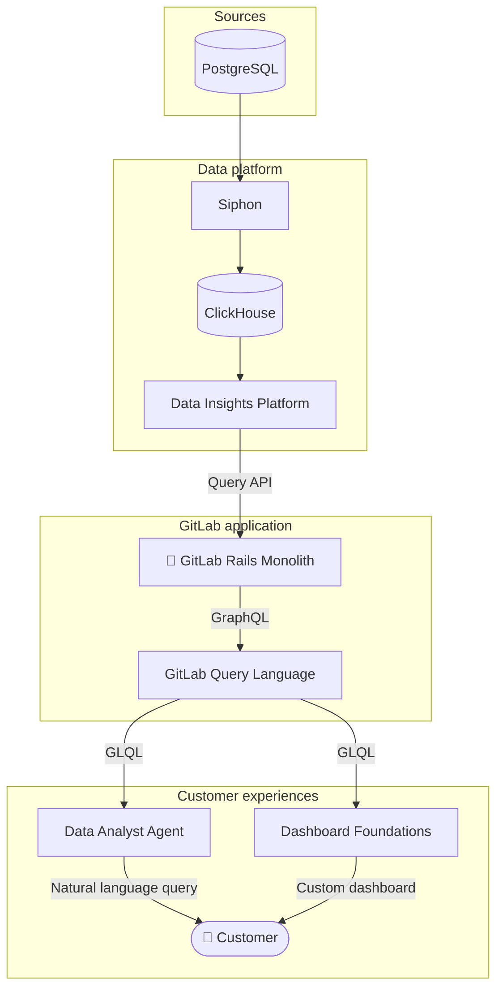

## Vision

The Platform Insights group is part of the Analytics section. We are focused on enabling GitLab customers to self-service their analytics by building a comprehensive dashboards-as-a-service framework, powered by AI and backed by scalable data infrastructure.

Our **[FY27 direction and roadmap](https://gitlab.com/groups/gitlab-org/analytics-section/platform-insights/-/wikis/Platform-Insights-Direction-and-Roadmap)** is the single source of truth for what we are building and why.

## Key initiatives

These are the key initiatives that the team own or are major contributors to:

- [Dashboard Foundations](https://gitlab.com/groups/gitlab-org/-/work_items/18072)
- [Data Analyst Agent](https://gitlab.com/groups/gitlab-org/-/work_items/19499)
- [GitLab Query Language (GLQL)](https://gitlab.com/gitlab-org/glql)
- [Data Insights Platform (DIP)](https://gitlab.com/gitlab-org/analytics-section/platform-insights/core)
- [Siphon data replication](https://gitlab.com/gitlab-org/analytics-section/siphon)

The diagram below illustrates the typical flow of data through the analytics platform stack at a very high-level, from source to customer.

In addition to the analytics platform, the group includes the [search team](/handbook/engineering/ai/search/) and is responsible for [classic search](https://docs.gitlab.com/user/search/) features.

## The team



### Stable counterparts



### Our values and principles

- We work in accordance with [GitLab values](/handbook/values/).
- We collaborate closely both within our team and within the Analytics section.
- We take ownership of our products and roadmap.
- We have a strong bias for action.
- We make data-driven decisions.

### Communication

Slack channels where we communicate transparently and can be reached:

- Primary: [#g_monitor_platform_insights](https://gitlab.enterprise.slack.com/archives/C02Q93U8J07)
- Standup: [#g_monitor_platform_insights_standup](https://gitlab.enterprise.slack.com/archives/C02VAHG10HW)
- Internal: [#g_monitor_platform_insights_internal](https://gitlab.enterprise.slack.com/archives/C02QLQUB0JZ)

### Meetings

- **Weekly team sync:** Focused on organizing ongoing work or specific efforts such as rollouts or larger initiatives and to share important updates.
- **Dev syncs:** Engineer-organized meetings where ICs can discuss technical issues or coordinate technical work without requiring the EM or PM.
- **1:1 coffee chats:** Each team member should schedule a coffee chat with every other team member in the team and within the wider Analytics section every couple of weeks. Work or non-work topics are both welcome. If timezones are a barrier, an async Slack thread works too. The goal is 1:1 connection.

## How we work

We base our workflow on the company's [Product Development Flow](/handbook/product-development/how-we-work/product-development-flow/). Any modifications or clarifications on how we apply the workflow are detailed below.

### Milestone planning

We work in GitLab milestones aligned to the monthly release cadence. The FY27 roadmap wiki is the source of truth for planned priorities. Before the start of each milestone, the team refines and scopes issues to fit available capacity.

### Async standups

Team members submit their weekly standups each Friday using [Geekbot](https://geekbot.com/). We use these async standups to communicate what we have accomplished, any current blockers and what we plan to work on next.

### Retrospectives

We run two types of retrospectives:

**1. Milestone retrospective (automated)**

Runs automatically after every milestone closes. Gives the team a structured moment to reflect on the milestone as a whole: what went well, what was painful, and what we want to do differently next time.

**2. Feature or incident retrospective (as-needed)**

Organized by the team after a major feature shipped or a significant incident occurs. For feature launches, this is a chance to take stock of what we accomplished and surface any follow-up tech debt or quality fixes we need to schedule. For incidents, the focus is on what went wrong without assigning blame, how we can prevent recurrence, and any remediations or monitoring improvements to action.

### ClickHouse Datastore

Analytics features have big data and insert heavy requirements which are not a good fit for Postgres or Redis. [ClickHouse](https://github.com/ClickHouse/ClickHouse) was selected as a good fit to meet these features requirements. ClickHouse is an open-source column-oriented database management system. It is attractive for these use cases because it can efficiently filter, aggregate, and sum across large numbers of rows. ClickHouse is not intended to replace Postgres or Redis in GitLab's stack.

We initially managed our own self-hosted Clickhouse instance, but decided to migrate to Clickhouse Cloud to enable the team to move quicker by offloading maintenance and scalability to Clickhouse.

Learn more: [Clickhouse Datastore Working Group](/handbook/company/working-groups/clickhouse-datastore/)
