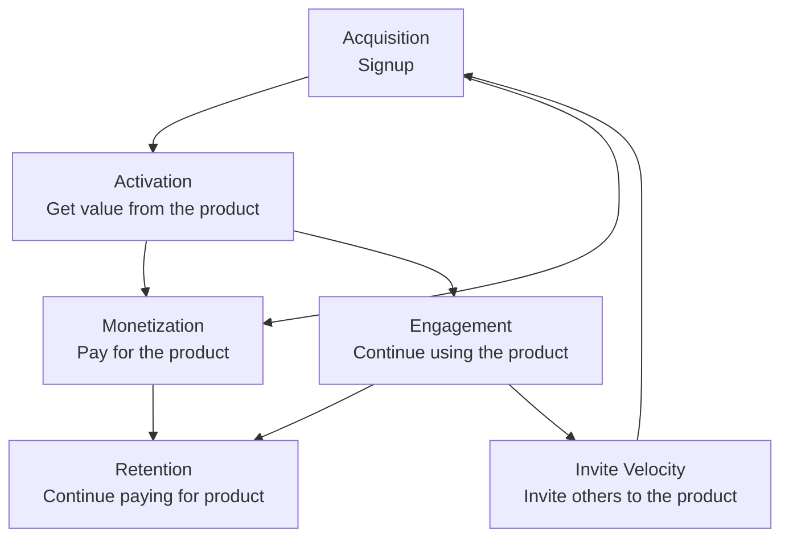

## Vision

Our vision is to make it effortless for individuals and teams to discover, activate, and expand enduring value in GitLab by running a full-funnel growth system that connects acquisition, activation, retention and monetization into measurable, self‑served loops.

For more details on Growth's mission, direction, and product strategy, see the [Growth product handbook](/handbook/marketing/growth/).

## How We Work

Working inline with our [values](/handbook/values/), we focus on [iteration](/handbook/values/#iteration) and [collaboration](/handbook/values/#collaboration), working with and across areas of the product our development department counterparts maintain.

We work on the issues prioritized by our product teams including running [experiments](/handbook/engineering/development/growth/experimentation/) on GitLab.com. Growth stage teams have Fullstack Engineers. The reason for this is that the Growth stage has a need for both Frontend and Backend skill-sets, but as a small team, has optimized for team member efficiency to adopt the Fullstack role.

## Growth Leadership & Teams

### Leadership

| Role | Person |
|------|--------|
| Product Director |  |
| Engineering Director |  |
| Engineering Manager |  |
| UX Design Manager |  |

### Product & Design

| Role | Person |
|------|--------|
| Product Managers | , ,  |
| Product Designers | ,  |

### Teams & Communication

| Team | Slack Channel | GitLab Handle |
|------|---------------|---------------|
| Growth (All) | [#s_growth](https://gitlab.slack.com/channels/s_growth) | `@gitlab-org/growth` , `@gitlab-org/growth/engineers` |
| Acquisition | [#g_acquisition](https://gitlab.slack.com/channels/g_acquisition) | `@gitlab-org/growth/acquisition` |
| Activation | [#g_activation](https://gitlab.slack.com/channels/g_activation) | `@gitlab-org/growth/activation` |
| Engagement | [#g_engagement](https://gitlab.slack.com/channels/g_engagement) | `@gitlab-org/growth/engagement` |

### All Team Members



## Shared Processes

Our teams collaborate using shared processes and tools:

- [Operating Model](operating_model_growth.md) - operating rhythm for growth
- [Milestone Planning, Refinement and Estimation](initiative_refinement_estimation) - continuous refinement process and estimation guidelines
- [Engineering DRI for Large-Scale Initiatives](engineering_dri) - managing complex workstreams and epics
- [Modular Code Guiding Principle](modular_code) - why and how we write modular code by default
- [Technical Exploration Guidelines](technical_spikes) - guidelines for research and spike work
- [Growth Experimentation Guidelines](experimentation) - guidelines for growth experimentations

## Experimentation

Growth teams contribute to GitLab [experimentation](/handbook/engineering/development/growth/experimentation/) to make it easier to run experiments and make data driven product decisions on GitLab.com.

## Resources

Some useful links to see how and what we are working on include:

- [Growth direction](/handbook/marketing/growth/)
- [Growth Epic Kanban board](https://gitlab.com/groups/gitlab-org/-/epic_boards/2079888)
- [Growth Issue Kanban board for development](https://gitlab.com/groups/gitlab-org/-/boards/1392106?&label_name%5B%5D=devops%3A%3Agrowth)
- [Experimentation](experimentation/)
- [GLEX](https://gitlab.com/gitlab-org/ruby/gems/gitlab-experiment)
- [Experiment rollout](https://gitlab.com/groups/gitlab-org/-/boards/1352542?label_name[]=experiment-rollout)

## Team Days

On occasion we hold virtual team days or meetings to take a break and participate in fun, social activities with our Growth counterparts.

- [FY23-Q2 2022](https://gitlab.com/gitlab-org/growth/team-tasks/-/issues/625)
- [December 2021](https://gitlab.com/gitlab-org/growth/team-tasks/-/issues/522)
- [April 2021](https://gitlab.com/gitlab-org/growth/product/-/issues/1675)
- [September 2020](https://gitlab.com/gitlab-org/growth/team-tasks/-/issues/175)
- [May 2020](https://gitlab.com/gitlab-org/growth/team-tasks/-/issues/119)

## Common Links

- [Growth stage](/handbook/engineering/development/growth/)
- [Growth workflow board](https://gitlab.com/groups/gitlab-org/-/boards/4152639)
- `#s_growth` in [Slack](https://gitlab.slack.com/archives/s_growth) (GitLab internal)
- [Growth opportunities](https://gitlab.com/gitlab-org/growth/product/-/issues)
- [Growth meetings and agendas](https://drive.google.com/drive/search?q=type:document%20title:%22Growth%20Weekly%22) (GitLab internal)
- [GitLab values](/handbook/values/)

## CustomersDot Trials Collaboration

For information about trials ownership and collaborating with the Fulfillment/Monetization team on trials work, see our [Trials Ownership and Collaboration Framework](trials-ownership.md). This framework defines the conceptual ownership model — Growth owns trial entry points; Fulfillment/Monetization owns the deeper trial codebase and all CustomersDot support — along with the decision framework and escalation paths for priority conflicts.
