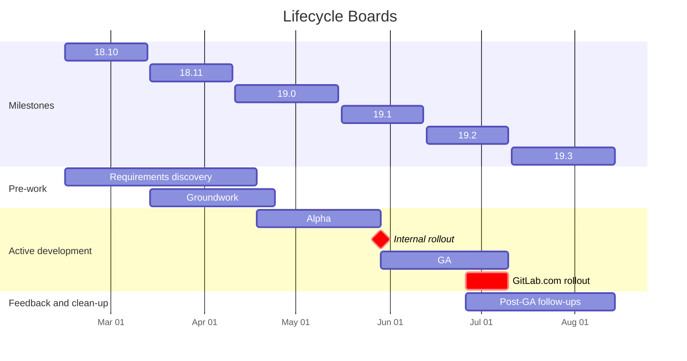

## Timeline



## Stages

We break projects into time-limited stages and cut scope to a [minimal viable change](/handbook/values/#minimal-valuable-change-mvc) to:

- Reduce cognitive load — engineers work on smaller changes, smaller sets of requirements, and fewer issues.
- Simplify project management and spot delays early — smaller stages are easier to keep on track and it's easier to notice when one is late.
- Surface bugs and feedback earlier.

| Stage | Outcome |
|-------|---------|
| **Requirements discovery** | Decision on scope for subsequent stages. Work broken down into issues. Rough estimation of the project. Clear definition of what is out of scope. |
| **Groundwork** | Refactorings and adaptations that make the rest of the development easier. |
| **Alpha** | Core workflow can be used for dogfooding and internal testing, but can be rough on the edges. Includes addressing internal testing feedback. |
| **GA** | The smallest coherent experience we're comfortable releasing to users. Includes addressing user feedback from alpha, fixing rough edges, and a feature flag rollout period (~2 weeks before milestone cut-off). |
| **Post-GA follow-ups** | Features deferred past the initial release, user feedback, code and test cleanup. Must be completed within 1–2 milestones after GA. When in doubt, put issues in out of scope. |
| **Out of scope** | No commitment. May be done later, reprioritized, or closed. |

## Epic organization

```plain
Lifecycle Boards (top-level epic)
├── Lifecycle Boards — Requirements discovery
│   ├── UX discussions (issue)
│   ├── Lifecycle Boards — Card (epic)
│   ├── Lifecycle Boards — Columns (epic)
│   └── ...
├── Lifecycle Boards — Groundwork
│   ├── Refactor work item listing page (epic)
│   ├── Load work items via REST API instead of GraphQL on listing pages (epic)
│   └── ...
├── Lifecycle Boards — Alpha
│   ├── Status columns (epic)
│   │   ├── Load available statuses (issue)
│   │   └── Load work items by column (issue)
│   ├── Card (epic)
│   ├── API changes (epic)
│   ├── Transform view preferences dropdown into drawer (epic)
│   ├── Card drag and drop (epic)
│   │   ├── Persist changes (issue)
│   │   └── Basic animation (issue)
│   └── ...
├── Lifecycle Boards — GA
│   ├── Internal testing feedback (issue)
│   ├── Card enhancements (epic)
│   ├── Feature flag rollout (epic)
│   ├── Card drag and drop (epic)
│   │   ├── Improved animation (issue)
│   │   └── Highlight available and unavailable columns (issue)
│   └── ...
├── Lifecycle Boards — Post-GA follow-ups
│   ├── User feedback (issue)
│   ├── Feature flag removal (epic)
│   ├── Old code cleanup (epic)
│   ├── Tests cleanup (epic)
│   └── ...
└── Lifecycle Boards — Out of scope
```
