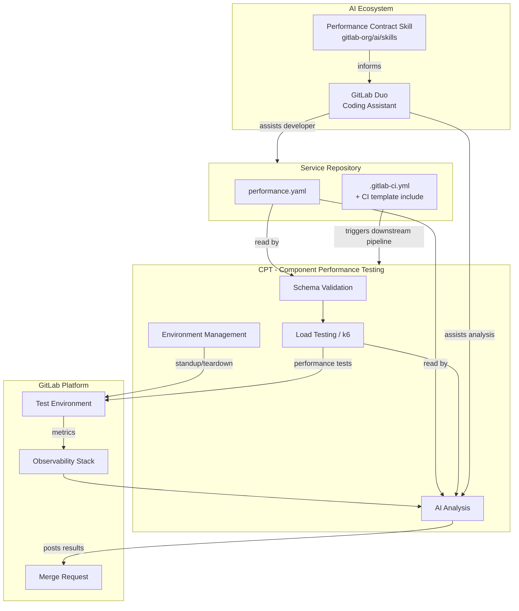
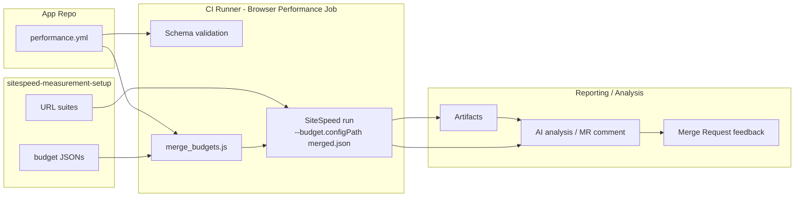



[[_TOC_]]

## Glossary

| Term | Definition |
| ---- | ---------- |
| Performance contract | A `performance.yaml` file that encodes performance targets for a modular feature service, validated automatically in CI |
| Modular Feature | A standalone GitLab service built on the modular feature architecture (Runway, Bench, LabKit v2) |
| Contract tooling | The tool responsible for schema validation, environment management, and load test execution against the contract. CPT is the chosen tool - see [#4407](https://gitlab.com/gitlab-org/quality/quality-engineering/team-tasks/-/work_items/4407) |
| SLI | Service Level Indicator - a metric that measures a specific aspect of service performance |
| LabKit v2 | GitLab's standard platform library for Go services, providing metric names, label conventions, and SLO-aligned histogram buckets |
| CPT | Component Performance Testing - the environment substrate and test runner for contract tooling |
| Performance model | A composable, system-level view of GitLab's performance characteristics, built by aggregating individual service contracts |

## Executive Summary

GitLab's shift to a modular feature architecture requires a new approach to performance testing. Rather than testing a single monolithic surface, each modular feature service defines a `performance.yaml` contract that encodes its performance targets. This contract drives automated CI validation, load test execution, and AI-assisted analysis per service - creating a shift-left feedback loop that catches regressions before merge.

The contract-per-service approach is the first step toward a composable performance model of GitLab: as contracts mature and stabilize, they can be aggregated to reason about system-level performance across service combinations without requiring exhaustive integration testing of every possible combination.

The implementation progress is tracked in [&387 Performance contracts for Modular Features](https://gitlab.com/groups/gitlab-org/quality/-/work_items/387).

## Problem Statement

GitLab's performance testing strategy has historically depended on testing a single, unified surface - a full GitLab instance under load. This approach worked when GitLab was a monolith, but the commitment to Modular GitLab and Modular Features fundamentally changes the testing landscape.

As GitLab decomposes into independently deployable modular feature services, two distinct problems emerge:

- **The combination matrix problem (testing infrastructure):** A single surface becomes many modular surfaces that can be combined in different ways. Testing every combination is not feasible - the matrix grows too large, identifying which combination to test for a given change becomes ambiguous, and interpreting results across combinations is complex.
- **The shared language problem (system reasoning):** There is no common, machine-readable definition of what "good performance" means for a modular feature service. Without this, teams cannot set consistent targets, AI coding agents have no performance awareness, resource limits in deployment configs drift from actual targets, and it is impossible to reason about the performance of the system as a whole.

Performance contracts address both problems simultaneously. Each service defines its own contract, eliminating the need to test combinations exhaustively. The contract also establishes a shared language for performance expectations that can be enforced in CI, consumed by AI agents, and eventually composed into a system-level performance model.

## Goals

### Current (Milestone 1-4)

- Define a stable, versioned schema for `performance.yaml` that any modular feature service can adopt
- Automate contract validation and load test execution in CI on every MR, as a self-service capability for modular feature teams
- Surface AI-assisted analysis of results as developer feedback on MRs
- Provide a reusable CI template and scaffolding so adoption takes less than one day

### Future direction

- **Contract composition** - Aggregate individual service contracts into a combined view, enabling system-level performance reasoning without exhaustive combination testing. This is the foundation of a GitLab performance model.
- **Performance model of GitLab** - A living, machine-readable model of GitLab's performance characteristics across all modular features, derived from composed contracts and observable metrics.
- **Local developer environment** - Shift performance feedback even earlier by enabling developers to run contract tests against their local environment before opening an MR.

## Non-Goals

- Environment management is explicitly out of scope for the contract schema itself - the contract defines _what_ to measure, not _how_ to provision the environment
- Local developer environment testing is a future direction, not in scope for the current epic
- Full production SLO management (contracts inform SLOs but do not replace them)
- Contract composition and the performance model are future directions, not in scope for the current epic

## Architecture

The [performance contracts handbook page](/handbook/engineering/testing/performance-contracts/) shows the logical flow of a contract test run - what happens in what order to produce developer feedback. This diagram shows the structural view: which repositories own which components and how they connect.



### Frontend: SiteSpeed structural view

The handbook includes a detailed, per-type flow; the diagram below mirrors the frontend flow so readers can see where budgets and URL suites live and how they feed into MR-level runs and optional central aggregation.



## Schema Design Decisions

### Decision: Endpoint categories as free-form labels

**Context:** The `endpoints` section groups API routes into performance categories. The question is whether category names (`fast_reads`, `standard_reads`, `writes`) should be a fixed enum or free-form labels.

**Decision:** Free-form labels. Teams name their categories to match their service's semantics. The performance tiers (see below) provide recommended defaults, but are not enforced by the schema.

**Rationale:** Fixed enums would require schema changes every time a new service archetype is identified. Free-form labels allow teams to be expressive while the tier system provides guardrails.

**Status:** Accepted

---

### Decision: Performance tiers as scaffolding defaults

**Context:** New services have no production data to base initial targets on. We need a way to give teams a starting point without requiring them to derive targets from scratch.

**Decision:** Define named performance tiers that map to recommended latency/error rate defaults. Teams select a tier as a starting point and tune from there.

**Rationale:** Tiers encode institutional knowledge about what "good" looks like for common service archetypes. They reduce the cognitive load of authoring a first contract.

**Status:** Under development - see [#4406](https://gitlab.com/gitlab-org/quality/quality-engineering/team-tasks/-/work_items/4406)

**Open question:** What is the right mental model for tiers - latency budgets, service archetypes, SLO classes, or something else?

---

### Decision: `resources` and `database` sections are optional for MVP

**Context:** Resource limits and database constraints are valuable but their enforcement mechanisms are not yet fully defined.

**Decision:** Mark both sections as optional for MVP. Teams can include them to document intent, but validation will not block CI until enforcement is implemented.

**Rationale:** Requiring sections we cannot yet enforce would create false confidence. Optional sections allow teams to start documenting targets while enforcement is built out.

**Status:** Accepted for MVP. Enforcement mechanism is TBD.

**Open question:** The `database` section (e.g. `max_queries_per_request`) requires post-run analysis via explain jobs. How does this integrate with the existing database team's explain job tooling?

---

### Decision: `sli_mapping` references LabKit v2 metric names directly

**Context:** The contract needs to map performance targets to observable Prometheus metrics. LabKit v2 provides standardized metric names for Go services.

**Decision:** The `sli_mapping` section references LabKit v2 metric names directly. Services not using LabKit v2 must provide equivalent metric names manually.

**Rationale:** LabKit v2 is the standard for modular feature services. Direct reference eliminates a translation layer and ensures contracts stay aligned with the instrumentation standard.

**Status:** Accepted

---

### Decision: Schema canonical location deferred pending tooling selection

**Context:** The template Schema file needs a permanent home where it can be versioned, referenced by validation tooling, and imported to add performance contracts to new services.

**Decision:** The schema is temporarily maintained in the [handbook page](/handbook/engineering/testing/performance-contracts/) during Milestone 1. The canonical location will be determined once environment tooling is selected in [#4407](https://gitlab.com/gitlab-org/quality/quality-engineering/team-tasks/-/work_items/4407).

**Rationale:** The schema location is coupled to the tooling choice. Committing to a location before the tooling decision risks a disruptive migration.

**Status:** Pending [#4407](https://gitlab.com/gitlab-org/quality/quality-engineering/team-tasks/-/work_items/4407)

---

### Decision: Namespace frontend configuration under `frontend` in `performance.yml`

**Context:** Frontend contracts require multiple related configuration fields (budgets, teams, default) and must be extensible for future options.

**Decision:** Namespace all frontend-related settings under a `frontend` object in `performance.yml`. Presence of the object implies frontend contracts are configured; an optional `enabled` boolean may be used to explicitly opt-out.

**Rationale:** Namespacing groups related settings, simplifies schema evolution, and avoids flattening unrelated keys at the top level.

**Status:** Accepted

## Environment and Tooling Decisions

### Decision: Environment management tooling selection

**Context:** Contract tests require a transitory environment to run against on each MR. CPT (Component Performance Testing) was evaluated as the primary candidate.

**Decision:** CPT is confirmed as the environment substrate for MR-level contract runs. Evaluated in [#4407](https://gitlab.com/gitlab-org/quality/quality-engineering/team-tasks/-/work_items/4407).

**Rationale:**

- CPT's Docker and CNG deployment paths already cover modular feature service deployment patterns
- The two-VM GCP provisioning model (one for the service under test, one for k6) is acceptable for MR-level runs
- No viable alternative exists for environment management - Sitespeed addresses test running but not environment provisioning, and is better suited as a future complement for frontend/UX contract metrics

**Options considered:**

| Option | Pros | Cons |
| ------ | ---- | ---- |
| CPT | Same-team ownership, proven environment management, Docker and CNG support, k6 integration | Requires adaptation to accept `performance.yaml` as input and generate k6 scenarios dynamically |
| Dedicated new tool | Purpose-built for contracts | Build cost, maintenance overhead, no environment management today |
| Runway ephemeral environments | Production-like | Setup complexity, cost, availability |
| Sitespeed | Broader current adoption for frontend testing | Does not solve environment management; better as a future complement for UX/frontend contract metrics |

**Status:** Accepted - see [#4407](https://gitlab.com/gitlab-org/quality/quality-engineering/team-tasks/-/work_items/4407)

**Implementation gaps to address in Milestone 2 (Task 2.1):**

- `performance.yaml` → k6 scenario translation, to be built natively into CPT
- Schema validation location (CPT vs. separate repo) - deferred pending concrete reuse scenarios from pilot team adoption
- Pass/fail CI gating and structured reporting - deferred to Milestone 4 (Tasks 4.2a/4.2b); MR comment feedback is sufficient for MVP

---

### Decision: Schema validation approach

**Context:** The contract must be validated before load tests run to catch structural and semantic errors early.

**Decision:** Two-pass validation: (1) JSON Schema structural validation via `check-jsonschema`, (2) semantic checks (p99 ≥ p95, no duplicate routes, valid SLI references, resource limits ≥ requests).

**Rationale:** Separating structural from semantic validation makes errors easier to diagnose and allows each pass to be owned independently.

**Status:** Accepted (implemented in POC)

## AI Integration Decisions

### Decision: Publish a performance contract skill to the GitLab Skills repo

**Context:** AI coding assistants need awareness of performance contracts to generate contract-compliant code and to analyze contract test results.

**Decision:** Author and publish a skill to the [GitLab Skills repo](https://gitlab.com/gitlab-org/ai/skills) covering contract format, schema, test execution, and links to functional contract testing.

**Rationale:** A skill in the shared repo is accessible to agents across all modular feature repos and requires only a single update as the contract system evolves.

**Status:** Planned for Milestone 4 - can begin once schema is stable at end of Milestone 1

**Open question:** How does the AI agent access the observability stack for post-run analysis? What data is available and in what format?

## Open Questions

Active open questions are tracked in [&387](https://gitlab.com/groups/gitlab-org/quality/-/work_items/387). The following are the key unresolved design questions:

1. **Schema change governance** - As the canonical template and validation rules evolve in the contract tooling repo, what is the review and communication process for changes that affect all adopting services? Who approves breaking vs non-breaking schema changes?
2. **Initial targets for new services** - How do teams determine initial p95/p99 targets for a new service with no production data?
3. **Relationship to SLOs** - Should contract thresholds be derived from SLOs, or should SLOs be derived from contracts?
4. **Multiple contracts vs environment-aware sections** - Should different test environments (CI, staging, local) use separate contract files or environment-specific sections within one file?
5. **Database section enforcement** - How does `max_queries_per_request` get enforced? Integration with the database team's explain job?

## References

- **Epic**: [&387 Performance contracts for Modular Features](https://gitlab.com/groups/gitlab-org/quality/-/work_items/387)
- **Handbook page**: [Performance Contracts](/handbook/engineering/testing/performance-contracts/)
- **POC Repository**: [perf-contract-poc](https://gitlab.com/gl-dx/performance-enablement/demos/perf-contract-poc)
- **POC Walkthrough**: [Video walkthrough](https://drive.google.com/file/d/1bz2IwUE80H0MspLT0-TiFj3poWaEa9Cc/view?usp=drive_link)
- **Related design doc**: [Component Performance Testing](../component_performance_testing/)
- **Related design doc**: [Shift Left/Right Performance Testing](../shift_left_right_performance/)

### Note: Contract Types and SiteSpeed frontend budgets

This design document describes the contract model and architecture decisions (CPT-centric). For concrete usage patterns and examples, the handbook page [Performance Testing for Modular Features](/handbook/engineering/testing/performance-contracts/) now includes a "Contract Types" section with a dedicated Frontend: SiteSpeed subsection.

Summary of the frontend pilot (high-level):

- We pilot a developer-centric workflow for frontend performance budgets using SiteSpeed. Budgets and URL lists are colocated in the `sitespeed-measurement-setup` repository under `performance/` so developers can update them together in a single PR.
- Budget files are organized as a baseline default (`performance/budgets/default.json`), environment overrides (`performance/budgets/environments/*.json`), and optional per-team overrides (`performance/budgets/teams/*.json`). All files use SiteSpeed's native nested budget format. At CI runtime, the environment budget is merged with a team override; team entries override environment entries at the metric level within each section, and URL/alias-keyed overrides are merged independently from global section defaults.
- MR-level runs are advisory and run SiteSpeed locally with `--budget.configPath` against a review app URL. The initial pilot avoids submitting MR runs to the central sitespeed-runway server to prevent uncontrolled data growth; scheduled or protected-branch runs can be promoted later.
- The `sitespeed-measurement-setup` repo contains examples, a JSON Schema, and helper scripts (`validate_budget.js`, `merge_budgets.js`) under `performance/`.

Example `performance.yml` frontend config (namespaced):

```yaml
frontend:
  enabled: true            # optional: presence implies enabled; set false to opt-out
  budgets:
    production: testrunner/sitespeed-measurement-setup/performance/budgets/environments/production.json
    staging:   testrunner/sitespeed-measurement-setup/performance/budgets/environments/staging.json
    mr:        testrunner/sitespeed-measurement-setup/performance/budgets/environments/mr.json
  teams:
    rapid-diffs:
      url_dir: testrunner/sitespeed-measurement-setup/gitlab/desktop/urls
      budget:  testrunner/sitespeed-measurement-setup/performance/budgets/teams/rapid-diffs.json
  default_budget: mr
```

Merge semantics note: the environment budget and optional team budget are merged at runtime using SiteSpeed's native nested format; team entries override environment entries at the metric level within each section, and URL/alias-keyed overrides are merged independently from global section defaults.

Refer to the handbook page for the SiteSpeed examples and CI snippets; this design doc focuses on architectural decisions and the CPT roadmap.
