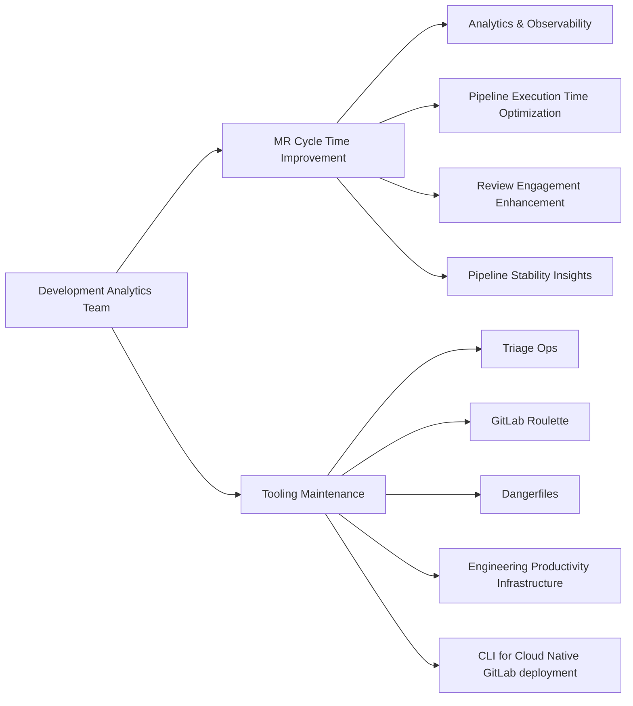

## Common Links

| **Category**            | **Handle**                                                                                                                 |
|-------------------------|----------------------------------------------------------------------------------------------------------------------------|
| **GitLab Group Handle** | [`@gl-dx/development-analytics`](https://gitlab.com/gl-dx/development-analytics)                                           |
| **Slack Channel**       | [`#g_development_analytics`](https://gitlab.enterprise.slack.com/archives/C064M4D2V37)                                     |
| **Slack Handle**        | `@dx-development-analytics`                                                                                                |
| **Team Boards**         | [`Team Issues Board`](https://gitlab.com/groups/gitlab-org/-/boards/8966549?label_name%5B%5D=group::development%20analytics), [`Team Epics Board`](https://gitlab.com/groups/gitlab-org/-/epic_boards/2068920?label_name[]=group%3A%3Adevelopment%20analytics), [`Support Requests`](https://gitlab.com/groups/gitlab-org/-/boards/9098093?label_name%5B%5D=development-analytics::support-request)                                           |
| **Issue Tracker**       | [`tracker`](https://gitlab.com/groups/gitlab-org/quality/dx/analytics/-/issues)                                            |
| **Team Repositories** | [development-analytics](https://gitlab.com/gitlab-org/quality/analytics)                                                   |

## Mission

Our mission is to enhance developer efficiency by delivering actionable insights, empowering teams with quality, CI and related metrics, and to build scalable tools that measurably improve the software development lifecycle for our teams and customers.

## Vision

Support the establishment and enforcement of the Infrastructure Platforms department KPIs. The team will consolidate metrics and reporting to provide measurable DevEx and Quality information from Engineer to VP+ level

- Enable data visualisation from every test suite, job, and pipeline.
- Produce and consolidate dashboards and reports to enable Engineering teams to assess and improve on quality e.g. Test coverage, test runtime, flakiness, bug numbers
- Enable the DevEx section and Platforms with information about test suite effectiveness, bugs identified by engineers and customers, incidents, and other Production-data to guide engineering teams
- Seek to build solutions into the GitLab product itself, so that our customers can also benefit from what we build.

## FY27 Roadmap

### Now FY27-Q2

See the Q2 Planning issue: https://gitlab.com/gitlab-org/quality/analytics/team/-/work_items/573 for the most up to date view of what the team is working on at the moment.

### Next FY27-Q3/Q4

**Focus: Scale out usage of data/dashboards. Build product features to improve pipeline telemetry and enable  Engineering teams to improve CI performance** (FY27-Q1 to FY27-Q2)

- Factory-heavy RSpec test observability, guardrails, and remediation
- MR Process Visibility: reviewer roulette, approval resets, and review timeline
- Help Build scalable CI job telemetry reporting (into product, via runners)
- Dogfood Data Insight Platform Dashboarding capabilities (if ready)
- Triage Ops maintenance and improvements (e.g. Migrate Triage Ops to Runway)

### Later FY28 and beyond

**Focus: Move from custom tooling to product features**

- Prioritise custom tooling owned by the team to build into the product.

## Team members



## Core Responsibilities



## Dashboards

Development Analytics dashboards are listed on [Developer Experience Dashboards page](/handbook/engineering/infrastructure-platforms/developer-experience/dashboards)

## Metrics

The Development Analytics group develops and maintains metrics to measure engineering productivity, quality, and efficiency. Each metric below is documented with its definition, methodology, current status, and known limitations.

### Defect Escape Rate

#### Current Status

- **Maturity**: Alpha
- **Updated**: Monthly (manual data collection for E2E environments)
- **Dashboard**: [Defect Escape Rate (Snowflake)](https://app.snowflake.com/ys68254/gitlab/#/dx-defect-escape-rate-dM9ZOyVDJ)

#### What & Why

Defect Escape Rate measures the percentage of defects that escape to production compared to those caught by automated pipelines and tests across the software development lifecycle. This metric informs the effectiveness of our testing strategy and shift-left practices. A lower rate indicates stronger quality gates preventing defects from reaching customers.

The metric supports drill-down by product group, enabling groups to track their own defect detection effectiveness.

#### How It Works

We measure "defects" in two ways:

- **Defects that escaped**: Production bugs (issues with `type::bug` label)
- **Defects caught**: Failed pipelines/tests that prevented problematic code from reaching production

The formula calculates what percentage of total defects made it to production:

```plaintext
Defect Escape Rate = Defects Escaped / (Defects Escaped + Defects Caught)
```

**What We Count as "Defects Escaped":**

- `type::bug` issues from the `gitlab-org/gitlab` project (canonical scope)
- Or `type::bug` issues from the `gitlab-org` and `gitlab-com` groups (broad scope)

**What We Count as "Defects Caught":**

We use failed pipelines as a proxy for caught defects, assuming pipeline failures prevented problematic code from progressing further.

Counted across these SDLC stages:

1. **MR pipelines** - Failed pipelines in `gitlab-org/gitlab` and `gitlab-org/gitlab-foss`
2. **Master pipelines** - Failed pipelines on the master branch  
3. **Deployment E2E tests** - Failed E2E test pipelines running against deployment environments:
   - Staging Canary, Staging Ref, Production Canary, Staging, Production, Preprod, Release (from ops.gitlab.net)
   - Dedicated UAT (from gitlab.com)

Note: E2E metrics track failed test pipelines that validate each environment, not failures from deployment pipelines themselves. These serve as quality gates before customer impact.

For `gitlab-foss`: Only direct failures (push, schedule, merge_request_event sources) are counted. Downstream pipelines (source = `pipeline` or `parent_pipeline`) are excluded to avoid double-counting failures already captured in parent `gitlab-org/gitlab` pipelines.

**Important Context on Measurement Precision:**

The current implementation uses "failed pipeline" as a proxy for "defect caught," which includes all pipeline failures (infrastructure issues, timeouts, linting errors, etc.), not just test failures indicating functional defects. This broad definition results in Defect Escape Rate values around 5-10%.

Future iterations measuring only test failures (functional defects) will likely show Defect Escape Rate values around 20-40%. This increase reflects that many pipeline failures catch non-functional issues (infrastructure, configuration) rather than code defects that would affect customers. The higher percentage doesn't indicate worse quality - it shows a more precise measurement of test effectiveness at catching functional defects.

**Group-Level Defect Escape Rate:**

Defect Escape Rate can be filtered by product group using MR `group::` labels. The underlying assumption is that engineers from a given group primarily generate defects in code they're responsible for - defects their test suite should catch.

Specifically:

- Bugs assigned to groups via `group::` labels on issues  
- MR pipeline failures assigned to groups via `group::` labels on merge requests
- Only MR pipeline failures can be attributed (we don't have `group::` labels on Master pipelines or E2E test pipelines)

MRs and issues don't always have group labels set (e.g., 13% of MRs and 6% of issues in Oct-Dec 2025 lacked group labels).

Future iterations would ideally use test ownership (`feature_category`) for attribution, providing direct measurement of which tests failed rather than inferring ownership from MR authorship. This requires adding group ownership data for all test frameworks, not just backend tests.

#### Known Limitations

**Data Collection:**

- E2E pipeline failures retrieved manually via ops.gitlab.net API (not automated)
- ops.gitlab.net pipeline data not available in ClickHouse or current Snowflake (legacy data stopped Aug 2025)
- ClickHouse is our platform of choice for this metric, but we currently lack most required data (issues, merge requests, E2E pipelines). We plan to add this data in Q1 2026.

**Global Defect Escape Rate Limitations:**

- Current version counts all pipeline failures (infrastructure, timeouts, linting) not just functional test failures
  - More precise test-only measurement would ideally be implemented in ClickHouse once data is available

**Group Attribution Limitations:**

- Group-level Defect Escape Rate only includes MR pipeline failures (Master/E2E failures cannot be attributed without group labels on those pipelines)
- Group Defect Escape Rate percentages will be higher than global Defect Escape Rate due to smaller denominator (MR-only vs. all SDLC stages)
- MR label attribution assumes engineers primarily create defects in their own code areas - may not hold for cross-functional work
- MRs and issues don't always have group labels

**Metric Variability:**

Defect Escape Rate is inherently variable and can be influenced by factors unrelated to actual quality improvements:

- **Master-broken incidents** temporarily inflate "defects caught" (master failures spike), artificially lowering Defect Escape Rate
- **Infrastructure issues** causing pipeline failures inflate denominator, lowering Defect Escape Rate without reflecting better testing
- **Flaky tests** causing spurious failures inflate "defects caught," creating false appearance of improvement
- **CI capacity constraints** may reduce pipeline execution, potentially masking defects

Until we can filter these confounding factors, month-to-month Defect Escape Rate changes should be interpreted cautiously. Sustained trends over multiple months are more meaningful than single-month variations.

#### Planned Improvements

**Q1 2026:**

- Automate E2E pipeline data ingestion from ops.gitlab.net to ClickHouse
- Add issue and merge request data to ClickHouse for full automation
- Construct the dashboard in ClickHouse
- Refine "defects caught" to count only pipelines that failed due to RSpec or Jest test failures (note: still includes flaky tests and master-broken incidents)

**Future:**

- Filter out infrastructure failures, flaky tests, and master-broken incidents for cleaner measurement
- Expand test ownership data (`feature_category`) to enable accurate group attribution based on which tests failed

## How we work

### Philosophy

- We prioritize asynchronous communication and a handbook-first approach, in line with GitLab's all-remote, timezone-distributed structure.
- We emphasize the [Maker's Schedule](https://www.paulgraham.com/makersschedule.html), focusing on productive, uninterrupted work.
- Most critical recurring meetings are scheduled on Tuesdays and Thursdays.
- We dedicate 3–4 hours weekly for focused learning and innovation. This protected time enables the team to explore emerging technologies, conduct proof-of-concepts, and stay current with industry trends. Meeting requests during these blocks require advance notice.
- All meeting agendas can be found in the [Team Shared Drive](https://drive.google.com/drive/folders/1uZg0J5hYsOUu3WMNR-PoAcmrhhmDxxoA?usp=drive_link) as well as in the meeting invite.

### Meetings/Events

| Event                        | Cadence                                     | Agenda                                                                                                                                                          |
|------------------------------|---------------------------------------------|-----------------------------------------------------------------------------------------------------------------------------------------------------------------|
| End-of-Week progress update  | Once a week (Wednesday)                     | Summarize status, progress, ETA, and areas needing support in the weekly update in issues and Epics. We leverage [epic-issue-summaries bot](https://gitlab.com/gitlab-com/gl-infra/epic-issue-summaries) for automated status checks |
| Team meeting                 | Twice a month on Tuesday 4:00 pm UTC        | [Agenda](https://docs.google.com/document/d/1gtghZCYeg42cMbQ8mWnjBcsu4maMO4OFA0xcQ8MfRHE/edit?usp=sharing)                                                      |
| Monthly Social Time          | Monthly on last Thursday 4:00 pm UTC        | No agenda, fun gathering. Choose one of the slots based on your timezone alignment. Read [Virtual team building](https://internal.gitlab.com/handbook/finance/expenses/#team-building)     |
| Quarterly Business Report    | Quarterly                                   | Contribute to [team's success, learnings, innovations and improvement opportunities for each business quarter](https://gitlab.com/groups/gitlab-org/quality/quality-engineering/-/epics/61) |
| 1:1 with Engineering Manager | Weekly                                      | Discuss development goals (see the [1:1 guidelines](/handbook/leadership/1-1/))                                                                                |
| Team member's coffee chats   | Once/twice a month                          | Optional meetings for team members to regularly connect                                                                                                        |

### Yearly Roadmap Planning

- Each financial year, we create a roadmap to ensure visibility and alignment.
- We conduct an intensive month-long exercise (usually in Q4) to gather input from stakeholders.
- DRIs take the lead drafting the roadmap using the [roadmap prep-work template](https://gitlab.com/gitlab-org/quality/analytics/work-log/-/blob/main/templates/roadmap-pre-work-template.md?ref_type=heads)).
- Once the roadmap is approved, during our bi‑weekly team meetings, we review progress, address blockers, and gather feedback on the planned roadmap work.

### Iterations

Once the yearly roadmap is defined, we structure our work using [GitLab Iterations](https://docs.gitlab.com/ee/user/group/iterations/) within a twice-a-month iteration model. This approach ensures consistent progress tracking, clear priorities, and iterative improvements. Here are our [current iteration board](https://gitlab.com/groups/gitlab-org/-/boards/9114071?label_name%5B%5D=group::development%20analytics&iteration_id=Current) and [previous iterations](https://gitlab.com/groups/gitlab-org/-/boards/9114585?label_name%5B%5D=group::development%20analytics) for reference. As a team, we make sure:

1. Each issue is assigned to a [Development Analytics Iteration](https://gitlab.com/groups/gitlab-org/-/cadences/).
2. Issues that are not worked on within the iteration automatically roll over to the next iteration.
3. In every twice-a-month team meeting, we review the iteration boards and track velocity using burndown charts.

### Internal Rotation & Support Requests

#### Internal Rotation

We use [an internal rotation](https://gitlab.com/gitlab-org/quality/analytics/internal-rotation#process) for support requests and other team maintenance tasks. This frees up time for other Engineers in the team to work on planned work.

#### Support Requests

- If one finds a bug, needs assistance, or identifies an improvement opportunity then raise support requests using the `~"group::Development Analytics"` and `~"development-analytics::support-request"` labels. If the issue is urgent, escalate to the designated Slack channel - [`#g_development_analytics`](https://gitlab.enterprise.slack.com/archives/C064M4D2V37).
- If a request first comes through Slack, either the requester or a `group::Development Analytics` member should open an issue with the correct labels to ensure proper tracking and triage.
- The team reviews the [support request board](https://gitlab.com/groups/gitlab-org/-/boards/9098093?label_name%5B%5D=development-analytics%3A%3Asupport-request) and prioritizes accordingly. Generally, the team reserves ~20% of weekly time for support tasks, though this may vary based on current priorities.

### Tools/Repository Maintenance

- Team does not automatically watch every new issue created in each group-owned repository—use the group labels or escalate in Slack to ensure visibility.
- We highly promote self-served Merge Requests. If one already identified a fix or improvement, we request opening an MR for faster turnaround. The `~group::development analytics` maintainers will review and merge as appropriate.
- Feature work and bug fixes follow the team's current priorities.
- Find the version management rituals for `~group::development analytics` owned repositories:

| Repository                             | Release Process                                                                                 |
|----------------------------------------|-------------------------------------------------------------------------------------------------|
| **gitlab-roulette**                    | Version updates are not scheduled on a set cadence. A release can be cut whenever a version-update MR is submitted. |
| **gitlab-dangerfiles**                 | Same as above—no regular cadence; release triggered by a version-update MR.                     |
| **triage-ops**                         | A new release is initiated after merging a new commit into the default branch.                            |
| **engineering-productivity-infrastructure** | Dependency update MRs are generated by Renovate bot.                                            |

### Automated Label Migration

For details on label migration, see the [Handbook entry for creating label migration triage policy with GitLab Duo Workflow](https://handbook/engineering/infrastructure-platforms/developer-experience/development-analytics/create-triage-policy-with-gitlab-duo-workflow-guide).
