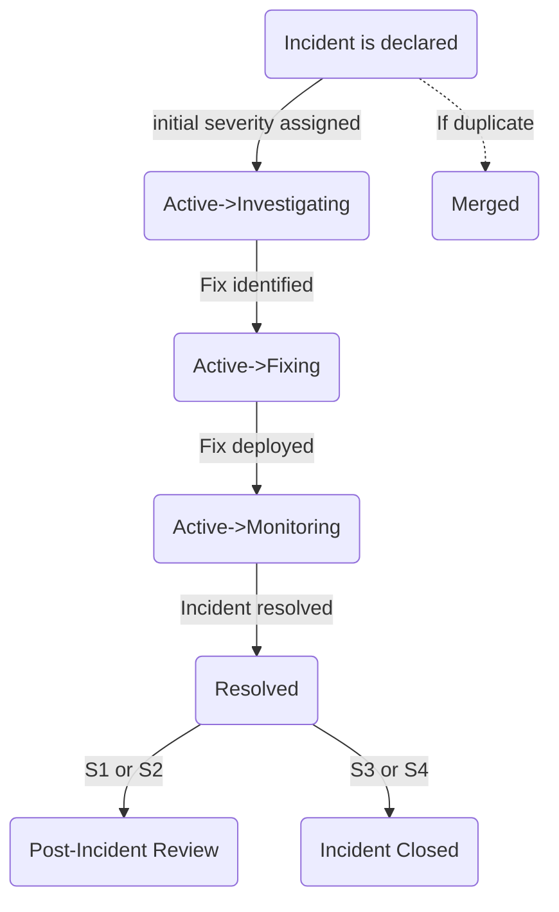

{}
If you're a GitLab team member and are looking to alert Reliability Engineering about an availability issue with GitLab.com, please find quick instructions to report an incident here: [Reporting an Incident](#reporting-an-incident).
{}

{}
If you're a GitLab team member looking for who is currently the Engineer On Call (EOC), please see the [Who is the Current EOC?](#who-is-the-current-eoc) section.
{}

{}
If you're a GitLab team member looking for the status of a recent incident, please see the incident [board](https://gitlab.com/gitlab-com/gl-infra/production/-/boards/1717012?&label_name%5B%5D=incident). For detailed information about incident status changes, please see the [Incident Workflow](#incident-workflow) section.
{}

{}
If incident.io is down or otherwise unavailable, please follow [what to do when incident.io is down](incident-io-down.md).
{}

## Incident Management

Incidents are **anomalous conditions** that result in—or may lead
to—service degradation or outages. These events require human
intervention to avert disruptions or restore service to operational status.
Incidents are _always_ given immediate attention.

The goal of incident management is to organize chaos into swift incident
resolution. To that end, incident management provides:

1. [on-call arrangements](./on-call/) for response teams to make sure that there are team members available to resolve incidents,
1. well-defined [roles and responsibilities](#incident-response-roles) and [workflow](#incident-workflow) for members of the incident team,
1. control points to manage the flow information and the resolution path,
1. an incident review where lessons and techniques are extracted and shared

When an [incident starts](#reporting-an-incident), the incident automation sends a message
in the correponding [incident announcement channel](#incident-announcement-channels)
containing a link to a per-incident Slack channel for text based communication.
Within the incident channel, a per-incident Zoom link will be created.
Additionally, a GitLab issue will be opened in the [Production tracker](https://gitlab.com/gitlab-com/gl-infra/production)

### Incident Management Lifecycle

At GitLab, we approach Incident Management as a feedback loop with the following steps:

1. **Preparation** — Documentation of process and relevant training for everyone who could be involved in an incident. This includes ensuring the appropriate monitoring and alerting is in place, and the right people are part of the on-call rotation.
1. **Identification** — Identifying a problem through instrumentation/alerting/monitoring, customer reports, team member reports, or security reports. Once identified, an incident is declared.
1. **Investigation** — Looking for the cause of an outage/service disruption and an initial determination of the impact, which informs the severity level.
1. **Containment** — Containing the impact and stabilizing the service as quickly as possible. Once containment is achieved, the incident is considered "mitigated".
1. **Remediation** — A more robust response to stabilizing the service. An incident is considered remediated, or "resolved", when all anomalous conditions are resolved.
1. **Recovery** — Improvements are made across testing and documentation. Corrective Actions that have been identified to prevent the incident from re-occurring or improve future response times may be started in this phase.
1. **Learnings** — Root Cause Analysis, Incident Reviews/retrospectives, and identifying further Corrective Actions. All of these feed into updating documentation and training in step 1, closing the feedback loop.

For an overview of how we monitor and alert, see the [monitoring handbook page](/handbook/engineering/monitoring/). We also employ a [Development Escalation Process](/handbook/engineering/workflow/development-processes/infra-dev-escalation/process/) to get expertise from development teams as needed.

### Metrics

Incident performance is tracked against a set of target metrics (MTTR, % mitigated within 30 minutes, % internally detected, and others). Definitions, scope, and links to the dashboard are documented on the [Incident Metrics](./metrics.md) page.

### Scheduled Maintenance

Scheduled maintenance that is a `C1` should be treated as an undeclared incident.

30-minutes before the maintenance window starts, the Engineering Manager who is responsible for the change should notify the SRE on-call, the Release Managers and the CMOC to inform them that the maintenance is about to begin.

Coordination and communication should take place in the Situation Room Zoom so that it is quick and easy to include other engineers
if there is a problem with the maintenance.

If a related incident occurs during the maintenance procedure, the EM should act as the Incident Manager for the duration of
the incident.

If a separate unrelated incident occurs during the maintenance procedure, the engineers involved in the scheduled maintenance should
vacate the Situation Room Zoom in favour of the active incident.

If brief periods of errors are expected during the scheduled maintenance, this
should also be communicated to our users through updates to relevant status pages. In order
to not count the duration of the maintenance as downtime towards our [Service Level Agreement](/handbook/engineering/infrastructure-platforms/service-level-agreement/), we also need to [set the maintenance window](https://runbooks.gitlab.com/monitoring/set_maintenance_window/).

## Ownership

The Incident Lead role must be deliberately set for every incident. If you need help determining the owner of an incident, the EOC can help.
The Incident Lead can delegate ownership to another engineer or escalate ownership to the IM at any time.
There is only ever **one** owner of an incident and only the owner of the incident can declare an incident resolved.
At anytime the Incident Lead can engage the next role in the hierarchy for support. The Incident Lead role should always be assigned to the current owner.

## Incident Management Structure

At GitLab, our incident management framework distinguishes between two important concepts:

1. **Incident Response Roles**: These are the functional positions needed during incident response, defined by specific responsibilities and actions, regardless of who fills them. Currently, we have three defined roles: Incident Lead, Incident Responder, and Communications Manager.

2. **Response Teams**: These are the specific teams and rotations responsible for staffing these roles. Different response teams may cover different environments (for example, GitLab.com vs. Dedicated) or specialized functions.

Understanding this distinction helps clarify who does what during incidents and ensures proper coordination across our incident management processes.

<i class="fa-brands fa-youtube"></i> [Watch more about Incident Response Roles vs. Teams](https://youtu.be/vmK9-7roDFM)

## Incident Response Roles

Clear delineation of responsibilities is important during an incident. Quick resolution requires focus and a clear hierarchy for delegation of tasks. Preventing overlaps and ensuring a proper order of operations is vital to mitigation.

| **Role** | **Description** | **When Needed** |
| ---- | ----------- | ---- |
| [**Incident Lead**](./roles/incident-lead.html) | The owner of the incident who is responsible for the coordination of the incident response and will drive the incident to resolution. The Incident Lead should always be assigned the role in incident.io. | All incidents require an Incident Lead, which must be set purposefully per-incident. More information on choosing an Incident Lead can be found in the [workflow section](#incident-lead) |
| [**Incident Responder**](./roles/incident-responder.html) | Performs technical investigation and mitigation. Responsible for the actual troubleshooting and resolving of the technical issues causing the incident. | All incidents |
| [**Communications Lead**](./roles/communications-lead.html) | Disseminates information to stakeholders and customers across multiple media. Manages external communications and status updates. | S1/S2 incidents or when significant communication is required |

## Response Teams

We make sure that there are team members available to resolve incidents by maintaining on-call schedules.

When on-call team members are paged, they join an incident and take on one of the incident response roles listed above.

Details of the on-call processes and policies are found in the [on-call handbook pages](./on-call/).

Below is a summary of the on-call rotations that support incident resolution:

### Tier 1

On-Call rotations notified by automated systems:

| **Team** | **Primary Role** | **Function** | **Environment** | **Who?** |
| ---- | ---- | ----------- | ---- | ---- |
| **Engineer On Call (EOC)** | [Incident Responder](./roles/incident-responder.html)| Primarily serves as the initial Incident Responder to automated alerting, and GitLab.com escalations - expectations for the role are in the [Handbook for oncall](/handbook/engineering/infrastructure-platforms/incident-management/on-call/#general-expectations-for-on-call). The checklist for the EOC is in our [runbooks](https://gitlab.com/gitlab-com/runbooks/blob/master/on-call/checklists/eoc.md). There are runbooks designed to help EOC troubleshoot a broad range of issues - in the case where the runbooks are insufficient, the EOC will escalate by [engaging the Incident Manager and CMOC](#how-to-engage-response-teams). | GitLab.com | Generally an SRE and can declare an incident. Part of the "GitLab.com Production EOC" on call schedule in incident.io. |
| **Incident Manager On Call (IMOC)** |[Incident Lead](./roles/incident-lead.html) | Provides tactical coordination and leadership during complex incidents | GitLab.com | Rotation in [incident.io](https://app.incident.io/gitlab/on-call/schedules/01K77XZFD7X7E3W8T6GDVMKAFF) |

In low severity incidents, paged individuals may play multiple roles. For example, in an S4 incident the EOC may both perform the duties of the Incident Lead and Incident Responder. As severity increases, it becomes more important to have single individuals playing these roles; individuals in [Tier 2](#tier-2) will need to be paged.

### Tier 2

On-Call rotations notified by a human:

| **Team** | **Role(s)** | **Function** | **Environment** | **Who?** |
| ---- | ---- | ----------- | ---- | ---- |
| **Communications Manager On Call (CMOC)** | [Communications Lead](./roles/communications-lead.html) | Staffs the Communications Manager role | All environments | Generally a member of the support team at GitLab. |
| **Infrastructure Leadership** | n/a | Provides escalation support for high severity incidents, including keeping #cto updated. | All environments | A Staff+ or EM in the Infrastructure, Platform department. |
| **Subject Matter Expert (Tier 2 SME)**| [Incident Responder](./roles/incident-responder.html) |  Engineers with specific knowledge who can be brought in to support during incidents | GitLab.com / Dedicated | [Engineers with specific knowledge](/handbook/engineering/infrastructure-platforms/incident-management/tier2-escalations.md) |

## Role-Team Mapping

This table shows which teams typically fulfill which roles during incident response:

| **Role** | **Primary Team(s)** | **Alternative Team(s)** |
| ---- | ---- | ---- |
| Incident Lead | Varies by incident type (see [Incident Lead](./roles/incident-lead.html) | EOC, IMOC, Product Engineers |
| Incident Responder | EOC | Product Engineers, Other Subject Matter Experts |
| Communications Lead | CMOC | N/A |

## Detailed Role Responsibilities

### Incident Lead Responsibilities

The Incident Lead is responsible for ensuring that the incident progresses and is kept updated. This role is not set automatically and should be assigned based on the type of incident. For more guidance on assigning Incident Lead, check out the [workflow section](#incident-lead). The Incident Lead should feel empowered to engage other parties such as the EOC or IMOC as necessary.

See a more detailed breakdown of [incident lead responsibilities](./roles/incident-lead.html).

### Incident Responder Responsibilities

An Incident Responder is anyone who contributes to the technical investigation and resolution of an incident. While the EOC team typically serves as primary responders, any GitLab team member with relevant expertise may be called upon to assist.

See a more detailed breakdown of [incident responder responsibilities](./roles/incident-responder.html)

### Communications Lead Responsibilities

The Communications Lead serves as GitLab's official voice during serious incidents by managing status page updates, coordinating stakeholder notifications, and ensuring timely public communications about incidents with confirmed significant external customer impact.

For serious incidents that require coordinated communications across multiple channels, the IMOC will rely on the Communications Lead for the duration of the incident.

See a more detailed breakdown of [communications lead responsibilities](./roles/communications-lead.html)

## Detailed Team Responsibilities

### Engineer On Call (EOC) Responsibilities

The Engineer On Call typically serves as the primary Incident Responder and is responsible for the mitigation of impact and resolution to the incident that was declared. The EOC should reach out to the IMOC for support if help is needed or others are needed to aid in the incident investigation.

EOCs should review [incident responder responsibilities](./roles/incident-responder.html).

### Incident Manager On Call (IMOC) Responsibilities

The Incident Manager On Call typically serves as the Incident Lead and is responsible for tactical leadership and coordination during incidents.

IMOCs should review both [incident lead responsibilities](./roles/incident-lead.html) and [communications lead responsibilities](./roles/communications-lead.html) since the Incident Lead may also act as the communications lead in many lower severity incidents.

_For general information about how shifts are scheduled and common scenarios about what to do when you have PTO or need coverage, see the [Incident Manager onboarding documentation](/handbook/engineering/infrastructure-platforms/incident-management/incident-manager-onboarding/#frequently-asked-questions)_

### Infrastructure Leadership Responsibilities

The Infrastructure Leadership is on the escalation path for both Engineer On Call (EOC) and Incident Manager On Call (IMOC).
This is not a substitute or replacement for the active IMOC (unless the current IMOC is unavailable).

To page the Infrastructure Leadership directly, run `/inc escalate` and choose the `Infrastructure leadership escalation` from the `Oncall Teams` drop-down menu

They will be paged in the following circumstances:

1. All S1 incidents for the purposes of providing updates to #cto in Slack.
2. If IMOC is unable to respond to a page within 15 minutes.
3. If there are multiple ongoing incidents that is overloading the EOC, or if coordination is required among multiple SREs, the Infrastructure Leadership can be paged to help coordinate recovery and bring in additional help if needed.

When paged, the Infrastructure Leadership will:

1. Join the incident call
2. Ask the Incident Responder if help is needed from additional SREs.
3. Ask the IMOC to ensure they are able to fulfill their duties.
4. Be the primary technical point of contact for the IMOC/CMOC to ensure the Incident Responder can focus completely on remediation.
5. Provide updates to the #cto Slack channel for any ongoing S1 incidents.

#### CTO Updates

The Infrastructure Leadership should make updates to the #cto Slack channel for all S1 incidents at incident open, significant status change (such as Investigating to Fixing), and at incident resolution for both GitLab.com and GitLab Dedicated incidents.
The updates should follow the standard incident.io Summary format used for GitLab.com and can typically be copy/pasted from the incident summary.
You can ask the @incident Slack bot to draft you an executive summary for the incident if the existing summary is insufficient.

```markdown
:s1: **Incident on GitLab.com**

**Problem**:
(include high level summary)
**Impact**:
(describe the impact to users including which service/access methods and what percentage of users)
**Causes**:
(List of causes if known)
**Response Strategy**:
(What we're doing to remediate the issue)
**— Production Issue —**
Main incident: (link to the incident)
Slack Channel: (link to incident slack channel)
```

## Team Coordinators

### Incident Manager Coordinator

1. Around the 1st Tuesday of each month:
   - The coordinator will review any open `~IM-Onboarding::Ready` and `~IM-Offboarding` issues on the [IM onboarding/offboarding board](https://gitlab.com/gitlab-com/gl-infra/production-engineering/-/boards/5078854?label_name%5B%5D=IM) and add these team members to the schedule.
   - The schedule is updated by editing the [Incident Manager - GitLab SaaS schedule](https://app.incident.io/gitlab/on-call/schedules/01K77XZFD7X7E3W8T6GDVMKAFF) in incident.io.
   - When editing the schedule, ensure to set the time that the changes should take effect for each rotation (typically the first Monday at 12:00 AM UTC).
2. An announcement will be posted in [`#im-general`](https://gitlab.slack.com/archives/C01NY82EJF6) indicating that the schedule has been modified with a link to the MR and a brief overview of who was added or removed.
3. All issues on the [IM onboarding/offboarding board](https://gitlab.com/gitlab-com/gl-infra/production-engineering/-/boards/5078854?label_name%5B%5D=IM) need to be reviewed once a month for overdue due dates.
   If any issues are overdue, the coordinator will need to check in with the author to see if they need more time or support to finish their on-boarding.

### Engineer on-call Coordinator

The EOC Coordinator is focused on improving SRE on-call quality of life and setting up processes to keep on-call engineers across the entire company operating at a high level of confidence.

Responsibilities of this role:

1. Identifying gaps in process and tooling that help EOC increase QoL, capture via PI.
2. Coordinating regular training and workshops.
3. Enabling knowledge transfer between SREs as a follow up to incident reviews and notable incidents.
4. Facilitate larger changes regarding incident management through coordination and priority setting with other teams inside of SaaS Platforms.

The EOC Coordinator will work closely with the Ops Team on core on-call and incident management concerns, and engage other teams across the organization as needed.

## References

### Other escalations

Further support is available from the Infrastructure Platforms teams if required.
Infrastructure Platforms leadership can be reached via PagerDuty [Infrastructure Platforms Escalation](https://gitlab.pagerduty.com/escalation_policies#PDJ160O) (further [details available on their team page](/handbook/engineering/infrastructure-platforms/)).
Delivery leadership can be reached via PagerDuty. See the [Release Management Escalation](/handbook/engineering/infrastructure-platforms/gitlab-delivery/delivery/#release-management-escalation) steps on the Delivery group page.

### Incident Mitigation Methods - EOC/Incident Manager

1. If wider user impact has been established during an S1 or S2 incident, as EOC you have the authority - without requiring further permission - to [Block Users](https://docs.gitlab.com/ee/administration/moderate_users.html#block-a-user) as needed in order to mitigate the incident. Make sure to follow [Support guidelines regarding `Admin Notes`](../../../support/workflows/admin_note/#adding-the-note), leaving a note that contains a link to the incident, and any further notes explaining why the user is being blocked.
    1. If users are blocked, then further follow-up will be required. This can either take place during the incident, or after it has been mitigated, depending on time-constraints.
        1. If the activity on the account is considered [abusive](/handbook/security/security-operations/trustandsafety/abuse-on-gitlab-com/#abuse-categories)), report the user to [Trust and Safety](/handbook/security/security-operations/trustandsafety/#gitlab-team-members-can-reach-trust-and-safety-via) so that the account can be permanently blocked and cleaned-up. Depending on the nature of the event, the EOC may also consider reaching out to the SIRT team.
        1. If not, [open a related confidential incident issue and assign it to CMOC](https://gitlab.com/gitlab-com/gl-infra/production/-/issues/new?issuable_template=confidential_incident_data) to reach out to the user, explaining why we had to block their account temporarily.
        1. If the EOC is unable to determine whether the user's traffic was malicious or not, please engage the [SIRT](/handbook/security/security-operations/sirt/) team to carry out an investigation.

### When to Engage an Incident Manager?

If any of the following are true, it would be best to engage an Incident Manager:

1. There is a S1/P1 report or security incident.
1. An entire path or part of functionality of the GitLab.com application must be blocked.
1. Any unauthorized access to a GitLab.com production system
1. Two or more S3 or higher incidents to help delegate to other SREs.

**Please note** that when an incident is upgraded in severity (for example from S3 to S1), incident.io automatically pages the EOC, IMOC, and CMOC.

### What happens when there are simultaneous incidents?

Occasionally we encounter multiple incidents at the same time. Sometimes a single Incident Manager can cover multiple incidents. This isn't always possible, especially if there are two simultaneous high-severity incidents with significant activity.

When there are multiple incidents and you decide that additional incident manager help is required, take these actions:

1. Post a slack message in #im-general as well as the appropriate [incident announcement channel](#incident-announcement-channels) asking for additional Incident Manager help.
2. If your ask is not addressed via slack, escalate to Infrastructure Leadership using `/inc escalate`.

### Weekend Escalations

EOCs are responsible for responding to alerts even on the weekends.  Time should not be spent mitigating the incident _unless_ it is a `~severity::1` or `~severity::2`.  Mitigation for `~severity::3` and `~severity::4` incidents can occur during normal business hours, Monday-Friday.  If you have any questions on this please reach out to an [Infrastructure Engineering Manager](https://gitlab.com/gitlab-com/gl-infra/managers).

If a `~severity::3` and `~severity::4` occurs multiple times and requires weekend work, the multiple incidents should be combined into a single `severity::2` incident.
If assistance is needed to determine severity, EOCs and Incident Managers are encouraged to contact Infrastructure Leadership via `/inc escalate`

### Incident Manager Escalation

A page will be escalated to the Incident Manager (IM) if it is not answered by the Engineer on Call (EOC).
This escalation will happen for all alerts that go through incident.io, which includes lower severity alerts.
It's possible that this can happen when there is a large number of pages and the EOC is unable to focus on acknowledging pages.
When this occurs, the IM should reach out in Slack in the corresponding [incident announcement channel](#incident-announcement-channels) to see if the EOC needs assistance.

Example:

```plaintext
@sre-oncall, I just received an escalation. Are you available to look into LINK_TO_INCIDENT_ESCALATION, or do you need some assistance?
```

If the EOC does not respond because they are unavailable, you should escalate the incident using the incident.io application, which will alert Infrastructure Engineering leadership.

### How to Engage Response Teams

If during an incident, you need to engage the Incident Responder (EOC), IMOC, or Communications Manager (CMOC), page the person on-call using one of the following methods. This triggers a PagerDuty incident or incident.io Escalation and pages the appropriate person based on the **Impacted Service** that you select.

- Use the `/inc escalate` command in Slack, select the correct team from the `Oncall team` drop down menu based on the team below,

| Team to Page | Service Name |
| ----- | ----- |
| dotcom EOC | dotcom EOC |
| dotcom IMOC | dotcom IMOC |
| CMOC | dotcom CMOC |

### Incidents requiring direct customer interaction

If, during an S1 or S2 incident, it is determined that it would be beneficial to have a synchronous conversation with one or more customers a new Zoom meeting should be utilized for that conversation. Typically there are two situations which would lead to this action:

1. An incident which is uniquely impacting a single, or small number, of customers where their insight into how they are using GitLab.com would be valuable to finding a solution.
1. A large-scale incident, such as a multi-hour full downtime or regional DR event, when it is desired to have synchronous conversation with key customers, typically to provide another form of update or to answer further questions.

Due to the overhead involved and the risk of detracting from impact mitigation efforts, this communication option should be used sparingly and only when a very clear and distinct need is present.

Implementing a direct customer interaction call for an incident is to be initiated by the current Incident Manager by taking these steps:

1. Identify a second Incident Manager who will be dedicated to the customer call. If not already available in the incident, announce the need in #im-general with a message like `/here A second incident manager is required for a customer interaction call for XXX`.
2. Page the [Infrastructure Leadership rotation](#infrastructure-leadership-responsibilities) for additional assistance and awareness.
3. Identify a Customer Success Manager who will act as the primary CSM and also be dedicated to the customer call. If this role is not clear, also refer to Infrastructure Leadership for assistance.
4. Request that both of these additional roles join the main incident to come up to speed on the incident history and current status. If necessary to preserve focus on mitigation, this information sharing may be done in another Zoom meeting (which could then also be used for the customer conversation)

After learning of the history and current state of the incident the Engineering Communications Lead will initiate and manage the customer interaction through these actions:

1. Start a new Zoom meeting - unless one is already in progress - invite the primary CSM.
1. The Engineering Communications Lead and CSM should appropriately set their Zoom name to indicate `GitLab`, as well as their Role, `CSM` `Engineering Communications Lead`
1. Through the CSM, invite any customers who are required for the discussion.
1. The Engineering Communications Lead and the Incident Manager need to prioritize async updates that will allow for the correct information to flow between conversations. Consider using the incident slack channel for this but agree before the customer call starts.
1. Both the Engineering Communications Lead and CSM should remain in the Zoom with the customers for the full time required for the incident. To avoid loss of context, neither should "jump" back and forth from the internal incident Zoom and the customer interaction Zoom.

In some scenarios it may be necessary for most all participants of an incident (including the EOC, other developers, etc.) to work directly with a customer. In this case, the customer interaction Zoom shall be used, NOT the Incident Zoom. This will allow for the conversation (as well as text chat) while still supporting the ability for primary responders to quickly resume internal communications in the Incident Zoom.

## Corrective Actions

Corrective Actions (CAs) are work items that we create as a result of an incident.
Only issues arising out of an incident should receive the label `~"corrective action"`.
They are designed to prevent the same kind of incident or improve the time to mitigation and as such are part of the Incidence Management cycle.
Corrective Actions must be related to the incident issue to help with downstream analysis.

Corrective Actions issues in the [Production Engineering project](https://gitlab.com/gitlab-com/gl-infra/production-engineering/-/issues/new) should be created using the [Corrective Action issue template](https://gitlab.com/gitlab-com/gl-infra/reliability/-/blob/master/.gitlab/issue_templates/incident-corrective-action.md) to ensure consistency in format, labels and application/monitoring of [service level objectives for completion](/handbook/product-development/how-we-work/issue-triage/#severity-slos)

Issues that have the `~"corrective action"` label will automatically have the `~"infradev"` label applied.
This is done so teams these issues are follow the same process we have for development to resolve them in [specific time-frames](/handbook/product-development/how-we-work/issue-triage/#severity-slos).
For more details see the [infradev process](/handbook/product/product-processes/#infradev).

### Best practices and examples, when creating a Corrective Action issue

- Use [SMART](https://en.wikipedia.org/wiki/SMART_criteria) criteria: Specific, Measurable, Achievable, Relevant and Time-bounded.
- Link to the incident they arose from.
- Assign a Severity label designating the highest severity of related incidents.
- Assign a priority label indicating the [urgency](/handbook/product-development/how-we-work/issue-triage/#priority) of the work. By default, this should match the incident Severity
- Assign the label for the associated affected service if applicable.
- Provide enough context so that any engineer in the Corrective Action issue's project could pick up the issue and know how to move forward with it.
- Avoid creating Corrective Actions that:
  - Are too generic (most typical mistake, as opposed to Specific)
  - Only fix incident symptoms.
  - Introduce more human error.
  - Will not help to keep the incident from happening again.
  - Can not be promptly implemented (time-bounded).
- Examples: (taken from several best-practices Postmortem pages)

| Badly worded | Better |
| ------------ | ------ |
| Fix the issue that caused the outage | (Specific) Handle invalid postal code in user address form input safely |
| Investigate monitoring for this scenario | (Actionable) Add alerting for all cases where this service returns >1% errors |
| Make sure engineer checks that database schema can be parsed before updating | (Bounded) Add automated presubmit check for schema changes |
| Improve architecture to be more reliable | (Time-bounded and specific) Add a redundant node to ensure we no longer have a single point of failure for the service |

## Runbooks

[Runbooks](https://gitlab.com/gitlab-com/runbooks) are available for
engineers on call. The project README contains links to checklists for each
of the above roles.

**In the event of a GitLab.com outage**, a mirror of the runbooks repository is available on the Ops instance at https://ops.gitlab.net/gitlab-com/runbooks.

### Who is the Current EOC?

Use the `@sre-oncall` handle to check who the current EOC is

### When to Contact the Current EOC

The current EOC can be contacted via the `@sre-oncall` handle in Slack, but please only use this handle in the following scenarios.

1. You need assistance in halting the deployment pipeline. note: this can also be accomplished by [Reporting an Incident](/handbook/engineering/infrastructure-platforms/incident-management/#reporting-an-incident) and setting the custom field "Blocks Deployments" to "Yes".
1. You are conducting a production change via our [Change Management](/handbook/engineering/infrastructure-platforms/change-management/) process and as a required step need to seek the approval of the EOC.
1. For all other concerns please see the [Getting Assistance](/handbook/engineering/infrastructure-platforms/getting-assistance/) section.

The EOC will respond as soon as they can to the usage of the `@sre-oncall` handle in Slack, but depending on circumstances, may not be immediately available. If it is an emergency and you need an immediate response, please see the [Reporting an Incident](/handbook/engineering/infrastructure-platforms/incident-management/#reporting-an-incident) section.

## Reporting an Incident

If you are a GitLab team member and would like to report a possible incident related to GitLab.com, follow the instructions below to declare an incident. Please stay online until the EOC has had a chance to come online and engage with you regarding the incident. Thanks for your help!

### Report an Incident via Slack

Type `/incident` or `/inc` in GitLab's Slack and follow the prompts to open an incident issue.
It is always better to err on side of choosing a higher severity, and declaring an incident for a production issue, even if you aren't sure.
Reporting high severity bugs via this process is the preferred path so that we can make sure we engage the appropriate engineering teams as needed.


_Incident Declaration Slack window_

| Field | Description |
| ----- | ----------- |
| Name | Give a short description of what is happening. If you'd like to, you can leave it blank and change it later |
| Incident Type | Select the appropriate incident type: GitLab.com, Dedicated, SIRT, or Gameday depending on the service affected  |
| Initial status | Choose "Active incident" if you've confirmed there's a problem and you'd like to investigate it right away, or "Triage a problem" for initial investigation |
| Severity | If unsure about the severity, but you are seeing a large amount of customer impact, please select S1 or S2. More details here: [Incident Severity](#incident-severity). The EOC is only paged automatically for S1 or S2. |
| Summary (optional) | Provide your current understanding of what happened in the incident and the impact it had. It's fine to go into detail here |


_Incident Declaration Results_

As well as opening a GitLab incident issue, a dedicated incident Slack channel will be opened. incident.io will post links to all of these resources in the corresponding [incident announcement channel](#incident-announcement-channels). Please join the incident Slack channel, created and linked as a result of the incident declaration, to discuss the incident with the on-call engineer. If you have declared an S3 or S4 and need EOC assistance, please escalate by typing `/inc escalate` into the Slack channel.

## Definition of Outage vs Degraded vs Disruption and when to Communicate

This is a first revision of the definition of Service Disruption (Outage), Partial Service Disruption, and Degraded Performance per the terms on Status.io.
Data is based on the graphs from the [Key Service Metrics Dashboard](https://dashboards.gitlab.net/d/general-service/service-platform-metrics?orgId=1)

Outage and Degraded Performance incidents occur when:

1. `Degraded` as any sustained 5 minute time period where a service is below its documented Apdex SLO or above its documented error ratio SLO.
1. `Outage` (Status = Disruption) as a 5 minute sustained error rate above the Outage line on the error ratio graph


In both cases of Degraded or Outage, once an event has elapsed the 5 minutes, the Engineer on Call and the Incident Manager should engage the CMOC to help with external communications.  All incidents with a total duration of more than 5 minutes should be publicly communicated as quickly as possible (including "blip" incidents), and within 1 hour of the incident occurring.

SLOs are documented in the [runbooks/rules](https://gitlab.com/gitlab-com/runbooks/blob/master/rules/service_apdex_slo.yml)

To check if we are Degraded or Disrupted for GitLab.com, we look at these graphs:

1. Web Service
    - [Error Ratio](https://dashboards.gitlab.net/d/general-service/service-platform-metrics?orgId=1&fullscreen&panelId=8&var-PROMETHEUS_DS=Global&var-environment=gprd&var-type=web&var-stage=main&var-sigma=2)
    - [Apdex](https://dashboards.gitlab.net/d/general-service/service-platform-metrics?orgId=1&var-PROMETHEUS_DS=Global&var-environment=gprd&var-type=web&var-stage=main&var-sigma=2&fullscreen&panelId=7)
1. API Service
    - [Error Ratio](https://dashboards.gitlab.net/d/general-service/service-platform-metrics?orgId=1&fullscreen&panelId=8&var-PROMETHEUS_DS=Global&var-environment=gprd&var-type=api&var-stage=main&var-sigma=2)
    - [Apdex](https://dashboards.gitlab.net/d/general-service/service-platform-metrics?orgId=1&fullscreen&panelId=7&var-PROMETHEUS_DS=Global&var-environment=gprd&var-type=api&var-stage=main&var-sigma=2)
1. Git service(public facing git interactions)
    - [Error Ratio](https://dashboards.gitlab.net/d/general-service/service-platform-metrics?orgId=1&fullscreen&panelId=8&var-PROMETHEUS_DS=Global&var-environment=gprd&var-type=git&var-stage=main&var-sigma=2)
    - [Apdex](https://dashboards.gitlab.net/d/general-service/service-platform-metrics?orgId=1&fullscreen&panelId=7&var-PROMETHEUS_DS=Global&var-environment=gprd&var-type=git&var-stage=main&var-sigma=2)
1. GitLab Pages service
    - [Error Ratio](https://dashboards.gitlab.net/d/general-service/service-platform-metrics?orgId=1&fullscreen&panelId=8&var-PROMETHEUS_DS=Global&var-environment=gprd&var-type=pages&var-stage=main&var-sigma=2)
    - [Apdex](https://dashboards.gitlab.net/d/general-service/service-platform-metrics?orgId=1&fullscreen&panelId=7&var-PROMETHEUS_DS=Global&var-environment=gprd&var-type=pages&var-stage=main&var-sigma=2)
1. Registry service
    - [Error Ratio](https://dashboards.gitlab.net/d/general-service/service-platform-metrics?orgId=1&fullscreen&panelId=8&var-PROMETHEUS_DS=Global&var-environment=gprd&var-type=registry&var-stage=main&var-sigma=2)
    - [Apdex](https://dashboards.gitlab.net/d/general-service/service-platform-metrics?orgId=1&fullscreen&panelId=7&var-PROMETHEUS_DS=Global&var-environment=gprd&var-type=registry&var-stage=main&var-sigma=2)
1. Sidekiq
    - [Error Ratio](https://dashboards.gitlab.net/d/general-service/service-platform-metrics?orgId=1&var-PROMETHEUS_DS=Global&var-environment=gprd&var-type=sidekiq&var-stage=main&var-sigma=2&fullscreen&panelId=8)
    - [Apdex](https://dashboards.gitlab.net/d/general-service/service-platform-metrics?orgId=1&fullscreen&panelId=7&var-PROMETHEUS_DS=Global&var-environment=gprd&var-type=sidekiq&var-stage=main&var-sigma=2)

A Partial Service Disruption is when only part of the GitLab.com services or infrastructure is experiencing an incident. Examples of partial service disruptions are instances where GitLab.com is operating normally except there are:

1. delayed CI/CD pending jobs
1. delayed repository mirroring
1. high severity bugs affecting a particular feature like Merge Requests
1. Abuse or degradation on 1 gitaly node affecting a subset of git repos. This would be visible on the Gitaly service metrics

### High Severity Bugs

In the case of high severity bugs, we prefer that an incident is still created via [Reporting an Incident](/handbook/engineering/infrastructure-platforms/incident-management/#reporting-an-incident). This will give us an incident issue on which to track the events and response.

In the case of a high severity bug that is in an ongoing, or upcoming deployment please follow the steps to [Block a Deployment](/handbook/engineering/deployments-and-releases/deployments/#deployment-blockers).

## Security Incidents

If an incident may be security related, engage the Security Engineer on-call by using `/security` in Slack. More detail can be found in [Engaging the Security Engineer On-Call](/handbook/security/security-operations/sirt/engaging-security-on-call/).

## Communication

Information is an asset to everyone impacted by an incident. Properly managing the flow of information is critical to minimizing surprise and setting expectations. We aim to keep interested stakeholders apprised of developments in a timely fashion so they can plan appropriately.

This flow is determined by:

1. the type of information,
1. its intended audience,
1. and timing sensitivity.

Furthermore, avoiding information overload is necessary to keep every stakeholder's focus.

To that end, we will have:

1. a dedicated Zoom call for all incidents. A link to the Zoom call can be found in the incident Slack channel posted in the coresponding [incident announcement channel](#incident-announcement-channels) channel.
1. a Google Doc as needed for multiple user input based on the [shared template](https://docs.google.com/document/d/1NMZllwnK70-WLUn_9IiiyMWeXs-JKPEiq-lordxJAig/edit#)
1. [Incident Announcement channels](#incident-announcement-channels) for internal updates
1. regular updates to status.gitlab.com via status.io that disseminates to various media (e.g. Twitter)
1. a dedicated repo for issues related to [Production](https://gitlab.com/gitlab-com/production) separate from the queue that holds Infrastructure's workload: namely, issues for incidents and changes.

### Incident Announcement channels

We have three dedicated incident slack channels where incidents are announced

- [#incidents](https://gitlab.slack.com/archives/incidents) : All incidents are announced here
- [#incidents-dotcom](https://gitlab.slack.com/archives/incidents-dotcom) : All .com incidents are announced here
- [#incidents-dedicated](https://gitlab.slack.com/archives/incidents-dedicated) : All [Dedicated](/handbook/support/workflows/dedicated/) incidents are announced here

### Status

We manage incident [communication](#communication) using status.io, which updates [status.gitlab.com](https://status.gitlab.com). Incidents in status.io have **state** and **status** and are updated by the CMOC.

To create an incident on status.io, you can use `/woodhouse incident post-statuspage` on Slack.

#### Status during Security Incidents

In some cases, we may choose not to post to status.io, the following are examples where we may skip a post/tweet. In some cases, this helps protect the security of self managed instances until we have released the security update.

- If a partial block of a URL is possible, for example to exclude problematic strings in a path.
- If there is no usage of the URL in the last week based on searches in our logs for GitLab.com.

#### States and Statuses

Definitions and rules for transitioning state and status are as follows.

| **State** | **Definition** |
| ----- | ---------- |
| Investigating | The incident has just been discovered and there is not yet a clear understanding of the impact or cause. If an incident remains in this state for longer than 30 minutes after the EOC has engaged, the incident should be escalated to the Incident Manager On Call. |
| Active | The incident is in progress and has not yet been mitigated.  **Note:** Incidents should not be left in an `Active` state once the impact has been mitigated |
| Identified | The cause of the incident is believed to have been identified and **a step to mitigate has been planned and agreed upon**. |
| Monitoring | The step has been executed and metrics are being watched to ensure that we're operating at a baseline. If there is a clear understanding of the specific mitigation leading to resolution and high confidence in the fact that the impact will not recur it is preferable to skip this state. |
| Resolved | The impact of the incident has been mitigated and status is again Operational. Once resolved the incident can be [marked for review](/handbook/engineering/infrastructure-platforms/incident-review/#incident-review-process) and [Corrective Actions](/handbook/engineering/infrastructure-platforms/incident-management/#corrective-actions) can be defined.|

Status can be set independent of state. The only time these must align is when an issues is

| **Status** | **Definition** |
| ------ | ---------- |
| Operational | The default status before an incident is opened and after an incident has been resolved. All systems are operating normally. |
| Degraded Performance | Users are impacted intermittently, but the impact is not observed in metrics, nor reported, to be widespread or systemic. |
| Partial Service Disruption | Users are impacted at a rate that violates our SLO. The Incident Manager On Call must be engaged and monitoring to resolution is required to last longer than 30 minutes. |
| Service Disruption | This is an outage. The Incident Manager On Call must be engaged. |
| Security Issue | A security vulnerability has been declared public and the security team has requested that it be published on the status page. |

## Severities

### Incident Severity

Incident severity should be assigned at the beginning of an incident to ensure proper response across the organization.  Incident severity should be determined based on the information that is available **at the time**.  Severities can and should be adjusted as more information becomes available. The severity level reflects the maximum impact the incident had and should remain in that level even after the incident was mitigated or resolved. **If either the Customer Impact OR the GitLab Impact criteria is met, the Severity for that row should be assigned.**

Incident Managers and Engineers On-Call can use the following table as a guide for assigning incident severity.

| Severity | Impact | GitLab Response | Examples |
|--------|-------------|-------------|---------------------|
| Severity:1 **Critical** | **Customer Impact:** <br> Very high impact on users: their customers or business outputs will be impacted <br><br> **OR** <br><br> **GitLab Impact:** <br> Probable or severe damage to the business |Immediate all-hands response | - Customer-facing service is down <br> - Confirmed data breach or exposure of red/orange data <br> - Customer data loss <br> - Low-complexity, validated exploit scenario to GitLab’s platform or supply chain. <br> - Critical RCE that is actively exploited or that is unpatched, reachable, and has no exploitability telemetry <br> - Critical vulnerability that has public exposure (press, customers, 0-day by researcher) <br> - External actor controls a highly privileged GitLab service account|
| Severity:2 **High** | **Customer Impact:** <br> Significant impact on users: their internal operations will be disrupted <br><br> **OR** <br><br>**GitLab Impact:** <br> Possible or elevated damage to the business | Assigned resources, cross-team coordination, and regular stakeholder updates | - Customer-facing service is unavailable for some customers<br> - Core functionality is significantly impacted<br> - Privilege escalation scenarios requiring account compromise or insider-threat motive and knowledge<br>- High severity vulnerability with evidence of exploitation OR high press attention<br>- Suspected unauthorized access into sensitive GitLab systems<br>- Malware detection in GitLab's cloud infrastructure |
| Severity:3 **Medium** | **Customer Impact:** <br> Moderate impact on users: their internal operations may be hampered <br><br> **OR** <br><br> **GitLab Impact:** <br> Unlikely or mild damage to the business | Resources are diverted to address beyond normal operating procedures | - Slight performance degradation<br>- Non-critical features not performing optimally<br>- Commodity malware detection in non-critical systems  |
| Severity:4 **Low** | **Customer Impact:**: <br> Low impact on users: their internal operations may be altered <br><br> **OR** <br><br> **GitLab Impact:** Minimal damage to the business | Issue is resolved following standard procedures | - An inconvenience to customers, workaround available<br>- Usable performance degradation<br>- GitLab security policy violations that do not impact red/orange data  |

### Alert Severities

1. Alerts severities do not necessarily determine incident severities. A single incident can trigger a number of alerts at various severities, but the determination of the incident's severity is driven by the above definitions.
1. Over time, we aim to automate the determination of an incident's severity through service-level monitoring that can aggregate individual alerts against specific SLOs.

## Incident Data Classification

There are four data classification levels defined in GitLab's [Data Classification Standard](/handbook/security/policies_and_standards/data-classification-standard/#data-classification-levels).

- RED data should never be included in incidents, even if the issue is confidential.
- ORANGE and YELLOW data can be included and the Incident Manager managing the incident should ensure the incident issue is marked as confidential or is in an internal note.

The Incident Manager should exercise caution and their best judgement, in general we prefer to use internal notes instead of marking an entire issue confidential if possible.
A couple lines of non-descript log data may not represent a data security concern, but a larger set of log, query, or other data must have more restrictive access.

## Incident Workflow

### Summary

The entire incident lifecycle is managed through incident.io. All `S1` and `S2` incidents require a review, other incidents can also be reviewed as [described here](/handbook/engineering/infrastructure-platforms/incident-review/#the-criteria-which-triggers-a-review).

Incidents are [reported](/handbook/engineering/infrastructure-platforms/incident-management/#reporting-an-incident) and resolved when the degradation has ended and will not likely re-occur.

### Incident Lead

The Incident Lead is responsible for ensuring that the incident progresses and is kept updated. This role is deliberately assigned after the start of an incident.
The Lead should be chosen based on the type of incident, for example:

- Low Complexity Incidents: The team member most familiar with the affected system should lead (often the reporter)
- High Complexity Incidents: IMOC (for Sev1/2) or EOC (for Sev3/4) should typically lead due to coordination requirements, but product engineers and engineering managers are also capable of fulfilling this role.
- Delivery-Related Incidents: Release managers are often well-positioned to lead
- Security Incidents: Security team members should typically lead

### Timeline

The incident Timeline is available on the incident in the incident.io web interface by changing "Highlights" to "All Activity" in the Activity section towards the bottom of the page.
Items can be added to the timeline via the `:pushpin:` (📌) or `:star` (⭐) emoji reaction to a Slack post within the incident channel. If you react with the `:pushpin:`, a public comment will
be left on the GitLab incident issue. If you react with a `:star:`, it will add an internal comment to the GitLab incident issue. Images attached to the Slack message will be added to the incident.io timeline,
but will not be posted to the GitLab issue.

### Labeling

We no longer use only GitLab labels to describe the status of an incident. The source of truth for any incident is incident.io.
However, we do have incident.io set some labels based on the state of the incident.

#### Workflow Labeling

| **Label** | **Workflow State** |
| ----- | -------------- |
| `~Incident::Active` | Indicates that the incident labeled is active and ongoing. Initial severity is assigned when it is opened. This will be set when the incident is set to `Active -> Investigating` or `Active -> Fixing` |
| `~Incident::Mitigated` | Indicates that the incident has been mitigated. This label is applied if the incident status is set to `Active -> Monitoring` |
| `~Incident::Resolved` | Indicates that SRE engagement with the incident has ended and the condition that triggered the alert has been resolved. This will be applied when the incident is in the "Post-incident" or "Closed" stages of the incident lifecycle. |

#### Other Incident Labels

These labels are added to incident issues as a mechanism to add metadata for the purposes of metrics and tracking.

| **Label** | **Purpose** |
| ----- | ------- |
| `~incident` (automatically applied) | Label used for metrics tracking and immediate identification of incident issues. |
| `~blocks deployments` | Indicates that if the incident is active, it will be a blocker for deployments. This label is set when the custom field "Blocks Deployments" in incident.io is set to yes. It is automatically applied to `~severity::1` and `~severity::2` incidents. |
| `~blocks feature-flags` | Indicates that while the incident is active, it will be a blocker for changes to feature flags. This label is set when the custom field "Blocks Deployments" in incident.io is set to yes. It is automatically applied to `~severity::1` and `~severity::2` incidents. |

### Duplicates

When an incident is created that is a duplicate of an existing incident it is up to the EOC to merge it with the appropriate primary incident.
Incidents can only be merged into open incidents, so if necessary you may need to briefly reopen the incident to merge.

### Follow-up Issues

GitLab issues are created automatically when a "Follow-up" is created in incident.io. Any GitLab issue can be added as a Follow-up item by pasting the link into the incident Slack channel.
Follow-up items are created by default in the [incident-follow-ups project](https://gitlab.com/gitlab-com/gl-infra/incident-follow-ups/-/issues) and should be moved to the appropriate project after the incident is concluded.

### Workflow Diagram



## Near Misses

A near miss, "near hit", or "close call" is an unplanned event that has the potential to cause, but does not actually result in an incident.

### Background

In the United States, the Aviation Safety Reporting System has been collecting reports
of close calls since 1976. Due to near miss observations and other technological improvements,
the rate of fatal accidents has dropped about 65 percent.
[source](https://en.wikipedia.org/wiki/Near_miss_(safety))

As [John Allspaw states](https://qz.com/504661/why-etsy-engineers-send-company-wide-emails-confessing-mistakes-they-made):

> Near misses are like a vaccine. They help the company better defend against
> more serious errors in the future, without harming anyone or anything in the process.

### Handling Near Misses

When a near miss occurs, we should treat it in a similar manner to a normal incident.

1. Open an [incident](/handbook/engineering/infrastructure-platforms/incident-management/#reporting-an-incident) issue, if one is not already opened. Label it with the severity label appropriate to the incident it would have caused, had the incident actually occurred. Label the incident issue with the `~Near Miss` label.
1. [corrective actions](/handbook/engineering/infrastructure-platforms/incident-management/#corrective-actions) should be treated in the same way as those for an actual incident.
1. Ownership of the incident review should be assigned to the team-member who noticed the near-miss, or, when appropriate, the team-member with the most knowledge of how the near-miss came about.
