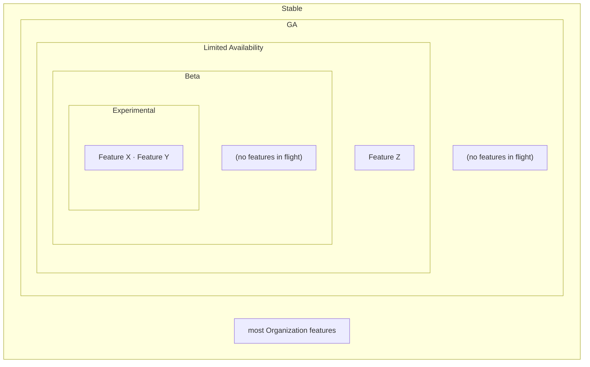
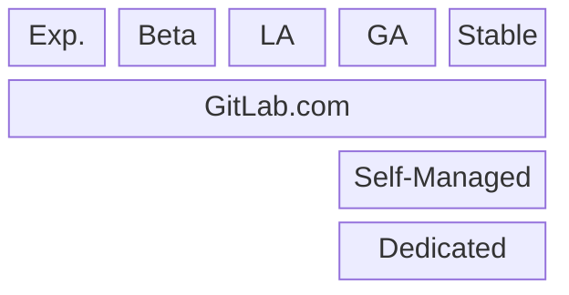
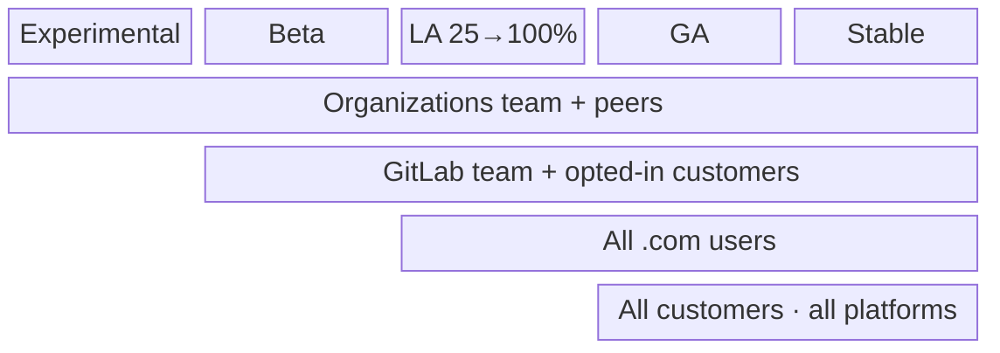

## Overview

Organization stages deviate considerably from company-wide practices. Providing a
formal structure around this helps guide work through a release tunnel so everyone
(ourselves, teams, customers) knows where things stand.

Organizations is a **surface** made up of many features, and those features aren't
necessarily at the same release stage at once. To a customer, the surface presents as a
single thing. For the development team it's layered — an **onion of stages**, each
reaching a broader audience and more platforms than the one before. A feature begins at the Experimental core and expands outward through the layers
as it matures, widening its audience and platform reach until it settles in the outer
Stable layer. Stages are transient: features pass through them quickly rather than accumulating, and
every feature eventually reaches Stable, no longer behind a feature flag.

The audience only ever grows, along two axes:

- **Segment** — who can reach the feature: the Organizations team, then GitLab team
  members and opted-in customers, then all GitLab.com customers, then everyone.
- **Platform** — where the feature runs: GitLab.com first, then GitLab Self-Managed and
  GitLab Dedicated at GA.

Each stage is a point on this growing surface. A higher stage widens the audience on one
or both axes and never narrows it — so access is cumulative, and a feature available to
an earlier, smaller segment keeps that access as it expands outward.

Each layer is a stage; the features shown inside are those currently in flight at that
stage. Layers are often sparse or empty — at any moment most features have already
expanded out to the Stable layer.

## Stage summary

A snapshot of each stage — its audience, feature flag, target platforms, and rollback:

| Stage         | Audience                               | Flag (`default_enabled`)              | Platforms                             | Handbrake                                              |
| ------------- | -------------------------------------- | ------------------------------------- | ------------------------------------- | ------------------------------------------------------ |
| Experimental  | Organizations team and selected peers  | `org_stage_experimental` (`false`) | GitLab.com                            | Flag (GitLab-operated)                                 |
| Beta          | GitLab team + opted-in customers       | `org_stage_beta` (`false`)         | GitLab.com                            | Flag (GitLab-operated)                                 |
| LA 25→100     | Customers, 25 / 50 / 75 / 100%         | `org_stage_la_25…100` (`false`)    | GitLab.com                            | Flag (GitLab-operated)                                 |
| GA            | Everyone                               | `org_stage_ga` (`true`)            | GitLab.com + Self-Managed + Dedicated | Retained — .com + Self-Managed; **inert on Dedicated** |
| Stable        | Everyone                               | *(flag removed)*                      | All platforms                         | None — permanent product                               |

## Stages

Work moves through five stages. Every stage runs on GitLab.com first; Self-Managed
and Dedicated only receive the feature once it reaches GA:

**Exp.** = Experimental · **LA** = Limited Availability (25 → 50 → 75 → 100%).

### 1. Experimental

- This stage "releases" to the Organizations team and selected peers on .com.
- All experimental work is behind an `org_stage_experimental` feature flag.
- This is a home for work that is incomplete because it's large and/or complex and
  requires iterative refinement. For example, onboarding, admin area, auth work.

### 2. Beta

- Releases to the GitLab team and opted-in customers on .com.
- Implemented behind an `org_stage_beta` feature flag.

### 3. Limited Availability (LA)

- Released to all .com users, in increments of 25%, 50%, 75%, 100%.
- Utilizes `org_stage_la_<increment>` feature flags.

### 4. Generally Available (GA)

- Released to all customers.
- Released across all platforms.
- GA is conceptually where a feature is released to **self-managed** (and Dedicated),
  which Organizations treats specially.
- Uses an `org_stage_ga` feature flag with `default_enabled: true`.
- The flag is retained as an emergency brake on .com and Self-Managed.
- On Dedicated the flag is effectively inert: because it is enabled by default, the
  feature is available, and Dedicated customers
  [cannot modify feature flags](https://docs.gitlab.com/subscriptions/gitlab_dedicated/#feature-flags).
  See also the developer guidance on
  [enabling features on Dedicated](https://docs.gitlab.com/development/enabling_features_on_dedicated/).

### 5. Stable

- A stage we define for internal discussion, but not important for customers.
- Ends the feature flag stage tunnel.
- Most of the Organization product ultimately lives here, no longer behind a flag.

## Moving through the stages

Features don't have to touch every stage. The default path is
Experimental → Beta → LA → GA → Stable, with a few rules:

1. **Experimental is optional** — skip it when appropriate; a feature can start at Beta.
1. **Beta is required** — don't skip it.
1. **LA must reach 100%** — intermediate increments (25 / 50 / 75) can be skipped, but a
   feature reaches LA 100% before GA.
1. **GA is not forced for every feature** — it's the important self-managed release point,
   but minor changes can settle straight into Stable.
1. **Progress features through stages with an MR, not ChatOps.** Moving a feature to the
   next stage is a code change (its stage flag membership), reviewed like any other.
1. **Don't let features linger.** A feature sitting in a stage is a smell — resolve it by
   moving it forward (or back). Stages can be disabled through ChatOps if we need to pull
   a whole layer (the same mechanism as the GA handbrake).



The rules above are the default path, not a hard requirement. High-risk features that
need fine-grained control over their rollout may deviate entirely — using their own
per-feature feature flags and a bespoke rollout plan instead of the shared stage flags.



## Release targets

Under this structure, we release to:

1. Selected customers in Beta.
2. All .com customers in LA 100.
3. All customers in GA.

Audience access is cumulative — each group joins one stage later and keeps access
through Stable, so GA and Stable serve everyone at once:

## Why this structure

These stages are more than a release mechanism — they are the shared structure the
Organizations team organizes its work around.

By defining a set of named stages with pre-defined audiences and target platforms, our
language, processes, and objectives are organized and aligned.

With pre-defined audiences and targets, we alleviate the burden of constantly redefining
audiences and platform targets on a per feature basis.

Under this model, responsibilities divide cleanly between the two functions, and each
can focus on moving work through the tunnel of stages:

- **Engineering** pushes code through the standardized release stages.
- **Product** aligns the stages across Engineering, other teams, and customers.

The pre-defined stages alleviate the burden and friction of creating and maintaining
feature flags. Today each engineer has to work out a feature's flag lifecycle
themselves: GitLab's standard incremental rollout doesn't fit Organization needs,
calculating state transitions per feature is unreasonably complicated, and that overhead
discourages using flags at all. Shared stage flags that features move through remove that
per-feature burden.

The experimental stage provides a bucket for engineering work to land that can't go
into beta. Without this stage we have work sitting stale as "incomplete" MRs.

## Relationship to the company-wide feature flag lifecycle

These stages sit on top of, and deviate from, GitLab's standard
[feature flag lifecycle](/handbook/product-development/how-we-work/product-development-flow/feature-flag-lifecycle/).
The standard process governs how individual features are flagged and rolled out; for
the Organizations surface we apply the additional structure described above. Where they
differ, this page governs Organizations work.

How we deviate:

- **Shared stage flags, not per-feature lifecycles.** Instead of every feature defining
  and driving its own feature-flag lifecycle, the surface uses a small, fixed set of
  named stage flags (`org_stage_experimental`, `org_stage_beta`,
  `org_stage_la_<increment>`, `org_stage_ga`). A feature moves through these flags
  as it matures, so engineers don't recompute a rollout plan — audiences, platforms,
  increments — for every feature.
- **Pre-defined audiences and platforms.** Each stage has a fixed audience and target
  platform set, so we don't redefine them per feature.
- **A retained GA "handbrake".** Rather than removing the flag shortly after rollout,
  the `org_stage_ga` flag is retained as a surface-wide emergency brake until the
  Stable stage.
- **An Experimental stage.** We add an explicit pre-Beta home for large/complex,
  incomplete work that isn't ready for Beta.

## Release stages in development

See [organizations release process](https://docs.gitlab.com/development/organizations/release_process/) for information on how to gate your feature using the Organization release stages.
