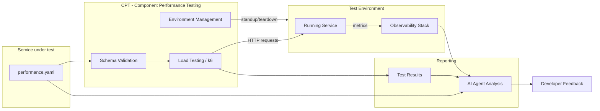
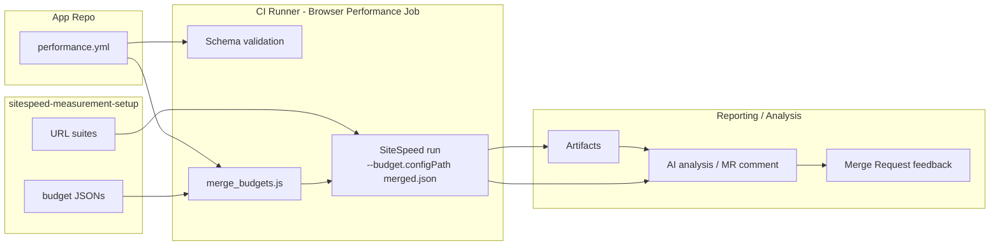

{}
This page documents the performance contract schema and adoption guide. For the full system design, rationale, and open decisions, see the [Performance Testing for Modular Features design document](/handbook/engineering/infrastructure-platforms/developer-experience/design-documents/performance_contracts/). The schema is being finalized in Milestone 1 and will be moved to its canonical repository location once environment tooling is selected in [#4407](https://gitlab.com/gitlab-org/quality/quality-engineering/team-tasks/-/work_items/4407).
{}

## Overview

Contract testing is the practice of defining the external surface of a service and writing a machine-readable "contract" that specifies how the service will behave. This approach provides several benefits:

- **Testable agreements** - Automated tests verify the contract hasn't been broken
- **Clear interfaces** - External services can design integrations with confidence
- **Breaking change detection** - Automated validation catches incompatible changes

Performance contracts extend this concept to the performance characteristics of a modular feature. By encoding performance targets into a validated YAML file (`performance.yaml`), teams gain:

- **Earlier regression detection** - Every MR is validated against the contract
- **AI-aware performance governance** - AI coding assistants have concrete, machine-readable performance rules
- **Standardized adoption** - Reusable contract schema and validation toolkit for any modular feature

## Scope

Performance contracts are scoped to modular feature services running in CI-accessible environments. For a full list of what is explicitly out of scope, see the [Performance Testing for Modular Features design document](/handbook/engineering/infrastructure-platforms/developer-experience/design-documents/performance_contracts/).

Key boundaries for the current iteration:

- **Not a production SLO tool** - Contracts inform SLOs but do not replace them
- **Not a local testing tool** - Contract tests run in CI against a transitory environment, not on a developer's laptop (planned for a future iteration)
- **Not a combination testing tool** - Each service contract is validated independently; cross-service integration performance is out of scope

## Contract Types

Performance contracts are implemented using multiple complementary tooling approaches depending on the type of workload and the metrics of interest. The three primary contract types we support are:

- **Frontend / UI contracts (SiteSpeed)** — page load and browser-level metrics (FCP, LCP, CLS, TBT, performance score, user journeys).
- **Backend / Service contracts (k6 / CPT)** — service-level latency and throughput under low-to-moderate load; k6 scenarios executed by CPT.
- **API / OpenAPI-derived contracts (TBD)** — automated generation of performance checks from OpenAPI specs; conceptual work in progress.

Each contract type shares the same canonical entry point (`performance.yml`) but maps to different execution tooling and CI patterns. The next sections describe the frontend SiteSpeed variant in detail and provide high-level notes for the backend and API approaches.

## Architecture

### Backend / Service Contracts

The performance contract system works as:



[CPT (Component Performance Testing)](https://gitlab.com/gitlab-org/quality/component-performance-testing) is the confirmed tool for environment management and test execution. CPT handles:

- **Environment lifecycle** - provisioning and teardown of GCP-hosted test environments (Docker container or CNG instance) per MR run
- **Load test execution** - running k6 tests against the service under test
- **MR feedback** - posting test results as comments on the triggering merge request

CPT will be extended in Milestone 2 to accept `performance.yaml` as input and dynamically generate k6 scenarios and thresholds from the contract. The schema validation approach (whether it lives inside CPT or a separate repo) is an open question being resolved in Milestone 2. See the [design document](/handbook/engineering/infrastructure-platforms/developer-experience/design-documents/performance_contracts/) for full rationale.

### Frontend / UI contracts

We support a lightweight, developer‑centric workflow for frontend performance contracts using SiteSpeed budgets. The key design choices are:

- Budgets live alongside the test URL lists in the `sitespeed-measurement-setup` repository under a `performance/` directory. This keeps URLs and budgets versioned together and makes local developer runs straightforward.
- The main repository contains a `performance.yml` entry that acts as the launching point for CI: it references the environment budget and optional per‑team budget files in the `sitespeed-measurement-setup` submodule.
- At CI runtime the chosen environment budget is merged with an optional per‑team budget. Merge semantics are deliberately simple: budgets use SiteSpeed's native nested format; team entries override environment entries at the metric level within each section, and URL/alias-keyed overrides are merged independently from global section defaults.
- MR‑level SiteSpeed runs are advisory by default (the MR job runs SiteSpeed locally in the pipeline using the Browser‑Performance pattern and the merged budget via `--budget.configPath`). MR runs are `allow_failure: true` and are opt‑in via an MR label or manual trigger.



Files and helpers in the `sitespeed-measurement-setup` repo (example layout):

```plaintext
performance/
  README.md
  schema/budget.schema.json
  budgets/
    default.json
    environments/{production,staging,mr}.json
    teams/{<team>.json}
  scripts/
    validate_budget.js
    merge_budgets.js
```

The `validate_budget.js` performs JSON Schema validation. `merge_budgets.js` produces a merged budget JSON implementing the team-overrides-environment semantics. CI should run the validator on PRs that change budgets.

Developer flow (summary):

1. Developers edit URL lists and budgets in `sitespeed-measurement-setup` and open an MR.
2. The MR job (opt‑in) merges the env + team budget, runs SiteSpeed locally in the job against the review app URL, and produces artifacts + a `browser_performance` report.
3. The job is advisory. Teams tune budgets iteratively before moving to stricter enforcement.

## The `performance.yml` Contract

The `performance.yml` file is the single entry point for the system - it drives contract tooling, load test execution, and AI analysis. It defines:

- Contract metadata (version, service identification and description)
- Frontend configuration (namespaced `frontend` object: budgets, teams, default_budget, optional `enabled`). Merge semantics for frontend budgets (team overrides environment on `(url,metric)` collisions) are part of how frontend budget objects are interpreted.
- Backend endpoint categories (named groups of routes with associated performance metrics such as latency_p95_ms, latency_p99_ms, error_rate_threshold)
  - Performance tiers (optional presets that provide starting-point metric values for common archetypes)
- Resource budgets (memory_limit_mb, cpu_limit_cores, connection_pool_max)
- SLI mapping (Prometheus metric names, label mappings, metrics_namespace/component)
- Validation/schema metadata (schema version and validator reference to ensure contracts conform to the expected shape)
- Additional subsystem metrics (database, external dependencies) that can be defined per-service when relevant

## Schema Definition

A `performance.yml` contract is composed of the following sections:

### Contract Definition (required)

This section provides tracking data about the schema and enables verifying that the contract is the current version.

```yaml
version: "1.0"
service:
  name: "example-service"
  description: "Example modular feature performance contract"
```

| element | description |
| ---- | ----------- |
| `version` | Schema version for compatibility tracking |
| `service` | Service identification (name, description) |

### Frontend: SiteSpeed performance budgets

We are piloting a frontend workflow using SiteSpeed budgets. The key idea is to keep the SiteSpeed URL suites and their budgets together in the `sitespeed-measurement-setup` repository so developers update URLs and budgets in the same PR. The main repo (root) will retain a `performance.yml` entry that points into the submodule to select environment and team budgets at CI runtime.

Example `performance.yml` entry (launch point — namespaced frontend config):

```yaml
frontend:
  enabled: true            # optional: presence of `frontend` can imply enabled; set false to opt-out
  budgets:
    production: testrunner/sitespeed-measurement-setup/performance/budgets/environments/production.json
    staging:   testrunner/sitespeed-measurement-setup/performance/budgets/environments/staging.json
    mr:        testrunner/sitespeed-measurement-setup/performance/budgets/environments/mr.json
  teams:
    rapid-diffs:
      url_dir: testrunner/sitespeed-measurement-setup/gitlab/desktop/urls
      budget:  testrunner/sitespeed-measurement-setup/performance/budgets/teams/rapid-diffs.json
  default_budget: mr
```

Notes on behavior:

- The CI runner merges the chosen environment budget and the optional per-team budget using a deterministic rule: budgets use SiteSpeed's native nested format; team entries override environment entries at the metric level within each section. URL/alias-keyed overrides (e.g. `"CodeReview_MR_List": { ... }`) are merged independently from global section defaults. The merged JSON is passed to SiteSpeed with `--budget.configPath`.
- MR-level runs are advisory (`allow_failure: true`) and run SiteSpeed locally in the Browser-Performance job pattern against the review-app URL. We intentionally avoid submitting MR runs to the central sitespeed-runway runner in the initial pilot to prevent data flooding while budgets are tuned.
- The `sitespeed-measurement-setup` repo contains example budget files, a JSON Schema, and two helper scripts (`validate_budget.js`, `merge_budgets.js`) under `performance/`. CI should run validation on budget file changes.

Note: the schema accepts a `frontend` object. The presence of the object implies frontend contracts are configured; the optional `enabled` boolean can be used to explicitly opt-out or opt-in when needed.

### Backend Endpoints

Each entry represents a category of endpoints with similar performance characteristics. Routes within a category share latency targets.

```yaml
endpoints:
  fast_reads:
    description: >
      Single item lookup by ID. Simulates one indexed DB read.
      This is the most common call pattern in the Artifact Registry.
    routes:
      - "GET /api/v1/items/{id}"
    metrics:
      latency_p95_ms: 100
      latency_p99_ms: 250
      error_rate_threshold: 0.001
```

Each endpoint category has the following elements:

| element | description |
| ---- | ----------- |
| `description` | human readable definition of the endpoint |
| `routes` | the API route to be tested |
| `metrics` | Performance targets measured against these routes |

#### Performance Tiers

Performance tiers provide starting-point defaults for common service archetypes. Select the tier that best matches your endpoint, then tune based on actual baseline data:

- **Tier 1: Fast Reads** - Simple reads with no database queries or minimal indexed lookups (health checks, status endpoints)

```yaml
metrics:
  latency_p95_ms: 100
  latency_p99_ms: 250
  error_rate_threshold: 0.001
```

- **Tier 2: Standard Reads** - Read operations involving database queries, joins, or moderate computation

```yaml
metrics:
  latency_p95_ms: 500
  latency_p99_ms: 1000
  error_rate_threshold: 0.005
```

- **Tier 3: Write Operations** - Write operations and multi-step transactions - create, update, delete endpoints, and operations that fan out to multiple services

```yaml
metrics:
  latency_p95_ms: 1500
  latency_p99_ms: 3000
  error_rate_threshold: 0.01
```

- **Tier 4: Git Operations** - Git protocol operations (clone, pull, push, ls-remote)

```yaml
metrics:
  latency_p95_ms: 5000
  latency_p99_ms: 10000
  error_rate_threshold: 0.001
```

### Resources

This section defines resource constraints for the test environment. Currently informational - enforcement is planned for a future iteration.

```yaml
resources:
  memory_limit_mb: 256
  cpu_limit_cores: 0.5
  # Maximum concurrent connections from the service's outbound pool.
  # Maps to bench.textproto Outbound.Backend.PoolConfig.max_open.
  connection_pool_max: 10
```

### Additional service metrics

Define metrics for any subsystems your service depends on in their own section. Currently informational - enforcement is planned for a future iteration.

If your service depends on a database, you can define it like:

```yaml
database:
  # Maximum query latency at the 95th percentile (milliseconds).
  query_latency_p95_ms: 30
  # Hard limit on DB queries per inbound request. N+1 queries violate this.
  max_queries_per_request: 5
```

### SLI mapping

Maps each contract endpoint category to the Prometheus metric names and label values emitted by the service via LabKit v2. This allows tooling (dashboards, alerting, validation scripts) to locate the right time-series without inspecting service source code.

```yaml
sli_mapping:
  metrics_namespace: gitlab
  component: api

  fast_read:
    requests_total_metric: gitlab_http_requests_total
    duration_metric: gitlab_http_request_duration_seconds
    endpoint_id_label: "GET /api/v1/items/{id}"
    feature_category_label: artifact_registry
```

#### LabKit v2 and SLI Mapping

LabKit v2 is GitLab's standard platform library for Go services. It provides the metric names, label conventions, and SLO-aligned histogram buckets that the `sli_mapping` section references directly. Any service already using LabKit can adopt a performance contract with zero instrumentation changes - the metrics it emits are automatically available in the observability stack for AI-assisted post-run analysis.

## Adoption Workflow

{}
The adoption workflow and tooling will be available in Milestone 2 (MVP). This section will be updated with detailed instructions once the tooling is ready.
{}

### Quick Start (Planned)

1. **Scaffold a contract** - Use the scaffolding CLI to generate a starter `performance.yaml`
2. **Customize targets** - Adjust latency, error rate, and resource targets based on your service characteristics
3. **Add CI integration** - Include the performance contract CI template in your `.gitlab-ci.yml`
4. **Validate and iterate** - Push changes and review contract validation results in your MR

### CI Integration (Planned)

```yaml
# .gitlab-ci.yml
include:
  - project: 'gitlab-org/quality/performance-contracts'
    file: '/templates/performance-contract.yml'
```

## Handling Metrics Not Yet in LabKit

{}
Guidance for handling performance aspects that LabKit does not yet emit metrics for is being developed in [#4406](https://gitlab.com/gitlab-org/quality/quality-engineering/team-tasks/-/work_items/4406).
{}

For performance aspects it does not yet cover:

- **Document the gap** - Note the missing metric in your contract with a comment
- **Use placeholder values** - Define targets based on expected behavior
- **Track instrumentation work** - Create issues to add missing metrics to LabKit
- **Validate post-deployment** - Use alternative validation methods until instrumentation is available

## AI Integration

Performance contracts integrate with GitLab Duo through a skill published to the [GitLab Skills repo](https://gitlab.com/gitlab-org/ai/skills). This gives AI coding assistants:

- Concrete, machine-readable performance rules
- Awareness of latency budgets and resource constraints
- Guidance on when to apply performance tests
- Links to functional contract testing for a complete structural + performance picture

## Related Resources

- **Epic**: [&387 Performance contracts for Modular Features](https://gitlab.com/groups/gitlab-org/quality/-/work_items/387)
- **Design document**: [Performance Testing for Modular Features - Design Decisions](/handbook/engineering/infrastructure-platforms/developer-experience/design-documents/performance_contracts/)
- **POC Repository**: [perf-contract-poc](https://gitlab.com/gl-dx/performance-enablement/demos/perf-contract-poc)
- **POC Walkthrough**: [Video walkthrough](https://drive.google.com/file/d/1bz2IwUE80H0MspLT0-TiFj3poWaEa9Cc/view?usp=drive_link)
- **Performance Testing Tools**: [Tool Selection Guide](/handbook/engineering/testing/performance-tools/)

## Feedback and Questions

This is an active development effort. For questions or feedback:

- Comment on [&387](https://gitlab.com/groups/gitlab-org/quality/-/work_items/387)
- Reach out to the Performance Enablement team
- Join the discussion in the `#g_performance-enablement` Slack channel
