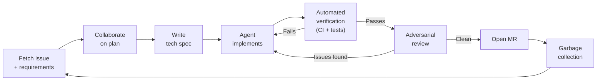
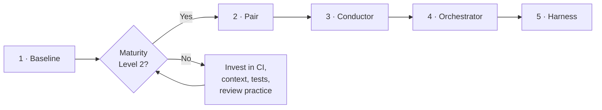
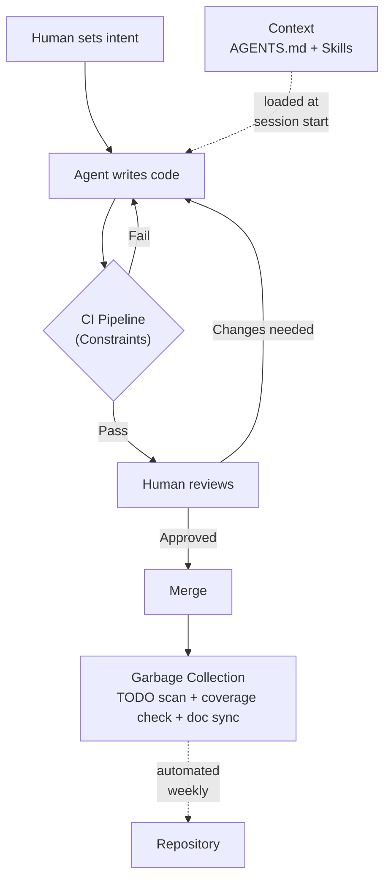

This playbook gives every R&D team a shared framework for working with AI coding agents. It covers how to assess readiness, what infrastructure to put in place, and how to get the most out of agent-assisted workflows.

## How it fits together

The components in this playbook connect into a repeatable workflow loop:



For GitLab Duo-specific practices, see [Duo-First Development](/handbook/engineering/workflow/duo-first-development/). For tool setup and tips, see [AI in Developer Experience](/handbook/engineering/infrastructure-platforms/developer-experience/ai/) and [AI at GitLab Tips](/handbook/tools-and-tips/ai/).

## Core principles

These five rules come from teams that have shipped production code with agents at GitLab (see [internal examples](#internal-examples)):

1. **Failing test before every feature.** Never give an agent a task without a failing test. The test defines "done" for the agent and catches regressions in CI.
2. **Fix the environment, not the prompt.** When an agent produces bad code, don't write a better prompt. Add a lint rule, a test, or a doc. Environment fixes persist across sessions; prompts don't.
3. **Constraints are multipliers.** One CI gate catches more bugs than a thousand lines of prompt instructions. Encode rules in CI, not in natural language.
4. **Repo is the single source of truth.** Architecture decisions, quality standards, and coding conventions belong in the repo where agents (and humans) can read them. Not in Slack, not in a Google Doc.
5. **Ask the agent to challenge you.** Agents are agreeable by default. Explicitly instruct them to find flaws in your plan, ask clarifying questions before implementing, and flag when your approach seems wrong. An agent that only executes your instructions is less valuable than one that pushes back. Encode this in your Skills or AGENTS.md so it applies every session.

## Autonomy levels

Not every repo is ready for the same level of AI involvement. These five levels describe a progression from autocomplete to autonomous agents.

| Level | Name | What the human does | What the agent does |
|---|---|---|---|
| 1 | **Baseline** | Writes everything | Autocomplete suggestions |
| 2 | **Pair** | Designs and reviews | Writes code |
| 3 | **Conductor** | Steers in a tight feedback loop | Executes a single task end-to-end |
| 4 | **Orchestrator** | Manages multiple async agents | Runs parallel workstreams |
| 5 | **Harness** | Sets architecture and quality bar | Everything else |

Skipping to level 4 or 5 without the right infrastructure produces unreliable output and amplifies technical debt. Reach Level 2 on the [maturity grid](#maturity-self-assessment) first.



## The harness

Three components that make agents produce reliable output. They form a loop: context feeds the agent, constraints validate its output, and garbage collection keeps the repo healthy between sessions.



### 1. Constraints — enforce in CI, not in prompts

Prompts are suggestions. CI is a gate. If the agent can break a rule and still pass the pipeline, the rule doesn't exist.

| What to enforce | Example |
|---|---|
| Layer boundaries | Structural test that fails if `app/models/` imports from `app/controllers/` |
| Forbidden patterns | Custom RuboCop cop that blocks `rescue => e` with empty body |
| API schemas | Contract test that validates request/response shapes against OpenAPI spec |
| Test count | CI job that fails if test count decreases without a `skip-test-count-check` label |
| Secrets and deps | Secret Detection + Dependency Scanning required to pass before merge |
| Domain-specific reviews | `.gitlab/duo/mr-review-instructions.yaml` with `fileFilters` scoped to your domain, and in particular security reviews |

**MR review instructions** let you codify domain rules that Duo enforces on every merge request. Define rules in `.gitlab/duo/mr-review-instructions.yaml`, scope them to specific file paths via `fileFilters`, and Duo will check every MR against them. See [Codifying Standards with MR Review Instructions](/handbook/engineering/infrastructure-platforms/developer-experience/ai/#codifying-standards-with-mr-review-instructions) for the full setup.

**Test count guard** prevents agents from deleting tests to make them pass (a known failure mode). A minimal CI job:

```yaml
test-count-guard:
  stage: verify
  script:
    - TEST_COUNT=$(grep -c "^--- PASS\|^--- FAIL" test-output.txt)
    - |
      if [ -f test-count-baseline.txt ]; then
        BASELINE=$(cat test-count-baseline.txt)
        if [ "$TEST_COUNT" -lt "$BASELINE" ]; then
          echo "Test count decreased from $BASELINE to $TEST_COUNT"
          exit 1
        fi
      fi
```

### 2. Context — three layers, repo is source of truth

Agents perform better when they understand your project before you start typing. Set up a three-layer context hierarchy:

| Layer | File | What goes in it |
|---|---|---|
| Global | `~/.claude/CLAUDE.md` | ~20 lines: your preferred style, global "never do" rules |
| Project | `AGENTS.md` at repo root | Build/test/lint commands, repo structure, conventions, off-limits files |
| Module | `AGENTS.md` in subdirectories | Package-specific rules (use sparingly) |

**Example `AGENTS.md`:**

```markdown
# Commands
- Run all tests: `bundle exec rspec`
- Run single test: `bundle exec rspec spec/path/to_spec.rb`
- Lint: `bundle exec rubocop -A`

# Repo structure
- Feature code: `app/`
- Specs mirror app structure in `spec/`
- Shared test helpers: `spec/support/`
- Database migrations: `db/migrate/` — never modify without explicit ask

# Conventions
- Prefer keyword arguments for methods with 3+ parameters
- All new endpoints need request specs
- Branch naming: `<type>/<issue-id>-short-description`

# Off limits
- Do not modify `.gitlab-ci.yml` without checking with the team
- Do not change files in `db/migrate/` unless explicitly asked
- Do not commit code with `binding.pry` or `debugger` statements
```

GitLab Duo Chat and most major AI tools ([Cursor, Copilot, Windsurf, Codex](https://agents.md/)) read `AGENTS.md` natively. For setup details, see [Baking Context into Repositories](/handbook/engineering/infrastructure-platforms/developer-experience/ai/#baking-context-into-repositories-with-claudemd-and-agentsmd). On GitLab project, a `.ai/agents.md` exists as root file.

**Skills** are reusable agent tasks stored in the repo — small markdown files with a name, description, and instructions. Use them for repeatable workflows:

```markdown
---
name: review-mr
description: Use this when asked to review a merge request
---
1. Read the MR diff using `glab mr diff <id>`
2. Check for: missing tests, silent error swallowing, n+1 queries
3. Write findings as MR comments using `glab mr comment <id>`
```

### 3. Garbage collection — automate maintenance

AI-generated code accumulates rot like any other code. Automate the cleanup:

| What | How | Cadence |
|---|---|---|
| Stale TODO/FIXME | CI job that scans and opens issues for unresolved TODOs | Weekly |
| Test coverage drift | MR comment warning when coverage drops | Every MR |
| Doc freshness | Compare doc last-modified dates against related code changes | Weekly |
| Dependency updates | Renovate or Dependabot | Weekly |
| Doc convergence | Agent loop that diffs docs against code and submits corrections ("Ralph pattern") | Weekly |

### Testing patterns for AI-assisted repos

Two testing patterns that are especially important when agents write code:

**Characterization tests** wrap existing behavior before a refactor. Ask the agent to generate tests that capture what the code does today, review them, and commit. Now the agent can refactor safely — any behavior change will fail CI.

```ruby
# Before refactoring a service, lock down its current behavior
RSpec.describe MyService do
  it "returns the expected response for a standard input" do
    result = described_class.new(user).execute
    expect(result.status).to eq(:success)
    expect(result.payload).to match(a_hash_including(id: user.id, role: "developer"))
  end

  it "returns an error for an invalid input" do
    result = described_class.new(nil).execute
    expect(result.status).to eq(:error)
    expect(result.message).to include("must be present")
  end
end
```

**Golden fixture tests** commit known-good output as fixture files and compare against them. Useful for API responses, serialized data, and any output that should stay stable:

```ruby
RSpec.describe "GET /api/v4/projects/:id" do
  it "matches the expected response shape" do
    get api("/projects/#{project.id}", user)

    expect(response).to have_gitlab_http_status(:ok)
    expect(json_response).to match_snapshot("project_response")
  end
end
```

For Go services, a common pattern is an `-update` flag that regenerates golden files when the output intentionally changes.

## Maturity self-assessment

Rate your repo on each dimension. Reach **Level 2 across all four** before moving past the Baseline autonomy level.

| Dimension | Level 0 — Not Ready | Level 1 — Basic | Level 2 — Solid | Level 3 — Optimized |
|---|---|---|---|---|
| **CI and Constraints** | No CI pipeline | CI exists, no custom rules | Linters + secret detection + dep scanning enforced | Custom rules, test-count guard, contract tests |
| **Context and Docs** | No AGENTS.md | AGENTS.md exists but vague | AGENTS.md + ARCHITECTURE.md | 3-layer hierarchy + DECISIONS.md + module docs |
| **Testing Depth** | No meaningful coverage | Unit tests exist | Integration + snapshot tests + golden fixtures | Characterization tests + test-count guard + contract tests |
| **Review Practice** | No review enforcement | Code review required but ad-hoc | CODEOWNERS + reviewer checklist | AI review in CI + author-reviewer separation |

## Efficiency techniques

### Git worktrees — parallel branches without context switching

Each branch gets its own working directory. Run an agent on one branch while you review another.

```shell
# Create a worktree for a feature branch
git worktree add ../my-feature feature-branch

# List all worktrees
git worktree list

# Clean up when done
git worktree remove ../my-feature
```

### Script everything

The cost of writing personal CLIs is near zero. Examples of things worth automating:

```shell
# Fetch an issue, analyse the relevant code, write findings to a file
glab issue view 12345 -R gitlab-org/gitlab -F json | \
  claude "Read this issue. Find the relevant code. Write your analysis to analysis.md"

# Set up a local MR review environment
glab mr checkout 98765 && bundle exec rspec
```

### Keep the context window tight

Agents consume tokens. Only send them actionable information.

**Skills vs. MCP:** A skill is two lines (name + description) and loads instantly. An MCP tool definition (like `glab`) can consume ~30k input tokens. Use skills for focused, repeatable tasks. Use MCP when the agent needs live access to external systems like GitLab API.

**Feedback scripts:** When running agents in a loop, don't pipe raw terminal output. Filter to only failed tests and lint errors:

```shell
# Bad: agent sees 500 lines of passing tests
bundle exec rspec

# Good: agent only sees failures
bundle exec rspec --format documentation --failure-exit-code 1 2>&1 | grep -A 5 "FAILED\|Error"
```

**Plan mode:** Separate discovery from execution. Use your tool's native plan mode, or have the agent write a `plan.md` before coding. This prevents the agent from burning context on exploration during implementation.

### Use role-based personas for different phases

Don't use AI as one generic assistant across the full workflow. Switch its role explicitly for each phase:

| Phase | Persona | Instruction style |
|---|---|---|
| Discovery / planning | Product manager + architect | "Challenge my assumptions. Find gaps. Ask clarifying questions before suggesting a solution." |
| Implementation | Engineer | "Implement the spec. Fail fast. Run tests after every change." |
| Verification | Tester | "Try to break this. Find edge cases the implementation doesn't handle." |
| Pre-merge review | Adversarial reviewer | "Find every problem you can — security holes, missing tests, incorrect assumptions. Do not be encouraging." |

Encode each persona as a Skill so it loads consistently. A single session trying to do all four roles at once produces mediocre output for each.

### Let AI improve its own instructions

`AGENTS.md` and skills are just markdown. When an agent finds a better way to do something, let it update its own instructions. The next session starts with improved context.

#### Session learning log

Alongside `AGENTS.md`, maintain a git-ignored file (e.g. `AGENTS.local.md`) as a running log of problems the agent encountered and how they were resolved. Ask the agent to append to it whenever it hits a dead end, discovers an undocumented constraint, or finds a fix it had to figure out from scratch.

```markdown
# Session learnings

## 2024-03-15 — RSpec shared context loading order
Problem: Agent kept failing specs because it loaded shared contexts after the subject was defined.
Fix: Always require `spec/support/shared_contexts` at the top of the spec file, not inline.
Rule added to AGENTS.md: yes

## 2024-03-18 — GraphQL mutation naming convention
Problem: Agent used `UpdateFoo` mutation name; CI rejected it because the convention is `FooUpdate`.
Fix: Added naming rule to AGENTS.md under Conventions.

Over time this log becomes the institutional memory of every non-obvious thing the agent had to learn — and prevents it from making the same mistake twice.
```

### Ask, don't search

If you can't find the answer in 10 seconds, open a terminal tab and ask the agent. No question is too small. Agents are faster than grep for questions like "where does this service handle retries?" or "what's the test pattern for this module?"

### Stay out of the loop

Don't manually test during the agent's working cycle. You are the slowest part of the loop. Reserve your time for design decisions and code review. The agent can check web pages and terminal output on its own.

## Getting started

Pick one repo. Do these four things this week:

1. **Run the maturity assessment.** Score your repo on the [grid above](#maturity-self-assessment). Share results with your team.
2. **Create `AGENTS.md`.** Add build/test/lint commands, repo structure, conventions, and off-limits files. Use the [example above](#2-context--three-layers-repo-is-source-of-truth) as a starting point, or run `/init` in Claude Code to generate a draft.
3. **Add one CI constraint.** Pick the lowest-hanging fruit: enable Secret Detection, add a linter, or add a test-count check.
4. **Write one AI-assisted test.** Pick a complex function. Ask your AI tool to generate a characterization test. Review it, fix it, commit it.

## Internal examples

- [Knowledge Graph Orbit](https://gitlab.com/gitlab-org/orbit/knowledge-graph/-/work_items/163) — 135K-line Rust codebase, 95% AI-generated, 4 engineers, 259 MRs, 2 weeks. Worked because CI, AGENTS.md, and architecture docs were in place from day one.
- [IAM project harness setup](https://gitlab.com/gitlab-org/gitlab/-/work_items/594545) — Go service: AGENTS.md with package map, golden fixture tests, MR review instructions, test count guard, CODEOWNERS.
- [Monolith auth harness setup](https://gitlab.com/gitlab-org/gitlab/-/work_items/594546) — Ruby monolith: module-level AGENTS.md, domain-scoped MR review instructions, characterization tests, maturity gap analysis.
- [DevEx team AI workflows](/handbook/engineering/infrastructure-platforms/developer-experience/ai/) — AI-assistance labels on MRs, MR review instructions in YAML, GitLab MCP server setup, AGENTS.md patterns.
- [Duo-First Development](/handbook/engineering/workflow/duo-first-development/) — standard practices for using Duo across issue creation, MR generation, code review, test generation, and documentation.

## External references

- [AI-Assisted Development Playbook (slides)](https://docs.google.com/presentation/d/111w5pTW5G-yUCrF2M_GTVa7U-NaTo1M-6NtOCVVLoHs/edit?slide=id.g3d25f169cfe_0_649#slide=id.g3d25f169cfe_0_649) — the original slide deck this page is based on
- [AGENTS.md open standard](https://agents.md/) — spec and tool compatibility matrix
- [GitLab Duo documentation](https://docs.gitlab.com/ee/user/gitlab_duo/)
- [GitLab MCP server setup](https://docs.gitlab.com/user/gitlab_duo/model_context_protocol/mcp_server/)
- [AI Coding Rules Rollout Playbook](https://aicodingrules.com/blog/ai-coding-rules-rollout-playbook) — 30-day rollout cadence for engineering teams
- [AGENTS.md patterns that change agent behavior](https://blakecrosley.com/blog/agents-md-patterns) — what works and what gets ignored
