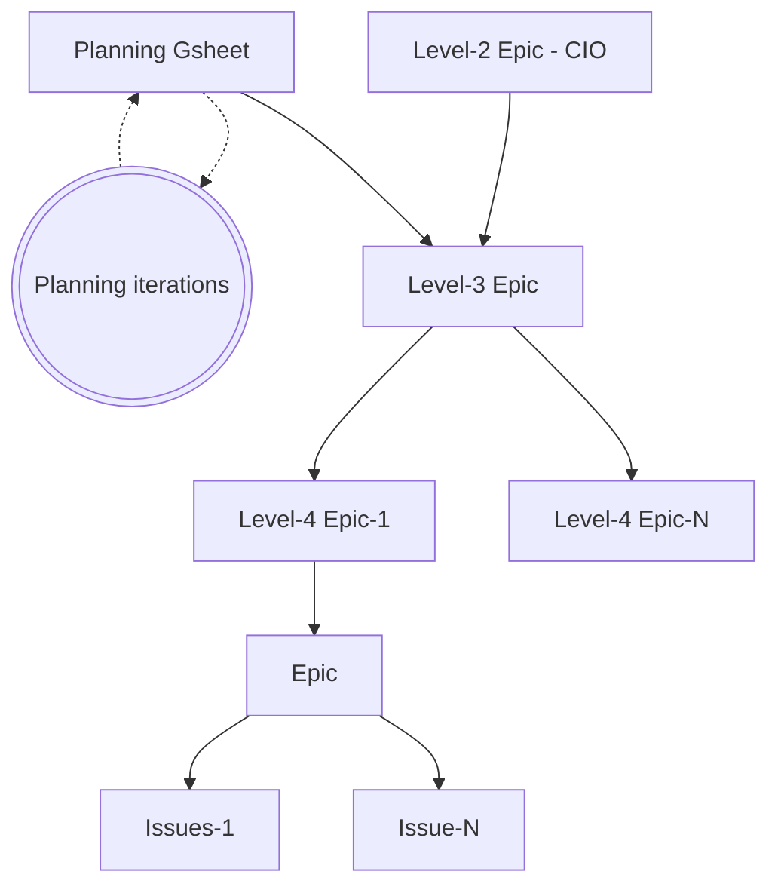

## Data Team Planning Process

The Data Team Planning Process is a pre-set activity that happens every quarter. The Planning Process adheres to [GitLab's operating model](https://internal.gitlab.com/handbook/company/gitlab-operating-model/) for prioritization and alignment. This page describes the specifics and details applicable to the Data Team planning process.

## Quarterly Planning

Data Team [Level-3 Epics](https://internal.gitlab.com/handbook/company/gitlab-operating-model/gitlab-operating-model-epics/) will align with divisional and company initiatives. For foundational improvements/infrastructure development, the Data Team will also create Level-3 Epics even if these Level-3 Epics are not easy to map. Overall, Level-3 Epics constitute 50-60% of the Data Team's Quarterly Capacity, with Production Maintenance as the only established higher priority. Business Operations work will planned during iteration planning based on available capacity.

Currently we use a [gSheet](https://docs.google.com/spreadsheets/d/1GdxyiAsgRiIFGN9w6z0pndL0GCZNwSJULHxstz1k72U/edit?usp=sharing) predominantly for team member capacity calculation. Data Team Level-3 Epics are **managed** with [GitLab Epics](https://gitlab.com/groups/gitlab-operating-model/-/work_items).

### Planning Level-3 Epics

Level-3 Epics are drafted in collaboration with our Business Partners and every Level-3 Epic that is put up for scheduling must have an opportunity canvas, see the [project intake](/handbook/enterprise-data/how-we-work/#project-intake). Everyone at GitLab is welcome to [open](https://gitlab.com/gitlab-data/analytics/-/blob/master/.gitlab/issue_templates/%5BNew%20Request%5D%20Create%20Opportunity%20Canvas.md?ref_type=heads) an opportunity canvas and we ask the Data Team members to contribute to the planning process by updating the gSheet with their initiatives if they think they are important and should be considered for scheduling. This collaborative approach ensures that all team members have a voice in the planning process and can contribute their insights and expertise.

### Prioritization

The Data Team uses a prioritization framework to ensure that we focus on the most impactful work. Our prioritization process takes into account several factors:

1. Strategic Alignment: How well does the work align with GitLab's overall strategy and goals?
2. Time Criticality: How urgent is the work?
3. Revenue or Efficiency Impact: What is the potential financial impact of the work?
4. Regulatory or Legal Impact: Are there any compliance or legal requirements that necessitate this work?

We use a scoring system to evaluate each of these factors, which helps us calculate a priority score for each piece of the work. The priority score is calculated as follows:

priority_score = `(Strategic Alignment + Time Criticality + Revenue or Efficiency Impact + Regulatory or Legal Impact) / Job Size`

Note: Carry-over Level-3 Epics are prioritized (if still applicable) as we want to complete ongoing work first to achieve results.

#### Scoring breakdown

Value drivers:

| Value                        | Weight  | 1                 | 2                    | 3                             | 4                               | 5                               |
| -----------------------------| ------- | ----------------- | -------------------- | ----------------------------- | ------------------------------- | ------------------------------- |
| Strategic Alignment          | 30%     | Team              | Department           | Division                      | Multiple Divisions              | Enterprise                      |
| Time Criticality             | 40%     | Nice to have      | within the next year | within the next 6 months      | within next quarter             | urgent ASAP                     |
| Revenue or Efficiency Impact | 20% | < $5k | < $50k | < $500k | < $5 M| > $5M |
| Regulatory or Legal Impact   | 10%     | None/Nice to Have | Must Have            | Fine and/or Brand Damage <$1M |  Fine and/or Brand Damage <$10M | Fine and/or Brand Damage > $10M |

| Value        | 1  | 2 | 3 | 4 | 5  | 6   |
| ------------ | -- | - | - | - | -- | --- |
| T-Shirt Size | XS | S | M | L | XL | XXL |

As the Job size is an important factor, we encourage breaking up Level-3 Epics (over multiple quarters) which aligns with GitLab's value of [iteration](/handbook/values/#iteration) with a clear definition of done that defines the scope for that quarter.

#### T-Shirt Sizing Approach

We use a T-Shirt sizing approach for quickly sizing the work required to deliver new issues, epics, and longer-term initiatives. The T-Shirt sizing approach is designed to support work breakdowns towards the creation of detailed work plans, but also intended to provide a sufficient level of detail to manage overall scope.

| Size | Dedicated Person Time | Weight (issue points) | Examples |
| :--: | :--: | :-- | :-- |
| XS | 1/2 Day | 1 | Update existing handbook page. #data research/response. New Trusted Data Test. Opening AR to get access to a data source. |
| S | 1 Day | 2-3 | New handbook page; typical triage issue. New dashboard on top of existing models. Align on data scope for new data source. |
| M | 1 Week | 5-8 | New dashboard requiring new models. New data source with Stitch or Fivetran. |
| L | 2-3 Weeks | 13 | New fact table implementation & testing. Full XMAU solution. |
| XL | 1-2 Months | 26 | New Data Pump to new system. New Data Source with complex source API. |
| XXL | 2-4 Months | 52+ | New Dimensional Model subject area with New Data Sources. |

#### Assigning Level-3 Epics

We encourage all Data Team Members to add their name to an initiative in the sheet for the upcoming quarter (`Column F` - `Data Team DRI`) if they prefer to get a particular Level-3 Epic assigned to them. Possible reasons (not limited) to indicate you are interested in a specific Level-3 Epic include alignment with your experience and expertise, previous work in that area, or the aspiration to learn more about it. You can also discuss with your manager the Level-3 Epics you are interested in contributing to when you add your name as a Data Team DRI. It is not a guarantee it will be assigned, as this depends on other factors as well.

Assigning Level-3 Epics will happen towards the end of the quarter by adding team members and issue points `Columns Q - X` to the Level-3 Epics.

### Data Platform Vision and Level-3 Epics

Although we encourage everyone within the team to contribute, Staff+ [level](/handbook/enterprise-data/organization/#data-roles-and-career-development) Data Team Members in particular are expected to contribute to the long-term vision and strategic direction of the Data Program. This means ensuring that we meet the evolving needs of our Business Partners by translating these into initiatives and opportunity canvases.

Key aspects include:

1. Translate company objectives into Data Products
1. Understanding our Business Partners' challenges
1. Identifying emerging technologies and trends in data engineering
1. Assessing current platform limitations and areas for improvement
1. Aligning platform development with overall company strategy
1. Proposing innovative solutions to enhance data processing, storage, and analysis capabilities
1. Collaborating with other teams to understand their evolving data needs

The resulting initiatives from these discussions are integrated into the quarterly planning process, ensuring that the Data Platform's development is aligned with both immediate business needs and long-term strategic goals.

### Level-3 Epic Tracking and Reporting

We use GitLab Epics to monitor progress throughout the quarter. Each Level-3 Epic's progress is updated weekly in the Epic. The designated Data Team Sponsor is responsible for providing a written update in the epic, including health status and actual metrics.

#### Level-4 Epics

In FY27Q1 planning cycle we learned that we had Level-3 Epics defined at too granular a level. In FY27Q2 we will introduce Level-4 Epics. The following structure will apply, where in FY27Q1 the Level-4 Epic level is skipped.

##### Level-3 Epic Structure

## Work Breakdowns

Work breakdowns are always developed as a result of the Quarterly Planning Process, but can also be leveraged to help scope and plan new initiatives, infrastructure projects, and similar multi-person or multi-week projects. The outcome of the work breakdown is a detailed description of the work to be performed, deliverables, responsibilities, and a high-level timeline.

As a part of the Quarterly Planning Process, work breakdowns are linked to the Level-3 Epic Description.

Work Breakdowns consider the following inputs:

1. Defined upcoming Level-3 Epics
2. Level-3 Epic Reviews
3. New / forward looking insights
4. Team availability
5. Team member ambitions

**The work breakdown is team effort and everyone is encouraged to contribute.**

### Twice-Weekly Iteration Planning

The data team works in two-week intervals, called iterations. Iterations start on Wednesdays and end on Tuesdays. This discourages last-minute merging on Fridays and allows the team to have iteration planning meetings at the top of the iteration.

Iteration planning should take into consideration:

- vacation timelines
- conference schedules
- team member availability
- team member work preferences (specialties are different from preferences)

The timeline for Iteration planning is as follows:

- Meeting Preparation - Responsible Party: Iteration Planner
  - Investigate and flesh out open issues.
  - Assign issues to the iteration based on alignment with the Team Roadmap.
  - Note: Issues are not assigned to an individual at this stage, except where required.

| Day               | Current Iteration                                                                                                                                            | Next Iteration                                                                                                                                                                                                             |
| ----------------- | ------------------------------------------------------------------------------------------------------------------------------------------------------------ | -------------------------------------------------------------------------------------------------------------------------------------------------------------------------------------------------------------------------- |
| 0 - 1st Wednesday | **Iteration Start**                         | -                                                                                                                                                                                                                        |
| 7 - 1st Tuesday   | **Midpoint**   Any issues that are at risk of slipping from the iteration must be raised by the assignee                                               | -                                                                                                                                                                                                                        |
| 10 - 2nd Friday   | **The last day to submit MRs for review**   MRs must include documentation and testing to be ready to merge   MRs are preferably not to be merged on Fridays (unless there is urgency, i.e. P1-Ops related MRs or in cases with tight timelines) to minimise impact on days where there is limited team member availability. | **Iteration is roughly final**   Iteration Planner verifies issue priority and team capacity for next iteration.                                                                                                     |
| 13 - 2nd Monday   | **Last day of Iteration**   Ready MRs can be merged                                                                                                    | -                                                                                                                                                                                                                        |
| 14 - 2nd Tuesday  | **Meeting Day**    All unfinished issues either need to be removed from iterations or rolled to the next                                               | **Iteration Planning**    Sync-meeting to perform retro perspective on the current iteration and align/start on the next iteration according to the created iteration planning. All unfinished issues either need to be removed from iterations or will be automatically rolled to the next |
