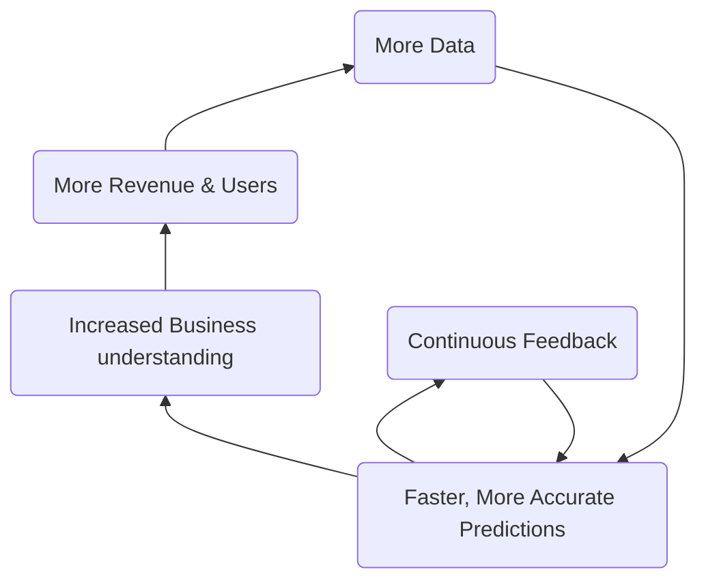
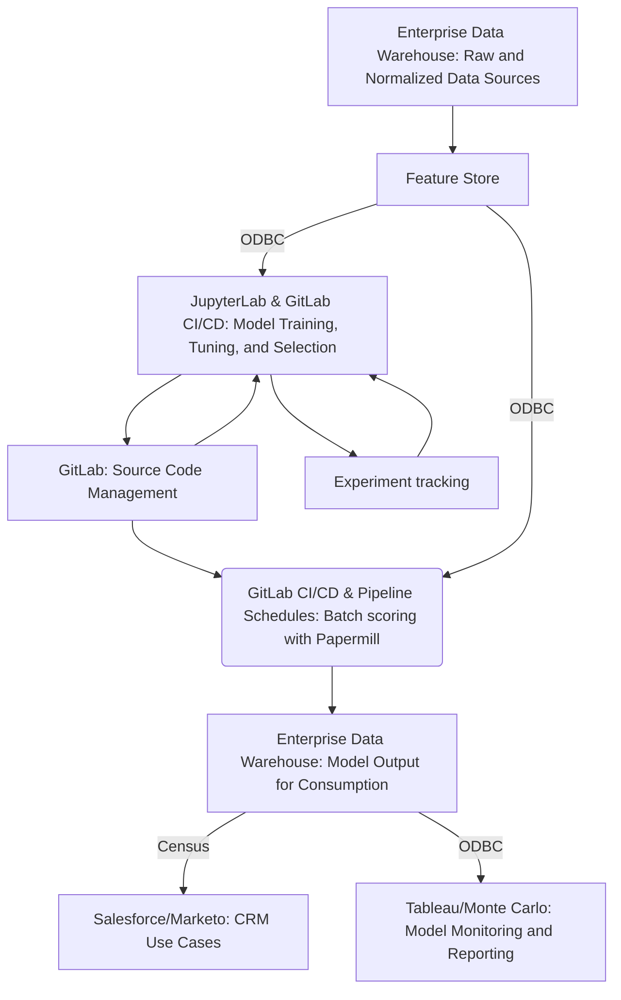

## The Enterprise Data Science Team at GitLab

The mission of the Data Science Team is to facilitate ***making better decisions faster*** using ***predictive analytics***.

## Handbook First

At GitLab we are [Handbook First](/handbook/about/handbook-usage/#why-handbook-first) and promote this concept by ensuring the data science team page remains updated with the most accurate information regarding data science objectives, processes, and projects. We also strive to keep the handbook updated with useful resources and our data science toolset.

{}
[Visit Slack #data-science](https://gitlab.slack.com/archives/C01AJB3KJRZ), [watch a Data Team video](https://www.youtube.com/playlist?list=PL05JrBw4t0KrRVTZY33WEHv8SjlA_-keI). We want to hear from you!
{}

## Data Science Responsibilities

The Data Science Team is **directly responsible** for:

- Delivering *descriptive*, *predictive*, and *prescriptive* solutions that promote and improve [GitLab's KPIs](/handbook/company/kpis/)
- Being a ***Center of Excellence*** for predictive analytics and supporting other teams in their data science endeavors
- Developing tooling, processes, and best practices for data science and machine learning

Additionally, the Data Science Team **supports** the following responsibilities:

- With **Data Leadership**:
  - Scoping and executing a data science strategy that directly impacts business KPIs
  - Broadcasting regular updates about deliverables, ongoing initiatives, and roadmap
- With the [**Data Platform Team**](/handbook/enterprise-data/organization/engineering/):
  - Defining and championing data quality best practices and programs for GitLab data systems
  - Deploying data science models, ensuring data quality and integrity, shaping datasets to be compatible with machine learning, and bringing new datasets online
  - Creating data science pipelines that work natively with the GitLab platform and the Data Team tech stack
- With the [**Data Analytics Team**](/handbook/enterprise-data/organization/analytics/):
  - Incorporating data science into analytics initiatives
  - Designing dashboard to enhance the value and impact of the data science models

## How We Work

As a Center of Excellence, the data science team is focused on working collaboratively with other teams in the organization. This means our stakeholders and executive sponsors are usually in other parts of the business (e.g. Sales, Marketing). Working closely with these other teams, we craft a [project plan](/handbook/enterprise-data/organization/data-science/project_dev_approach/#3c-modeling--implementation-plan) that aligns to their business needs, objectives, and priorities. This usually involves working closely with functional analysts within those teams to understand the data, the insights from prior analyses, and implementation hurdles.

The Data Science flywheel is focused on improving business efficiency and KPIs by creating accurate and reliable predictions. This is done in collaboration with [Functional Analytics Center of Excellence](/handbook/enterprise-data/how-we-work/functional-analytics-center-of-excellence/) to ensure the most relevant data sources are utilized, business objectives are met, and results can be quantifiably measured. As business needs change, and as the user-base grows, this flywheel approach will allow the data science team to quickly adapt, iterate, and improve machine learning models.

### Data Science Initiatives

Examples of current Data Science initiatives include:

- Revenue Expansion
- Churn Reduction
- Improved Forecasting
- Customer Health
- MLOps with GitLab

Please refer to the [Data Science Initiatives Internal Handbook](https://internal.gitlab.com/handbook/enterprise-data/organization/data-science-enterprise-analytics/data-science-initiatives) for up-to-date information on all our on-going and planned projects.

## Project Structure

The Data Science Team follows [Cross-Industry standard process for data mining (CRISP-DM)](https://en.wikipedia.org/wiki/Cross-industry_standard_process_for_data_mining), which consists of 6 iterative phases:

1. **Business Understanding**

    - Includes requirements gathering, stakeholders interviews, project definition, product user stories, and potential use cases in order to establish success criteria of the project.

1. **Data Understanding**

    - Requires determining the breadth and scope of existing relevant data sources. Data scientists work closely with data engineers and data analysts to determine where gaps may exist and to identify any data discrepancies or risks.

1. **Data Preparation**

    - Requires conducting data quality checks and exploratory data analysis (EDA) to develop a greater understanding of data and how different datapoints relate to solving the business need.

1. **Modeling**

    - Machine learning techniques are used to find a solution that addresses the business need. This often takes the form of predicting why/when/how future instances of a business outcome will occur.

1. **Evaluation**

    - Performance is generally measured by how *accurate*, *powerful*, and *explainable* the model is. Findings are presented to the stakeholders for feedback.

1. **Deployment**

    - Once the model has been approved it then gets deployed into the data science production pipeline. This process automatically updates, generates predictions, and monitors the model on a regular cadence.

### The GitLab approach

The [Data Science Team approach to model development](/handbook/enterprise-data/organization/data-science/project_dev_approach/) is centered around GitLab's value of [iteration](/handbook/values/#iteration) and the CRISP-DM standard. Our process expands on some of the 6 phrase outlined in CRISP-DM in order to best address the needs of our specific business objectives and data infrastructure.

## Data Science Platform

Our current platform consists of:

- the [Enterprise Data Warehouse](/handbook/enterprise-data/platform/) for storing raw and normalized source data as well as final model output for consumption by downstream consumers
- [JupyterLab](/handbook/enterprise-data/platform/jupyter-guide/) and VSCode for model training, tuning, and selection
- [GitLab](https://gitlab.com/) for collaboration, project versioning, and score code management, [experiment tracking](https://docs.gitlab.com/user/project/ml/experiment_tracking/), and [CI/CD](https://docs.gitlab.com/ee/ci/)
- [GitLab CI](/handbook/enterprise-data/platform/ci-for-ds-pipelines/#our-approach-to-using-cicd-for-machine-learning) for automation and orchestration
- [Snowflake Feature Store](https://docs.snowflake.com/en/developer-guide/snowflake-ml/feature-store/overview) as a an open-source Feature Store for Machine Learning models
- [Monte Carlo](https://getmontecarlo.com/) for drift detection
- Tableau Server for model monitoring and on-going performance evaluation

### Current State Data Flows

### Feature Store

We use the Snowflake Feature Store to create and serve features for our machine learning models.
Configuration can be found on [the feature store project repository](https://gitlab.com/gitlab-data/data-science-projects/snowflake-feature-store/). Updating the feature store is done using GitLab CI/CD.

More details on how to create and serve features can be found on the [Feature Store handbook page](/handbook/enterprise-data/platform/feature-store/)

### CI/CD Pipelines for Data Science

We deploy all of our models using the native GitLab CI/CD capabilities. Please see [Getting Started With CI/CD for Data Science Pipelines](/handbook/enterprise-data/platform/ci-for-ds-pipelines/) for the most up-to-date information and instructions on how to deploy models with CI/CD

### Data Science Tools at GitLab

- **[Pre-configured Data Science Environment](https://gitlab.com/gitlab-data/data-science)**: The data science team uses JupyterLab pre-configured with common python modules (pandas, numpy, etc.), native Snowflake connectivity, and git support. Working from a common framework allows us to create models and derive insights faster. This setup is freely available for anyone to use. Check out our [Jupyter Guide](/handbook/enterprise-data/platform/jupyter-guide/) for additional information.
- **[GitLab Data Science Tools for Python](https://gitlab.com/gitlab-data/gitlabds/)**: Functions to help automate common data prep (dummy coding, outlier detection, variable reduction, etc.) and modeling tasks (i.e. evaluating model performance). Install directly via [pypi](https://pypi.org/project/gitlabds/) (`pip install gitlabds`), or use as part of the above Data Science Environment.
- **[Modeling Templates](https://gitlab.com/gitlab-data/data-science/-/tree/main/modeling_templates)**: The data science team has created modeling templates to allow you to easily start building predictive models without writing python code from scratch. To enable these templates, follow the instructions on the [Jupyter Guide](/handbook/enterprise-data/platform/jupyter-guide/#enabling-jupyter-templates).
