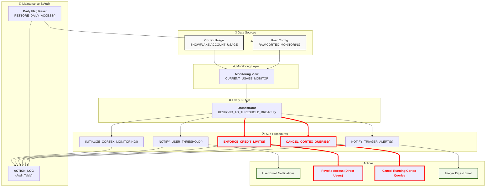
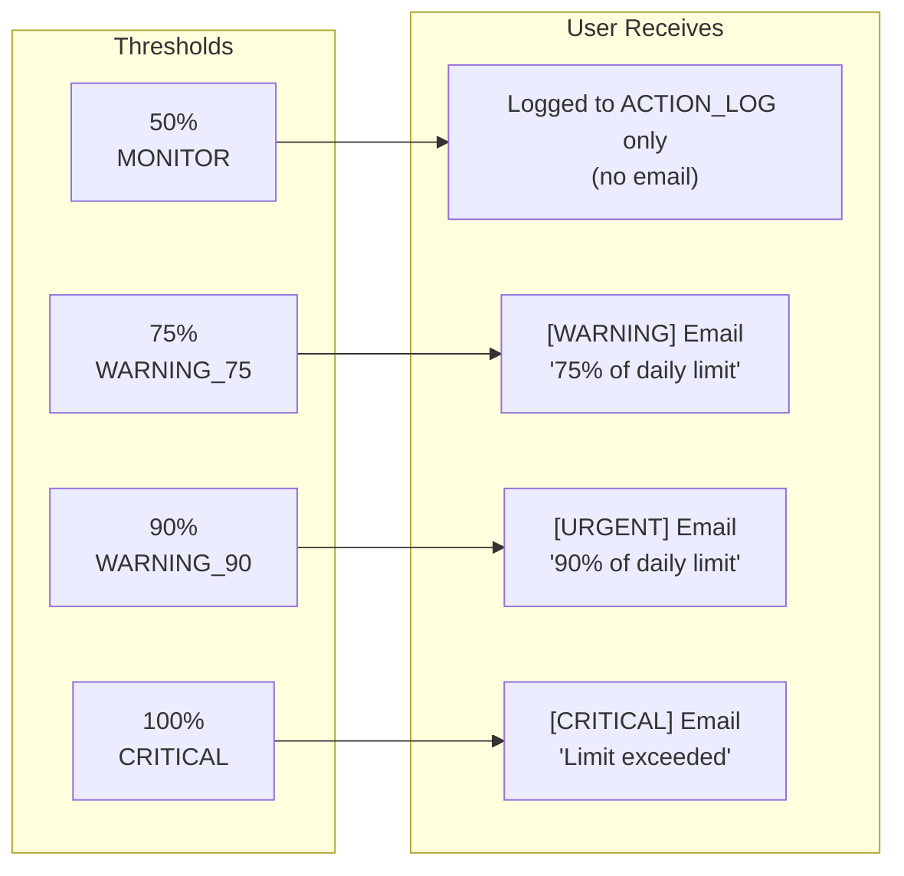
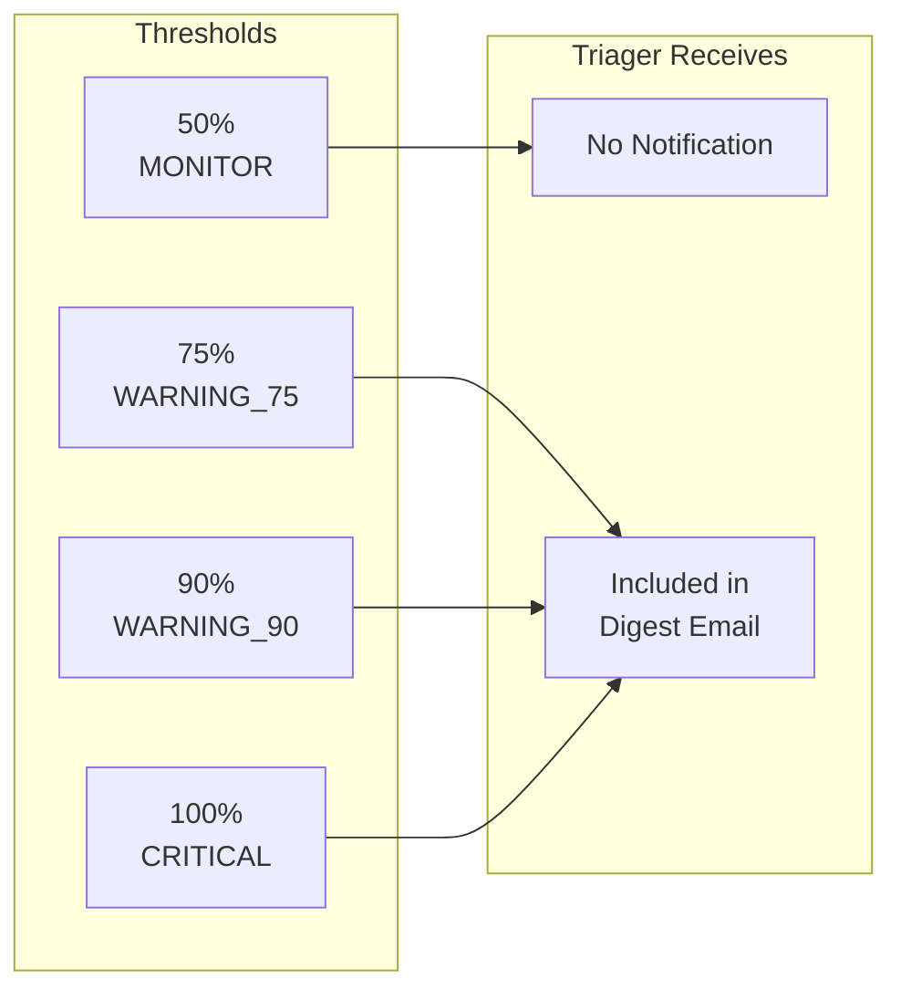
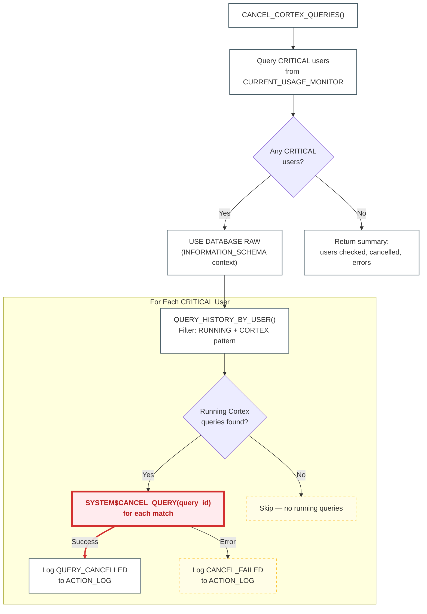

## Table of Contents

1. [Overview](#overview)
2. [How to Get Cortex AI Access](#how-to-get-cortex-ai-access)
3. [Architecture](#architecture)
4. [Database Objects](#database-objects)
5. [Access Classification](#access-classification)
6. [Notification Logic](#notification-logic)
7. [Stored Procedures](#stored-procedures)
8. [Scheduled Tasks](#scheduled-tasks)
9. [Setup and Configuration](#setup-and-configuration)
10. Runbook & Troubleshooting Guide

---

## Overview

The Cortex AI Credit Monitoring System tracks and controls Snowflake Cortex AI credit consumption across all users. Access to Cortex AI is granted via the **`CORTEX_FUNCTIONS`** account role — see [How to Get Cortex AI Access](#how-to-get-cortex-ai-access) below.

It provides:

- Real-time usage monitoring through `CORTEX_AISQL_USAGE_HISTORY`, `CORTEX_AGENT_USAGE_HISTORY`, `CORTEX_ANALYST_USAGE_HISTORY`, and `CORTEX_CODE_CLI_USAGE_HISTORY`
- Automated user discovery via recursive role hierarchy traversal (up to 10 levels deep)
- Tiered monitoring and alerting with the following behavior:
  - **50% (MONITOR)**: Logged to `ACTION_LOG` only — no email sent
  - **75% (WARNING_75)**: Email notification sent to user + included in triager digest
  - **90% (WARNING_90)**: Urgent email sent to user + included in triager digest
  - **100% (CRITICAL)**: Critical email sent to user + included in triager digest + **access revoked** (DIRECT users) or **flagged for manual review** (INHERITED users)
- Automated access revocation for DIRECT users exceeding 100% of their daily limit (revokes the `CORTEX_FUNCTIONS` role)
- Escalation workflows for INHERITED users (cannot auto-revoke — triager notified for manual intervention)
- Daily flag reset at midnight UTC (access restoration for revoked users is via Permifrost)
- Separated architecture for maintainability and flexibility
- Automatic cancellation of in-flight Cortex queries for CRITICAL users via `SYSTEM$CANCEL_QUERY` (prevents residual cost from running queries after enforcement)

⚠️ Tableau and BI Tools: Do Not Call AI Functions Directly

Snowflake Cortex AI functions must not be called directly from Tableau or any other BI tool. Doing so causes AI functions to rerun on every query execution, which generates unpredictable costs and inconsistent results. See [here](/handbook/enterprise-data/platform/snowflake/snowflake-ai-function/snowflake-ai-function/#purpose) for more information.

## High Level overview of the process

Our monitoring system monitors tokens and credit usage for Snowflake Cortex functions, notifies team members if they are reaching their limits, and revokes access temporarily for the day (restored at 3:00 AM UTC) automatically if they exceed their limit. This prevents excessive usage and costs.  

### Key Features

| Feature | Description |
|---------|-------------|
| **Auto User Discovery** | Recursive role hierarchy MERGE populates all Cortex users |
| **User Classification** | DIRECT vs INHERITED access tracking |
| **Threshold Alerts** | MONITOR (50%), WARNING_75, WARNING_90, CRITICAL |
| **Auto-Revoke** | Automatic permission removal for DIRECT users |
| **Escalation** | Manual intervention alerts for INHERITED users |
| **Triager Digest** | Single consolidated email for triagers |
| **Daily Reset** | Midnight flag reset (access restoration is via Permifrost) |
| **Audit Logging** | Complete action history in ACTION_LOG |

---

## How to Get Cortex AI Access

Cortex AI access in Snowflake is controlled through the **`CORTEX_FUNCTIONS`** account role. This is the only supported way to gain Cortex AI access at GitLab — do not request individual Cortex database roles directly.

### Requesting Access

1. **Open a merge request** in the [`snowflake-permissions`](https://gitlab.com/gitlab-data/snowflake-permissions) repository
2. **Edit `roles.yml`** to add `CORTEX_FUNCTIONS` to your user-level role. For example:

    ```yaml
    your_username:
      member_of:
        - CORTEX_FUNCTIONS
    ```

3. **Get the MR reviewed and merged** — Permifrost will automatically apply the grant

### What `CORTEX_FUNCTIONS` Grants

The `CORTEX_FUNCTIONS` role bundles all six Snowflake Cortex database roles:

| Database Role | What It Enables |
|---|---|
| `SNOWFLAKE.CORTEX_USER` | Core AI SQL functions — `COMPLETE`, `SENTIMENT`, `SUMMARIZE`, `TRANSLATE`, etc. |
| `SNOWFLAKE.CORTEX_AGENT_USER` | Cortex Agents and Cortex Code (CoCo) |
| `SNOWFLAKE.CORTEX_ANALYST_USER` | Cortex Analyst (natural language to SQL) |
| `SNOWFLAKE.CORTEX_EMBED_USER` | Text and image embedding functions |
| `SNOWFLAKE.CORTEX_REST_API_USER` | REST API access to Cortex services |
| `SNOWFLAKE.COPILOT_USER` | Snowflake Copilot (granted to PUBLIC by default) |

### Monitoring and Limits

Once you have `CORTEX_FUNCTIONS`, the monitoring system automatically discovers your access and begins tracking your daily credit usage:

- **Default daily limit**: 50 credits per user (can be adjusted by the data team)
- **Notifications**: Email warnings at 75%, 90%, and 100% of your daily limit
- **Enforcement**: If you exceed 100%, your `CORTEX_FUNCTIONS` role is automatically revoked. Access is restored via the next Permifrost run
- **Limit increase**: Contact the data team to request a higher daily limit

### Who Already Has Access

Users who hold roles like `ENGINEER`, `TRANSFORMER`, `SYSADMIN`, or `ACCOUNTADMIN` already inherit Cortex access through the `SNOWFLAKE_DB` role (classified as INHERITED in the monitoring system). These users do not need to request `CORTEX_FUNCTIONS` separately, but their access cannot be auto-revoked if limits are exceeded.

---

## Architecture

### High-Level System Flow



### Procedure Architecture and Flow

```mermaid
flowchart TD
    classDef orchestrator fill:#f8f9fa,stroke:#333,stroke-width:2px,font-size:16px;
    classDef critical stroke:#d32f2f,stroke-width:4px,fill:#ffebee,color:#b71c1c,font-weight:bold;
    classDef step fill:#ffffff,stroke:#455a64,stroke-width:1.5px;
    classDef note fill:#fffde7,stroke:#fbc02d,stroke-dasharray: 5 5;

    subgraph Main["⚙️ EXECUTION FLOW"]
        direction TB
        ORCH["<b>RESPOND_TO_THRESHOLD_BREACH</b><br/>(triager_email, default_daily_limit)"]:::orchestrator
        O_DESC["Main Entry Point<br/>Calls sub-procedures in sequence<br/>Returns combined summary"]:::note
    end

    subgraph Step0["Step 0: User Sync"]
        direction TB
        S0_PROC["<b>INITIALIZE_CORTEX_MONITORING(limit)</b>"]:::step
        S0_DESC["• Creates tables if not exist<br/>• Recursive role hierarchy MERGE<br/>• Syncs new Cortex users"]:::note
    end

    subgraph Step1["Step 1: User Notifications"]
        direction TB
        S1_PROC["<b>NOTIFY_USER_THRESHOLD()</b>"]:::step
        S1_DESC["• MONITOR (50%): Logged only<br/>• WARNING_75: Warning Email<br/>• WARNING_90: Urgent Email<br/>• CRITICAL: Status Email"]:::note
    end

    subgraph Step2["Step 2: Access Control"]
        direction TB
        S2_PROC["<b>ENFORCE_CREDIT_LIMITS()</b>"]:::critical
        S2_DESC["<b>CRITICAL ACTION:</b><br/>• DIRECT users: Revoke Access<br/>• INHERITED users: Flag only"]:::note
    end

    subgraph Step3["Step 3: Query Cancellation"]
        direction TB
        S3_PROC["<b>CANCEL_CORTEX_QUERIES()</b>"]:::critical
        S3_DESC["<b>CRITICAL ACTION:</b><br/>• Find RUNNING Cortex queries<br/>• SYSTEM$CANCEL_QUERY each<br/>• Log cancellations"]:::note
    end

    subgraph Step4["Step 4: Triager Digest"]
        direction TB
        S4_PROC["<b>NOTIFY_TRIAGER_ALERTS(email)</b>"]:::step
        S4_DESC["• WARNING_75+ users<br/>• Single digest email<br/>• Recipient: Triager only"]:::note
    end

    ORCH --- O_DESC
    O_DESC --> S0_PROC

    S0_PROC --- S0_DESC
    S0_DESC --> S1_PROC
    
    S1_PROC --- S1_DESC
    S1_DESC --> S2_PROC
    
    S2_PROC ==> S2_DESC
    S2_DESC ==> S3_PROC

    S3_PROC ==> S3_DESC
    S3_DESC ==> S4_PROC
    
    S4_PROC --- S4_DESC

    linkStyle 6,7,8,9 stroke:#d32f2f,stroke-width:4px;
```



### Design Benefits

| Benefit | Description |
|---------|-------------|
| **Single Responsibility** | Each procedure does ONE thing well |
| **Independent Testing** | Test triager alerts without spamming users |
| **Flexible Scheduling** | Could run procedures at different frequencies |
| **Triager Digest** | Batches all alerts into one email (reduces noise) |
| **Easier Debugging** | Know exactly which procedure failed |
| **Gradual Rollout** | Can modify one without touching others |

---

## Database Objects

### Schema

```sql
CREATE SCHEMA IF NOT EXISTS RAW.CORTEX_MONITORING;
```

| Schema | Description |
|--------|-------------|
| **Email Integration** | `AI_FUNCTION_USAGE_INT` |
| **Schema Location** | `RAW.CORTEX_MONITORING` |

#### Email Notification Integration

```sql
CREATE OR REPLACE NOTIFICATION INTEGRATION AI_FUNCTION_USAGE_INT
    TYPE = EMAIL
    ENABLED = TRUE
    COMMENT = 'EMAIL INTEGRATION for snowflake cortex function';
```

### Tables

#### USER_THRESHOLDS

Stores user configuration and tracking flags. Auto-populated by `INITIALIZE_CORTEX_MONITORING` via recursive role hierarchy traversal.

```sql
CREATE TABLE IF NOT EXISTS RAW.CORTEX_MONITORING.USER_THRESHOLDS (
    USER_NAME VARCHAR(255) NOT NULL PRIMARY KEY,
    USER_TYPE VARCHAR(50),                        -- HUMAN or SERVICE
    ACCESS_TYPE VARCHAR(20),                      -- 'INHERITED' or 'DIRECT'
    ACCESS_SOURCE VARCHAR(500),                   -- Comma-separated role names, e.g., "ENGINEER, SYSADMIN"
    DAILY_HARD_LIMIT NUMBER(10,4) DEFAULT 50,     -- Credit limit per day
    NOTIFICATION_EMAIL VARCHAR(255),              -- User's email for alerts
    IS_ACTIVE BOOLEAN DEFAULT TRUE,               -- Enable/disable monitoring
    CAN_AUTO_REVOKE BOOLEAN DEFAULT TRUE,         -- FALSE for INHERITED users
    ACTION_TAKEN BOOLEAN DEFAULT FALSE,           -- TRUE if revoked today
    WARNING_SENT_TODAY BOOLEAN DEFAULT FALSE,      -- TRUE if warned today
    LAST_WARNING_TIMESTAMP TIMESTAMP_NTZ,
    LAST_ACTION_TIMESTAMP TIMESTAMP_NTZ,
    NOTES VARCHAR(1000),
    CREATED_AT TIMESTAMP_NTZ DEFAULT CURRENT_TIMESTAMP(),
    UPDATED_AT TIMESTAMP_NTZ DEFAULT CURRENT_TIMESTAMP()
);
```

| Column | Description |
|--------|-------------|
| `user_name` | Snowflake username (Primary Key) |
| `user_type` | HUMAN or SERVICE |
| `access_type` | INHERITED or DIRECT |
| `access_source` | Comma-separated source roles granting Cortex access (e.g., `"ENGINEER, SYSADMIN"`) |
| `daily_hard_limit` | Maximum credits allowed per day (default: 50) |
| `notification_email` | Email for sending alerts |
| `is_active` | Whether to monitor this user |
| `can_auto_revoke` | Whether system can revoke access |
| `action_taken` | Flag: revoked/escalated today |
| `warning_sent_today` | Flag: notification sent today |

#### ACTION_LOG

Audit trail of all monitoring actions.

```sql
CREATE TABLE IF NOT EXISTS RAW.CORTEX_MONITORING.ACTION_LOG (
    LOG_ID NUMBER AUTOINCREMENT PRIMARY KEY,
    USER_NAME VARCHAR(255),
    ACCESS_TYPE VARCHAR(20),
    ACTION_TYPE VARCHAR(50),
    CREDITS_USED NUMBER(10,6),
    LIMIT_VALUE NUMBER(10,6),
    PERCENTAGE_USED NUMBER(10,2),
    NOTIFICATION_SENT_TO VARCHAR(500),
    ACTION_DETAILS VARCHAR(16777216),
    CREATED_AT TIMESTAMP_NTZ DEFAULT CURRENT_TIMESTAMP()
);
```

| ACTION_TYPE Values | Description |
|--------------------|-------------|
| `INITIALIZATION` | User sync/table creation run |
| `USER_NOTIFY_MONITOR` | 50% threshold reached — logged to ACTION_LOG only, no email sent |
| `USER_NOTIFY_WARNING_75` | 75% warning sent to user |
| `USER_NOTIFY_WARNING_90` | 90% urgent warning sent to user |
| `USER_NOTIFY_CRITICAL` | Critical notification sent to user |
| `ACCESS_REVOKED` | Access revoked (DIRECT user) |
| `FLAGGED_INHERITED` | Flagged for manual review (INHERITED user) |
| `TRIAGER_DIGEST_SENT` | Digest email sent to triager |
| `ACCESS_RESTORED` | Access restored at midnight |
| `DAILY_RESTORE_COMPLETE` | Daily restore procedure completed |
| `ORCHESTRATOR_RUN` | Orchestrator procedure execution summary |

### Views

#### CURRENT_USAGE_MONITOR

Comprehensive real-time view of user credit consumption across all Cortex AI services. Aggregates usage from four sources: SQL Functions, Cortex Code/Agents, Cortex Analyst, and Cortex Code CLI. Includes a `credit_sources` column identifying which services each user consumed credits from.

```sql
CREATE OR REPLACE VIEW RAW.CORTEX_MONITORING.CURRENT_USAGE_MONITOR
COMMENT = 'Real-time view of user Cortex AI credit consumption across all services'
AS
    WITH
    cortex_sql_usage AS (
        SELECT
            u.NAME AS user_name,
            COUNT(*) AS request_count,
            COALESCE(SUM(cai.TOKEN_CREDITS), 0) AS credits_used,
            COALESCE(SUM(cai.TOKENS), 0) AS tokens_used,
            'CORTEX_SQL' AS source
        FROM SNOWFLAKE.ACCOUNT_USAGE.CORTEX_AISQL_USAGE_HISTORY cai
        INNER JOIN SNOWFLAKE.ACCOUNT_USAGE.USERS u
            ON cai.USER_ID = u.USER_ID
        WHERE DATE(cai.USAGE_TIME) = CURRENT_DATE()
        GROUP BY u.NAME
    ),
    cortex_agent_usage AS (
        SELECT
            USER_NAME AS user_name,
            COUNT(*) AS request_count,
            COALESCE(SUM(TOKEN_CREDITS), 0) AS credits_used,
            COALESCE(SUM(TOKENS), 0) AS tokens_used,
            'CORTEX_AGENT' AS source
        FROM SNOWFLAKE.ACCOUNT_USAGE.CORTEX_AGENT_USAGE_HISTORY
        WHERE DATE(START_TIME) = CURRENT_DATE()
        GROUP BY USER_NAME
    ),
    cortex_analyst_usage AS (
        SELECT
            u.NAME AS user_name,
            SUM(ca.REQUEST_COUNT) AS request_count,
            COALESCE(SUM(ca.CREDITS), 0) AS credits_used,
            0 AS tokens_used,
            'CORTEX_ANALYST' AS source
        FROM SNOWFLAKE.ACCOUNT_USAGE.CORTEX_ANALYST_USAGE_HISTORY ca
        INNER JOIN SNOWFLAKE.ACCOUNT_USAGE.USERS u
            ON UPPER(ca.USERNAME) = UPPER(u.LOGIN_NAME)
        WHERE DATE(ca.START_TIME) = CURRENT_DATE()
        GROUP BY u.NAME
    ),
    cortex_cli_usage AS (
        SELECT
            u.NAME AS user_name,
            COUNT(*) AS request_count,
            COALESCE(SUM(cc.TOKEN_CREDITS), 0) AS credits_used,
            COALESCE(SUM(cc.TOKENS), 0) AS tokens_used,
            'CORTEX_CLI' AS source
        FROM SNOWFLAKE.ACCOUNT_USAGE.CORTEX_CODE_CLI_USAGE_HISTORY cc
        INNER JOIN SNOWFLAKE.ACCOUNT_USAGE.USERS u
            ON cc.USER_ID = u.USER_ID
        WHERE DATE(cc.USAGE_TIME) = CURRENT_DATE()
        GROUP BY u.NAME
    ),
    all_cortex_usage AS (
        SELECT user_name, request_count, credits_used, tokens_used, source FROM cortex_sql_usage
        UNION ALL
        SELECT user_name, request_count, credits_used, tokens_used, source FROM cortex_agent_usage
        UNION ALL
        SELECT user_name, request_count, credits_used, tokens_used, source FROM cortex_analyst_usage
        UNION ALL
        SELECT user_name, request_count, credits_used, tokens_used, source FROM cortex_cli_usage
    ),
    combined_usage AS (
        SELECT
            user_name,
            SUM(request_count) AS request_count,
            SUM(credits_used) AS credits_used_today,
            SUM(tokens_used) AS tokens_used_today,
            LISTAGG(DISTINCT source, ', ') WITHIN GROUP (ORDER BY source) AS credit_sources
        FROM all_cortex_usage
        GROUP BY user_name
    )
    SELECT
        ut.user_name,
        ut.user_type,
        ut.access_type,
        ut.access_source,
        ut.daily_hard_limit,
        ut.notification_email,
        ut.can_auto_revoke,
        ut.is_active,
        ut.warning_sent_today,
        ut.action_taken,
        COALESCE(cu.request_count, 0) AS request_count,
        COALESCE(cu.credits_used_today, 0) AS credits_used_today,
        COALESCE(cu.tokens_used_today, 0) AS tokens_used_today,
        ut.daily_hard_limit - COALESCE(cu.credits_used_today, 0) AS credits_remaining,
        ROUND((COALESCE(cu.credits_used_today, 0) / NULLIF(ut.daily_hard_limit, 0)) * 100, 2) AS percentage_used,
        CASE
            WHEN COALESCE(cu.credits_used_today, 0) >= ut.daily_hard_limit THEN 'CRITICAL'
            WHEN COALESCE(cu.credits_used_today, 0) >= ut.daily_hard_limit * 0.90 THEN 'WARNING_90'
            WHEN COALESCE(cu.credits_used_today, 0) >= ut.daily_hard_limit * 0.75 THEN 'WARNING_75'
            WHEN COALESCE(cu.credits_used_today, 0) >= ut.daily_hard_limit * 0.50 THEN 'MONITOR'
            ELSE 'SAFE'
        END AS status,
        COALESCE(cu.credit_sources, 'NONE') AS credit_sources,
        ut.notes
    FROM RAW.CORTEX_MONITORING.USER_THRESHOLDS ut
    LEFT JOIN combined_usage cu ON ut.user_name = cu.user_name
    WHERE ut.is_active = TRUE;
```

**Data Sources:**

| Source CTE | Account Usage View | Join Key | Credits Column | Notes |
|---|---|---|---|---|
| `cortex_sql_usage` | `CORTEX_AISQL_USAGE_HISTORY` | `USER_ID` | `TOKEN_CREDITS` | AI_COMPLETE, EMBED_TEXT, etc. |
| `cortex_agent_usage` | `CORTEX_AGENT_USAGE_HISTORY` | `USER_NAME` (direct) | `TOKEN_CREDITS` | Cortex Code (CoCo), Agents |
| `cortex_analyst_usage` | `CORTEX_ANALYST_USAGE_HISTORY` | `USERNAME` → `LOGIN_NAME` | `CREDITS` | Cortex Analyst |
| `cortex_cli_usage` | `CORTEX_CODE_CLI_USAGE_HISTORY` | `USER_ID` | `TOKEN_CREDITS` | Future-proofing for CLI data |

**New Column:** `credit_sources` — comma-separated list of which Cortex services contributed to the user's daily credits (e.g., `CORTEX_AGENT, CORTEX_SQL`).

---

## Access Classification

### Three-Tier SNOWFLAKE Database Role Architecture

Access to the `SNOWFLAKE` database is decomposed into three purpose-specific account roles, each managed in Terraform at `infra/roles_grants.tf` in the `snowflake-infrastructure` repository:

| Role | Purpose | Grants | Target Audience |
|------|---------|--------|-----------------|
| **`CORTEX_FUNCTIONS`** | Cortex AI access | 6 Cortex database roles | Users actively using Cortex AI |
| **`SNOWFLAKE_USAGE_VIEWER`** | Monitoring & usage views | USAGE on SNOWFLAKE db + 5 monitoring database roles | All data team analysts |
| **`SNOWFLAKE_DB`** | Full SNOWFLAKE database access | 30+ database roles, 400+ functions | Engineers, transformers, service accounts |

This replaces the previous model where `SNOWFLAKE_DB` was granted broadly to all data team roles, giving everyone full access to 521+ privileges. Now:

- **Analysts** receive `CORTEX_FUNCTIONS` (if using Cortex) + `SNOWFLAKE_USAGE_VIEWER` (for ACCOUNT_USAGE views)
- **Engineers/transformers/service accounts** retain `SNOWFLAKE_DB` for full access
- **Reporters** retain `SNOWFLAKE_DB` + receive `SNOWFLAKE_USAGE_VIEWER`

### The CORTEX_FUNCTIONS Role (AI Access)

The canonical way to grant Cortex AI access at GitLab is via the **`CORTEX_FUNCTIONS`** account role.

This role consolidates **all six** Cortex database roles into a single grant:

```hcl
locals {
  cortex_database_roles = [
    "CORTEX_USER",
    "CORTEX_AGENT_USER",
    "CORTEX_ANALYST_USER",
    "CORTEX_EMBED_USER",
    "CORTEX_REST_API_USER",
    "COPILOT_USER",
  ]
}

# Grant ALL Cortex Database Roles to CORTEX_FUNCTIONS
resource "snowflake_grant_database_role" "cortex_to_cortex_functions" {
  provider = snowflake.securityadmin
  for_each = toset(local.cortex_database_roles)

  database_role_name = "SNOWFLAKE.${each.value}"
  parent_role_name   = snowflake_account_role.roles["CORTEX_FUNCTIONS"].name
}
```

**To grant a user Cortex access**, assign `CORTEX_FUNCTIONS` to their role via `roles.yml` in the `snowflake-permissions` repository. Do **not** grant individual Cortex database roles directly.

| Database Role | Purpose |
|---|---|
| `SNOWFLAKE.CORTEX_USER` | Core AI SQL functions (COMPLETE, SENTIMENT, SUMMARIZE, etc.) |
| `SNOWFLAKE.CORTEX_AGENT_USER` | Cortex Agents and Cortex Code (CoCo) |
| `SNOWFLAKE.CORTEX_ANALYST_USER` | Cortex Analyst (natural language to SQL) |
| `SNOWFLAKE.CORTEX_EMBED_USER` | Text and image embedding functions |
| `SNOWFLAKE.CORTEX_REST_API_USER` | REST API access to Cortex services |
| `SNOWFLAKE.COPILOT_USER` | Snowflake Copilot (granted to PUBLIC by default — excluded from monitoring to reduce noise) |

### The SNOWFLAKE_USAGE_VIEWER Role (Monitoring Access)

Provides access to `SNOWFLAKE.ACCOUNT_USAGE` views and monitoring metadata without granting full `SNOWFLAKE_DB` privileges. Managed in Terraform at `infra/roles_grants.tf`.

```hcl
locals {
  usage_viewer_database_roles = [
    "USAGE_VIEWER",
    "MONITORING_VIEWER",
    "OBJECT_VIEWER",
    "CORE_VIEWER",
    "ALERT_VIEWER",
  ]
}

# Note: SNOWFLAKE is an imported database — individual privileges (e.g. USAGE)
# cannot be granted directly. The database roles below provide necessary access.

resource "snowflake_grant_database_role" "usage_viewer_roles" {
  provider = snowflake.securityadmin
  for_each = toset(local.usage_viewer_database_roles)

  database_role_name = "SNOWFLAKE.${each.value}"
  parent_role_name   = snowflake_account_role.roles["SNOWFLAKE_USAGE_VIEWER"].name
}
```

**Grants `SNOWFLAKE_USAGE_VIEWER`** to all data team group roles via `roles.yml`. Analysts inherit it through `analyst_core`; `product_manager`, `reporter`, and `reporter_sensitive` receive it directly.

| Database Role | Purpose |
|---|---|
| `SNOWFLAKE.USAGE_VIEWER` | ACCOUNT_USAGE schema views (query history, storage, etc.) |
| `SNOWFLAKE.MONITORING_VIEWER` | Resource monitors, warehouse metering |
| `SNOWFLAKE.OBJECT_VIEWER` | Object metadata and catalog views |
| `SNOWFLAKE.CORE_VIEWER` | Core account metadata |
| `SNOWFLAKE.ALERT_VIEWER` | Alert configuration and history |

---

### DIRECT Access

- User's personal role has `CORTEX_FUNCTIONS` account role granted directly (discovered via `SNOWFLAKE.ACCOUNT_USAGE.GRANTS_TO_ROLES`)
- `access_source` is set to `'CORTEX_FUNCTIONS'`
- **Can be auto-revoked** when limit exceeded — `CORTEX_FUNCTIONS` account role is revoked from the user's personal role: `REVOKE ROLE CORTEX_FUNCTIONS FROM ROLE <username>`
- Revoked access must be manually restored or via Permifrost re-run

### INHERITED Access

- User inherits Cortex access through the role hierarchy via roles that have `SNOWFLAKE_DB` (which includes all Cortex database roles). The `inherited_roles` list includes: `ATLAN_USER`, `ATLAN_DEV_ROLE`, `ENGINEER`, `REPORTER`, `REPORTER_SENSITIVE`, `TRANSFORMER`, `ELASTIC`, `SYSADMIN`, `ACCOUNTADMIN`
- `access_source` contains the comma-separated list of ancestor roles through which access is inherited (e.g., `"ENGINEER, SYSADMIN"`)
- **Cannot be auto-revoked** (revoking from a parent role would affect all users of that role)

    ```text
    INHERITED access means the user's role inherits Cortex access through the role hierarchy
    via SNOWFLAKE_DB or other parent roles. Revoking from the ancestor role would affect ALL
    users of that role. We only FLAG these for manual review.
    ```

- Requires manual escalation and intervention

### How User Discovery Works

The `INITIALIZE_CORTEX_MONITORING` procedure discovers Cortex users through two paths:

1. **DIRECT**: Queries `SNOWFLAKE.ACCOUNT_USAGE.GRANTS_TO_ROLES` to find roles that have `CORTEX_FUNCTIONS` granted (Permifrost grants `CORTEX_FUNCTIONS` to user-level roles, not directly to users). Then joins to `GRANTS_TO_USERS` to find the actual users holding those roles.
2. **INHERITED**: Walks a hardcoded list of roles known to have `SNOWFLAKE_DB` (which inherits all Cortex database roles) through the role hierarchy (up to 10 levels) to find all users who inherit Cortex access transitively.

---

## Notification Logic

### Threshold Summary

| Status | Threshold | User Notified | Triager Notified | Access Action |
|--------|-----------|---------------|------------------|---------------|
| **SAFE** | < 50% | No | No | None |
| **MONITOR** | 50-74% | No (logged to ACTION_LOG only) | No | None |
| **WARNING_75** | 75-89% | Yes (Warning email) | Yes (Digest) | None |
| **WARNING_90** | 90-99% | Yes (Urgent email) | Yes (Digest) | None |
| **CRITICAL** | >= 100% | Yes (Critical email) | Yes (Digest) | Revoke (DIRECT) / Flag (INHERITED) |

### Threshold Cost Impact

Cortex AI credits are not all priced equally — the cost depends on which service type consumes them. Rates are published daily in `SNOWFLAKE.ORGANIZATION_USAGE.RATE_SHEET_DAILY` and can be queried as follows:

```sql
SELECT SERVICE_TYPE, EFFECTIVE_RATE, CURRENCY, DATE
FROM SNOWFLAKE.ORGANIZATION_USAGE.RATE_SHEET_DAILY
WHERE SERVICE_TYPE IN ('AI_INFERENCE', 'AI_SERVICES')
QUALIFY ROW_NUMBER() OVER (PARTITION BY SERVICE_TYPE ORDER BY DATE DESC) = 1;
```

#### Credit Rates by Service Type

| Service Type | Relative Credit Rate | What It Covers | Example Functions |
|---|---|---|---|
| **AI_INFERENCE** | 1x (base rate) | Single-purpose, stateless AI SQL function calls. Each call = one inference. | `COMPLETE()`, `EXTRACT()`, `SENTIMENT()`, `SUMMARIZE()`, `TRANSLATE()`, `EMBED_TEXT()`, `AI_CLASSIFY()`, `AI_FILTER()` |
| **AI_SERVICES** | ~10x | Higher-level orchestrated services that make multiple LLM calls behind the scenes per request (planning, tool use, validation, retries). | Cortex Analyst (text-to-SQL), Cortex Agent, Cortex Code (CoCo), Cortex Search |

The **~10x rate difference** reflects the difference in workload: an AI Inference call is a single LLM invocation, while an AI Services request orchestrates multiple LLM calls internally. For example, a single Cortex Agent conversation turn may involve planning, tool calls, reasoning over results, and iterating — each step consuming tokens and credits. For exact rates, query `RATE_SHEET_DAILY` using the SQL above.

#### How Credits Are Calculated

Credits are fundamentally based on **token consumption**. Every Cortex AI call processes tokens (input + output), and the number of credits charged depends on two factors:

1. **Tokens consumed** — longer prompts and responses use more tokens
2. **Model size** — larger models cost more credits per token

```text
Credits = Tokens × Credits-per-Token (varies by model)
```

For example, the same prompt costs very different credits depending on the model:

| Model | Size | Relative Credit Cost per Token |
|---|---|---|
| `llama3.1-8b` | 8B parameters | Low |
| `llama3.1-70b` | 70B parameters | Medium |
| `llama3.1-405b` | 405B parameters | High |
| `claude-3.5-sonnet` | Large | High |

#### Credit Thresholds per User (Default 50 Credit Daily Limit)

| Threshold | Credits Used |
|---|---|
| **MONITOR (50%)** | 25 |
| **WARNING_75 (75%)** | 37.5 |
| **WARNING_90 (90%)** | 45 |
| **CRITICAL (100%)** | 50 |

#### Example Scenarios

| Scenario | Credits Used | Threshold Hit |
|---|---|---|
| Analyst runs 20 `COMPLETE()` calls with `llama3.1-70b` on a large dataset | ~10 credits | SAFE (20%) |
| Developer uses Cortex Code (CoCo) for a full day of coding | ~30 credits | MONITOR (60%) |
| Mixed usage: 5 credits of `SENTIMENT()` + 20 credits of Cortex Agent | ~25 credits | MONITOR (50%) |

The monitoring system tracks **credits** only. To look up the current rate-per-credit for each service type, query `SNOWFLAKE.ORGANIZATION_USAGE.RATE_SHEET_DAILY`.

### User Notification Flow



### Triager Notification Flow



### Key Design Decisions

1. **50% is log-only** - Tracked in ACTION_LOG for audit purposes but no email noise
2. **Email notifications start at 75%** - Gives users actionable warning before limits hit
3. **Triager only sees 75%+** - Reduces noise, focuses on actionable alerts
4. **Single digest email** - Prevents inbox flooding for triagers
5. **Separation of notification and enforcement** - Can test independently
6. **Email fallback** - Users without a `notification_email` receive alerts at `analytics-api@gitlab.com` instead of being silently skipped

### Email Content by Status

| Status | Subject | Key Content |
|--------|---------|-------------|
| **MONITOR** | _(no email)_ | Logged to ACTION_LOG only |
| **WARNING_75** | [WARNING] Cortex AI Credit Usage at 75% | Usage details, first email notification |
| **WARNING_90** | [URGENT] Cortex AI Credit Usage at 90% | "URGENT" prefix, consequence warning |
| **CRITICAL** | [CRITICAL] Cortex AI Credit Limit Exceeded | "IMMEDIATE ACTION REQUIRED", revoke/escalation notice |

### Triager Digest Format

The triager receives a single consolidated email with all users grouped by severity:

```text
Subject: Cortex Credit Alert Digest - 1 CRITICAL, 1 WARNING_90, 1 WARNING_75

=== CORTEX AI CREDIT MONITORING DIGEST ===
Generated: 2026-03-12T22:00:00.000Z


--- CRITICAL (>= 100%) (1 users) ---

JDOE [MANUAL REVIEW NEEDED]
  Credits: 68.50/50 (137%)
  Access: INHERITED via DATA_MANAGER, ENGINEER
  Email: jdoe@gitlab.com

--- WARNING_90 (>= 90%) (1 users) ---

JDOE_2 [AUTO-REVOKE ELIGIBLE]
  Credits: 47.50/50 (95%)
  Access: DIRECT via ENGINEER
  Email: jdoe2@gitlab.com

--- WARNING_75 (>= 75%) (1 users) ---

JDOE_3 [AUTO-REVOKE ELIGIBLE]
  Credits: 39.00/50 (78%)
  Access: DIRECT via ENGINEER
  Email: jdoe3@gitlab.com


=== END DIGEST ===
This is an automated message from the Cortex AI Monitoring System.
```

---

## Stored Procedures

### Procedure Summary

| Procedure | Purpose | Called By | Frequency |
|-----------|---------|-----------|-----------|
| `INITIALIZE_CORTEX_MONITORING` | Create tables, sync users via role hierarchy | Orchestrator | Every 30 min (Step 0) |
| `RESPOND_TO_THRESHOLD_BREACH` | Orchestrator - calls all sub-procedures | Task | Every 30 min |
| `NOTIFY_USER_THRESHOLD` | User email notifications | Orchestrator | Every 30 min |
| `ENFORCE_CREDIT_LIMITS` | Revoke DIRECT / flag INHERITED | Orchestrator | Every 30 min |
| `CANCEL_CORTEX_QUERIES` | Cancel running Cortex queries for CRITICAL users | Orchestrator | Every 30 min |
| `NOTIFY_TRIAGER_ALERTS` | Triager digest email | Orchestrator | Every 30 min |
| `RESTORE_DAILY_ACCESS` | Restore access, reset flags | Task | Midnight UTC |

### 0. INITIALIZE_CORTEX_MONITORING (User Sync)

**Purpose**: Creates monitoring tables (if not exist) and populates USER_THRESHOLDS with all Cortex users via recursive role hierarchy traversal.

**Signature**:

```sql
CALL RAW.CORTEX_MONITORING.INITIALIZE_CORTEX_MONITORING(10);
```

**Parameters**:

| Parameter | Type | Default | Description |
|-----------|------|---------|-------------|
| `DEFAULT_DAILY_LIMIT` | FLOAT | 50 | Default credit limit for new users |

**Returns**: Multi-line summary string.

**Logic**:

- Step 1: `CREATE TABLE IF NOT EXISTS USER_THRESHOLDS`
- Step 2: `CREATE TABLE IF NOT EXISTS ACTION_LOG`
- Step 3: MERGE into USER_THRESHOLDS using two discovery paths:
  - **DIRECT users**: Queries `GRANTS_TO_ROLES` to find roles with `CORTEX_FUNCTIONS` granted (Permifrost grants to user-level roles, not directly to users). Joins to `GRANTS_TO_USERS` to resolve actual users. Sets `access_source = 'CORTEX_FUNCTIONS'`, `can_auto_revoke = TRUE`
  - **INHERITED users**: Walks a hardcoded `inherited_roles` list (roles with `SNOWFLAKE_DB`: ATLAN_USER, ATLAN_DEV_ROLE, ENGINEER, REPORTER, REPORTER_SENSITIVE, TRANSFORMER, ELASTIC, SYSADMIN, ACCOUNTADMIN) through `GRANTS_TO_ROLES` role hierarchy (up to 10 levels). Users not already classified as DIRECT are marked INHERITED with `can_auto_revoke = FALSE`
  - `access_source` for INHERITED = `LISTAGG(DISTINCT source_role, ', ')` (e.g., `"ENGINEER, SYSADMIN"`)
- Step 4: Logs initialization to ACTION_LOG
- Final: Returns summary with total/direct/inherited/human/service counts

**Example Output**:

```text
Step 1: USER_THRESHOLDS table created/verified
Step 2: ACTION_LOG table created/verified
Step 3: USER_THRESHOLDS populated - 42 inserted, 0 updated
Step 4: Initialization logged to ACTION_LOG
=== INIT COMPLETE ===
Total: 42 (DIRECT: 35, INHERITED: 7)
Types: HUMAN: 38, SERVICE: 4
Auto-revoke: 35
```

**DDL**:

```sql
CREATE OR REPLACE PROCEDURE RAW.CORTEX_MONITORING.INITIALIZE_CORTEX_MONITORING(DEFAULT_DAILY_LIMIT FLOAT)
RETURNS VARCHAR
LANGUAGE JAVASCRIPT
CALLED ON NULL INPUT
EXECUTE AS CALLER
AS
$$
    var default_limit = DEFAULT_DAILY_LIMIT || 50;
    var results = [];

    try {
        var create_thresholds_sql = `
            CREATE TABLE IF NOT EXISTS RAW.CORTEX_MONITORING.USER_THRESHOLDS (
                USER_NAME VARCHAR(255) NOT NULL PRIMARY KEY,
                USER_TYPE VARCHAR(50),
                ACCESS_TYPE VARCHAR(20),
                ACCESS_SOURCE VARCHAR(500),
                DAILY_HARD_LIMIT NUMBER(10,4) DEFAULT 50,
                NOTIFICATION_EMAIL VARCHAR(255),
                IS_ACTIVE BOOLEAN DEFAULT TRUE,
                CAN_AUTO_REVOKE BOOLEAN DEFAULT TRUE,
                ACTION_TAKEN BOOLEAN DEFAULT FALSE,
                WARNING_SENT_TODAY BOOLEAN DEFAULT FALSE,
                LAST_WARNING_TIMESTAMP TIMESTAMP_NTZ,
                LAST_ACTION_TIMESTAMP TIMESTAMP_NTZ,
                NOTES VARCHAR(1000),
                CREATED_AT TIMESTAMP_NTZ DEFAULT CURRENT_TIMESTAMP(),
                UPDATED_AT TIMESTAMP_NTZ DEFAULT CURRENT_TIMESTAMP()
            )
        `;
        snowflake.execute({sqlText: create_thresholds_sql});
        results.push('Step 1: USER_THRESHOLDS table created/verified');
    } catch (err) {
        results.push('Step 1 ERROR: ' + err.message);
        return results.join('\n');
    }

    try {
        var create_log_sql = `
            CREATE TABLE IF NOT EXISTS RAW.CORTEX_MONITORING.ACTION_LOG (
                LOG_ID NUMBER AUTOINCREMENT PRIMARY KEY,
                USER_NAME VARCHAR(255),
                ACCESS_TYPE VARCHAR(20),
                ACTION_TYPE VARCHAR(50),
                CREDITS_USED NUMBER(10,6),
                LIMIT_VALUE NUMBER(10,6),
                PERCENTAGE_USED NUMBER(10,2),
                NOTIFICATION_SENT_TO VARCHAR(500),
                ACTION_DETAILS VARCHAR(16777216),
                CREATED_AT TIMESTAMP_NTZ DEFAULT CURRENT_TIMESTAMP()
            )
        `;
        snowflake.execute({sqlText: create_log_sql});
        results.push('Step 2: ACTION_LOG table created/verified');
    } catch (err) {
        results.push('Step 2 ERROR: ' + err.message);
        return results.join('\n');
    }

    try {
        var merge_sql = `
MERGE INTO RAW.CORTEX_MONITORING.USER_THRESHOLDS AS target
USING (
    WITH
    active_users AS (
        SELECT u.NAME AS user_name, u.EMAIL AS notification_email,
               CASE WHEN u.TYPE IN ('SERVICE', 'LEGACY_SERVICE') THEN 'SERVICE' ELSE 'HUMAN' END AS user_type
        FROM SNOWFLAKE.ACCOUNT_USAGE.USERS u
        WHERE u.DELETED_ON IS NULL AND u.DISABLED = 'false'
    ),
    user_roles AS (
        SELECT gtu.GRANTEE_NAME AS user_name, gtu.ROLE AS role_name
        FROM SNOWFLAKE.ACCOUNT_USAGE.GRANTS_TO_USERS gtu
        WHERE gtu.DELETED_ON IS NULL
    ),
    direct_cortex_roles AS (
        SELECT gtr.GRANTEE_NAME AS role_with_cortex
        FROM SNOWFLAKE.ACCOUNT_USAGE.GRANTS_TO_ROLES gtr
        WHERE gtr.NAME = 'CORTEX_FUNCTIONS'
        AND gtr.GRANTED_ON = 'ROLE'
        AND gtr.PRIVILEGE = 'USAGE'
        AND gtr.DELETED_ON IS NULL
        AND gtr.GRANTEE_NAME != 'SECURITYADMIN'
    ),
    direct_cortex_users AS (
        SELECT DISTINCT gtu.GRANTEE_NAME AS user_name,
            'CORTEX_FUNCTIONS' AS access_source,
            'DIRECT' AS access_type,
            TRUE AS can_auto_revoke
        FROM SNOWFLAKE.ACCOUNT_USAGE.GRANTS_TO_USERS gtu
        JOIN direct_cortex_roles dcr ON gtu.ROLE = dcr.role_with_cortex
        WHERE gtu.DELETED_ON IS NULL
    ),
    inherited_roles AS (
        SELECT column1 AS role_name FROM VALUES
            ('ATLAN_USER'), ('ATLAN_DEV_ROLE'), ('ENGINEER'), ('REPORTER'),
            ('REPORTER_SENSITIVE'), ('TRANSFORMER'), ('ELASTIC'),
            ('SYSADMIN'), ('ACCOUNTADMIN')
    ),
    role_hierarchy AS (
        SELECT gtr.GRANTEE_NAME AS child_role, gtr.NAME AS parent_role
        FROM SNOWFLAKE.ACCOUNT_USAGE.GRANTS_TO_ROLES gtr
        WHERE gtr.GRANTED_ON = 'ROLE' AND gtr.PRIVILEGE = 'USAGE' AND gtr.DELETED_ON IS NULL
    ),
    inherited_chain_raw AS (
        SELECT role_name AS inheriting_role, role_name AS source_role, 1 AS depth
        FROM inherited_roles
        UNION ALL
        SELECT rh.child_role, ic.source_role, ic.depth + 1
        FROM inherited_chain_raw ic
        JOIN role_hierarchy rh ON ic.inheriting_role = rh.parent_role
        WHERE ic.depth < 10
    ),
    inherited_chain AS (
        SELECT DISTINCT inheriting_role, source_role
        FROM inherited_chain_raw
    ),
    inherited_cortex_users AS (
        SELECT DISTINCT ur.user_name,
            LISTAGG(DISTINCT ic.source_role, ', ') WITHIN GROUP (ORDER BY ic.source_role) AS access_source,
            'INHERITED' AS access_type,
            FALSE AS can_auto_revoke
        FROM user_roles ur
        JOIN inherited_chain ic ON ur.role_name = ic.inheriting_role
        WHERE ur.user_name NOT IN (SELECT user_name FROM direct_cortex_users)
        GROUP BY ur.user_name
    ),
    all_cortex_users AS (
        SELECT user_name, access_source, access_type, can_auto_revoke FROM direct_cortex_users
        UNION ALL
        SELECT user_name, access_source, access_type, can_auto_revoke FROM inherited_cortex_users
    )
    SELECT
        acu.user_name,
        au.notification_email,
        au.user_type,
        acu.access_type,
        acu.access_source,
        acu.can_auto_revoke
    FROM all_cortex_users acu
    JOIN active_users au ON acu.user_name = au.user_name
) AS source
ON target.USER_NAME = source.user_name
WHEN MATCHED THEN UPDATE SET
    target.NOTIFICATION_EMAIL = source.notification_email,
    target.USER_TYPE = source.user_type,
    target.ACCESS_TYPE = source.access_type,
    target.ACCESS_SOURCE = source.access_source,
    target.CAN_AUTO_REVOKE = source.can_auto_revoke,
    target.IS_ACTIVE = TRUE,
    target.UPDATED_AT = CURRENT_TIMESTAMP()
WHEN NOT MATCHED THEN INSERT (
    USER_NAME, NOTIFICATION_EMAIL, USER_TYPE, DAILY_HARD_LIMIT,
    ACCESS_TYPE, ACCESS_SOURCE, CAN_AUTO_REVOKE, IS_ACTIVE, CREATED_AT, UPDATED_AT
) VALUES (
    source.user_name, source.notification_email, source.user_type, ` + default_limit + `,
    source.access_type, source.access_source, source.can_auto_revoke, TRUE,
    CURRENT_TIMESTAMP(), CURRENT_TIMESTAMP()
)`;

        var merge_result = snowflake.execute({sqlText: merge_sql});
        var rows_inserted = 0;
        var rows_updated = 0;

        if (merge_result.next()) {
            rows_inserted = merge_result.getColumnValue(1) || 0;
            rows_updated = merge_result.getColumnValue(2) || 0;
        }

        results.push('Step 3: USER_THRESHOLDS populated - ' + rows_inserted + ' inserted, ' + rows_updated + ' updated');
    } catch (err) {
        results.push('Step 3 ERROR: ' + err.message);
        return results.join('\n');
    }

    try {
        var log_sql = `
            INSERT INTO RAW.CORTEX_MONITORING.ACTION_LOG
            (USER_NAME, ACCESS_TYPE, ACTION_TYPE, CREDITS_USED, LIMIT_VALUE, PERCENTAGE_USED, NOTIFICATION_SENT_TO, ACTION_DETAILS)
            VALUES ('SYSTEM', 'N/A', 'INITIALIZATION', 0, 0, 0, 'SYSTEM', ?)
        `;
        snowflake.execute({sqlText: log_sql, binds: [results.join(' | ')]});
        results.push('Step 4: Initialization logged to ACTION_LOG');
    } catch (err) {
        results.push('Step 4 WARNING: Could not log - ' + err.message);
    }

    try {
        var count_sql = `
            SELECT
                COUNT(*) AS total_users,
                SUM(CASE WHEN ACCESS_TYPE = 'DIRECT' THEN 1 ELSE 0 END) AS direct_users,
                SUM(CASE WHEN ACCESS_TYPE = 'INHERITED' THEN 1 ELSE 0 END) AS inherited_users,
                SUM(CASE WHEN USER_TYPE = 'HUMAN' THEN 1 ELSE 0 END) AS human_users,
                SUM(CASE WHEN USER_TYPE = 'SERVICE' THEN 1 ELSE 0 END) AS service_users,
                SUM(CASE WHEN CAN_AUTO_REVOKE THEN 1 ELSE 0 END) AS can_revoke_users
            FROM RAW.CORTEX_MONITORING.USER_THRESHOLDS
        `;
        var count_result = snowflake.execute({sqlText: count_sql});
        count_result.next();

        var total = count_result.getColumnValue('TOTAL_USERS');
        var direct = count_result.getColumnValue('DIRECT_USERS');
        var inherited = count_result.getColumnValue('INHERITED_USERS');
        var humans = count_result.getColumnValue('HUMAN_USERS');
        var services = count_result.getColumnValue('SERVICE_USERS');
        var can_revoke = count_result.getColumnValue('CAN_REVOKE_USERS');

        results.push('=== INIT COMPLETE ===');
        results.push('Total: ' + total + ' (DIRECT: ' + direct + ', INHERITED: ' + inherited + ')');
        results.push('Types: HUMAN: ' + humans + ', SERVICE: ' + services);
        results.push('Auto-revoke: ' + can_revoke);
    } catch (err) {
        results.push('Summary ERROR: ' + err.message);
    }

    return results.join('\n');
$$;
```

### 1. RESPOND_TO_THRESHOLD_BREACH (Orchestrator)

**Purpose**: Main entry point that orchestrates all monitoring activities.

**Signature**:

```sql
CALL RAW.CORTEX_MONITORING.RESPOND_TO_THRESHOLD_BREACH(
    'data-triager@gitlab.com',  -- TRIAGER_EMAIL
    NULL                         -- DEFAULT_DAILY_LIMIT (defaults to 50)
);
```

**Parameters**:

| Parameter | Type | Default | Description |
|-----------|------|---------|-------------|
| `TRIAGER_EMAIL` | VARCHAR | `'vprakash@gitlab.com'` | Recipient for triager digest |
| `DEFAULT_DAILY_LIMIT` | FLOAT | 50 | Default credit limit passed to init proc |

**Returns**: Summary string with execution results.

**Execution Steps**:

| Step | Procedure Called | Purpose |
|------|----------------|---------|
| 0 | `INITIALIZE_CORTEX_MONITORING(?)` | Sync users/tables before monitoring |
| 1 | `NOTIFY_USER_THRESHOLD()` | Send user notifications |
| 2 | `ENFORCE_CREDIT_LIMITS()` | Revoke/flag actions |
| 3 | `CANCEL_CORTEX_QUERIES()` | Cancel running Cortex queries for CRITICAL users |
| 4 | `NOTIFY_TRIAGER_ALERTS(?)` | Send triager digest |

**Example Output**:

```text
=== MONITORING RUN COMPLETE ===
Step 0 - User Sync: Step 3: USER_THRESHOLDS populated - 0 inserted, 42 updated | Total: 42 (DIRECT: 35, INHERITED: 7)
Step 1 - User Notifications: 0 info, 1 warning_75, 0 warning_90, 0 critical sent. Errors: 0
Step 2 - Enforcement: 0 revoked, 0 flagged, 0 already actioned, 0 errors
Step 3 - Query Cancellation: No CRITICAL users — nothing to cancel
Step 4 - Triager Digest: Sent to data-triager@gitlab.com (1 users reported)
Duration: 415709ms
```

**DDL**:

```sql
CREATE OR REPLACE PROCEDURE RAW.CORTEX_MONITORING.RESPOND_TO_THRESHOLD_BREACH(TRIAGER_EMAIL VARCHAR, DEFAULT_DAILY_LIMIT FLOAT)
RETURNS VARCHAR
LANGUAGE JAVASCRIPT
CALLED ON NULL INPUT
EXECUTE AS CALLER
AS
$$
    var triager_email = TRIAGER_EMAIL || 'vprakash@gitlab.com';
    var default_limit = DEFAULT_DAILY_LIMIT || 50;
    var results = [];
    var start_time = new Date();

    function logAction(user_name, access_type, action_type, credits_used, limit_value, pct_used, notified_to, details) {
        try {
            var log_sql = "INSERT INTO RAW.CORTEX_MONITORING.ACTION_LOG (USER_NAME, ACCESS_TYPE, ACTION_TYPE, CREDITS_USED, LIMIT_VALUE, PERCENTAGE_USED, NOTIFICATION_SENT_TO, ACTION_DETAILS) VALUES (?, ?, ?, ?, ?, ?, ?, ?)";
            var stmt = snowflake.createStatement({
                sqlText: log_sql,
                binds: [user_name, access_type, action_type, credits_used, limit_value, pct_used, notified_to, details]
            });
            stmt.execute();
        } catch (err) {}
    }

    try {
        var stmt0 = snowflake.createStatement({
            sqlText: 'CALL RAW.CORTEX_MONITORING.INITIALIZE_CORTEX_MONITORING(?)',
            binds: [default_limit]
        });
        var result0 = stmt0.execute();
        result0.next();
        var init_output = result0.getColumnValue(1);
        var init_lines = init_output.split('\n');
        var init_summary = init_lines.filter(function(line) {
            return line.indexOf('Step 3:') >= 0 || line.indexOf('Total:') >= 0;
        }).join(' | ');
        results.push('Step 0 - User Sync: ' + (init_summary || 'OK'));
    } catch (err) {
        results.push('Step 0 - User Sync: ERROR - ' + err.message);
    }

    try {
        var stmt1 = snowflake.createStatement({
            sqlText: 'CALL RAW.CORTEX_MONITORING.NOTIFY_USER_THRESHOLD()'
        });
        var result1 = stmt1.execute();
        result1.next();
        results.push('Step 1 - ' + result1.getColumnValue(1));
    } catch (err) {
        results.push('Step 1 - User Notifications: ERROR - ' + err.message);
    }

    try {
        var stmt2 = snowflake.createStatement({
            sqlText: 'CALL RAW.CORTEX_MONITORING.ENFORCE_CREDIT_LIMITS()'
        });
        var result2 = stmt2.execute();
        result2.next();
        results.push('Step 2 - ' + result2.getColumnValue(1));
    } catch (err) {
        results.push('Step 2 - Enforcement: ERROR - ' + err.message);
    }

    try {
        var stmt3 = snowflake.createStatement({
            sqlText: 'CALL RAW.CORTEX_MONITORING.CANCEL_CORTEX_QUERIES()'
        });
        var result3 = stmt3.execute();
        result3.next();
        results.push('Step 3 - ' + result3.getColumnValue(1));
    } catch (err) {
        results.push('Step 3 - Query Cancellation: ERROR - ' + err.message);
    }

    try {
        var stmt4 = snowflake.createStatement({
            sqlText: 'CALL RAW.CORTEX_MONITORING.NOTIFY_TRIAGER_ALERTS(?)',
            binds: [triager_email]
        });
        var result4 = stmt4.execute();
        result4.next();
        results.push('Step 4 - ' + result4.getColumnValue(1));
    } catch (err) {
        results.push('Step 4 - Triager Digest: ERROR - ' + err.message);
    }

    var end_time = new Date();
    var duration_ms = end_time - start_time;

    var summary = '=== MONITORING RUN COMPLETE ===\n' + results.join('\n') + '\nDuration: ' + duration_ms + 'ms';

    logAction('SYSTEM', 'N/A', 'ORCHESTRATOR_RUN', 0, 0, 0, triager_email, summary.replace(/\n/g, ' | '));

    return summary;
$$;
```

### 2. NOTIFY_USER_THRESHOLD (User Notifications)

**Purpose**: Sends email notifications to users at each threshold level.

**Signature**:

```sql
CALL RAW.CORTEX_MONITORING.NOTIFY_USER_THRESHOLD();
```

**Returns**: Summary of notifications sent by status.

**Logic**:

- Queries users where `status IN ('MONITOR', 'WARNING_75', 'WARNING_90', 'CRITICAL')` AND `warning_sent_today = FALSE`
- Falls back to `analytics-api@gitlab.com` if user has no `notification_email`
- MONITOR (50%): Logged to ACTION_LOG only — no email sent
- WARNING_75 and above: Sends appropriate email based on status
- Sets `warning_sent_today = TRUE` after sending
- Logs action to `ACTION_LOG`

**What Each Email Contains**:

| Status | Subject | Tone |
|--------|---------|------|
| MONITOR | _(no email — logged only)_ | N/A |
| WARNING_75 | [WARNING] Cortex AI Credit Usage at 75% | Advisory |
| WARNING_90 | [URGENT] Cortex AI Credit Usage at 90% | Urgent, consequence warning |
| CRITICAL | [CRITICAL] Cortex AI Credit Limit Exceeded | Critical, revoke/escalation notice |

**DDL**:

```sql
CREATE OR REPLACE PROCEDURE RAW.CORTEX_MONITORING.NOTIFY_USER_THRESHOLD()
RETURNS VARCHAR
LANGUAGE JAVASCRIPT
CALLED ON NULL INPUT
EXECUTE AS CALLER
AS
$$
    var stats = {
        monitor_sent: 0,
        warning_75_sent: 0,
        warning_90_sent: 0,
        critical_sent: 0,
        errors: 0
    };

    function sendEmail(to_email, subject, body) {
        try {
            var email_sql = "CALL SYSTEM$SEND_EMAIL('AI_FUNCTION_USAGE_INT', ?, ?, ?)";
            var stmt = snowflake.createStatement({sqlText: email_sql, binds: [to_email, subject, body]});
            stmt.execute();
            return true;
        } catch (err) {
            return false;
        }
    }

    function logAction(user_name, access_type, action_type, credits_used, limit_value, pct_used, notified_to, details) {
        try {
            var log_sql = "INSERT INTO RAW.CORTEX_MONITORING.ACTION_LOG (USER_NAME, ACCESS_TYPE, ACTION_TYPE, CREDITS_USED, LIMIT_VALUE, PERCENTAGE_USED, NOTIFICATION_SENT_TO, ACTION_DETAILS) VALUES (?, ?, ?, ?, ?, ?, ?, ?)";
            var stmt = snowflake.createStatement({
                sqlText: log_sql,
                binds: [user_name, access_type, action_type, credits_used, limit_value, pct_used, notified_to, details]
            });
            stmt.execute();
        } catch (err) {}
    }

    function updateUserFlags(user_name, set_warning, set_action) {
        try {
            var update_sql = "UPDATE RAW.CORTEX_MONITORING.USER_THRESHOLDS SET warning_sent_today = " + (set_warning ? "TRUE" : "warning_sent_today") + ", action_taken = " + (set_action ? "TRUE" : "action_taken") + ", last_warning_timestamp = CURRENT_TIMESTAMP(), updated_at = CURRENT_TIMESTAMP() WHERE user_name = ?";
            var stmt = snowflake.createStatement({sqlText: update_sql, binds: [user_name]});
            stmt.execute();
        } catch (err) {}
    }

    var sql_query = "SELECT user_name, user_type, access_type, notification_email, daily_hard_limit, credits_used_today, percentage_used, status, can_auto_revoke, access_source, warning_sent_today, action_taken FROM RAW.CORTEX_MONITORING.CURRENT_USAGE_MONITOR WHERE status IN ('MONITOR', 'WARNING_75', 'WARNING_90', 'CRITICAL') AND is_active = TRUE AND warning_sent_today = FALSE";

    var stmt = snowflake.createStatement({sqlText: sql_query});
    var result = stmt.execute();

    while (result.next()) {
        var user_name = result.getColumnValue('USER_NAME');
        var access_type = result.getColumnValue('ACCESS_TYPE');
        var notification_email = result.getColumnValue('NOTIFICATION_EMAIL');
        var daily_hard_limit = result.getColumnValue('DAILY_HARD_LIMIT');
        var credits_used_today = result.getColumnValue('CREDITS_USED_TODAY');
        var percentage_used = result.getColumnValue('PERCENTAGE_USED');
        var status = result.getColumnValue('STATUS');
        var can_auto_revoke = result.getColumnValue('CAN_AUTO_REVOKE');
        var access_source = result.getColumnValue('ACCESS_SOURCE') || 'N/A';

        if (!notification_email || notification_email.length === 0) {
            notification_email = 'analytics-api@gitlab.com';
        }

        var subject = '';
        var action_type = '';
        var urgency_prefix = '';
        var consequence_note = '';

        if (status === 'CRITICAL') {
            subject = '[CRITICAL] Cortex AI Credit Limit Exceeded';
            action_type = 'USER_NOTIFY_CRITICAL';
            urgency_prefix = 'IMMEDIATE ACTION REQUIRED: ';
            if (can_auto_revoke) {
                consequence_note = '\n\nYour Cortex AI access has been REVOKED. Access will be restored at midnight UTC.';
            } else {
                consequence_note = '\n\nBecause your access is INHERITED, it cannot be automatically revoked. A triager has been notified for manual review.';
            }
            stats.critical_sent++;
        } else if (status === 'WARNING_90') {
            subject = '[URGENT] Cortex AI Credit Usage at 90%';
            action_type = 'USER_NOTIFY_WARNING_90';
            urgency_prefix = 'URGENT: ';
            consequence_note = '\n\nIf you exceed 100%, your access ' + (can_auto_revoke ? 'will be automatically revoked' : 'may be escalated for manual review') + '.';
            stats.warning_90_sent++;
        } else if (status === 'WARNING_75') {
            subject = '[WARNING] Cortex AI Credit Usage at 75%';
            action_type = 'USER_NOTIFY_WARNING_75';
            stats.warning_75_sent++;
        } else if (status === 'MONITOR') {
            action_type = 'USER_NOTIFY_MONITOR';
            logAction(user_name, access_type, action_type, credits_used_today, daily_hard_limit, percentage_used, 'N/A', 'Monitor threshold reached - logged only, no email');
            stats.monitor_sent++;
            continue;
        }

        var body = urgency_prefix + 'Your Cortex AI credit usage has reached ' + percentage_used + '% of your daily limit.\n\n' +
            'Details:\n' +
            '- User: ' + user_name + '\n' +
            '- Credits Used Today: ' + credits_used_today.toFixed(2) + '\n' +
            '- Daily Limit: ' + daily_hard_limit + '\n' +
            '- Remaining: ' + (daily_hard_limit - credits_used_today).toFixed(2) + '\n' +
            '- Access Type: ' + access_type + ' (' + access_source + ')' +
            consequence_note + '\n\n' +
            'Please reduce your Cortex AI usage or request a limit increase from the data team.\n\n' +
            'This is an automated message from the Cortex AI Monitoring System.';

        var email_sent = sendEmail(notification_email, subject, body);

        if (email_sent) {
            logAction(user_name, access_type, action_type, credits_used_today, daily_hard_limit, percentage_used, notification_email, 'Email sent successfully');
            updateUserFlags(user_name, true, false);
        } else {
            stats.errors++;
            logAction(user_name, access_type, action_type + '_FAILED', credits_used_today, daily_hard_limit, percentage_used, notification_email, 'Email failed to send');
        }
    }

    return 'User Notifications: ' + stats.monitor_sent + ' logged, ' + stats.warning_75_sent + ' warning_75, ' + stats.warning_90_sent + ' warning_90, ' + stats.critical_sent + ' critical sent. Errors: ' + stats.errors;
$$;
```

### 3. ENFORCE_CREDIT_LIMITS (Access Control)

**Purpose**: Revokes Cortex access for DIRECT users; flags INHERITED users.

**Signature**:

```sql
CALL RAW.CORTEX_MONITORING.ENFORCE_CREDIT_LIMITS();
```

**Returns**: Summary of enforcement actions.

**Logic**:

- Queries CRITICAL users from `CURRENT_USAGE_MONITOR`
- For DIRECT users: Revokes the `CORTEX_FUNCTIONS` account role from the user's personal role: `REVOKE ROLE CORTEX_FUNCTIONS FROM ROLE <username>`
- For INHERITED users: Flag for manual review (no revoke — revoking from a parent role would affect all users)
- Sets `action_taken = TRUE` after processing
- Logs action to `ACTION_LOG`

**DDL**:

```sql
CREATE OR REPLACE PROCEDURE RAW.CORTEX_MONITORING.ENFORCE_CREDIT_LIMITS()
RETURNS VARCHAR
LANGUAGE JAVASCRIPT
EXECUTE AS CALLER
AS
$$
    var stats = { revoked: 0, flagged_inherited: 0, already_actioned: 0, errors: 0 };

    function logAction(user_name, access_type, action_type, credits_used, limit_value, pct_used, notified_to, details) {
        try {
            var log_sql = "INSERT INTO RAW.CORTEX_MONITORING.ACTION_LOG (USER_NAME, ACCESS_TYPE, ACTION_TYPE, CREDITS_USED, LIMIT_VALUE, PERCENTAGE_USED, NOTIFICATION_SENT_TO, ACTION_DETAILS) VALUES (?, ?, ?, ?, ?, ?, ?, ?)";
            var stmt = snowflake.createStatement({ sqlText: log_sql, binds: [user_name, access_type, action_type, credits_used, limit_value, pct_used, notified_to, details] });
            stmt.execute();
        } catch (err) {}
    }

    function revokeAccess(user_name) {
        try {
            var revoke_sql = "REVOKE ROLE CORTEX_FUNCTIONS FROM ROLE IDENTIFIER(?)";
            var stmt = snowflake.createStatement({sqlText: revoke_sql, binds: [user_name]});
            stmt.execute();
            return {success: true, detail: 'CORTEX_FUNCTIONS revoked from role ' + user_name};
        } catch (err) {
            return {success: false, error: err.message};
        }
    }

    function markActionTaken(user_name, notes_append) {
        try {
            var update_sql = "UPDATE RAW.CORTEX_MONITORING.USER_THRESHOLDS SET action_taken = TRUE, last_action_timestamp = CURRENT_TIMESTAMP(), updated_at = CURRENT_TIMESTAMP(), notes = CONCAT(COALESCE(notes, ''), ?) WHERE user_name = ?";
            var stmt = snowflake.createStatement({sqlText: update_sql, binds: [notes_append, user_name]});
            stmt.execute();
        } catch (err) {}
    }

    var sql_query = "SELECT user_name, user_type, access_type, notification_email, daily_hard_limit, credits_used_today, percentage_used, can_auto_revoke, access_source, action_taken FROM RAW.CORTEX_MONITORING.CURRENT_USAGE_MONITOR WHERE status = 'CRITICAL' AND is_active = TRUE";
    var stmt = snowflake.createStatement({sqlText: sql_query});
    var result = stmt.execute();

    while (result.next()) {
        var user_name = result.getColumnValue('USER_NAME');
        var access_type = result.getColumnValue('ACCESS_TYPE');
        var daily_hard_limit = result.getColumnValue('DAILY_HARD_LIMIT');
        var credits_used_today = result.getColumnValue('CREDITS_USED_TODAY');
        var percentage_used = result.getColumnValue('PERCENTAGE_USED');
        var can_auto_revoke = result.getColumnValue('CAN_AUTO_REVOKE');
        var access_source = result.getColumnValue('ACCESS_SOURCE') || 'N/A';
        var action_taken = result.getColumnValue('ACTION_TAKEN');

        if (action_taken) {
            stats.already_actioned++;
            continue;
        }

        if (can_auto_revoke && access_type === 'DIRECT') {
            var revoke_result = revokeAccess(user_name);
            if (revoke_result.success) {
                stats.revoked++;
                logAction(user_name, access_type, 'ACCESS_REVOKED', credits_used_today, daily_hard_limit, percentage_used, 'SYSTEM', revoke_result.detail);
                markActionTaken(user_name, ' | Revoked ' + new Date().toISOString().split('T')[0]);
            } else {
                stats.errors++;
                logAction(user_name, access_type, 'REVOKE_FAILED', credits_used_today, daily_hard_limit, percentage_used, 'SYSTEM', 'Revoke failed: ' + revoke_result.error);
            }
        } else {
            stats.flagged_inherited++;
            logAction(user_name, access_type, 'FLAGGED_INHERITED', credits_used_today, daily_hard_limit, percentage_used, 'SYSTEM', 'INHERITED user flagged for manual review - cannot auto-revoke');
            markActionTaken(user_name, ' | Flagged ' + new Date().toISOString().split('T')[0]);
        }
    }

    return 'Enforcement: ' + stats.revoked + ' revoked, ' + stats.flagged_inherited + ' flagged, ' + stats.already_actioned + ' already actioned, ' + stats.errors + ' errors';
$$;
```

### 4. CANCEL_CORTEX_QUERIES (Query Cancellation)

**Purpose**: Finds and cancels all running Cortex AI queries for users who have exceeded their credit limit (CRITICAL status). This prevents additional cost accumulation from in-flight queries after enforcement.

**Signature**:

```sql
CALL RAW.CORTEX_MONITORING.CANCEL_CORTEX_QUERIES();
```

**Returns**: Summary of cancellation actions (users checked, queries cancelled, errors).

**Logic**:

- Queries CRITICAL users from `CURRENT_USAGE_MONITOR`
- Sets database context (`USE DATABASE RAW`) for `INFORMATION_SCHEMA` access
- For each CRITICAL user:
  - Calls `INFORMATION_SCHEMA.QUERY_HISTORY_BY_USER()` to find RUNNING queries matching `%SNOWFLAKE.CORTEX.%`
  - Calls `SYSTEM$CANCEL_QUERY(query_id)` for each match
  - Logs each cancellation or failure to `ACTION_LOG`

**Why this runs after ENFORCE_CREDIT_LIMITS**: Enforcement revokes future access, but queries already running continue to consume credits. This procedure catches those in-flight queries. Cortex queries typically run 2-55 seconds (avg 15s for COMPLETE, up to 86s for complex calls), so cancellation within a 30-minute monitoring cycle limits residual cost.



**ACTION_LOG Entries**:

| action_type | When | Details |
|-------------|------|---------|
| `QUERY_CANCELLED` | Query successfully cancelled | Query ID, running duration, query preview |
| `CANCEL_FAILED` | `SYSTEM$CANCEL_QUERY` error | Query ID, error message |
| `CANCEL_LOOKUP_FAILED` | `QUERY_HISTORY_BY_USER` error | Error message for user lookup |

**DDL**:

```sql
CREATE OR REPLACE PROCEDURE RAW.CORTEX_MONITORING.CANCEL_CORTEX_QUERIES()
RETURNS VARCHAR
LANGUAGE JAVASCRIPT
EXECUTE AS CALLER
AS
$$
    var stats = { cancelled: 0, errors: 0, users_checked: 0, no_queries: 0 };

    function logAction(user_name, access_type, action_type, credits_used, limit_value, pct_used, notified_to, details) {
        try {
            var log_sql = "INSERT INTO RAW.CORTEX_MONITORING.ACTION_LOG " +
                "(USER_NAME, ACCESS_TYPE, ACTION_TYPE, CREDITS_USED, LIMIT_VALUE, PERCENTAGE_USED, NOTIFICATION_SENT_TO, ACTION_DETAILS) " +
                "VALUES (?, ?, ?, ?, ?, ?, ?, ?)";
            var stmt = snowflake.createStatement({
                sqlText: log_sql,
                binds: [user_name, access_type, action_type, credits_used, limit_value, pct_used, notified_to, details]
            });
            stmt.execute();
        } catch (err) {}
    }

    // Step 1: Get all CRITICAL users from the monitoring view
    var users_sql = "SELECT user_name, access_type, credits_used_today, daily_hard_limit, percentage_used " +
                    "FROM RAW.CORTEX_MONITORING.CURRENT_USAGE_MONITOR " +
                    "WHERE status = 'CRITICAL' AND is_active = TRUE";
    var users_stmt = snowflake.createStatement({sqlText: users_sql});
    var users_result;
    try {
        users_result = users_stmt.execute();
    } catch (err) {
        return 'Query Cancellation: ERROR reading CURRENT_USAGE_MONITOR - ' + err.message;
    }

    var critical_users = [];
    while (users_result.next()) {
        critical_users.push({
            user_name: users_result.getColumnValue('USER_NAME'),
            access_type: users_result.getColumnValue('ACCESS_TYPE'),
            credits_used: users_result.getColumnValue('CREDITS_USED_TODAY'),
            daily_limit: users_result.getColumnValue('DAILY_HARD_LIMIT'),
            pct_used: users_result.getColumnValue('PERCENTAGE_USED')
        });
    }

    if (critical_users.length === 0) {
        return 'Query Cancellation: No CRITICAL users — nothing to cancel';
    }

    // Step 2: Set database context for INFORMATION_SCHEMA access
    try {
        snowflake.execute({sqlText: 'USE DATABASE RAW'});
    } catch (err) {
        return 'Query Cancellation: ERROR setting database context - ' + err.message;
    }

    // Step 3: For each critical user, find and cancel running Cortex queries
    for (var i = 0; i < critical_users.length; i++) {
        var user = critical_users[i];
        stats.users_checked++;

        try {
            var find_sql = "SELECT query_id, LEFT(query_text, 200) AS query_preview, " +
                           "DATEDIFF('second', start_time, CURRENT_TIMESTAMP()) AS running_seconds " +
                           "FROM TABLE(INFORMATION_SCHEMA.QUERY_HISTORY_BY_USER( " +
                           "    USER_NAME => '" + user.user_name.replace(/'/g, "''") + "', " +
                           "    END_TIME_RANGE_START => DATEADD('hour', -2, CURRENT_TIMESTAMP()), " +
                           "    RESULT_LIMIT => 50 " +
                           ")) " +
                           "WHERE execution_status = 'RUNNING' " +
                           "  AND UPPER(query_text) LIKE '%SNOWFLAKE.CORTEX.%' " +
                           "ORDER BY start_time ASC";

            var find_stmt = snowflake.createStatement({sqlText: find_sql});
            var find_result = find_stmt.execute();

            var queries_to_cancel = [];
            while (find_result.next()) {
                queries_to_cancel.push({
                    query_id: find_result.getColumnValue('QUERY_ID'),
                    preview: find_result.getColumnValue('QUERY_PREVIEW'),
                    running_seconds: find_result.getColumnValue('RUNNING_SECONDS')
                });
            }

            if (queries_to_cancel.length === 0) {
                stats.no_queries++;
                continue;
            }

            // Cancel each running Cortex query
            for (var j = 0; j < queries_to_cancel.length; j++) {
                var q = queries_to_cancel[j];
                try {
                    var cancel_sql = "SELECT SYSTEM$CANCEL_QUERY('" + q.query_id.replace(/'/g, "''") + "')";
                    var cancel_stmt = snowflake.createStatement({sqlText: cancel_sql});
                    cancel_stmt.execute();
                    stats.cancelled++;

                    logAction(
                        user.user_name, user.access_type, 'QUERY_CANCELLED',
                        user.credits_used, user.daily_limit, user.pct_used, 'SYSTEM',
                        'Cancelled query ' + q.query_id + ' (running ' + q.running_seconds + 's): ' + q.preview
                    );
                } catch (cancel_err) {
                    stats.errors++;
                    logAction(
                        user.user_name, user.access_type, 'CANCEL_FAILED',
                        user.credits_used, user.daily_limit, user.pct_used, 'SYSTEM',
                        'Failed to cancel ' + q.query_id + ': ' + cancel_err.message
                    );
                }
            }
        } catch (find_err) {
            stats.errors++;
            logAction(
                user.user_name, user.access_type, 'CANCEL_LOOKUP_FAILED',
                user.credits_used, user.daily_limit, user.pct_used, 'SYSTEM',
                'Failed to lookup running queries: ' + find_err.message
            );
        }
    }

    return 'Query Cancellation: ' + stats.users_checked + ' users checked, ' +
           stats.cancelled + ' queries cancelled, ' +
           stats.no_queries + ' users with no running Cortex queries, ' +
           stats.errors + ' errors';
$$;
```

### 5. NOTIFY_TRIAGER_ALERTS

**Purpose**: Sends a single digest email to the triager with all users at WARNING_75+.

**Signature**:

```sql
CALL RAW.CORTEX_MONITORING.NOTIFY_TRIAGER_ALERTS('vprakash@gitlab.com');
```

**Parameters**:

| Parameter | Type | Default | Description |
|-----------|------|---------|-------------|
| `TRIAGER_EMAIL` | VARCHAR | `'vprakash@gitlab.com'` | Recipient for digest |

**Returns**: Summary of digest sent or "No users at WARNING_75 or above".

**Logic**:

- Queries all users at WARNING_75, WARNING_90, or CRITICAL
- Groups by severity (CRITICAL first, then WARNING_90, then WARNING_75)
- Builds single consolidated email with `[ACTION TAKEN]`, `[AUTO-REVOKE ELIGIBLE]`, or `[MANUAL REVIEW NEEDED]` tags
- Sends only if there are users to report
- Logs action to `ACTION_LOG`

**DDL**:

```sql
CREATE OR REPLACE PROCEDURE RAW.CORTEX_MONITORING.NOTIFY_TRIAGER_ALERTS(TRIAGER_EMAIL VARCHAR)
RETURNS VARCHAR
LANGUAGE JAVASCRIPT
CALLED ON NULL INPUT
EXECUTE AS CALLER
AS
$$
    var triager_email = TRIAGER_EMAIL || 'vprakash@gitlab.com';

    var critical_users = [];
    var warning_90_users = [];
    var warning_75_users = [];

    function sendEmail(to_email, subject, body) {
        try {
            var email_sql = "CALL SYSTEM$SEND_EMAIL('AI_FUNCTION_USAGE_INT', ?, ?, ?)";
            var stmt = snowflake.createStatement({sqlText: email_sql, binds: [to_email, subject, body]});
            stmt.execute();
            return true;
        } catch (err) {
            return false;
        }
    }

    function logAction(user_name, access_type, action_type, credits_used, limit_value, pct_used, notified_to, details) {
        try {
            var log_sql = "INSERT INTO RAW.CORTEX_MONITORING.ACTION_LOG (USER_NAME, ACCESS_TYPE, ACTION_TYPE, CREDITS_USED, LIMIT_VALUE, PERCENTAGE_USED, NOTIFICATION_SENT_TO, ACTION_DETAILS) VALUES (?, ?, ?, ?, ?, ?, ?, ?)";
            var stmt = snowflake.createStatement({
                sqlText: log_sql,
                binds: [user_name, access_type, action_type, credits_used, limit_value, pct_used, notified_to, details]
            });
            stmt.execute();
        } catch (err) {}
    }

    var sql_query = "SELECT user_name, user_type, access_type, notification_email, daily_hard_limit, credits_used_today, percentage_used, status, can_auto_revoke, access_source, action_taken FROM RAW.CORTEX_MONITORING.CURRENT_USAGE_MONITOR WHERE status IN ('WARNING_75', 'WARNING_90', 'CRITICAL') AND is_active = TRUE ORDER BY CASE status WHEN 'CRITICAL' THEN 1 WHEN 'WARNING_90' THEN 2 WHEN 'WARNING_75' THEN 3 END, percentage_used DESC";

    var stmt = snowflake.createStatement({sqlText: sql_query});
    var result = stmt.execute();

    while (result.next()) {
        var user_info = {
            user_name: result.getColumnValue('USER_NAME'),
            user_type: result.getColumnValue('USER_TYPE') || 'N/A',
            access_type: result.getColumnValue('ACCESS_TYPE'),
            email: result.getColumnValue('NOTIFICATION_EMAIL') || 'N/A',
            daily_limit: result.getColumnValue('DAILY_HARD_LIMIT'),
            credits_used: result.getColumnValue('CREDITS_USED_TODAY'),
            percentage: result.getColumnValue('PERCENTAGE_USED'),
            can_auto_revoke: result.getColumnValue('CAN_AUTO_REVOKE'),
            access_source: result.getColumnValue('ACCESS_SOURCE') || 'N/A',
            action_taken: result.getColumnValue('ACTION_TAKEN')
        };

        var status = result.getColumnValue('STATUS');

        if (status === 'CRITICAL') {
            critical_users.push(user_info);
        } else if (status === 'WARNING_90') {
            warning_90_users.push(user_info);
        } else if (status === 'WARNING_75') {
            warning_75_users.push(user_info);
        }
    }

    var total_users = critical_users.length + warning_90_users.length + warning_75_users.length;

    if (total_users === 0) {
        return 'Triager Digest: No users at WARNING_75 or above. No notification sent.';
    }

    var subject = 'Cortex Credit Alert Digest - ' + critical_users.length + ' CRITICAL, ' + warning_90_users.length + ' WARNING_90, ' + warning_75_users.length + ' WARNING_75';

    var body = '=== CORTEX AI CREDIT MONITORING DIGEST ===\n';
    body += 'Generated: ' + new Date().toISOString() + '\n\n';

    function formatUserSection(users, section_title) {
        if (users.length === 0) return '';

        var section = '\n--- ' + section_title + ' (' + users.length + ' users) ---\n';
        users.forEach(function(u) {
            var action_status = u.action_taken ? '[ACTION TAKEN]' : (u.can_auto_revoke ? '[AUTO-REVOKE ELIGIBLE]' : '[MANUAL REVIEW NEEDED]');
            section += '\n' + u.user_name + ' ' + action_status + '\n';
            section += '  Credits: ' + u.credits_used.toFixed(2) + '/' + u.daily_limit + ' (' + u.percentage + '%)\n';
            section += '  Access: ' + u.access_type + ' via ' + u.access_source + '\n';
            section += '  Email: ' + u.email + '\n';
        });
        return section;
    }

    body += formatUserSection(critical_users, 'CRITICAL (>= 100%)');
    body += formatUserSection(warning_90_users, 'WARNING_90 (>= 90%)');
    body += formatUserSection(warning_75_users, 'WARNING_75 (>= 75%)');

    body += '\n\n=== END DIGEST ===\n';
    body += 'This is an automated message from the Cortex AI Monitoring System.';

    var email_sent = sendEmail(triager_email, subject, body);

    if (email_sent) {
        logAction('SYSTEM', 'N/A', 'TRIAGER_DIGEST_SENT', 0, 0, 0, triager_email, 'Digest sent: ' + critical_users.length + ' critical, ' + warning_90_users.length + ' warning_90, ' + warning_75_users.length + ' warning_75');
        return 'Triager Digest: Sent to ' + triager_email + ' (' + total_users + ' users reported)';
    } else {
        return 'Triager Digest: FAILED to send to ' + triager_email;
    }
$$;
```

### 6. RESTORE_DAILY_ACCESS

**Purpose**: Resets daily monitoring flags at midnight. Access restoration for revoked DIRECT users is handled manually or via Permifrost re-run (not by this procedure).

**Signature**:

```sql
CALL RAW.CORTEX_MONITORING.RESTORE_DAILY_ACCESS();
```

**Returns**: Summary of flags reset.

**Logic**:

- Resets `action_taken = FALSE` for all DIRECT users that were revoked
- Resets `warning_sent_today = FALSE` for ALL active users
- Logs action to `ACTION_LOG`
- **Note**: This procedure does NOT re-grant `CORTEX_FUNCTIONS`. Restoring revoked access can be done manually (`GRANT ROLE CORTEX_FUNCTIONS TO ROLE <username>`) or by running Permifrost which will reconcile grants from `roles.yml`

**DDL**:

```sql
CREATE OR REPLACE PROCEDURE RAW.CORTEX_MONITORING.RESTORE_DAILY_ACCESS()
RETURNS VARCHAR
LANGUAGE JAVASCRIPT
EXECUTE AS CALLER
AS
$$
    var stats = { reset: 0 };

    function logAction(user_name, access_type, action_type, details) {
        try {
            var log_sql = "INSERT INTO RAW.CORTEX_MONITORING.ACTION_LOG (USER_NAME, ACCESS_TYPE, ACTION_TYPE, CREDITS_USED, LIMIT_VALUE, PERCENTAGE_USED, NOTIFICATION_SENT_TO, ACTION_DETAILS) VALUES (?, ?, ?, 0, 0, 0, 'SYSTEM', ?)";
            var stmt = snowflake.createStatement({
                sqlText: log_sql,
                binds: [user_name, access_type, action_type, details]
            });
            stmt.execute();
        } catch (err) {}
    }

    var reset_action_sql = "UPDATE RAW.CORTEX_MONITORING.USER_THRESHOLDS SET action_taken = FALSE, updated_at = CURRENT_TIMESTAMP() WHERE access_type = 'DIRECT' AND can_auto_revoke = TRUE AND action_taken = TRUE AND is_active = TRUE";
    var reset_action_stmt = snowflake.createStatement({sqlText: reset_action_sql});
    var reset_action_result = reset_action_stmt.execute();

    var reset_warning_sql = "UPDATE RAW.CORTEX_MONITORING.USER_THRESHOLDS SET warning_sent_today = FALSE, updated_at = CURRENT_TIMESTAMP() WHERE is_active = TRUE";
    var reset_warning_stmt = snowflake.createStatement({sqlText: reset_warning_sql});
    reset_warning_stmt.execute();

    var summary = 'Daily Restore: Flags reset. Access restoration must be done manually or via Permifrost.';

    logAction('SYSTEM', 'N/A', 'DAILY_RESTORE_COMPLETE', summary);

    return summary;
$$;
```

---

## Scheduled Tasks

### MONITOR_CORTEX_USAGE_TASK

Runs every 30 minutes to check usage and send notifications.

```sql
CREATE OR REPLACE TASK RAW.CORTEX_MONITORING.MONITOR_CORTEX_USAGE_TASK
    WAREHOUSE = DEV_M
    SCHEDULE = '30 MINUTE'
    COMMENT = 'Runs every 30 minutes to check Cortex credit usage, send notifications, and take action on threshold breaches'
AS
    CALL RAW.CORTEX_MONITORING.RESPOND_TO_THRESHOLD_BREACH('data-triager@gitlab.com', NULL);
```

### RESTORE_DAILY_ACCESS_TASK

Runs daily at midnight UTC to restore access.

```sql
CREATE OR REPLACE TASK RAW.CORTEX_MONITORING.RESTORE_DAILY_ACCESS_TASK
    WAREHOUSE = DEV_M
    SCHEDULE = 'USING CRON 0 0 * * * UTC'
    COMMENT = 'Runs daily at midnight UTC to reset monitoring flags. Does NOT re-grant revoked access — restore via Permifrost.'
AS
    CALL RAW.CORTEX_MONITORING.RESTORE_DAILY_ACCESS();
```

### Task Management Commands

```sql
-- Check task status
SHOW TASKS IN SCHEMA RAW.CORTEX_MONITORING;

-- Enable tasks
ALTER TASK RAW.CORTEX_MONITORING.MONITOR_CORTEX_USAGE_TASK RESUME;
ALTER TASK RAW.CORTEX_MONITORING.RESTORE_DAILY_ACCESS_TASK RESUME;

-- Disable tasks
ALTER TASK RAW.CORTEX_MONITORING.MONITOR_CORTEX_USAGE_TASK SUSPEND;
ALTER TASK RAW.CORTEX_MONITORING.RESTORE_DAILY_ACCESS_TASK SUSPEND;

-- View task history
SELECT *
FROM TABLE(INFORMATION_SCHEMA.TASK_HISTORY(
    TASK_NAME => 'MONITOR_CORTEX_USAGE_TASK',
    SCHEDULED_TIME_RANGE_START => DATEADD('day', -1, CURRENT_TIMESTAMP())
))
ORDER BY SCHEDULED_TIME DESC;
```

---

## Setup and Configuration

### Prerequisites

1. Email notification integration configured (`AI_FUNCTION_USAGE_INT`)
2. Access to `SNOWFLAKE.ACCOUNT_USAGE` views
3. Permissions to grant/revoke database roles

### Initial Setup Steps

#### Step 1: Create Schema

```sql
CREATE SCHEMA IF NOT EXISTS RAW.CORTEX_MONITORING;
```

#### Step 2: Deploy Procedures and View

Deploy in this order (tables are auto-created by the init proc):

```sql
-- 1. INITIALIZE_CORTEX_MONITORING (creates tables + populates users)
-- 2. CURRENT_USAGE_MONITOR view
-- 3. NOTIFY_USER_THRESHOLD
-- 4. ENFORCE_CREDIT_LIMITS
-- 5. CANCEL_CORTEX_QUERIES
-- 6. NOTIFY_TRIAGER_ALERTS
-- 7. RESPOND_TO_THRESHOLD_BREACH (orchestrator)
-- 8. RESTORE_DAILY_ACCESS
```

#### Step 3: Run Initial User Population

```sql
CALL RAW.CORTEX_MONITORING.INITIALIZE_CORTEX_MONITORING(50);
```

This automatically discovers all users with Cortex access via recursive role hierarchy traversal and populates `USER_THRESHOLDS`. No manual INSERT required.

#### Step 4: Create and Enable Tasks

```sql
-- Create tasks (see DDL above)
-- Then enable:
ALTER TASK RAW.CORTEX_MONITORING.MONITOR_CORTEX_USAGE_TASK RESUME;
ALTER TASK RAW.CORTEX_MONITORING.RESTORE_DAILY_ACCESS_TASK RESUME;
```

#### Step 5: Override Limits for Specific Users (Optional)

```sql
UPDATE RAW.CORTEX_MONITORING.USER_THRESHOLDS
SET daily_hard_limit = 100
WHERE user_name = 'HEAVY_USER';
```
