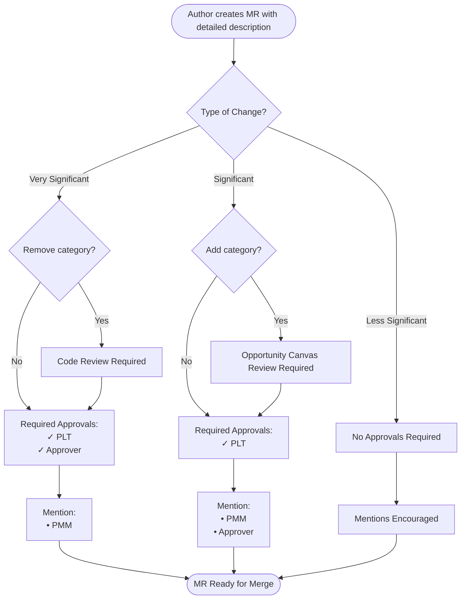
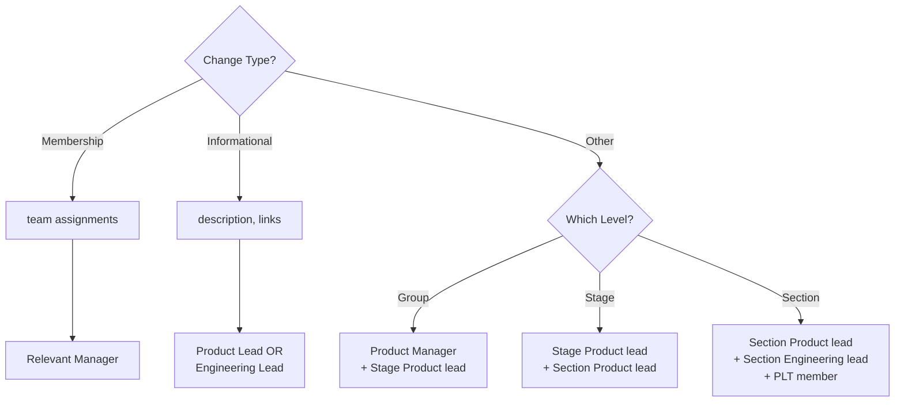

{}

## Interfaces

We want intuitive interfaces both within the company and with the wider
community. This makes it more efficient for everyone to contribute or to get
a question answered. Therefore, the following interfaces are based on the
product categories defined on this page:

- [Home page](https://about.gitlab.com/)
- [Product page](https://about.gitlab.com/stages-devops-lifecycle/)
- [Product Features](https://about.gitlab.com/features/)
- [Pricing page](https://about.gitlab.com/pricing/)
- [DevOps Lifecycle](https://about.gitlab.com/stages-devops-lifecycle/)
- [DevOps Tools](https://about.gitlab.com/why-gitlab/)
- [Product Direction](https://about.gitlab.com/direction/)
- [Stage visions](https://about.gitlab.com/direction/#devops-stages)
- [Documentation](https://docs.gitlab.com/)
- [Engineering](/handbook/engineering/) Engineering Manager/Developer/Designer titles, their expertise, and department, and team names.
- [Product manager](/handbook/product/) responsibilities which are detailed on this page
- [Our pitch deck](https://gitlab.highspot.com/spots/615dd7e3911d70c4887812a7), the slides that we use to describe the company
- [Strategic marketing](/handbook/marketing/brand-and-product-marketing/product-and-solution-marketing/) specializations

## Hierarchy

The categories form a hierarchy:

1. **Sections**: Are a collection of stages. We attempt to align these logically along common workflows like Dev, Sec and Ops.
Sections are maintained in [`data/sections.yml`](https://gitlab.com/gitlab-com/www-gitlab-com/blob/master/data/sections.yml).
1. **Stages**: are maintained in [`data/stages.yml`](https://gitlab.com/gitlab-com/www-gitlab-com/blob/master/data/stages.yml).
Each stage has a corresponding [`devops::<stage>` label](https://docs.gitlab.com/development/labels/#stage-labels) under the `gitlab-org` and `gitlab-com` group.
1. **Group**: A stage has one or more [groups](/handbook/company/structure/#product-groups).
Groups are maintained in [`data/stages.yml`](https://gitlab.com/gitlab-com/www-gitlab-com/blob/master/data/stages.yml).
Each group has a corresponding [`group::<group>` label](https://docs.gitlab.com/development/labels/#group-labels) under the `gitlab-org` and `gitlab-com` group.
1. **Categories**: A group has one or more categories. Categories are high-level
capabilities that may be a standalone product at another company. e.g.
Portfolio Management. To the extent possible we should map categories to
vendor categories defined by [analysts](/handbook/marketing/brand-and-product-marketing/product-and-solution-marketing/analyst-relations/).
Categories are maintained in [`data/categories.yml`](https://gitlab.com/gitlab-com/www-gitlab-com/blob/master/data/categories.yml).
Each category has a corresponding [`Category:<Category>` label](https://docs.gitlab.com/development/labels/#category-labels) under the `gitlab-org` group.
1. **Features**: Small, discrete functionalities, such as Issue weights. Some
common features are listed within parentheses to facilitate finding
responsible PMs by keyword.
Features are maintained in [`data/features.yml`](https://gitlab.com/gitlab-com/www-gitlab-com/blob/master/data/features.yml).
It's recommended to associate [feature labels](https://docs.gitlab.com/development/labels/#feature-labels) to a category or a group with `feature_labels` in [`data/categories.yml`](https://gitlab.com/gitlab-com/www-gitlab-com/-/blob/master/data/categories.yml?ref_type=heads).

Notes:

- Groups may have scope as large as all categories in a stage, or as small as a single category within a stage, but most will form part of a stage and have a few categories in them.
- Stage, group, category, and feature labels are used by the automated triage
operation ["Stage and group labels inference from category labels"](/handbook/engineering/infrastructure-platforms/developer-experience/triage-operations/).
- We don't move categories based on capacity. We put the categories in the stages where they logically fit, from a customer perspective. If something is important and the right group doesn't have capacity for it, we adjust the hiring plan for that group, or do [global optimizations](/handbook/values/#efficiency-for-the-right-group) to get there faster.
- We don't have silos. If one group needs something in a category that is owned by another group, go ahead and contribute it.
- This hierarchy includes both paid and unpaid features.

### Naming

Anytime one hierarchy level's scope is the same as the one above or below it, they can share the same name.

For groups that have two or more categories, but not _all_ categories in a stage, the group name must be a [unique word](/handbook/communication/#mecefu-terms) or a summation of the categories they cover.

If you want to refer to a group in context of their stage you can write that as "Stage:Group". This can be useful in email signatures, job titles, and other communications. For example, "Monitor:Health" rather than "Monitor Health" or "Monitor, Health."

When naming a new stage, group, or category, you should search the handbook and main marketing website to look for other naming conflicts which could confuse customers or employees. Uniqueness is preferred if possible to help drive clarity and reduce confusion. See additional [product feature naming guidelines](/handbook/product/categories/gitlab-the-product/#factors-in-picking-a-name) as well.

### More Details

Every category listed on this page must have a link to a documentation page. Categories may also have direction and marketing page links. When linking to a category using the category name as the anchor text (such as, from the chart on the homepage), you should use the URLs in the following hierarchy:

Link the marketing page. If there's no marketing page, link to the docs. If there's no docs, link to the direction page.

### Solutions

[Solutions](/handbook/marketing/use-cases/) can consist of multiple categories and are typically used to align to a customer challenge (e.g. the need to reduce security and compliance risk) or to market segments defined by analysts such as Software Composition Analysis (SCA). Solutions are also often used to align to challenges unique to an industry vertical (e.g. financial services), or to a sales segment (e.g. SMB vs Enterprise).

Solutions typically represent a customer challenge, and we define how GitLab capabilities come together to meet that challenge, with business benefits of using our solution.

Market segments defined by analysts don't always align to GitLab stages and categories and often include multiple categories. Two most frequently encountered are:

1. Software Composition Analysis (SCA) = Dependency Scanning + License Compliance + Container Scanning
1. Enterprise Agile Planning (EAP) = Team Planning + Planning Analytics + Portfolio Management + Requirements Management

We are [intentional in not defining SCA as containing SAST and Code Quality](https://gitlab.com/gitlab-com/www-gitlab-com/merge_requests/26897#note_198503054) despite some analysts using the term to also include those categories.

### Capabilities

Capabilities can refer to stages, categories, or features, but not solutions.

### Layers

Adding more layers to the hierarchy would give it more fidelity but would hurt
usability in the following ways:

1. Harder to keep the [interfaces](#interfaces) up to date.
1. Harder to automatically update things.
1. Harder to train and test people.
1. Harder to display more levels.
1. Harder to reason, falsify, and talk about it.
1. Harder to define what level something should be in.
1. Harder to keep this page up to date.

We use this hierarchy to express our organizational structure within the Product and Engineering organizations.
Doing so serves the goals of:

- Making our groups externally recognizable as part of the DevOps lifecycle so that stakeholders can easily understand what teams might perform certain work
- Ensuring that internally we keep groups to a reasonable number of stable counterparts

As a result, it is considered an anti-pattern to how we've organized for categories to move between groups out
of concern for available capacity.

When designing the hierarchy, the number of sections should be kept small
and only grow as the company needs to re-organize for [span-of-control](/handbook/company/structure/#management-group)
reasons. i.e. each section corresponds to a Director of Engineering and a
Director of Product, so it's an expensive add. For stages, the DevOps loop
stages should not be changed at all, as they're determined from an [external](https://en.wikipedia.org/wiki/DevOps_toolchain)
source. At some point we may
change to a different established bucketing, or create our own, but that will
involve a serious cross-functional conversation. While the additional value
stages are our own construct, the loop and value stages combined are the primary
stages we talk about in our marketing, sales, etc. and they shouldn't be changed
lightly. The other stages have more flexibility as they're not currently
marketed in any way, however we should still strive to keep them as minimal as
possible. Proliferation of a large number of stages makes the product surface
area harder to reason about and communicate if/when we decide to market that
surface area. As such, they're tied 1:1 with sections so they're the
minimal number of stages that fit within our organizational structure. e.g.
Growth was a single group under Enablement until we decided to add a Director
layer for Growth; then it was promoted to a section with specialized
groups under it. The various buckets under each of the non-DevOps stages are
captured as different groups. Groups are also a non-marketing construct, so we
expand the number of groups as needed for organizational purposes. Each group
usually corresponds to a backend engineering manager and a product manager, so
it's also an expensive add and we don't create groups just for a cleaner
hierarchy; it has to be justified from a [span-of-control](/handbook/company/structure/#management-group)
perspective or limits to what one product manager can handle.

### Category Statuses

Categories can have varying level of investment and development work. There are four main investment statuses:

1. Accelerated - Top category for product strategy that has received additional investment in the next year
1. Sustained - Categories where new features will be added in the next year
1. Reduced - Categories where scope and ambition is decreased although, new features will still be added in the next year
1. Maintenance - Categories where no new features will added

Typically, product direction pages will transparently state the investment status of the category for the fiscal year based on annual product themes and investment levels.

## Changes

As changes to product sections, stages, groups, categories, and features can have a wide ranging impact, various approvals and notifications (mentions) are required.

### Roles and responsibilities

The **MR author** is responsible for ensuring that the description includes a clear [low-context](/teamops/decision-velocity/#low-context-communication) explanation of the changes, and links to other relevant issues, docs, or resources, if applicable.
Explicit approval from the relevant team members are encouraged, but not required if they have approved in a related work item.
However, the author must list and link directly to any required approvals outside of the MR.
When requesting approvals, the author should clearly state whether the approvers should also merge based on what's required.

The **approvers for sections, stages, and groups** should ensure that all relevant changes are made, and reflect the decisions of the section, stage, or group.

The **approvers for categories and features** should consist of a team within Product that has a general understanding of the product as a whole, the different sections, and how they're relevant to customers. The Pricing & Packaging team has taken on this responsibility as the "Required Approver". They are expected to flag any concerns, and ensure that any ["very significant" changes](#very-significant) have been discussed and approved by the relevant PLT member(s). For any additional requirements, the required approvers should review the description that tasks have been completed and/or a relevant issue is linked.

Due to technical limitations, Strategy & Operations team members have been added as additional codeowners where approvals are [not required](#less-significant).

### Approvals

In addition to approvals, please see the list of [notifications](#notifications-of-changes).

#### Category and Feature changes

The PLT member of the appropriate department/section should approve, and one of the [required categories and features approvers](#roles-and-responsibilities) (see above section) should either approve or be made aware depending on the situation.

##### Very significant

Requires **PLT + Required Approver approval**, mention PMM for awareness.

Examples:

1. Remove category or feature, where a code review must also be completed. See guidance on [data changes](https://gitlab.com/gitlab-com/www-gitlab-com/-/blob/master/.gitlab/issue_templates/Group-Stage-Category-Change.md#removing) and [code changes](https://gitlab.com/gitlab-org/gitlab/-/blob/master/.gitlab/issue_templates/Group-Stage-Category-Change.md#categories-changes).
1. Tier-up (move from lower to higher tier)
1. Tier-down (move from higher to lower tier)

##### Significant

Requires **PLT approval**, mention PMM and Required Approver for awareness.

Examples:

1. Add category (which should also go through an [opportunity canvas](/handbook/product/product-processes/#opportunity-canvas) review)
1. Move feature to another category

In these cases, you may ask a Strategy & Operations team member for approval.

#### Less significant

Does not require approvals, mentions are encouraged.

Examples:

1. Update description or link
1. Update feature labels

In these cases, you may ask a Strategy & Operations team member for approval.

#### Section, Stage, and Group changes

**Membership changes** (who is part of the section, stage, or group) should be approved by the relevant manager(s)
that the affected team member(s) report to.

**Informational changes** (such as description, updating links) require approval from either the relevant Product or Engineering lead.

**Other changes** to sections, stages, and groups should be approved by the relevant Product lead and the level above:

1. Group: Product Manager; plus Stage-level Product lead
1. Stage: Stage-level Product lead; plus Section-level Product lead
1. Section: Section-level Product lead, and Engineering lead; plus relevant Product Leadership Team (PLT) member

For Engineering-led sections, stages, or groups, the same applies but with Engineering leads instead.

### Notifications of changes

The list of notifications is duplicated in the [Group-Stage-Category-Change MR template](https://gitlab.com/gitlab-com/www-gitlab-com/-/blob/master/.gitlab/merge_request_templates/Group-Stage-Category-Change.md).

{}
When updating this section, ensure the template is updated as well.
{}

Mention the following people on the MR for their awareness:

1. Relevant Product lead(s) for affected Section(s), if not already an approver
1. Relevant Product Leadership Team (PLT) member(s) for affected Section(s), if not already an approver
1. Relevant Engineering lead(s), plus the Engineering lead(s) "above"
   - For example, a Group-level change, mention the Engineering lead for the Group, and the Stage the Group is in.
1. Engineering lead(s) for the affected Section(s)
1. The relevant Product Marketing Manager(s)
1. [Technical Writing counterpart(s)](/handbook/product/ux/technical-writing/#assignments-to-devops-stages-and-groups)
1. Lead (Director) of Technical Writing
1. UX Research lead
1. Lead (Director) of Product Design
1. Chief Design Officer
1. Chief Product and Marketing Officer
1. Lead (VP) of (Infrastructure) Platforms Engineering
1. Chief Technology Officer

You are encouraged to mention all relevant Product _and_ Engineering leaders that are affected.
For example, for Section changes, mention all Stage and Group level leaders.
Alternatively, you may choose to make these people aware through other communication channels.

### Team tags

Every section, stage, and group can have one or more `team_tags` in order to display:

1. the ICs who are members of each group, and
1. certain counterparts.

The names of the `*_team_tag` lives in [`data/sections.yml`](https://gitlab.com/gitlab-com/www-gitlab-com/blob/master/data/sections.yml), and [`data/stages.yml`](https://gitlab.com/gitlab-com/www-gitlab-com/blob/master/data/stages.yml) (for stages and groups). Each team member's individual `data/team_members/person/` YAML should have the relevant `team_tags` entries.

When deciding on the naming, ensure that each team tag is unique. For example, `cs_team_tag` should have a different value compared to `sre_team_tag`. If they are the same, then all team members with the tag with be displayed, duplicating the list.

Examples are shown in the [team members data README](https://gitlab.com/gitlab-com/www-gitlab-com/-/blob/master/data/team_members/person/README.md#team-tags).

## DevOps Stages

{}

## Possible future Stages

We have boundless [ambition](/handbook/product/product-principles/#how-this-impacts-planning), and we expect GitLab to continue to add new stages to the DevOps lifecycle. Below is a list of future stages we are considering:

1. Data, maybe leveraging [Meltano product](https://meltano.com/)
1. Networking, maybe leveraging some of the [open source standards for networking](https://www.linux.com/news/5-open-source-software-defined-networking-projects-know/) and/or [Terraform networking providers](https://developer.hashicorp.com/terraform/language/providers)
1. Design, we already have [design management](https://gitlab.com/groups/gitlab-org/-/epics/1445) today

## Other functionality

This list of other functionality so you can easily find the team that owns it.

### Other functionality in Developer Experience

[Developer Experience](/handbook/engineering/infrastructure-platforms/developer-experience/)

- [Reference Architectures](https://docs.gitlab.com/administration/reference_architectures/)
- [GitLab Environment Toolkit (GET)](https://gitlab.com/gitlab-org/gitlab-environment-toolkit)
- [GitLab Performance Tool (GPT)](https://gitlab.com/gitlab-org/quality/performance)
- [Performance Test Data](https://gitlab.com/gitlab-org/quality/performance-data)
- [Zero Downtime Testing Tool](https://gitlab.com/gitlab-org/quality/zero-downtime-testing-tool)
- [GitLab Development Kit (GDK)](https://gitlab.com/gitlab-org/gitlab-development-kit)

Internal Customers: [Gitaly](/handbook/engineering/infrastructure-platforms/tenant-scale/gitaly/), [SaaS Platforms section](/handbook/engineering/infrastructure-platforms/), [Infrastructure Department](/handbook/engineering/infrastructure/), [Support Department](/handbook/support/), [Customer Success](/handbook/customer-success/)

### Facilitated functionality

Some product areas are have a broad impact across multiple stages. Examples of this include, among others:

- Shared project views, like the [project](https://docs.gitlab.com/user/project/#projects) overview and settings page.
- Functionality specific to the [admin area](https://docs.gitlab.com/administration/settings/) and not tied to a feature belonging to a particular stage.
- UI components available through our design system, [Pajamas](https://design.gitlab.com/).
- Dashboards for displaying analytics, such as Product Analytics, Value Stream Analytics, and others.

While the mental models for these areas are maintained by specific stage groups, everyone is encouraged to contribute within the guidelines that those teams establish. For example, anyone can contribute a new setting following the established guidelines for Settings. When a contribution is submitted that does not conform to those guidelines, we merge it and "fix forward" to encourage innovation.

If you encounter an issue falling into a facilitated area:

- For issues that relate to updating the guidelines, apply the `group::category` label for the facilitating group.
- For issues that relate to adding content related to a facilitated area, apply the `group::category` label for the most closely related group. For example, when adding a new setting related to Merge Requests, apply the `group::source code` label.

### Shared responsibility functionality

There are certain product capabilities that are foundational in nature and affect or refer to horizontal components of the architecture that have an impact across functional groups and stages.

These capabilities may refer to "Facilitated Functionality" (see section above) where the mental models are owned by a particular group, while anyone can contribute. However, there may be others that will not have a clear owner because they don't fall squarely into any particular group's purview of product categories. Prime examples of this are issues related to the improvement or evolution of foundational components, frameworks and libraries that are used by several or all groups across the organization. Another example could be components created by special task groups in the past that have been since dissolved and that have not required continued development to justify the funding of a dedicated permanent group to maintain them.

Whatever the source of the functionality, rather than thinking of these components as "not having an owner", it is important to think of them as being owned by everyone through the lens of shared responsibility. "Shared responsibility" means that every group should be committed and responsible to **contribute** to their continued maintenance, improvement and innovation.

**Contribution**, in this context, may manifest in different ways:

- Triage by coordinating conversations with stakeholders from different functions and at different levels to find the right owner and/or set the right level of priority.
- Product feature scoping and UX design by fleshing out the details of implementation in requirements documents and/or mockups.
- Technical scoping and feasibility analysis for possible technical and architectural approaches to implementation
- Actual implementation and release activities

It does not mean, however, that a single group should necessarily be solely responsible for all of these activities. Multiple groups could end up collaborating in execution. This coordination however requires a careful triage of the shared responsibility issues in the issue tracker where a single [DRI](/handbook/people-group/directly-responsible-individuals/) coordinates these activities.

For more information please review [this section of the handbook](/handbook/product-development/how-we-work/issue-triage/#shared-responsibility-issues) to learn more about a decentralized approach to triaging these types of issues.

### Categories A-Z

<!-- To edit the content of the Categories index, see: https://gitlab.com/gitlab-com/www-gitlab-com/-/blob/master/data/stages.yml -->


