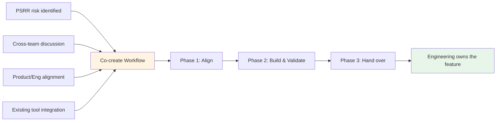

## Overview

Product Security Engineering (ProdSecEng) ships security capabilities into the GitLab product by working directly with Product and Engineering. The co-create workflow is how this happens: ProdSecEng contributes the development work, and the completed features are handed over to an Engineering team for long-term ownership.

This process supports the [Security Interlock](/handbook/security/product-security/security-platforms-architecture/security-interlock/) initiative. Product Security often identifies product changes or features needed to address high-risk problems. Rather than passing that work to Engineering teams who already have full roadmaps, ProdSecEng provides dedicated security engineering capability that stays aligned with Product and Engineering, so we can deliver the work and make sure it fits where GitLab needs the product to move.

> **Transition note (effective 1 July 2026)**
>
> Prior to July 2026, this page described four interconnected workflows covering the full lifecycle of custom security tooling: Intake, Maintenance, Co-create, and Transition & Sunset. As part of GitLab's Act 2 operating model changes, ProdSecEng's mission has shifted to focus on shipping product contributions directly. The co-create workflow is now the primary process.
>
> The Intake and Maintenance workflows are no longer accepting new work. Existing custom tooling commitments are being transitioned; transition plans are being finalised and documented in the [internal handbook tooling inventory](https://internal.gitlab.com/handbook/security/product_security/product_security_engineering/) (accessible to GitLab team members only). The legacy workflow documentation is preserved in the [Existing tooling workflows](#existing-tooling-workflows) section below for reference during the transition.

## Co-create workflow

### How co-create starts

Co-create work can originate from several places:

1. **PSRR risks**: A risk in the [Product Security Risk Register](/handbook/security/product-security/security-platforms-architecture/risk-register/) is identified as needing a product solution.
1. **Cross-team discussions**: A ProdSec team identifies a gap that could be addressed by a product feature, and collaborates with ProdSecEng to scope the work.
1. **Product and Engineering alignment**: Joint planning surfaces security capabilities that fit the product roadmap, and ProdSecEng picks up the development work.
1. **Existing tooling integration**: An internal tool's path-forward category is set to **Integrate** (see [Path-forward categories](#path-forward-categories) in the existing tooling section), and the tool's capabilities are being built into the product.

Co-create is complete once the feature is handed over to the owning Engineering team. For ongoing integration efforts (such as multi-capability tools), individual co-create cycles may complete while the broader transition continues.

### Process overview

Co-create follows three phases:

1. **[Align with Product and Engineering](#phase-1-align-with-product-and-engineering)** — Agree on what to build, how it fits into the product, and who's involved.
1. **[Build and validate](#phase-2-build-and-validate)** — Develop the feature, test it, and validate it with internal users as Customer Zero where appropriate.
1. **[Hand over to Engineering](#phase-3-hand-over-to-engineering)** — Transfer ownership of the feature to the Engineering team that will maintain it long-term.

### Phase 1: Align with Product and Engineering

Before any development work begins, ProdSecEng aligns with Product and Engineering on the approach and expected outcomes. This alignment is critical; ProdSecEng won't own these features long-term, so the owning team must agree on what's being built and how it fits into the product.

**Key activities:**

- Engage the relevant Product Manager to validate the use case and confirm product fit. Where the work originates from a PSRR entry or cross-team discussion, use that context as the starting point.
- Engage the relevant Engineering Manager to validate the technical approach and confirm the team can support reviews and eventual ownership.
- Check the [R&D Interlock roadmap](/handbook/product-development/how-we-work/r-and-d-interlock/) for existing or planned work that overlaps. Where commitments already exist, ProdSecEng can contribute to those efforts rather than proposing separate work.
- Agree on scope, including whether the feature will ship behind a feature flag, go through a PoC phase, or target general availability directly.
- Agree on rollout approach and incident ownership during the rollout period (see [Rollout and incident ownership](#rollout-and-incident-ownership) in Phase 2).

**Recording alignment**

Alignment should be documented on the co-create epic. ProdSecEng should request that the PM or EM leaves an explicit comment on the epic confirming alignment on scope and approach, including the date. This creates a clear audit trail if alignment is questioned later. If scope changes during development, re-alignment should be sought and documented the same way.

**Outputs**

1. Co-create epic created with the plan of work, risks, dependencies, and stakeholders (with RACI)
1. PM and/or EM alignment confirmed and documented on the epic
1. Issues created or linked for the development work

### Phase 2: Build and validate

#### Familiarisation

Before starting development, the team should invest time understanding the codebase they'll be working in. If the work involves integrating an existing internal tool, the team should also understand how that tool solves the problem today. This should be timeboxed and tracked as a work item so the team can make informed decisions during development. You can use [this previous work item](https://gitlab.com/gitlab-com/gl-security/product-security/product-security-engineering/product-security-engineering-team/-/work_items/367) as an example.

#### Development

ProdSecEng develops the feature following [GitLab's standard development processes](https://docs.gitlab.com/development/). This phase may be iterative; a proof of concept or feature-flagged implementation may come before a production-ready feature, depending on what was agreed in Phase 1.

**Key activities**

1. Implement the feature, including tests and documentation
1. Submit merge requests and iterate on code review with the owning Engineering team
1. Validate performance and make sure the feature meets quality standards
1. Share knowledge with the team that will eventually own the feature (deep dive sessions, documentation)
1. Validate the feature with internal users as [Customer Zero](/handbook/product/product-processes/customer-0/) as appropriate, collecting feedback from ProdSec teams where the capability is relevant to their workflows
1. Record significant design decisions using the [ADR template](https://gitlab.com/gitlab-com/gl-security/product-security/product-security-engineering/product-security-engineering-team/-/blob/main/development_templates/adr_template.md)

#### Rollout and incident ownership

If development work involves a phased rollout (feature flags, staged access), the rollout plan should be agreed in Phase 1 and documented on the co-create epic.

During rollout:

- **ProdSecEng is the DRI for rollout decisions**, including whether to pause, revert, or adjust the rollout based on issues that arise. ProdSecEng should consult the owning Engineering team in case there are broader risks or concerns to consider.
- **ProdSecEng is the SME for incidents** involving the feature, responding to SME escalations as part of [GitLab's incident process](/handbook/engineering/infrastructure-platforms/incident-management/). The owning Engineering team is consulted and should understand that additional support, resourcing, and context may be needed to address complex issues, given potential knowledge gaps. The owning Engineering team may explicitly take over incident ownership if their expertise or capacity allows a faster resolution.

These responsibilities should be clarified upfront in Phase 1 and documented on the co-create epic.

#### Maintaining alignment

Provide regular (usually weekly) status updates to stakeholders on the co-create epic. This keeps Product and Engineering aware of progress and means that if GitLab priorities or plans change, ProdSecEng hears about it before it impacts the work. If scope or approach needs to change, seek re-alignment with the PM or EM and document it on the epic.

**Outputs**

1. Feature shipped (behind a feature flag or generally available, as agreed)
1. Documentation published
1. Performance and quality validated
1. Customer Zero feedback collected and addressed (where applicable)

### Phase 3: Hand over to Engineering

ProdSecEng hands over the feature to the Engineering team that will own it long-term. The timing and scope of handover depends on what was agreed in Phase 1. Handover may happen after a feature flag is removed and the feature is generally available, or it may happen earlier if the owning team is ready to take over.

If the product feature replaces functionality from an existing internal tool, the [Transition & Sunset workflow](#transition-and-sunset-workflow) for that tool may begin during co-create. In these cases, co-create and transition run in parallel rather than sequentially. Full decommissioning of the internal tool may not happen until multiple co-create cycles are complete.

**Key activities:**

1. Confirm with the owning Engineering team that the feature meets their standards for long-term ownership
1. If the feature shipped behind a feature flag, work with the owning team on the plan for flag removal and general availability
1. Transfer any remaining context: documentation, ADRs, known issues, performance data
1. If applicable, update the [tooling inventory](https://internal.gitlab.com/handbook/security/product_security/product_security_engineering/) to reflect that the capability has been integrated into the product

**Outputs**

1. Feature owned and maintained by the Engineering team
1. If applicable, ProdSecEng's internal tooling updated or scheduled for [transition and sunset](#transition-and-sunset-workflow)
1. Tooling inventory updated (if applicable)

### Key considerations

1. **Feature parity**: The product feature doesn't need to match 100% of an internal tool's functionality (where applicable). Agree on what "good enough" looks like in Phase 1, and revisit if needed during Phase 2.
1. **Iterative delivery**: Co-create may involve multiple rounds of PoC, feature-flagged delivery, Customer Zero testing, and re-alignment before a feature is ready for general availability. This is expected.
1. **Alignment is ongoing**: Alignment isn't a one-time gate. GitLab priorities can change, and regular status updates and stakeholder communication help keep ProdSecEng's work aligned with Product and Engineering direction.
1. **ProdSecEng doesn't own product features**: Every feature built through co-create is handed over to an Engineering team. Early alignment and ongoing communication with the owning team is how this works.

---

## Existing tooling workflows

The workflows below apply to ProdSecEng's existing custom tooling commitments. As of 1 July 2026, new custom tooling requests aren't being accepted. These workflows are preserved here for reference during the transition period. See the [ProdSecEng team charter](/handbook/security/product-security/security-platforms-architecture/product-security-engineering/) for the team's current mission.

### Intake workflow

The intake workflow was the entry point for tooling and automation work that teams wanted ProdSecEng's help with. It covered net-new tooling requests and handover of existing tools. ProdSecEng evaluated each request, determined whether to build, defer, redirect, or sunset, and recorded the decision.

> **This workflow is no longer accepting new requests.** Teams with questions about existing tooling should reach out in [`#security_help`](https://gitlab.enterprise.slack.com/archives/C094L6F5D2A) on Slack.

### Maintenance and inventory prioritisation workflow

#### Purpose

The maintenance workflow ran continuously for tools that ProdSecEng maintained, from the moment intake was complete until the tool entered the transition and sunset workflow.

#### Key activities

While active, the maintenance workflow covered:

1. **Responding to issues** within defined SLO/RTO
1. **Keeping tools operational**: monitoring uptime, addressing failures, applying security patches
1. **Prioritising work**: assessing which tools should move to co-create based on criticality, product readiness, and strategic alignment
1. **Improving maintainability**: incrementally bringing tools up to the [Good/Better/Best standard](https://internal.gitlab.com/handbook/security/product_security/product_security_engineering/automation_best_practices/) (accessible to GitLab team members only)
1. **Reviewing inventory and re-assessing**: preventing tools from consuming resources when the need had moved on

#### Path-forward categories

Tools were categorised into one of the following. These categories are still referenced in the [internal handbook tooling inventory](https://internal.gitlab.com/handbook/security/product_security/product_security_engineering/) for tools being transitioned:

- **Integrate**: Clear product fit, customer value, and operating model alignment. An epic exists and an upcoming milestone is applied.
- **Maintain (KTLO)**: Keep operational while meeting the tool's documented SLO & RTO. Feature requests aren't accepted. Peer review of contributions are accepted.
- **Improve, then Integrate** or **Improve, then Maintain**: Work is required to move a tool to a different category. Feature requests are actively triaged and put on the backlog or closed.
- **Sunset**: Actively undergoing the transition and sunset workflow. Treated as "KTLO" until removed.
- **Redirect**: Ownership must transfer to another team. Feature requests aren't accepted. SLO & RTO capped at "Low".

#### SLO/RTO commitments

ProdSecEng provided different levels of support based on tool criticality. These commitments are still referenced for tools being maintained during the transition:

| Criticality | SLO (Response Time) | RTO (Recovery Time) | Example |
|-------------|---------------------|---------------------|---------|
| **Critical** | < 4 business hours | < 12 business hours | Tools blocking security releases or incident response |
| **High** | < 1 business day | < 2 business days | Tools supporting daily security operations |
| **Medium** | < 3 business days | < 2 weeks | Tools used weekly or monthly |
| **Low** | Best effort | Best effort | Experimental or rarely-used tools |

Notes:

- Service Level Objective (SLO): the time within which we aim to triage and assign an open issue. Recovery Time Objective (RTO): the time within which we aim to bring the tool back to functionality. In both cases, the clock starts when an issue is opened.
- These are target commitments and may vary based on team capacity and competing priorities.
- These times apply only to issues which prevent the proper functionality of the tool.
- "Business hours" are hours when a ProdSecEng team member is online. The team typically has coverage during 9–5 across all timezones, excluding weekends. ProdSecEng isn't "on-call".
- We don't commit to a Recovery Point Objective (RPO).

### Transition and sunset workflow

#### Purpose

The transition and sunset workflow manages the migration of internal users from internal tooling to product features, and the decommissioning of internal tools that are no longer needed.

#### When to use transition and sunset

As part of the Act 2 operating model changes, all existing tools in ProdSecEng's inventory will either be transitioned or sunset.

#### Key activities

[Open a new Sunset Tooling issue](https://gitlab.com/gitlab-com/gl-security/product-security/product-security-engineering/product-security-engineering-team/-/issues/new?description_template=sunset_tooling) which will guide you through the following activities.

1. Validate the transition or sunset decision with relevant teams
1. Identify alternative solutions: document what users should use instead (product feature, different tool, etc.)
1. If migrating users to a product feature, work with ProdSec teams to transition their workflows and validate feature parity
1. Communicate the timeline: give clear notice of when the internal tool will be decommissioned
1. Decommission infrastructure: shut down internal tool infrastructure, archive repositories, update documentation

#### Direct sunset alternative: transfer

When ProdSecEng will no longer maintain a tool and plans to sunset it, another team might be willing to own and maintain it instead. If another owner is found, open a [transfer tooling issue](https://gitlab.com/gitlab-com/gl-security/product-security/product-security-engineering/product-security-engineering-team/-/issues/new?description_template=transfer_tooling).

## Related resources

- [Product Security Engineering](/handbook/security/product-security/security-platforms-architecture/product-security-engineering/)
- [Security Interlock](/handbook/security/product-security/security-platforms-architecture/security-interlock/)
